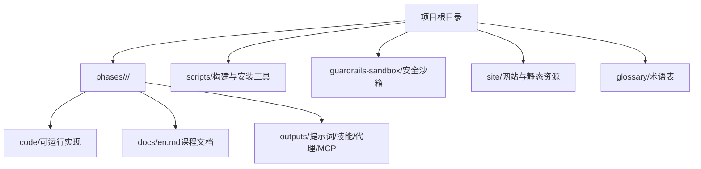
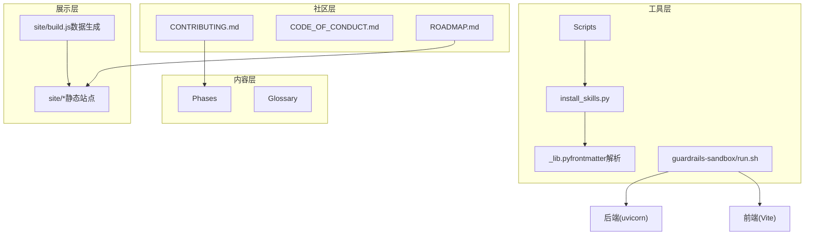
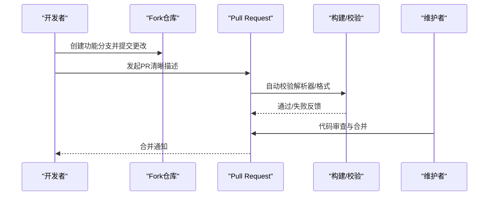
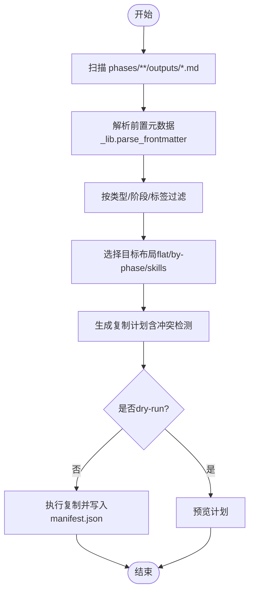
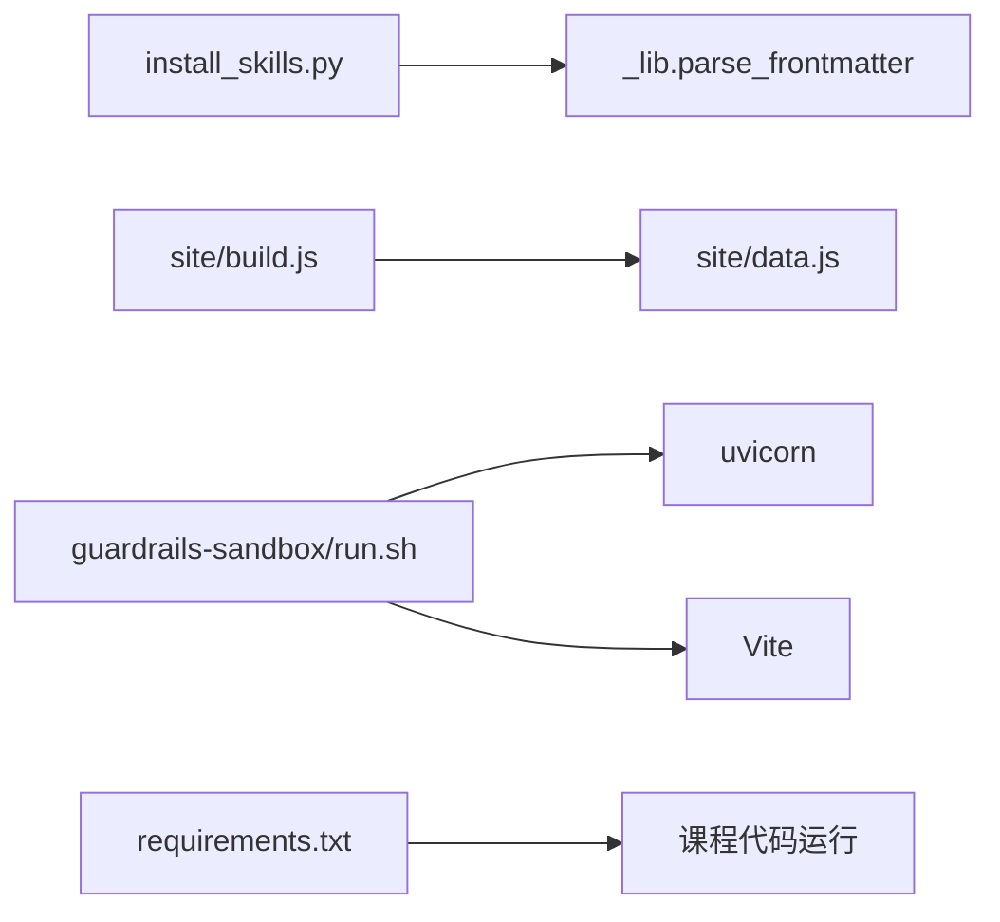

# 开发者指南

<cite>
**本文引用的文件**
- [README.md](file://README.md)
- [CONTRIBUTING.md](file://CONTRIBUTING.md)
- [CODE_OF_CONDUCT.md](file://CODE_OF_CONDUCT.md)
- [requirements.txt](file://requirements.txt)
- [ROADMAP.md](file://ROADMAP.md)
- [LESSON_TEMPLATE.md](file://LESSON_TEMPLATE.md)
- [_lib.py](file://scripts/_lib.py)
- [install_skills.py](file://scripts/install_skills.py)
- [run.sh](file://guardrails-sandbox/run.sh)
- [test_adapter.py](file://test_adapter.py)
- [quiz.json](file://phases/00-setup-and-tooling/01-dev-environment/quiz.json)
- [quiz.zh.json](file://phases/00-setup-and-tooling/01-dev-environment/quiz.zh.json)
</cite>

## 目录
1. [简介](#简介)
2. [项目结构](#项目结构)
3. [核心组件](#核心组件)
4. [架构总览](#架构总览)
5. [详细组件分析](#详细组件分析)
6. [依赖关系分析](#依赖关系分析)
7. [性能考虑](#性能考虑)
8. [故障排除指南](#故障排除指南)
9. [结论](#结论)
10. [附录](#附录)

## 简介
本指南面向希望参与“AI工程从零开始”项目的开发者，覆盖环境搭建、代码规范与最佳实践、贡献流程、构建与发布、调试与性能分析、以及社区协作等内容。项目采用线性阶段化课程体系，每个阶段由若干课程组成，每门课程包含可运行的代码、教学文档与可复用输出（提示词、技能、代理、MCP服务器等）。项目强调“从零实现再框架对比”的教学范式，并提供完善的工具链支持。

## 项目结构
项目采用“阶段-课程-产物”的三层组织方式：
- 阶段（Phase）：20个阶段，覆盖数学基础、机器学习、深度学习、计算机视觉、自然语言处理、语音音频、强化学习、大模型原理与工程、多模态、工具与协议、智能体工程、自治系统、多智能体与集群、基础设施与生产、伦理安全与对齐、毕业项目等。
- 课程（Lesson）：每门课程位于独立目录，包含代码、文档与产出。
- 产物（Outputs）：每门课程可产出提示词、技能、代理或MCP服务器等可复用资产。

图示来源
- [README.md:87-111](file://README.md#L87-L111)
- [ROADMAP.md:11-616](file://ROADMAP.md#L11-L616)

章节来源
- [README.md:87-111](file://README.md#L87-L111)
- [ROADMAP.md:11-616](file://ROADMAP.md#L11-L616)

## 核心组件
- 教学与产出体系：每门课程遵循“问题—概念—从零实现—框架对比—产出”的闭环，确保学习者既掌握原理又具备实战能力。
- 构建与安装工具：scripts/ 提供安装课程产出、生成目录、校验链接、部署等脚本；install_skills.py 支持按类型/阶段/标签筛选并安装到目标目录。
- 安全沙箱：guardrails-sandbox/ 提供后端（uvicorn）与前端（Vite）一体化本地开发与演示入口。
- 依赖清单：requirements.txt 统一列出AI相关Python依赖，便于快速安装。
- 社区与行为准则：CONTRIBUTING.md 规范贡献流程与内容格式；CODE_OF_CONDUCT.md 明确社区行为标准。

章节来源
- [README.md:161-183](file://README.md#L161-L183)
- [install_skills.py:1-292](file://scripts/install_skills.py#L1-L292)
- [requirements.txt:1-19](file://requirements.txt#L1-L19)
- [run.sh:1-35](file://guardrails-sandbox/run.sh#L1-L35)

## 架构总览
项目整体由“课程内容—工具链—网站—社区”构成，形成“学习—实践—产出—分享”的闭环。

图示来源
- [install_skills.py:1-292](file://scripts/install_skills.py#L1-L292)
- [_lib.py:1-60](file://scripts/_lib.py#L1-L60)
- [run.sh:1-35](file://guardrails-sandbox/run.sh#L1-L35)
- [CONTRIBUTING.md:1-164](file://CONTRIBUTING.md#L1-L164)
- [CODE_OF_CONDUCT.md:1-31](file://CODE_OF_CONDUCT.md#L1-L31)
- [ROADMAP.md:1-617](file://ROADMAP.md#L1-L617)

## 详细组件分析

### 环境搭建与开发工具
- Python环境与依赖
  - 使用 uv（高性能包管理器）替代 pip，提升安装与解析速度。
  - 通过 requirements.txt 安装统一的AI生态依赖（NumPy、PyTorch、Transformers、JAX、Librosa、OpenAI/Anthropic等）。
  - 推荐使用虚拟环境隔离项目依赖，避免版本冲突。
- GPU与CUDA
  - CUDA为AI工作负载提供并行计算能力，PyTorch/TensorFlow底层使用CUDA加速张量运算。
  - 通过 torch.cuda.is_available() 或 torch.backends.mps.is_available() 验证GPU可用性。
- 编辑器与终端
  - VS Code、Shell别名、Jupyter Notebook等工具在相应课程中提供配置示例。
- Docker与容器化
  - 课程提供Docker for AI的实践路径，便于在容器中复现实验环境。

章节来源
- [requirements.txt:1-19](file://requirements.txt#L1-L19)
- [quiz.json:1-65](file://phases/00-setup-and-tooling/01-dev-environment/quiz.json#L1-L65)
- [quiz.zh.json:1-65](file://phases/00-setup-and-tooling/01-dev-environment/quiz.zh.json#L1-L65)

### 代码规范与最佳实践
- 文档与结构
  - 课程文档遵循LESSON_TEMPLATE.md的结构：标题、问题、概念、从零实现、框架对比、产出、练习、术语、延伸阅读。
  - 输出物（提示词/技能/代理/MCP）采用YAML前置元数据块，包含name、description、phase、lesson、tags等字段。
- 代码风格
  - 代码应可直接运行且无注释，解释性内容放入文档。
  - 优先选择最适合的语言实现（如TypeScript/Rust在某些场景更优）。
  - 先从零实现，再展示框架版本，帮助理解原理。
- 内容质量
  - 避免AI“填充词”，保持直白、实用的写作风格。
  - 保持与网站解析器兼容的表格与状态标记格式。

章节来源
- [LESSON_TEMPLATE.md:1-134](file://LESSON_TEMPLATE.md#L1-L134)
- [CONTRIBUTING.md:136-164](file://CONTRIBUTING.md#L136-L164)

### 贡献流程
- 新增课程
  - 在 phases/XX-*/NN-*/ 下创建 code/docs/outputs 子目录，按模板编写文档与实现。
  - 产出物需包含YAML前置元数据块，确保被 install_skills.py 正确识别。
- 翻译与修复
  - 支持新增翻译文件（如 zh.md），保持与英文版结构一致。
  - 修复错误、改进解释、更新过时信息均欢迎。
- 提交与评审
  - 每个PR聚焦单一贡献，确保评审高效。
  - 修改 README/ROADMAP/glossary/terms.md 时，需保持解析器所需的格式与状态标记。
  - 运行 site/build.js 生成 site/data.js 并确认仅时间戳变化。

图示来源
- [CONTRIBUTING.md:145-156](file://CONTRIBUTING.md#L145-L156)
- [ROADMAP.md:1-617](file://ROADMAP.md#L1-L617)

章节来源
- [CONTRIBUTING.md:25-156](file://CONTRIBUTING.md#L25-L156)
- [ROADMAP.md:1-617](file://ROADMAP.md#L1-L617)

### 构建系统与自动化
- 安装课程产出
  - install_skills.py 支持按类型（skill/prompt/agent/all）、阶段过滤、标签过滤、布局（flat/by-phase/skills）安装到目标目录，并生成 manifest.json。
  - 解析器使用 _lib.py 的 parse_frontmatter 实现YAML子集解析。
- 网站构建
  - site/build.js 解析 README/ROADMAP/glossary/terms.md 生成 site/data.js；修改上述文件后需运行该脚本。
- 沙箱运行
  - guardrails-sandbox/run.sh 同时启动后端（uvicorn）与前端（Vite），并自动代理 /api 到后端。

图示来源
- [install_skills.py:91-136](file://scripts/install_skills.py#L91-L136)
- [_lib.py:12-59](file://scripts/_lib.py#L12-L59)
- [install_skills.py:174-191](file://scripts/install_skills.py#L174-L191)
- [install_skills.py:229-287](file://scripts/install_skills.py#L229-L287)

章节来源
- [install_skills.py:1-292](file://scripts/install_skills.py#L1-L292)
- [_lib.py:1-60](file://scripts/_lib.py#L1-L60)
- [run.sh:1-35](file://guardrails-sandbox/run.sh#L1-L35)

### 调试技巧与性能分析
- 调试
  - 使用 Jupyter Notebook 快速实验与验证假设。
  - 通过 torch.cuda.is_available()/torch.backends.mps.is_available() 验证GPU可用性。
  - 对于LoRA适配器加载与推理，参考 test_adapter.py 的最小可运行示例。
- 性能
  - 优先使用 uv 替代 pip，显著提升依赖安装与解析速度。
  - 在课程中逐步引入框架版本，对比实现与框架差异，理解性能优化点（如注意力变体、分布式训练等）。
- 日志与可观测性
  - 结合课程中的评估与监控方法，建立端到端的性能基线与回归检测。

章节来源
- [requirements.txt:1-19](file://requirements.txt#L1-L19)
- [test_adapter.py:1-24](file://test_adapter.py#L1-L24)

### 社区参与指南
- 行为准则
  - 尊重、包容、建设性反馈，遵守 CODE_OF_CONDUCT.md。
- 贡献方式
  - 新增课程、翻译、修复、练习与项目扩展均可贡献。
  - 保持每次PR单一主题，便于快速评审与计数。
- 沟通渠道
  - 通过 GitHub Issues/Pull Requests 参与讨论与协作。
  - 关注 ROADMAP.md 的进度状态，认领尚未完成的课程。

章节来源
- [CODE_OF_CONDUCT.md:1-31](file://CODE_OF_CONDUCT.md#L1-L31)
- [CONTRIBUTING.md:1-164](file://CONTRIBUTING.md#L1-L164)
- [ROADMAP.md:1-617](file://ROADMAP.md#L1-L617)

## 依赖关系分析
- 课程产出依赖
  - install_skills.py 依赖 _lib.py 的前置元数据解析能力。
  - 网站构建依赖 site/build.js 解析 README/ROADMAP/glossary/terms.md。
- 运行时依赖
  - requirements.txt 统一声明AI生态依赖，确保课程代码可运行。
- 开发工具依赖
  - uv 替代 pip，提升安装效率；Vite 与 uVicorn 分别支撑前端与后端开发。

图示来源
- [install_skills.py:37-38](file://scripts/install_skills.py#L37-L38)
- [requirements.txt:1-19](file://requirements.txt#L1-L19)
- [run.sh:14-23](file://guardrails-sandbox/run.sh#L14-L23)

章节来源
- [install_skills.py:1-292](file://scripts/install_skills.py#L1-L292)
- [_lib.py:1-60](file://scripts/_lib.py#L1-L60)
- [requirements.txt:1-19](file://requirements.txt#L1-L19)
- [run.sh:1-35](file://guardrails-sandbox/run.sh#L1-L35)

## 性能考虑
- 依赖安装性能
  - 使用 uv 替代 pip，显著缩短依赖解析与安装时间。
- 训练与推理性能
  - 课程中逐步引入分布式训练、注意力优化、量化与推理优化等主题，建议结合实际硬件（CPU/GPU/TPU）进行基准测试。
- 网站与工具性能
  - site/build.js 仅在必要时重建数据文件，避免不必要的变更。

## 故障排除指南
- 网站构建失败
  - 检查 README/ROADMAP/glossary/terms.md 的表格与状态标记格式是否符合解析器要求。
  - 运行 site/build.js 后，确认 site/data.js 仅时间戳变化。
- 安装课程产出冲突
  - install_skills.py 会在目标文件已存在时提示冲突，可通过 --force 覆盖或调整布局。
- GPU不可用
  - 使用 torch.cuda.is_available() 或 torch.backends.mps.is_available() 检查；若不可用，确认CUDA驱动、PyTorch与GPU版本匹配。
- 沙箱无法启动
  - 确认后端与前端端口未被占用；查看 run.sh 输出的日志与PID管理。

章节来源
- [CONTRIBUTING.md:7-23](file://CONTRIBUTING.md#L7-L23)
- [install_skills.py:252-262](file://scripts/install_skills.py#L252-L262)
- [test_adapter.py:1-24](file://test_adapter.py#L1-L24)
- [run.sh:14-34](file://guardrails-sandbox/run.sh#L14-L34)

## 结论
本指南围绕环境搭建、代码规范、贡献流程、构建系统、调试与性能、以及社区协作六个维度，系统阐述了参与“AI工程从零开始”项目的实践路径。建议开发者从阶段0开始，按课程顺序推进，并利用工具链与产出体系加速学习与实践。通过严格的规范与自动化流程，项目实现了高质量内容与可持续的社区协作。

## 附录
- 术语与概念
  - 建议结合 glossary/ 术语表与课程文档中的“Key Terms”部分，建立统一的知识语义。
- 课程进度与认领
  - 通过 ROADMAP.md 查看各阶段与课程的状态，选择尚未完成的任务认领贡献。

章节来源
- [ROADMAP.md:1-617](file://ROADMAP.md#L1-L617)