# 强化学习

<cite>
**本文引用的文件**
- [强化学习阶段总览](file://phases/09-reinforcement-learning/README.md)
- [MDPs、状态、动作与奖励](file://phases/09-reinforcement-learning/01-mdps-states-actions-rewards/docs/en.md)
- [动态规划：策略迭代与值迭代](file://phases/09-reinforcement-learning/02-dynamic-programming/docs/en.md)
- [蒙特卡洛方法：从完整轨迹学习](file://phases/09-reinforcement-learning/03-monte-carlo-methods/docs/en.md)
- [时序差分：Q学习与SARSA](file://phases/09-reinforcement-learning/04-q-learning-sarsa/docs/en.md)
- [深度Q网络（DQN）](file://phases/09-reinforcement-learning/05-dqn/docs/en.md)
- [策略梯度：REINFORCE从零开始](file://phases/09-reinforcement-learning/06-policy-gradients-reinforce/docs/en.md)
- [Actor-Critic：A2C与A3C](file://phases/09-reinforcement-learning/07-actor-critic-a2c-a3c/docs/en.md)
- [近端策略优化（PPO）](file://phases/09-reinforcement-learning/08-ppo/docs/en.md)
- [奖励建模与RLHF](file://phases/09-reinforcement-learning/09-reward-modeling-rlhf/docs/en.md)
- [多智能体强化学习](file://phases/09-reinforcement-learning/10-multi-agent-rl/docs/en.md)
- [仿真到现实迁移](file://phases/09-reinforcement-learning/11-sim-to-real-transfer/docs/en.md)
- [游戏AI：AlphaZero、MuZero与LLM推理时代](file://phases/09-reinforcement-learning/12-rl-for-games/docs/en.md)
</cite>

## 目录
1. [引言](#引言)
2. [项目结构](#项目结构)
3. [核心组件](#核心组件)
4. [架构总览](#架构总览)
5. [详细组件分析](#详细组件分析)
6. [依赖关系分析](#依赖关系分析)
7. [性能考量](#性能考量)
8. [故障排查指南](#故障排查指南)
9. [结论](#结论)
10. [附录](#附录)

## 引言
本课程围绕“强化学习”构建系统性知识体系，覆盖从基础理论（马尔可夫决策过程、动态规划、蒙特卡洛）到经典算法（Q学习、SARSA、DQN），再到现代方法（策略梯度、Actor-Critic、PPO），并延展至多智能体强化学习、仿真到现实迁移、游戏AI以及与大语言模型结合的奖励建模与RLHF。课程强调“理论与实践并重”，通过循序渐进的实验与代码实现，帮助学习者建立从概念到工程落地的完整能力。

## 项目结构
强化学习课程位于 phases/09-reinforcement-learning 下，按主题划分为若干小节，每节包含：
- 文档：英文教学文档，阐述概念、算法与实践要点
- 代码：最小可运行示例（main.py）
- 输出：技能卡片（skill-*），用于输出学习成果与诊断清单

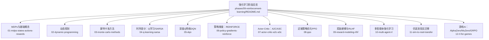

图示来源
- [强化学习阶段总览:1-6](file://phases/09-reinforcement-learning/README.md#L1-L6)

章节来源
- [强化学习阶段总览:1-6](file://phases/09-reinforcement-learning/README.md#L1-L6)

## 核心组件
- 马尔可夫决策过程（MDP）：定义状态、动作、转移概率、奖励与折扣因子，并给出策略、回报、价值函数与Q函数的数学框架。
- 动态规划（DP）：在已知模型下，通过策略迭代与值迭代求解最优策略与价值函数。
- 蒙特卡洛（MC）：仅使用采样轨迹进行策略评估与控制，强调无模型与在线更新。
- 时序差分（TD）：一步自举更新，连接MC与DP；Q学习与SARSA是典型代表。
- 深度强化学习：DQN引入经验回放、目标网络与奖励裁剪，稳定神经网络Q学习。
- 策略梯度：直接参数化策略，REINFORCE通过得分函数估计策略梯度。
- Actor-Critic：用Critic降低方差，A2C同步、A3C异步，GAE统一优势估计。
- PPO：以重要性比裁剪替代硬约束，实现多轮复用数据的稳健更新。
- 奖励建模与RLHF：从人类偏好学习奖励模型，再以PPO或DPO进行策略优化。
- 多智能体RL：处理非平稳环境，采用独立学习、集中训练分散执行、自博弈与联盟赛制。
- 仿真到现实迁移：通过领域随机化、系统辨识与领域适应，缩小仿真与真实差距。
- 游戏AI与LLM推理：AlphaZero/MuZero的搜索增强范式，以及GRPO在数学/代码推理中的应用。

章节来源
- [MDPs、状态、动作与奖励:1-193](file://phases/09-reinforcement-learning/01-mdps-states-actions-rewards/docs/en.md#L1-L193)
- [动态规划：策略迭代与值迭代:1-209](file://phases/09-reinforcement-learning/02-dynamic-programming/docs/en.md#L1-L209)
- [蒙特卡洛方法：从完整轨迹学习:1-209](file://phases/09-reinforcement-learning/03-monte-carlo-methods/docs/en.md#L1-L209)
- [时序差分：Q学习与SARSA:1-189](file://phases/09-reinforcement-learning/04-q-learning-sarsa/docs/en.md#L1-L189)
- [深度Q网络（DQN）:1-205](file://phases/09-reinforcement-learning/05-dqn/docs/en.md#L1-L205)
- [策略梯度：REINFORCE从零开始:1-203](file://phases/09-reinforcement-learning/06-policy-gradients-reinforce/docs/en.md#L1-L203)
- [Actor-Critic：A2C与A3C:1-194](file://phases/09-reinforcement-learning/07-actor-critic-a2c-a3c/docs/en.md#L1-L194)
- [近端策略优化（PPO）:1-206](file://phases/09-reinforcement-learning/08-ppo/docs/en.md#L1-L206)
- [奖励建模与RLHF:1-240](file://phases/09-reinforcement-learning/09-reward-modeling-rlhf/docs/en.md#L1-L240)
- [多智能体强化学习:1-185](file://phases/09-reinforcement-learning/10-multi-agent-rl/docs/en.md#L1-L185)
- [仿真到现实迁移:1-154](file://phases/09-reinforcement-learning/11-sim-to-real-transfer/docs/en.md#L1-L154)
- [游戏AI：AlphaZero、MuZero与LLM推理时代:1-225](file://phases/09-reinforcement-learning/12-rl-for-games/docs/en.md#L1-L225)

## 架构总览
以下序列图展示了从基础MDP到现代策略梯度与PPO的整体流程，体现“先模型、后采样、再深度近似”的演进路径。

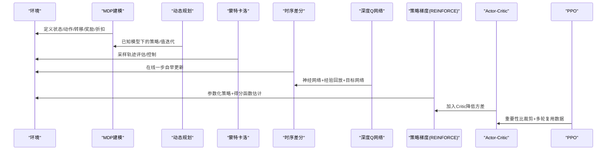

图示来源
- [MDPs、状态、动作与奖励:1-193](file://phases/09-reinforcement-learning/01-mdps-states-actions-rewards/docs/en.md#L1-L193)
- [动态规划：策略迭代与值迭代:1-209](file://phases/09-reinforcement-learning/02-dynamic-programming/docs/en.md#L1-L209)
- [蒙特卡洛方法：从完整轨迹学习:1-209](file://phases/09-reinforcement-learning/03-monte-carlo-methods/docs/en.md#L1-L209)
- [时序差分：Q学习与SARSA:1-189](file://phases/09-reinforcement-learning/04-q-learning-sarsa/docs/en.md#L1-L189)
- [深度Q网络（DQN）:1-205](file://phases/09-reinforcement-learning/05-dqn/docs/en.md#L1-L205)
- [策略梯度：REINFORCE从零开始:1-203](file://phases/09-reinforcement-learning/06-policy-gradients-reinforce/docs/en.md#L1-L203)
- [Actor-Critic：A2C与A3C:1-194](file://phases/09-reinforcement-learning/07-actor-critic-a2c-a3c/docs/en.md#L1-L194)
- [近端策略优化（PPO）:1-206](file://phases/09-reinforcement-learning/08-ppo/docs/en.md#L1-L206)

## 详细组件分析

### 组件A：马尔可夫决策过程（MDP）
- 核心对象：状态S、动作A、转移P(s'|s,a)、奖励R(s,a,s')、折扣γ
- 关键概念：策略π(a|s)、回报Gt、状态价值Vπ(s)、动作价值Qπ(s,a)、贝尔曼方程
- 实践要点：确保状态的马尔可夫性质；合理设计奖励；选择合适的γ；避免γ≥1导致值发散

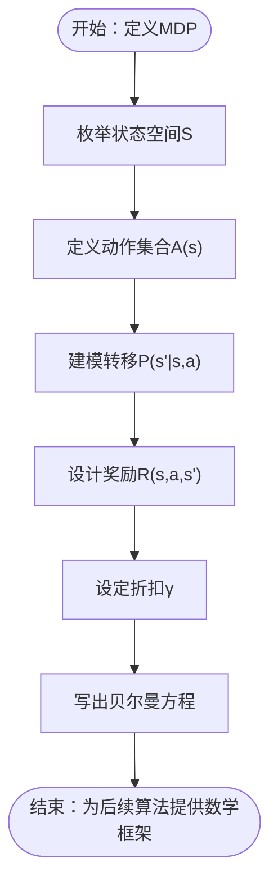

图示来源
- [MDPs、状态、动作与奖励:1-193](file://phases/09-reinforcement-learning/01-mdps-states-actions-rewards/docs/en.md#L1-L193)

章节来源
- [MDPs、状态、动作与奖励:1-193](file://phases/09-reinforcement-learning/01-mdps-states-actions-rewards/docs/en.md#L1-L193)

### 组件B：动态规划（DP）
- 策略迭代：交替执行策略评估（计算Vπ）与策略改进（对Vπ贪心）
- 值迭代：直接对贝尔曼最优算子迭代，收敛到V*
- 收敛条件：在一致范数下满足压缩映射；γ<1保证唯一不动点与几何收敛

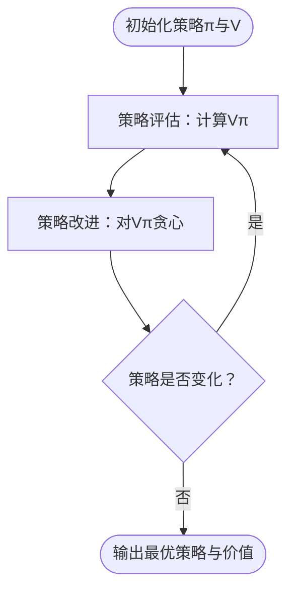

图示来源
- [动态规划：策略迭代与值迭代:1-209](file://phases/09-reinforcement-learning/02-dynamic-programming/docs/en.md#L1-L209)

章节来源
- [动态规划：策略迭代与值迭代:1-209](file://phases/09-reinforcement-learning/02-dynamic-programming/docs/en.md#L1-L209)

### 组件C：蒙特卡洛（MC）
- 思路：从完整轨迹中估计价值，首次访问与每次访问两种方式
- 控制：ε-贪婪策略在MC中需要额外探索机制（探索起点、ε-贪婪、重要性采样）
- 方差与样本效率：MC使用全回报，方差高；需足够样本覆盖所有状态

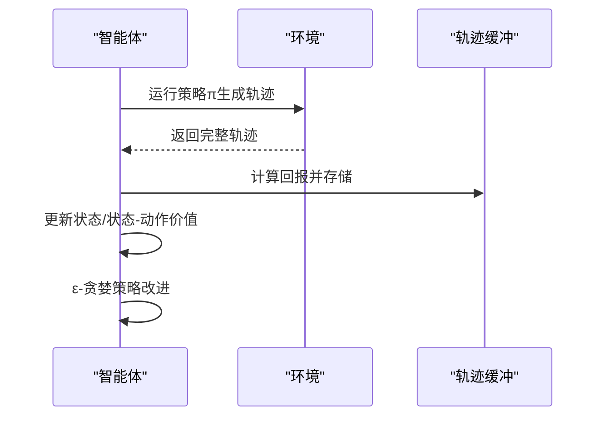

图示来源
- [蒙特卡洛方法：从完整轨迹学习:1-209](file://phases/09-reinforcement-learning/03-monte-carlo-methods/docs/en.md#L1-L209)

章节来源
- [蒙特卡洛方法：从完整轨迹学习:1-209](file://phases/09-reinforcement-learning/03-monte-carlo-methods/docs/en.md#L1-L209)

### 组件D：时序差分（TD）与Q学习/SARSA
- TD(0)：一步自举更新，使用当前估计作为目标
- Q学习：离策略，使用max引导目标，易产生过估计偏差
- SARSA：在策略内更新，更保守；适合部署期仍有探索噪声的情况
- n步TD与GAE：在MC与TD之间插值，平衡偏差与方差

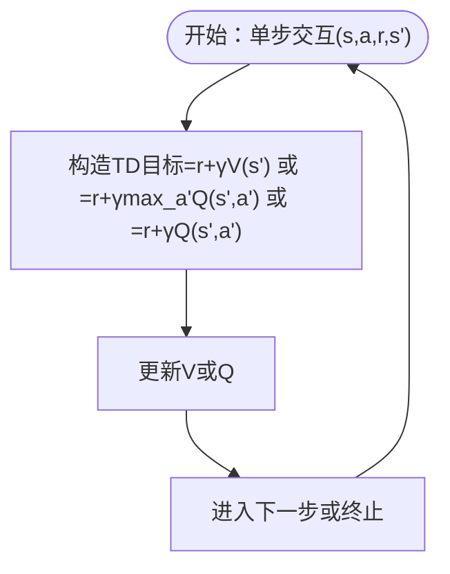

图示来源
- [时序差分：Q学习与SARSA:1-189](file://phases/09-reinforcement-learning/04-q-learning-sarsa/docs/en.md#L1-L189)

章节来源
- [时序差分：Q学习与SARSA:1-189](file://phases/09-reinforcement-learning/04-q-learning-sarsa/docs/en.md#L1-L189)

### 组件E：深度Q网络（DQN）
- 三要素：经验回放、目标网络、奖励裁剪
- 死亡三元组：函数逼近+自举+离策略，DQN通过上述技巧缓解发散
- 双重DQN：在线网选动作、目标网估价值，缓解最大化的过估计

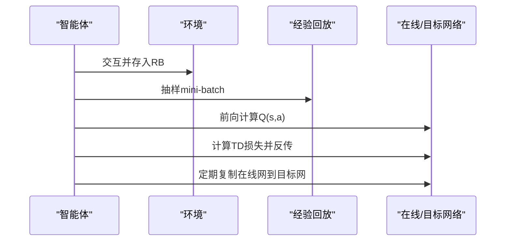

图示来源
- [深度Q网络（DQN）:1-205](file://phases/09-reinforcement-learning/05-dqn/docs/en.md#L1-L205)

章节来源
- [深度Q网络（DQN）:1-205](file://phases/09-reinforcement-learning/05-dqn/docs/en.md#L1-L205)

### 组件F：策略梯度与REINFORCE
- 策略梯度定理：∇J(θ)=E[Σt Gt·∇θ log π(a_t|s_t)]
- 方差控制：基线减除、奖励到走（reward-to-go）、熵正则
- 适用场景：连续动作、需要随机策略、与Actor-Critic结合

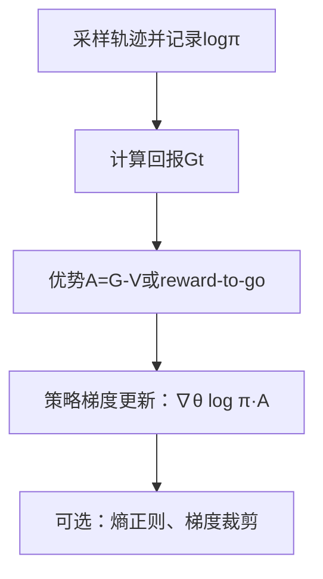

图示来源
- [策略梯度：REINFORCE从零开始:1-203](file://phases/09-reinforcement-learning/06-policy-gradients-reinforce/docs/en.md#L1-L203)

章节来源
- [策略梯度：REINFORCE从零开始:1-203](file://phases/09-reinforcement-learning/06-policy-gradients-reinforce/docs/en.md#L1-L203)

### 组件G：Actor-Critic与A2C/A3C
- 两网络合一：Actor（策略）+ Critic（价值），TD残差作为优势
- GAE：指数加权的n步优势平均，平衡偏差与方差
- 并行化：A3C异步、A2C批量化，2026主流为A2C

```mermaid
graph LR
A["Actor(策略)"] <- --> C["Critic(价值)"]
A -. 使用优势 .-> C
A -. 低方差指导 .-> A
```

图示来源
- [Actor-Critic：A2C与A3C:1-194](file://phases/09-reinforcement-learning/07-actor-critic-a2c-a3c/docs/en.md#L1-L194)

章节来源
- [Actor-Critic：A2C与A3C:1-194](file://phases/09-reinforcement-learning/07-actor-critic-a2c-a3c/docs/en.md#L1-L194)

### 组件H：PPO
- 重要性比裁剪：min(r·A, clip(r,1±ε)·A)，多轮复用数据
- 诊断指标：KL、裁剪比例、解释方差
- 适用范围：机器人控制、离散/连续动作、RLHF

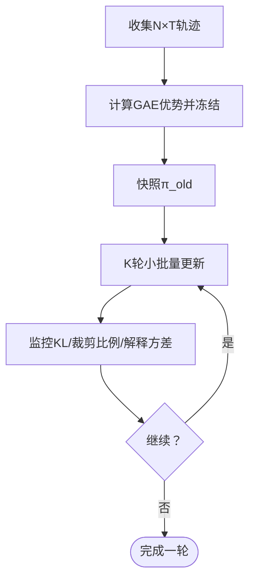

图示来源
- [近端策略优化（PPO）:1-206](file://phases/09-reinforcement-learning/08-ppo/docs/en.md#L1-L206)

章节来源
- [近端策略优化（PPO）:1-206](file://phases/09-reinforcement-learning/08-ppo/docs/en.md#L1-L206)

### 组件I：奖励建模与RLHF
- 三阶段：SFT → RM（BT配对损失）→ PPO（KL惩罚到参考策略）
- 2026趋势：DPO逐步替代PPO；GRPO用于推理任务
- 关键风险：奖励黑客、长度劫持、KL调节

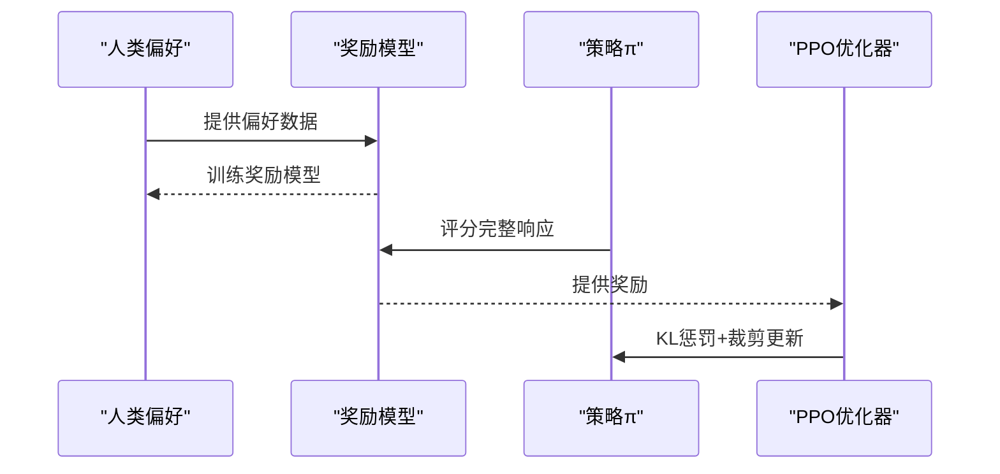

图示来源
- [奖励建模与RLHF:1-240](file://phases/09-reinforcement-learning/09-reward-modeling-rlhf/docs/en.md#L1-L240)

章节来源
- [奖励建模与RLHF:1-240](file://phases/09-reinforcement-learning/09-reward-modeling-rlhf/docs/en.md#L1-L240)

### 组件J：多智能体强化学习（MARL）
- 核心挑战：非平稳性、信用分配、探索协调、可扩展性、部分可观测
- 四类范式：独立学习、集中训练分散执行（CTDE）、自博弈、联盟赛制
- 应用：协作导航、自动驾驶车队、电子竞技、LLM多智能体

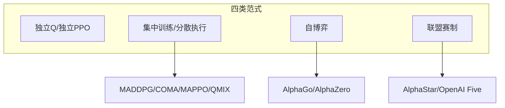

图示来源
- [多智能体强化学习:1-185](file://phases/09-reinforcement-learning/10-multi-agent-rl/docs/en.md#L1-L185)

章节来源
- [多智能体强化学习:1-185](file://phases/09-reinforcement-learning/10-multi-agent-rl/docs/en.md#L1-L185)

### 组件K：仿真到现实迁移（Sim-to-Real）
- 三大手段：领域随机化（DR）、系统辨识（SI）、领域适应（DA）
- 2026主流：大规模并行仿真+DR+教师-学生蒸馏+安全保护
- 关键陷阱：过度随机化、参数空间误判、学生无法实现教师策略

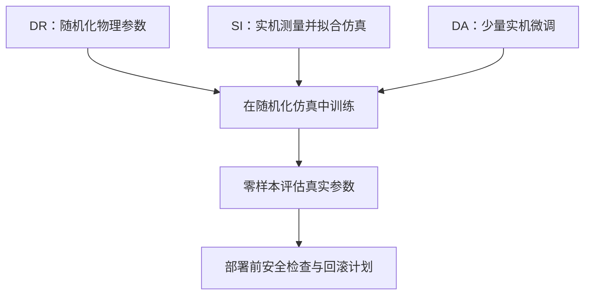

图示来源
- [仿真到现实迁移:1-154](file://phases/09-reinforcement-learning/11-sim-to-real-transfer/docs/en.md#L1-L154)

章节来源
- [仿真到现实迁移:1-154](file://phases/09-reinforcement-learning/11-sim-to-real-transfer/docs/en.md#L1-L154)

### 组件L：游戏AI与LLM推理（AlphaZero/MuZero/GRPO）
- AlphaZero/MuZero：规则已知/未知时的自博弈+树搜索+策略提升
- GRPO：无需Critic的“组相对优势”范式，适用于数学/代码推理
- R1四阶段：冷启动SFT → 推理导向GRPO → 拒绝采样+SFT → 全谱GRPO

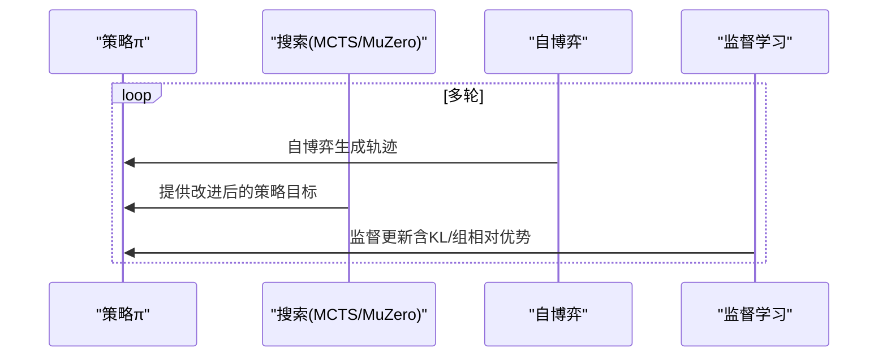

图示来源
- [游戏AI：AlphaZero、MuZero与LLM推理时代:1-225](file://phases/09-reinforcement-learning/12-rl-for-games/docs/en.md#L1-L225)

章节来源
- [游戏AI：AlphaZero、MuZero与LLM推理时代:1-225](file://phases/09-reinforcement-learning/12-rl-for-games/docs/en.md#L1-L225)

## 依赖关系分析
- 知识依赖：MDP → DP → MC → TD → DQN → PG → AC → PPO
- 工具依赖：经验回放、目标网络、GAE、奖励建模、自博弈、联盟赛制、DR/DA/SI
- 数据与计算：轨迹采样、批处理、并行环境、大规模仿真

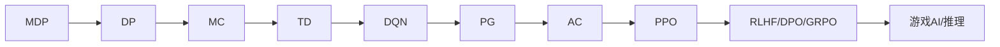

图示来源
- [MDPs、状态、动作与奖励:1-193](file://phases/09-reinforcement-learning/01-mdps-states-actions-rewards/docs/en.md#L1-L193)
- [动态规划：策略迭代与值迭代:1-209](file://phases/09-reinforcement-learning/02-dynamic-programming/docs/en.md#L1-L209)
- [蒙特卡洛方法：从完整轨迹学习:1-209](file://phases/09-reinforcement-learning/03-monte-carlo-methods/docs/en.md#L1-L209)
- [时序差分：Q学习与SARSA:1-189](file://phases/09-reinforcement-learning/04-q-learning-sarsa/docs/en.md#L1-L189)
- [深度Q网络（DQN）:1-205](file://phases/09-reinforcement-learning/05-dqn/docs/en.md#L1-L205)
- [策略梯度：REINFORCE从零开始:1-203](file://phases/09-reinforcement-learning/06-policy-gradients-reinforce/docs/en.md#L1-L203)
- [Actor-Critic：A2C与A3C:1-194](file://phases/09-reinforcement-learning/07-actor-critic-a2c-a3c/docs/en.md#L1-L194)
- [近端策略优化（PPO）:1-206](file://phases/09-reinforcement-learning/08-ppo/docs/en.md#L1-L206)
- [奖励建模与RLHF:1-240](file://phases/09-reinforcement-learning/09-reward-modeling-rlhf/docs/en.md#L1-L240)
- [游戏AI：AlphaZero、MuZero与LLM推理时代:1-225](file://phases/09-reinforcement-learning/12-rl-for-games/docs/en.md#L1-L225)

## 性能考量
- 收敛速度与样本效率：DP为基准；MC方差高但可扩展；TD在在线与低方差间折中；DQN通过回放缓冲与目标网络稳定训练；PPO通过裁剪与多轮复用提高样本效率
- 方差与偏差：MC偏向低偏差高方差；TD在一步自举处引入偏差但显著降方差；PPO通过优势归一化与裁剪平衡二者
- 计算成本：大规模并行仿真（如Isaac Lab/Mujoco MJX）显著缩短训练时间；GRPO减少Critic与MCTS开销
- 数值稳定性：经验回放容量、目标网络同步频率、奖励裁剪、梯度裁剪、优势归一化、log概率数值稳定

## 故障排查指南
- MDP建模
  - 状态非马尔可夫：增加帧堆叠或使用循环状态（LSTM/GRU）
  - 奖励稀疏：引入中间信号或模仿预训练
  - 奖励黑客：明确以目标结果为奖励源，而非代理奖励
  - γ设置错误：无限时域任务使用γ<1并限制有限时域
- 动态规划
  - 终止状态处理：吸收态不参与更新
  - 收敛判断：使用一致范数（sup-norm）而非均方误差
  - 策略同质化：稳定tie-break策略以避免震荡
- 蒙特卡洛
  - 非终止轨迹：设置最大步长并视为失败
  - 方差过大：使用TD(λ)或GAE降低方差
  - 探索不足：ε-贪婪、探索起点或UCB
- 时序差分与DQN
  - 死亡三元组：不可移除目标网络与回放缓冲
  - 过估计：使用双重DQN或分布式Q
  - 探索衰减：从1.0降至0.01左右
- 策略梯度与Actor-Critic
  - 梯度爆炸：返回标准化、梯度裁剪
  - 熵崩溃：加入熵正则并监控熵
  - 优势归一化：每批次零均值单位方差
- PPO
  - 裁剪系数：ε=0.2为默认；过高不稳定，过低收敛慢
  - 学习率：建议线性衰减至零
  - KL与裁剪比例：监控KL与裁剪比例，避免漂移
- RLHF与奖励建模
  - 奖励黑客：停止早停、提高KL惩罚、扩大训练数据
  - 长度劫持：长度归一化或长度感知RM
  - 偏好噪声：使用一致性过滤或温度缩放
- 多智能体
  - 非平稳性：集中训练分散执行、慢学习率、轮流冻结
  - 信用分配：反事实基线或奖励塑形
  - 探索冗余：每智能体熵正则或角色条件化
- 仿真到现实
  - 过度随机化：匹配真实分布，避免过度保守
  - 参数误判：先实机测量再拟合
  - 安全边界：速率/力矩/关节限幅与应急停止

章节来源
- [MDPs、状态、动作与奖励:120-127](file://phases/09-reinforcement-learning/01-mdps-states-actions-rewards/docs/en.md#L120-L127)
- [动态规划：策略迭代与值迭代:137-144](file://phases/09-reinforcement-learning/02-dynamic-programming/docs/en.md#L137-L144)
- [蒙特卡洛方法：从完整轨迹学习:135-142](file://phases/09-reinforcement-learning/03-monte-carlo-methods/docs/en.md#L135-L142)
- [时序差分：Q学习与SARSA:113-121](file://phases/09-reinforcement-learning/04-q-learning-sarsa/docs/en.md#L113-L121)
- [深度Q网络（DQN）:125-134](file://phases/09-reinforcement-learning/05-dqn/docs/en.md#L125-L134)
- [策略梯度：REINFORCE从零开始:128-136](file://phases/09-reinforcement-learning/06-policy-gradients-reinforce/docs/en.md#L128-L136)
- [Actor-Critic：A2C与A3C:118-126](file://phases/09-reinforcement-learning/07-actor-critic-a2c-a3c/docs/en.md#L118-L126)
- [近端策略优化（PPO）:127-136](file://phases/09-reinforcement-learning/08-ppo/docs/en.md#L127-L136)
- [奖励建模与RLHF:160-168](file://phases/09-reinforcement-learning/09-reward-modeling-rlhf/docs/en.md#L160-L168)
- [多智能体强化学习:106-115](file://phases/09-reinforcement-learning/10-multi-agent-rl/docs/en.md#L106-L115)
- [仿真到现实迁移:76-84](file://phases/09-reinforcement-learning/11-sim-to-real-transfer/docs/en.md#L76-L84)

## 结论
本课程以MDP为基石，贯通DP、MC、TD、DQN、PG、AC、PPO，最终抵达RLHF、多智能体、仿真到现实与游戏AI/LLM推理前沿。通过从理论到工程的系统训练，学习者能够理解并实现从简单网格世界到复杂推理与控制任务的强化学习闭环，并具备在真实机器人与大模型场景中落地的能力。

## 附录
- 术语速查：见各章节“关键术语”
- 进一步阅读：各章节末尾的参考文献列表
- 实践建议：优先从MDP建模与DP基准开始，再过渡到MC/TD，最后进入深度与现代方法；在工程实践中始终关注方差与样本效率、KL与裁剪比例、优势归一化与数值稳定性