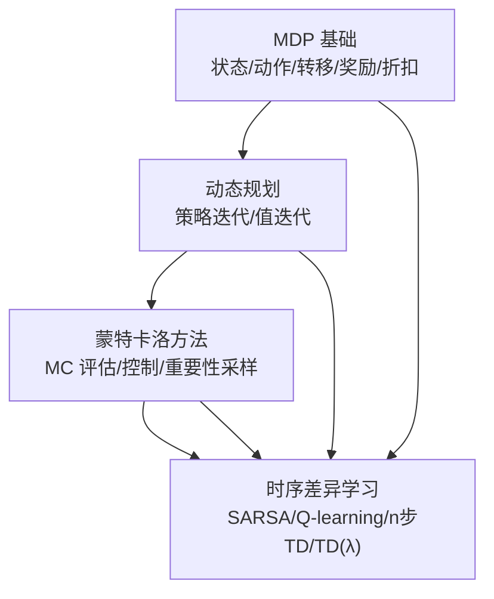
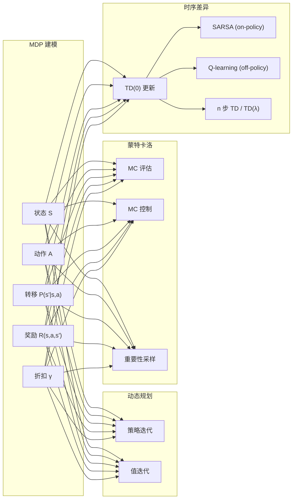
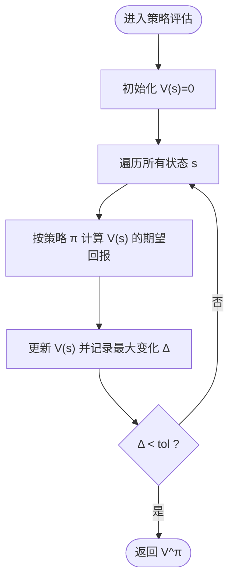
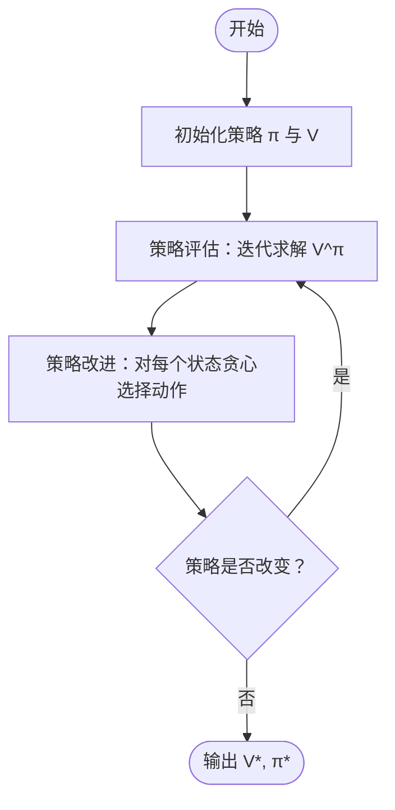
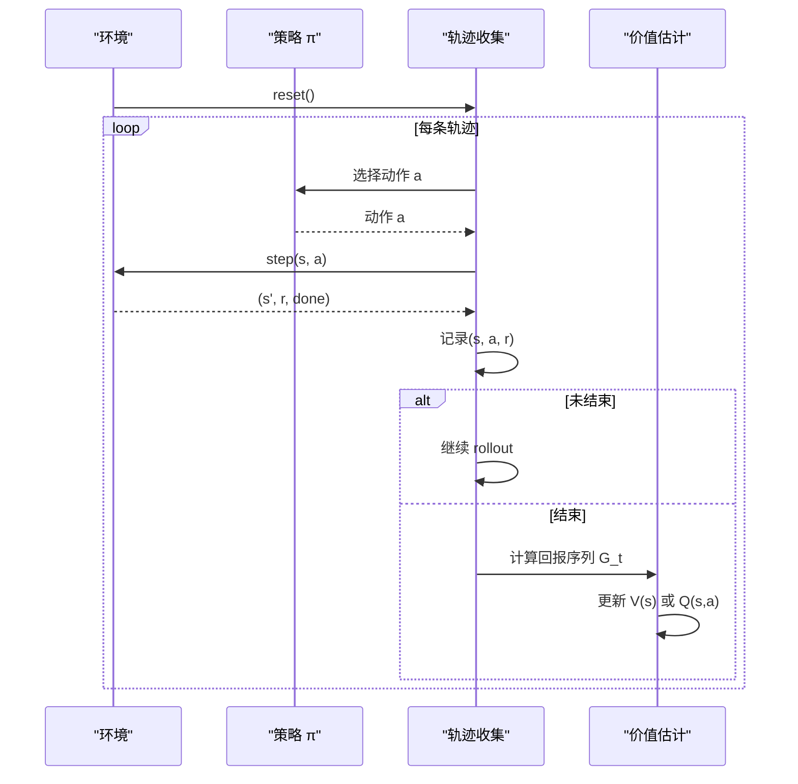
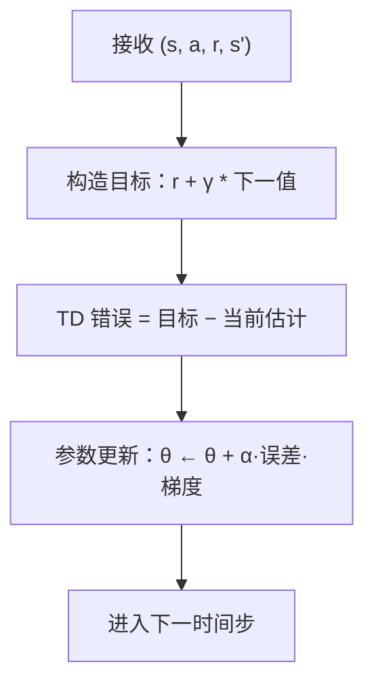
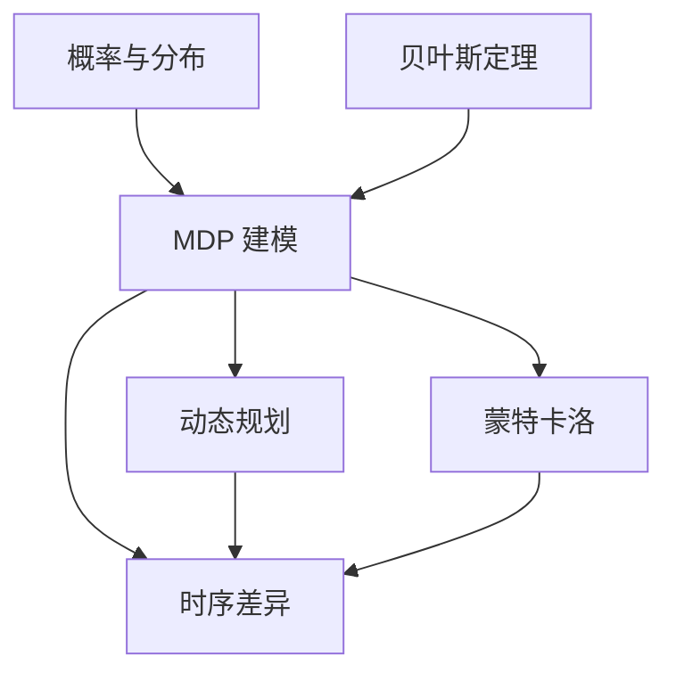

# 强化学习基础理论

<cite>
**本文引用的文件**
- [phases/09-reinforcement-learning/01-mdps-states-actions-rewards/docs/en.md](file://phases/09-reinforcement-learning/01-mdps-states-actions-rewards/docs/en.md)
- [phases/09-reinforcement-learning/01-mdps-states-actions-rewards/code/main.py](file://phases/09-reinforcement-learning/01-mdps-states-actions-rewards/code/main.py)
- [phases/09-reinforcement-learning/02-dynamic-programming/docs/en.md](file://phases/09-reinforcement-learning/02-dynamic-programming/docs/en.md)
- [phases/09-reinforcement-learning/02-dynamic-programming/code/main.py](file://phases/09-reinforcement-learning/02-dynamic-programming/code/main.py)
- [phases/09-reinforcement-learning/03-monte-carlo-methods/docs/en.md](file://phases/09-reinforcement-learning/03-monte-carlo-methods/docs/en.md)
- [phases/09-reinforcement-learning/03-monte-carlo-methods/code/main.py](file://phases/09-reinforcement-learning/03-monte-carlo-methods/code/main.py)
- [phases/09-reinforcement-learning/04-q-learning-sarsa/docs/en.md](file://phases/09-reinforcement-learning/04-q-learning-sarsa/docs/en.md)
- [phases/09-reinforcement-learning/04-q-learning-sarsa/code/main.py](file://phases/09-reinforcement-learning/04-q-learning-sarsa/code/main.py)
- [phases/01-math-foundations/06-probability-and-distributions/docs/en.md](file://phases/01-math-foundations/06-probability-and-distributions/docs/en.md)
- [phases/01-math-foundations/07-bayes-theorem/docs/en.md](file://phases/01-math-foundations/07-bayes-theorem/docs/en.md)
</cite>

## 目录
1. [引言](#引言)
2. [项目结构](#项目结构)
3. [核心组件](#核心组件)
4. [架构总览](#架构总览)
5. [详细组件分析](#详细组件分析)
6. [依赖关系分析](#依赖关系分析)
7. [性能考量](#性能考量)
8. [故障排查指南](#故障排查指南)
9. [结论](#结论)
10. [附录](#附录)

## 引言
本文件系统性梳理强化学习基础理论与实现，围绕马尔可夫决策过程（MDP）的五大要素（状态、动作、转移、奖励、折扣），深入讲解动态规划（策略迭代与值迭代）、蒙特卡洛方法、时序差异学习（SARSA 与 Q-learning），并结合仓库中的教学代码给出可运行的实现路径与可视化图示。读者将理解这些基础理论如何为后续高级算法（如深度 Q 网络、策略梯度、Actor-Critic、PPO 等）奠定根基。

## 项目结构
本阶段以“问题定义—概念讲解—动手实现—评估验证”的方式组织，共包含四个核心课程与配套代码：
- MDP 建模与基础：定义状态、动作、转移、奖励与折扣，推导贝尔曼方程，进行策略评估与直观实验。
- 动态规划：在已知模型的前提下，通过策略迭代与值迭代求解最优策略与价值函数。
- 蒙特卡洛方法：仅使用完整轨迹进行价值估计，对比首次访问与每次访问估计，引入 ε-贪心探索与重要性采样。
- 时序差异学习：在线一步更新，区分 SARSA（on-policy）与 Q-learning（off-policy），并讨论 n 步 TD 与 TD(λ) 的插值。

**章节来源**
- [phases/09-reinforcement-learning/01-mdps-states-actions-rewards/docs/en.md:1-193](file://phases/09-reinforcement-learning/01-mdps-states-actions-rewards/docs/en.md#L1-L193)
- [phases/09-reinforcement-learning/02-dynamic-programming/docs/en.md:1-209](file://phases/09-reinforcement-learning/02-dynamic-programming/docs/en.md#L1-L209)
- [phases/09-reinforcement-learning/03-monte-carlo-methods/docs/en.md:1-209](file://phases/09-reinforcement-learning/03-monte-carlo-methods/docs/en.md#L1-L209)
- [phases/09-reinforcement-learning/04-q-learning-sarsa/docs/en.md:1-189](file://phases/09-reinforcement-learning/04-q-learning-sarsa/docs/en.md#L1-L189)

## 核心组件
- 马尔可夫决策过程（MDP）
  - 状态空间 S、动作空间 A、转移概率 P(s'|s,a)、即时奖励 R(s,a,s')、折扣因子 γ。
  - 策略 π(a|s)，回报 G_t = Σ_k γ^k r_{t+k}，状态价值 V^π(s) 与动作-状态价值 Q^π(s,a)。
  - 贝尔曼分解：V^π 与 Q^π 的递归期望形式，是所有算法的理论支点。
- 动态规划（DP）
  - 策略评估：对给定策略 π，迭代求解 V^π；收敛于线性系统。
  - 策略改进：基于 V^π 构造新的贪心策略；二者交替直至策略稳定。
  - 值迭代：直接对 Bellman 最优算子迭代，收敛更快但通常迭代次数更多。
- 蒙特卡洛（MC）
  - 使用完整轨迹估计 V^π 或 Q^π；首次访问与每次访问估计。
  - ε-贪心探索与重要性采样（IS）用于离策略估计；非平稳策略下采用常步长估计。
- 时序差异（TD）
  - TD(0)：单步自举更新 r + γ V(s') − V(s)；SARSA（on-policy）与 Q-learning（off-policy）。
  - n 步 TD 与 TD(λ) 在 MC 与 TD(0) 之间插值；现代算法多采用 n 步或广义优势估计（GAE）。

**章节来源**
- [phases/09-reinforcement-learning/01-mdps-states-actions-rewards/docs/en.md:18-40](file://phases/09-reinforcement-learning/01-mdps-states-actions-rewards/docs/en.md#L18-L40)
- [phases/09-reinforcement-learning/02-dynamic-programming/docs/en.md:18-44](file://phases/09-reinforcement-learning/02-dynamic-programming/docs/en.md#L18-L44)
- [phases/09-reinforcement-learning/03-monte-carlo-methods/docs/en.md:18-50](file://phases/09-reinforcement-learning/03-monte-carlo-methods/docs/en.md#L18-L50)
- [phases/09-reinforcement-learning/04-q-learning-sarsa/docs/en.md:20-51](file://phases/09-reinforcement-learning/04-q-learning-sarsa/docs/en.md#L20-L51)

## 架构总览
下图展示从 MDP 到动态规划、蒙特卡洛与 TD 的统一框架，强调“模型 vs 采样”“自举 vs 完整回报”的权衡。

**图表来源**
- [phases/09-reinforcement-learning/01-mdps-states-actions-rewards/docs/en.md:18-40](file://phases/09-reinforcement-learning/01-mdps-states-actions-rewards/docs/en.md#L18-L40)
- [phases/09-reinforcement-learning/02-dynamic-programming/docs/en.md:22-37](file://phases/09-reinforcement-learning/02-dynamic-programming/docs/en.md#L22-L37)
- [phases/09-reinforcement-learning/03-monte-carlo-methods/docs/en.md:22-46](file://phases/09-reinforcement-learning/03-monte-carlo-methods/docs/en.md#L22-L46)
- [phases/09-reinforcement-learning/04-q-learning-sarsa/docs/en.md:24-51](file://phases/09-reinforcement-learning/04-q-learning-sarsa/docs/en.md#L24-L51)

## 详细组件分析

### 组件一：马尔可夫决策过程（MDP）与策略评估
- 数学要点
  - 贝尔曼期望方程：将当前回报拆分为“一步奖励 + 折扣未来价值”，递归定义 V^π 与 Q^π。
  - 折扣因子 γ 决定有效视野与稳定性；γ 过大可能使价值发散或信用分配噪声增大。
- 实现要点
  - 小规模网格世界：确定性或带滑倒的概率转移；常惩罚（如每步 -1）与吸收终止状态。
  - 策略评估：对每个状态按策略加权求和其后继状态的价值，迭代直到收敛。
- 可视化与实验
  - 对均匀随机策略与贪心策略分别计算 V^π，并比较不同 γ 下的状态价值分布。
  - 输出价值网格与收敛行为，帮助理解折扣对价值传播的影响。

**图表来源**
- [phases/09-reinforcement-learning/01-mdps-states-actions-rewards/code/main.py:55-72](file://phases/09-reinforcement-learning/01-mdps-states-actions-rewards/code/main.py#L55-L72)

**章节来源**
- [phases/09-reinforcement-learning/01-mdps-states-actions-rewards/docs/en.md:45-127](file://phases/09-reinforcement-learning/01-mdps-states-actions-rewards/docs/en.md#L45-L127)
- [phases/09-reinforcement-learning/01-mdps-states-actions-rewards/code/main.py:13-72](file://phases/09-reinforcement-learning/01-mdps-states-actions-rewards/code/main.py#L13-L72)

### 组件二：动态规划（策略迭代与值迭代）
- 理论基础
  - 策略评估：固定策略 π，迭代求解 V^π；收敛于线性系统。
  - 策略改进：对每个状态取使 Q^π 最大的动作，得到新策略；若策略不变则达到最优。
  - 值迭代：直接对 Bellman 最优算子迭代，收敛更快但需更多轮次。
- 实现要点
  - 模型接口：提供 transitions(s, a) 返回 (s', r, p) 列表。
  - 收敛判断：使用一致范数（如 sup-norm）与终止阈值。
  - 终止状态处理：吸收状态价值应为 0。
- 性能与陷阱
  - 状态空间爆炸：DP 适用于中小规模离散 MDP；大规模需函数逼近或稀疏表示。
  - 更新方式：原位更新（Gauss-Seidel）通常比同步更新（Jacobi）更快收敛。

**图表来源**
- [phases/09-reinforcement-learning/02-dynamic-programming/code/main.py:41-78](file://phases/09-reinforcement-learning/02-dynamic-programming/code/main.py#L41-L78)

**章节来源**
- [phases/09-reinforcement-learning/02-dynamic-programming/docs/en.md:45-144](file://phases/09-reinforcement-learning/02-dynamic-programming/docs/en.md#L45-L144)
- [phases/09-reinforcement-learning/02-dynamic-programming/code/main.py:26-93](file://phases/09-reinforcement-learning/02-dynamic-programming/code/main.py#L26-L93)

### 组件三：蒙特卡洛方法（从完整轨迹学习）
- 核心思想
  - 从策略 π 采样完整轨迹，计算回报 G_t，用均值估计 V^π 或 Q^π。
  - 首次访问（first-visit）与每次访问（every-visit）估计；前者无偏但样本效率低，后者样本效率高。
- 探索与离策略
  - 策略评估：ε-贪心或探索起点保证覆盖；策略控制：ε-贪心逐步改善策略。
  - 离策略：重要性采样（IS）从行为策略 μ 收集数据估计目标策略 π；权重随轨迹相乘，方差易爆炸。
- 实现要点
  - 回报计算：反向扫描 G_t = r + γ G_{t+1}，避免重复求和。
  - 在线估计：增量均值或常步长估计跟踪非平稳策略。

**图表来源**
- [phases/09-reinforcement-learning/03-monte-carlo-methods/code/main.py:29-97](file://phases/09-reinforcement-learning/03-monte-carlo-methods/code/main.py#L29-L97)

**章节来源**
- [phases/09-reinforcement-learning/03-monte-carlo-methods/docs/en.md:51-142](file://phases/09-reinforcement-learning/03-monte-carlo-methods/docs/en.md#L51-L142)
- [phases/09-reinforcement-learning/03-monte-carlo-methods/code/main.py:42-97](file://phases/09-reinforcement-learning/03-monte-carlo-methods/code/main.py#L42-L97)

### 组件四：时序差异学习（SARSA 与 Q-learning）
- TD(0) 更新
  - TD 错误 δ = r + γ V(s') − V(s)，在线一步自举，显著降低方差。
- SARSA（on-policy）
  - 使用实际采取的动作 a' 的 Q 值作为目标，适合安全部署场景。
- Q-learning（off-policy）
  - 使用 max_{a'} Q(s', a')，目标与行为策略解耦，便于探索；存在最大化偏差。
- n 步 TD 与 TD(λ)
  - 在 TD(0) 与 MC 之间插值；TD(λ) 对所有 n 加权平均，现代算法常用 GAE。

**图表来源**
- [phases/09-reinforcement-learning/04-q-learning-sarsa/docs/en.md:24-51](file://phases/09-reinforcement-learning/04-q-learning-sarsa/docs/en.md#L24-L51)

**章节来源**
- [phases/09-reinforcement-learning/04-q-learning-sarsa/docs/en.md:56-121](file://phases/09-reinforcement-learning/04-q-learning-sarsa/docs/en.md#L56-L121)
- [phases/09-reinforcement-learning/04-q-learning-sarsa/code/main.py:32-73](file://phases/09-reinforcement-learning/04-q-learning-sarsa/code/main.py#L32-L73)

## 依赖关系分析
- 数学基础
  - 概率与分布：事件、条件概率、贝叶斯公式、期望与方差、常见分布（伯努利、多项式、正态、泊松等）。
  - 贝叶斯定理：先验、似然、后验与证据，解释不确定性与顺序更新。
- 强化学习内部依赖
  - MDP 是一切的基础；DP 提供“黄金标准”与收敛性保证；MC/TD 提供在未知模型下的近似方案；TD 为深度强化学习的基石。

**图表来源**
- [phases/01-math-foundations/06-probability-and-distributions/docs/en.md:25-200](file://phases/01-math-foundations/06-probability-and-distributions/docs/en.md#L25-L200)
- [phases/01-math-foundations/07-bayes-theorem/docs/en.md:27-200](file://phases/01-math-foundations/07-bayes-theorem/docs/en.md#L27-L200)
- [phases/09-reinforcement-learning/01-mdps-states-actions-rewards/docs/en.md:18-40](file://phases/09-reinforcement-learning/01-mdps-states-actions-rewards/docs/en.md#L18-L40)

**章节来源**
- [phases/01-math-foundations/06-probability-and-distributions/docs/en.md:1-200](file://phases/01-math-foundations/06-probability-and-distributions/docs/en.md#L1-L200)
- [phases/01-math-foundations/07-bayes-theorem/docs/en.md:1-200](file://phases/01-math-foundations/07-bayes-theorem/docs/en.md#L1-L200)

## 性能考量
- 收敛速度与样本效率
  - DP：在小规模模型上几何收敛，但需要完整模型；适合调试与基准。
  - MC：无模型、非自举，但方差大、需完整轨迹；适合短时域任务与离线评估。
  - TD：一步自举显著降低方差，适合在线学习；SARSA 更稳健，Q-learning 收敛更快但有偏差。
- 状态空间与函数逼近
  - DP 适用于中小规模离散状态；大规模或连续状态需函数逼近（线性/神经网络）与经验回放等技巧。
- 超参数敏感性
  - γ 决定有效视野；α 决定学习步长；ε 决定探索强度；需结合任务特性与稳定性监控调整。

[本节为通用指导，不直接分析具体文件]

## 故障排查指南
- MDP 形成风险
  - 非马尔可夫状态：需显式帧堆叠或循环状态；否则策略不稳定。
  - 稀疏奖励：引入中间信号或模仿引导；避免仅靠最终结果训练。
  - 奖励黑客：以目标结果而非代理指标建模奖励；避免短期最优陷阱。
  - 折扣设定：无限时域任务需 γ < 1 或有限时域；否则价值发散。
  - 奖励尺度：归一化到 [-1,1] 左右，避免梯度爆炸。
- DP 实现陷阱
  - 忽略终止状态：吸收状态价值应为 0。
  - 收敛准则：使用一致范数（sup-norm）与阈值；避免平均误差误导。
  - 原位更新：实践中建议原位更新以加速收敛。
- MC 实现陷阱
  - 非终止轨迹：设置最大步数并正确处理截断；避免错误计数。
  - 方差问题：长轨迹方差大；考虑 TD 插值或重要性采样控制。
  - 探索不足：ε-贪心或探索起点；避免初始策略导致状态覆盖不足。
- TD 实现陷阱
  - 初始化：负奖励任务可乐观初始化鼓励探索；避免悲观初始化锁死策略。
  - 学习率与探索：常数 α 适合非平稳；ε 需 GLIE（逐步贪婪）；避免全程 ε=1。
  - 最大化偏差：Q-learning 的 max 操作易高估；可用双 Q 等方法缓解。

**章节来源**
- [phases/09-reinforcement-learning/01-mdps-states-actions-rewards/docs/en.md:120-127](file://phases/09-reinforcement-learning/01-mdps-states-actions-rewards/docs/en.md#L120-L127)
- [phases/09-reinforcement-learning/02-dynamic-programming/docs/en.md:137-144](file://phases/09-reinforcement-learning/02-dynamic-programming/docs/en.md#L137-L144)
- [phases/09-reinforcement-learning/03-monte-carlo-methods/docs/en.md:135-142](file://phases/09-reinforcement-learning/03-monte-carlo-methods/docs/en.md#L135-L142)
- [phases/09-reinforcement-learning/04-q-learning-sarsa/docs/en.md:113-121](file://phases/09-reinforcement-learning/04-q-learning-sarsa/docs/en.md#L113-L121)

## 结论
MDP 是强化学习的统一语言；DP 提供理论与实践的黄金标准；MC 与 TD 分别代表“完整回报”与“一步自举”的两种取舍；SARSA 与 Q-learning 则在 on-policy 与 off-policy 间平衡稳健性与收敛速度。掌握这些基础，即可理解后续深度强化学习与高级算法的设计动机与实现细节。

[本节为总结性内容，不直接分析具体文件]

## 附录
- 关键术语速查
  - MDP：五元组 (S, A, P, R, γ)，满足马尔可夫性质。
  - 策略 π：状态到动作的分布或确定映射。
  - 回报 G_t：从时刻 t 开始的折扣回报和。
  - 价值 V^π 与 Q^π：状态与动作-状态价值的期望回报。
  - 贝尔曼方程：价值的不动点分解。
  - 动态规划：策略评估与改进的固定点迭代。
  - 蒙特卡洛：基于完整轨迹的均值估计。
  - 时序差异：一步自举的在线更新；SARSA/on-policy；Q-learning/off-policy。
- 代码实现参考路径
  - MDP 基础与策略评估：[phases/09-reinforcement-learning/01-mdps-states-actions-rewards/code/main.py](file://phases/09-reinforcement-learning/01-mdps-states-actions-rewards/code/main.py)
  - 动态规划（策略/值迭代）：[phases/09-reinforcement-learning/02-dynamic-programming/code/main.py](file://phases/09-reinforcement-learning/02-dynamic-programming/code/main.py)
  - 蒙特卡洛（评估/控制/回报计算）：[phases/09-reinforcement-learning/03-monte-carlo-methods/code/main.py](file://phases/09-reinforcement-learning/03-monte-carlo-methods/code/main.py)
  - TD（SARSA/Q-learning）：[phases/09-reinforcement-learning/04-q-learning-sarsa/code/main.py](file://phases/09-reinforcement-learning/04-q-learning-sarsa/code/main.py)

[本节为补充说明，不直接分析具体文件]