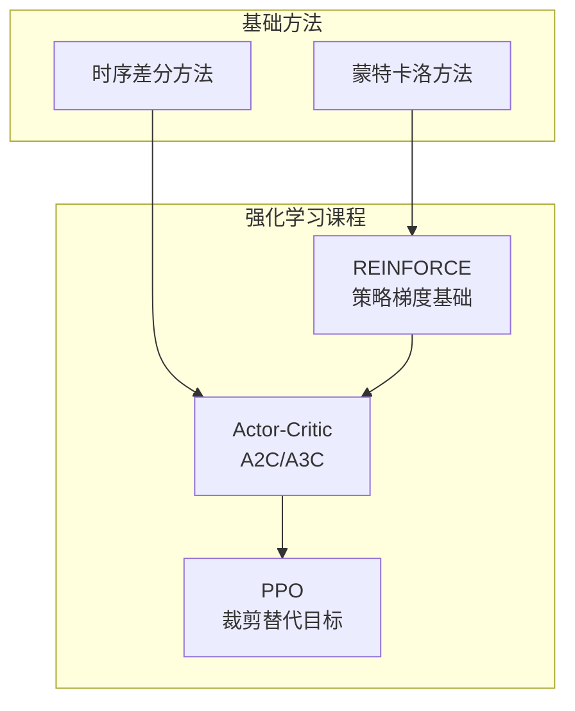
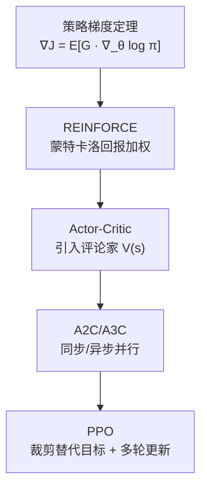
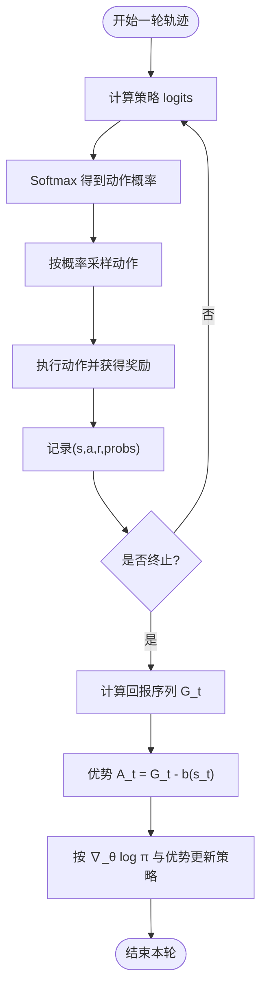
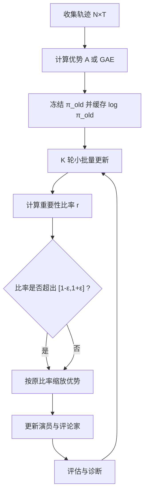
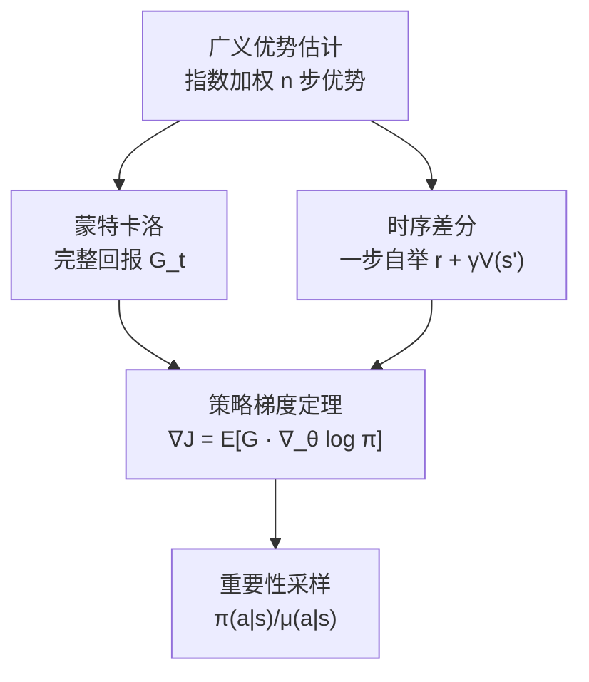
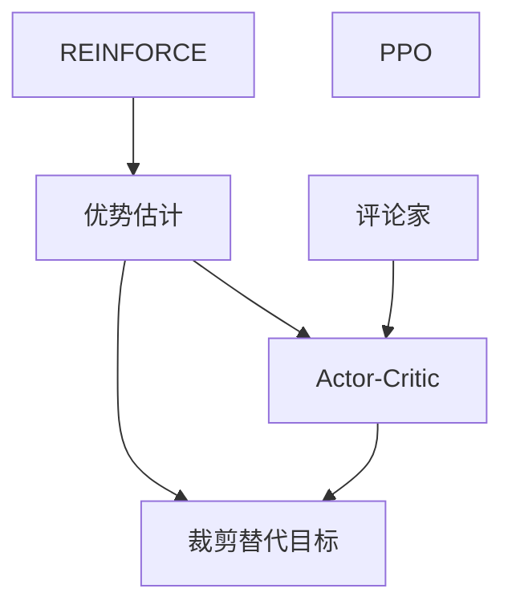

# 策略梯度方法

<cite>
**本文引用的文件**
- [phases/09-reinforcement-learning/06-policy-gradients-reinforce/docs/zh.md](file://phases/09-reinforcement-learning/06-policy-gradients-reinforce/docs/zh.md)
- [phases/09-reinforcement-learning/06-policy-gradients-reinforce/code/main.py](file://phases/09-reinforcement-learning/06-policy-gradients-reinforce/code/main.py)
- [phases/09-reinforcement-learning/07-actor-critic-a2c-a3c/docs/zh.md](file://phases/09-reinforcement-learning/07-actor-critic-a2c-a3c/docs/zh.md)
- [phases/09-reinforcement-learning/07-actor-critic-a2c-a3c/code/main.py](file://phases/09-reinforcement-learning/07-actor-critic-a2c-a3c/code/main.py)
- [phases/09-reinforcement-learning/08-ppo/docs/zh.md](file://phases/09-reinforcement-learning/08-ppo/docs/zh.md)
- [phases/09-reinforcement-learning/08-ppo/code/main.py](file://phases/09-reinforcement-learning/08-ppo/code/main.py)
- [phases/09-reinforcement-learning/03-monte-carlo-methods/docs/en.md](file://phases/09-reinforcement-learning/03-monte-carlo-methods/docs/en.md)
- [phases/09-reinforcement-learning/04-q-learning-sarsa/docs/en.md](file://phases/09-reinforcement-learning/04-q-learning-sarsa/docs/en.md)
</cite>

## 目录
1. [引言](#引言)
2. [项目结构](#项目结构)
3. [核心组件](#核心组件)
4. [架构总览](#架构总览)
5. [详细组件分析](#详细组件分析)
6. [依赖分析](#依赖分析)
7. [性能考量](#性能考量)
8. [故障排查指南](#故障排查指南)
9. [结论](#结论)
10. [附录](#附录)

## 引言
本文件系统性梳理策略梯度方法的理论与实现，围绕 REINFORCE、Actor-Critic、A2C/A3C、PPO 等核心算法展开，重点覆盖：
- 策略梯度定理与对数导数技巧
- 方差减少技术（基线、后续回报、优势估计）
- Actor-Critic 的设计动机与优势
- A2C/A3C 的并行化与分布式实现思路
- PPO 的裁剪替代目标、多轮更新与诊断指标
- 训练监控与超参数调优建议
- 算法性能分析与实际应用案例

## 项目结构
本仓库中与策略梯度相关的实现集中在“强化学习”阶段的三门课程与配套代码：
- REINFORCE（策略梯度基础与方差减少）
- Actor-Critic（A2C/A3C 的同步与异步实现）
- PPO（裁剪替代目标与多轮更新）



**图表来源**
- [phases/09-reinforcement-learning/06-policy-gradients-reinforce/docs/zh.md:1-203](file://phases/09-reinforcement-learning/06-policy-gradients-reinforce/docs/zh.md#L1-L203)
- [phases/09-reinforcement-learning/07-actor-critic-a2c-a3c/docs/zh.md:1-194](file://phases/09-reinforcement-learning/07-actor-critic-a2c-a3c/docs/zh.md#L1-L194)
- [phases/09-reinforcement-learning/08-ppo/docs/zh.md:1-206](file://phases/09-reinforcement-learning/08-ppo/docs/zh.md#L1-L206)
- [phases/09-reinforcement-learning/03-monte-carlo-methods/docs/en.md:130-209](file://phases/09-reinforcement-learning/03-monte-carlo-methods/docs/en.md#L130-L209)
- [phases/09-reinforcement-learning/04-q-learning-sarsa/docs/en.md:170-189](file://phases/09-reinforcement-learning/04-q-learning-sarsa/docs/en.md#L170-L189)

**章节来源**
- [phases/09-reinforcement-learning/06-policy-gradients-reinforce/docs/zh.md:1-203](file://phases/09-reinforcement-learning/06-policy-gradients-reinforce/docs/zh.md#L1-L203)
- [phases/09-reinforcement-learning/07-actor-critic-a2c-a3c/docs/zh.md:1-194](file://phases/09-reinforcement-learning/07-actor-critic-a2c-a3c/docs/zh.md#L1-L194)
- [phases/09-reinforcement-learning/08-ppo/docs/zh.md:1-206](file://phases/09-reinforcement-learning/08-ppo/docs/zh.md#L1-L206)
- [phases/09-reinforcement-learning/03-monte-carlo-methods/docs/en.md:130-209](file://phases/09-reinforcement-learning/03-monte-carlo-methods/docs/en.md#L130-L209)
- [phases/09-reinforcement-learning/04-q-learning-sarsa/docs/en.md:170-189](file://phases/09-reinforcement-learning/04-q-learning-sarsa/docs/en.md#L170-L189)

## 核心组件
- 策略网络（Softmax/高斯策略）
  - 离散动作：Softmax 策略，参数为状态到各动作的线性映射
  - 连续动作：高斯策略，参数为均值与方差
- 评论家网络（值函数）
  - 线性值函数或CNN+值头，用于估计状态价值 V(s)
- 优势估计
  - MC 优势：A = G - V(s)
  - TD 优势：A = r + γV(s') - V(s)
  - GAE(λ)：对 n 步优势的指数加权平均
- 更新规则
  - REINFORCE：∇J = E[G · ∇_θ log π]
  - Actor-Critic：分别更新演员（策略梯度）与评论家（值回归）
  - PPO：裁剪替代目标 L^CLIP，支持多轮小批量更新

**章节来源**
- [phases/09-reinforcement-learning/06-policy-gradients-reinforce/docs/zh.md:43-54](file://phases/09-reinforcement-learning/06-policy-gradients-reinforce/docs/zh.md#L43-L54)
- [phases/09-reinforcement-learning/07-actor-critic-a2c-a3c/docs/zh.md:24-55](file://phases/09-reinforcement-learning/07-actor-critic-a2c-a3c/docs/zh.md#L24-L55)
- [phases/09-reinforcement-learning/08-ppo/docs/zh.md:24-48](file://phases/09-reinforcement-learning/08-ppo/docs/zh.md#L24-L48)

## 架构总览
策略梯度方法的演进路径体现了从“直接策略参数化”到“演员-评论家协同”，再到“鲁棒的裁剪更新”的逐步优化。



**图表来源**
- [phases/09-reinforcement-learning/06-policy-gradients-reinforce/docs/zh.md:24-42](file://phases/09-reinforcement-learning/06-policy-gradients-reinforce/docs/zh.md#L24-L42)
- [phases/09-reinforcement-learning/07-actor-critic-a2c-a3c/docs/zh.md:14-48](file://phases/09-reinforcement-learning/07-actor-critic-a2c-a3c/docs/zh.md#L14-L48)
- [phases/09-reinforcement-learning/08-ppo/docs/zh.md:10-62](file://phases/09-reinforcement-learning/08-ppo/docs/zh.md#L10-L62)

## 详细组件分析

### REINFORCE：策略梯度定理与方差减少
- 理论基础
  - 策略梯度定理：∇J(θ) = E_π[G · ∇_θ log π(a|s)]
  - 对数导数技巧：∇P(τ;θ) = P(τ;θ) · ∇ log P(τ;θ)，将期望中的导数移到对数上
- 方差减少技术
  - 基线减法：用 V̂(s_t) 替换 G_t，得到优势 A_t = G_t - V̂(s_t)
  - 后续回报：仅使用从当前时刻开始的回报 G_t^{(i)}，避免历史噪声
- 实现要点
  - Softmax 策略：∇_θ log π(a|s) = δ_{a==a} - π(·|s)
  - 运行均值基线：对近期回报进行滑动平均，作为 V̂(s) 的简单替代
- 陷阱与对策
  - 梯度爆炸：对回报进行归一化
  - 熵坍塌：加入熵奖励 β · H(π)
  - 样本低效：采用在策略方法，每条轨迹仅用一次（PPO 通过裁剪实现数据重用）



**图表来源**
- [phases/09-reinforcement-learning/06-policy-gradients-reinforce/code/main.py:59-101](file://phases/09-reinforcement-learning/06-policy-gradients-reinforce/code/main.py#L59-L101)

**章节来源**
- [phases/09-reinforcement-learning/06-policy-gradients-reinforce/docs/zh.md:24-54](file://phases/09-reinforcement-learning/06-policy-gradients-reinforce/docs/zh.md#L24-L54)
- [phases/09-reinforcement-learning/06-policy-gradients-reinforce/code/main.py:59-101](file://phases/09-reinforcement-learning/06-policy-gradients-reinforce/code/main.py#L59-L101)

### Actor-Critic：设计思想、优势与变体
- 设计思想
  - 演员（Actor）：策略网络 π_θ(a|s)，通过采样行动并使用策略梯度更新
  - 评论家（Critic）：值函数 V_φ(s)，通过最小化 (V_φ(s) - target)² 训练
  - 优势：A(s,a) = G - V(s) 或 TD 残差 r + γV(s') - V(s)
- 优势估计族
  - MC 优势：无偏但方差高
  - TD 优势：有偏但方差低
  - GAE(λ)：对 n 步优势的指数加权平均，平衡偏差与方差
- A2C 与 A3C
  - A2C：同步并行，跨 N 个环境收集 T 步，合并批次更新
  - A3C：异步并行，多线程各自轨迹，异步更新共享参数
- 实现要点
  - 评论家 MSE 更新
  - 优势归一化（零均值/单位方差）
  - 演员更新加入熵奖励项以维持探索

```mermaid
sequenceDiagram
participant Env as "环境"
participant Actor as "演员(策略)"
participant Critic as "评论家(值)"
participant Buffer as "轨迹缓冲"
Env->>Actor : 观测 s
Actor->>Env : 动作 a ~ π(·|s)
Env-->>Buffer : (s,a,r,s')
Actor->>Critic : 估计 V(s)
Critic-->>Buffer : V(s), V(s')
Buffer->>Buffer : 计算优势 A 或 GAE
Actor->>Actor : 策略梯度更新
Critic->>Critic : 值回归更新
```

**图表来源**
- [phases/09-reinforcement-learning/07-actor-critic-a2c-a3c/code/main.py:67-135](file://phases/09-reinforcement-learning/07-actor-critic-a2c-a3c/code/main.py#L67-L135)

**章节来源**
- [phases/09-reinforcement-learning/07-actor-critic-a2c-a3c/docs/zh.md:14-55](file://phases/09-reinforcement-learning/07-actor-critic-a2c-a3c/docs/zh.md#L14-L55)
- [phases/09-reinforcement-learning/07-actor-critic-a2c-a3c/code/main.py:82-135](file://phases/09-reinforcement-learning/07-actor-critic-a2c-a3c/code/main.py#L82-L135)

### A2C 与 A3C 的并行化与分布式实现
- A2C（同步）
  - 在单进程内并行运行 N 个环境，将观测堆叠为批次，进行批量前向与反向传播
  - 更高的 GPU 利用率，确定性强，便于调试与推理
- A3C（异步）
  - 多线程各自运行独立环境，本地计算梯度后异步推送至共享参数服务器
  - 无需回放缓冲区，通过不同轨迹实现去相关化
- 关键注意
  - 演员在策略更新前需预热评论家，避免噪声驱动
  - 共享特征提取器可提升效率，但需注意学习率分离
  - 在策略契约：每条轨迹仅用一次更新，避免重要性采样偏差


**图表来源**
- [phases/09-reinforcement-learning/07-actor-critic-a2c-a3c/docs/zh.md:111-117](file://phases/09-reinforcement-learning/07-actor-critic-a2c-a3c/docs/zh.md#L111-L117)

**章节来源**
- [phases/09-reinforcement-learning/07-actor-critic-a2c-a3c/docs/zh.md:111-126](file://phases/09-reinforcement-learning/07-actor-critic-a2c-a3c/docs/zh.md#L111-L126)

### PPO：约束优化、裁剪机制与超参数调优
- 核心思想
  - 重要性比率 r_t(θ) = π_θ(a|s) / π_old(a|s)
  - 裁剪替代目标 L^CLIP = E[min(r·A, clip(r,1-ε,1+ε)·A)]
  - 多轮小批量更新 K，小批量大小与学习率调度
- 诊断指标
  - 平均 KL：应保持在 [0, 0.02]，超过 0.1 需降低 LR 或 K
  - 裁剪比例：应在 0.1–0.3，过高表示过拟合轨迹
  - 解释方差：1 - Var(V_target - V_pred)/Var(V_target)，反映评论家质量
- 超参数建议
  - ε = 0.2（标准值），K = 10（经验上限），小批量 32–64
  - 优势估计：GAE(λ) 与优势归一化
  - 学习率：线性衰减至零优于恒定 LR



**图表来源**
- [phases/09-reinforcement-learning/08-ppo/code/main.py:112-159](file://phases/09-reinforcement-learning/08-ppo/code/main.py#L112-L159)

**章节来源**
- [phases/09-reinforcement-learning/08-ppo/docs/zh.md:24-63](file://phases/09-reinforcement-learning/08-ppo/docs/zh.md#L24-L63)
- [phases/09-reinforcement-learning/08-ppo/code/main.py:112-159](file://phases/09-reinforcement-learning/08-ppo/code/main.py#L112-L159)

### 策略梯度定理与重要性采样等关键理论
- 策略梯度定理
  - 通过“对数导数技巧”将期望中的导数转移到对数概率上，得到 ∇J(θ) = E[G · ∇_θ log π]
- 重要性采样
  - 用于离策略评估与学习，权重为 π(a|s)/μ(a|s)，随时间步累积易导致方差爆炸
  - PPO 的比率裁剪可视为对重要性采样权重的稳定化
- 与蒙特卡洛与 TD 的关系
  - MC 使用完整回报 G_t，TD 使用一步自举 r + γV(s')，GAE 插值两者



**图表来源**
- [phases/09-reinforcement-learning/06-policy-gradients-reinforce/docs/zh.md:24-36](file://phases/09-reinforcement-learning/06-policy-gradients-reinforce/docs/zh.md#L24-L36)
- [phases/09-reinforcement-learning/03-monte-carlo-methods/docs/en.md:135-142](file://phases/09-reinforcement-learning/03-monte-carlo-methods/docs/en.md#L135-L142)
- [phases/09-reinforcement-learning/04-q-learning-sarsa/docs/en.md:170-179](file://phases/09-reinforcement-learning/04-q-learning-sarsa/docs/en.md#L170-L179)

**章节来源**
- [phases/09-reinforcement-learning/06-policy-gradients-reinforce/docs/zh.md:24-36](file://phases/09-reinforcement-learning/06-policy-gradients-reinforce/docs/zh.md#L24-L36)
- [phases/09-reinforcement-learning/03-monte-carlo-methods/docs/en.md:135-142](file://phases/09-reinforcement-learning/03-monte-carlo-methods/docs/en.md#L135-L142)
- [phases/09-reinforcement-learning/04-q-learning-sarsa/docs/en.md:170-179](file://phases/09-reinforcement-learning/04-q-learning-sarsa/docs/en.md#L170-L179)

## 依赖分析
- 算法依赖链
  - REINFORCE 依赖策略梯度定理与蒙特卡洛回报
  - Actor-Critic 在 REINFORCE 基础上引入评论家，降低方差
  - PPO 在 Actor-Critic 基础上引入裁剪替代目标，提升稳定性与样本效率
- 关键耦合点
  - 优势估计（MC/GAE）与评论家质量密切相关
  - 裁剪系数 ε 与多轮更新 K 的权衡决定稳定性与样本效率
  - 重要性比率 r 的数值稳定性（推荐使用 exp(log_new - log_old)）



**图表来源**
- [phases/09-reinforcement-learning/06-policy-gradients-reinforce/docs/zh.md:32-42](file://phases/09-reinforcement-learning/06-policy-gradients-reinforce/docs/zh.md#L32-L42)
- [phases/09-reinforcement-learning/07-actor-critic-a2c-a3c/docs/zh.md:29-45](file://phases/09-reinforcement-learning/07-actor-critic-a2c-a3c/docs/zh.md#L29-L45)
- [phases/09-reinforcement-learning/08-ppo/docs/zh.md:30-48](file://phases/09-reinforcement-learning/08-ppo/docs/zh.md#L30-L48)

**章节来源**
- [phases/09-reinforcement-learning/06-policy-gradients-reinforce/docs/zh.md:32-42](file://phases/09-reinforcement-learning/06-policy-gradients-reinforce/docs/zh.md#L32-L42)
- [phases/09-reinforcement-learning/07-actor-critic-a2c-a3c/docs/zh.md:29-45](file://phases/09-reinforcement-learning/07-actor-critic-a2c-a3c/docs/zh.md#L29-L45)
- [phases/09-reinforcement-learning/08-ppo/docs/zh.md:30-48](file://phases/09-reinforcement-learning/08-ppo/docs/zh.md#L30-L48)

## 性能考量
- 方差与样本效率
  - 基线减法与优势估计（TD/GAE）显著降低方差，提升样本效率
  - PPO 的多轮更新在数据重用与稳定性间取得平衡
- 训练稳定性
  - 优势归一化、学习率线性衰减、熵奖励与 KL 监控是关键
  - 裁剪比例与平均 KL 的实时监控有助于及时调整超参数
- 并行化与可扩展性
  - A2C 的批量并行适合 GPU，A3C 的异步并行适合 CPU 大规模分布式
  - 共享特征提取器可提升资源利用率

[本节为通用指导，不直接分析具体文件]

## 故障排查指南
- 梯度爆炸
  - 对回报进行归一化，避免极端正值放大梯度
- 熵坍塌
  - 启用熵奖励项，监控策略熵，防止过早确定性收敛
- 样本低效
  - PPO 通过裁剪实现数据重用；避免在策略更新后立即丢弃轨迹
- 裁剪不生效或过度裁剪
  - 检查 ε 设置（0.2 为标准），监控裁剪比例与平均 KL
- 优势估计偏差
  - 使用 GAE(λ) 平衡偏差与方差；确保优势归一化

**章节来源**
- [phases/09-reinforcement-learning/06-policy-gradients-reinforce/docs/zh.md:128-136](file://phases/09-reinforcement-learning/06-policy-gradients-reinforce/docs/zh.md#L128-L136)
- [phases/09-reinforcement-learning/07-actor-critic-a2c-a3c/docs/zh.md:118-126](file://phases/09-reinforcement-learning/07-actor-critic-a2c-a3c/docs/zh.md#L118-L126)
- [phases/09-reinforcement-learning/08-ppo/docs/zh.md:127-136](file://phases/09-reinforcement-learning/08-ppo/docs/zh.md#L127-L136)

## 结论
策略梯度方法以“直接参数化策略”为核心，通过引入评论家与优势估计降低方差，再以 PPO 的裁剪替代目标实现稳定的多轮更新。REINFORCE、Actor-Critic、A2C/A3C、PPO 形成了从理论到工程实践的完整谱系：前者奠定数学基础，后者在实践中不断优化稳定性与样本效率。结合优势估计、并行化与诊断指标，可在多种任务（离散/连续动作、离线/在线）中取得稳健性能。

[本节为总结性内容，不直接分析具体文件]

## 附录
- 实现与训练监控清单
  - 策略网络：Softmax（离散）或高斯（连续）
  - 评论家：线性或 CNN+值头，MSE 目标
  - 优势估计：MC、TD 或 GAE(λ)
  - 更新：REINFORCE、Actor-Critic、PPO（含裁剪与多轮）
  - 监控：平均 KL、裁剪比例、解释方差、学习曲线
- 实际应用案例
  - 连续控制：PPO + 高斯策略
  - LLM RLHF：PPO + KL 惩罚
  - 多智能体：集中式评论家 REINFORCE（如 MADDPG、COMA）
  - 离散动作机器人：A2C、A3C、PPO
  - 仅偏好设置：DPO（偏好排序损失）

**章节来源**
- [phases/09-reinforcement-learning/06-policy-gradients-reinforce/docs/zh.md:137-151](file://phases/09-reinforcement-learning/06-policy-gradients-reinforce/docs/zh.md#L137-L151)
- [phases/09-reinforcement-learning/07-actor-critic-a2c-a3c/docs/zh.md:127-140](file://phases/09-reinforcement-learning/07-actor-critic-a2c-a3c/docs/zh.md#L127-L140)
- [phases/09-reinforcement-learning/08-ppo/docs/zh.md:137-151](file://phases/09-reinforcement-learning/08-ppo/docs/zh.md#L137-L151)