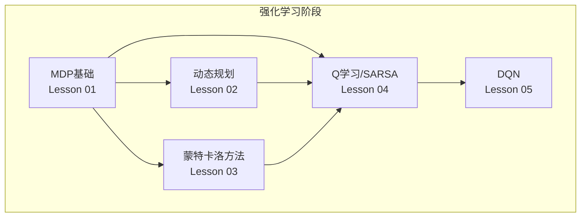
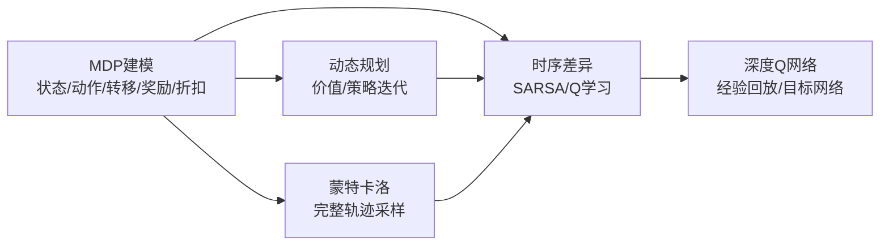
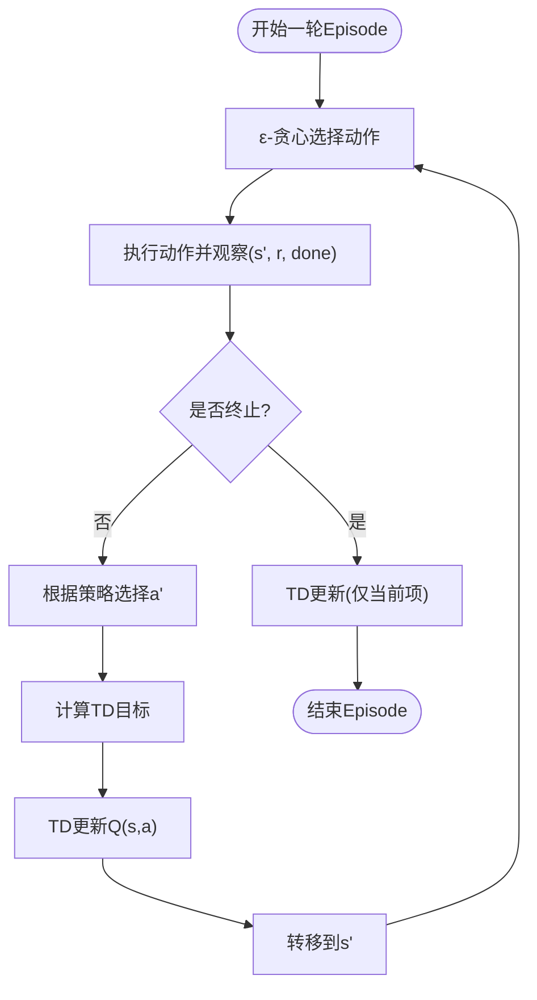
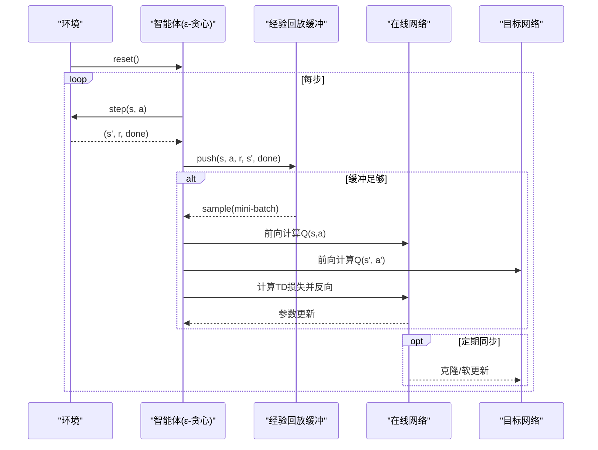
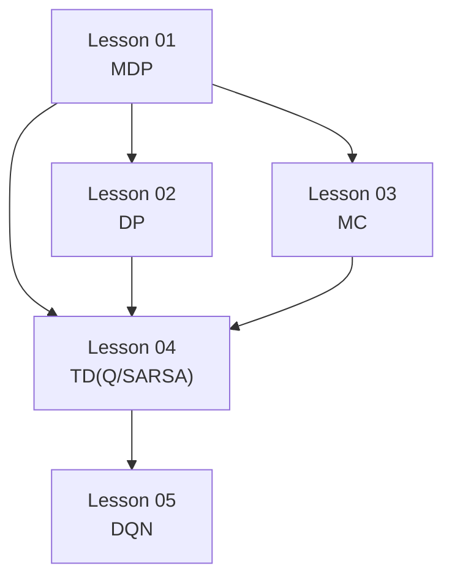

# 表格方法与TD学习

<cite>
**本文引用的文件**
- [Q学习与SARSA主程序](file://phases/09-reinforcement-learning/04-q-learning-sarsa/code/main.py)
- [DQN主程序](file://phases/09-reinforcement-learning/05-dqn/code/main.py)
- [Q学习与SARSA文档](file://phases/09-reinforcement-learning/04-q-learning-sarsa/docs/en.md)
- [DQN文档](file://phases/09-reinforcement-learning/05-dqn/docs/en.md)
- [动态规划文档](file://phases/09-reinforcement-learning/02-dynamic-programming/docs/en.md)
- [蒙特卡洛方法文档](file://phases/09-reinforcement-learning/03-monte-carlo-methods/docs/en.md)
- [MDP基础文档](file://phases/09-reinforcement-learning/01-mdps-states-actions-rewards/docs/en.md)
</cite>

## 目录
1. [引言](#引言)
2. [项目结构](#项目结构)
3. [核心组件](#核心组件)
4. [架构总览](#架构总览)
5. [详细组件分析](#详细组件分析)
6. [依赖关系分析](#依赖关系分析)
7. [性能考量](#性能考量)
8. [故障排查指南](#故障排查指南)
9. [结论](#结论)
10. [附录](#附录)

## 引言
本文件围绕“表格方法与时序差异学习”主题，系统梳理并对比Q学习与SARSA两大时序差异（Temporal Difference, TD）算法，深入解析其理论基础、更新规则、区别与适用场景；同时完整介绍深度Q网络（DQN）的架构设计、经验回放与目标网络技术，并结合仓库中的4×4 GridWorld示例，给出可运行的训练流程与性能比较方法。此外，文档还覆盖ε-贪心策略、探索与利用平衡、以及在不同任务上的实践建议。

## 项目结构
本仓库中与强化学习直接相关的代码与文档集中在“phases/09-reinforcement-learning”目录下，其中：
- Lesson 01：MDPs基础，定义状态、动作、转移、奖励与折扣因子
- Lesson 02：动态规划（DP），价值迭代与策略迭代作为无模型方法的基准
- Lesson 03：蒙特卡洛方法（MC），从完整轨迹估计值函数
- Lesson 04：Q学习与SARSA（TD），表格级TD控制算法
- Lesson 05：DQN，深度TD控制算法，引入神经网络、经验回放与目标网络

图表来源
- [MDP基础文档:1-193](file://phases/09-reinforcement-learning/01-mdps-states-actions-rewards/docs/en.md#L1-L193)
- [动态规划文档:1-209](file://phases/09-reinforcement-learning/02-dynamic-programming/docs/en.md#L1-L209)
- [蒙特卡洛方法文档:1-209](file://phases/09-reinforcement-learning/03-monte-carlo-methods/docs/en.md#L1-L209)
- [Q学习与SARSA文档:1-189](file://phases/09-reinforcement-learning/04-q-learning-sarsa/docs/en.md#L1-L189)
- [DQN文档:1-205](file://phases/09-reinforcement-learning/05-dqn/docs/en.md#L1-L205)

章节来源
- [Q学习与SARSA主程序:1-124](file://phases/09-reinforcement-learning/04-q-learning-sarsa/code/main.py#L1-L124)
- [DQN主程序:1-183](file://phases/09-reinforcement-learning/05-dqn/code/main.py#L1-L183)

## 核心组件
- 环境接口：统一的reset与step函数，返回下一状态、即时奖励与是否终止
- 表格TD代理：Q表存储每个状态-动作对的值，使用ε-贪心策略进行探索
- 深度TD代理：使用单隐层MLP近似Q函数，配合经验回放与目标网络
- 学习曲线记录：按块统计平均回报，用于收敛性评估

章节来源
- [Q学习与SARSA主程序:11-23](file://phases/09-reinforcement-learning/04-q-learning-sarsa/code/main.py#L11-L23)
- [DQN主程序:11-23](file://phases/09-reinforcement-learning/05-dqn/code/main.py#L11-L23)

## 架构总览
下图展示从MDP到表格TD再到深度TD的整体演进路径，以及仓库中各Lesson之间的关系。

图表来源
- [MDP基础文档:34-40](file://phases/09-reinforcement-learning/01-mdps-states-actions-rewards/docs/en.md#L34-L40)
- [动态规划文档:31-37](file://phases/09-reinforcement-learning/02-dynamic-programming/docs/en.md#L31-L37)
- [蒙特卡洛方法文档:22-24](file://phases/09-reinforcement-learning/03-monte-carlo-methods/docs/en.md#L22-L24)
- [Q学习与SARSA文档:24-40](file://phases/09-reinforcement-learning/04-q-learning-sarsa/docs/en.md#L24-L40)
- [DQN文档:26-31](file://phases/09-reinforcement-learning/05-dqn/docs/en.md#L26-L31)

## 详细组件分析

### Q学习与SARSA：理论与实现
- 理论要点
  - TD(0)更新：用下一步的值估计形成一跳目标，降低方差，支持在线更新
  - Q-learning：off-policy，使用max操作解耦行为策略与目标策略，能学到最优动作值函数Q*
  - SARSA：on-policy，使用实际采取的动作进行目标计算，收敛到当前策略π下的Q^π
  - 预期SARSA：以行为策略下的期望替代样本动作，降低方差
- 实现要点
  - 使用字典存储Q表，初始化为零或乐观初始值
  - ε-贪心策略：随机探索与贪婪利用的平衡
  - 更新规则：将TD误差乘以步长α累加到当前Q值
- 代码定位
  - 环境与网格世界：reset/step定义、动作映射、边界处理
  - ε-贪心策略：在Q表上选择随机或最大动作
  - SARSA与Q-learning函数：分别使用实际动作与最大动作的目标

图表来源
- [Q学习与SARSA主程序:32-51](file://phases/09-reinforcement-learning/04-q-learning-sarsa/code/main.py#L32-L51)
- [Q学习与SARSA主程序:54-73](file://phases/09-reinforcement-learning/04-q-learning-sarsa/code/main.py#L54-L73)

章节来源
- [Q学习与SARSA主程序:11-73](file://phases/09-reinforcement-learning/04-q-learning-sarsa/code/main.py#L11-L73)
- [Q学习与SARSA文档:24-47](file://phases/09-reinforcement-learning/04-q-learning-sarsa/docs/en.md#L24-L47)

### DQN：深度TD与三大工程技巧
- 核心思想
  - 将Q表替换为神经网络Q(s,a;θ)，通过梯度下降最小化TD损失
  - 三个关键工程技巧稳定深度TD学习：经验回放、目标网络、奖励裁剪
- 经验回放
  - 固定容量环形缓冲区，均匀采样小批量，打破时间相关性，提升样本效率
- 目标网络
  - 冻结目标参数，定期（或软更新）同步在线网络权重，稳定回归目标
- 双重Q学习（DDQN）
  - 在线网络选动作，目标网络评估动作，缓解最大化偏差
- 代码定位
  - 网络前向传播：单隐层MLP，ReLU激活
  - 训练步骤：计算TD误差，反向传播，按批缩放更新
  - 外层循环：ε-贪心采样、存入缓冲、采样训练、周期性同步目标网络

图表来源
- [DQN主程序:116-152](file://phases/09-reinforcement-learning/05-dqn/code/main.py#L116-L152)
- [DQN主程序:69-114](file://phases/09-reinforcement-learning/05-dqn/code/main.py#L69-L114)

章节来源
- [DQN主程序:25-152](file://phases/09-reinforcement-learning/05-dqn/code/main.py#L25-L152)
- [DQN文档:26-46](file://phases/09-reinforcement-learning/05-dqn/docs/en.md#L26-L46)

### 时序差异学习的核心思想与数学原理
- TD误差：δ = r + γV(s') − V(s)，即自举残差
- TD(0)：一步自举，偏置来源于使用当前估计作为目标
- Bellman优化算子：价值迭代与策略迭代的固定点，TD方法在该框架下迭代逼近
- 与MC对比：MC使用完整回报，高方差；TD一步自举，低方差，支持在线学习

章节来源
- [Q学习与SARSA文档:24-28](file://phases/09-reinforcement-learning/04-q-learning-sarsa/docs/en.md#L24-L28)
- [动态规划文档:31-37](file://phases/09-reinforcement-learning/02-dynamic-programming/docs/en.md#L31-L37)
- [蒙特卡洛方法文档:22-31](file://phases/09-reinforcement-learning/03-monte-carlo-methods/docs/en.md#L22-L31)

### ε-贪心策略与探索-利用平衡
- 探索噪声：以概率ε随机动作，1−ε按当前Q表贪婪选择
- 调度策略：从高ε（如1.0）衰减至低ε（如0.05/0.1），满足GLIE条件保证收敛
- 实践建议：避免全程ε=1，确保有利用阶段；注意初始值与衰减速率对收敛速度的影响

章节来源
- [Q学习与SARSA文档:115-119](file://phases/09-reinforcement-learning/04-q-learning-sarsa/docs/en.md#L115-L119)
- [DQN文档:127-129](file://phases/09-reinforcement-learning/05-dqn/docs/en.md#L127-L129)

### 算法性能比较与实际应用示例
- GridWorld实验：在4×4网格上比较SARSA与Q-learning的学习曲线，观察两者在相同超参数下的收敛速度与最终回报
- DP基准：使用价值迭代得到Q*，并与TD代理的Q值比较，评估一致性
- DQN示例：在GridWorld上训练DQN，记录每轮回报曲线，观察经验回放与目标网络对稳定性的作用

章节来源
- [Q学习与SARSA主程序:99-120](file://phases/09-reinforcement-learning/04-q-learning-sarsa/code/main.py#L99-L120)
- [动态规划文档:104-133](file://phases/09-reinforcement-learning/02-dynamic-programming/docs/en.md#L104-L133)
- [DQN主程序:116-179](file://phases/09-reinforcement-learning/05-dqn/code/main.py#L116-L179)

## 依赖关系分析
- Lesson 01（MDP）为所有后续方法提供统一的数学框架
- Lesson 02（DP）提供无模型方法的基准与收敛性参考
- Lesson 03（MC）展示从完整轨迹估计值函数的方法，强调方差与样本效率
- Lesson 04（TD：Q学习/SARSA）建立表格TD控制的基础
- Lesson 05（DQN）在TD基础上引入深度函数逼近与工程技巧

图表来源
- [MDP基础文档:1-193](file://phases/09-reinforcement-learning/01-mdps-states-actions-rewards/docs/en.md#L1-L193)
- [动态规划文档:1-209](file://phases/09-reinforcement-learning/02-dynamic-programming/docs/en.md#L1-L209)
- [蒙特卡洛方法文档:1-209](file://phases/09-reinforcement-learning/03-monte-carlo-methods/docs/en.md#L1-L209)
- [Q学习与SARSA文档:1-189](file://phases/09-reinforcement-learning/04-q-learning-sarsa/docs/en.md#L1-L189)
- [DQN文档:1-205](file://phases/09-reinforcement-learning/05-dqn/docs/en.md#L1-L205)

## 性能考量
- 收敛性与稳定性
  - TD方法的偏置来源于使用当前估计作为目标，但显著降低方差
  - DQN的“致命三元组”（函数逼近+自举+离策略）可能导致发散，需经验回放与目标网络稳定
- 超参数敏感性
  - 步长α：常数步长在实践中更稳健；随时间衰减步长理论上收敛更快但可能过慢
  - ε调度：起始高ε，逐步衰减至低ε，满足GLIE条件
  - 目标网络同步频率：过频导致失去冻结效果，过慢导致目标不稳定
- 数据效率与样本相关性
  - 经验回放打破时间相关性，提高样本利用率，尤其对稀有事件的再学习至关重要

## 故障排查指南
- Q-learning过估计问题
  - 现象：使用max操作导致Q值向上偏移
  - 解决：采用双重Q学习（DDQN），在线网络选动作，目标网络评估
- 目标网络缺失
  - 现象：训练不稳定、震荡或发散
  - 解决：启用目标网络并合理设置同步频率
- 探索不足
  - 现象：早熟收敛到局部最优
  - 解决：提高初始ε或延长探索时间，确保充分探索
- 缓冲区冷启动
  - 现象：早期梯度不稳定或过拟合
  - 解决：等待缓冲区积累足够样本后再开始训练

章节来源
- [Q学习与SARSA文档:118-119](file://phases/09-reinforcement-learning/04-q-learning-sarsa/docs/en.md#L118-L119)
- [DQN文档:127-133](file://phases/09-reinforcement-learning/05-dqn/docs/en.md#L127-L133)

## 结论
本文件基于仓库中的Lesson 04与05，系统阐述了表格TD（Q学习/SARSA）与深度TD（DQN）的理论与实现要点。Q学习与SARSA在探索-利用与偏置-方差之间提供了不同的权衡，适合不同场景；DQN通过经验回放、目标网络与双Q学习等工程技巧，使深度TD在复杂高维环境中稳定高效。结合DP基准与GridWorld实验，可以有效评估与调试强化学习算法。

## 附录
- 实验建议
  - 在GridWorld上分别运行SARSA与Q-learning，记录每500/50轮的平均回报，比较收敛速度
  - 对比DP价值迭代得到的Q*，评估TD代理的近似质量
  - 在DQN中禁用目标网络，观察训练不稳定现象；启用后对比稳定性与最终性能
- 进一步阅读
  - 《强化学习：导论》第6章（SARSA/Q学习）、第7章（n步自举）
  - Mnih等人关于DQN的经典论文与Rainbow综述