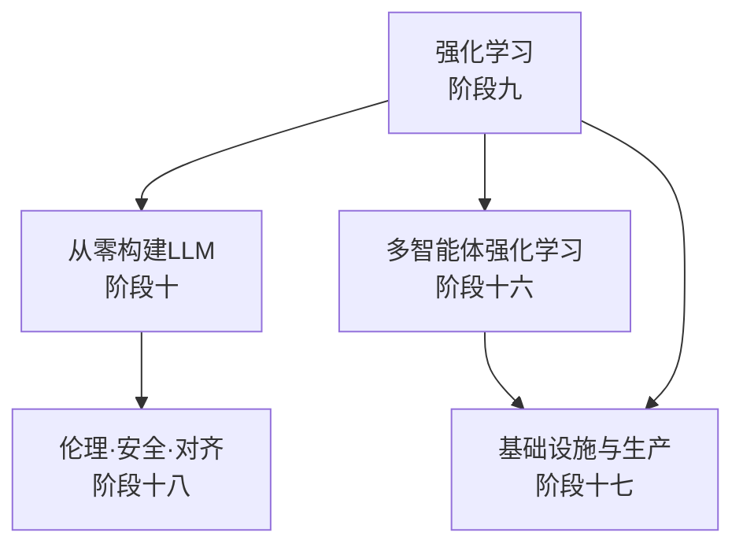
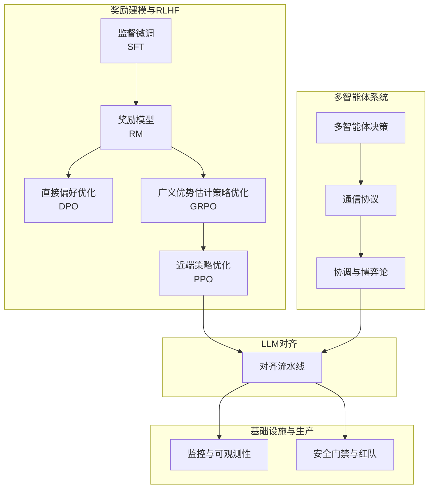
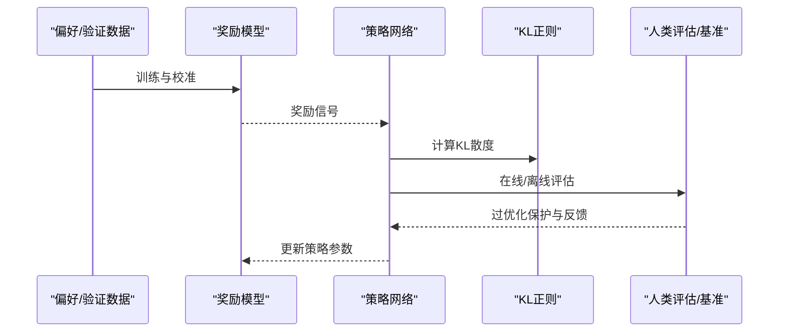
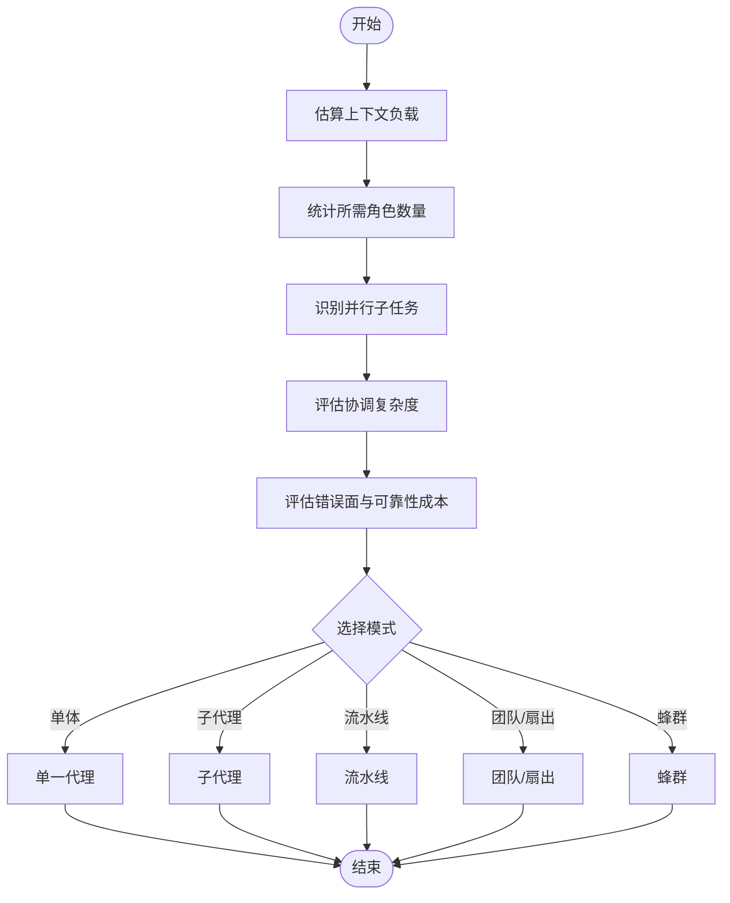
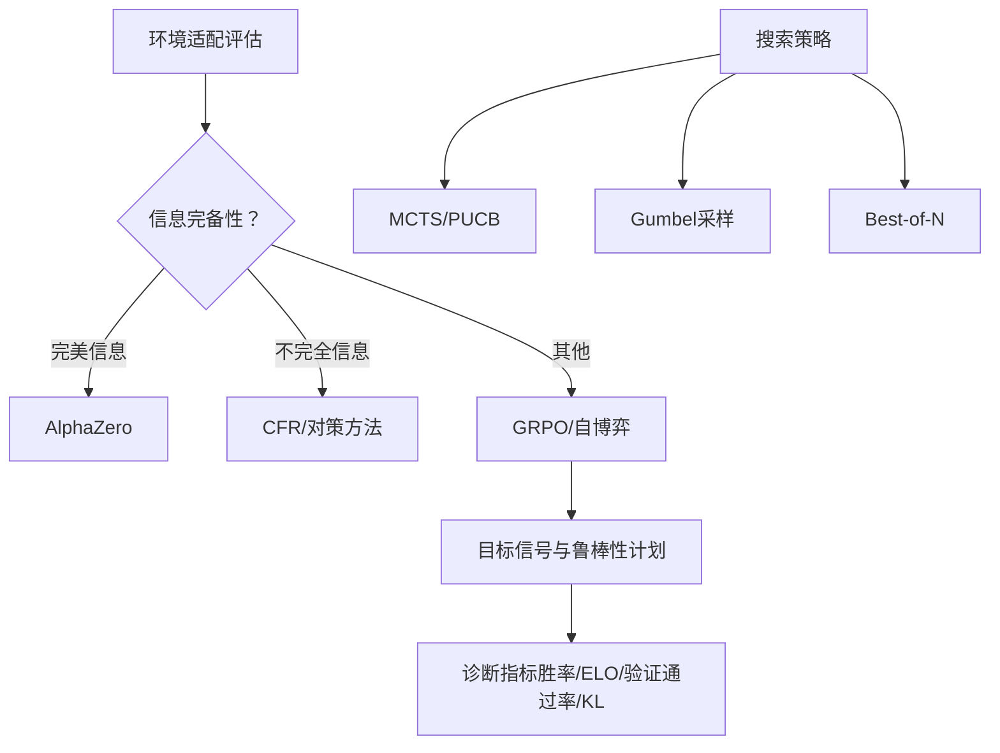
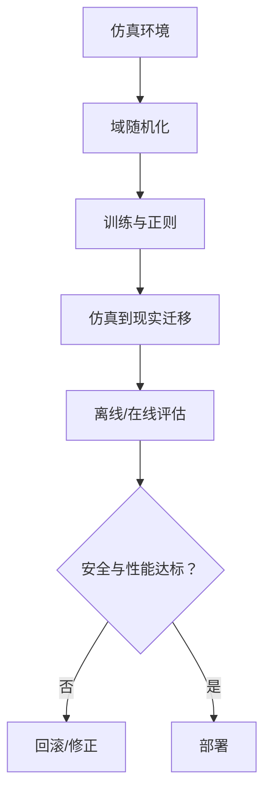
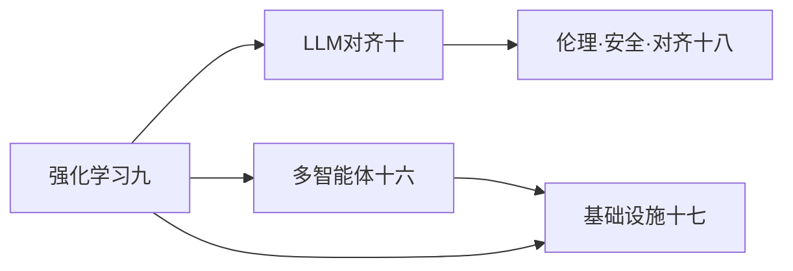

# 高级强化学习应用

<cite>
**本文引用的文件**
- [phases/09-reinforcement-learning/README.md](file://phases/09-reinforcement-learning/README.md)
- [phases/09-reinforcement-learning/09-reward-modeling-rlhf/outputs/skill-rlhf-architect.md](file://phases/09-reinforcement-learning/09-reward-modeling-rlhf/outputs/skill-rlhf-architect.md)
- [phases/09-reinforcement-learning/12-rl-for-games/outputs/skill-game-rl-designer.md](file://phases/09-reinforcement-learning/12-rl-for-games/outputs/skill-game-rl-designer.md)
- [phases/16-multi-agent-and-swarms/README.md](file://phases/16-multi-agent-and-swarms/README.md)
- [phases/16-multi-agent-and-swarms/01-why-multi-agent/outputs/prompt-multi-agent-decision.md](file://phases/16-multi-agent-and-swarms/01-why-multi-agent/outputs/prompt-multi-agent-decision.md)
- [phases/10-llms-from-scratch/README.md](file://phases/10-llms-from-scratch/README.md)
- [phases/18-ethics-safety-alignment/01-instruction-following-alignment-signal/assets/rlhf-pipeline.svg](file://phases/18-ethics-safety-alignment/01-instruction-following-alignment-signal/assets/rlhf-pipeline.svg)
- [phases/09-reinforcement-learning/09-reward-modeling-rlhf/assets/rlhf.svg](file://phases/09-reinforcement-learning/09-reward-modeling-rlhf/assets/rlhf.svg)
- [phases/09-reinforcement-learning/12-rl-for-games/assets/rl-games.svg](file://phases/09-reinforcement-learning/12-rl-for-games/assets/rl-games.svg)
- [phases/17-infrastructure-and-production/23-sre-for-ai/assets/multi-agent.svg](file://phases/17-infrastructure-and-production/23-sre-for-ai/assets/multi-agent.svg)
</cite>

## 目录
1. [引言](#引言)
2. [项目结构](#项目结构)
3. [核心组件](#核心组件)
4. [架构总览](#架构总览)
5. [详细组件分析](#详细组件分析)
6. [依赖关系分析](#依赖关系分析)
7. [性能考量](#性能考量)
8. [故障排查指南](#故障排查指南)
9. [结论](#结论)
10. [附录](#附录)

## 引言
本文件面向高级强化学习（Reinforcement Learning, RL）应用，系统梳理并阐释以下主题：奖励建模与RLHF（基于人类反馈的强化学习）在大语言模型（LLM）对齐中的落地；多智能体强化学习（MARL）的协调机制、博弈论基础与通信协议；模拟到现实（Sim-to-Real）迁移学习的关键技术（域随机化、仿真环境设计、泛化能力提升）；以及在游戏场景中强化学习的应用（Atari、棋类游戏、实时策略游戏）。同时给出完整的项目实现思路与性能评估方法，并总结技术挑战与解决策略。

## 项目结构
该仓库以“阶段化课程”组织强化学习与相关领域的知识与实践，其中与本主题直接相关的模块包括：
- 阶段九：强化学习（含MDP、动态规划、蒙特卡洛、DQN、策略梯度、Actor-Critic、PPO、奖励建模与RLHF、多智能体RL、Sim-to-Real、游戏RL）
- 阶段十六：多智能体与蜂群（包含多智能体决策、通信协议、协调模式等）
- 阶段十：从零开始构建LLM（覆盖指令微调、RLHF、DPO等）
- 阶段十八：伦理、安全与对齐（包含RLHF流程图与对齐信号）
- 阶段十七：基础设施与生产（包含多智能体系统运维图）

下图展示与高级RL应用相关的核心模块及其关系：

图表来源
- [phases/09-reinforcement-learning/README.md:1-6](file://phases/09-reinforcement-learning/README.md#L1-L6)
- [phases/16-multi-agent-and-swarms/README.md:1-6](file://phases/16-multi-agent-and-swarms/README.md#L1-L6)
- [phases/10-llms-from-scratch/README.md:1-6](file://phases/10-llms-from-scratch/README.md#L1-L6)

章节来源
- [phases/09-reinforcement-learning/README.md:1-6](file://phases/09-reinforcement-learning/README.md#L1-L6)
- [phases/16-multi-agent-and-swarms/README.md:1-6](file://phases/16-multi-agent-and-swarms/README.md#L1-L6)
- [phases/10-llms-from-scratch/README.md:1-6](file://phases/10-llms-from-scratch/README.md#L1-L6)

## 核心组件
本节聚焦三大核心能力：奖励建模与RLHF、多智能体协调与通信、游戏强化学习与Sim-to-Real迁移。

- 奖励建模与RLHF
  - 职责：设计并执行从人类偏好或验证器预算中提取奖励信号的流程，确保LLM行为与对齐目标一致。
  - 关键点：阶段顺序选择（SFT/RM/DPO/GRPO）、偏好/验证来源（人工、AI反馈、规则、单元测试、奖励蒸馏）、KL正则策略（固定β、自适应β、DPO隐式KL）、诊断指标（平均KL、奖励稳定性、过优化保护）、安全门禁（红队集合、拒绝率、安全RM与有用性RM分离）。
  - 参考输出：[skill-rlhf-architect.md:1-19](file://phases/09-reinforcement-learning/09-reward-modeling-rlhf/outputs/skill-rlhf-architect.md#L1-L19)

- 多智能体协调与通信
  - 职责：判断任务是否需要多智能体系统，若需要则选择合适的模式（子代理、流水线、团队/扇出、蜂群），并设计通信协议与风险控制。
  - 关键点：上下文负载、角色多样性、并行潜力、协调复杂度、错误面；决策矩阵与架构草图；代理数量与职责；数据传递方式；潜在风险与缓解。
  - 参考输出：[prompt-multi-agent-decision.md:1-40](file://phases/16-multi-agent-and-swarms/01-why-multi-agent/outputs/prompt-multi-agent-decision.md#L1-L40)

- 游戏强化学习
  - 职责：针对不同游戏域（完美信息/不完全信息、Atari、LLM推理、组合优化）设计训练/搜索/自博弈策略，明确目标信号与鲁棒性计划。
  - 关键点：环境适配（已知规则/马尔可夫/随机/多智能体）、搜索策略（MCTS/PUCB/学习先验、Gumbel采样、Best-of-N）、自博弈计划（对称自博弈/联赛/离线数据/验证器生成）、目标信号与诊断指标（胜率曲线/ELO、验证通过率、KL至参考策略）。
  - 参考输出：[skill-game-rl-designer.md:1-19](file://phases/09-reinforcement-learning/12-rl-for-games/outputs/skill-game-rl-designer.md#L1-L19)

章节来源
- [phases/09-reinforcement-learning/09-reward-modeling-rlhf/outputs/skill-rlhf-architect.md:1-19](file://phases/09-reinforcement-learning/09-reward-modeling-rlhf/outputs/skill-rlhf-architect.md#L1-L19)
- [phases/16-multi-agent-and-swarms/01-why-multi-agent/outputs/prompt-multi-agent-decision.md:1-40](file://phases/16-multi-agent-and-swarms/01-why-multi-agent/outputs/prompt-multi-agent-decision.md#L1-L40)
- [phases/09-reinforcement-learning/12-rl-for-games/outputs/skill-game-rl-designer.md:1-19](file://phases/09-reinforcement-learning/12-rl-for-games/outputs/skill-game-rl-designer.md#L1-L19)

## 架构总览
下图展示RLHF在LLM对齐中的典型流程，以及与多智能体系统的协同关系和生产运维视角下的关注点。

图表来源
- [phases/09-reinforcement-learning/09-reward-modeling-rlhf/assets/rlhf.svg](file://phases/09-reinforcement-learning/09-reward-modeling-rlhf/assets/rlhf.svg)
- [phases/18-ethics-safety-alignment/01-instruction-following-alignment-signal/assets/rlhf-pipeline.svg](file://phases/18-ethics-safety-alignment/01-instruction-following-alignment-signal/assets/rlhf-pipeline.svg)
- [phases/17-infrastructure-and-production/23-sre-for-ai/assets/multi-agent.svg](file://phases/17-infrastructure-and-production/23-sre-for-ai/assets/multi-agent.svg)

## 详细组件分析

### 组件A：奖励建模与RLHF（LLM对齐）
- 设计要点
  - 阶段选择：根据预算与目标选择SFT/RM/DPO/GRPO，强调无KL监控不可上线PPO、奖励模型规模不得小于目标策略、拒绝长度奖励等。
  - 偏好/验证来源：人工标注、AI反馈、规则、单元测试、奖励蒸馏，需结合成本与质量。
  - KL正则：固定β、自适应β或DPO隐式KL，平衡对齐强度与分布漂移。
  - 诊断与安全：均值KL、奖励稳定性、过优化保护（盲评人类评估集）、红队集合、拒绝率、安全RM与有用性RM分离。
- 流程序列图

图表来源
- [phases/09-reinforcement-learning/09-reward-modeling-rlhf/outputs/skill-rlhf-architect.md:10-19](file://phases/09-reinforcement-learning/09-reward-modeling-rlhf/outputs/skill-rlhf-architect.md#L10-L19)

章节来源
- [phases/09-reinforcement-learning/09-reward-modeling-rlhf/outputs/skill-rlhf-architect.md:1-19](file://phases/09-reinforcement-learning/09-reward-modeling-rlhf/outputs/skill-rlhf-architect.md#L1-L19)

### 组件B：多智能体协调与通信
- 决策矩阵与模式选择
  - 单一代理 vs 子代理 vs 流水线 vs 团队/扇出 vs 蜂群，依据上下文负载、角色多样性、并行潜力、协调复杂度与可靠性成本进行权衡。
  - 输出格式要求：推荐方案、理由、架构草图、代理清单、通信计划、风险与缓解。
- 流程图

图表来源
- [phases/16-multi-agent-and-swarms/01-why-multi-agent/outputs/prompt-multi-agent-decision.md:10-40](file://phases/16-multi-agent-and-swarms/01-why-multi-agent/outputs/prompt-multi-agent-decision.md#L10-L40)

章节来源
- [phases/16-multi-agent-and-swarms/01-why-multi-agent/outputs/prompt-multi-agent-decision.md:1-40](file://phases/16-multi-agent-and-swarms/01-why-multi-agent/outputs/prompt-multi-agent-decision.md#L1-L40)

### 组件C：游戏强化学习（Atari/棋类/RTS）
- 环境适配与算法选择
  - 完美信息游戏：适合AlphaZero；不完全信息：建议CFR等对策；Atari与组合优化：可采用GRPO等。
  - 搜索策略：MCTS（含PUCB与学习先验）、Gumbel采样、Best-of-N等。
  - 自博弈计划：对称自博弈/联赛/离线数据/验证器生成。
  - 目标信号与诊断：胜负率、ELO曲线、验证通过率、KL至参考策略。
- 流程图

图表来源
- [phases/09-reinforcement-learning/12-rl-for-games/outputs/skill-game-rl-designer.md:10-19](file://phases/09-reinforcement-learning/12-rl-for-games/outputs/skill-game-rl-designer.md#L10-L19)

章节来源
- [phases/09-reinforcement-learning/12-rl-for-games/outputs/skill-game-rl-designer.md:1-19](file://phases/09-reinforcement-learning/12-rl-for-games/outputs/skill-game-rl-designer.md#L1-L19)

### 组件D：Sim-to-Real迁移学习（概念性说明）
- 技术要点
  - 域随机化：在仿真中引入物理参数、传感器噪声、环境扰动的广泛变化，提升泛化。
  - 仿真环境设计：高保真动力学、感知模型与传感器噪声，保证仿真-现实一致性。
  - 泛化能力提升：对抗训练、领域泛化损失、跨域正则、增量迁移。
  - 评估与回退：离线仿真验证、在线最小化风险、安全门禁与快速回滚。
- 概念流程图（非特定源码映射）

## 依赖关系分析
- 模块耦合
  - 强化学习（阶段九）为上层应用提供通用范式，与LLM对齐（阶段十）形成“策略-奖励-评估”的闭环。
  - 多智能体（阶段十六）在任务分解与通信层面支撑复杂系统，与基础设施（阶段十七）共同保障生产可用性。
  - 对齐（阶段十八）贯穿上述流程，提供安全门禁与伦理约束。
- 依赖图

图表来源
- [phases/09-reinforcement-learning/README.md:1-6](file://phases/09-reinforcement-learning/README.md#L1-L6)
- [phases/16-multi-agent-and-swarms/README.md:1-6](file://phases/16-multi-agent-and-swarms/README.md#L1-L6)
- [phases/10-llms-from-scratch/README.md:1-6](file://phases/10-llms-from-scratch/README.md#L1-L6)

章节来源
- [phases/09-reinforcement-learning/README.md:1-6](file://phases/09-reinforcement-learning/README.md#L1-L6)
- [phases/16-multi-agent-and-swarms/README.md:1-6](file://phases/16-multi-agent-and-swarms/README.md#L1-L6)
- [phases/10-llms-from-scratch/README.md:1-6](file://phases/10-llms-from-scratch/README.md#L1-L6)

## 性能考量
- 训练效率
  - 使用分布式训练与流水线并行，结合梯度累积与混合精度，降低显存占用与加速收敛。
  - 在多智能体系统中，合理划分角色与通信频率，避免消息瓶颈。
- 推理效率
  - LLM推理优化：KV缓存、分片解码、推测式解码（Speculative Decoding）。
  - 游戏RL中，搜索深度与时间预算的折中，使用优先经验回放与重要性采样。
- 评估与监控
  - 建立多维指标体系：奖励稳定性、KL、胜率/ELO、验证通过率、安全门禁通过率。
  - 生产可观测性：日志、追踪、告警阈值与自动回滚。

## 故障排查指南
- RLHF管线问题
  - 症状：奖励不稳定、过拟合人类偏好、策略崩溃。
  - 排查：检查KL监控、验证RM规模与质量、人类评估集是否独立、安全RM与有用性RM分离是否到位。
- 多智能体系统问题
  - 症状：通信阻塞、协调失败、错误传播。
  - 排查：核对通信协议、消息路由、共享状态一致性、角色职责边界与容错机制。
- 游戏RL问题
  - 症状：自博弈ELO未校准、搜索过深导致延迟。
  - 排查：固定基线对手、调整搜索策略、增加鲁棒性计划与早停条件。
- 生产运维问题
  - 症状：吞吐下降、延迟升高、异常激增。
  - 排查：检查监控告警、流量整形、弹性扩缩容与回滚预案。

章节来源
- [phases/09-reinforcement-learning/09-reward-modeling-rlhf/outputs/skill-rlhf-architect.md:10-19](file://phases/09-reinforcement-learning/09-reward-modeling-rlhf/outputs/skill-rlhf-architect.md#L10-L19)
- [phases/16-multi-agent-and-swarms/01-why-multi-agent/outputs/prompt-multi-agent-decision.md:10-40](file://phases/16-multi-agent-and-swarms/01-why-multi-agent/outputs/prompt-multi-agent-decision.md#L10-L40)
- [phases/09-reinforcement-learning/12-rl-for-games/outputs/skill-game-rl-designer.md:10-19](file://phases/09-reinforcement-learning/12-rl-for-games/outputs/skill-game-rl-designer.md#L10-L19)

## 结论
本文件系统化梳理了高级强化学习在LLM对齐、多智能体协调与游戏场景中的关键路径与实施要点。通过明确阶段选择、奖励建模、通信协议与评估指标，结合Sim-to-Real迁移策略与生产可观测性，可在保证安全与稳定的前提下高效推进复杂AI系统的工程化落地。

## 附录
- 参考图示
  - RLHF流程图：[rlhf-pipeline.svg](file://phases/18-ethics-safety-alignment/01-instruction-following-alignment-signal/assets/rlhf-pipeline.svg)
  - 多智能体运维图：[multi-agent.svg](file://phases/17-infrastructure-and-production/23-sre-for-ai/assets/multi-agent.svg)
  - 游戏RL概览图：[rl-games.svg](file://phases/09-reinforcement-learning/12-rl-for-games/assets/rl-games.svg)
  - LLM对齐与RLHF示意：[rlhf.svg](file://phases/09-reinforcement-learning/09-reward-modeling-rlhf/assets/rlhf.svg)