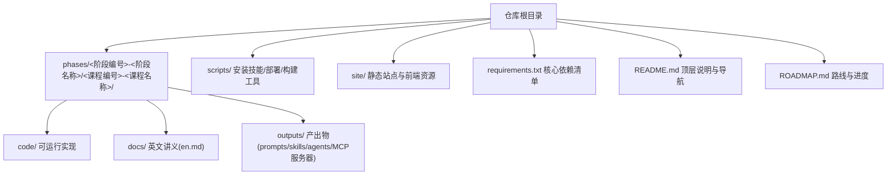
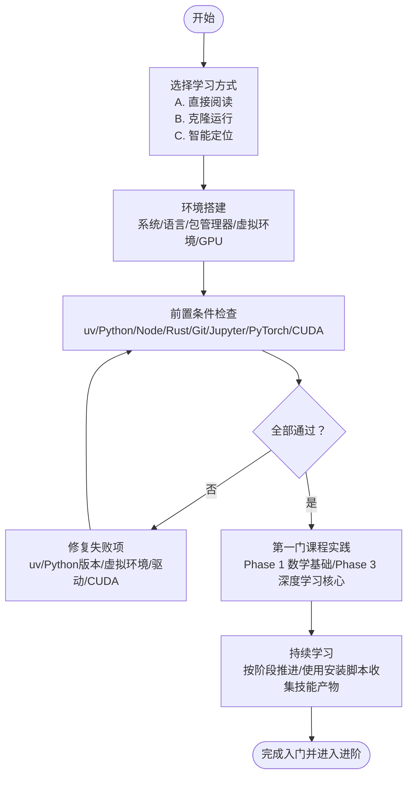
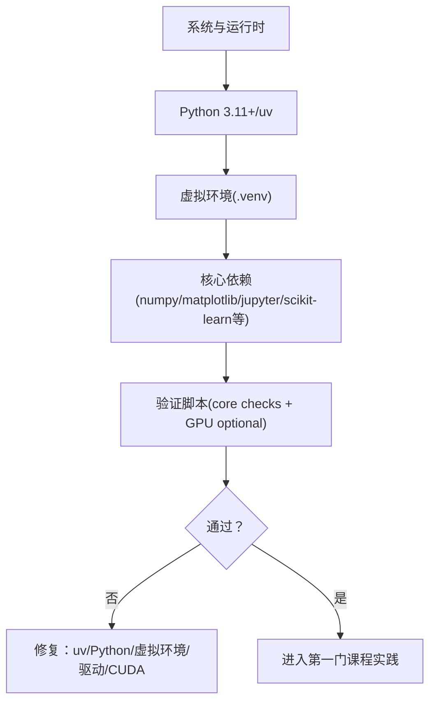
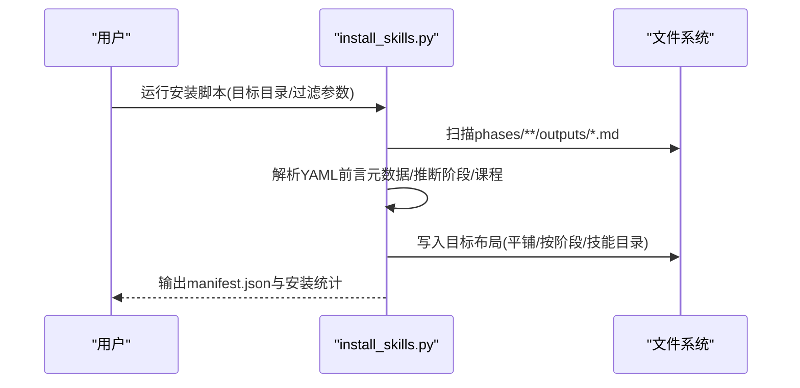
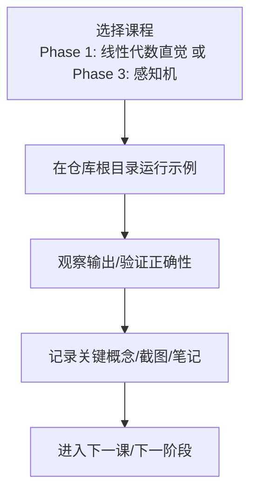
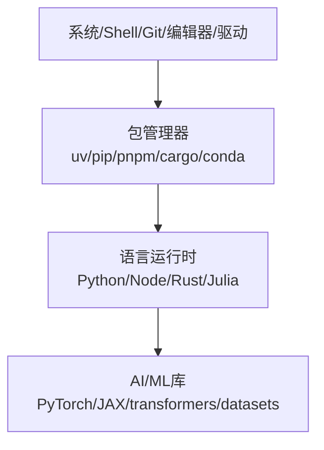

# 快速开始

<cite>
**本文引用的文件**
- [README.md](file://README.md)
- [ROADMAP.md](file://ROADMAP.md)
- [requirements.txt](file://requirements.txt)
- [phases/00-setup-and-tooling/README.md](file://phases/00-setup-and-tooling/README.md)
- [phases/00-setup-and-tooling/01-dev-environment/docs/en.md](file://phases/00-setup-and-tooling/01-dev-environment/docs/en.md)
- [phases/00-setup-and-tooling/01-dev-environment/code/verify.py](file://phases/00-setup-and-tooling/01-dev-environment/code/verify.py)
- [phases/00-setup-and-tooling/03-gpu-setup-and-cloud/docs/en.md](file://phases/00-setup-and-tooling/03-gpu-setup-and-cloud/docs/en.md)
- [phases/00-setup-and-tooling/03-gpu-setup-and-cloud/quiz.json](file://phases/00-setup-and-tooling/03-gpu-setup-and-cloud/quiz.json)
- [phases/00-setup-and-tooling/06-python-environments/docs/en.md](file://phases/00-setup-and-tooling/06-python-environments/docs/en.md)
- [phases/00-setup-and-tooling/06-python-environments/code/env_setup.sh](file://phases/00-setup-and-tooling/06-python-environments/code/env_setup.sh)
- [phases/00-setup-and-tooling/06-python-environments/quiz.json](file://phases/00-setup-and-tooling/06-python-environments/quiz.json)
- [scripts/install_skills.py](file://scripts/install_skills.py)
- [phases/01-math-foundations/01-linear-algebra-intuition/code/vectors.py](file://phases/01-math-foundations/01-linear-algebra-intuition/code/vectors.py)
- [phases/03-deep-learning-core/01-the-perceptron/code/perceptron.py](file://phases/03-deep-learning-core/01-the-perceptron/code/perceptron.py)
</cite>

## 目录
1. [简介](#简介)
2. [项目结构](#项目结构)
3. [核心组件](#核心组件)
4. [架构总览](#架构总览)
5. [详细组件分析](#详细组件分析)
6. [依赖关系分析](#依赖关系分析)
7. [性能考虑](#性能考虑)
8. [故障排除指南](#故障排除指南)
9. [结论](#结论)
10. [附录](#附录)

## 简介
本指南面向首次接触“AI工程从零开始”项目的用户，目标是帮助你在最短时间内完成环境搭建、前置条件检查与第一门课程实践，掌握三种学习方式（直接阅读、克隆运行、智能定位学习路径），并理解Python环境配置、依赖安装、GPU设置等关键技术要求。文档同时提供常见问题排查与优化建议，兼顾初学者友好性与技术深度。

## 项目结构
该项目采用“阶段-课程”的层级组织方式，每个课程独立封装为可运行的代码、配套文档与产出物。核心入口与导航信息集中在根目录的说明文件中，课程索引与进度由路线图文件维护。

图表来源
- [README.md](file://README.md)
- [ROADMAP.md](file://ROADMAP.md)

章节来源
- [README.md:113-144](file://README.md#L113-L144)
- [ROADMAP.md:1-20](file://ROADMAP.md#L1-L20)

## 核心组件
- 三层学习路径
  - 直接阅读：无需本地环境，直接在网站浏览已完成课程。
  - 克隆运行：下载完整仓库，按课程顺序执行代码示例。
  - 智能定位：通过内置技能与测验，自动映射知识起点并生成个性化学习路径。
- 环境准备：系统基础、语言运行时、包管理器、虚拟环境、GPU/CUDA/驱动、验证脚本。
- 依赖管理：统一的依赖清单与安装脚本，支持uv、pip、conda等工具链。
- 课程实践：从数学基础到端到端工程，每课包含“从零实现—框架对比—产物输出—练习巩固”。

章节来源
- [README.md:115-144](file://README.md#L115-L144)
- [phases/00-setup-and-tooling/README.md:1-6](file://phases/00-setup-and-tooling/README.md#L1-L6)

## 架构总览
下图展示了从“入门准备”到“课程实践”的整体流程，以及关键验证点与可选云资源。

图表来源
- [README.md:115-144](file://README.md#L115-L144)
- [phases/00-setup-and-tooling/01-dev-environment/docs/en.md:36-142](file://phases/00-setup-and-tooling/01-dev-environment/docs/en.md#L36-L142)
- [phases/00-setup-and-tooling/06-python-environments/docs/en.md:48-249](file://phases/00-setup-and-tooling/06-python-environments/docs/en.md#L48-L249)

## 详细组件分析

### 组件A：环境搭建与验证
- 系统与运行时
  - 建议自底向上安装：系统工具链（git、curl、wget）、语言运行时（Python 3.11+、Node.js 20+、Rust）、包管理器（uv/pnpm/cargo）。
  - 验证脚本会检查Python、NumPy、Matplotlib、Jupyter、Git、Node.js、Rust等是否可用。
- 虚拟环境
  - 推荐使用uv创建隔离环境，避免全局污染；也可回退至venv或conda。
  - 支持基于pyproject.toml的可复现依赖管理与锁文件。
- GPU与CUDA
  - 若有NVIDIA GPU，使用nvidia-smi确认驱动状态；安装与PyTorch匹配的CUDA版本。
  - 提供CPU/GPU矩阵乘法基准测试，便于评估加速效果。

图表来源
- [phases/00-setup-and-tooling/01-dev-environment/docs/en.md:36-142](file://phases/00-setup-and-tooling/01-dev-environment/docs/en.md#L36-L142)
- [phases/00-setup-and-tooling/06-python-environments/docs/en.md:48-249](file://phases/00-setup-and-tooling/06-python-environments/docs/en.md#L48-L249)
- [phases/00-setup-and-tooling/03-gpu-setup-and-cloud/docs/en.md:44-127](file://phases/00-setup-and-tooling/03-gpu-setup-and-cloud/docs/en.md#L44-L127)

章节来源
- [phases/00-setup-and-tooling/01-dev-environment/docs/en.md:10-165](file://phases/00-setup-and-tooling/01-dev-environment/docs/en.md#L10-L165)
- [phases/00-setup-and-tooling/01-dev-environment/code/verify.py:1-70](file://phases/00-setup-and-tooling/01-dev-environment/code/verify.py#L1-L70)
- [phases/00-setup-and-tooling/06-python-environments/docs/en.md:10-267](file://phases/00-setup-and-tooling/06-python-environments/docs/en.md#L10-L267)
- [phases/00-setup-and-tooling/06-python-environments/code/env_setup.sh:1-173](file://phases/00-setup-and-tooling/06-python-environments/code/env_setup.sh#L1-L173)
- [phases/00-setup-and-tooling/03-gpu-setup-and-cloud/docs/en.md:10-137](file://phases/00-setup-and-tooling/03-gpu-setup-and-cloud/docs/en.md#L10-L137)

### 组件B：依赖管理与安装
- 依赖清单
  - 根目录requirements.txt列出课程常用库（如numpy、torch、transformers、datasets等）。
- 安装脚本
  - scripts/install_skills.py用于批量安装课程产出物（技能/提示词/代理/MCP服务器），支持过滤类型/阶段/标签、多种布局与清单导出。
- 虚拟环境策略
  - 推荐为不同阶段创建独立环境，避免依赖冲突；提供env_setup.sh一键创建与校验。

图表来源
- [scripts/install_skills.py:1-292](file://scripts/install_skills.py#L1-L292)

章节来源
- [requirements.txt:1-19](file://requirements.txt#L1-L19)
- [scripts/install_skills.py:1-292](file://scripts/install_skills.py#L1-L292)
- [phases/00-setup-and-tooling/06-python-environments/code/env_setup.sh:1-173](file://phases/00-setup-and-tooling/06-python-environments/code/env_setup.sh#L1-L173)

### 组件C：第一门课程实践
- 建议从Phase 1的“线性代数直觉”或Phase 3的“感知机”开始，二者均为从零实现，便于建立直观理解。
- 示例命令（以Phase 1为例）
  - 运行示例：在仓库根目录执行课程代码
  - 验证结果：观察向量运算、投影、正交化与矩阵秩等输出
- 代码路径参考
  - 向量与矩阵实现：[phases/01-math-foundations/01-linear-algebra-intuition/code/vectors.py](file://phases/01-math-foundations/01-linear-algebra-intuition/code/vectors.py)
  - 感知机与多层网络：[phases/03-deep-learning-core/01-the-perceptron/code/perceptron.py](file://phases/03-deep-learning-core/01-the-perceptron/code/perceptron.py)

图表来源
- [phases/01-math-foundations/01-linear-algebra-intuition/code/vectors.py:135-212](file://phases/01-math-foundations/01-linear-algebra-intuition/code/vectors.py#L135-L212)
- [phases/03-deep-learning-core/01-the-perceptron/code/perceptron.py:29-104](file://phases/03-deep-learning-core/01-the-perceptron/code/perceptron.py#L29-L104)

章节来源
- [phases/01-math-foundations/01-linear-algebra-intuition/code/vectors.py:135-212](file://phases/01-math-foundations/01-linear-algebra-intuition/code/vectors.py#L135-L212)
- [phases/03-deep-learning-core/01-the-perceptron/code/perceptron.py:29-104](file://phases/03-deep-learning-core/01-the-perceptron/code/perceptron.py#L29-L104)

### 组件D：智能定位学习路径
- 使用内置技能进行“知识定位”
  - /find-your-level：十问定位起点，生成个性化学习路径与工时估算
  - /check-understanding <phase>：按阶段自测，反馈与复习清单
- 课程索引与进度
  - ROADMAP.md提供每个阶段与课程的状态与预估时长，便于规划学习节奏

章节来源
- [README.md:115-144](file://README.md#L115-L144)
- [ROADMAP.md:1-617](file://ROADMAP.md#L1-L617)

## 依赖关系分析
- 依赖层次
  - 系统层：操作系统、shell、git、编辑器、GPU驱动
  - 包管理层：uv/pip、pnpm/cargo、conda
  - 语言运行时：Python 3.11+、Node.js 20+、Rust、Julia
  - AI/ML库：PyTorch、JAX、transformers、datasets、tokenizers等
- 关键依赖与版本
  - 核心依赖清单见requirements.txt
  - 虚拟环境中安装核心包（numpy、matplotlib、jupyter、scikit-learn等）

图表来源
- [phases/00-setup-and-tooling/01-dev-environment/docs/en.md:25-34](file://phases/00-setup-and-tooling/01-dev-environment/docs/en.md#L25-L34)
- [requirements.txt:1-19](file://requirements.txt#L1-L19)

章节来源
- [phases/00-setup-and-tooling/01-dev-environment/docs/en.md:25-34](file://phases/00-setup-and-tooling/01-dev-environment/docs/en.md#L25-L34)
- [requirements.txt:1-19](file://requirements.txt#L1-L19)

## 性能考虑
- 训练加速
  - 在具备NVIDIA GPU的情况下，优先使用CUDA版本与PyTorch匹配的驱动；利用GPU进行矩阵运算与神经网络训练可获得显著提速。
- 内存与显存
  - VRAM限制模型规模与批大小；可使用fp16估算规则粗略评估可容纳参数数量。
- 并行与异步
  - GPU操作默认异步，计时前需同步；合理安排数据加载与计算流水线。

章节来源
- [phases/00-setup-and-tooling/03-gpu-setup-and-cloud/docs/en.md:10-137](file://phases/00-setup-and-tooling/03-gpu-setup-and-cloud/docs/en.md#L10-L137)
- [phases/00-setup-and-tooling/03-gpu-setup-and-cloud/quiz.json:1-40](file://phases/00-setup-and-tooling/03-gpu-setup-and-cloud/quiz.json#L1-L40)

## 故障排除指南
- Python与虚拟环境
  - 症状：pip与python指向系统而非虚拟环境
  - 处理：确认激活脚本位置、检查which python输出、避免在未激活环境下安装
  - 参考：Python环境课程与env_setup.sh中的检查逻辑
- CUDA不兼容
  - 症状：PyTorch报告CUDA不可用
  - 处理：核对nvidia-smi显示的驱动CUDA版本与torch.version.cuda是否匹配
- 包管理器混用
  - 症状：conda环境内pip安装导致依赖冲突
  - 处理：同一环境内坚持使用conda或uv，避免混用
- 依赖冲突与锁文件
  - 处理：使用pyproject.toml与锁文件保证可复现安装；提交锁文件到版本控制

章节来源
- [phases/00-setup-and-tooling/06-python-environments/docs/en.md:179-267](file://phases/00-setup-and-tooling/06-python-environments/docs/en.md#L179-L267)
- [phases/00-setup-and-tooling/06-python-environments/quiz.json:1-40](file://phases/00-setup-and-tooling/06-python-environments/quiz.json#L1-L40)
- [phases/00-setup-and-tooling/03-gpu-setup-and-cloud/quiz.json:1-40](file://phases/00-setup-and-tooling/03-gpu-setup-and-cloud/quiz.json#L1-L40)

## 结论
通过本快速开始指南，你已了解三种学习方式、环境搭建步骤、前置条件检查、第一门课程实践要点与常见问题处理方法。建议先完成环境验证与第一门课程实践，再结合智能定位技能制定后续学习计划，逐步深入到数学基础、机器学习、深度学习与大模型工程等阶段。

## 附录

### A. 三种学习方式与命令示例
- 直接阅读
  - 无需本地环境，直接访问网站浏览已完成课程
- 克隆运行
  - 克隆仓库后，进入根目录运行示例代码
  - 示例：运行Phase 1线性代数示例
    - [phases/01-math-foundations/01-linear-algebra-intuition/code/vectors.py](file://phases/01-math-foundations/01-linear-algebra-intuition/code/vectors.py)
  - 示例：运行Phase 3感知机示例
    - [phases/03-deep-learning-core/01-the-perceptron/code/perceptron.py](file://phases/03-deep-learning-core/01-the-perceptron/code/perceptron.py)
- 智能定位学习路径
  - 使用内置技能进行知识定位与自测
  - 参考：README中的技能列表与使用说明

章节来源
- [README.md:115-144](file://README.md#L115-L144)

### B. 环境搭建与验证清单
- 系统与运行时
  - Python 3.11+、Node.js 20+、Rust、Git、编辑器
- 包管理器
  - uv（推荐）或 pip/conda/pnpm/cargo
- 虚拟环境
  - 创建并激活.vnev，安装核心依赖
- GPU（可选）
  - nvidia-smi检查驱动，安装与PyTorch匹配的CUDA
- 验证
  - 运行verify.py进行核心与GPU检查

章节来源
- [phases/00-setup-and-tooling/01-dev-environment/docs/en.md:36-142](file://phases/00-setup-and-tooling/01-dev-environment/docs/en.md#L36-L142)
- [phases/00-setup-and-tooling/06-python-environments/docs/en.md:48-249](file://phases/00-setup-and-tooling/06-python-environments/docs/en.md#L48-L249)
- [phases/00-setup-and-tooling/03-gpu-setup-and-cloud/docs/en.md:44-127](file://phases/00-setup-and-tooling/03-gpu-setup-and-cloud/docs/en.md#L44-L127)
- [phases/00-setup-and-tooling/01-dev-environment/code/verify.py:1-70](file://phases/00-setup-and-tooling/01-dev-environment/code/verify.py#L1-L70)

### C. 依赖安装与技能收集
- 依赖清单
  - requirements.txt
- 安装脚本
  - scripts/install_skills.py：批量安装课程产出物，支持过滤与布局
- 虚拟环境初始化
  - phases/00-setup-and-tooling/06-python-environments/code/env_setup.sh

章节来源
- [requirements.txt:1-19](file://requirements.txt#L1-L19)
- [scripts/install_skills.py:1-292](file://scripts/install_skills.py#L1-L292)
- [phases/00-setup-and-tooling/06-python-environments/code/env_setup.sh:1-173](file://phases/00-setup-and-tooling/06-python-environments/code/env_setup.sh#L1-L173)