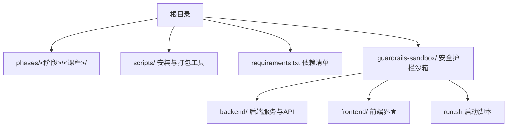
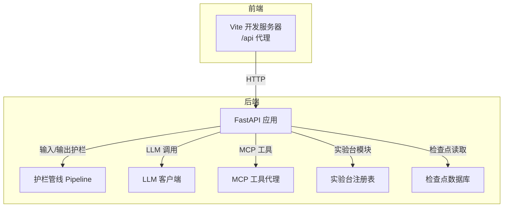
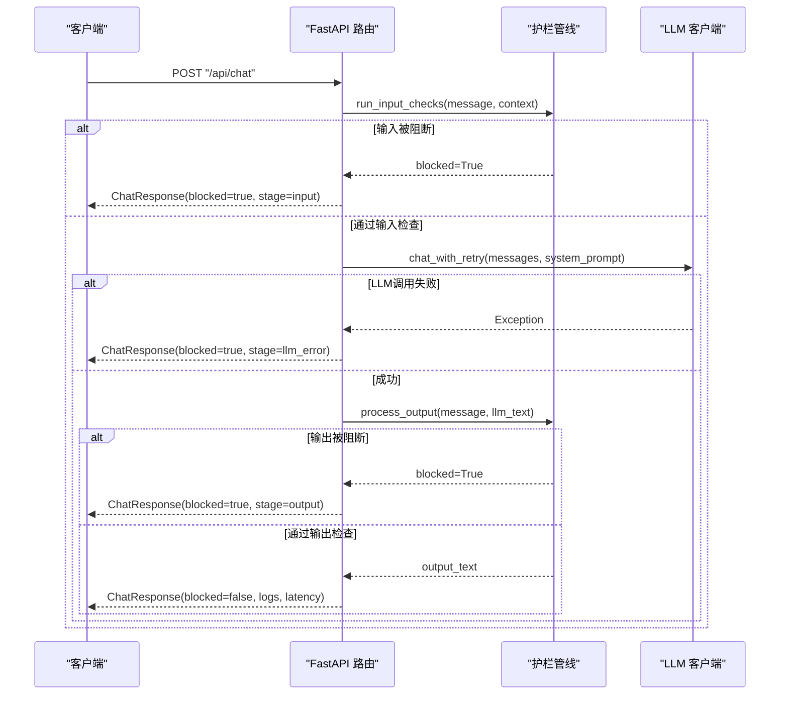
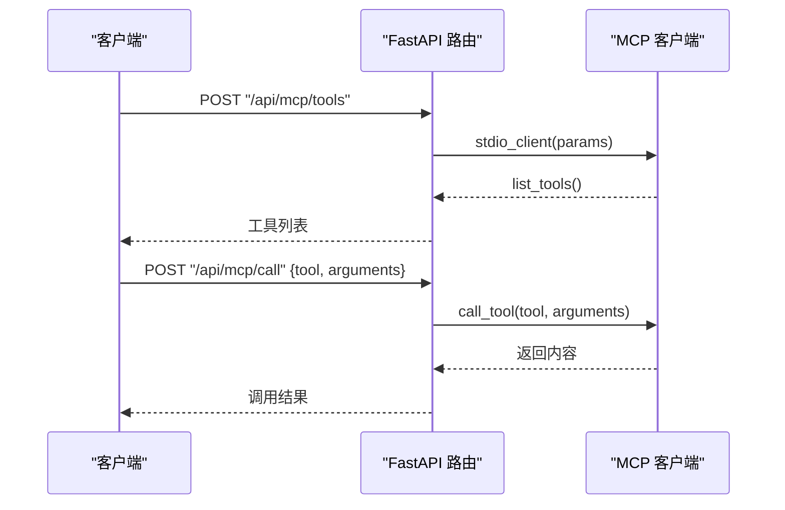
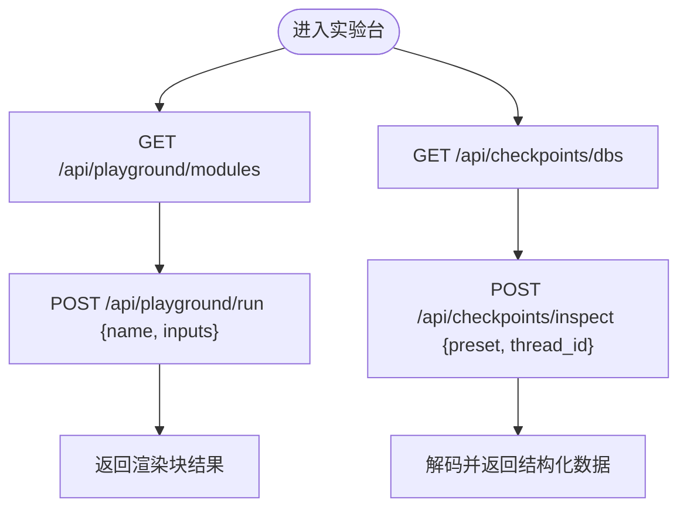
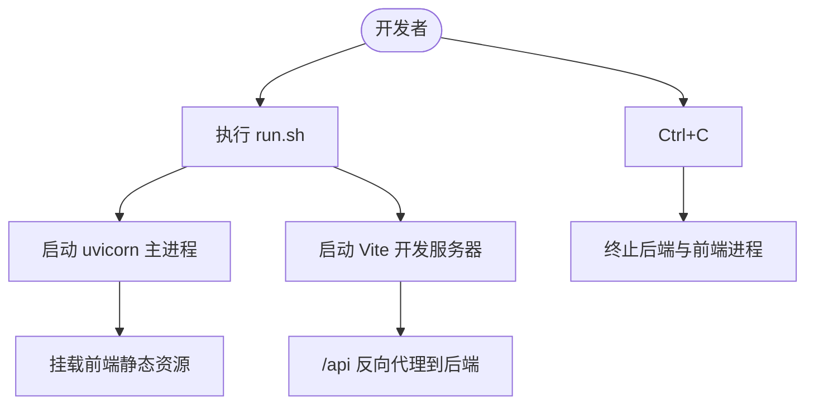
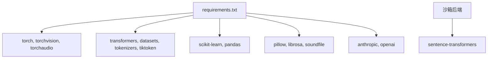

# 故障排除

<cite>
**本文引用的文件**
- [README.md](file://README.md)
- [requirements.txt](file://requirements.txt)
- [guardrails-sandbox/run.sh](file://guardrails-sandbox/run.sh)
- [guardrails-sandbox/backend/main.py](file://guardrails-sandbox/backend/main.py)
- [scripts/install_skills.py](file://scripts/install_skills.py)
- [CONTRIBUTING.md](file://CONTRIBUTING.md)
</cite>

## 目录
1. [简介](#简介)
2. [项目结构](#项目结构)
3. [核心组件](#核心组件)
4. [架构总览](#架构总览)
5. [详细组件分析](#详细组件分析)
6. [依赖关系分析](#依赖关系分析)
7. [性能考虑](#性能考虑)
8. [故障排除指南](#故障排除指南)
9. [结论](#结论)
10. [附录](#附录)

## 简介
本指南面向“AI工程从零开始”项目的使用者与贡献者，聚焦于环境配置、依赖冲突、运行时错误、性能优化、调试与日志分析、错误追踪、社区支持渠道以及跨平台（操作系统与硬件）常见问题与解决方案。文档以循序渐进的方式组织，既适合初学者快速定位问题，也便于高级用户进行系统性排查与优化。

## 项目结构
该项目采用“阶段-课程”的组织方式，每个课程包含可运行代码、文档与可复用产物（提示词、技能、代理、MCP服务器）。根目录提供统一的安装脚本与依赖清单；沙箱（guardrails-sandbox）提供安全护栏（Guardrails）的交互式演示与开发环境。

图示来源
- [README.md:241-265](file://README.md#L241-L265)
- [requirements.txt:1-19](file://requirements.txt#L1-L19)
- [guardrails-sandbox/run.sh:1-35](file://guardrails-sandbox/run.sh#L1-L35)

章节来源
- [README.md:241-265](file://README.md#L241-L265)
- [requirements.txt:1-19](file://requirements.txt#L1-L19)
- [guardrails-sandbox/run.sh:1-35](file://guardrails-sandbox/run.sh#L1-L35)

## 核心组件
- 环境与工具链：Python虚拟环境、包管理、Jupyter、Docker等。
- 沙箱后端（FastAPI）：提供聊天接口、护栏管线、基准测试、MCP工具代理、实验台与检查点数据库查看器。
- 沙箱前端（Vite）：静态资源托管与本地开发代理。
- 依赖管理：集中于requirements.txt，覆盖深度学习、NLP、音频、图像等领域。
- 技能安装工具：扫描课程产物，生成清单并批量安装到目标目录。

章节来源
- [guardrails-sandbox/backend/main.py:1-421](file://guardrails-sandbox/backend/main.py#L1-L421)
- [guardrails-sandbox/run.sh:1-35](file://guardrails-sandbox/run.sh#L1-L35)
- [requirements.txt:1-19](file://requirements.txt#L1-L19)
- [scripts/install_skills.py:1-292](file://scripts/install_skills.py#L1-L292)

## 架构总览
沙箱整体采用前后端分离架构：后端通过FastAPI提供REST API，前端通过Vite本地开发服务器提供静态资源与反向代理；后端内部集成护栏管线、LLM客户端、MCP工具代理与实验台模块注册表。

图示来源
- [guardrails-sandbox/backend/main.py:79-421](file://guardrails-sandbox/backend/main.py#L79-L421)
- [guardrails-sandbox/run.sh:12-25](file://guardrails-sandbox/run.sh#L12-L25)

## 详细组件分析

### 组件A：护栏管线与聊天API
- 输入护栏：对用户输入进行合法性、敏感度、长度等检查，必要时直接阻断。
- LLM调用：封装消息格式并重试，捕获异常并返回阻断响应。
- 输出护栏：对LLM输出进行二次过滤，记录护栏日志与延迟指标。
- 对比模式：同时返回“无护栏”与“有护栏”的对话结果，便于评估护栏效果。
- 统计与历史：提供护栏统计、阻断历史、清空历史与重置统计接口。

图示来源
- [guardrails-sandbox/backend/main.py:155-221](file://guardrails-sandbox/backend/main.py#L155-L221)

章节来源
- [guardrails-sandbox/backend/main.py:155-221](file://guardrails-sandbox/backend/main.py#L155-L221)

### 组件B：MCP工具代理
- 通过标准输入/输出（stdio）连接外部MCP服务器，支持列出工具与调用工具。
- 在已有事件循环的线程中安全运行协程，避免异步上下文冲突。
- 提供工具列表与调用的REST接口，便于前端或外部系统集成。

图示来源
- [guardrails-sandbox/backend/main.py:324-356](file://guardrails-sandbox/backend/main.py#L324-L356)

章节来源
- [guardrails-sandbox/backend/main.py:324-356](file://guardrails-sandbox/backend/main.py#L324-L356)

### 组件C：实验台与检查点数据库
- 实验台模块注册表：按阶段分组返回模块清单与输入模式，支持运行模块并返回渲染块结果。
- 检查点数据库：提供预置库列表与只读检查点读取能力，用于调试与回放。

图示来源
- [guardrails-sandbox/backend/main.py:368-404](file://guardrails-sandbox/backend/main.py#L368-L404)

章节来源
- [guardrails-sandbox/backend/main.py:368-404](file://guardrails-sandbox/backend/main.py#L368-L404)

### 组件D：启动与开发流程
- run.sh：同时启动后端（uvicorn）与前端（Vite），自动代理/api到后端，并在Ctrl+C时优雅退出。
- 前端静态资源挂载：后端在存在dist目录时挂载静态文件，实现SPA路由。

图示来源
- [guardrails-sandbox/run.sh:12-35](file://guardrails-sandbox/run.sh#L12-L35)
- [guardrails-sandbox/backend/main.py:406-410](file://guardrails-sandbox/backend/main.py#L406-L410)

章节来源
- [guardrails-sandbox/run.sh:12-35](file://guardrails-sandbox/run.sh#L12-L35)
- [guardrails-sandbox/backend/main.py:406-410](file://guardrails-sandbox/backend/main.py#L406-L410)

## 依赖关系分析
- 依赖来源：requirements.txt集中声明了NumPy、Matplotlib、Jupyter、PyTorch生态、Transformers、Datasets、Tokenizers、Accelerate、Scikit-learn、Pandas、Pillow、Librosa、Soundfile、Tiktoken、Anthropic、OpenAI等。
- 版本约束：使用>=与固定版本策略，确保兼容性与稳定性。
- 沙箱后端：依赖sentence-transformers用于中文文本向量化，需离线模式以避免网络拉取。

图示来源
- [requirements.txt:1-19](file://requirements.txt#L1-L19)
- [guardrails-sandbox/backend/main.py:62-76](file://guardrails-sandbox/backend/main.py#L62-L76)

章节来源
- [requirements.txt:1-19](file://requirements.txt#L1-L19)
- [guardrails-sandbox/backend/main.py:62-76](file://guardrails-sandbox/backend/main.py#L62-L76)

## 性能考虑
- 模型预热：在启动前预加载语义模型，避免异步环境中的HTTP连接问题，减少首次请求延迟。
- 护栏统计与阻断历史：通过统计接口与历史接口，持续监控护栏命中率与阻断原因，辅助定位瓶颈。
- 对比模式：在对比模式下同时运行“无护栏”与“有护栏”，可直观评估护栏对吞吐与延迟的影响。
- 基准测试：提供按类别的基准测试入口，便于在不同场景下评估护栏与LLM调用的性能表现。

章节来源
- [guardrails-sandbox/backend/main.py:62-76](file://guardrails-sandbox/backend/main.py#L62-L76)
- [guardrails-sandbox/backend/main.py:223-256](file://guardrails-sandbox/backend/main.py#L223-L256)
- [guardrails-sandbox/backend/main.py:272-280](file://guardrails-sandbox/backend/main.py#L272-L280)

## 故障排除指南

### 一、环境与依赖问题
- 症状：安装依赖时报错或版本冲突
  - 排查要点：
    - 使用隔离的Python虚拟环境，确保与系统Python不冲突。
    - 检查requirements.txt中的版本范围是否与当前系统兼容。
    - 若涉及CUDA/驱动，请确认PyTorch与显卡驱动匹配。
  - 解决方案：
    - 清理并重建虚拟环境，重新安装依赖。
    - 锁定关键依赖版本，避免自动升级导致的破坏性变更。
    - 如需离线部署，提前下载并缓存模型与依赖包。
- 症状：沙箱后端无法启动或端口占用
  - 排查要点：
    - 检查端口8000是否被占用。
    - 确认run.sh已激活正确的虚拟环境。
  - 解决方案：
    - 更换端口或释放占用端口。
    - 使用run.sh统一启动，避免手动命令遗漏环境变量。
- 症状：前端无法访问后端API
  - 排查要点：
    - 确认Vite开发服务器已启动并启用/api代理。
    - 检查CORS中间件配置是否允许前端域名。
  - 解决方案：
    - 在开发环境下保持前后端同时运行，遵循run.sh的启动顺序。

章节来源
- [requirements.txt:1-19](file://requirements.txt#L1-L19)
- [guardrails-sandbox/run.sh:12-35](file://guardrails-sandbox/run.sh#L12-L35)
- [guardrails-sandbox/backend/main.py:79-85](file://guardrails-sandbox/backend/main.py#L79-L85)

### 二、运行时错误与护栏拦截
- 症状：聊天接口返回“消息/输出被拦截”
  - 排查要点：
    - 查看响应中的block_stage与block_reason，定位具体护栏阶段。
    - 检查guardrail_logs，了解各护栏的置信度与细节。
  - 解决方案：
    - 调整护栏阈值或禁用特定护栏进行对比测试。
    - 优化输入提示词与系统提示，降低触发敏感检测的概率。
- 症状：LLM调用失败
  - 排查要点：
    - 检查系统提示、消息格式与API密钥配置。
    - 关注llm_error阶段的异常信息。
  - 解决方案：
    - 使用对比模式验证护栏是否引入额外错误。
    - 重试机制与降级策略（如切换模型或减少上下文长度）。

章节来源
- [guardrails-sandbox/backend/main.py:160-221](file://guardrails-sandbox/backend/main.py#L160-L221)

### 三、性能与延迟问题
- 症状：首请求延迟高
  - 排查要点：
    - 是否触发了模型预热逻辑。
  - 解决方案：
    - 在生产环境中预热关键模型，或在应用启动时进行冷启动预热。
- 症状：护栏导致吞吐下降
  - 排查要点：
    - 通过护栏统计与对比模式评估影响。
  - 解决方案：
    - 仅在必要场景启用护栏，或调整护栏参数以平衡安全与性能。

章节来源
- [guardrails-sandbox/backend/main.py:62-76](file://guardrails-sandbox/backend/main.py#L62-L76)
- [guardrails-sandbox/backend/main.py:223-256](file://guardrails-sandbox/backend/main.py#L223-L256)

### 四、MCP工具代理问题
- 症状：/api/mcp/tools或/api/mcp/call返回错误
  - 排查要点：
    - 确认MCP服务器路径与命令正确。
    - 检查是否存在事件循环冲突，确保协程在现有事件循环中安全运行。
  - 解决方案：
    - 使用提供的工具函数包装协程调用，避免重复创建事件循环。
    - 在生产环境中使用稳定的MCP服务器并配置健康检查。

章节来源
- [guardrails-sandbox/backend/main.py:305-356](file://guardrails-sandbox/backend/main.py#L305-L356)

### 五、实验台与检查点问题
- 症状：/api/playground/modules或/api/checkpoints/inspect报错
  - 排查要点：
    - 检查模块名称与输入模式是否匹配。
    - 确认检查点库路径与线程ID有效。
  - 解决方案：
    - 使用模块注册表列出可用模块，按组选择并传入正确输入。
    - 对于检查点读取，先查询可用库再进行只读解码。

章节来源
- [guardrails-sandbox/backend/main.py:368-404](file://guardrails-sandbox/backend/main.py#L368-L404)

### 六、跨平台与硬件环境
- Windows/Linux/macOS差异：
  - 文件路径与权限：注意斜杠/反斜杠差异与可执行权限。
  - Python虚拟环境：在不同平台使用一致的venv创建与激活流程。
- GPU/CPU与CUDA：
  - 确保PyTorch与CUDA版本匹配，避免运行时崩溃。
  - 在容器或云环境中，确认GPU驱动与设备可见性。

[本节为通用指导，无需特定文件引用]

### 七、预防性维护与监控
- 建议：
  - 定期更新requirements.txt中的安全补丁版本。
  - 在CI中加入依赖一致性校验与最小化安装测试。
  - 对关键API增加超时与重试策略，提升鲁棒性。
  - 使用护栏统计与阻断历史作为监控指标，建立告警阈值。

[本节为通用指导，无需特定文件引用]

### 八、社区支持与获取帮助
- 提交与协作：
  - 遵循贡献指南，保持每次PR只包含一个功能变更，确保评审高效。
  - 编辑README与路线图后，运行构建脚本生成站点数据。
- 获取帮助：
  - 通过仓库Issue模板提交问题，附带环境信息、依赖版本与最小复现步骤。
  - 在讨论区分享经验与最佳实践，促进社区共同进步。

章节来源
- [CONTRIBUTING.md:1-164](file://CONTRIBUTING.md#L1-L164)

## 结论
本指南提供了从环境配置、依赖管理、运行时错误到性能优化与社区支持的系统性故障排除方法。建议在日常开发中结合护栏统计、对比模式与基准测试，形成“预防—观测—修复—验证”的闭环，确保项目稳定交付。

## 附录
- 快速定位技巧：
  - 优先查看block_stage与block_reason，快速锁定护栏阶段。
  - 使用对比模式区分护栏影响，缩小问题范围。
  - 通过统计与历史接口观察护栏命中趋势，识别异常波动。
- 常用命令与路径：
  - 启动沙箱：./guardrails-sandbox/run.sh
  - 安装技能：python3 scripts/install_skills.py <目标目录> [--layout skills]

[本节为通用指导，无需特定文件引用]