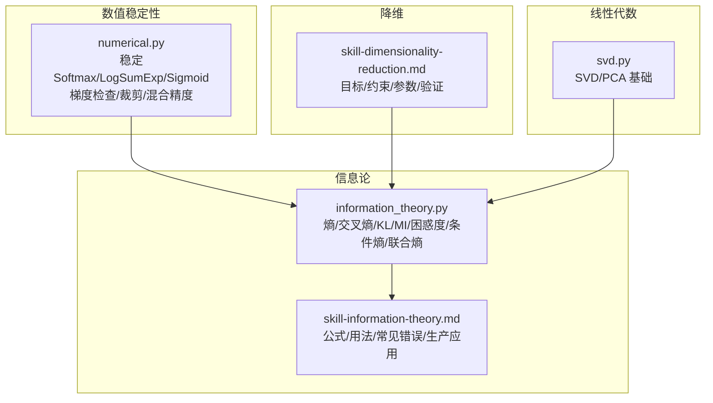
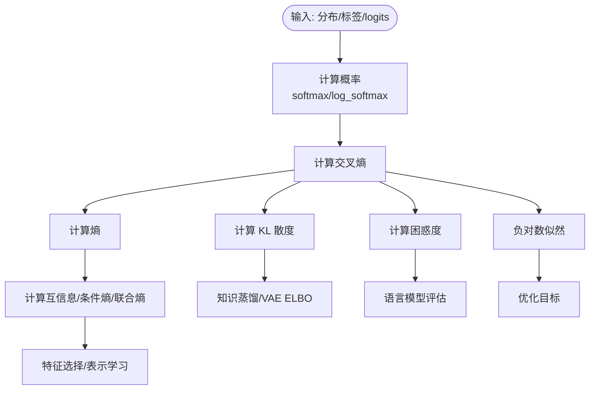
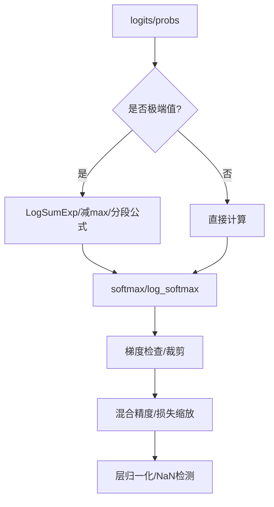
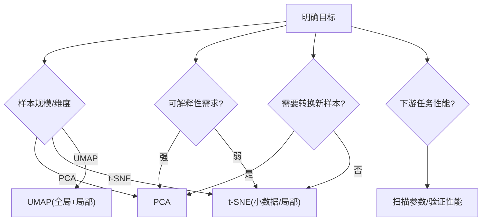
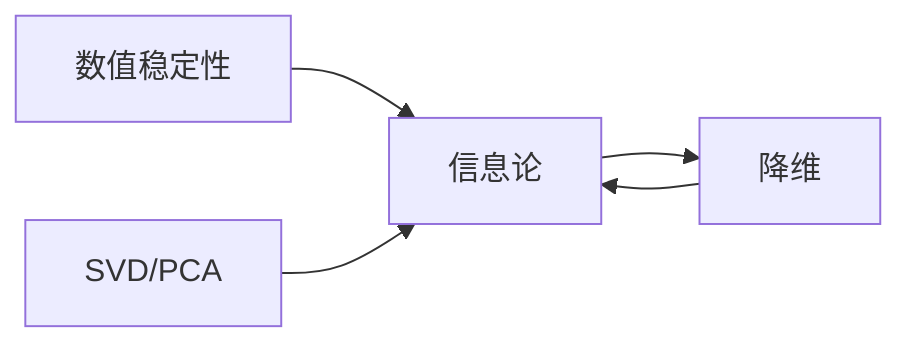

# 信息论与几何基础

<cite>
**本文引用的文件**
- [information_theory.py](file://phases/01-math-foundations/09-information-theory/code/information_theory.py)
- [skill-information-theory.md](file://phases/01-math-foundations/09-information-theory/outputs/skill-information-theory.md)
- [numerical.py](file://phases/01-math-foundations/13-numerical-stability/code/numerical.py)
- [skill-dimensionality-reduction.md](file://phases/01-math-foundations/10-dimensionality-reduction/outputs/skill-dimensionality-reduction.md)
- [svd.py](file://phases/01-math-foundations/11-singular-value-decomposition/code/svd.py)
</cite>

## 目录
1. [引言](#引言)
2. [项目结构](#项目结构)
3. [核心组件](#核心组件)
4. [架构总览](#架构总览)
5. [详细组件分析](#详细组件分析)
6. [依赖分析](#依赖分析)
7. [性能考虑](#性能考虑)
8. [故障排查指南](#故障排查指南)
9. [结论](#结论)
10. [附录](#附录)

## 引言
本文件面向“信息论与几何基础”课程，系统梳理以下主题：信息论核心（熵、交叉熵、KL 散度、互信息、条件熵、联合熵、困惑度）在机器学习中的应用；降维技术（PCA、t-SNE、UMAP）的数学原理与实践建议；数值稳定性（溢出/下溢、LogSumExp、稳定 Softmax、梯度检查、梯度裁剪、混合精度）的关键策略；距离度量与范数在算法中的作用；以及结合仓库中现有实现的实践路径与最佳实践。

## 项目结构
本课程相关内容主要分布在“数学基础”阶段的若干 lesson 中，核心文件如下：
- 信息论：Python 实现与示例演示
- 数值稳定性：数值技巧与调试实践
- 降维：决策框架与参数配置建议
- SVD：线性代数基础支撑

图表来源
- [information_theory.py:1-360](file://phases/01-math-foundations/09-information-theory/code/information_theory.py#L1-L360)
- [skill-information-theory.md:1-95](file://phases/01-math-foundations/09-information-theory/outputs/skill-information-theory.md#L1-L95)
- [numerical.py:1-720](file://phases/01-math-foundations/13-numerical-stability/code/numerical.py#L1-L720)
- [skill-dimensionality-reduction.md:1-58](file://phases/01-math-foundations/10-dimensionality-reduction/outputs/skill-dimensionality-reduction.md#L1-L58)
- [svd.py](file://phases/01-math-foundations/11-singular-value-decomposition/code/svd.py)

章节来源
- [information_theory.py:1-360](file://phases/01-math-foundations/09-information-theory/code/information_theory.py#L1-L360)
- [numerical.py:1-720](file://phases/01-math-foundations/13-numerical-stability/code/numerical.py#L1-L720)
- [skill-dimensionality-reduction.md:1-58](file://phases/01-math-foundations/10-dimensionality-reduction/outputs/skill-dimensionality-reduction.md#L1-L58)
- [svd.py](file://phases/01-math-foundations/11-singular-value-decomposition/code/svd.py)

## 核心组件
- 信息论函数族：信息量、熵、交叉熵、KL 散度、互信息、条件熵、联合熵、困惑度、负对数似然、softmax 等。
- 数值稳定性工具：稳定 Softmax、LogSumExp、稳定 Sigmoid、数值梯度、梯度检查、梯度裁剪、NaN/Inf 检测、混合精度与损失缩放、层归一化。
- 降维决策框架：基于目标、数据规模、可解释性、下游任务的参数选择与验证建议。
- SVD/PCA 基础：矩阵分解与主成分分析的数学与实现要点。

章节来源
- [information_theory.py:5-97](file://phases/01-math-foundations/09-information-theory/code/information_theory.py#L5-L97)
- [numerical.py:6-31](file://phases/01-math-foundations/13-numerical-stability/code/numerical.py#L6-L31)
- [skill-dimensionality-reduction.md:10-58](file://phases/01-math-foundations/10-dimensionality-reduction/outputs/skill-dimensionality-reduction.md#L10-L58)
- [svd.py](file://phases/01-math-foundations/11-singular-value-decomposition/code/svd.py)

## 架构总览
信息论与数值稳定性的关系体现在：训练损失（交叉熵）与概率计算（softmax/log_softmax）必须在数值上稳定，否则会触发溢出/下溢、NaN/Inf、灾难性消去等问题；而降维作为预处理步骤，直接影响后续模型的特征表达与稳定性。

图表来源
- [information_theory.py:57-66](file://phases/01-math-foundations/09-information-theory/code/information_theory.py#L57-L66)
- [numerical.py:28-41](file://phases/01-math-foundations/13-numerical-stability/code/numerical.py#L28-L41)
- [skill-dimensionality-reduction.md:12-49](file://phases/01-math-foundations/10-dimensionality-reduction/outputs/skill-dimensionality-reduction.md#L12-L49)

## 详细组件分析

### 信息论函数族与机器学习应用
- 信息量与熵：衡量事件不确定性和分布的不确定性；单位可选比特或纳特。
- 交叉熵与 KL 散度：交叉熵等于熵加 KL 散度；最小化交叉熵等价于最小化 KL（在真实分布固定时）。
- 互信息：刻画变量间相关性；与条件熵、联合熵存在恒等式关系。
- 困惑度：语言模型质量指标，为交叉熵的指数映射。
- 负对数似然：与交叉熵一致，最大化似然等价最小化交叉熵。
- softmax：将 logits 映射为概率，需采用减去最大值的稳定版本以避免溢出。

图表来源
- [information_theory.py:5-97](file://phases/01-math-foundations/09-information-theory/code/information_theory.py#L5-L97)
- [information_theory.py:100-172](file://phases/01-math-foundations/09-information-theory/code/information_theory.py#L100-L172)
- [information_theory.py:271-287](file://phases/01-math-foundations/09-information-theory/code/information_theory.py#L271-L287)

章节来源
- [information_theory.py:5-97](file://phases/01-math-foundations/09-information-theory/code/information_theory.py#L5-L97)
- [information_theory.py:100-172](file://phases/01-math-foundations/09-information-theory/code/information_theory.py#L100-L172)
- [information_theory.py:271-287](file://phases/01-math-foundations/09-information-theory/code/information_theory.py#L271-L287)
- [skill-information-theory.md:23-48](file://phases/01-math-foundations/09-information-theory/outputs/skill-information-theory.md#L23-L48)

### 数值稳定性策略与实现
- 指数/对数溢出/下溢：使用 LogSumExp 技巧；稳定 Softmax 通过减去最大值；稳定 Sigmoid 避免极端输入导致的饱和。
- 灾难性消去：Welford 在线方差；Kahan 求和减少累积误差。
- NaN/Inf 检测：张量健康检查，及时发现传播问题。
- 梯度检查：解析梯度与数值梯度对比，定位实现错误。
- 梯度裁剪：按值裁剪与按范数裁剪，防止爆炸。
- 混合精度：bfloat16/float16 的范围与精度权衡；动态损失缩放。
- 层归一化：缓解深层网络数值漂移。

图表来源
- [numerical.py:12-31](file://phases/01-math-foundations/13-numerical-stability/code/numerical.py#L12-L31)
- [numerical.py:23-31](file://phases/01-math-foundations/13-numerical-stability/code/numerical.py#L23-L31)
- [numerical.py:48-63](file://phases/01-math-foundations/13-numerical-stability/code/numerical.py#L48-L63)
- [numerical.py:130-153](file://phases/01-math-foundations/13-numerical-stability/code/numerical.py#L130-L153)
- [numerical.py:407-451](file://phases/01-math-foundations/13-numerical-stability/code/numerical.py#L407-L451)
- [numerical.py:488-520](file://phases/01-math-foundations/13-numerical-stability/code/numerical.py#L488-L520)
- [numerical.py:523-583](file://phases/01-math-foundations/13-numerical-stability/code/numerical.py#L523-L583)
- [numerical.py:586-607](file://phases/01-math-foundations/13-numerical-stability/code/numerical.py#L586-L607)

章节来源
- [numerical.py:6-31](file://phases/01-math-foundations/13-numerical-stability/code/numerical.py#L6-L31)
- [numerical.py:130-153](file://phases/01-math-foundations/13-numerical-stability/code/numerical.py#L130-L153)
- [numerical.py:407-451](file://phases/01-math-foundations/13-numerical-stability/code/numerical.py#L407-L451)
- [numerical.py:488-520](file://phases/01-math-foundations/13-numerical-stability/code/numerical.py#L488-L520)
- [numerical.py:523-583](file://phases/01-math-foundations/13-numerical-stability/code/numerical.py#L523-L583)
- [numerical.py:586-607](file://phases/01-math-foundations/13-numerical-stability/code/numerical.py#L586-L607)

### 降维技术的数学原理与实践
- PCA：线性降维，保留最大方差方向；适合预处理、噪声去除、存储压缩；需中心化；可解释性强。
- t-SNE：非线性局部保距，适合小样本可视化；时间复杂度高，不适用于大规模数据或作为特征输入。
- UMAP：非线性流形学习，兼顾全局与局部结构，支持近似新样本转换，适合大规模数据与文本嵌入。
- 决策框架：根据目标、样本规模、可解释性、下游任务选择合适方法，并进行参数敏感性与一致性验证。

图表来源
- [skill-dimensionality-reduction.md:12-49](file://phases/01-math-foundations/10-dimensionality-reduction/outputs/skill-dimensionality-reduction.md#L12-L49)

章节来源
- [skill-dimensionality-reduction.md:10-58](file://phases/01-math-foundations/10-dimensionality-reduction/outputs/skill-dimensionality-reduction.md#L10-L58)

### SVD/PCA 基础
- SVD 将矩阵分解为奇异值与正交基，PCA 可视为 SVD 在协方差结构上的特例。
- 实践要点：中心化、截断奇异值、解释方差比例、与下游任务性能挂钩。

章节来源
- [svd.py](file://phases/01-math-foundations/11-singular-value-decomposition/code/svd.py)

## 依赖分析
- 信息论模块依赖概率计算（softmax/log_softmax）、数值稳定技巧（LogSumExp）。
- 数值稳定性模块为信息论与降维提供底层保障，确保训练与推理过程的数值稳健。
- 降维模块依赖线性代数（SVD/PCA），并受信息论指标（如困惑度）驱动效果评估。

图表来源
- [numerical.py:1-720](file://phases/01-math-foundations/13-numerical-stability/code/numerical.py#L1-L720)
- [information_theory.py:1-360](file://phases/01-math-foundations/09-information-theory/code/information_theory.py#L1-L360)
- [svd.py](file://phases/01-math-foundations/11-singular-value-decomposition/code/svd.py)
- [skill-dimensionality-reduction.md:1-58](file://phases/01-math-foundations/10-dimensionality-reduction/outputs/skill-dimensionality-reduction.md#L1-L58)

## 性能考虑
- 计算效率
  - 使用稳定实现（LogSumExp、减max的 softmax）避免重算与溢出。
  - 对大规模数据优先选择 O(n log n)/线性近似方法（如 UMAP），而非 O(n^2) 的 t-SNE。
- 存储与带宽
  - PCA 用于特征压缩与缓存；UMAP 支持近似转换，便于在线推理。
- 训练稳定性
  - 梯度裁剪与混合精度配合使用；动态损失缩放提升数值范围。
  - 层归一化抑制梯度爆炸与数值漂移。
- 评估与验证
  - 以困惑度、下游任务准确率等指标衡量降维与模型性能。

## 故障排查指南
- 常见错误与修复
  - KL 非对称误用：使用 JS 散度或对称核。
  - 交叉熵与 one-hot：仅对真实类别求对数，避免全量求和。
  - 单位混用：注意比特与纳特之间的换算。
  - 0 概率项：约定 0·log(0)=0；使用 epsilon 防止 log(0)。
  - 比较困惑度跨词表：不同词表不可直接比较。
- 数值异常
  - NaN/Inf：启用张量健康检查，定位来源；检查 softmax 输入范围与标签平滑。
  - 溢出/下溢：统一使用稳定实现；必要时对 logits 进行裁剪。
  - 方差计算：大均值数据使用 Welford 在线算法。
- 梯度问题
  - 梯度检查失败：逐项比对解析与数值梯度，修正实现。
  - 梯度爆炸：启用按范数裁剪；检查学习率与损失缩放。

章节来源
- [skill-information-theory.md:76-82](file://phases/01-math-foundations/09-information-theory/outputs/skill-information-theory.md#L76-L82)
- [numerical.py:407-451](file://phases/01-math-foundations/13-numerical-stability/code/numerical.py#L407-L451)
- [numerical.py:610-668](file://phases/01-math-foundations/13-numerical-stability/code/numerical.py#L610-L668)

## 结论
信息论为机器学习提供了统一的不确定性与信息度量框架；数值稳定性确保这些度量在工程中可靠实现；降维则在保持信号的前提下降低复杂度。三者协同：以信息论指导损失与评估，以数值稳定保障训练与推理，以降维提升效率与可解释性。

## 附录
- 实践路径建议
  - 先实现并验证信息论指标（熵、交叉熵、KL、互信息、困惑度）。
  - 引入数值稳定策略（LogSumExp、稳定 softmax、梯度检查、裁剪、混合精度）。
  - 依据降维决策框架选择 PCA/t-SNE/UMAP，并以下游性能校验。
- 最佳实践清单
  - 统一使用稳定实现与 epsilon；严格区分比特与纳特；对 logits 裁剪与损失缩放。
  - 降维前先中心化；t-SNE 前先 PCA 降维；UMAP 选择合适的邻域与距离度量。
  - 定期进行梯度检查与 NaN/Inf 检测；记录并复现实验结果。