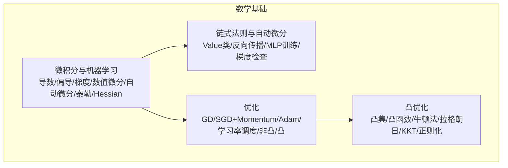
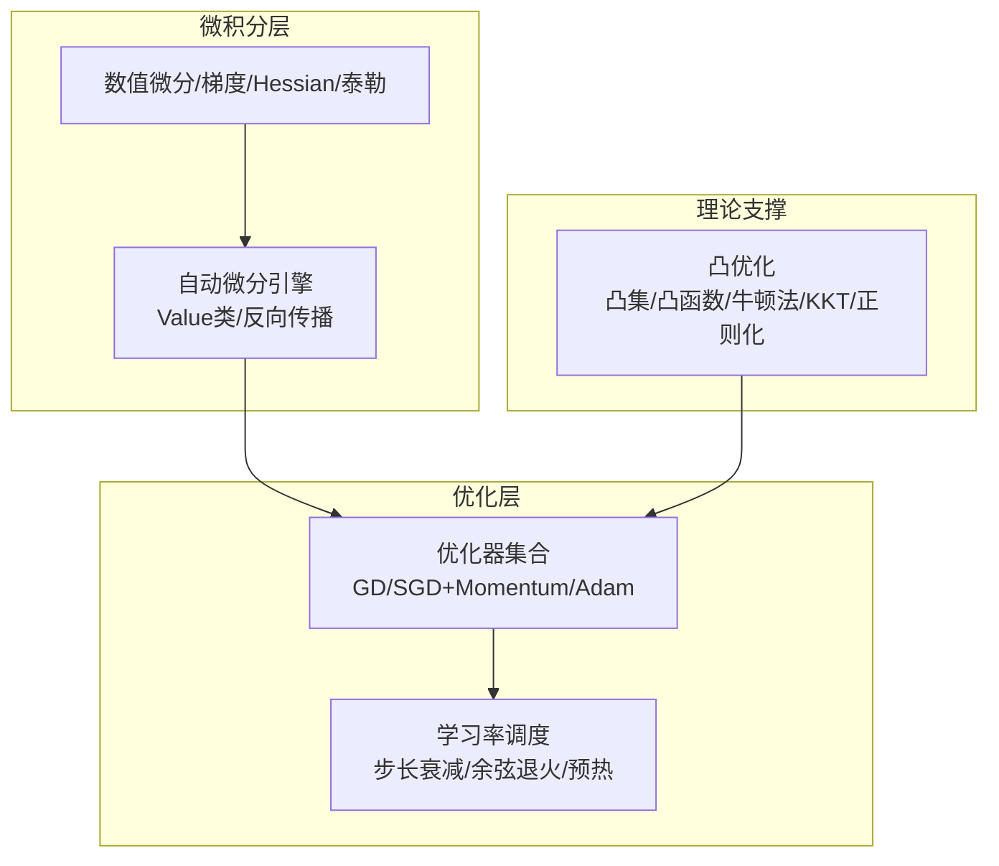
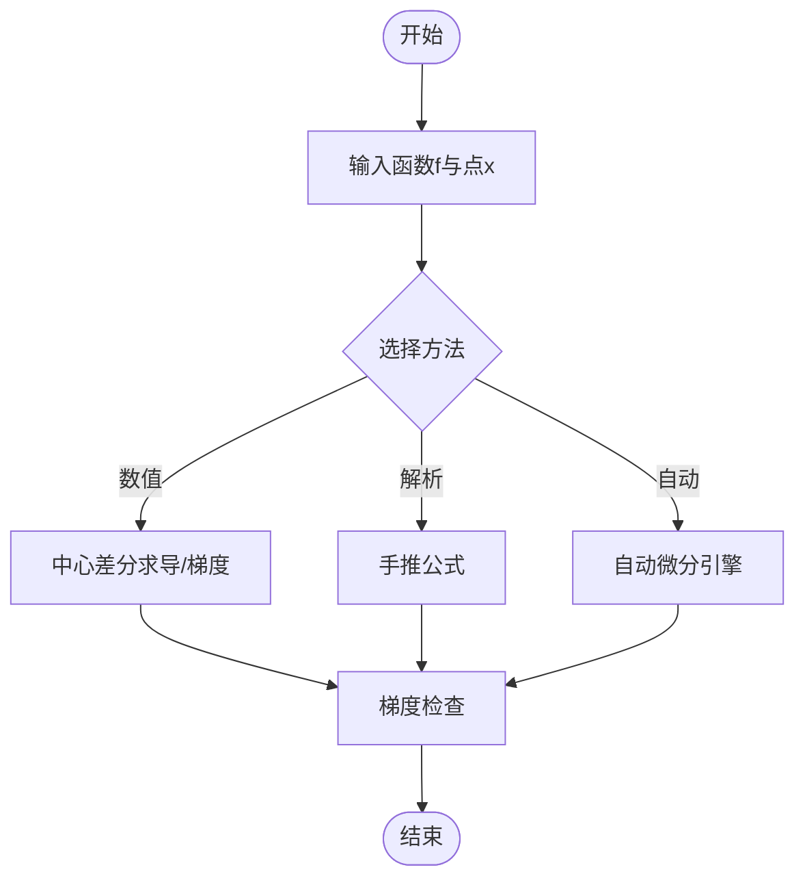
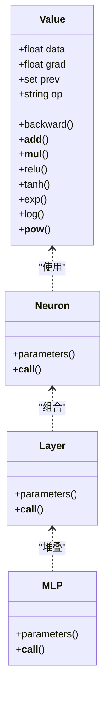
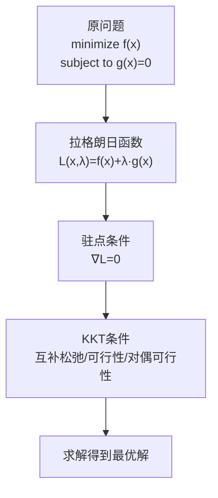
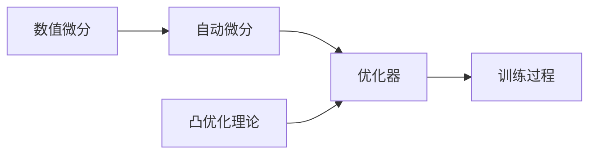

# 微积分与优化

<cite>
**本文引用的文件**
- [微积分与机器学习（文档）](file://phases/01-math-foundations/04-calculus-for-ml/docs/en.md)
- [微积分与机器学习（代码）](file://phases/01-math-foundations/04-calculus-for-ml/code/derivatives.py)
- [链式法则与自动微分（文档）](file://phases/01-math-foundations/05-chain-rule-and-autodiff/docs/en.md)
- [链式法则与自动微分（代码）](file://phases/01-math-foundations/05-chain-rule-and-autodiff/code/autodiff.py)
- [优化（文档）](file://phases/01-math-foundations/08-optimization/docs/en.md)
- [优化（代码）](file://phases/01-math-foundations/08-optimization/code/optimizers.py)
- [凸优化（文档）](file://phases/01-math-foundations/18-convex-optimization/docs/en.md)
- [梯度计算技能（输出）](file://phases/01-math-foundations/04-calculus-for-ml/outputs/skill-gradient-computation.md)
</cite>

## 目录
1. [引言](#引言)
2. [项目结构](#项目结构)
3. [核心组件](#核心组件)
4. [架构总览](#架构总览)
5. [详细组件分析](#详细组件分析)
6. [依赖关系分析](#依赖关系分析)
7. [性能考量](#性能考量)
8. [故障排查指南](#故障排查指南)
9. [结论](#结论)
10. [附录](#附录)

## 引言
本课程围绕“微积分与优化”在机器学习中的应用展开，系统讲解导数、偏导数、链式法则与自动微分，并深入到优化理论（梯度下降、凸优化、拉格朗日乘数法）。课程同时提供从零实现的数值微分与自动微分示例，帮助读者将数学理论与工程实践紧密结合，理解损失函数优化、参数更新策略、收敛性与稳定性分析的实际意义。

## 项目结构
本课程位于“数学基础”阶段，包含四门子课程：
- 微积分与机器学习：导数、偏导数、梯度、数值/解析/自动微分、泰勒展开、Hessian 等
- 链式法则与自动微分：构建最小化自动求导引擎，反向模式自动微分，训练 MLP
- 优化：梯度下降、动量、Adam、学习率调度、非凸/凸问题对比
- 凸优化：凸集/函数、Hessian 正半定、牛顿法、拉格朗日乘数法、KKT 条件、正则化作为约束优化



图表来源
- [微积分与机器学习（文档）:1-628](file://phases/01-math-foundations/04-calculus-for-ml/docs/en.md#L1-L628)
- [链式法则与自动微分（文档）:1-522](file://phases/01-math-foundations/05-chain-rule-and-autodiff/docs/en.md#L1-L522)
- [优化（文档）:1-381](file://phases/01-math-foundations/08-optimization/docs/en.md#L1-L381)
- [凸优化（文档）:1-556](file://phases/01-math-foundations/18-convex-optimization/docs/en.md#L1-L556)

章节来源
- [微积分与机器学习（文档）:1-628](file://phases/01-math-foundations/04-calculus-for-ml/docs/en.md#L1-L628)
- [链式法则与自动微分（文档）:1-522](file://phases/01-math-foundations/05-chain-rule-and-autodiff/docs/en.md#L1-L522)
- [优化（文档）:1-381](file://phases/01-math-foundations/08-optimization/docs/en.md#L1-L381)
- [凸优化（文档）:1-556](file://phases/01-math-foundations/18-convex-optimization/docs/en.md#L1-L556)

## 核心组件
- 数值微分与梯度计算：提供通用的数值导数、梯度、Hessian 计算与泰勒近似工具，便于验证与教学演示
- 自动微分引擎：以 Value 类为核心，记录运算图并执行反向传播，支持常见激活与算子
- 优化器集合：实现基础梯度下降、SGD+动量、Adam，并提供学习率调度思路
- 凸优化工具：测试凸性、实现牛顿法、拉格朗日乘数法与 KKT 条件，解释正则化与对偶性

章节来源
- [微积分与机器学习（代码）:1-266](file://phases/01-math-foundations/04-calculus-for-ml/code/derivatives.py#L1-L266)
- [链式法则与自动微分（代码）:1-358](file://phases/01-math-foundations/05-chain-rule-and-autodiff/code/autodiff.py#L1-L358)
- [优化（代码）:1-288](file://phases/01-math-foundations/08-optimization/code/optimizers.py#L1-L288)

## 架构总览
下图展示了从“数值/解析微分”到“自动微分”，再到“优化器”的端到端流程，以及“凸优化”作为理论支撑的作用。



图表来源
- [微积分与机器学习（文档）:115-134](file://phases/01-math-foundations/04-calculus-for-ml/docs/en.md#L115-L134)
- [链式法则与自动微分（文档）:135-143](file://phases/01-math-foundations/05-chain-rule-and-autodiff/docs/en.md#L135-L143)
- [优化（文档）:144-156](file://phases/01-math-foundations/08-optimization/docs/en.md#L144-L156)
- [凸优化（文档）:88-114](file://phases/01-math-foundations/18-convex-optimization/docs/en.md#L88-L114)

## 详细组件分析

### 组件A：数值微分与梯度计算
- 功能要点
  - 数值导数：中心差分公式，适合任意函数的快速近似
  - 数值梯度：对多变量函数逐维扰动求偏导
  - Hessian 数值估计：二阶中心差分，用于曲率分析
  - 泰勒近似：线性/二次近似，解释梯度下降与牛顿法的几何直觉
  - 线性回归示例：手工推导与自动微分一致，验证梯度方向正确
- 复杂度与性能
  - 数值导数/梯度：O(1)/O(n)，适合调试；大规模参数需谨慎使用
  - Hessian：O(n^2) 计算与存储，不适合深度学习
- 实践建议
  - 使用 h≈1e-7；避免过大或过小导致数值不稳定
  - 对于组合函数，优先使用解析/自动微分，必要时用数值校验



图表来源
- [微积分与机器学习（代码）:5-18](file://phases/01-math-foundations/04-calculus-for-ml/code/derivatives.py#L5-L18)
- [微积分与机器学习（文档）:115-134](file://phases/01-math-foundations/04-calculus-for-ml/docs/en.md#L115-L134)

章节来源
- [微积分与机器学习（代码）:1-266](file://phases/01-math-foundations/04-calculus-for-ml/code/derivatives.py#L1-L266)
- [微积分与机器学习（文档）:115-134](file://phases/01-math-foundations/04-calculus-for-ml/docs/en.md#L115-L134)

### 组件B：自动微分引擎（Value 类）
- 功能要点
  - 值包装：Value 存储数据与梯度，记录前驱节点与操作类型
  - 运算重载：加、乘、幂、指数、对数、tanh、ReLU 等
  - 反向传播：拓扑排序后逆序遍历，按链式法则累加上游梯度
  - 梯度检查：与数值微分对比，确保后向实现正确
  - 小型 MLP：基于 Value 的神经网络，可直接训练
- 设计模式
  - 动态计算图（定义即运行），每前向一次重建图
  - 每个节点维护局部梯度闭包，保证链式法则正确传递
- 性能与稳定性
  - 反向一次通过，时间复杂度与前向成正比
  - 注意梯度累积（+=）与分支合并时的求和规则



图表来源
- [链式法则与自动微分（代码）:4-105](file://phases/01-math-foundations/05-chain-rule-and-autodiff/code/autodiff.py#L4-L105)
- [链式法则与自动微分（代码）:191-227](file://phases/01-math-foundations/05-chain-rule-and-autodiff/code/autodiff.py#L191-L227)

章节来源
- [链式法则与自动微分（代码）:1-358](file://phases/01-math-foundations/05-chain-rule-and-autodiff/code/autodiff.py#L1-L358)

### 组件C：优化器与学习率调度
- 功能要点
  - 梯度下降：最基础的一阶优化
  - SGD+动量：累积历史梯度，抑制震荡，加速平坦区域
  - Adam：自适应一阶/二阶矩估计，逐参数自适应学习率
  - 学习率调度：阶梯衰减、指数衰减、余弦退火、预热
- 收敛性与稳定性
  - 学习率过大易发散；过小收敛慢
  - 动量有助于穿越窄山谷；噪声有助于逃出鞍点
  - Adam 在深度学习中广泛使用，但可能陷入尖峰最小值

```mermaid
sequenceDiagram
participant Train as "训练循环"
participant Loss as "损失函数"
participant Grad as "梯度计算"
participant Opt as "优化器"
participant Param as "参数"
Train->>Loss : 前向计算
Loss-->>Grad : 梯度
Train->>Opt : step(params, grads)
Opt->>Param : 更新参数
Train->>Train : 下一步迭代
```

图表来源
- [优化（代码）:75-89](file://phases/01-math-foundations/08-optimization/code/optimizers.py#L75-L89)
- [优化（文档）:144-156](file://phases/01-math-foundations/08-optimization/docs/en.md#L144-L156)

章节来源
- [优化（代码）:1-288](file://phases/01-math-foundations/08-optimization/code/optimizers.py#L1-L288)
- [优化（文档）:144-156](file://phases/01-math-foundations/08-optimization/docs/en.md#L144-L156)

### 组件D：凸优化与拉格朗日乘数法
- 功能要点
  - 凸性判定：定义检验、二阶导/海塞矩阵正半定
  - 牛顿法：利用海塞矩阵进行二阶优化，收敛更快但成本高
  - 拉格朗日乘数法：将约束优化转化为无约束问题
  - KKT 条件：不等式约束的必要条件
  - 正则化：L1/L2 作为约束优化的等价形式，解释稀疏性与权重收缩
- 实践启示
  - 深度学习非凸，但实践中仍能找到高质量解
  - 凸优化提供理论保证与高效算法（小规模问题）



图表来源
- [凸优化（文档）:215-276](file://phases/01-math-foundations/18-convex-optimization/docs/en.md#L215-L276)

章节来源
- [凸优化（文档）:197-311](file://phases/01-math-foundations/18-convex-optimization/docs/en.md#L197-L311)

### 组件E：梯度检查与数值稳定性
- 梯度检查：将自动微分结果与数值微分对比，阈值控制（通常小于 1e-5）
- 数值稳定性：h 的选择、溢出/无穷保护、梯度裁剪
- 实战建议：新增自定义算子时务必做梯度检查；训练异常先查梯度

章节来源
- [链式法则与自动微分（代码）:229-241](file://phases/01-math-foundations/05-chain-rule-and-autodiff/code/autodiff.py#L229-L241)
- [梯度计算技能（输出）:57-67](file://phases/01-math-foundations/04-calculus-for-ml/outputs/skill-gradient-computation.md#L57-L67)

## 依赖关系分析
- 数值微分是自动微分的“黄金标准”，用于验证后向实现
- 自动微分是优化器的“梯度供给者”，优化器依赖精确的梯度
- 凸优化理论指导非凸问题的实践：理解收敛性、稳定性与正则化



图表来源
- [微积分与机器学习（文档）:115-134](file://phases/01-math-foundations/04-calculus-for-ml/docs/en.md#L115-L134)
- [链式法则与自动微分（文档）:135-143](file://phases/01-math-foundations/05-chain-rule-and-autodiff/docs/en.md#L135-L143)
- [优化（文档）:144-156](file://phases/01-math-foundations/08-optimization/docs/en.md#L144-L156)

章节来源
- [微积分与机器学习（文档）:115-134](file://phases/01-math-foundations/04-calculus-for-ml/docs/en.md#L115-L134)
- [链式法则与自动微分（文档）:135-143](file://phases/01-math-foundations/05-chain-rule-and-autodiff/docs/en.md#L135-L143)
- [优化（文档）:144-156](file://phases/01-math-foundations/08-optimization/docs/en.md#L144-L156)

## 性能考量
- 数值微分：O(1)/O(n) 成本，适合小规模或调试；大规模参数不现实
- 自动微分：一次前向 + 一次反向，与计算图大小线性相关
- 优化器成本：Adam 最接近默认选择，兼顾效率与效果
- 凸优化：牛顿法二次收敛，但海塞矩阵成本高；L-BFGS 适合中小规模

章节来源
- [微积分与机器学习（文档）:249-257](file://phases/01-math-foundations/04-calculus-for-ml/docs/en.md#L249-L257)
- [凸优化（文档）:364-383](file://phases/01-math-foundations/18-convex-optimization/docs/en.md#L364-L383)

## 故障排查指南
- 梯度爆炸/消失：检查学习率、归一化、激活函数、初始化；考虑梯度裁剪
- 发散：降低学习率、启用动量/Adam、检查数值稳定性
- 局部最优/鞍点：增大批量、使用噪声、尝试不同初始化
- 自动微分错误：用梯度检查对比数值微分；逐算子验证

章节来源
- [优化（代码）:75-89](file://phases/01-math-foundations/08-optimization/code/optimizers.py#L75-L89)
- [梯度计算技能（输出）:49-67](file://phases/01-math-foundations/04-calculus-for-ml/outputs/skill-gradient-computation.md#L49-L67)

## 结论
本课程将微积分与优化的数学理论与工程实现紧密结合：从数值/解析微分到自动微分，再到优化器与学习率调度，最后以凸优化理论解释非凸问题的实践策略。通过动手实现与可视化分析，读者可以深入理解损失函数优化、参数更新策略、收敛性与稳定性，并具备在真实项目中诊断与改进的能力。

## 附录
- 实际应用案例
  - 线性回归：手工推导与自动微分一致，验证梯度方向
  - MLP 训练：基于 Value 的神经网络，反向传播更新参数
  - 优化比较：在 Rosenbrock 函数上对比 GD、SGD+M、Adam 的收敛速度
  - 凸优化：测试凸性、牛顿法、拉格朗日与 KKT 条件
- 关键术语速查
  - 导数/偏导/梯度：描述函数变化率与方向
  - 链式法则：复合函数求导的基石
  - 自动微分：机械化的精确求导
  - 凸/非凸：决定优化难度与理论保证
  - 牛顿法/动量/Adam：不同阶信息与自适应策略

章节来源
- [微积分与机器学习（文档）:607-622](file://phases/01-math-foundations/04-calculus-for-ml/docs/en.md#L607-L622)
- [链式法则与自动微分（文档）:500-516](file://phases/01-math-foundations/05-chain-rule-and-autodiff/docs/en.md#L500-L516)
- [优化（文档）:358-374](file://phases/01-math-foundations/08-optimization/docs/en.md#L358-L374)
- [凸优化（文档）:529-549](file://phases/01-math-foundations/18-convex-optimization/docs/en.md#L529-L549)