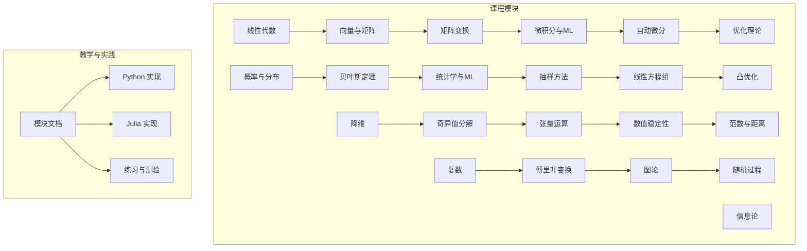
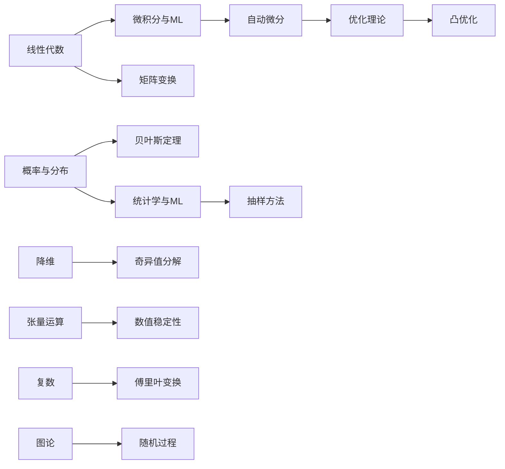

# 数学基础课程

<cite>
**本文引用的文件**
- [phases/01-math-foundations/README.md](file://phases/01-math-foundations/README.md)
- [ROADMAP.md](file://ROADMAP.md)
- [phases/01-math-foundations/01-linear-algebra-intuition/docs/README.md](file://phases/01-math-foundations/01-linear-algebra-intuition/docs/README.md)
- [phases/01-math-foundations/02-vectors-matrices-operations/docs/README.md](file://phases/01-math-foundations/02-vectors-matrices-operations/docs/README.md)
- [phases/01-math-foundations/03-matrix-transformations/docs/README.md](file://phases/01-math-foundations/03-matrix-transformations/docs/README.md)
- [phases/01-math-foundations/04-calculus-for-ml/docs/README.md](file://phases/01-math-foundations/04-calculus-for-ml/docs/README.md)
- [phases/01-math-foundations/05-chain-rule-and-autodiff/docs/README.md](file://phases/01-math-foundations/05-chain-rule-and-autodiff/docs/README.md)
- [phases/01-math-foundations/06-probability-and-distributions/docs/README.md](file://phases/01-math-foundations/06-probability-and-distributions/docs/README.md)
- [phases/01-math-foundations/07-bayes-theorem/docs/README.md](file://phases/01-math-foundations/07-bayes-theorem/docs/README.md)
- [phases/01-math-foundations/08-optimization/docs/README.md](file://phases/01-math-foundations/08-optimization/docs/README.md)
- [phases/01-math-foundations/09-information-theory/docs/README.md](file://phases/01-math-foundations/09-information-theory/docs/README.md)
- [phases/01-math-foundations/10-dimensionality-reduction/docs/README.md](file://phases/01-math-foundations/10-dimensionality-reduction/docs/README.md)
- [phases/01-math-foundations/11-singular-value-decomposition/docs/README.md](file://phases/01-math-foundations/11-singular-value-decomposition/docs/README.md)
- [phases/01-math-foundations/12-tensor-operations/docs/README.md](file://phases/01-math-foundations/12-tensor-operations/docs/README.md)
- [phases/01-math-foundations/13-numerical-stability/docs/README.md](file://phases/01-math-foundations/13-numerical-stability/docs/README.md)
- [phases/01-math-foundations/14-norms-and-distances/docs/README.md](file://phases/01-math-foundations/14-norms-and-distances/docs/README.md)
- [phases/01-math-foundations/15-statistics-for-ml/docs/README.md](file://phases/01-math-foundations/15-statistics-for-ml/docs/README.md)
- [phases/01-math-foundations/16-sampling-methods/docs/README.md](file://phases/01-math-foundations/16-sampling-methods/docs/README.md)
- [phases/01-math-foundations/17-linear-systems/docs/README.md](file://phases/01-math-foundations/17-linear-systems/docs/README.md)
- [phases/01-math-foundations/18-convex-optimization/docs/README.md](file://phases/01-math-foundations/18-convex-optimization/docs/README.md)
- [phases/01-math-foundations/19-complex-numbers/docs/README.md](file://phases/01-math-foundations/19-complex-numbers/docs/README.md)
- [phases/01-math-foundations/20-fourier-transform/docs/README.md](file://phases/01-math-foundations/20-fourier-transform/docs/README.md)
- [phases/01-math-foundations/21-graph-theory/docs/README.md](file://phases/01-math-foundations/21-graph-theory/docs/README.md)
- [phases/01-math-foundations/22-stochastic-processes/docs/README.md](file://phases/01-math-foundations/22-stochastic-processes/docs/README.md)
- [site/figures-math.js](file://site/figures-math.js)
- [site/figures-math2.js](file://site/figures-math2.js)
</cite>

## 目录
1. 引言
2. 项目结构
3. 核心组件
4. 架构总览
5. 详细组件分析
6. 依赖关系分析
7. 性能考量
8. 故障排查指南
9. 结论
10. 附录

## 引言
本课程面向“AI工程从零开始”项目中的数学基础阶段（Phase 1），强调以代码驱动的直觉构建，而非仅依赖教科书。课程覆盖线性代数、微积分、概率统计、优化理论等核心数学概念，并通过Python与Julia两种语言的实际实现加深理解。课程目标是帮助学习者建立扎实的数学直觉，理解这些数学工具如何支撑后续机器学习与深度学习算法的设计与实现。

## 项目结构
数学基础课程位于 phases/01-math-foundations 目录下，包含多个子主题模块，每个模块配套有教学文档与测验。课程整体由路线图 ROADMAP.md 统筹规划，确保学习路径系统化、递进式推进。

```mermaid
graph TB
Root["phases/01-math-foundations<br/>数学基础课程根目录"] --> M1["01 线性代数直觉"]
Root --> M2["02 向量与矩阵运算"]
Root --> M3["03 矩阵变换"]
Root --> M4["04 微积分与ML"]
Root --> M5["05 链式法则与自动微分"]
Root --> M6["06 概率与分布"]
Root --> M7["07 贝叶斯定理"]
Root --> M8["08 优化理论"]
Root --> M9["09 信息论"]
Root --> M10["10 降维"]
Root --> M11["11 奇异值分解"]
Root --> M12["12 张量运算"]
Root --> M13["13 数值稳定性"]
Root --> M14["14 范数与距离"]
Root --> M15["15 统计学与ML"]
Root --> M16["16 抽样方法"]
Root --> M17["17 线性方程组"]
Root --> M18["18 凸优化"]
Root --> M19["19 复数"]
Root --> M20["20 傅里叶变换"]
Root --> M21["21 图论"]
Root --> M22["22 随机过程"]
M1 --> Docs1["docs/README.md"]
M2 --> Docs2["docs/README.md"]
M3 --> Docs3["docs/README.md"]
M4 --> Docs4["docs/README.md"]
M5 --> Docs5["docs/README.md"]
M6 --> Docs6["docs/README.md"]
M7 --> Docs7["docs/README.md"]
M8 --> Docs8["docs/README.md"]
M9 --> Docs9["docs/README.md"]
M10 --> Docs10["docs/README.md"]
M11 --> Docs11["docs/README.md"]
M12 --> Docs12["docs/README.md"]
M13 --> Docs13["docs/README.md"]
M14 --> Docs14["docs/README.md"]
M15 --> Docs15["docs/README.md"]
M16 --> Docs16["docs/README.md"]
M17 --> Docs17["docs/README.md"]
M18 --> Docs18["docs/README.md"]
M19 --> Docs19["docs/README.md"]
M20 --> Docs20["docs/README.md"]
M21 --> Docs21["docs/README.md"]
M22 --> Docs22["docs/README.md"]
```

图表来源
- [phases/01-math-foundations/README.md:1-6](file://phases/01-math-foundations/README.md#L1-L6)
- [ROADMAP.md](file://ROADMAP.md)

章节来源
- [phases/01-math-foundations/README.md:1-6](file://phases/01-math-foundations/README.md#L1-L6)
- [ROADMAP.md](file://ROADMAP.md)

## 核心组件
- 线性代数：向量、矩阵、张量及其几何直觉与计算操作，为神经网络与多模态建模奠定基础。
- 微积分与自动微分：导数、梯度、链式法则，支撑反向传播与优化训练。
- 概率与统计：概率分布、贝叶斯推断、抽样与统计描述，用于不确定性建模与数据科学。
- 优化理论：无约束与约束优化、凸优化、数值方法，指导模型参数更新与收敛。
- 信息论与降维：熵、KL散度、主成分分析与SVD，用于特征提取与维度控制。
- 复杂数与傅里叶：频域分析与信号处理基础，支撑音频、图像与通信相关任务。
- 图论与随机过程：离散结构与随机演化模型，为强化学习与时序数据建模提供工具。

章节来源
- [phases/01-math-foundations/01-linear-algebra-intuition/docs/README.md](file://phases/01-math-foundations/01-linear-algebra-intuition/docs/README.md)
- [phases/01-math-foundations/02-vectors-matrices-operations/docs/README.md](file://phases/01-math-foundations/02-vectors-matrices-operations/docs/README.md)
- [phases/01-math-foundations/03-matrix-transformations/docs/README.md](file://phases/01-math-foundations/03-matrix-transformations/docs/README.md)
- [phases/01-math-foundations/04-calculus-for-ml/docs/README.md](file://phases/01-math-foundations/04-calculus-for-ml/docs/README.md)
- [phases/01-math-foundations/05-chain-rule-and-autodiff/docs/README.md](file://phases/01-math-foundations/05-chain-rule-and-autodiff/docs/README.md)
- [phases/01-math-foundations/06-probability-and-distributions/docs/README.md](file://phases/01-math-foundations/06-probability-and-distributions/docs/README.md)
- [phases/01-math-foundations/07-bayes-theorem/docs/README.md](file://phases/01-math-foundations/07-bayes-theorem/docs/README.md)
- [phases/01-math-foundations/08-optimization/docs/README.md](file://phases/01-math-foundations/08-optimization/docs/README.md)
- [phases/01-math-foundations/09-information-theory/docs/README.md](file://phases/01-math-foundations/09-information-theory/docs/README.md)
- [phases/01-math-foundations/10-dimensionality-reduction/docs/README.md](file://phases/01-math-foundations/10-dimensionality-reduction/docs/README.md)
- [phases/01-math-foundations/11-singular-value-decomposition/docs/README.md](file://phases/01-math-foundations/11-singular-value-decomposition/docs/README.md)
- [phases/01-math-foundations/12-tensor-operations/docs/README.md](file://phases/01-math-foundations/12-tensor-operations/docs/README.md)
- [phases/01-math-foundations/13-numerical-stability/docs/README.md](file://phases/01-math-foundations/13-numerical-stability/docs/README.md)
- [phases/01-math-foundations/14-norms-and-distances/docs/README.md](file://phases/01-math-foundations/14-norms-and-distances/docs/README.md)
- [phases/01-math-foundations/15-statistics-for-ml/docs/README.md](file://phases/01-math-foundations/15-statistics-for-ml/docs/README.md)
- [phases/01-math-foundations/16-sampling-methods/docs/README.md](file://phases/01-math-foundations/16-sampling-methods/docs/README.md)
- [phases/01-math-foundations/17-linear-systems/docs/README.md](file://phases/01-math-foundations/17-linear-systems/docs/README.md)
- [phases/01-math-foundations/18-convex-optimization/docs/README.md](file://phases/01-math-foundations/18-convex-optimization/docs/README.md)
- [phases/01-math-foundations/19-complex-numbers/docs/README.md](file://phases/01-math-foundations/19-complex-numbers/docs/README.md)
- [phases/01-math-foundations/20-fourier-transform/docs/README.md](file://phases/01-math-foundations/20-fourier-transform/docs/README.md)
- [phases/01-math-foundations/21-graph-theory/docs/README.md](file://phases/01-math-foundations/21-graph-theory/docs/README.md)
- [phases/01-math-foundations/22-stochastic-processes/docs/README.md](file://phases/01-math-foundations/22-stochastic-processes/docs/README.md)

## 架构总览
课程采用“主题模块化 + 代码实践”的教学架构：每个模块先给出直观的数学直觉，再通过Python与Julia的实现加深理解；同时配合测验巩固知识点。课程资源在站点侧通过图形脚本进行可视化辅助。

图表来源
- [phases/01-math-foundations/README.md:1-6](file://phases/01-math-foundations/README.md#L1-L6)
- [ROADMAP.md](file://ROADMAP.md)

## 详细组件分析

### 线性代数：直觉与实现
- 学习目标：建立向量、矩阵、张量的几何与代数直觉，理解线性变换、基底与坐标系转换。
- 实现方法：使用Python与Julia分别演示向量点积、叉积、矩阵乘法、特征值分解等。
- 应用场景：神经网络前向传播、注意力机制、图像处理、推荐系统。
- 数学直觉：将高维数据视为几何对象，借助投影、旋转、缩放等变换理解模型行为。

章节来源
- [phases/01-math-foundations/01-linear-algebra-intuition/docs/README.md](file://phases/01-math-foundations/01-linear-algebra-intuition/docs/README.md)
- [phases/01-math-foundations/02-vectors-matrices-operations/docs/README.md](file://phases/01-math-foundations/02-vectors-matrices-operations/docs/README.md)
- [phases/01-math-foundations/03-matrix-transformations/docs/README.md](file://phases/01-math-foundations/03-matrix-transformations/docs/README.md)

### 微积分与自动微分：梯度与链式法则
- 学习目标：掌握导数、偏导、梯度、方向导数；理解链式法则在复合函数求导中的作用。
- 实现方法：以Python/Julia实现标量/向量/矩阵的导数计算，演示自动微分在反向传播中的应用。
- 应用场景：损失函数优化、梯度下降、反向传播、雅可比/海塞矩阵。
- 数学直觉：梯度指向函数增长最快的方向；链式法则是多层模型误差回传的数学依据。

章节来源
- [phases/01-math-foundations/04-calculus-for-ml/docs/README.md](file://phases/01-math-foundations/04-calculus-for-ml/docs/README.md)
- [phases/01-math-foundations/05-chain-rule-and-autodiff/docs/README.md](file://phases/01-math-foundations/05-chain-rule-and-autodiff/docs/README.md)

### 概率与统计：分布与推断
- 学习目标：理解概率空间、条件概率、独立性；掌握常见分布（高斯、伯努利、泊松等）与统计量。
- 实现方法：用Python/Julia生成样本、估计参数、进行假设检验与贝叶斯推断。
- 应用场景：异常检测、不确定性量化、贝叶斯模型、变分推断。
- 数学直觉：概率是不确定性度量；期望与方差刻画分布中心与离散程度。

章节来源
- [phases/01-math-foundations/06-probability-and-distributions/docs/README.md](file://phases/01-math-foundations/06-probability-and-distributions/docs/README.md)
- [phases/01-math-foundations/15-statistics-for-ml/docs/README.md](file://phases/01-math-foundations/15-statistics-for-ml/docs/README.md)

### 贝叶斯定理：条件概率与更新
- 学习目标：掌握贝叶斯公式、先验/似然/后验的关系；理解参数与超参数的贝叶斯视角。
- 实现方法：以Python/Julia实现简单贝叶斯推断与MCMC采样。
- 应用场景：垃圾邮件分类、在线学习、主动学习、置信校准。
- 数学直觉：用先验知识结合观测证据迭代更新信念。

章节来源
- [phases/01-math-foundations/07-bayes-theorem/docs/README.md](file://phases/01-math-foundations/07-bayes-theorem/docs/README.md)

### 优化理论：无约束与约束优化
- 学习目标：理解目标函数、可行集、最优性条件；掌握梯度法、牛顿法、拉格朗日乘数法。
- 实现方法：Python/Julia实现一阶/二阶优化算法，演示约束处理。
- 应用场景：回归、神经网络训练、资源分配、风险预算。
- 数学直觉：在局部线性/二次近似基础上寻找下降方向或满足KKT条件的解。

章节来源
- [phases/01-math-foundations/08-optimization/docs/README.md](file://phases/01-math-foundations/08-optimization/docs/README.md)

### 信息论与降维：熵与SVD
- 学习目标：掌握熵、KL散度、互信息；理解PCA与SVD在降维中的角色。
- 实现方法：用Python/Julia计算信息度量、进行主成分变换与低秩近似。
- 应用场景：特征选择、去噪、压缩存储、异常检测。
- 数学直觉：信息熵衡量不确定度；SVD揭示数据的主要变化方向。

章节来源
- [phases/01-math-foundations/09-information-theory/docs/README.md](file://phases/01-math-foundations/09-information-theory/docs/README.md)
- [phases/01-math-foundations/10-dimensionality-reduction/docs/README.md](file://phases/01-math-foundations/10-dimensionality-reduction/docs/README.md)
- [phases/01-math-foundations/11-singular-value-decomposition/docs/README.md](file://phases/01-math-foundations/11-singular-value-decomposition/docs/README.md)

### 张量运算与数值稳定性
- 学习目标：理解高阶张量的索引与收缩；关注加减乘除的数值稳定性与溢出/欠流问题。
- 实现方法：Python/Julia演示广播、收缩、归一化与稳定化技巧。
- 应用场景：深度学习框架底层、高性能计算、科学计算。
- 数学直觉：张量是多线性映射的载体；数值稳定决定算法可复现性与精度。

章节来源
- [phases/01-math-foundations/12-tensor-operations/docs/README.md](file://phases/01-math-foundations/12-tensor-operations/docs/README.md)
- [phases/01-math-foundations/13-numerical-stability/docs/README.md](file://phases/01-math-foundations/13-numerical-stability/docs/README.md)

### 范数与距离：度量与正则化
- 学习目标：掌握L0/L1/L2/Inf范数与Frobenius范数；理解马氏距离与核技巧。
- 实现方法：Python/Julia实现距离度量与稀疏/正则化项构造。
- 应用场景：聚类、最近邻、稀疏编码、鲁棒回归。
- 数学直觉：不同范数对应不同的稀疏性与惩罚强度。

章节来源
- [phases/01-math-foundations/14-norms-and-distances/docs/README.md](file://phases/01-math-foundations/14-norms-and-distances/docs/README.md)

### 抽样方法与线性系统
- 学习目标：掌握重要性抽样、蒙特卡洛估计；理解线性方程组的解的存在性与唯一性。
- 实现方法：Python/Julia实现采样策略与线性系统求解器。
- 应用场景：重要性采样、贝叶斯后验估计、系统辨识。
- 数学直觉：通过样本逼近期望；通过矩阵结构判断解的性质。

章节来源
- [phases/01-math-foundations/16-sampling-methods/docs/README.md](file://phases/01-math-foundations/16-sampling-methods/docs/README.md)
- [phases/01-math-foundations/17-linear-systems/docs/README.md](file://phases/01-math-foundations/17-linear-systems/docs/README.md)

### 凸优化与复杂数/傅里叶
- 学习目标：理解凸集与凸函数、凸优化的全局最优性；掌握复数运算与傅里叶变换的频域表示。
- 实现方法：Python/Julia实现凸优化求解与频谱分析。
- 应用场景：正则化路径、滤波器设计、信号重建、图像处理。
- 数学直觉：凸性保证算法收敛到全局最优；复数与频域简化卷积与调制问题。

章节来源
- [phases/01-math-foundations/18-convex-optimization/docs/README.md](file://phases/01-math-foundations/18-convex-optimization/docs/README.md)
- [phases/01-math-foundations/19-complex-numbers/docs/README.md](file://phases/01-math-foundations/19-complex-numbers/docs/README.md)
- [phases/01-math-foundations/20-fourier-transform/docs/README.md](file://phases/01-math-foundations/20-fourier-transform/docs/README.md)

### 图论与随机过程
- 学习目标：掌握图的基本概念与遍历策略；理解马尔可夫性与随机游走。
- 实现方法：Python/Julia实现图算法与蒙特卡洛模拟。
- 应用场景：社交网络分析、强化学习轨迹建模、时间序列预测。
- 数学直觉：图刻画关系与依赖；随机过程刻画随时间演化的不确定性。

章节来源
- [phases/01-math-foundations/21-graph-theory/docs/README.md](file://phases/01-math-foundations/21-graph-theory/docs/README.md)
- [phases/01-math-foundations/22-stochastic-processes/docs/README.md](file://phases/01-math-foundations/22-stochastic-processes/docs/README.md)

## 依赖关系分析
- 模块间依赖：线性代数是后续微积分、优化与信息论的基础；概率与统计贯穿抽样、贝叶斯与统计学习；优化理论为训练提供统一框架。
- 语言与工具：Python与Julia并行实现，便于对比不同生态的表达与性能。
- 可视化支持：站点脚本 site/figures-math.js 与 site/figures-math2.js 提供数学图示辅助教学。

图表来源
- [ROADMAP.md](file://ROADMAP.md)

章节来源
- [ROADMAP.md](file://ROADMAP.md)

## 性能考量
- 计算效率：优先使用向量化与广播，避免显式循环；在Python中利用NumPy，在Julia中利用内置数组操作。
- 内存管理：注意中间结果的缓存与释放；对大矩阵/张量运算采用分块策略。
- 数值稳健：在梯度计算中使用稳定化技巧（如log-sum-exp）；在SVD与特征分解中注意条件数与舍入误差。
- 并行化：在批量处理与蒙特卡洛估计中充分利用并行计算能力。

## 故障排查指南
- 导数/梯度不收敛：检查学习率、初始化与正则化；确认链式法则的中间梯度是否正确传播。
- SVD/特征分解不稳定：检查矩阵病态程度；考虑添加正则项或使用更稳定的分解方法。
- 贝叶斯推断发散：检查先验设置与似然建模；确认采样步长与混合时间。
- 抽样偏差：验证采样策略与重要性权重；确保充分采样与收敛诊断。
- 图算法错误：核对邻接表示与访问标记；检查递归深度与栈溢出风险。

## 结论
本课程通过“直觉—实现—应用”的闭环，将线性代数、微积分、概率统计与优化理论有机融合，为后续机器学习与深度学习打下坚实的数学根基。建议学习者在掌握每个模块的数学直觉后，立即用Python与Julia编写代码进行验证，并结合练习题巩固知识点。

## 附录
- 练习题目：每模块均配有测验与作业，建议按顺序完成以形成完整知识体系。
- 实际应用：将所学应用于真实数据集（如回归、分类、聚类、推荐等），加深对算法内部机制的理解。
- 进阶阅读：结合课程提供的参考链接与扩展资料，逐步深入到前沿研究与工程实践。