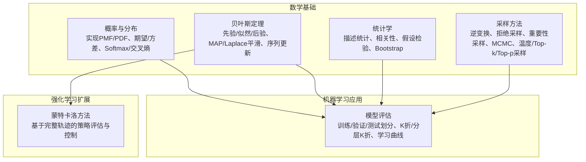
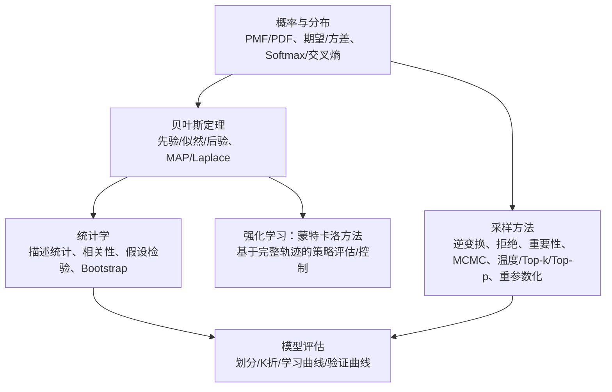
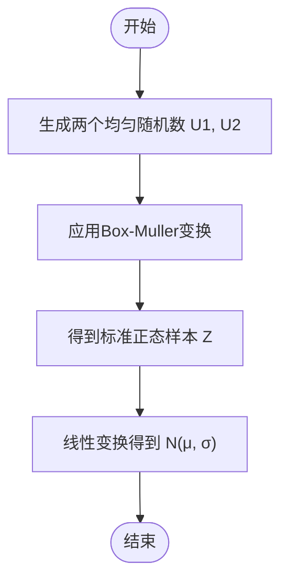
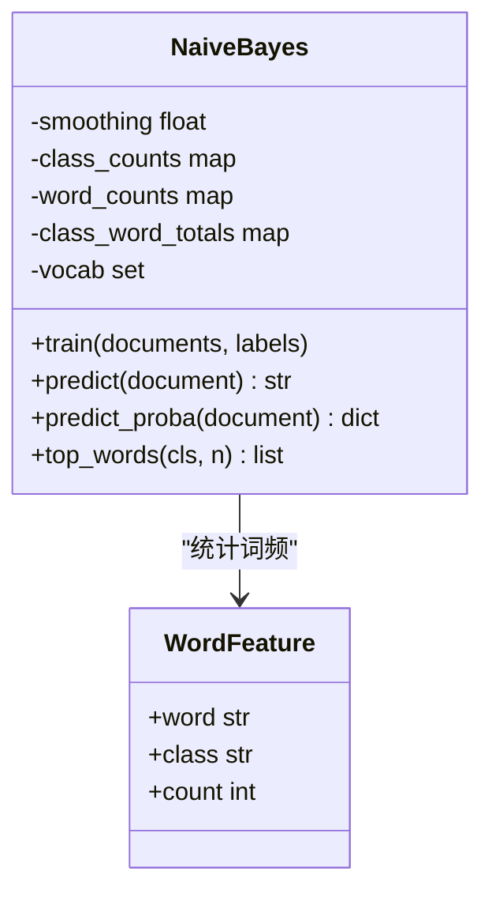
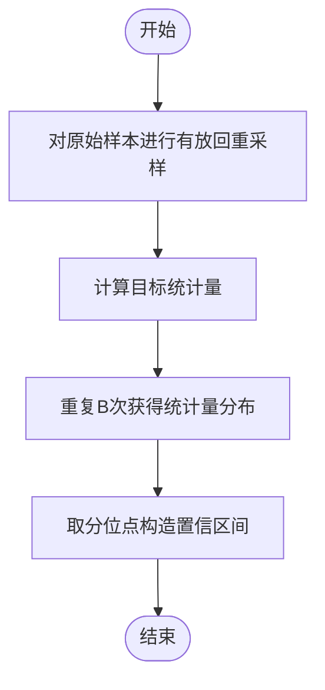
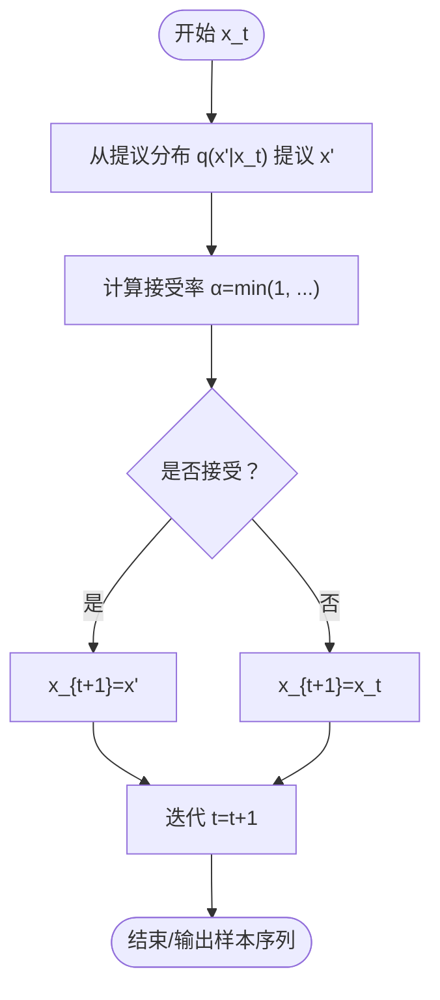
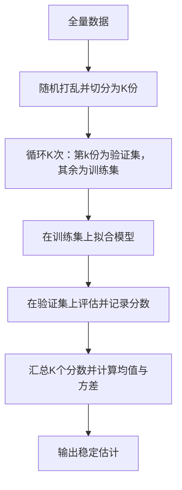
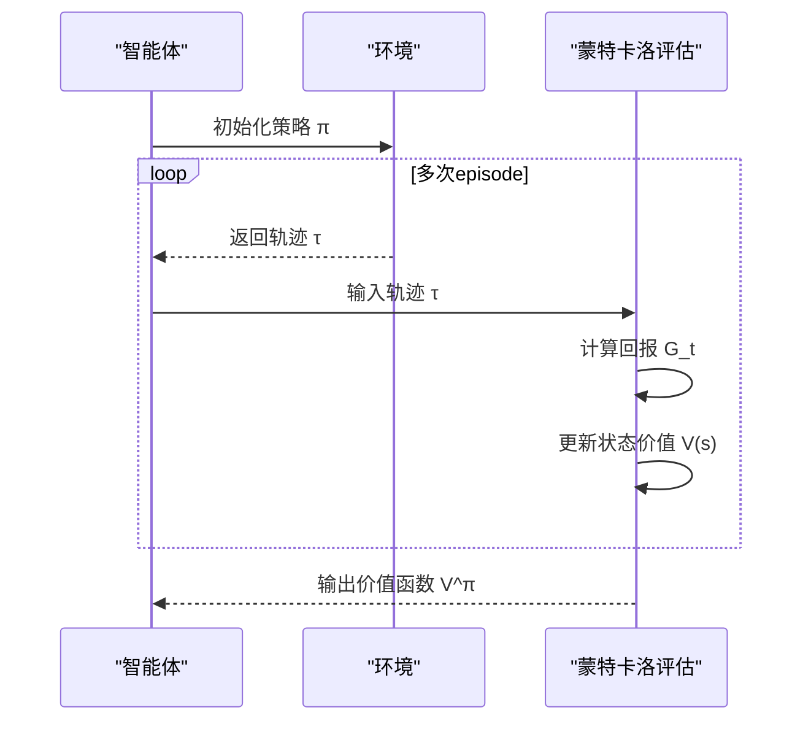
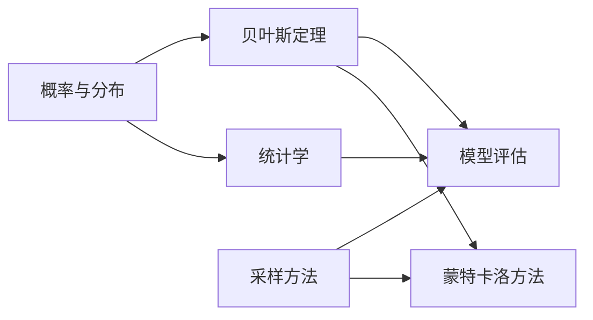

# 概率论与统计学

<cite>
**本文引用的文件**
- [概率与分布（文档）](file://phases/01-math-foundations/06-probability-and-distributions/docs/en.md)
- [概率与分布（代码）](file://phases/01-math-foundations/06-probability-and-distributions/code/probability.py)
- [贝叶斯定理（文档）](file://phases/01-math-foundations/07-bayes-theorem/docs/en.md)
- [贝叶斯定理（代码）](file://phases/01-math-foundations/07-bayes-theorem/code/bayes.py)
- [统计学（文档）](file://phases/01-math-foundations/15-statistics-for-ml/docs/en.md)
- [采样方法（文档）](file://phases/01-math-foundations/16-sampling-methods/docs/en.md)
- [蒙特卡洛方法（文档）](file://phases/09-reinforcement-learning/03-monte-carlo-methods/docs/en.md)
- [模型评估（文档）](file://phases/02-ml-fundamentals/09-model-evaluation/docs/en.md)
- [数据概览（前端脚本）](file://site/data.js)
</cite>

## 目录
1. [引言](#引言)
2. [项目结构](#项目结构)
3. [核心组件](#核心组件)
4. [架构总览](#架构总览)
5. [详细组件分析](#详细组件分析)
6. [依赖关系分析](#依赖关系分析)
7. [性能考量](#性能考量)
8. [故障排查指南](#故障排查指南)
9. [结论](#结论)
10. [附录](#附录)

## 引言
本课程围绕“概率论与统计学”展开，系统讲解概率基础（分布、期望、方差）、贝叶斯定理、统计推断（假设检验、置信区间、Bootstrap）、以及采样与蒙特卡洛方法在AI中的应用。课程以“从零实现”为核心理念，配套大量可运行的Python示例，帮助读者建立对概率与统计在机器学习中落地应用的深度理解。

## 项目结构
该仓库将概率与统计知识按“数学基础—机器学习应用—强化学习扩展”的层次组织，形成从理论到实践的完整路径：
- 数学基础：概率与分布、贝叶斯定理、统计学、采样方法
- 机器学习应用：模型评估、偏差-方差权衡、超参数调优
- 强化学习扩展：蒙特卡洛方法（基于完整轨迹的策略评估）

图表来源
- [概率与分布（文档）:1-459](file://phases/01-math-foundations/06-probability-and-distributions/docs/en.md#L1-L459)
- [贝叶斯定理（文档）:1-467](file://phases/01-math-foundations/07-bayes-theorem/docs/en.md#L1-L467)
- [统计学（文档）:1-517](file://phases/01-math-foundations/15-statistics-for-ml/docs/en.md#L1-L517)
- [采样方法（文档）:1-685](file://phases/01-math-foundations/16-sampling-methods/docs/en.md#L1-L685)
- [模型评估（文档）:1-680](file://phases/02-ml-fundamentals/09-model-evaluation/docs/en.md#L1-L680)
- [蒙特卡洛方法（文档）:1-209](file://phases/09-reinforcement-learning/03-monte-carlo-methods/docs/en.md#L1-L209)

章节来源
- [概率与分布（文档）:1-459](file://phases/01-math-foundations/06-probability-and-distributions/docs/en.md#L1-L459)
- [贝叶斯定理（文档）:1-467](file://phases/01-math-foundations/07-bayes-theorem/docs/en.md#L1-L467)
- [统计学（文档）:1-517](file://phases/01-math-foundations/15-statistics-for-ml/docs/en.md#L1-L517)
- [采样方法（文档）:1-685](file://phases/01-math-foundations/16-sampling-methods/docs/en.md#L1-L685)
- [模型评估（文档）:1-680](file://phases/02-ml-fundamentals/09-model-evaluation/docs/en.md#L1-L680)
- [蒙特卡洛方法（文档）:1-209](file://phases/09-reinforcement-learning/03-monte-carlo-methods/docs/en.md#L1-L209)

## 核心组件
- 概率与分布：PMF/PDF、期望与方差、Softmax与交叉熵、中心极限定理演示
- 贝叶斯定理：先验/似然/后验、MAP估计、Laplace平滑、序列更新与A/B测试
- 统计学：描述统计、相关性（皮尔逊/斯皮尔曼）、假设检验（t检验、卡方检验）、Bootstrap置信区间、多重比较校正
- 采样方法：逆变换、拒绝采样、重要性采样、MCMC（Metropolis-Hastings/Gibbs）、温度采样、Top-k/Top-p采样、重参数化技巧
- 模型评估：训练/验证/测试划分、K折与分层K折、学习曲线、验证曲线、常见评估误区
- 蒙特卡洛方法：基于完整轨迹的策略评估、首次访问/每次访问、探索策略（ε-贪心、探索性开始、离策略）

章节来源
- [概率与分布（文档）:10-459](file://phases/01-math-foundations/06-probability-and-distributions/docs/en.md#L10-L459)
- [贝叶斯定理（文档）:10-467](file://phases/01-math-foundations/07-bayes-theorem/docs/en.md#L10-L467)
- [统计学（文档）:10-517](file://phases/01-math-foundations/15-statistics-for-ml/docs/en.md#L10-L517)
- [采样方法（文档）:10-685](file://phases/01-math-foundations/16-sampling-methods/docs/en.md#L10-L685)
- [模型评估（文档）:10-680](file://phases/02-ml-fundamentals/09-model-evaluation/docs/en.md#L10-L680)
- [蒙特卡洛方法（文档）:10-209](file://phases/09-reinforcement-learning/03-monte-carlo-methods/docs/en.md#L10-L209)

## 架构总览
下图展示了从概率与分布出发，逐步构建到统计推断与采样方法，并最终应用于模型评估与强化学习的路径。

图表来源
- [概率与分布（文档）:1-459](file://phases/01-math-foundations/06-probability-and-distributions/docs/en.md#L1-L459)
- [贝叶斯定理（文档）:1-467](file://phases/01-math-foundations/07-bayes-theorem/docs/en.md#L1-L467)
- [统计学（文档）:1-517](file://phases/01-math-foundations/15-statistics-for-ml/docs/en.md#L1-L517)
- [采样方法（文档）:1-685](file://phases/01-math-foundations/16-sampling-methods/docs/en.md#L1-L685)
- [模型评估（文档）:1-680](file://phases/02-ml-fundamentals/09-model-evaluation/docs/en.md#L1-L680)
- [蒙特卡洛方法（文档）:1-209](file://phases/09-reinforcement-learning/03-monte-carlo-methods/docs/en.md#L1-L209)

## 详细组件分析

### 概率与分布
- 实现要点
  - 基础函数：阶乘、组合数、条件概率
  - 分布实现：伯努利、分类、泊松、均匀、正态PMF/PDF
  - 期望与方差：离散/连续定义、计算示例
  - 抽样：伯努利、分类、正态（Box-Muller）
  - Softmax与log_softmax：数值稳定性（减去最大logit）
  - 交叉熵损失：负对数似然
  - 中心极限定理演示：样本均值趋于正态
- 关键流程图（以正态抽样为例）

图表来源
- [概率与分布（代码）:75-86](file://phases/01-math-foundations/06-probability-and-distributions/code/probability.py#L75-L86)

章节来源
- [概率与分布（文档）:261-422](file://phases/01-math-foundations/06-probability-and-distributions/docs/en.md#L261-L422)
- [概率与分布（代码）:1-327](file://phases/01-math-foundations/06-probability-and-distributions/code/probability.py#L1-L327)

### 贝叶斯定理
- 核心公式与直觉：先验 + 证据 → 后验；顺序更新即在线学习
- 实践应用
  - 疾病检测示例：解释基率忽视
  - 文档分类：朴素贝叶斯、拉普拉斯平滑、log空间避免下溢
  - 参数估计：MLE vs MAP；高斯先验对应L2正则
  - 序列更新：Beta-Binomial共轭更新；A/B测试后验比较
- 类关系图（朴素贝叶斯分类器）

图表来源
- [贝叶斯定理（代码）:19-87](file://phases/01-math-foundations/07-bayes-theorem/code/bayes.py#L19-L87)

章节来源
- [贝叶斯定理（文档）:10-467](file://phases/01-math-foundations/07-bayes-theorem/docs/en.md#L10-L467)
- [贝叶斯定理（代码）:1-346](file://phases/01-math-foundations/07-bayes-theorem/code/bayes.py#L1-L346)

### 统计学
- 描述统计：均值、中位数、标准差、百分位、四分位距
- 相关性：皮尔逊相关系数、斯皮尔曼秩相关、协方差矩阵
- 假设检验：单样本/双样本t检验、配对t检验、卡方检验
- 区间估计：置信区间、Bootstrap置信区间（百分位法）
- 实践要点：显著性与实际意义、多重比较校正（Bonferroni）、常见错误（数据泄露、误选指标、测试集污染）
- 流程图（Bootstrap置信区间）

图表来源
- [统计学（文档）:334-382](file://phases/01-math-foundations/15-statistics-for-ml/docs/en.md#L334-L382)

章节来源
- [统计学（文档）:1-517](file://phases/01-math-foundations/15-statistics-for-ml/docs/en.md#L1-L517)

### 采样方法
- 逆变换采样、拒绝采样、重要性采样、蒙特卡洛积分
- MCMC：Metropolis-Hastings、Gibbs采样
- 重参数化技巧：使VAE等可微
- 语言模型采样：温度采样、Top-k、Top-p（核采样）
- 流程图（Metropolis-Hastings）

图表来源
- [采样方法（文档）:187-216](file://phases/01-math-foundations/16-sampling-methods/docs/en.md#L187-L216)

章节来源
- [采样方法（文档）:1-685](file://phases/01-math-foundations/16-sampling-methods/docs/en.md#L1-L685)

### 模型评估
- 划分策略：训练/验证/测试三集职责清晰
- 交叉验证：K折与分层K折，解释为何分层对不平衡数据重要
- 指标体系：分类（混淆矩阵、准确率、精确率、召回率、F1、AUC-ROC）、回归（MSE、RMSE、MAE、R²）
- 学习曲线与验证曲线：诊断高偏差/高方差
- 常见误区：数据泄露、指标误选、测试集污染
- 流程图（K折交叉验证）

图表来源
- [模型评估（文档）:51-90](file://phases/02-ml-fundamentals/09-model-evaluation/docs/en.md#L51-L90)

章节来源
- [模型评估（文档）:1-680](file://phases/02-ml-fundamentals/09-model-evaluation/docs/en.md#L1-L680)

### 蒙特卡洛方法（强化学习）
- 核心思想：仅需采样轨迹，用回报平均估计价值
- 首次访问与每次访问MC的区别
- 探索问题：探索性开始、ε-贪心、离策略重要性采样
- 控制算法：策略迭代框架下的蒙特卡洛控制
- 流程图（蒙特卡洛策略评估）

图表来源
- [蒙特卡洛方法（文档）:22-45](file://phases/09-reinforcement-learning/03-monte-carlo-methods/docs/en.md#L22-L45)

章节来源
- [蒙特卡洛方法（文档）:1-209](file://phases/09-reinforcement-learning/03-monte-carlo-methods/docs/en.md#L1-L209)

## 依赖关系分析
- 概率与分布为后续所有模块提供“分布与期望”的数学基础
- 贝叶斯定理贯穿参数估计、在线学习与不确定性量化
- 统计学为模型比较与实验设计提供严谨框架
- 采样方法是生成式模型、强化学习与贝叶斯推断的核心工具
- 模型评估将上述方法整合到工程实践中
- 蒙特卡洛方法在强化学习中作为无模型策略评估的基础

图表来源
- [概率与分布（文档）:1-459](file://phases/01-math-foundations/06-probability-and-distributions/docs/en.md#L1-L459)
- [贝叶斯定理（文档）:1-467](file://phases/01-math-foundations/07-bayes-theorem/docs/en.md#L1-L467)
- [统计学（文档）:1-517](file://phases/01-math-foundations/15-statistics-for-ml/docs/en.md#L1-L517)
- [采样方法（文档）:1-685](file://phases/01-math-foundations/16-sampling-methods/docs/en.md#L1-L685)
- [模型评估（文档）:1-680](file://phases/02-ml-fundamentals/09-model-evaluation/docs/en.md#L1-L680)
- [蒙特卡洛方法（文档）:1-209](file://phases/09-reinforcement-learning/03-monte-carlo-methods/docs/en.md#L1-L209)

## 性能考量
- 数值稳定性
  - 使用log空间与log-sum-exp技巧避免下溢/上溢（Softmax、交叉熵、链式概率）
  - 正态抽样采用Box-Muller或极坐标法，避免直接使用近似
- 计算复杂度
  - 期望与方差：O(n)；协方差矩阵：O(d²n)（d特征数）
  - 采样：逆变换/拒绝采样通常O(1)每次样本；MCMC需要多次迭代收敛
- 收敛与方差
  - Bootstrap置信区间误差O(1/√N)，与维度无关
  - 蒙特卡洛回报方差随轨迹长度增长，TD方法通过bootstrap降低方差

## 故障排查指南
- 指标误用
  - 不平衡数据使用准确率会误导，应关注精确率、召回率、F1、AUC-ROC
  - 回归任务优先考虑稳健指标（MAE）对抗异常值
- 数据泄露
  - 预处理（标准化/归一化）必须在划分之后进行，避免信息泄漏
- 评估陷阱
  - 随机划分未考虑时间依赖；使用分层K折保持类别比例
  - 过度依赖单一指标，忽略业务实际意义
- 贝叶斯与采样
  - 共轭先验简化后验推导；非共轭时考虑MCMC或变分推断
  - 采样效率低时采用重要性采样或重要性加权

章节来源
- [模型评估（文档）:133-147](file://phases/02-ml-fundamentals/09-model-evaluation/docs/en.md#L133-L147)
- [统计学（文档）:456-476](file://phases/01-math-foundations/15-statistics-for-ml/docs/en.md#L456-L476)
- [采样方法（文档）:187-216](file://phases/01-math-foundations/16-sampling-methods/docs/en.md#L187-L216)

## 结论
本课程通过“从零实现”的方式，将概率与统计的理论与实践紧密结合，覆盖从基础分布、贝叶斯推断、统计推断到采样与蒙特卡洛方法在AI中的应用。配合模型评估与强化学习扩展，帮助读者建立以概率思维指导AI决策的系统能力。

## 附录
- 相关资源与进一步阅读
  - [3Blue1Brown：中心极限定理](https://www.youtube.com/watch?v=zeJD6dqJ5lo)
  - [斯坦福CS229概率复习](https://cs229.stanford.edu/section/cs229-prob.pdf)
  - [Log-sum-exp技巧](https://gregorygundersen.com/blog/2020/02/09/log-sum-exp/)
  - [Sutton & Barto：蒙特卡洛方法](http://incompleteideas.net/book/RLbook2020.pdf)
  - [scikit-learn模型选择指南](https://scikit-learn.org/stable/model_selection.html)