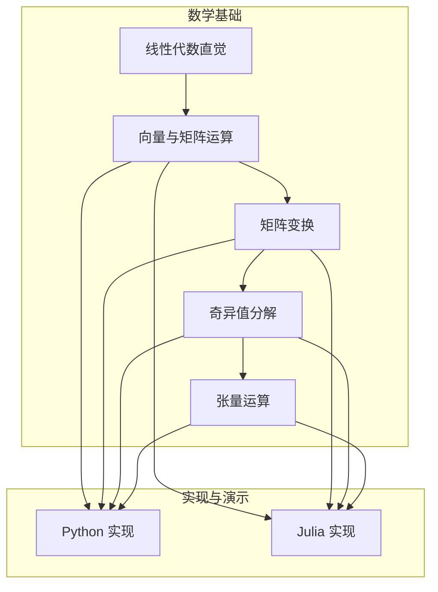
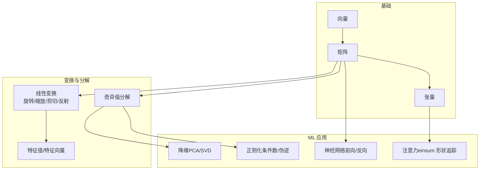
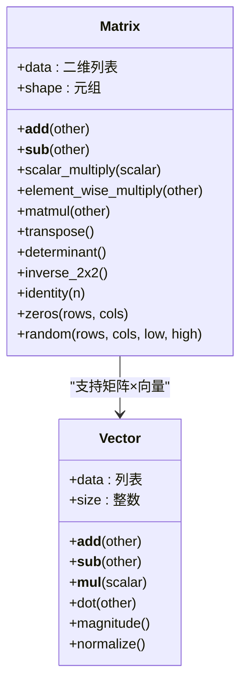
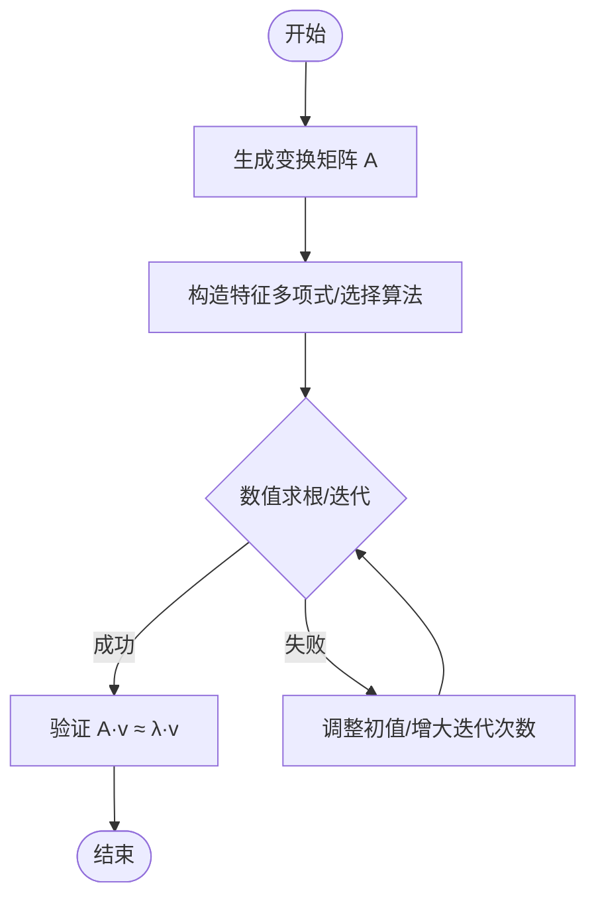
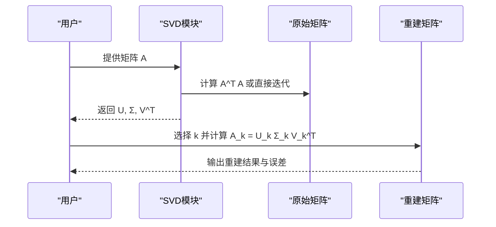
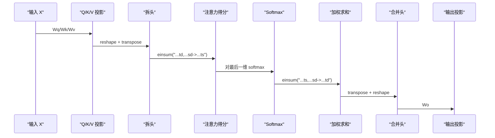
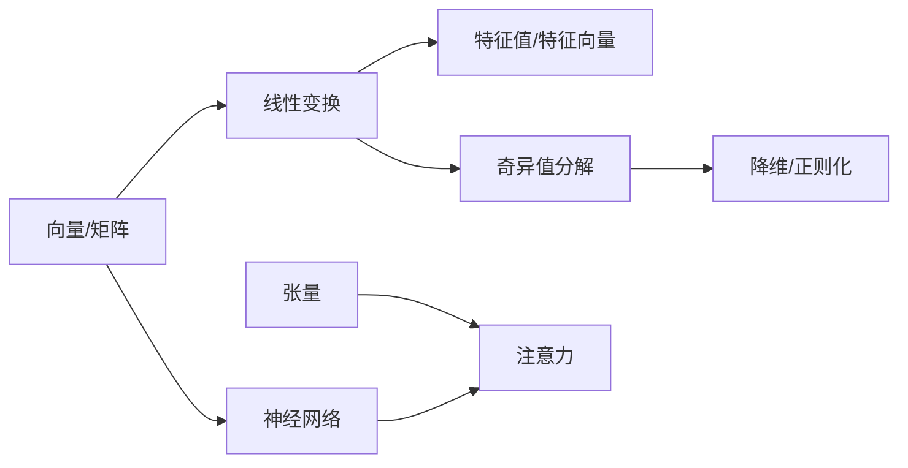

# 线性代数基础

<cite>
**本文引用的文件**
- [线性代数直觉（英文）](file://phases/01-math-foundations/01-linear-algebra-intuition/docs/en.md)
- [向量与矩阵运算（英文）](file://phases/01-math-foundations/02-vectors-matrices-operations/docs/en.md)
- [矩阵变换（英文）](file://phases/01-math-foundations/03-matrix-transformations/docs/en.md)
- [奇异值分解（英文）](file://phases/01-math-foundations/11-singular-value-decomposition/docs/en.md)
- [张量运算（英文）](file://phases/01-math-foundations/12-tensor-operations/docs/en.md)
- [向量与矩阵（Python 实现）](file://phases/01-math-foundations/02-vectors-matrices-operations/code/matrices.py)
- [矩阵变换（Python 实现）](file://phases/01-math-foundations/03-matrix-transformations/code/transformations.py)
- [奇异值分解（Python 实现）](file://phases/01-math-foundations/11-singular-value-decomposition/code/svd.py)
- [张量操作（Python 实现）](file://phases/01-math-foundations/12-tensor-operations/code/tensors.py)
- [向量与矩阵（Julia 实现）](file://phases/01-math-foundations/02-vectors-matrices-operations/code/matrices.jl)
- [矩阵变换（Julia 实现）](file://phases/01-math-foundations/03-matrix-transformations/code/transformations.jl)
- [奇异值分解（Julia 实现）](file://phases/01-math-foundations/11-singular-value-decomposition/code/svd.jl)
- [张量操作（Julia 实现）](file://phases/01-math-foundations/12-tensor-operations/code/tensors.jl)
</cite>

## 目录
1. [引言](#引言)
2. [项目结构](#项目结构)
3. [核心组件](#核心组件)
4. [架构总览](#架构总览)
5. [详细组件分析](#详细组件分析)
6. [依赖关系分析](#依赖关系分析)
7. [性能考量](#性能考量)
8. [故障排查指南](#故障排查指南)
9. [结论](#结论)
10. [附录](#附录)

## 引言
本课程围绕“线性代数基础”展开，系统讲解向量、矩阵、张量的基本概念与运算规则，深入剖析线性变换、特征值与特征向量、奇异值分解（SVD）等核心主题，并结合机器学习中的实际应用（降维、正则化、神经网络、注意力机制等），提供 Python 与 Julia 的可运行实现与可视化思路，帮助读者建立扎实的数学直觉与工程实践能力。

## 项目结构
该仓库将线性代数知识以“构建型”与“使用型”两条主线组织：
- 构建型：通过手写类与函数理解底层原理（向量/矩阵/张量类、形状推导、广播、einsum、SVD 动态迭代）
- 使用型：直接调用 NumPy/PyTorch/JAX/LinearAlgebra 等高性能库进行工程实践

图示来源
- [线性代数直觉（英文）:1-464](file://phases/01-math-foundations/01-linear-algebra-intuition/docs/en.md#L1-L464)
- [向量与矩阵运算（英文）:1-347](file://phases/01-math-foundations/02-vectors-matrices-operations/docs/en.md#L1-L347)
- [矩阵变换（英文）:1-466](file://phases/01-math-foundations/03-matrix-transformations/docs/en.md#L1-L466)
- [奇异值分解（英文）:1-551](file://phases/01-math-foundations/11-singular-value-decomposition/docs/en.md#L1-L551)
- [张量运算（英文）:1-345](file://phases/01-math-foundations/12-tensor-operations/docs/en.md#L1-L345)

章节来源
- [线性代数直觉（英文）:1-464](file://phases/01-math-foundations/01-linear-algebra-intuition/docs/en.md#L1-L464)
- [向量与矩阵运算（英文）:1-347](file://phases/01-math-foundations/02-vectors-matrices-operations/docs/en.md#L1-L347)
- [矩阵变换（英文）:1-466](file://phases/01-math-foundations/03-matrix-transformations/docs/en.md#L1-L466)
- [奇异值分解（英文）:1-551](file://phases/01-math-foundations/11-singular-value-decomposition/docs/en.md#L1-L551)
- [张量运算（英文）:1-345](file://phases/01-math-foundations/12-tensor-operations/docs/en.md#L1-L345)

## 核心组件
- 向量与矩阵类（Python）：实现向量加减、点积、模长；矩阵加减、标量乘、逐元素乘、矩阵乘、转置、行列式、逆、单位阵等
- 矩阵变换（Python/Julia）：旋转、缩放、剪切、反射、组合变换、特征值与特征向量、行列式几何意义
- 奇异值分解（Python/Julia）：幂迭代求最大奇异值/向量、低秩近似、图像压缩、推荐系统、噪声抑制、伪逆、条件数
- 张量操作（Python/Julia）：多维数组存储与步幅、重排与转置、广播、einsum、注意力机制形状追踪

章节来源
- [向量与矩阵（Python 实现）:1-329](file://phases/01-math-foundations/02-vectors-matrices-operations/code/matrices.py#L1-L329)
- [矩阵变换（Python 实现）:1-355](file://phases/01-math-foundations/03-matrix-transformations/code/transformations.py#L1-L355)
- [奇异值分解（Python 实现）:1-642](file://phases/01-math-foundations/11-singular-value-decomposition/code/svd.py#L1-L642)
- [张量操作（Python 实现）:1-776](file://phases/01-math-foundations/12-tensor-operations/code/tensors.py#L1-L776)
- [向量与矩阵（Julia 实现）:1-157](file://phases/01-math-foundations/02-vectors-matrices-operations/code/matrices.jl#L1-L157)
- [矩阵变换（Julia 实现）:1-157](file://phases/01-math-foundations/03-matrix-transformations/code/transformations.jl#L1-L157)
- [奇异值分解（Julia 实现）:1-157](file://phases/01-math-foundations/11-singular-value-decomposition/code/svd.jl#L1-L157)
- [张量操作（Julia 实现）:1-157](file://phases/01-math-foundations/12-tensor-operations/code/tensors.jl#L1-L157)

## 架构总览
下图展示了从“向量/矩阵”到“张量”的抽象层级，以及在机器学习中的典型应用路径。

图示来源
- [线性代数直觉（英文）:1-464](file://phases/01-math-foundations/01-linear-algebra-intuition/docs/en.md#L1-L464)
- [矩阵变换（英文）:1-466](file://phases/01-math-foundations/03-matrix-transformations/docs/en.md#L1-L466)
- [奇异值分解（英文）:1-551](file://phases/01-math-foundations/11-singular-value-decomposition/docs/en.md#L1-L551)
- [张量运算（英文）:1-345](file://phases/01-math-foundations/12-tensor-operations/docs/en.md#L1-L345)

## 详细组件分析

### 组件 A：向量与矩阵类（Python）
- 能力概览
  - 向量：加减、点积、模长、归一化、余弦相似度
  - 矩阵：加减、标量乘、逐元素乘、矩阵乘、转置、行列式、逆、单位阵、随机阵、零阵
  - 神经网络前向：权重矩阵 × 输入 + 偏置，激活函数（ReLU）
- 关键流程（前向传播）
  - 输入形状检查与广播
  - 矩阵乘法与逐元素运算
  - 激活与输出形状记录
- 可视化建议
  - 向量点积与夹角几何
  - 矩阵乘法的“行对列”点积解释
  - 权重矩阵的“模式提取器”视角（每行抽取一个输入特征的组合）

图示来源
- [向量与矩阵（Python 实现）:4-162](file://phases/01-math-foundations/02-vectors-matrices-operations/code/matrices.py#L4-L162)

章节来源
- [向量与矩阵（Python 实现）:1-329](file://phases/01-math-foundations/02-vectors-matrices-operations/code/matrices.py#L1-L329)
- [向量与矩阵运算（英文）:120-274](file://phases/01-math-foundations/02-vectors-matrices-operations/docs/en.md#L120-L274)

### 组件 B：矩阵变换与特征值（Python/Julia）
- 能力概览
  - 2D/3D 基本变换：旋转、缩放、剪切、反射
  - 变换组合与顺序重要性
  - 特征值与特征向量：几何意义与稳定性
  - 行列式的几何含义：面积/体积缩放因子
- 关键流程（特征值求解）
  - 2×2：写出特征多项式，求根；或幂迭代近似
  - 验证 A·v = λ·v
- 可视化建议
  - 单位圆经由变换后的椭圆轨迹
  - 特征向量方向保持不变，仅缩放

图示来源
- [矩阵变换（Python 实现）:68-95](file://phases/01-math-foundations/03-matrix-transformations/code/transformations.py#L68-L95)
- [矩阵变换（英文）:175-237](file://phases/01-math-foundations/03-matrix-transformations/docs/en.md#L175-L237)

章节来源
- [矩阵变换（Python 实现）:1-355](file://phases/01-math-foundations/03-matrix-transformations/code/transformations.py#L1-L355)
- [矩阵变换（英文）:1-466](file://phases/01-math-foundations/03-matrix-transformations/docs/en.md#L1-L466)

### 组件 C：奇异值分解（SVD，Python/Julia）
- 能力概览
  - 几何解释：先旋转 V^T，再按 Σ 缩放，最后旋转 U
  - 低秩近似：截断 Σ，误差最小化（Eckart-Young 定理）
  - 图像压缩：存储量与重构误差权衡
  - 推荐系统：隐因子分解，填充缺失评分
  - 噪声抑制：利用奇异值分层
  - 伪逆：解决最小二乘与病态问题
  - 条件数：数值稳定性指标
- 关键流程（从零实现 SVD）
  - 幂迭代求最大奇异值/向量
  - 逐次消去残差，得到 U、Σ、V^T
  - 重建验证与误差评估

图示来源
- [奇异值分解（Python 实现）:4-59](file://phases/01-math-foundations/11-singular-value-decomposition/code/svd.py#L4-L59)
- [奇异值分解（英文）:25-173](file://phases/01-math-foundations/11-singular-value-decomposition/docs/en.md#L25-L173)

章节来源
- [奇异值分解（Python 实现）:1-642](file://phases/01-math-foundations/11-singular-value-decomposition/code/svd.py#L1-L642)
- [奇异值分解（英文）:1-551](file://phases/01-math-foundations/11-singular-value-decomposition/docs/en.md#L1-L551)

### 组件 D：张量操作与注意力（Python/Julia）
- 能力概览
  - 多维数组存储与步幅：理解内存布局与视图
  - 重排与转置：NCHW/NHWC、多头注意力轴序
  - 广播：不同形状自动扩展
  - einsum：统一表达矩阵乘、外积、批量乘、转置、收缩
  - 注意力机制：投影、拆头、得分、加权求和、合并头、输出投影
- 关键流程（注意力形状追踪）
  - 输入 (B, T, E) → Q/K/V 投影 → (B, H, T, D)
  - 得分 (B, H, T, D) × (B, H, D, T) → (B, H, T, T)
  - softmax → 权重；加权求和 → (B, H, T, D)
  - 合并头 → (B, T, E)，输出投影

图示来源
- [张量运算（Python 实现）:451-498](file://phases/01-math-foundations/12-tensor-operations/code/tensors.py#L451-L498)
- [张量运算（英文）:237-259](file://phases/01-math-foundations/12-tensor-operations/docs/en.md#L237-L259)

章节来源
- [张量运算（Python 实现）:1-776](file://phases/01-math-foundations/12-tensor-operations/code/tensors.py#L1-L776)
- [张量运算（英文）:1-345](file://phases/01-math-foundations/12-tensor-operations/docs/en.md#L1-L345)

## 依赖关系分析
- 数学概念递进：向量/矩阵 → 线性变换 → 特征值/特征向量 → SVD → 张量与注意力
- 工程实现：从 Python 手写类到 NumPy/PyTorch/JAX/LinearAlgebra 的高性能替代
- 彼此映射：SVD 是 PCA 的底层实现；注意力是张量形状与 einsum 的综合应用

图示来源
- [线性代数直觉（英文）:426-440](file://phases/01-math-foundations/01-linear-algebra-intuition/docs/en.md#L426-L440)
- [奇异值分解（英文）:337-361](file://phases/01-math-foundations/11-singular-value-decomposition/docs/en.md#L337-L361)
- [张量运算（英文）:294-304](file://phases/01-math-foundations/12-tensor-operations/docs/en.md#L294-L304)

章节来源
- [线性代数直觉（英文）:426-440](file://phases/01-math-foundations/01-linear-algebra-intuition/docs/en.md#L426-L440)
- [奇异值分解（英文）:337-361](file://phases/01-math-foundations/11-singular-value-decomposition/docs/en.md#L337-L361)
- [张量运算（英文）:294-304](file://phases/01-math-foundations/12-tensor-operations/docs/en.md#L294-L304)

## 性能考量
- SVD 的数值稳定性：优先使用直接 SVD 而非先计算 A^T A 再特征分解，避免条件数平方放大误差
- 广播与视图：合理使用广播减少复制；转置后可能非连续，需注意性能与兼容性
- einsum：统一语法表达多种张量运算，便于融合与优化
- 矩阵乘法：注意维度匹配与批处理，避免不必要的 reshape/transpose

## 故障排查指南
- 形状不匹配
  - 现象：矩阵乘法报错或广播错误
  - 排查：核对内维是否一致；确认轴顺序与 -1 推断
  - 参考：张量形状追踪与广播规则
- 注意力权重异常
  - 现象：softmax 后和不为 1 或 NaN
  - 排查：检查 D_head、缩放因子 1/√D、掩码与数值稳定性
- SVD 重建误差大
  - 现象：截断 k 不够或数值不稳定
  - 排查：观察奇异值谱，选择合适 k；检查条件数
- 权重更新不稳定
  - 现象：梯度爆炸/消失
  - 排查：检查特征值模长与条件数；考虑正则化与预处理

章节来源
- [张量运算（英文）:108-106](file://phases/01-math-foundations/12-tensor-operations/docs/en.md#L108-L106)
- [奇异值分解（英文）:18-335](file://phases/01-math-foundations/11-singular-value-decomposition/docs/en.md#L18-L335)

## 结论
本课程通过“从零实现到工程实践”的双轨路径，将线性代数的核心概念与现代机器学习紧密衔接：从向量/矩阵的几何直观，到矩阵变换与特征值的稳定性分析，再到 SVD 在降维、正则化、推荐系统与信号去噪中的广泛应用，最终落脚于张量与注意力机制的形状追踪与高效实现。配合 Python 与 Julia 的代码示例，读者既能建立坚实的数学直觉，也能掌握工程落地的关键技能。

## 附录
- 术语速查
  - 向量：n 维坐标点，表示高维空间中的位置或方向
  - 矩阵：线性变换，将向量从一个空间映射到另一个空间
  - 特征值/特征向量：变换中保持方向不变的向量及其缩放因子
  - SVD：任意矩阵的三段分解（旋转-缩放-旋转），揭示几何与低秩结构
  - 张量：多维数组，统一表达数据与运算，einsum 作为通用记号
  - 广播：不同形状的张量自动扩展以匹配运算
- 进一步阅读
  - 3Blue1Brown 线性代数系列
  - MIT 线性代数课程（Strang）
  - NumPy/PyTorch/JAX/LinearAlgebra 文档