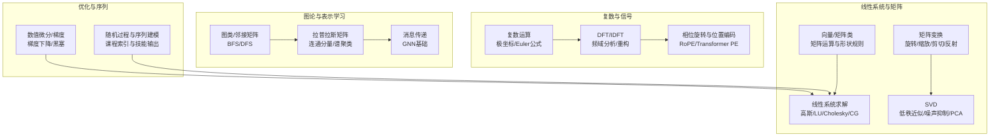
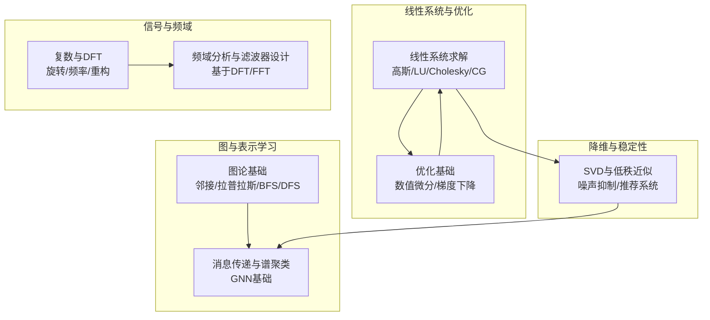
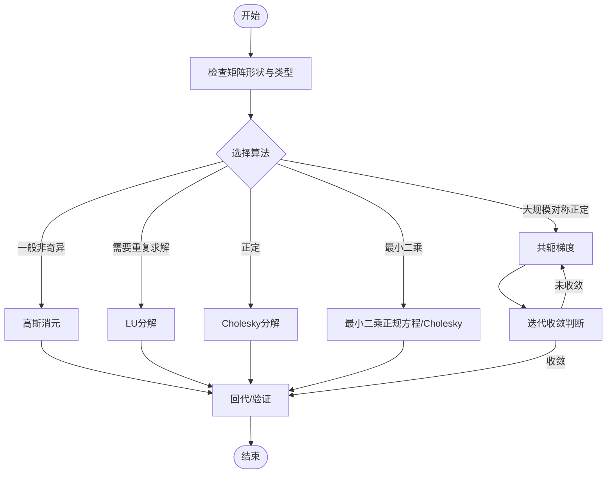
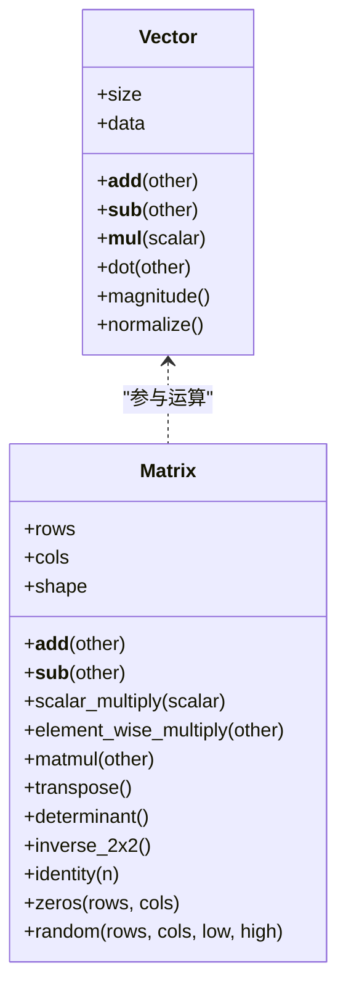
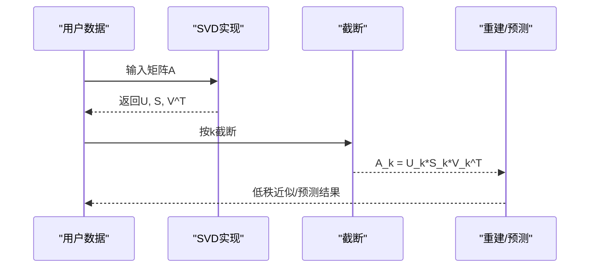
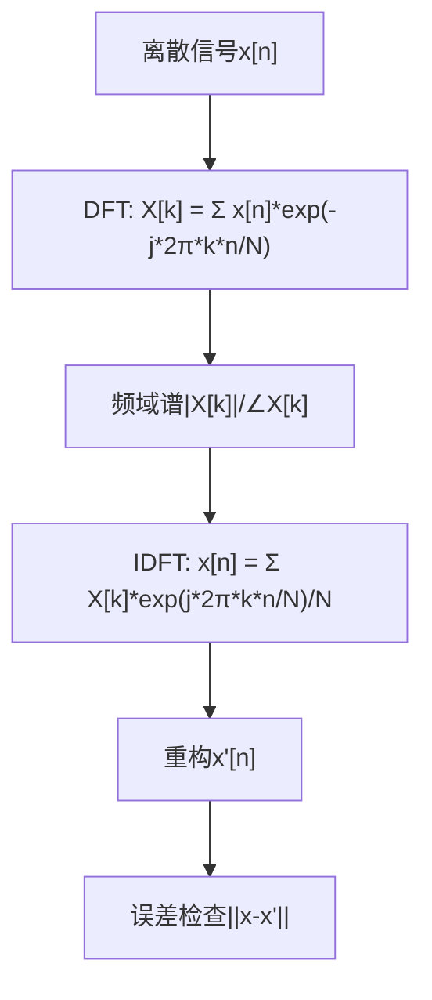
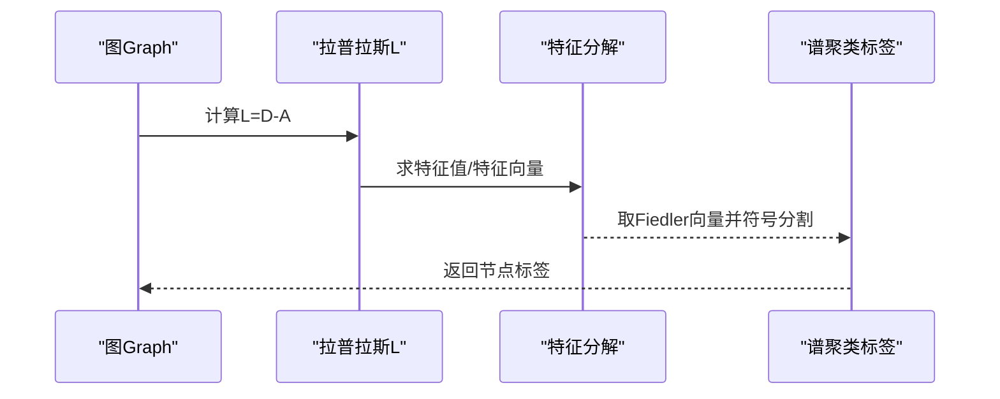
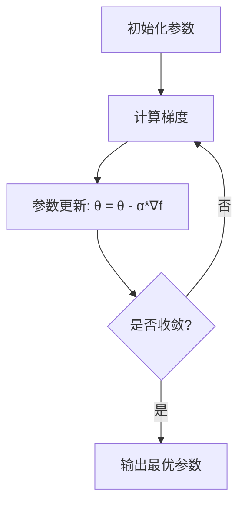
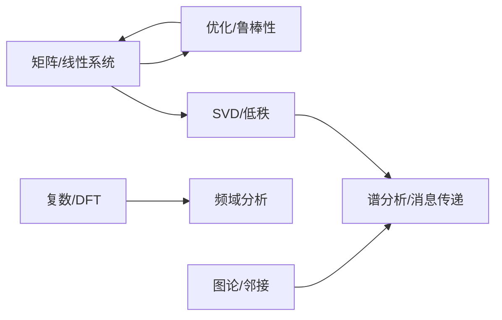

# 高等数学专题

<cite>
**本文引用的文件**
- [phases/01-math-foundations/02-vectors-matrices-operations/code/matrices.py](file://phases/01-math-foundations/02-vectors-matrices-operations/code/matrices.py)
- [phases/01-math-foundations/02-vectors-matrices-operations/docs/en.md](file://phases/01-math-foundations/02-vectors-matrices-operations/docs/en.md)
- [phases/01-math-foundations/03-matrix-transformations/docs/en.md](file://phases/01-math-foundations/03-matrix-transformations/docs/en.md)
- [phases/01-math-foundations/11-singular-value-decomposition/code/svd.py](file://phases/01-math-foundations/11-singular-value-decomposition/code/svd.py)
- [phases/01-math-foundations/17-linear-systems/code/linear_systems.py](file://phases/01-math-foundations/17-linear-systems/code/linear_systems.py)
- [phases/01-math-foundations/19-complex-numbers/code/complex_numbers.py](file://phases/01-math-foundations/19-complex-numbers/code/complex_numbers.py)
- [phases/01-math-foundations/19-complex-numbers/docs/en.md](file://phases/01-math-foundations/19-complex-numbers/docs/en.md)
- [phases/01-math-foundations/21-graph-theory/code/graph_theory.py](file://phases/01-math-foundations/21-graph-theory/code/graph_theory.py)
- [phases/01-math-foundations/21-graph-theory/docs/en.md](file://phases/01-math-foundations/21-graph-theory/docs/en.md)
- [phases/01-math-foundations/04-calculus-for-ml/code/derivatives.py](file://phases/01-math-foundations/04-calculus-for-ml/code/derivatives.py)
- [site/data.js](file://site/data.js)
</cite>

## 目录
1. [引言](#引言)
2. [项目结构](#项目结构)
3. [核心组件](#核心组件)
4. [架构总览](#架构总览)
5. [详细组件分析](#详细组件分析)
6. [依赖关系分析](#依赖关系分析)
7. [性能考量](#性能考量)
8. [故障排查指南](#故障排查指南)
9. [结论](#结论)
10. [附录](#附录)

## 引言
本专题面向高等数学在人工智能中的系统化应用，围绕线性系统理论、复数与信号处理、傅里叶变换、图论与表示学习、随机过程与序列建模展开。通过从零实现的代码与可视化思路，帮助读者建立“从数学到工程”的直觉桥梁，并理解这些高级数学工具如何成为现代AI系统的基石。

## 项目结构
本专题内容主要分布在“数学基础”阶段（Phase 1）的多个课时中，每个课时聚焦一个主题并提供可运行的代码与文档说明。核心模块包括：
- 线性代数与矩阵运算：向量、矩阵类与基本操作
- 矩阵变换与几何直观：旋转、缩放、剪切、反射与特征值
- 线性系统与数值方法：高斯消元、LU/Cholesky分解、最小二乘、共轭梯度
- 奇异值分解（SVD）：低秩近似、噪声抑制、推荐系统
- 复数与信号处理：复数运算、DFT/IDFT、相位旋转、RoPE与位置编码
- 图论与表示学习：邻接矩阵、拉普拉斯矩阵、谱聚类、消息传递
- 微积分与优化：数值微分、梯度下降、黑塞矩阵与泰勒展开
- 随机过程与序列建模：见课程索引与输出技能描述

**图表来源**
- [phases/01-math-foundations/02-vectors-matrices-operations/code/matrices.py:4-231](file://phases/01-math-foundations/02-vectors-matrices-operations/code/matrices.py#L4-L231)
- [phases/01-math-foundations/03-matrix-transformations/docs/en.md:25-237](file://phases/01-math-foundations/03-matrix-transformations/docs/en.md#L25-L237)
- [phases/01-math-foundations/17-linear-systems/code/linear_systems.py:4-136](file://phases/01-math-foundations/17-linear-systems/code/linear_systems.py#L4-L136)
- [phases/01-math-foundations/11-singular-value-decomposition/code/svd.py:24-59](file://phases/01-math-foundations/11-singular-value-decomposition/code/svd.py#L24-L59)
- [phases/01-math-foundations/19-complex-numbers/code/complex_numbers.py:5-105](file://phases/01-math-foundations/19-complex-numbers/code/complex_numbers.py#L5-L105)
- [phases/01-math-foundations/21-graph-theory/code/graph_theory.py:5-39](file://phases/01-math-foundations/21-graph-theory/code/graph_theory.py#L5-L39)
- [phases/01-math-foundations/04-calculus-for-ml/code/derivatives.py:5-38](file://phases/01-math-foundations/04-calculus-for-ml/code/derivatives.py#L5-L38)

**章节来源**
- [phases/01-math-foundations/02-vectors-matrices-operations/docs/en.md:1-347](file://phases/01-math-foundations/02-vectors-matrices-operations/docs/en.md#L1-L347)
- [phases/01-math-foundations/03-matrix-transformations/docs/en.md:1-466](file://phases/01-math-foundations/03-matrix-transformations/docs/en.md#L1-L466)
- [phases/01-math-foundations/11-singular-value-decomposition/code/svd.py:1-642](file://phases/01-math-foundations/11-singular-value-decomposition/code/svd.py#L1-L642)
- [phases/01-math-foundations/17-linear-systems/code/linear_systems.py:1-438](file://phases/01-math-foundations/17-linear-systems/code/linear_systems.py#L1-L438)
- [phases/01-math-foundations/19-complex-numbers/code/complex_numbers.py:1-476](file://phases/01-math-foundations/19-complex-numbers/code/complex_numbers.py#L1-L476)
- [phases/01-math-foundations/21-graph-theory/code/graph_theory.py:1-308](file://phases/01-math-foundations/21-graph-theory/code/graph_theory.py#L1-L308)
- [phases/01-math-foundations/04-calculus-for-ml/code/derivatives.py:1-266](file://phases/01-math-foundations/04-calculus-for-ml/code/derivatives.py#L1-L266)
- [site/data.js:304-5741](file://site/data.js#L304-L5741)

## 核心组件
- 向量/矩阵类与基本运算：支持加减、标量乘法、逐元素乘法、矩阵乘法、转置、行列式、逆、广播等，是构建神经网络前向传播的基础。
- 矩阵变换与几何直观：提供旋转、缩放、剪切、反射等二维/三维变换矩阵，以及特征值/特征向量计算，支撑PCA、稳定性分析与谱聚类。
- 线性系统求解：实现高斯消元、LU分解、Cholesky分解、最小二乘、岭回归、共轭梯度等，覆盖数值稳定性和大规模问题求解。
- SVD：从幂迭代出发实现SVD，支持低秩近似、图像压缩、推荐系统、噪声抑制、伪逆与条件数分析。
- 复数与信号处理：实现复数四则运算、极坐标转换、欧拉公式、DFT/IDFT、单位根、相位旋转与RoPE、Transformer位置编码。
- 图论与表示学习：图类、邻接矩阵、度矩阵、拉普拉斯矩阵、BFS/DFS、连通分量、谱聚类、消息传递（GNN基础）。
- 微积分与优化：数值微分、梯度下降、黑塞矩阵与泰勒展开，支撑机器学习优化与收敛性分析。
- 随机过程与序列建模：课程索引与技能输出，指导如何识别与应用随机过程框架。

**章节来源**
- [phases/01-math-foundations/02-vectors-matrices-operations/code/matrices.py:4-231](file://phases/01-math-foundations/02-vectors-matrices-operations/code/matrices.py#L4-L231)
- [phases/01-math-foundations/03-matrix-transformations/docs/en.md:175-237](file://phases/01-math-foundations/03-matrix-transformations/docs/en.md#L175-L237)
- [phases/01-math-foundations/17-linear-systems/code/linear_systems.py:4-136](file://phases/01-math-foundations/17-linear-systems/code/linear_systems.py#L4-L136)
- [phases/01-math-foundations/11-singular-value-decomposition/code/svd.py:24-59](file://phases/01-math-foundations/11-singular-value-decomposition/code/svd.py#L24-L59)
- [phases/01-math-foundations/19-complex-numbers/code/complex_numbers.py:5-105](file://phases/01-math-foundations/19-complex-numbers/code/complex_numbers.py#L5-L105)
- [phases/01-math-foundations/21-graph-theory/code/graph_theory.py:5-39](file://phases/01-math-foundations/21-graph-theory/code/graph_theory.py#L5-L39)
- [phases/01-math-foundations/04-calculus-for-ml/code/derivatives.py:5-38](file://phases/01-math-foundations/04-calculus-for-ml/code/derivatives.py#L5-L38)
- [site/data.js:304-5741](file://site/data.js#L304-L5741)

## 架构总览
以下架构图展示了从“线性系统/矩阵”到“信号处理/图论/优化”的知识链路，以及它们在AI系统中的落地方式。

**图表来源**
- [phases/01-math-foundations/17-linear-systems/code/linear_systems.py:4-136](file://phases/01-math-foundations/17-linear-systems/code/linear_systems.py#L4-L136)
- [phases/01-math-foundations/19-complex-numbers/code/complex_numbers.py:83-105](file://phases/01-math-foundations/19-complex-numbers/code/complex_numbers.py#L83-L105)
- [phases/01-math-foundations/21-graph-theory/code/graph_theory.py:5-39](file://phases/01-math-foundations/21-graph-theory/code/graph_theory.py#L5-L39)
- [phases/01-math-foundations/11-singular-value-decomposition/code/svd.py:24-59](file://phases/01-math-foundations/11-singular-value-decomposition/code/svd.py#L24-L59)
- [phases/01-math-foundations/04-calculus-for-ml/code/derivatives.py:21-38](file://phases/01-math-foundations/04-calculus-for-ml/code/derivatives.py#L21-L38)

## 详细组件分析

### 线性系统理论与数值方法
- 高斯消元与部分选主元：实现增广矩阵的行变换，回代求解；用于一般线性方程组与最小二乘的正规方程。
- LU分解与求解：对矩阵进行PA=LU分解，随后前代后代求解；适合多次求解不同右端项的情形。
- Cholesky分解与求解：针对正定矩阵的高效分解；用于最小二乘与对数行列式的快速计算。
- 最小二乘与岭回归：最小二乘正规方程与正则化项，缓解病态与过拟合。
- 条件数与数值稳定性：通过奇异值比值衡量矩阵病态程度；指导正则化策略。
- 共轭梯度法：适用于对称正定线性系统，迭代求解且内存占用低。

**图表来源**
- [phases/01-math-foundations/17-linear-systems/code/linear_systems.py:4-136](file://phases/01-math-foundations/17-linear-systems/code/linear_systems.py#L4-L136)

**章节来源**
- [phases/01-math-foundations/17-linear-systems/code/linear_systems.py:4-438](file://phases/01-math-foundations/17-linear-systems/code/linear_systems.py#L4-L438)

### 矩阵运算与几何直观
- 向量/矩阵类：支持加法、标量乘法、逐元素乘法、矩阵乘法、转置、行列式、逆、恒等矩阵与零矩阵构造。
- 形状与广播：明确矩阵乘法的内维匹配规则与广播机制，避免张量维度错误。
- 几何变换：旋转、缩放、剪切、反射矩阵；特征值/特征向量揭示主方向与缩放因子；行列式作为面积/体积缩放因子。

**图表来源**
- [phases/01-math-foundations/02-vectors-matrices-operations/code/matrices.py:4-231](file://phases/01-math-foundations/02-vectors-matrices-operations/code/matrices.py#L4-L231)

**章节来源**
- [phases/01-math-foundations/02-vectors-matrices-operations/docs/en.md:1-347](file://phases/01-math-foundations/02-vectors-matrices-operations/docs/en.md#L1-L347)
- [phases/01-math-foundations/03-matrix-transformations/docs/en.md:1-466](file://phases/01-math-foundations/03-matrix-transformations/docs/en.md#L1-L466)

### 奇异值分解（SVD）
- 幂迭代与SVD：从ATA的特征值/特征向量出发，逐步提取主成分，重建原始矩阵。
- 低秩近似与图像压缩：按奇异值大小截断，实现存储与计算开销降低。
- 推荐系统与潜在因子：利用低秩近似填补缺失评分，评估误差。
- 噪声抑制与伪逆：通过截断奇异值抑制噪声，构造伪逆求解最小二乘与欠定系统。
- 条件数与数值稳定性：比较SVD与特征分解的稳定性差异，解释病态问题的来源。

**图表来源**
- [phases/01-math-foundations/11-singular-value-decomposition/code/svd.py:24-59](file://phases/01-math-foundations/11-singular-value-decomposition/code/svd.py#L24-L59)

**章节来源**
- [phases/01-math-foundations/11-singular-value-decomposition/code/svd.py:1-642](file://phases/01-math-foundations/11-singular-value-decomposition/code/svd.py#L1-L642)

### 复数理论与信号处理
- 复数运算与极坐标：加减乘除、共轭、幅角与模长转换；Euler公式连接指数与三角函数。
- DFT/IDFT：使用单位根实现频域分解与完美重构；展示频域峰值与信号频率的关系。
- 相位旋转与位置编码：复数乘法等价于二维旋转；RoPE与Transformer位置编码的复数视角。
- 可视化建议：绘制单位圆、旋转轨迹、DFT幅度谱与相位谱、位置编码的频率指纹。

**图表来源**
- [phases/01-math-foundations/19-complex-numbers/code/complex_numbers.py:83-105](file://phases/01-math-foundations/19-complex-numbers/code/complex_numbers.py#L83-L105)

**章节来源**
- [phases/01-math-foundations/19-complex-numbers/code/complex_numbers.py:1-476](file://phases/01-math-foundations/19-complex-numbers/code/complex_numbers.py#L1-L476)
- [phases/01-math-foundations/19-complex-numbers/docs/en.md:1-462](file://phases/01-math-foundations/19-complex-numbers/docs/en.md#L1-L462)

### 图论与表示学习
- 图类与邻接矩阵：支持有向/无向、加权/非加权；度矩阵与拉普拉斯矩阵L=D-A。
- BFS/DFS：探索图结构，计算最短路径与连通分量。
- 谱聚类：利用Fiedler向量（次小特征向量）进行二分类；推广至多类别。
- 消息传递：以归一化邻接矩阵为权重聚合邻居信息，是GNN的核心。

**图表来源**
- [phases/01-math-foundations/21-graph-theory/code/graph_theory.py:5-39](file://phases/01-math-foundations/21-graph-theory/code/graph_theory.py#L5-L39)
- [phases/01-math-foundations/21-graph-theory/code/graph_theory.py:100-139](file://phases/01-math-foundations/21-graph-theory/code/graph_theory.py#L100-L139)

**章节来源**
- [phases/01-math-foundations/21-graph-theory/code/graph_theory.py:1-308](file://phases/01-math-foundations/21-graph-theory/code/graph_theory.py#L1-L308)
- [phases/01-math-foundations/21-graph-theory/docs/en.md:1-507](file://phases/01-math-foundations/21-graph-theory/docs/en.md#L1-L507)

### 微积分与优化（梯度与收敛）
- 数值微分与梯度：中心差分估计偏导，支持多变量函数的梯度计算。
- 梯度下降：一维/多维实现，演示收敛过程与步长影响。
- 黑塞矩阵与泰勒展开：二阶信息刻画局部曲率，辅助判断极值性质与近似模型。

**图表来源**
- [phases/01-math-foundations/04-calculus-for-ml/code/derivatives.py:21-38](file://phases/01-math-foundations/04-calculus-for-ml/code/derivatives.py#L21-L38)

**章节来源**
- [phases/01-math-foundations/04-calculus-for-ml/code/derivatives.py:1-266](file://phases/01-math-foundations/04-calculus-for-ml/code/derivatives.py#L1-L266)

### 随机过程与序列建模（课程索引）
- 课程索引与技能输出：提供随机过程框架识别与实现建议，便于在序列建模中选择合适方法。

**章节来源**
- [site/data.js:5730-5741](file://site/data.js#L5730-L5741)

## 依赖关系分析
- 组件耦合与内聚：矩阵类与线性系统紧密耦合；SVD与低秩应用（图像/推荐/去噪）形成高内聚模块；复数模块独立但与DFT强关联；图论模块以邻接矩阵为核心，与谱分析和消息传递耦合。
- 外部依赖与接口：NumPy在SVD、图谱分析、复数数组运算中广泛使用；网络库（如networkx）提供生产级图算法；SciPy提供Fourier变换等数值工具。
- 循环依赖：当前各模块保持单向依赖，如“矩阵/线性系统”为“优化/鲁棒性”的基础。

**图表来源**
- [phases/01-math-foundations/17-linear-systems/code/linear_systems.py:4-136](file://phases/01-math-foundations/17-linear-systems/code/linear_systems.py#L4-L136)
- [phases/01-math-foundations/11-singular-value-decomposition/code/svd.py:24-59](file://phases/01-math-foundations/11-singular-value-decomposition/code/svd.py#L24-L59)
- [phases/01-math-foundations/19-complex-numbers/code/complex_numbers.py:83-105](file://phases/01-math-foundations/19-complex-numbers/code/complex_numbers.py#L83-L105)
- [phases/01-math-foundations/21-graph-theory/code/graph_theory.py:5-39](file://phases/01-math-foundations/21-graph-theory/code/graph_theory.py#L5-L39)

**章节来源**
- [phases/01-math-foundations/17-linear-systems/code/linear_systems.py:1-438](file://phases/01-math-foundations/17-linear-systems/code/linear_systems.py#L1-L438)
- [phases/01-math-foundations/11-singular-value-decomposition/code/svd.py:1-642](file://phases/01-math-foundations/11-singular-value-decomposition/code/svd.py#L1-L642)
- [phases/01-math-foundations/19-complex-numbers/code/complex_numbers.py:1-476](file://phases/01-math-foundations/19-complex-numbers/code/complex_numbers.py#L1-L476)
- [phases/01-math-foundations/21-graph-theory/code/graph_theory.py:1-308](file://phases/01-math-foundations/21-graph-theory/code/graph_theory.py#L1-L308)

## 性能考量
- 矩阵运算：优先使用BLAS/LAPACK加速（如NumPy/SciPy），避免纯Python循环；注意内存布局与缓存友好性。
- 病态问题：通过条件数检测与正则化（如岭回归）提升数值稳定性；SVD相比直接求逆更稳健。
- 迭代算法：共轭梯度法适合大规模稀疏对称正定系统；设置合理容差与最大迭代次数。
- 频域分析：DFT复杂度O(N^2)，采用FFT将至O(N log N)；注意零填充与窗函数对分辨率与泄漏的影响。
- 图谱分析：拉普拉斯特征分解复杂度O(n^3)，对大规模图可考虑稀疏特征值求解或谱嵌入近似。

## 故障排查指南
- 线性系统
  - 症状：求解失败或结果不稳定
  - 排查：检查矩阵是否奇异/病态（条件数）、是否对称正定；尝试LU/Cholesky/CG组合；加入正则化
  - 参考实现：[线性系统求解:4-136](file://phases/01-math-foundations/17-linear-systems/code/linear_systems.py#L4-L136)
- SVD
  - 症状：重构误差大、截断效果不明显
  - 排查：确认奇异值排序与截断阈值；对比SVD与特征分解的数值稳定性
  - 参考实现：[SVD实现:24-59](file://phases/01-math-foundations/11-singular-value-decomposition/code/svd.py#L24-L59)
- 复数与DFT
  - 症状：频谱泄漏、相位异常
  - 排查：检查窗函数、零填充长度、采样率与频率分辨率；验证IDFT重构误差
  - 参考实现：[DFT/IDFT:83-105](file://phases/01-math-foundations/19-complex-numbers/code/complex_numbers.py#L83-L105)
- 图论
  - 症状：谱聚类结果不合理
  - 排查：核对邻接/度矩阵构造、归一化方式、Fiedler向量符号分割
  - 参考实现：[图类与谱聚类:5-39](file://phases/01-math-foundations/21-graph-theory/code/graph_theory.py#L5-L39)

**章节来源**
- [phases/01-math-foundations/17-linear-systems/code/linear_systems.py:289-316](file://phases/01-math-foundations/17-linear-systems/code/linear_systems.py#L289-L316)
- [phases/01-math-foundations/11-singular-value-decomposition/code/svd.py:485-524](file://phases/01-math-foundations/11-singular-value-decomposition/code/svd.py#L485-L524)
- [phases/01-math-foundations/19-complex-numbers/code/complex_numbers.py:286-330](file://phases/01-math-foundations/19-complex-numbers/code/complex_numbers.py#L286-L330)
- [phases/01-math-foundations/21-graph-theory/code/graph_theory.py:100-139](file://phases/01-math-foundations/21-graph-theory/code/graph_theory.py#L100-L139)

## 结论
本专题通过“从零实现+可视化引导”的方式，将线性系统、复数与信号处理、图论与表示学习、优化与稳定性等高等数学工具串联起来，形成一套可迁移、可扩展的AI数学基础体系。建议在实践中结合NumPy/SciPy等高性能库，同时保留从零实现的代码以加深理解。

## 附录
- 代码示例路径（仅列出路径，不展示具体代码）
  - [矩阵类与基本运算:4-231](file://phases/01-math-foundations/02-vectors-matrices-operations/code/matrices.py#L4-L231)
  - [矩阵变换与特征值:175-237](file://phases/01-math-foundations/03-matrix-transformations/docs/en.md#L175-L237)
  - [线性系统求解:4-136](file://phases/01-math-foundations/17-linear-systems/code/linear_systems.py#L4-L136)
  - [SVD实现与应用:24-59](file://phases/01-math-foundations/11-singular-value-decomposition/code/svd.py#L24-L59)
  - [复数与DFT:83-105](file://phases/01-math-foundations/19-complex-numbers/code/complex_numbers.py#L83-L105)
  - [图论与谱聚类:100-139](file://phases/01-math-foundations/21-graph-theory/code/graph_theory.py#L100-L139)
  - [数值微分与梯度下降:21-38](file://phases/01-math-foundations/04-calculus-for-ml/code/derivatives.py#L21-L38)
  - [随机过程与序列建模索引:5730-5741](file://site/data.js#L5730-L5741)