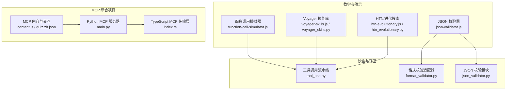
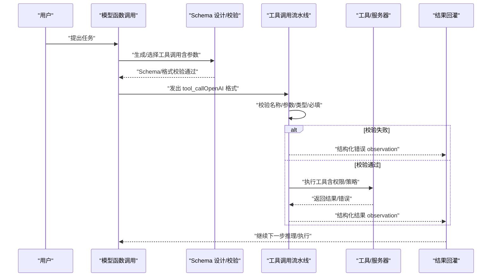
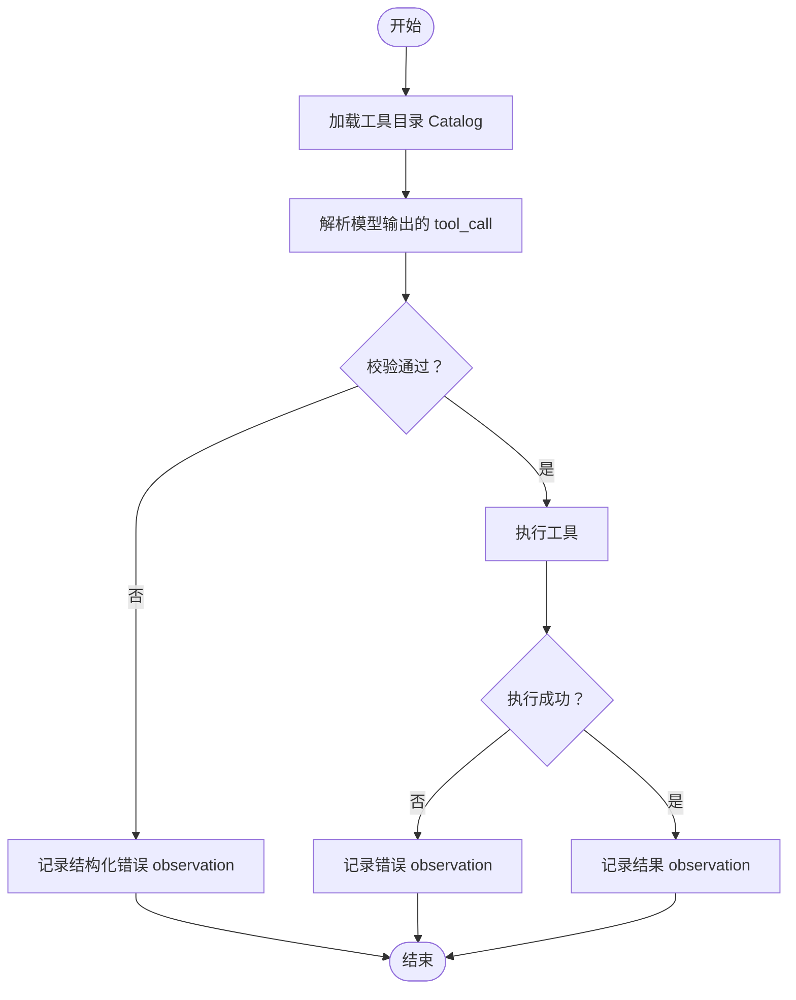
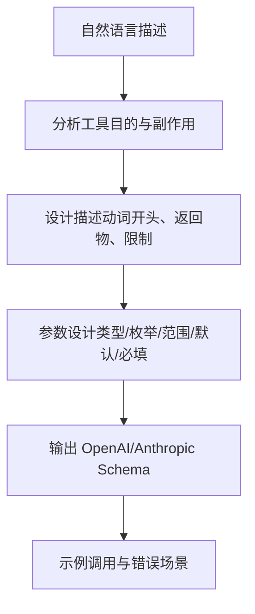
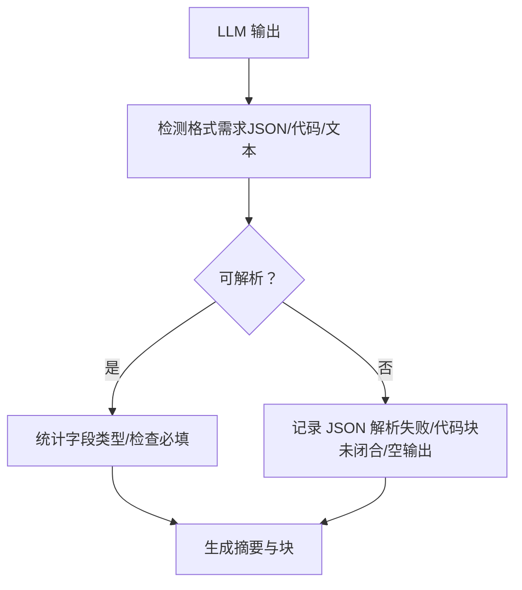
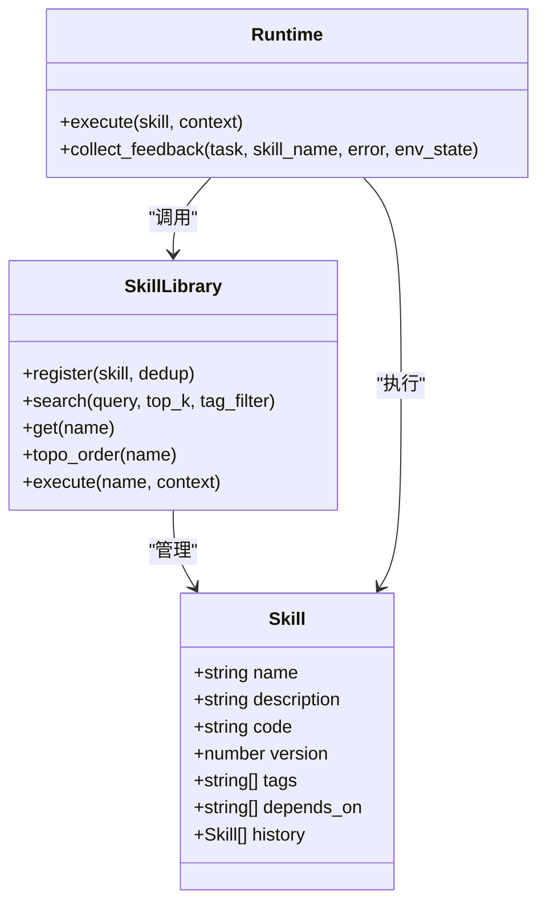
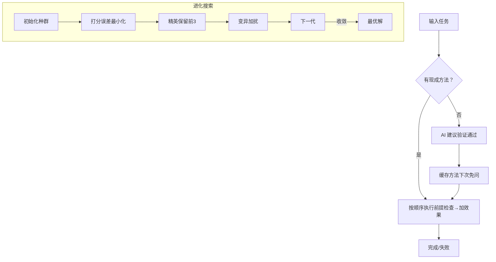
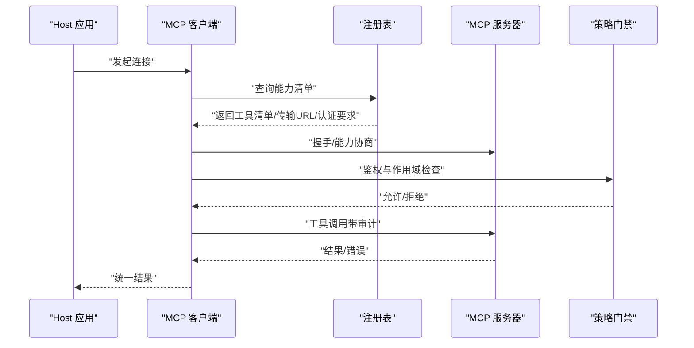
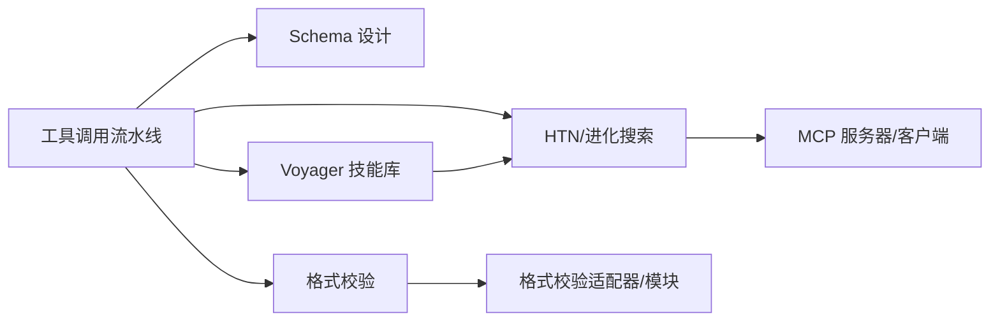

# 工具调用与函数调用

<cite>
**本文引用的文件**
- [tool_use.py](file://guardrails-sandbox/backend/playground/modules/tool_use.py)
- [function-call-simulator.js](file://site/vue-app/summary/src/data/modules/function-call-simulator.js)
- [prompt-tool-designer.md](file://phases/11-llm-engineering/09-function-calling/outputs/prompt-tool-designer.md)
- [json-validator.js](file://site/vue-app/summary/src/data/modules/json-validator.js)
- [format_validator.py](file://guardrails-sandbox/backend/adapters/format_validator.py)
- [json_validator.py](file://guardrails-sandbox/backend/playground/modules/json_validator.py)
- [voyager-skills.js](file://site/vue-app/summary/src/data/modules/voyager-skills.js)
- [voyager_skills.py](file://guardrails-sandbox/backend/playground/modules/voyager_skills.py)
- [skill-skill-library.md](file://phases/14-agent-engineering/10-skill-libraries-voyager/outputs/skill-skill-library.md)
- [htn-evolutionary.js](file://site/vue-app/summary/src/data/modules/htn-evolutionary.js)
- [htn_evolutionary.py](file://guardrails-sandbox/backend/playground/modules/htn_evolutionary.py)
- [main.py](file://phases/19-capstone-projects/13-mcp-server-with-registry/code/main.py)
- [index.ts](file://phases/19-capstone-projects/13-mcp-server-with-registry/code/ts/src/index.ts)
- [content.js](file://site/vue-app/summary/src/data/content.js)
- [quiz.zh.json](file://phases/19-capstone-projects/13-mcp-server-with-registry/quiz.zh.json)
</cite>

## 目录
1. [引言](#引言)
2. [项目结构](#项目结构)
3. [核心组件](#核心组件)
4. [架构总览](#架构总览)
5. [详细组件分析](#详细组件分析)
6. [依赖分析](#依赖分析)
7. [性能考虑](#性能考虑)
8. [故障排查指南](#故障排查指南)
9. [结论](#结论)
10. [附录](#附录)

## 引言
本文件围绕“工具调用与函数调用”主题，系统梳理智能体的工具使用机制，涵盖工具发现、调用协议与结果处理；函数调用的Schema设计（参数验证、错误处理、响应格式）；Voyager技能库的架构与使用方法（可重用技能组件）；HTN规划与进化式规划两大重型方法；以及完整工具调用实现示例（如何设计与集成各类工具接口）。文档同时提供可视化图示与循序渐进的讲解，帮助读者从概念到实践全面掌握。

## 项目结构
本仓库将“工具调用与函数调用”相关内容分布在多个层次：
- 教学阶段与课程：LLM工程（函数调用）、代理工程（技能库、规划）、工具与协议（MCP）、沙盒守卫（格式校验）等。
- 前端演示模块：函数调用模拟器、JSON校验器、Voyager技能库、HTN/进化搜索等。
- 后端沙盒模块：工具调用流水线、技能库、HTN/进化搜索、格式校验适配器等。
- 规格与协议：MCP服务器/客户端/传输/安全等综合项目。

**图表来源**
- [function-call-simulator.js:104-116](file://site/vue-app/summary/src/data/modules/function-call-simulator.js#L104-L116)
- [json-validator.js:81-95](file://site/vue-app/summary/src/data/modules/json-validator.js#L81-L95)
- [voyager-skills.js:101-117](file://site/vue-app/summary/src/data/modules/voyager-skills.js#L101-L117)
- [htn-evolutionary.js:256-274](file://site/vue-app/summary/src/data/modules/htn-evolutionary.js#L256-L274)
- [tool_use.py:62-118](file://guardrails-sandbox/backend/playground/modules/tool_use.py#L62-L118)
- [format_validator.py:13-85](file://guardrails-sandbox/backend/adapters/format_validator.py#L13-L85)
- [json_validator.py:38-97](file://guardrails-sandbox/backend/playground/modules/json_validator.py#L38-L97)
- [main.py:1-199](file://phases/19-capstone-projects/13-mcp-server-with-registry/code/main.py#L1-L199)
- [index.ts:1-12](file://phases/19-capstone-projects/13-mcp-server-with-registry/code/ts/src/index.ts#L1-L12)
- [content.js:867-895](file://site/vue-app/summary/src/data/content.js#L867-L895)
- [quiz.zh.json:1-42](file://phases/19-capstone-projects/13-mcp-server-with-registry/quiz.zh.json#L1-L42)

**章节来源**
- [function-call-simulator.js:104-116](file://site/vue-app/summary/src/data/modules/function-call-simulator.js#L104-L116)
- [tool_use.py:62-118](file://guardrails-sandbox/backend/playground/modules/tool_use.py#L62-L118)
- [main.py:1-199](file://phases/19-capstone-projects/13-mcp-server-with-registry/code/main.py#L1-L199)

## 核心组件
- 工具调用流水线：负责工具目录声明、调用校验、执行与结果回灌，强调结构化错误与不可崩溃原则。
- 函数调用Schema设计：提供从自然语言到JSON Schema的完整设计协议，覆盖描述、参数、格式与示例。
- 结构化输出与格式校验：在输出端进行JSON/代码/文本格式校验，防止下游解析崩溃。
- Voyager技能库：以“自动课程 + 技能库 + 迭代提示”三组件为核心，支持检索、组合、拓扑执行与失败驱动改进。
- HTN规划与进化搜索：HTN按前提-效果骨牌式拆解任务，保证正确；进化搜索以自动评分进行筛选-变异逼近最优。
- MCP服务器/客户端/传输：实现工具注册、策略门禁、能力清单与JSON-RPC传输，支持本地stdio与远端HTTP/SSE。

**章节来源**
- [tool_use.py:30-50](file://guardrails-sandbox/backend/playground/modules/tool_use.py#L30-L50)
- [prompt-tool-designer.md:8-89](file://phases/11-llm-engineering/09-function-calling/outputs/prompt-tool-designer.md#L8-L89)
- [format_validator.py:22-85](file://guardrails-sandbox/backend/adapters/format_validator.py#L22-L85)
- [json_validator.py:38-97](file://guardrails-sandbox/backend/playground/modules/json_validator.py#L38-L97)
- [voyager-skills.js:25-99](file://site/vue-app/summary/src/data/modules/voyager-skills.js#L25-L99)
- [htn-evolutionary.js:1-274](file://site/vue-app/summary/src/data/modules/htn-evolutionary.js#L1-L274)
- [main.py:25-199](file://phases/19-capstone-projects/13-mcp-server-with-registry/code/main.py#L25-L199)

## 架构总览
下图展示了从“模型产出工具调用”到“执行与回灌”的全链路，以及与Schema设计、格式校验、技能库与规划方法的协同关系。

**图表来源**
- [tool_use.py:41-49](file://guardrails-sandbox/backend/playground/modules/tool_use.py#L41-L49)
- [tool_use.py:90-100](file://guardrails-sandbox/backend/playground/modules/tool_use.py#L90-L100)
- [prompt-tool-designer.md:47-67](file://phases/11-llm-engineering/09-function-calling/outputs/prompt-tool-designer.md#L47-L67)
- [format_validator.py:22-85](file://guardrails-sandbox/backend/adapters/format_validator.py#L22-L85)

## 详细组件分析

### 工具调用流水线（工具目录、校验、执行、回灌）
- 工具目录（Catalog）：声明工具名称、用途与输入Schema，描述质量决定模型是否选用。
- 参数校验：严格检查工具名存在性、必填参数、类型与格式，失败返回结构化错误字符串，不抛异常。
- 执行与回灌：执行工具，将结果或错误作为observation回灌，支持并行调用与tool_use_id关联。
- 关键要点：工具声明三要素、永不信任工具调用、幻觉工具拒绝、并行与串行约束。

**图表来源**
- [tool_use.py:17-24](file://guardrails-sandbox/backend/playground/modules/tool_use.py#L17-L24)
- [tool_use.py:41-49](file://guardrails-sandbox/backend/playground/modules/tool_use.py#L41-L49)
- [tool_use.py:90-100](file://guardrails-sandbox/backend/playground/modules/tool_use.py#L90-L100)

**章节来源**
- [tool_use.py:62-118](file://guardrails-sandbox/backend/playground/modules/tool_use.py#L62-L118)

### 函数调用Schema设计（参数验证、错误处理、响应格式）
- 设计协议：目的分析、描述规范、参数设计、输出格式（OpenAI/Anthropic）。
- 参数设计要点：描述清晰、枚举限定、数值边界、默认值、必填控制。
- 错误处理：实现应返回结构化错误而非抛异常；调用方据此重试或调整。
- 响应格式：遵循OpenAI tools格式或Anthropic input_schema风格。

**图表来源**
- [prompt-tool-designer.md:12-72](file://phases/11-llm-engineering/09-function-calling/outputs/prompt-tool-designer.md#L12-L72)

**章节来源**
- [prompt-tool-designer.md:8-89](file://phases/11-llm-engineering/09-function-calling/outputs/prompt-tool-designer.md#L8-L89)

### 结构化输出与格式校验（JSON/代码/文本）
- 格式校验适配器：识别JSON/代码块完整性/空输出，输出错误/警告级别问题。
- JSON校验模块：清理markdown围栏、解析并统计字段类型、检查必填字段。
- 关键价值：在下游解析前拦截格式错误，避免崩溃。

**图表来源**
- [format_validator.py:22-85](file://guardrails-sandbox/backend/adapters/format_validator.py#L22-L85)
- [json_validator.py:38-97](file://guardrails-sandbox/backend/playground/modules/json_validator.py#L38-L97)
- [json-validator.js:45-79](file://site/vue-app/summary/src/data/modules/json-validator.js#L45-L79)

**章节来源**
- [format_validator.py:13-85](file://guardrails-sandbox/backend/adapters/format_validator.py#L13-L85)
- [json_validator.py:38-97](file://guardrails-sandbox/backend/playground/modules/json_validator.py#L38-L97)
- [json-validator.js:81-95](file://site/vue-app/summary/src/data/modules/json-validator.js#L81-L95)

### Voyager技能库（检索、组合、拓扑执行、失败驱动改进）
- 三组件：自动课程（好奇心驱动选任务）、技能库（可执行代码+描述+向量索引+依赖）、迭代提示（失败反馈重写技能）。
- 技能定义：name/description/code/version/tags/depends_on/history。
- 执行：拓扑排序、异常捕获、trace反馈、版本升级与历史归档。
- 生产约束：技能必须可执行、组合需拓扑有序、静默覆盖拒绝、sandbox要求。

**图表来源**
- [skill-skill-library.md:14-32](file://phases/14-agent-engineering/10-skill-libraries-voyager/outputs/skill-skill-library.md#L14-L32)
- [voyager-skills.js:25-99](file://site/vue-app/summary/src/data/modules/voyager-skills.js#L25-L99)
- [voyager_skills.py:30-73](file://guardrails-sandbox/backend/playground/modules/voyager_skills.py#L30-L73)

**章节来源**
- [skill-skill-library.md:1-33](file://phases/14-agent-engineering/10-skill-libraries-voyager/outputs/skill-skill-library.md#L1-L33)
- [voyager-skills.js:1-117](file://site/vue-app/summary/src/data/modules/voyager-skills.js#L1-L117)
- [voyager_skills.py:1-73](file://guardrails-sandbox/backend/playground/modules/voyager_skills.py#L1-L73)

### HTN规划与进化搜索（重型规划方法）
- HTN（分层任务网络）：将大任务按“前提→效果”骨牌式拆解，顺序由规则强制保证，未现成方法时回退AI并验证缓存。
- 进化搜索（AlphaEvolve式）：随机解→打分→精英保留→变异→再筛，自动逼近最优，前提是可机器自动打分。

**图表来源**
- [htn-evolutionary.js:1-274](file://site/vue-app/summary/src/data/modules/htn-evolutionary.js#L1-L274)
- [htn_evolutionary.py:1-171](file://guardrails-sandbox/backend/playground/modules/htn_evolutionary.py#L1-L171)

**章节来源**
- [htn-evolutionary.js:1-274](file://site/vue-app/summary/src/data/modules/htn-evolutionary.js#L1-L274)
- [htn_evolutionary.py:1-171](file://guardrails-sandbox/backend/playground/modules/htn_evolutionary.py#L1-L171)

### MCP服务器/客户端/传输与治理
- 服务器：注册工具Schema与处理器，策略门禁（OPA风格）决策，审计日志增强。
- 注册表：拉取.well-known/mcp-capabilities，验证与索引工具。
- 传输：本地stdio（零网络开销）与远端Streamable HTTP/SSE。
- 客户端：握手、命名空间合并、路由与多服务器聚合。

**图表来源**
- [main.py:126-144](file://phases/19-capstone-projects/13-mcp-server-with-registry/code/main.py#L126-L144)
- [main.py:150-164](file://phases/19-capstone-projects/13-mcp-server-with-registry/code/main.py#L150-L164)
- [index.ts:1-12](file://phases/19-capstone-projects/13-mcp-server-with-registry/code/ts/src/index.ts#L1-L12)
- [content.js:867-895](file://site/vue-app/summary/src/data/content.js#L867-L895)
- [quiz.zh.json:1-42](file://phases/19-capstone-projects/13-mcp-server-with-registry/quiz.zh.json#L1-L42)

**章节来源**
- [main.py:1-199](file://phases/19-capstone-projects/13-mcp-server-with-registry/code/main.py#L1-L199)
- [index.ts:1-12](file://phases/19-capstone-projects/13-mcp-server-with-registry/code/ts/src/index.ts#L1-L12)
- [content.js:867-895](file://site/vue-app/summary/src/data/content.js#L867-L895)
- [quiz.zh.json:1-42](file://phases/19-capstone-projects/13-mcp-server-with-registry/quiz.zh.json#L1-L42)

## 依赖分析
- 组件耦合与内聚：工具调用流水线内聚于Schema与执行；格式校验适配器与模块分别承担输出端与输入端的格式保障；Voyager技能库与HTN/进化搜索分别面向“可复用行为”和“重型规划”两类场景。
- 外部依赖与集成点：MCP服务器依赖策略门禁与注册表；前端演示模块与后端沙盒模块通过Playground基类对接；格式校验贯穿输出端与结构化输出模块。
- 潜在循环依赖：技能库拓扑执行避免循环；MCP客户端与服务器通过注册表解耦。

**图表来源**
- [tool_use.py:62-118](file://guardrails-sandbox/backend/playground/modules/tool_use.py#L62-L118)
- [prompt-tool-designer.md:47-67](file://phases/11-llm-engineering/09-function-calling/outputs/prompt-tool-designer.md#L47-L67)
- [format_validator.py:13-85](file://guardrails-sandbox/backend/adapters/format_validator.py#L13-L85)
- [json_validator.py:38-97](file://guardrails-sandbox/backend/playground/modules/json_validator.py#L38-L97)
- [voyager-skills.js:25-99](file://site/vue-app/summary/src/data/modules/voyager-skills.js#L25-L99)
- [htn-evolutionary.js:1-274](file://site/vue-app/summary/src/data/modules/htn-evolutionary.js#L1-L274)
- [main.py:126-144](file://phases/19-capstone-projects/13-mcp-server-with-registry/code/main.py#L126-L144)

**章节来源**
- [tool_use.py:62-118](file://guardrails-sandbox/backend/playground/modules/tool_use.py#L62-L118)
- [format_validator.py:13-85](file://guardrails-sandbox/backend/adapters/format_validator.py#L13-L85)
- [json_validator.py:38-97](file://guardrails-sandbox/backend/playground/modules/json_validator.py#L38-L97)
- [voyager-skills.js:25-99](file://site/vue-app/summary/src/data/modules/voyager-skills.js#L25-L99)
- [htn-evolutionary.js:1-274](file://site/vue-app/summary/src/data/modules/htn-evolutionary.js#L1-L274)
- [main.py:126-144](file://phases/19-capstone-projects/13-mcp-server-with-registry/code/main.py#L126-L144)

## 性能考虑
- 工具调用：减少不必要的工具目录注入；并行调用仅限无依赖任务；优先使用结构化输出与Schema，降低下游解析成本。
- 结构化输出：在输出端尽早拦截格式错误，避免重复尝试与重试风暴。
- 技能库：检索采用嵌入相似度或BM25，避免全库LLM重排；组合执行按拓扑排序，避免深度递归。
- 规划方法：HTN保证正确性，适合合规/调度；进化搜索需自动评分器，收敛速度取决于评分质量。
- MCP：本地stdio零网络开销；远端Streamable HTTP支持无状态扩展与Origin校验。

## 故障排查指南
- 工具调用常见问题
  - 缺少必填参数：校验阶段直接返回结构化错误，检查Schema与调用参数。
  - 幻觉调用不存在工具：拒绝并记录，确认工具目录与模型指令。
  - 并行调用错配：确保tool_use_id与结果一一对应。
- 结构化输出常见问题
  - JSON解析失败：检查引号/逗号/括号配对；去除多余文字包裹。
  - Markdown代码块未闭合：成对出现，注意语言标识。
  - 空输出：检查提示词与模型输出策略。
- 技能库与规划
  - 技能循环依赖：拓扑排序失败，检查depends_on。
  - 进化搜索不收敛：评分器设计不佳或变异幅度不足。
- MCP
  - 作用域拒绝：核对所需scope与令牌；查看审计日志。
  - 能力清单无效：确认.well-known/mcp-capabilities格式与可达性。

**章节来源**
- [tool_use.py:41-49](file://guardrails-sandbox/backend/playground/modules/tool_use.py#L41-L49)
- [tool_use.py:90-100](file://guardrails-sandbox/backend/playground/modules/tool_use.py#L90-L100)
- [format_validator.py:22-85](file://guardrails-sandbox/backend/adapters/format_validator.py#L22-L85)
- [json_validator.py:38-97](file://guardrails-sandbox/backend/playground/modules/json_validator.py#L38-L97)
- [voyager-skills.js:25-99](file://site/vue-app/summary/src/data/modules/voyager-skills.js#L25-L99)
- [htn-evolutionary.js:1-274](file://site/vue-app/summary/src/data/modules/htn-evolutionary.js#L1-L274)
- [main.py:126-144](file://phases/19-capstone-projects/13-mcp-server-with-registry/code/main.py#L126-L144)

## 结论
本文件系统化阐述了工具调用与函数调用的关键机制与工程实践，覆盖Schema设计、参数验证、错误处理、响应格式、技能库复用、规划方法与MCP协议实现。通过前端演示与后端沙盒模块的配合，读者可以在不调用真实LLM的前提下理解并演练这些能力，从而在生产环境中构建稳定、可维护、可扩展的工具生态。

## 附录
- 示例参考路径
  - 函数调用模拟器：[function-call-simulator.js:73-101](file://site/vue-app/summary/src/data/modules/function-call-simulator.js#L73-L101)
  - 工具调用流水线：[tool_use.py:75-118](file://guardrails-sandbox/backend/playground/modules/tool_use.py#L75-L118)
  - Schema设计协议：[prompt-tool-designer.md:12-72](file://phases/11-llm-engineering/09-function-calling/outputs/prompt-tool-designer.md#L12-L72)
  - 结构化输出校验：[format_validator.py:22-85](file://guardrails-sandbox/backend/adapters/format_validator.py#L22-L85)、[json_validator.py:38-97](file://guardrails-sandbox/backend/playground/modules/json_validator.py#L38-L97)
  - Voyager技能库：[voyager-skills.js:25-99](file://site/vue-app/summary/src/data/modules/voyager-skills.js#L25-L99)、[voyager_skills.py:30-73](file://guardrails-sandbox/backend/playground/modules/voyager_skills.py#L30-L73)
  - HTN/进化搜索：[htn-evolutionary.js:1-274](file://site/vue-app/summary/src/data/modules/htn-evolutionary.js#L1-L274)、[htn_evolutionary.py:107-171](file://guardrails-sandbox/backend/playground/modules/htn_evolutionary.py#L107-L171)
  - MCP服务器/客户端/传输：[main.py:126-199](file://phases/19-capstone-projects/13-mcp-server-with-registry/code/main.py#L126-L199)、[index.ts:1-12](file://phases/19-capstone-projects/13-mcp-server-with-registry/code/ts/src/index.ts#L1-L12)
  - 内容与测验：[content.js:867-895](file://site/vue-app/summary/src/data/content.js#L867-L895)、[quiz.zh.json:1-42](file://phases/19-capstone-projects/13-mcp-server-with-registry/quiz.zh.json#L1-L42)