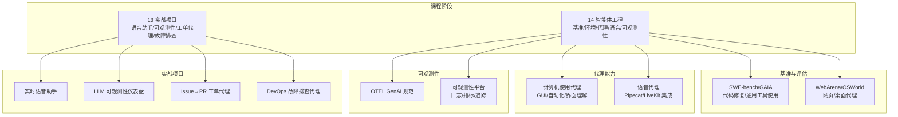
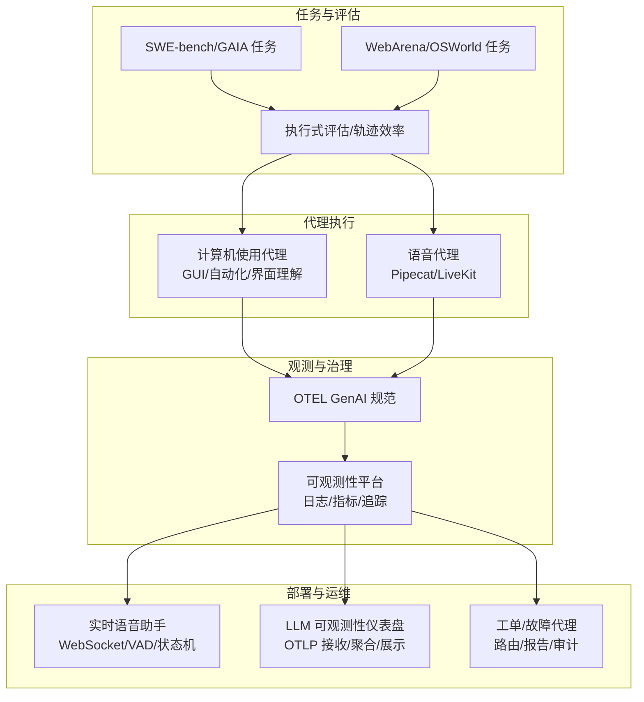
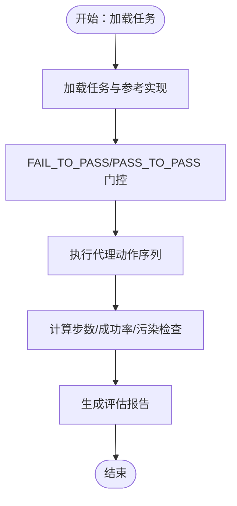
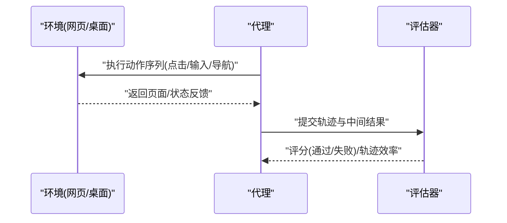
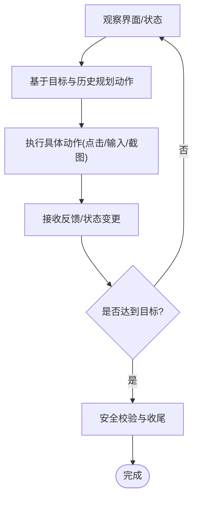
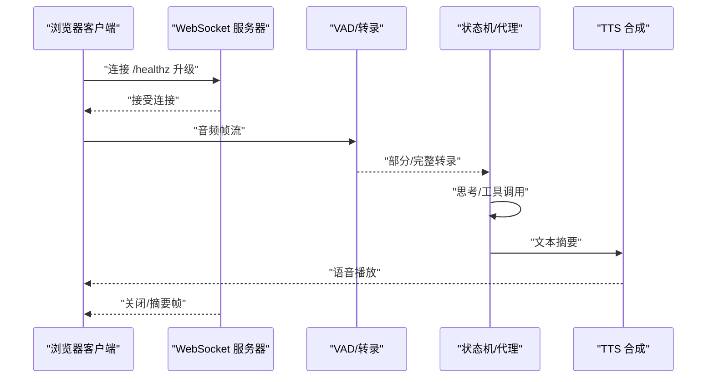
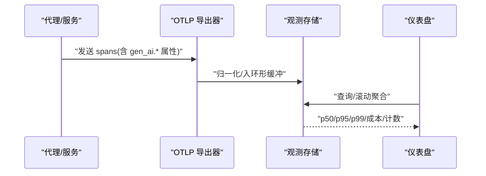
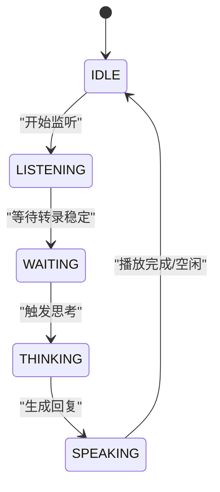
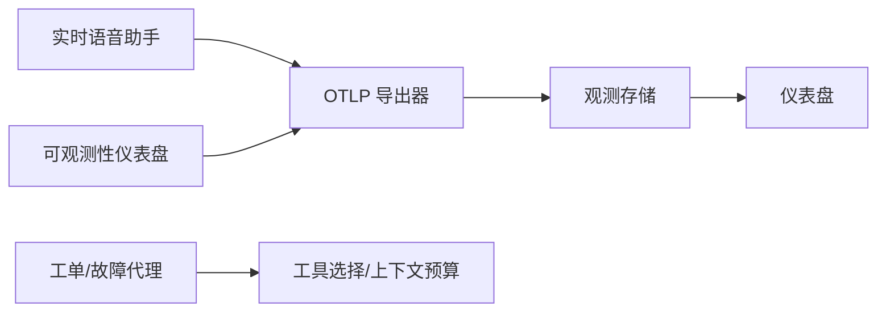

# 应用模式与实践

<cite>
**本文引用的文件**
- [site/data.js](file://site/data.js)
- [phases/14-agent-engineering/19-benchmarks-swebench-gaia/outputs/skill-benchmark-harness.md](file://phases/14-agent-engineering/19-benchmarks-swebench-gaia/outputs/skill-benchmark-harness.md)
- [phases/14-agent-engineering/19-benchmarks-swebench-gaia/outputs/skill-benchmark-harness.zh.md](file://phases/14-agent-engineering/19-benchmarks-swebench-gaia/outputs/skill-benchmark-harness.zh.md)
- [phases/14-agent-engineering/20-benchmarks-webarena-osworld/README.md](file://phases/14-agent-engineering/20-benchmarks-webarena-osworld/README.md)
- [phases/14-agent-engineering/21-computer-use-agents/outputs/skill-computer-use-safety.md](file://phases/14-agent-engineering/21-computer-use-agents/outputs/skill-computer-use-safety.md)
- [phases/14-agent-engineering/21-computer-use-agents/outputs/skill-computer-use-safety.zh.md](file://phases/14-agent-engineering/21-computer-use-agents/outputs/skill-computer-use-safety.zh.md)
- [phases/14-agent-engineering/22-voice-agents-pipecat-livekit/outputs/skill-voice-pipeline.md](file://phases/14-agent-engineering/22-voice-agents-pipecat-livekit/outputs/skill-voice-pipeline.md)
- [phases/14-agent-engineering/22-voice-agents-pipecat-livekit/outputs/skill-voice-pipeline.zh.md](file://phases/14-agent-engineering/22-voice-agents-pipecat-livekit/outputs/skill-voice-pipeline.zh.md)
- [phases/14-agent-engineering/23-otel-genai-conventions/outputs/skill-otel-genai.md](file://phases/14-agent-engineering/23-otel-genai-conventions/outputs/skill-otel-genai.md)
- [phases/14-agent-engineering/23-otel-genai-conventions/outputs/skill-otel-genai.zh.md](file://phases/14-agent-engineering/23-otel-genai-conventions/outputs/skill-otel-genai.zh.md)
- [phases/14-agent-engineering/24-agent-observability-platforms/outputs/skill-agent-observability-platforms.md](file://phases/14-agent-engineering/24-agent-observability-platforms/outputs/skill-agent-observability-platforms.md)
- [phases/14-agent-engineering/24-agent-observability-platforms/outputs/skill-agent-observability-platforms.zh.md](file://phases/14-agent-engineering/24-agent-observability-platforms/outputs/skill-agent-observability-platforms.zh.md)
- [phases/19-capstone-projects/03-realtime-voice-assistant/code/ts/src/index.ts](file://phases/19-capstone-projects/03-realtime-voice-assistant/code/ts/src/index.ts)
- [phases/19-capstone-projects/03-realtime-voice-assistant/code/ts/src/orchestrator.ts](file://phases/19-capstone-projects/03-realtime-voice-assistant/code/ts/src/orchestrator.ts)
- [phases/19-capstone-projects/03-realtime-voice-assistant/code/ts/src/vad.ts](file://phases/19-capstone-projects/03-realtime-voice-assistant/code/ts/src/vad.ts)
- [phases/19-capstone-projects/03-realtime-voice-assistant/code/ts/src/server.ts](file://phases/19-capstone-projects/03-realtime-voice-assistant/code/ts/src/server.ts)
- [phases/19-capstone-projects/03-realtime-voice-assistant/code/ts/src/types.ts](file://phases/19-capstone-projects/03-realtime-voice-assistant/code/ts/src/types.ts)
- [phases/19-capstone-projects/03-realtime-voice-assistant/code/ts/README.md](file://phases/19-capstone-projects/03-realtime-voice-assistant/code/ts/README.md)
- [phases/19-capstone-projects/11-llm-observability-dashboard/code/ts/src/index.ts](file://phases/19-capstone-projects/11-llm-observability-dashboard/code/ts/src/index.ts)
- [phases/19-capstone-projects/11-llm-observability-dashboard/code/ts/src/server.ts](file://phases/19-capstone-projects/11-llm-observability-dashboard/code/ts/src/server.ts)
- [phases/19-capstone-projects/11-llm-observability-dashboard/code/ts/src/spans.ts](file://phases/19-capstone-projects/11-llm-observability-dashboard/code/ts/src/spans.ts)
- [phases/19-capstone-projects/11-llm-observability-dashboard/code/ts/src/rollup.ts](file://phases/19-capstone-projects/11-llm-observability-dashboard/code/ts/src/rollup.ts)
- [phases/19-capstone-projects/11-llm-observability-dashboard/code/ts/tests/spans.test.ts](file://phases/19-capstone-projects/11-llm-observability-dashboard/code/ts/tests/spans.test.ts)
- [phases/19-capstone-projects/11-llm-observability-dashboard/code/ts/package.json](file://phases/19-capstone-projects/11-llm-observability-dashboard/code/ts/package.json)
- [phases/19-capstone-projects/11-llm-observability-dashboard/code/ts/vite.config.js](file://phases/19-capstone-projects/11-llm-observability-dashboard/code/ts/vite.config.js)
- [phases/19-capstone-projects/16-github-issue-to-pr-agent/code/main.py](file://phases/19-capstone-projects/16-github-issue-to-pr-agent/code/main.py)
- [phases/19-capstone-projects/16-github-issue-to-pr-agent/code/ts/src/router.ts](file://phases/19-capstone-projects/16-github-issue-to-pr-agent/code/ts/src/router.ts)
- [phases/19-capstone-projects/16-github-issue-to-pr-agent/code/ts/src/agent.ts](file://phases/19-capstone-projects/16-github-issue-to-pr-agent/code/ts/src/agent.ts)
- [phases/19-capstone-projects/16-github-issue-to-pr-agent/code/ts/src/types.ts](file://phases/19-capstone-projects/16-github-issue-to-pr-agent/code/ts/src/types.ts)
- [phases/19-capstone-projects/06-devops-troubleshooting-agent/code/ts/src/agent.ts](file://phases/19-capstone-projects/06-devops-troubleshooting-agent/code/ts/src/agent.ts)
- [phases/19-capstone-projects/06-devops-troubleshooting-agent/code/ts/tests/agent.test.ts](file://phases/19-capstone-projects/06-devops-troubleshooting-agent/code/ts/tests/agent.test.ts)
- [guardrails-sandbox/backend/adapters/context_engine.py](file://guardrails-sandbox/backend/adapters/context_engine.py)
- [guardrails-sandbox/backend/playground/modules/framework_picker.py](file://guardrails-sandbox/backend/playground/modules/framework_picker.py)
- [site/figures-agents-alignment.js](file://site/figures-agents-alignment.js)
</cite>

## 目录
1. [引言](#引言)
2. [项目结构](#项目结构)
3. [核心组件](#核心组件)
4. [架构总览](#架构总览)
5. [详细组件分析](#详细组件分析)
6. [依赖关系分析](#依赖关系分析)
7. [性能考量](#性能考量)
8. [故障排查指南](#故障排查指南)
9. [结论](#结论)
10. [附录](#附录)

## 引言
本文件面向“智能体应用模式与实践”课程，系统梳理并讲解以下主题：基准测试平台（SWE-bench、GAIA、WebArena、OSWorld）、复杂环境代理（WebArena/OSWorld）与计算机使用代理（GUI交互、自动化操作、界面理解）、语音代理系统（Pipecat/LiveKit 集成）、OTEL GenAI 规范（观测性指标、追踪标准、监控最佳实践）、智能体可观测性平台（日志收集、性能监控、故障诊断），以及完整部署示例与运维指南。文档以仓库中的课程讲义、技能输出、示例代码与前端可视化脚本为依据，辅以图示帮助读者建立从理论到工程落地的完整认知。

## 项目结构
本课程围绕“阶段-课时-技能输出-示例代码”的组织方式展开，重点章节如下：
- 基准测试与评估：SWE-bench、GAIA、WebArena、OSWorld
- 复杂环境代理与计算机使用代理
- 语音代理与实时语音助手
- OTEL GenAI 规范与可观测性平台
- 实战项目：GitHub Issue 到 PR 的自动化工单代理、DevOps 故障排查代理、LLM 可观测性仪表盘

**章节来源**
- [site/data.js:2721-2731](file://site/data.js#L2721-L2731)
- [site/data.js:2733-2737](file://site/data.js#L2733-L2737)

## 核心组件
- 基准测试与评估框架
  - SWE-bench 与 GAIA 的任务定义、评估指标与数据污染问题
  - WebArena/OSWorld 的执行式评估与轨迹效率指标
- 复杂环境代理与计算机使用代理
  - 网页与桌面环境的任务执行流程、GUI 自动化与界面理解
- 语音代理系统
  - Pipecat/LiveKit 集成方案与实时语音管道
- OTEL GenAI 规范与可观测性平台
  - 观测性指标、追踪标准、日志与成本度量
- 实战项目
  - 实时语音助手（TypeScript 客户端+服务端）
  - LLM 可观测性仪表盘（OTel GenAI spans 接收与聚合）
  - Issue→PR 工单代理（难度感知的代理循环）
  - DevOps 故障排查代理（告警→假设→证据→处置）

**章节来源**
- [phases/14-agent-engineering/19-benchmarks-swebench-gaia/outputs/skill-benchmark-harness.md](file://phases/14-agent-engineering/19-benchmarks-swebench-gaia/outputs/skill-benchmark-harness.md)
- [phases/14-agent-engineering/20-benchmarks-webarena-osworld/README.md](file://phases/14-agent-engineering/20-benchmarks-webarena-osworld/README.md)
- [phases/14-agent-engineering/21-computer-use-agents/outputs/skill-computer-use-safety.md](file://phases/14-agent-engineering/21-computer-use-agents/outputs/skill-computer-use-safety.md)
- [phases/14-agent-engineering/22-voice-agents-pipecat-livekit/outputs/skill-voice-pipeline.md](file://phases/14-agent-engineering/22-voice-agents-pipecat-livekit/outputs/skill-voice-pipeline.md)
- [phases/14-agent-engineering/23-otel-genai-conventions/outputs/skill-otel-genai.md](file://phases/14-agent-engineering/23-otel-genai-conventions/outputs/skill-otel-genai.md)
- [phases/14-agent-engineering/24-agent-observability-platforms/outputs/skill-agent-observability-platforms.md](file://phases/14-agent-engineering/24-agent-observability-platforms/outputs/skill-agent-observability-platforms.md)

## 架构总览
本节给出从“任务定义—评估—代理执行—观测—部署运维”的整体视图。

**章节来源**
- [site/data.js:2721-2731](file://site/data.js#L2721-L2731)
- [site/data.js:2733-2737](file://site/data.js#L2733-L2737)

## 详细组件分析

### 基准测试平台：SWE-bench 与 GAIA
- 任务定义与评估指标
  - SWE-bench：代码补丁修复任务，关注 FAIL_TO_PASS/PASS_TO_PASS 门控、步数指标与数据污染检测
  - GAIA：通用工具使用任务，强调跨工具链路的综合能力
- 评估框架与质量控制
  - 提供可复现的评测框架与质量度量，避免过拟合与数据泄漏
- 与 AgentBench 的关系
  - AgentBench 覆盖多环境推理，三者共同构成 2026 年代理评估锚点

**章节来源**
- [site/data.js:2721-2731](file://site/data.js#L2721-L2731)
- [phases/14-agent-engineering/19-benchmarks-swebench-gaia/outputs/skill-benchmark-harness.md](file://phases/14-agent-engineering/19-benchmarks-swebench-gaia/outputs/skill-benchmark-harness.md)
- [phases/14-agent-engineering/19-benchmarks-swebench-gaia/outputs/skill-benchmark-harness.zh.md](file://phases/14-agent-engineering/19-benchmarks-swebench-gaia/outputs/skill-benchmark-harness.zh.md)

### 基准测试平台：WebArena 与 OSWorld
- 任务定义
  - WebArena：在四款自托管应用上测试网页代理能力
  - OSWorld：在 Ubuntu、Windows、macOS 上测试桌面代理能力
- 评估方式
  - 执行式评估与轨迹效率指标，衡量代理完成任务的稳定性与效率
- 性能基准
  - 发布时两者均显示显著差距，凸显环境复杂度与通用代理挑战

**章节来源**
- [site/data.js:2733-2737](file://site/data.js#L2733-L2737)
- [phases/14-agent-engineering/20-benchmarks-webarena-osworld/README.md](file://phases/14-agent-engineering/20-benchmarks-webarena-osworld/README.md)

### 复杂环境代理与计算机使用代理
- 能力范围
  - GUI 交互、自动化操作、界面理解、跨应用任务编排
- 安全与风险控制
  - 提供安全实践与边界控制建议，降低误操作与越权风险
- 与工具选择的关系
  - 上下文预算与工具选择紧密相关，需结合意图与 token 成本进行权衡

**章节来源**
- [phases/14-agent-engineering/21-computer-use-agents/outputs/skill-computer-use-safety.md](file://phases/14-agent-engineering/21-computer-use-agents/outputs/skill-computer-use-safety.md)
- [phases/14-agent-engineering/21-computer-use-agents/outputs/skill-computer-use-safety.zh.md](file://phases/14-agent-engineering/21-computer-use-agents/outputs/skill-computer-use-safety.zh.md)
- [guardrails-sandbox/backend/adapters/context_engine.py:32-44](file://guardrails-sandbox/backend/adapters/context_engine.py#L32-L44)

### 语音代理系统：Pipecat 与 LiveKit 集成
- 系统组成
  - WebRTC 客户端、VAD（语音活动检测）、状态机（IDLE→LISTENING→WAITING→THINKING→SPEAKING）与 barge-in 支持
- 数据流
  - 音频帧流经 VAD 得到转录片段，触发代理思考与工具调用，再合成语音回放
- 部署要点
  - WebSocket 升级、健康检查、协议校验与离线仿真验证

**章节来源**
- [phases/14-agent-engineering/22-voice-agents-pipecat-livekit/outputs/skill-voice-pipeline.md](file://phases/14-agent-engineering/22-voice-agents-pipecat-livekit/outputs/skill-voice-pipeline.md)
- [phases/14-agent-engineering/22-voice-agents-pipecat-livekit/outputs/skill-voice-pipeline.zh.md](file://phases/14-agent-engineering/22-voice-agents-pipecat-livekit/outputs/skill-voice-pipeline.zh.md)
- [phases/19-capstone-projects/03-realtime-voice-assistant/code/ts/src/index.ts:1-20](file://phases/19-capstone-projects/03-realtime-voice-assistant/code/ts/src/index.ts#L1-L20)
- [phases/19-capstone-projects/03-realtime-voice-assistant/code/ts/src/orchestrator.ts](file://phases/19-capstone-projects/03-realtime-voice-assistant/code/ts/src/orchestrator.ts)
- [phases/19-capstone-projects/03-realtime-voice-assistant/code/ts/src/vad.ts:1-37](file://phases/19-capstone-projects/03-realtime-voice-assistant/code/ts/src/vad.ts#L1-L37)
- [phases/19-capstone-projects/03-realtime-voice-assistant/code/ts/src/server.ts](file://phases/19-capstone-projects/03-realtime-voice-assistant/code/ts/src/server.ts)
- [phases/19-capstone-projects/03-realtime-voice-assistant/code/ts/src/types.ts](file://phases/19-capstone-projects/03-realtime-voice-assistant/code/ts/src/types.ts)
- [phases/19-capstone-projects/03-realtime-voice-assistant/code/ts/README.md:1-36](file://phases/19-capstone-projects/03-realtime-voice-assistant/code/ts/README.md#L1-L36)

### OTEL GenAI 规范与可观测性平台
- 规范要点
  - 统一的语义约定（gen_ai.* 属性）、追踪结构与采样策略
- 平台能力
  - 接收 OTel GenAI spans、归并模型维度指标（延迟、错误率、token、成本）、提供仪表盘与健康检查接口
- 最佳实践
  - 在代理链路中注入关键属性、限制缓冲容量、定期滚动统计

**章节来源**
- [phases/14-agent-engineering/23-otel-genai-conventions/outputs/skill-otel-genai.md](file://phases/14-agent-engineering/23-otel-genai-conventions/outputs/skill-otel-genai.md)
- [phases/14-agent-engineering/23-otel-genai-conventions/outputs/skill-otel-genai.zh.md](file://phases/14-agent-engineering/23-otel-genai-conventions/outputs/skill-otel-genai.zh.md)
- [phases/14-agent-engineering/24-agent-observability-platforms/outputs/skill-agent-observability-platforms.md](file://phases/14-agent-engineering/24-agent-observability-platforms/outputs/skill-agent-observability-platforms.md)
- [phases/14-agent-engineering/24-agent-observability-platforms/outputs/skill-agent-observability-platforms.zh.md](file://phases/14-agent-engineering/24-agent-observability-platforms/outputs/skill-agent-observability-platforms.zh.md)
- [phases/19-capstone-projects/11-llm-observability-dashboard/code/ts/src/index.ts:1-122](file://phases/19-capstone-projects/11-llm-observability-dashboard/code/ts/src/index.ts#L1-L122)
- [phases/19-capstone-projects/11-llm-observability-dashboard/code/ts/src/server.ts:1-73](file://phases/19-capstone-projects/11-llm-observability-dashboard/code/ts/src/server.ts#L1-L73)
- [phases/19-capstone-projects/11-llm-observability-dashboard/code/ts/src/spans.ts:72-108](file://phases/19-capstone-projects/11-llm-observability-dashboard/code/ts/src/spans.ts#L72-L108)
- [phases/19-capstone-projects/11-llm-observability-dashboard/code/ts/src/rollup.ts](file://phases/19-capstone-projects/11-llm-observability-dashboard/code/ts/src/rollup.ts)
- [phases/19-capstone-projects/11-llm-observability-dashboard/code/ts/tests/spans.test.ts:44-78](file://phases/19-capstone-projects/11-llm-observability-dashboard/code/ts/tests/spans.test.ts#L44-L78)

### 实战项目：实时语音助手
- 功能特性
  - 状态机驱动（IDLE/LISTENING/WAITING/THINKING/SPEAKING），支持打断（barge-in）
  - VAD 分数与合成帧生成，WebSocket 服务端与健康检查
- 运行方式
  - npm 安装依赖后，支持离线会话仿真、持续服务与单元测试

**章节来源**
- [phases/19-capstone-projects/03-realtime-voice-assistant/code/ts/README.md:1-36](file://phases/19-capstone-projects/03-realtime-voice-assistant/code/ts/README.md#L1-L36)
- [phases/19-capstone-projects/03-realtime-voice-assistant/code/ts/src/index.ts:1-20](file://phases/19-capstone-projects/03-realtime-voice-assistant/code/ts/src/index.ts#L1-L20)

### 实战项目：LLM 可观测性仪表盘
- 数据平面
  - Hono 服务接收 OTel GenAI spans，归一化后存入环形缓冲
- 汇总与展示
  - 按模型滚动聚合（计数、错误、p50/p95/p99、token、成本），提供 HTML 与 JSON 接口
- 测试与配置
  - 包含对 spans 归一化的单元测试；支持通过环境变量启用服务与端口

**章节来源**
- [phases/19-capstone-projects/11-llm-observability-dashboard/code/ts/src/index.ts:1-122](file://phases/19-capstone-projects/11-llm-observability-dashboard/code/ts/src/index.ts#L1-L122)
- [phases/19-capstone-projects/11-llm-observability-dashboard/code/ts/src/server.ts:1-73](file://phases/19-capstone-projects/11-llm-observability-dashboard/code/ts/src/server.ts#L1-L73)
- [phases/19-capstone-projects/11-llm-observability-dashboard/code/ts/src/spans.ts:72-108](file://phases/19-capstone-projects/11-llm-observability-dashboard/code/ts/src/spans.ts#L72-L108)
- [phases/19-capstone-projects/11-llm-observability-dashboard/code/ts/tests/spans.test.ts:44-78](file://phases/19-capstone-projects/11-llm-observability-dashboard/code/ts/tests/spans.test.ts#L44-L78)
- [phases/19-capstone-projects/11-llm-observability-dashboard/code/ts/package.json](file://phases/19-capstone-projects/11-llm-observability-dashboard/code/ts/package.json)
- [phases/19-capstone-projects/11-llm-observability-dashboard/code/ts/vite.config.js](file://phases/19-capstone-projects/11-llm-observability-dashboard/code/ts/vite.config.js)

### 实战项目：Issue→PR 工单代理
- 代理循环
  - 基于难度的每回合概率、时间/费用/轮次约束，触发验证阶段
- 报告与审计
  - 记录回合轨迹、失败原因与最终状态

**章节来源**
- [phases/19-capstone-projects/16-github-issue-to-pr-agent/code/main.py:120-153](file://phases/19-capstone-projects/16-github-issue-to-pr-agent/code/main.py#L120-L153)

### 实战项目：DevOps 故障排查代理
- 假设生成
  - 针对 OOM、CrashLoopBackOff 等常见告警，生成证据链与处置建议
- 报告唯一性
  - 每次调用生成唯一 incidentId，并按置信度排序

**章节来源**
- [phases/19-capstone-projects/06-devops-troubleshooting-agent/code/ts/src/agent.ts:1-41](file://phases/19-capstone-projects/06-devops-troubleshooting-agent/code/ts/src/agent.ts#L1-L41)
- [phases/19-capstone-projects/06-devops-troubleshooting-agent/code/ts/tests/agent.test.ts:1-39](file://phases/19-capstone-projects/06-devops-troubleshooting-agent/code/ts/tests/agent.test.ts#L1-L39)

### 代理循环与框架选型
- 代理循环
  - 思考→行动→观察的迭代闭环，当前节点高亮显示
- 框架选型
  - 基于对话形状、角色驱动、会话记忆、类型化状态等特征，推荐 LangGraph/CrewAI/AutoGen/Agno 等

**章节来源**
- [site/figures-agents-alignment.js:27-55](file://site/figures-agents-alignment.js#L27-L55)
- [guardrails-sandbox/backend/playground/modules/framework_picker.py:53-81](file://guardrails-sandbox/backend/playground/modules/framework_picker.py#L53-L81)

## 依赖关系分析
- 组件耦合
  - 语音助手与可观测性平台分别独立运行，但均可接入统一的 OTel GenAI 规范
  - 工单与故障代理作为业务侧应用，依赖通用的工具选择与上下文预算模块
- 外部依赖
  - 语音助手依赖 WebSocket、VAD 模型与状态机
  - 可观测性平台依赖 Hono、环形缓冲与前端渲染

**章节来源**
- [phases/19-capstone-projects/03-realtime-voice-assistant/code/ts/src/server.ts](file://phases/19-capstone-projects/03-realtime-voice-assistant/code/ts/src/server.ts)
- [phases/19-capstone-projects/11-llm-observability-dashboard/code/ts/src/server.ts:1-73](file://phases/19-capstone-projects/11-llm-observability-dashboard/code/ts/src/server.ts#L1-L73)
- [guardrails-sandbox/backend/adapters/context_engine.py:32-44](file://guardrails-sandbox/backend/adapters/context_engine.py#L32-L44)

## 性能考量
- 代理循环与成本控制
  - 通过难度感知的每回合概率与资源上限（时间/费用/轮次）平衡性能与成本
- 工具选择与上下文预算
  - 结合意图与 token 估算，避免过度消耗
- 观测性指标
  - 关注 p50/p95/p99 延迟、错误率、token 使用与成本，指导容量与优化

**章节来源**
- [phases/19-capstone-projects/16-github-issue-to-pr-agent/code/main.py:120-153](file://phases/19-capstone-projects/16-github-issue-to-pr-agent/code/main.py#L120-L153)
- [guardrails-sandbox/backend/adapters/context_engine.py:32-44](file://guardrails-sandbox/backend/adapters/context_engine.py#L32-L44)
- [phases/19-capstone-projects/11-llm-observability-dashboard/code/ts/src/index.ts:92-120](file://phases/19-capstone-projects/11-llm-observability-dashboard/code/ts/src/index.ts#L92-L120)

## 故障排查指南
- 语音助手
  - 检查 WebSocket 升级与 /healthz 响应；确认 VAD 分数阈值与合成帧长度
- 可观测性平台
  - 核对 spans 归一化逻辑（gen_ai.* 字段、时间戳合法性）；查看 accepted/rejected/held 计数
- 工单/故障代理
  - 校验路由与负载；确认报告中 incidentId 唯一性与假设排序

**章节来源**
- [phases/19-capstone-projects/03-realtime-voice-assistant/code/ts/src/server.ts](file://phases/19-capstone-projects/03-realtime-voice-assistant/code/ts/src/server.ts)
- [phases/19-capstone-projects/11-llm-observability-dashboard/code/ts/src/spans.ts:72-108](file://phases/19-capstone-projects/11-llm-observability-dashboard/code/ts/src/spans.ts#L72-L108)
- [phases/19-capstone-projects/16-github-issue-to-pr-agent/code/ts/src/router.ts:1-12](file://phases/19-capstone-projects/16-github-issue-to-pr-agent/code/ts/src/router.ts#L1-L12)
- [phases/19-capstone-projects/06-devops-troubleshooting-agent/code/ts/tests/agent.test.ts:1-39](file://phases/19-capstone-projects/06-devops-troubleshooting-agent/code/ts/tests/agent.test.ts#L1-L39)

## 结论
本课程通过“基准—代理—观测—部署”的闭环路径，系统呈现了智能体在代码修复、网页/桌面代理、语音交互与可观测性方面的工程实践。依托仓库中的讲义、技能输出与示例代码，学习者可以快速搭建从任务定义到生产可观测性的完整流水线，并在实战项目中验证与优化。

## 附录
- 术语与概念
  - SWE-bench：代码补丁修复基准
  - GAIA：通用工具使用基准
  - WebArena/OSWorld：复杂环境代理基准
  - OTEL GenAI：OpenTelemetry GenAI 语义约定
  - Pipecat/LiveKit：实时语音集成方案
- 相关文件索引
  - 基准与评估：见“核心组件”与“章节来源”
  - 语音代理：见“实时语音助手”与“语音代理系统”
  - 可观测性：见“OTEL GenAI 规范与可观测性平台”与“LLM 可观测性仪表盘”