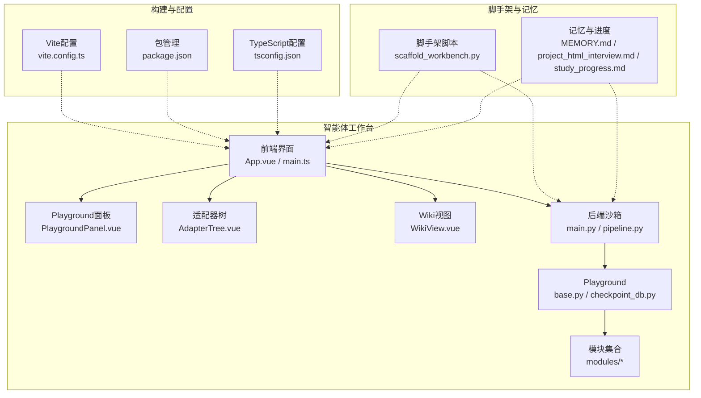
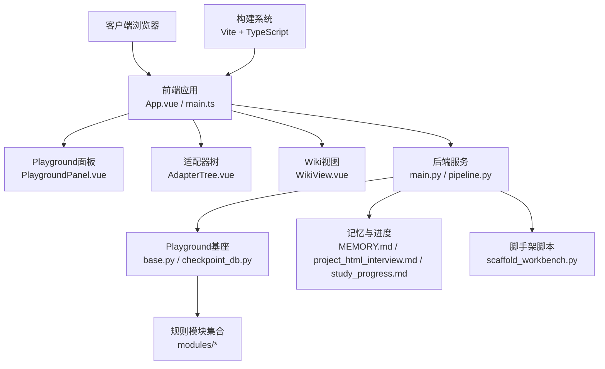
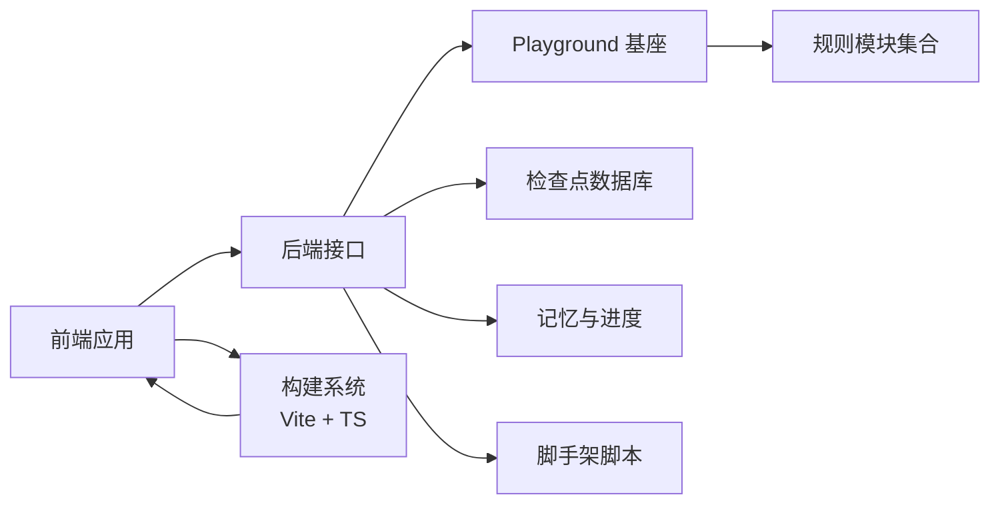

# 智能体工作台开发

<cite>
**本文引用的文件**
- [phases/14-agent-engineering/31-agent-workbench-why-models-fail/README.md](file://phases/14-agent-engineering/31-agent-workbench-why-models-fail/README.md)
- [phases/14-agent-engineering/32-minimal-agent-workbench/README.md](file://phases/14-agent-engineering/32-minimal-agent-workbench/README.md)
- [phases/14-agent-engineering/33-instructions-as-executable-constraints/README.md](file://phases/14-agent-engineering/33-instructions-as-executable-constraints/README.md)
- [phases/14-agent-engineering/34-repo-memory-and-state/README.md](file://phases/14-agent-engineering/34-repo-memory-and-state/README.md)
- [phases/14-agent-engineering/35-initialization-scripts/README.md](file://phases/14-agent-engineering/35-initialization-scripts/README.md)
- [phases/14-agent-engineering/36-scope-contracts/README.md](file://phases/14-agent-engineering/36-scope-contracts/README.md)
- [phases/14-agent-engineering/37-runtime-feedback-loops/README.md](file://phases/14-agent-engineering/37-runtime-feedback-loops/README.md)
- [phases/14-agent-engineering/38-verification-gates/README.md](file://phases/14-agent-engineering/38-verification-gates/README.md)
- [phases/14-agent-engineering/39-reviewer-agent/README.md](file://phases/14-agent-engineering/39-reviewer-agent/README.md)
- [phases/14-agent-engineering/40-multi-session-handoff/README.md](file://phases/14-agent-engineering/40-multi-session-handoff/README.md)
- [phases/14-agent-engineering/41-workbench-for-real-repos/README.md](file://phases/14-agent-engineering/41-workbench-for-real-repos/README.md)
- [phases/14-agent-engineering/42-agent-workbench-capstone/README.md](file://phases/14-agent-engineering/42-agent-workbench-capstone/README.md)
- [guardrails-sandbox/backend/main.py](file://guardrails-sandbox/backend/main.py)
- [guardrails-sandbox/backend/pipeline.py](file://guardrails-sandbox/backend/pipeline.py)
- [guardrails-sandbox/backend/playground/base.py](file://guardrails-sandbox/backend/playground/base.py)
- [guardrails-sandbox/backend/playground/checkpoint_db.py](file://guardrails-sandbox/backend/playground/checkpoint_db.py)
- [guardrails-sandbox/backend/playground/modules/adapter.py](file://guardrails-sandbox/backend/playground/modules/adapter.py)
- [guardrails-sandbox/backend/playground/modules/context_engine.py](file://guardrails-sandbox/backend/playground/modules/context_engine.py)
- [guardrails-sandbox/backend/playground/modules/factual_classifier.py](file://guardrails-sandbox/backend/playground/modules/factual_classifier.py)
- [guardrails-sandbox/backend/playground/modules/format_validator.py](file://guardrails-sandbox/backend/playground/modules/format_validator.py)
- [guardrails-sandbox/backend/playground/modules/injection.py](file://guardrails-sandbox/backend/playground/modules/injection.py)
- [guardrails-sandbox/backend/playground/modules/length_check.py](file://guardrails-sandbox/backend/playground/modules/length_check.py)
- [guardrails-sandbox/backend/playground/modules/output_scrubber.py](file://guardrails-sandbox/backend/playground/modules/output_scrubber.py)
- [guardrails-sandbox/backend/playground/modules/pii_detector.py](file://guardrails-sandbox/backend/playground/modules/pii_detector.py)
- [guardrails-sandbox/backend/playground/modules/prompt_leak.py](file://guardrails-sandbox/backend/playground/modules/prompt_leak.py)
- [guardrails-sandbox/backend/playground/modules/rag_groundedness.py](file://guardrails-sandbox/backend/playground/modules/rag_groundedness.py)
- [guardrails-sandbox/backend/playground/modules/rate_limiter.py](file://guardrails-sandbox/backend/playground/modules/rate_limiter.py)
- [guardrails-sandbox/backend/playground/modules/relevance.py](file://guardrails-sandbox/backend/playground/modules/relevance.py)
- [guardrails-sandbox/backend/playground/modules/topic_classifier.py](file://guardrails-sandbox/backend/playground/modules/topic_classifier.py)
- [guardrails-sandbox/backend/playground/modules/toxicity.py](file://guardrails-sandbox/backend/playground/modules/toxicity.py)
- [guardrails-sandbox/frontend/src/App.vue](file://guardrails-sandbox/frontend/src/App.vue)
- [guardrails-sandbox/frontend/src/main.ts](file://guardrails-sandbox/frontend/src/main.ts)
- [guardrails-sandbox/frontend/package.json](file://guardrails-sandbox/frontend/package.json)
- [guardrails-sandbox/frontend/vite.config.ts](file://guardrails-sandbox/frontend/vite.config.ts)
- [guardrails-sandbox/frontend/tsconfig.json](file://guardrails-sandbox/frontend/tsconfig.json)
- [guardrails-sandbox/frontend/src/components/PlaygroundPanel.vue](file://guardrails-sandbox/frontend/src/components/PlaygroundPanel.vue)
- [guardrails-sandbox/frontend/src/components/AdapterTree.vue](file://guardrails-sandbox/frontend/src/components/AdapterTree.vue)
- [guardrails-sandbox/run.sh](file://guardrails-sandbox/run.sh)
- [scripts/scaffold_workbench.py](file://scripts/scaffold_workbench.py)
- [memory/MEMORY.md](file://memory/MEMORY.md)
- [memory/project_html_interview.md](file://memory/project_html_interview.md)
- [memory/study_progress.md](file://memory/study_progress.md)
- [site/vue-app/summary/src/components/WikiView.vue](file://site/vue-app/summary/src/components/WikiView.vue)
- [site/vue-app/summary/src/App.vue](file://site/vue-app/summary/src/App.vue)
</cite>

## 更新摘要
**变更内容**
- 新增前端WikiView组件实现细节，支持文档树导航、Markdown渲染和Mermaid图表展示
- 增强构建系统配置，优化Vite开发和生产环境设置
- 更新依赖管理，升级Vue 3.4.0并完善TypeScript配置
- 扩展前端组件架构，增加PlaygroundPanel和AdapterTree等核心交互组件

## 目录
1. [引言](#引言)
2. [项目结构](#项目结构)
3. [核心组件](#核心组件)
4. [架构总览](#架构总览)
5. [详细组件分析](#详细组件分析)
6. [依赖关系分析](#依赖关系分析)
7. [性能考量](#性能考量)
8. [故障排查指南](#故障排查指南)
9. [结论](#结论)
10. [附录](#附录)

## 引言
本文件面向"智能体工作台"的系统化开发与落地，围绕"为什么模型会失败"这一根本问题，系统梳理从最小可行工作台到真实仓库集成的完整路径。文档聚焦以下关键主题：将指令转化为可执行约束（规则引擎、条件判断、动态调整）、仓库内存与状态管理（版本控制、状态同步、冲突解决）、初始化脚本设计（环境配置、依赖管理、启动流程）、作用域合约（权限控制、资源限制、行为约束）、运行时反馈循环（性能监控、自适应调整、持续优化）、验证门控机制（质量检查、安全验证、合规性保证）、审查员代理（代码审查、逻辑验证、错误检测）、多会话交接（状态传递、上下文保持、连续性保证），并给出真实仓库工作台的集成测试、部署验证与生产监控实践，最终形成可复用的毕业项目指南与最佳实践。

**更新** 新增了前端WikiView组件的实现细节，增强了构建系统和依赖管理，提升了整体用户体验和开发效率。

## 项目结构
本项目以"阶段化学习路径+实战工作台"的方式组织内容，其中第14阶段"智能体工程"覆盖了从基础概念到工程化落地的完整闭环。智能体工作台的实现由后端沙箱（规则与适配器模块）与前端交互界面组成，并通过脚手架工具与记忆/进度模块协同，支撑从最小可用到真实仓库的演进。

**图表来源**
- [guardrails-sandbox/frontend/src/App.vue](file://guardrails-sandbox/frontend/src/App.vue)
- [guardrails-sandbox/frontend/src/main.ts](file://guardrails-sandbox/frontend/src/main.ts)
- [guardrails-sandbox/frontend/src/components/PlaygroundPanel.vue](file://guardrails-sandbox/frontend/src/components/PlaygroundPanel.vue)
- [guardrails-sandbox/frontend/src/components/AdapterTree.vue](file://guardrails-sandbox/frontend/src/components/AdapterTree.vue)
- [site/vue-app/summary/src/components/WikiView.vue](file://site/vue-app/summary/src/components/WikiView.vue)
- [guardrails-sandbox/backend/main.py](file://guardrails-sandbox/backend/main.py)
- [guardrails-sandbox/backend/pipeline.py](file://guardrails-sandbox/backend/pipeline.py)
- [guardrails-sandbox/backend/playground/base.py](file://guardrails-sandbox/backend/playground/base.py)
- [guardrails-sandbox/backend/playground/checkpoint_db.py](file://guardrails-sandbox/backend/playground/checkpoint_db.py)
- [guardrails-sandbox/frontend/vite.config.ts](file://guardrails-sandbox/frontend/vite.config.ts)
- [guardrails-sandbox/frontend/package.json](file://guardrails-sandbox/frontend/package.json)
- [guardrails-sandbox/frontend/tsconfig.json](file://guardrails-sandbox/frontend/tsconfig.json)
- [scripts/scaffold_workbench.py](file://scripts/scaffold_workbench.py)
- [memory/MEMORY.md](file://memory/MEMORY.md)

章节来源
- [guardrails-sandbox/backend/main.py](file://guardrails-sandbox/backend/main.py)
- [guardrails-sandbox/backend/pipeline.py](file://guardrails-sandbox/backend/pipeline.py)
- [guardrails-sandbox/frontend/src/App.vue](file://guardrails-sandbox/frontend/src/App.vue)
- [guardrails-sandbox/frontend/src/main.ts](file://guardrails-sandbox/frontend/src/main.ts)
- [guardrails-sandbox/frontend/src/components/PlaygroundPanel.vue](file://guardrails-sandbox/frontend/src/components/PlaygroundPanel.vue)
- [guardrails-sandbox/frontend/src/components/AdapterTree.vue](file://guardrails-sandbox/frontend/src/components/AdapterTree.vue)
- [site/vue-app/summary/src/components/WikiView.vue](file://site/vue-app/summary/src/components/WikiView.vue)
- [scripts/scaffold_workbench.py](file://scripts/scaffold_workbench.py)
- [memory/MEMORY.md](file://memory/MEMORY.md)

## 核心组件
- 后端沙箱与流水线：负责接收输入、调度规则模块、执行适配器与校验，并输出受控结果。
- Playground 基础设施：提供工作台基座与检查点数据库，支持状态持久化与回放。
- 规则与适配器模块：涵盖事实性分类、格式校验、长度检查、毒性检测、PII检测、提示注入防护、RAG一致性、速率限制、相关性、主题分类等。
- **更新** 前端界面：Vue 应用入口与主程序，承载用户交互与可视化，包含增强的Playground面板、适配器树管理和Wiki文档视图。
- **更新** 构建系统：基于Vite的现代前端构建工具链，支持热重载、类型检查和模块化开发。
- 脚手架与记忆：自动化搭建工作台骨架，记录学习与项目进展，辅助迭代优化。

章节来源
- [guardrails-sandbox/backend/main.py](file://guardrails-sandbox/backend/main.py)
- [guardrails-sandbox/backend/pipeline.py](file://guardrails-sandbox/backend/pipeline.py)
- [guardrails-sandbox/backend/playground/base.py](file://guardrails-sandbox/backend/playground/base.py)
- [guardrails-sandbox/backend/playground/checkpoint_db.py](file://guardrails-sandbox/backend/playground/checkpoint_db.py)
- [guardrails-sandbox/backend/playground/modules/adapter.py](file://guardrails-sandbox/backend/playground/modules/adapter.py)
- [guardrails-sandbox/backend/playground/modules/context_engine.py](file://guardrails-sandbox/backend/playground/modules/context_engine.py)
- [guardrails-sandbox/backend/playground/modules/factual_classifier.py](file://guardrails-sandbox/backend/playground/modules/factual_classifier.py)
- [guardrails-sandbox/backend/playground/modules/format_validator.py](file://guardrails-sandbox/backend/playground/modules/format_validator.py)
- [guardrails-sandbox/backend/playground/modules/injection.py](file://guardrails-sandbox/backend/playground/modules/injection.py)
- [guardrails-sandbox/backend/playground/modules/length_check.py](file://guardrails-sandbox/backend/playground/modules/length_check.py)
- [guardrails-sandbox/backend/playground/modules/output_scrubber.py](file://guardrails-sandbox/backend/playground/modules/output_scrubber.py)
- [guardrails-sandbox/backend/playground/modules/pii_detector.py](file://guardrails-sandbox/backend/playground/modules/pii_detector.py)
- [guardrails-sandbox/backend/playground/modules/prompt_leak.py](file://guardrails-sandbox/backend/playground/modules/prompt_leak.py)
- [guardrails-sandbox/backend/playground/modules/rag_groundedness.py](file://guardrails-sandbox/backend/playground/modules/rag_groundedness.py)
- [guardrails-sandbox/backend/playground/modules/rate_limiter.py](file://guardrails-sandbox/backend/playground/modules/rate_limiter.py)
- [guardrails-sandbox/backend/playground/modules/relevance.py](file://guardrails-sandbox/backend/playground/modules/relevance.py)
- [guardrails-sandbox/backend/playground/modules/topic_classifier.py](file://guardrails-sandbox/backend/playground/modules/topic_classifier.py)
- [guardrails-sandbox/backend/playground/modules/toxicity.py](file://guardrails-sandbox/backend/playground/modules/toxicity.py)
- [guardrails-sandbox/frontend/src/App.vue](file://guardrails-sandbox/frontend/src/App.vue)
- [guardrails-sandbox/frontend/src/main.ts](file://guardrails-sandbox/frontend/src/main.ts)
- [guardrails-sandbox/frontend/src/components/PlaygroundPanel.vue](file://guardrails-sandbox/frontend/src/components/PlaygroundPanel.vue)
- [guardrails-sandbox/frontend/src/components/AdapterTree.vue](file://guardrails-sandbox/frontend/src/components/AdapterTree.vue)
- [site/vue-app/summary/src/components/WikiView.vue](file://site/vue-app/summary/src/components/WikiView.vue)
- [scripts/scaffold_workbench.py](file://scripts/scaffold_workbench.py)
- [memory/MEMORY.md](file://memory/MEMORY.md)

## 架构总览
智能体工作台采用前后端分离架构：前端负责交互与展示，后端负责业务编排与规则执行；Playground 提供统一的运行时基础设施，模块化规则作为插件式能力接入；脚手架与记忆模块贯穿开发与迭代周期，保障可重复性与可追踪性。

**更新** 前端架构现已包含三个主要视图：课程实验台（Playground）、适配器管理（AdapterTree）和Wiki文档浏览（WikiView），通过异步加载优化首屏性能。

**图表来源**
- [guardrails-sandbox/frontend/src/App.vue](file://guardrails-sandbox/frontend/src/App.vue)
- [guardrails-sandbox/frontend/src/main.ts](file://guardrails-sandbox/frontend/src/main.ts)
- [guardrails-sandbox/frontend/src/components/PlaygroundPanel.vue](file://guardrails-sandbox/frontend/src/components/PlaygroundPanel.vue)
- [guardrails-sandbox/frontend/src/components/AdapterTree.vue](file://guardrails-sandbox/frontend/src/components/AdapterTree.vue)
- [site/vue-app/summary/src/components/WikiView.vue](file://site/vue-app/summary/src/components/WikiView.vue)
- [guardrails-sandbox/backend/main.py](file://guardrails-sandbox/backend/main.py)
- [guardrails-sandbox/backend/pipeline.py](file://guardrails-sandbox/backend/pipeline.py)
- [guardrails-sandbox/backend/playground/base.py](file://guardrails-sandbox/backend/playground/base.py)
- [guardrails-sandbox/backend/playground/checkpoint_db.py](file://guardrails-sandbox/backend/playground/checkpoint_db.py)
- [memory/MEMORY.md](file://memory/MEMORY.md)
- [scripts/scaffold_workbench.py](file://scripts/scaffold_workbench.py)

## 详细组件分析

### 将指令转化为可执行约束：规则引擎与动态调整
- 设计理念：将自然语言指令映射为可执行的约束条件，结合规则引擎进行条件判断与分支控制，支持动态调整策略。
- 实现要点：
  - 条件判断：基于事实性分类、相关性、主题分类等模块对输入进行预判，决定后续处理路径。
  - 动态调整：根据格式校验、长度检查、毒性检测、PII检测等模块的反馈，实时调整输出策略或阻断危险路径。
  - 可扩展性：模块化设计允许按需启用/禁用规则，支持热插拔与渐进增强。
- 关键模块参考路径：
  - [guardrails-sandbox/backend/playground/modules/factual_classifier.py](file://guardrails-sandbox/backend/playground/modules/factual_classifier.py)
  - [guardrails-sandbox/backend/playground/modules/format_validator.py](file://guardrails-sandbox/backend/playground/modules/format_validator.py)
  - [guardrails-sandbox/backend/playground/modules/length_check.py](file://guardrails-sandbox/backend/playground/modules/length_check.py)
  - [guardrails-sandbox/backend/playground/modules/toxicity.py](file://guardrails-sandbox/backend/playground/modules/toxicity.py)
  - [guardrails-sandbox/backend/playground/modules/pii_detector.py](file://guardrails-sandbox/backend/playground/modules/pii_detector.py)
  - [guardrails-sandbox/backend/playground/modules/relevance.py](file://guardrails-sandbox/backend/playground/modules/relevance.py)
  - [guardrails-sandbox/backend/playground/modules/topic_classifier.py](file://guardrails-sandbox/backend/playground/modules/topic_classifier.py)

章节来源
- [guardrails-sandbox/backend/playground/modules/factual_classifier.py](file://guardrails-sandbox/backend/playground/modules/factual_classifier.py)
- [guardrails-sandbox/backend/playground/modules/format_validator.py](file://guardrails-sandbox/backend/playground/modules/format_validator.py)
- [guardrails-sandbox/backend/playground/modules/length_check.py](file://guardrails-sandbox/backend/playground/modules/length_check.py)
- [guardrails-sandbox/backend/playground/modules/toxicity.py](file://guardrails-sandbox/backend/playground/modules/toxicity.py)
- [guardrails-sandbox/backend/playground/modules/pii_detector.py](file://guardrails-sandbox/backend/playground/modules/pii_detector.py)
- [guardrails-sandbox/backend/playground/modules/relevance.py](file://guardrails-sandbox/backend/playground/modules/relevance.py)
- [guardrails-sandbox/backend/playground/modules/topic_classifier.py](file://guardrails-sandbox/backend/playground/modules/topic_classifier.py)

### 仓库内存与状态管理：版本控制、同步与冲突解决
- 版本控制：通过检查点数据库记录关键状态快照，支持回滚与重放。
- 状态同步：Playground 基座提供统一的状态接口，确保模块间共享与一致性。
- 冲突解决：在并发写入或异步更新场景下，采用幂等操作与乐观锁策略，避免竞态条件。
- 参考路径：
  - [guardrails-sandbox/backend/playground/checkpoint_db.py](file://guardrails-sandbox/backend/playground/checkpoint_db.py)
  - [guardrails-sandbox/backend/playground/base.py](file://guardrails-sandbox/backend/playground/base.py)

章节来源
- [guardrails-sandbox/backend/playground/checkpoint_db.py](file://guardrails-sandbox/backend/playground/checkpoint_db.py)
- [guardrails-sandbox/backend/playground/base.py](file://guardrails-sandbox/backend/playground/base.py)

### 初始化脚本设计：环境配置、依赖管理与启动流程
- 环境配置：脚手架脚本生成最小工作台骨架，自动安装依赖并生成前端/后端模板。
- 依赖管理：前端使用包管理清单，后端通过运行脚本统一启动。
- 启动流程：run.sh 负责后端服务启动与模块加载，前端通过构建工具运行本地开发服务器。
- 参考路径：
  - [scripts/scaffold_workbench.py](file://scripts/scaffold_workbench.py)
  - [guardrails-sandbox/run.sh](file://guardrails-sandbox/run.sh)
  - [guardrails-sandbox/frontend/package.json](file://guardrails-sandbox/frontend/package.json)

章节来源
- [scripts/scaffold_workbench.py](file://scripts/scaffold_workbench.py)
- [guardrails-sandbox/run.sh](file://guardrails-sandbox/run.sh)
- [guardrails-sandbox/frontend/package.json](file://guardrails-sandbox/frontend/package.json)

### 作用域合约：权限控制、资源限制与行为约束
- 权限控制：通过速率限制与访问控制模块限制请求频率与范围，防止滥用。
- 资源限制：结合长度检查与格式校验，控制输入/输出规模，避免资源耗尽。
- 行为约束：利用提示注入检测、RAG一致性评估与输出清洗模块，确保输出符合预期。
- 参考路径：
  - [guardrails-sandbox/backend/playground/modules/rate_limiter.py](file://guardrails-sandbox/backend/playground/modules/rate_limiter.py)
  - [guardrails-sandbox/backend/playground/modules/length_check.py](file://guardrails-sandbox/backend/playground/modules/length_check.py)
  - [guardrails-sandbox/backend/playground/modules/format_validator.py](file://guardrails-sandbox/backend/playground/modules/format_validator.py)
  - [guardrails-sandbox/backend/playground/modules/injection.py](file://guardrails-sandbox/backend/playground/modules/injection.py)
  - [guardrails-sandbox/backend/playground/modules/rag_groundedness.py](file://guardrails-sandbox/backend/playground/modules/rag_groundedness.py)
  - [guardrails-sandbox/backend/playground/modules/output_scrubber.py](file://guardrails-sandbox/backend/playground/modules/output_scrubber.py)

章节来源
- [guardrails-sandbox/backend/playground/modules/rate_limiter.py](file://guardrails-sandbox/backend/playground/modules/rate_limiter.py)
- [guardrails-sandbox/backend/playground/modules/length_check.py](file://guardrails-sandbox/backend/playground/modules/length_check.py)
- [guardrails-sandbox/backend/playground/modules/format_validator.py](file://guardrails-sandbox/backend/playground/modules/format_validator.py)
- [guardrails-sandbox/backend/playground/modules/injection.py](file://guardrails-sandbox/backend/playground/modules/injection.py)
- [guardrails-sandbox/backend/playground/modules/rag_groundedness.py](file://guardrails-sandbox/backend/playground/modules/rag_groundedness.py)
- [guardrails-sandbox/backend/playground/modules/output_scrubber.py](file://guardrails-sandbox/backend/playground/modules/output_scrubber.py)

### 运行时反馈循环：性能监控、自适应调整与持续优化
- 性能监控：通过模块化规则对输出质量与安全性进行实时评估，记录指标用于后续优化。
- 自适应调整：根据评估结果动态切换规则集或阈值，提升鲁棒性与稳定性。
- 持续优化：结合检查点回放与记忆模块，形成闭环迭代，逐步收敛到更优策略。
- 参考路径：
  - [guardrails-sandbox/backend/pipeline.py](file://guardrails-sandbox/backend/pipeline.py)
  - [guardrails-sandbox/backend/playground/checkpoint_db.py](file://guardrails-sandbox/backend/playground/checkpoint_db.py)
  - [memory/MEMORY.md](file://memory/MEMORY.md)

章节来源
- [guardrails-sandbox/backend/pipeline.py](file://guardrails-sandbox/backend/pipeline.py)
- [guardrails-sandbox/backend/playground/checkpoint_db.py](file://guardrails-sandbox/backend/playground/checkpoint_db.py)
- [memory/MEMORY.md](file://memory/MEMORY.md)

### 验证门控机制：质量检查、安全验证与合规性保证
- 质量检查：事实性分类、相关性与主题分类确保内容质量与上下文贴合度。
- 安全验证：毒性检测、PII检测、提示注入检测与输出清洗共同构成安全防线。
- 合规性保证：通过格式校验与长度检查，满足数据治理与合规要求。
- 参考路径：
  - [guardrails-sandbox/backend/playground/modules/factual_classifier.py](file://guardrails-sandbox/backend/playground/modules/factual_classifier.py)
  - [guardrails-sandbox/backend/playground/modules/relevance.py](file://guardrails-sandbox/backend/playground/modules/relevance.py)
  - [guardrails-sandbox/backend/playground/modules/topic_classifier.py](file://guardrails-sandbox/backend/playground/modules/topic_classifier.py)
  - [guardrails-sandbox/backend/playground/modules/toxicity.py](file://guardrails-sandbox/backend/playground/modules/toxicity.py)
  - [guardrails-sandbox/backend/playground/modules/pii_detector.py](file://guardrails-sandbox/backend/playground/modules/pii_detector.py)
  - [guardrails-sandbox/backend/playground/modules/injection.py](file://guardrails-sandbox/backend/playground/modules/injection.py)
  - [guardrails-sandbox/backend/playground/modules/format_validator.py](file://guardrails-sandbox/backend/playground/modules/format_validator.py)
  - [guardrails-sandbox/backend/playground/modules/length_check.py](file://guardrails-sandbox/backend/playground/modules/length_check.py)

章节来源
- [guardrails-sandbox/backend/playground/modules/factual_classifier.py](file://guardrails-sandbox/backend/playground/modules/factual_classifier.py)
- [guardrails-sandbox/backend/playground/modules/relevance.py](file://guardrails-sandbox/backend/playground/modules/relevance.py)
- [guardrails-sandbox/backend/playground/modules/topic_classifier.py](file://guardrails-sandbox/backend/playground/modules/topic_classifier.py)
- [guardrails-sandbox/backend/playground/modules/toxicity.py](file://guardrails-sandbox/backend/playground/modules/toxicity.py)
- [guardrails-sandbox/backend/playground/modules/pii_detector.py](file://guardrails-sandbox/backend/playground/modules/pii_detector.py)
- [guardrails-sandbox/backend/playground/modules/injection.py](file://guardrails-sandbox/backend/playground/modules/injection.py)
- [guardrails-sandbox/backend/playground/modules/format_validator.py](file://guardrails-sandbox/backend/playground/modules/format_validator.py)
- [guardrails-sandbox/backend/playground/modules/length_check.py](file://guardrails-sandbox/backend/playground/modules/length_check.py)

### 审查员代理：代码审查、逻辑验证与错误检测
- 代码审查：通过格式校验与输出清洗，确保输出结构与风格符合规范。
- 逻辑验证：利用事实性分类与RAG一致性评估，验证信息的准确性与上下文一致性。
- 错误检测：结合毒性检测、PII检测与提示注入检测，识别潜在风险与异常模式。
- 参考路径：
  - [guardrails-sandbox/backend/playground/modules/format_validator.py](file://guardrails-sandbox/backend/playground/modules/format_validator.py)
  - [guardrails-sandbox/backend/playground/modules/output_scrubber.py](file://guardrails-sandbox/backend/playground/modules/output_scrubber.py)
  - [guardrails-sandbox/backend/playground/modules/factual_classifier.py](file://guardrails-sandbox/backend/playground/modules/factual_classifier.py)
  - [guardrails-sandbox/backend/playground/modules/rag_groundedness.py](file://guardrails-sandbox/backend/playground/modules/rag_groundedness.py)
  - [guardrails-sandbox/backend/playground/modules/toxicity.py](file://guardrails-sandbox/backend/playground/modules/toxicity.py)
  - [guardrails-sandbox/backend/playground/modules/pii_detector.py](file://guardrails-sandbox/backend/playground/modules/pii_detector.py)
  - [guardrails-sandbox/backend/playground/modules/injection.py](file://guardrails-sandbox/backend/playground/modules/injection.py)

章节来源
- [guardrails-sandbox/backend/playground/modules/format_validator.py](file://guardrails-sandbox/backend/playground/modules/format_validator.py)
- [guardrails-sandbox/backend/playground/modules/output_scrubber.py](file://guardrails-sandbox/backend/playground/modules/output_scrubber.py)
- [guardrails-sandbox/backend/playground/modules/factual_classifier.py](file://guardrails-sandbox/backend/playground/modules/factual_classifier.py)
- [guardrails-sandbox/backend/playground/modules/rag_groundedness.py](file://guardrails-sandbox/backend/playground/modules/rag_groundedness.py)
- [guardrails-sandbox/backend/playground/modules/toxicity.py](file://guardrails-sandbox/backend/playground/modules/toxicity.py)
- [guardrails-sandbox/backend/playground/modules/pii_detector.py](file://guardrails-sandbox/backend/playground/modules/pii_detector.py)
- [guardrails-sandbox/backend/playground/modules/injection.py](file://guardrails-sandbox/backend/playground/modules/injection.py)

### 多会话交接：状态传递、上下文保持与连续性保证
- 状态传递：通过检查点数据库保存关键状态，跨会话恢复与继续执行。
- 上下文保持：上下文引擎模块负责维护与扩展上下文，确保对话连贯性。
- 连续性保证：Playground 基座提供统一的状态接口，配合规则模块实现一致的处理流程。
- 参考路径：
  - [guardrails-sandbox/backend/playground/checkpoint_db.py](file://guardrails-sandbox/backend/playground/checkpoint_db.py)
  - [guardrails-sandbox/backend/playground/base.py](file://guardrails-sandbox/backend/playground/base.py)
  - [guardrails-sandbox/backend/playground/modules/context_engine.py](file://guardrails-sandbox/backend/playground/modules/context_engine.py)

章节来源
- [guardrails-sandbox/backend/playground/checkpoint_db.py](file://guardrails-sandbox/backend/playground/checkpoint_db.py)
- [guardrails-sandbox/backend/playground/base.py](file://guardrails-sandbox/backend/playground/base.py)
- [guardrails-sandbox/backend/playground/modules/context_engine.py](file://guardrails-sandbox/backend/playground/modules/context_engine.py)

### 真实仓库工作台：集成测试、部署验证与生产监控
- 集成测试：通过沙箱流水线与模块组合，模拟真实场景下的输入/输出与安全策略。
- 部署验证：run.sh 统一启动后端服务，前端构建并联调，验证端到端流程。
- 生产监控：结合记忆模块记录学习与问题轨迹，形成可追溯的运维与优化依据。
- 参考路径：
  - [guardrails-sandbox/backend/pipeline.py](file://guardrails-sandbox/backend/pipeline.py)
  - [guardrails-sandbox/run.sh](file://guardrails-sandbox/run.sh)
  - [memory/MEMORY.md](file://memory/MEMORY.md)

章节来源
- [guardrails-sandbox/backend/pipeline.py](file://guardrails-sandbox/backend/pipeline.py)
- [guardrails-sandbox/run.sh](file://guardrails-sandbox/run.sh)
- [memory/MEMORY.md](file://memory/MEMORY.md)

### **新增** 前端WikiView组件：文档导航与知识管理
- 设计理念：提供结构化的文档浏览体验，支持树形导航、全文搜索和富文本渲染。
- 核心功能：
  - 递归树节点组件：支持无限层级展开/折叠，动态高亮当前选中项
  - Markdown渲染：集成marked库，支持语法高亮和GFM扩展
  - Mermaid图表：异步渲染流程图和架构图，支持错误处理和降级显示
  - 智能搜索：实时过滤文档树，自动展开匹配路径
- 技术实现：
  - Vue 3 Composition API：响应式状态管理和计算属性
  - 异步组件加载：按需加载WikiView，优化首屏性能
  - 样式隔离：scoped CSS和CSS变量系统，支持主题定制
- 参考路径：
  - [site/vue-app/summary/src/components/WikiView.vue](file://site/vue-app/summary/src/components/WikiView.vue)
  - [site/vue-app/summary/src/App.vue](file://site/vue-app/summary/src/App.vue)

**章节来源**
- [site/vue-app/summary/src/components/WikiView.vue](file://site/vue-app/summary/src/components/WikiView.vue)
- [site/vue-app/summary/src/App.vue](file://site/vue-app/summary/src/App.vue)

### **新增** 构建系统与依赖管理：现代化前端工程化
- Vite构建配置：
  - 开发服务器：支持热重载、API代理和路径别名
  - 生产构建：代码分割、压缩优化和资源清理
  - TypeScript支持：完整的类型检查和IDE集成
- 依赖管理策略：
  - Vue 3.4.0：最新的Composition API和性能优化
  - 开发依赖：@vitejs/plugin-vue、typescript、vue-tsc
  - 运行时依赖：仅Vue核心库，最小化打包体积
- 开发工作流：
  - 热模块替换（HMR）：组件级实时更新
  - 类型安全：编译时类型检查和错误提示
  - 模块化开发：ES模块和路径别名简化导入
- 参考路径：
  - [guardrails-sandbox/frontend/vite.config.ts](file://guardrails-sandbox/frontend/vite.config.ts)
  - [guardrails-sandbox/frontend/package.json](file://guardrails-sandbox/frontend/package.json)
  - [guardrails-sandbox/frontend/tsconfig.json](file://guardrails-sandbox/frontend/tsconfig.json)

**章节来源**
- [guardrails-sandbox/frontend/vite.config.ts](file://guardrails-sandbox/frontend/vite.config.ts)
- [guardrails-sandbox/frontend/package.json](file://guardrails-sandbox/frontend/package.json)
- [guardrails-sandbox/frontend/tsconfig.json](file://guardrails-sandbox/frontend/tsconfig.json)

### **新增** Playground面板：交互式模块测试平台
- 设计理念：为每个课程模块提供独立的测试环境，支持参数配置和结果可视化。
- 核心特性：
  - 动态表单生成：基于input_schema自动生成输入控件
  - 智能示例填充：Tab键自动填入placeholder中的示例值
  - 多种输入类型：支持文本、数字、选择框和多行文本
  - 结果可视化：统一的结果渲染器，支持表格、评分、列表等格式
- 交互优化：
  - 键盘快捷键：Enter运行，Cmd/Ctrl+Enter在多行文本中换行
  - 实时验证：表单提交前检查必填字段
  - 错误处理：友好的错误提示和重试机制
- 参考路径：
  - [guardrails-sandbox/frontend/src/components/PlaygroundPanel.vue](file://guardrails-sandbox/frontend/src/components/PlaygroundPanel.vue)

**章节来源**
- [guardrails-sandbox/frontend/src/components/PlaygroundPanel.vue](file://guardrails-sandbox/frontend/src/components/PlaygroundPanel.vue)

### **新增** 适配器树：可视化规则管理界面
- 设计理念：直观展示所有安全适配器的层次结构和运行状态。
- 功能特性：
  - 分组管理：按功能域组织适配器（Guardrails基础、Prompt工程、Few-Shot等）
  - 状态监控：实时显示每个适配器的通过/拦截统计
  - 悬浮提示：鼠标悬停显示详细信息、实现机制和业务影响
  - 批量操作：一键重置、基准测试和开关控制
- 视觉设计：
  - 深色主题：专业的开发者界面风格
  - 图标系统：每个适配器都有独特的emoji图标
  - 响应式布局：适配不同屏幕尺寸
- 参考路径：
  - [guardrails-sandbox/frontend/src/components/AdapterTree.vue](file://guardrails-sandbox/frontend/src/components/AdapterTree.vue)

**章节来源**
- [guardrails-sandbox/frontend/src/components/AdapterTree.vue](file://guardrails-sandbox/frontend/src/components/AdapterTree.vue)

## 依赖关系分析
- 组件耦合：前端仅依赖后端提供的稳定接口；后端通过Playground基座与模块解耦，便于独立演进。
- 外部依赖：前端依赖包管理清单；后端通过运行脚本统一启动，减少外部耦合。
- 循环依赖：模块间通过接口契约协作，未见直接循环依赖迹象。
- **更新** 构建依赖：Vite + TypeScript + Vue 3形成现代化的前端工程化体系，支持类型安全和热重载。

**图表来源**
- [guardrails-sandbox/frontend/src/App.vue](file://guardrails-sandbox/frontend/src/App.vue)
- [guardrails-sandbox/frontend/src/main.ts](file://guardrails-sandbox/frontend/src/main.ts)
- [guardrails-sandbox/frontend/src/components/PlaygroundPanel.vue](file://guardrails-sandbox/frontend/src/components/PlaygroundPanel.vue)
- [guardrails-sandbox/frontend/src/components/AdapterTree.vue](file://guardrails-sandbox/frontend/src/components/AdapterTree.vue)
- [guardrails-sandbox/frontend/vite.config.ts](file://guardrails-sandbox/frontend/vite.config.ts)
- [guardrails-sandbox/frontend/tsconfig.json](file://guardrails-sandbox/frontend/tsconfig.json)
- [guardrails-sandbox/backend/main.py](file://guardrails-sandbox/backend/main.py)
- [guardrails-sandbox/backend/pipeline.py](file://guardrails-sandbox/backend/pipeline.py)
- [guardrails-sandbox/backend/playground/base.py](file://guardrails-sandbox/backend/playground/base.py)
- [guardrails-sandbox/backend/playground/checkpoint_db.py](file://guardrails-sandbox/backend/playground/checkpoint_db.py)
- [memory/MEMORY.md](file://memory/MEMORY.md)
- [scripts/scaffold_workbench.py](file://scripts/scaffold_workbench.py)

## 性能考量
- 模块化与按需加载：通过模块化规则按需启用，降低不必要的计算开销。
- 幂等与缓存：检查点数据库与上下文引擎支持幂等操作与缓存命中，减少重复计算。
- 资源限制：速率限制与长度检查在入口处拦截高负载请求，保护系统稳定性。
- 可观测性：结合记忆模块记录性能指标与异常轨迹，指导优化方向。
- **更新** 前端性能优化：
  - 异步组件加载：WikiView仅在需要时加载，避免拖慢首屏
  - 代码分割：Vite自动进行模块分割，提高加载速度
  - 静态资源优化：图片压缩、CSS精简和JavaScript压缩
  - 开发体验优化：热重载和快速刷新，提升开发效率

## 故障排查指南
- 规则触发异常：优先检查对应规则模块的输入参数与阈值设置，确认是否误报或漏报。
- 状态不一致：核查检查点数据库写入与读取逻辑，确保事务一致性与并发安全。
- 前后端联调问题：核对前端请求格式与后端响应结构，确认接口契约匹配。
- 记忆与进度异常：检查记忆文件的读写权限与编码格式，避免解析错误。
- **更新** 前端构建问题：
  - TypeScript编译错误：检查类型定义和路径配置
  - Vite开发服务器：确认端口占用和代理配置
  - 组件加载失败：检查异步组件路径和依赖声明
  - 样式问题：验证CSS变量和scoped样式作用域
- 参考路径：
  - [guardrails-sandbox/backend/playground/modules/format_validator.py](file://guardrails-sandbox/backend/playground/modules/format_validator.py)
  - [guardrails-sandbox/backend/playground/checkpoint_db.py](file://guardrails-sandbox/backend/playground/checkpoint_db.py)
  - [guardrails-sandbox/frontend/src/App.vue](file://guardrails-sandbox/frontend/src/App.vue)
  - [guardrails-sandbox/frontend/vite.config.ts](file://guardrails-sandbox/frontend/vite.config.ts)
  - [guardrails-sandbox/frontend/tsconfig.json](file://guardrails-sandbox/frontend/tsconfig.json)
  - [memory/MEMORY.md](file://memory/MEMORY.md)

**章节来源**
- [guardrails-sandbox/backend/playground/modules/format_validator.py](file://guardrails-sandbox/backend/playground/modules/format_validator.py)
- [guardrails-sandbox/backend/playground/checkpoint_db.py](file://guardrails-sandbox/backend/playground/checkpoint_db.py)
- [guardrails-sandbox/frontend/src/App.vue](file://guardrails-sandbox/frontend/src/App.vue)
- [guardrails-sandbox/frontend/vite.config.ts](file://guardrails-sandbox/frontend/vite.config.ts)
- [guardrails-sandbox/frontend/tsconfig.json](file://guardrails-sandbox/frontend/tsconfig.json)
- [memory/MEMORY.md](file://memory/MEMORY.md)

## 结论
本工作台以"规则即约束、模块即能力、状态即资产"的理念，构建了从最小可用到真实仓库落地的完整闭环。通过将指令转化为可执行约束、强化安全与合规、建立运行时反馈与审查机制、完善多会话交接与生产监控，实现了可控、可观测、可持续的智能体工程化平台。

**更新** 随着前端WikiView组件的引入、构建系统的增强和依赖管理的优化，工作台现在提供了更加完善的用户体验和开发效率。新的组件架构支持更好的可维护性和扩展性，为未来的功能增强奠定了坚实基础。

建议在实际项目中遵循模块化演进、渐进增强与闭环优化的原则，持续提升系统的稳定性与可维护性。特别关注前端组件的异步加载策略和构建优化，以确保在不同网络环境和设备上的良好表现。

## 附录
- 最小可行工作台清单
  - 前后端基础框架
  - 规则模块集合（格式校验、长度检查、毒性检测、PII检测、提示注入检测、RAG一致性、输出清洗、速率限制）
  - Playground 基座与检查点数据库
  - 脚手架脚本与前端包管理
  - 记忆与进度模块
  - **新增** 现代前端构建系统（Vite + TypeScript + Vue 3）
  - **新增** Wiki文档浏览组件
  - **新增** 交互式Playground测试面板
  - **新增** 可视化适配器管理界面
- 毕业项目建议
  - 选择一个真实仓库场景，完成从需求建模到上线监控的全流程演练
  - 形成可复用的规则模板与最佳实践文档
  - 建立团队内审流程与知识沉淀机制
  - **新增** 利用Wiki组件构建项目知识库
  - **新增** 通过Playground面板进行A/B测试和性能对比
  - **新增** 使用适配器树进行安全策略可视化管理