# 智能体工程

<cite>
**本文引用的文件**
- [README.md](file://README.md)
- [AGENTS.md](file://AGENTS.md)
- [MEMORY.md](file://memory/MEMORY.md)
- [phases/14-agent-engineering/01-the-agent-loop/docs/en.md](file://phases/14-agent-engineering/01-the-agent-loop/docs/en.md)
- [phases/14-agent-engineering/02-rewoo-plan-and-execute/docs/en.md](file://phases/14-agent-engineering/02-rewoo-plan-and-execute/docs/en.md)
- [phases/14-agent-engineering/03-reflexion-verbal-rl/docs/en.md](file://phases/14-agent-engineering/03-reflexion-verbal-rl/docs/en.md)
- [phases/14-agent-engineering/04-tree-of-thoughts-lats/docs/en.md](file://phases/14-agent-engineering/04-tree-of-thoughts-lats/docs/en.md)
- [phases/14-agent-engineering/07-memory-virtual-context-memgpt/docs/en.md](file://phases/14-agent-engineering/07-memory-virtual-context-memgpt/docs/en.md)
- [phases/14-agent-engineering/13-langgraph-stateful-graphs/docs/en.md](file://phases/14-agent-engineering/13-langgraph-stateful-graphs/docs/en.md)
- [phases/14-agent-engineering/14-autogen-actor-model/docs/en.md](file://phases/14-agent-engineering/14-autogen-actor-model/docs/en.md)
- [phases/14-agent-engineering/15-crewai-role-based-crews/docs/en.md](file://phases/14-agent-engineering/15-crewai-role-based-crews/docs/en.md)
- [phases/14-agent-engineering/21-computer-use-agents/docs/en.md](file://phases/14-agent-engineering/21-computer-use-agents/docs/en.md)
- [phases/14-agent-engineering/22-voice-agents-pipecat-livekit/docs/en.md](file://phases/14-agent-engineering/22-voice-agents-pipecat-livekit/docs/en.md)
</cite>

## 目录
1. [引言](#引言)
2. [项目结构](#项目结构)
3. [核心组件](#核心组件)
4. [架构总览](#架构总览)
5. [详细组件分析](#详细组件分析)
6. [依赖关系分析](#依赖关系分析)
7. [性能考量](#性能考量)
8. [故障排查指南](#故障排查指南)
9. [结论](#结论)
10. [附录](#附录)

## 引言
本课程围绕“智能体工程”构建，系统覆盖智能体循环、记忆系统、计划与执行、框架对比、协作模式、多模态与计算机操作代理、语音代理、可观测性与生产实践、以及智能体工作台的设计理念与开发方法。课程以“从零到一”的方式，先用纯语言实现关键算法与范式，再迁移到主流框架，确保读者既能理解底层控制流，也能掌握工程化落地。

## 项目结构
仓库采用“阶段-课程”的线性组织方式，每个阶段由若干课程组成，每门课程包含：
- docs/en.md：课程讲义（含目标、概念、练习）
- code/：可运行的最小实现（通常为标准库版本）
- outputs/：可复用的技能、提示词、代理或MCP服务器模板
- quiz.json：阶段性测验

课程体系以“数学基础 → 机器学习 → 深度学习 → 多模态 → LLM工程 → 智能体工程 → 自主系统 → 多智能体 → 基础设施与生产 → 道德与安全 → 毕业项目”为主线，形成完整的知识闭环。

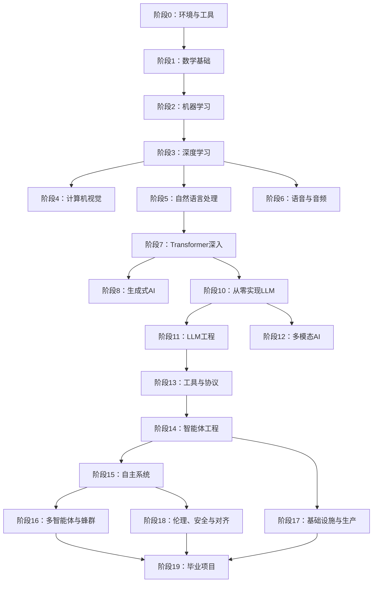

图示来源
- [README.md:57-81](file://README.md#L57-L81)

章节来源
- [README.md:243-795](file://README.md#L243-L795)

## 核心组件
本节聚焦智能体工程阶段的关键构件：智能体循环、计划与执行、反思学习、树搜索、记忆系统、状态图编排、Actor模型、CrewAI团队、计算机使用代理、语音代理等。

- 智能体循环（ReAct）：三段式循环（观察→思考→行动），停止条件、工具注册表、观测格式化、回环预算。
- 计划与执行（ReWOO/Plan-and-Execute/Plan-and-Act）：解耦规划与执行，降低token开销，支持并行证据检索与合成求解。
- 反射学习（Reflexion）：通过自然语言反思与情节记忆提升自修复能力，避免梯度更新。
- 树搜索（ToT/LATS）：将推理建模为搜索树，结合自评估与蒙特卡洛树搜索，适用于复杂任务。
- 记忆系统（MemGPT虚拟上下文）：主上下文（prompt）+ 外部可搜索存储（archival），中断式内存调用。
- 状态图编排（LangGraph）：不可变状态、函数节点、条件边、后步检查点、可恢复执行。
- Actor模型（AutoGen v0.4）：消息即IPC，失败隔离，天然并发，事件驱动。
- CrewAI团队（角色型crew与流程）：Agent/Task/Crew/Process四元组；Sequential/Hierarchical/Consensus（计划中）；事件驱动Flow。
- 计算机使用代理（Claude/OpenAI CUA/Gemini）：基于视觉的GUI交互，统一“仅直接用户指令才具权限”的不可信输入契约。
- 语音代理（Pipecat/LiveKit）：帧式流水线（VAD→STT→LLM→TTS→传输），端到端延迟目标450–600ms。

章节来源
- [phases/14-agent-engineering/01-the-agent-loop/docs/en.md:1-136](file://phases/14-agent-engineering/01-the-agent-loop/docs/en.md#L1-L136)
- [phases/14-agent-engineering/02-rewoo-plan-and-execute/docs/en.md:1-122](file://phases/14-agent-engineering/02-rewoo-plan-and-execute/docs/en.md#L1-L122)
- [phases/14-agent-engineering/03-reflexion-verbal-rl/docs/en.md:1-136](file://phases/14-agent-engineering/03-reflexion-verbal-rl/docs/en.md#L1-L136)
- [phases/14-agent-engineering/04-tree-of-thoughts-lats/docs/en.md:1-131](file://phases/14-agent-engineering/04-tree-of-thoughts-lats/docs/en.md#L1-L131)
- [phases/14-agent-engineering/07-memory-virtual-context-memgpt/docs/en.md:1-140](file://phases/14-agent-engineering/07-memory-virtual-context-memgpt/docs/en.md#L1-L140)
- [phases/14-agent-engineering/13-langgraph-stateful-graphs/docs/en.md:1-122](file://phases/14-agent-engineering/13-langgraph-stateful-graphs/docs/en.md#L1-L122)
- [phases/14-agent-engineering/14-autogen-actor-model/docs/en.md:1-118](file://phases/14-agent-engineering/14-autogen-actor-model/docs/en.md#L1-L118)
- [phases/14-agent-engineering/15-crewai-role-based-crews/docs/en.md:1-220](file://phases/14-agent-engineering/15-crewai-role-based-crews/docs/en.md#L1-L220)
- [phases/14-agent-engineering/21-computer-use-agents/docs/en.md:1-131](file://phases/14-agent-engineering/21-computer-use-agents/docs/en.md#L1-L131)
- [phases/14-agent-engineering/22-voice-agents-pipecat-livekit/docs/en.md:1-130](file://phases/14-agent-engineering/22-voice-agents-pipecat-livekit/docs/en.md#L1-L130)

## 架构总览
下图展示了智能体工程阶段的核心范式如何在不同抽象层协同：底层是ReAct循环，上层是计划-执行、反思学习与树搜索；中间层是记忆系统；顶层是编排框架（LangGraph、AutoGen、CrewAI）与应用形态（计算机使用、语音代理）。

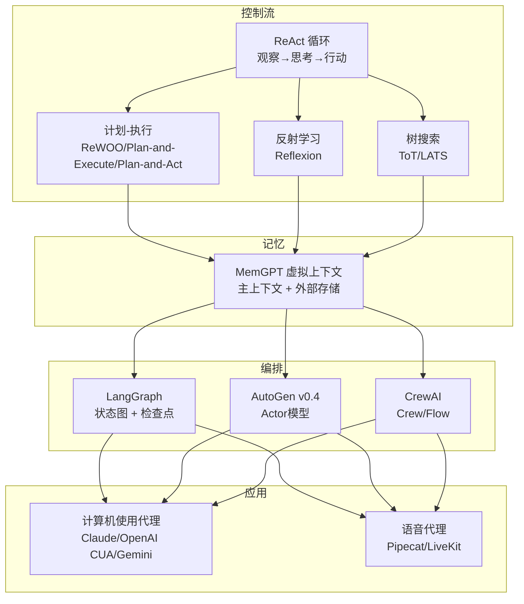

图示来源
- [phases/14-agent-engineering/01-the-agent-loop/docs/en.md:25-73](file://phases/14-agent-engineering/01-the-agent-loop/docs/en.md#L25-L73)
- [phases/14-agent-engineering/02-rewoo-plan-and-execute/docs/en.md:25-67](file://phases/14-agent-engineering/02-rewoo-plan-and-execute/docs/en.md#L25-L67)
- [phases/14-agent-engineering/03-reflexion-verbal-rl/docs/en.md:27-60](file://phases/14-agent-engineering/03-reflexion-verbal-rl/docs/en.md#L27-L60)
- [phases/14-agent-engineering/04-tree-of-thoughts-lats/docs/en.md:25-78](file://phases/14-agent-engineering/04-tree-of-thoughts-lats/docs/en.md#L25-L78)
- [phases/14-agent-engineering/07-memory-virtual-context-memgpt/docs/en.md:29-70](file://phases/14-agent-engineering/07-memory-virtual-context-memgpt/docs/en.md#L29-L70)
- [phases/14-agent-engineering/13-langgraph-stateful-graphs/docs/en.md:25-60](file://phases/14-agent-engineering/13-langgraph-stateful-graphs/docs/en.md#L25-L60)
- [phases/14-agent-engineering/14-autogen-actor-model/docs/en.md:25-62](file://phases/14-agent-engineering/14-autogen-actor-model/docs/en.md#L25-L62)
- [phases/14-agent-engineering/15-crewai-role-based-crews/docs/en.md:30-60](file://phases/14-agent-engineering/15-crewai-role-based-crews/docs/en.md#L30-L60)
- [phases/14-agent-engineering/21-computer-use-agents/docs/en.md:23-71](file://phases/14-agent-engineering/21-computer-use-agents/docs/en.md#L23-L71)
- [phases/14-agent-engineering/22-voice-agents-pipecat-livekit/docs/en.md:23-74](file://phases/14-agent-engineering/22-voice-agents-pipecat-livekit/docs/en.md#L23-L74)

## 详细组件分析

### 智能体循环：观察→思考→行动
- 五要素：消息缓冲区、工具注册表、停止条件、回环预算、观测格式化。
- 2026演进：从显式“Thought:”到原生推理通道（Responses API），但循环不变。
- 工程要点：防止信任边界坍塌、级联失败、回环长度爆炸；结合可观测性与评估轨迹。

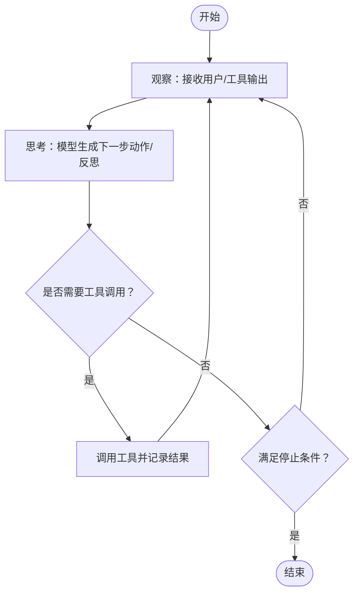

图示来源
- [phases/14-agent-engineering/01-the-agent-loop/docs/en.md:25-73](file://phases/14-agent-engineering/01-the-agent-loop/docs/en.md#L25-L73)

章节来源
- [phases/14-agent-engineering/01-the-agent-loop/docs/en.md:1-136](file://phases/14-agent-engineering/01-the-agent-loop/docs/en.md#L1-L136)

### 计划与执行：ReWOO/Plan-and-Execute/Plan-and-Act
- ReWOO：先规划（DAG），再并行执行证据收集，最后合成求解；显著节省token并提升鲁棒性。
- Plan-and-Execute：在ReWOO基础上加入可选重规划器，兼顾灵活性。
- Plan-and-Act：面向长时序网页/移动任务，引入显式规划数据增强，训练可扩展的规划器。

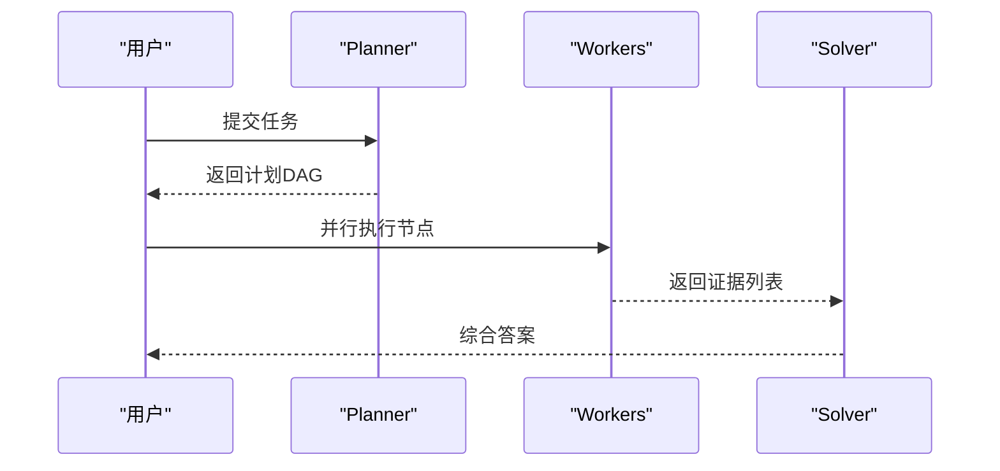

图示来源
- [phases/14-agent-engineering/02-rewoo-plan-and-execute/docs/en.md:25-86](file://phases/14-agent-engineering/02-rewoo-plan-and-execute/docs/en.md#L25-L86)

章节来源
- [phases/14-agent-engineering/02-rewoo-plan-and-execute/docs/en.md:1-122](file://phases/14-agent-engineering/02-rewoo-plan-and-execute/docs/en.md#L1-L122)

### 反射学习：Verbal Reinforcement Learning
- 三组件：Actor（产生轨迹）、Evaluator（二元/启发式/自评估）、Self-Reflector（失败反思）。
- 情节记忆：将反思附加到后续试次提示中，无需权重更新即可改进。
- 工程要点：避免记忆腐坏（定期压缩、TTL），区分可帮助与无意义反思。

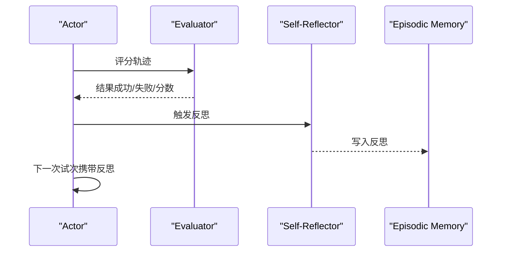

图示来源
- [phases/14-agent-engineering/03-reflexion-verbal-rl/docs/en.md:27-80](file://phases/14-agent-engineering/03-reflexion-verbal-rl/docs/en.md#L27-L80)

章节来源
- [phases/14-agent-engineering/03-reflexion-verbal-rl/docs/en.md:1-136](file://phases/14-agent-engineering/03-reflexion-verbal-rl/docs/en.md#L1-L136)

### 树搜索：Tree of Thoughts 与 LATS
- Tree of Thoughts：将链式思维转为树，节点自评估，BFS/DFS/Beam搜索。
- LATS：将ToT、ReAct、Reflexion统一到蒙特卡洛树搜索框架，利用环境反馈作为价值函数。
- 成本权衡：搜索带来token爆炸，需在复杂度与正确性之间取舍。

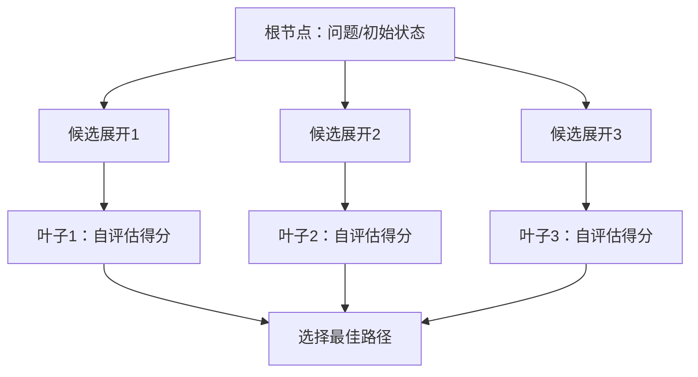

图示来源
- [phases/14-agent-engineering/04-tree-of-thoughts-lats/docs/en.md:25-78](file://phases/14-agent-engineering/04-tree-of-thoughts-lats/docs/en.md#L25-L78)

章节来源
- [phases/14-agent-engineering/04-tree-of-thoughts-lats/docs/en.md:1-131](file://phases/14-agent-engineering/04-tree-of-thoughts-lats/docs/en.md#L1-L131)

### 记忆系统：MemGPT虚拟上下文
- OS类比：主上下文=RAM，外部存储=磁盘，内存工具=页面置换。
- 两级设计：主上下文（固定窗口）+ 外部可搜索存储；中断式内存调用将结果拼接到下一轮。
- 生产风险：记忆腐坏、记忆污染、引用丢失；需定期整理、显式失效、溯源标注。

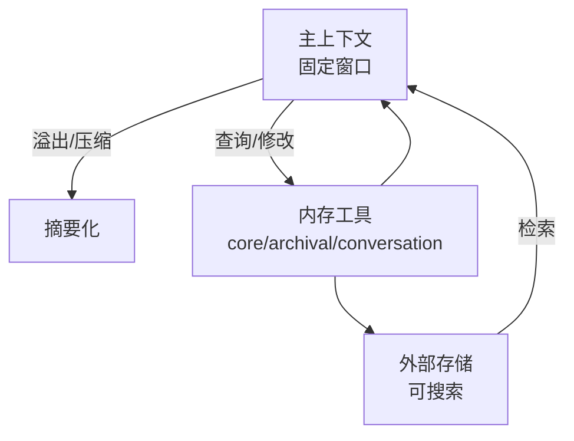

图示来源
- [phases/14-agent-engineering/07-memory-virtual-context-memgpt/docs/en.md:29-79](file://phases/14-agent-engineering/07-memory-virtual-context-memgpt/docs/en.md#L29-L79)

章节来源
- [phases/14-agent-engineering/07-memory-virtual-context-memgpt/docs/en.md:1-140](file://phases/14-agent-engineering/07-memory-virtual-context-memgpt/docs/en.md#L1-L140)

### 状态图编排：LangGraph
- 核心模型：不可变状态、函数节点、条件边、后步检查点；失败后可精确恢复。
- 四大能力：持久化执行、流式输出、人机协同、综合记忆。
- 三种拓扑：监督者、对等（蜂群）、分层（嵌套子图）。

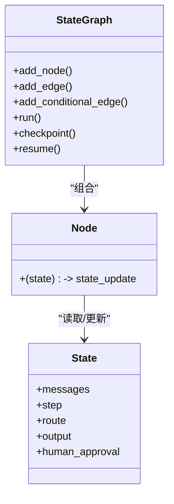

图示来源
- [phases/14-agent-engineering/13-langgraph-stateful-graphs/docs/en.md:25-82](file://phases/14-agent-engineering/13-langgraph-stateful-graphs/docs/en.md#L25-L82)

章节来源
- [phases/14-agent-engineering/13-langgraph-stateful-graphs/docs/en.md:1-122](file://phases/14-agent-engineering/13-langgraph-stateful-graphs/docs/en.md#L1-L122)

### Actor模型：AutoGen v0.4
- 核心思想：Actor私有状态 + 仅消息交互；解耦投递与处理，实现故障隔离与天然并发。
- 三层API：Core（低层）、AgentChat（任务导向）、Extensions（集成）。
- 观测性：内置OpenTelemetry支持，遵循2026语义约定。

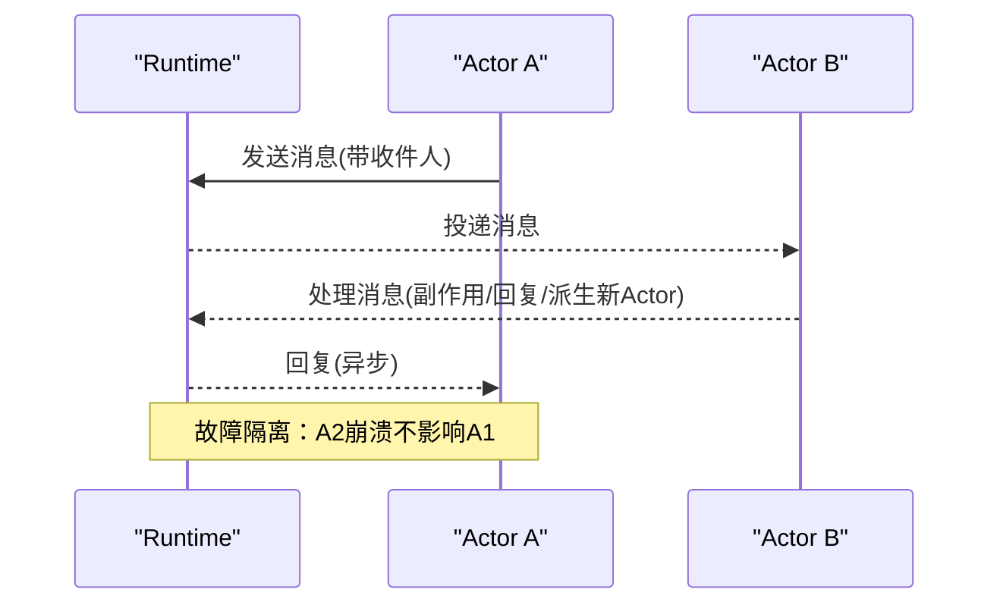

图示来源
- [phases/14-agent-engineering/14-autogen-actor-model/docs/en.md:25-78](file://phases/14-agent-engineering/14-autogen-actor-model/docs/en.md#L25-L78)

章节来源
- [phases/14-agent-engineering/14-autogen-actor-model/docs/en.md:1-118](file://phases/14-agent-engineering/14-autogen-actor-model/docs/en.md#L1-L118)

### CrewAI团队：角色型crew与流程
- 四元组：Agent（角色+目标+背景+工具）、Task（描述+期望输出+指派+结构化输出）、Crew（容器+进程）、Process（顺序/分层/共识）。
- Crew适合探索性协作；Flow适合事件驱动、可审计的生产。
- 工具集成：装饰器工具、类工具、内置工具包；结构化输出配合严格合同。

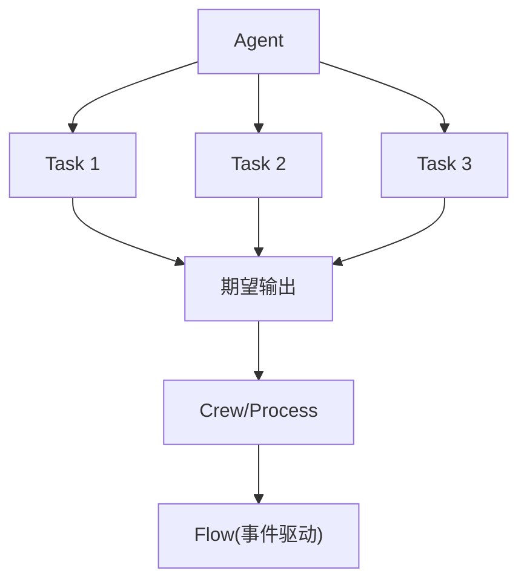

图示来源
- [phases/14-agent-engineering/15-crewai-role-based-crews/docs/en.md:30-60](file://phases/14-agent-engineering/15-crewai-role-based-crews/docs/en.md#L30-L60)

章节来源
- [phases/14-agent-engineering/15-crewai-role-based-crews/docs/en.md:1-220](file://phases/14-agent-engineering/15-crewai-role-based-crews/docs/en.md#L1-L220)

### 计算机使用代理：Claude/OpenAI CUA/Gemini
- 共同特征：均基于视觉，将截图、DOM文本、工具输出视为不可信输入；仅直接用户指令具权限。
- 安全模式收敛：每步安全服务、白名单/黑名单导航、敏感动作人工确认、内容捕获与追踪、硬编码拒绝指令。
- 选型建议：桌面自动化优先选Claude；浏览器优先选Gemini；消费入口选OpenAI。

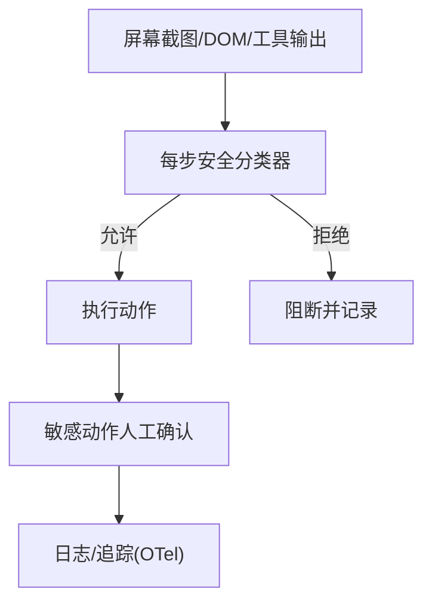

图示来源
- [phases/14-agent-engineering/21-computer-use-agents/docs/en.md:46-77](file://phases/14-agent-engineering/21-computer-use-agents/docs/en.md#L46-L77)

章节来源
- [phases/14-agent-engineering/21-computer-use-agents/docs/en.md:1-131](file://phases/14-agent-engineering/21-computer-use-agents/docs/en.md#L1-L131)

### 语音代理：Pipecat/LiveKit
- Pipecat：帧式流水线（DOWNSTREAM前向+UPSTREAM反馈），支持多种传输；可插拔处理器。
- LiveKit：MultimodalAgent（直接音频）与VoicePipelineAgent（文本级控制）；WebRTC/Telephony；内建MCP。
- 2026延迟目标：450–600ms端到端，需逐环节优化（VAD/STT/LLM/TTS/传输）。

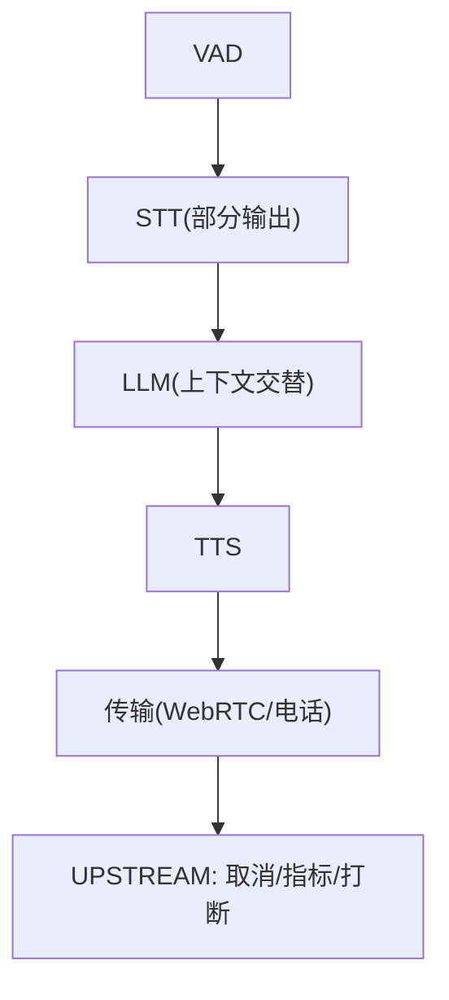

图示来源
- [phases/14-agent-engineering/22-voice-agents-pipecat-livekit/docs/en.md:23-74](file://phases/14-agent-engineering/22-voice-agents-pipecat-livekit/docs/en.md#L23-L74)

章节来源
- [phases/14-agent-engineering/22-voice-agents-pipecat-livekit/docs/en.md:1-130](file://phases/14-agent-engineering/22-voice-agents-pipecat-livekit/docs/en.md#L1-L130)

## 依赖关系分析
- 课程依赖：前置阶段与课程（如LLM工程、工具与协议）为智能体工程提供基础。
- 实现依赖：std-libs-first原则，框架之上仍以最小实现验证范式。
- 产出依赖：每门课产出可复用技能/提示词/代理/MCP服务器，形成“可组合工具箱”。

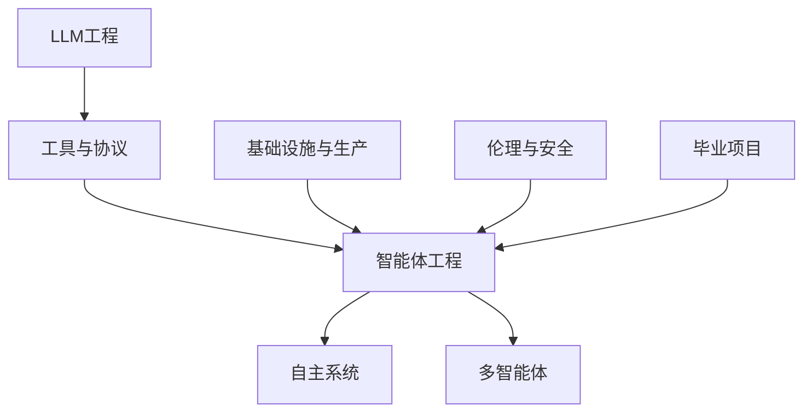

图示来源
- [README.md:57-81](file://README.md#L57-L81)
- [AGENTS.md:50-60](file://AGENTS.md#L50-L60)

章节来源
- [README.md:243-795](file://README.md#L243-L795)
- [AGENTS.md:1-219](file://AGENTS.md#L1-L219)

## 性能考量
- Token效率：ReWOO/Plan-and-Execute显著降低token用量；ToT/LATS带来token爆炸，需谨慎采用。
- 延迟与吞吐：语音代理端到端450–600ms目标，需在各环节（VAD/STT/LLM/TTS/传输）做优化。
- 可靠性：LangGraph检查点+恢复、AutoGen故障隔离、CrewAI结构化输出与合同约束。
- 记忆稳定性：MemGPT虚拟上下文需防记忆腐坏与污染，建立压缩、TTL与溯源机制。

## 故障排查指南
- 信任边界与注入：计算机使用代理需每步安全分类与人工确认；语音代理需处理VAD/STT/TTS的不一致。
- 回环与超步：设置明确停止条件与回环预算；LangGraph检查点便于定位失败点。
- 记忆问题：定期压缩与失效策略；为检索条目添加来源引用；检测指令形状的恶意内容。
- 多智能体协调：CrewAI注意backstory过大导致prompt-bloat；Hierarchical增加管理LLM成本；Flow保证确定性与可观测性。

章节来源
- [phases/14-agent-engineering/21-computer-use-agents/docs/en.md:72-77](file://phases/14-agent-engineering/21-computer-use-agents/docs/en.md#L72-L77)
- [phases/14-agent-engineering/22-voice-agents-pipecat-livekit/docs/en.md:58-64](file://phases/14-agent-engineering/22-voice-agents-pipecat-livekit/docs/en.md#L58-L64)
- [phases/14-agent-engineering/07-memory-virtual-context-memgpt/docs/en.md:71-76](file://phases/14-agent-engineering/07-memory-virtual-context-memgpt/docs/en.md#L71-L76)
- [phases/14-agent-engineering/15-crewai-role-based-crews/docs/en.md:129-135](file://phases/14-agent-engineering/15-crewai-role-based-crews/docs/en.md#L129-L135)

## 结论
本课程以“先实现、后框架”的方式，系统呈现智能体工程的关键范式：从ReAct循环到计划-执行、从反思学习到树搜索、从MemGPT记忆到LangGraph/AutoGen/CrewAI编排，再到计算机使用与语音代理的实际应用。通过最小实现与工程化实践相结合，读者既能掌握控制流与数据流，也能理解生产中的可靠性、可观测性与安全治理。

## 附录
- 术语表与关键术语参见各课程讲义末尾，涵盖Agent、ReAct、工具调用、观察、推理通道、停止条件、回环预算、轨迹、树搜索、MCTS、UCC、值函数、策略、回滚、记忆页故障、记忆腐坏、记忆污染等。
- 课程产出（技能/提示词/代理/MCP服务器）均可直接复用，形成个人/团队的“智能体工具箱”。