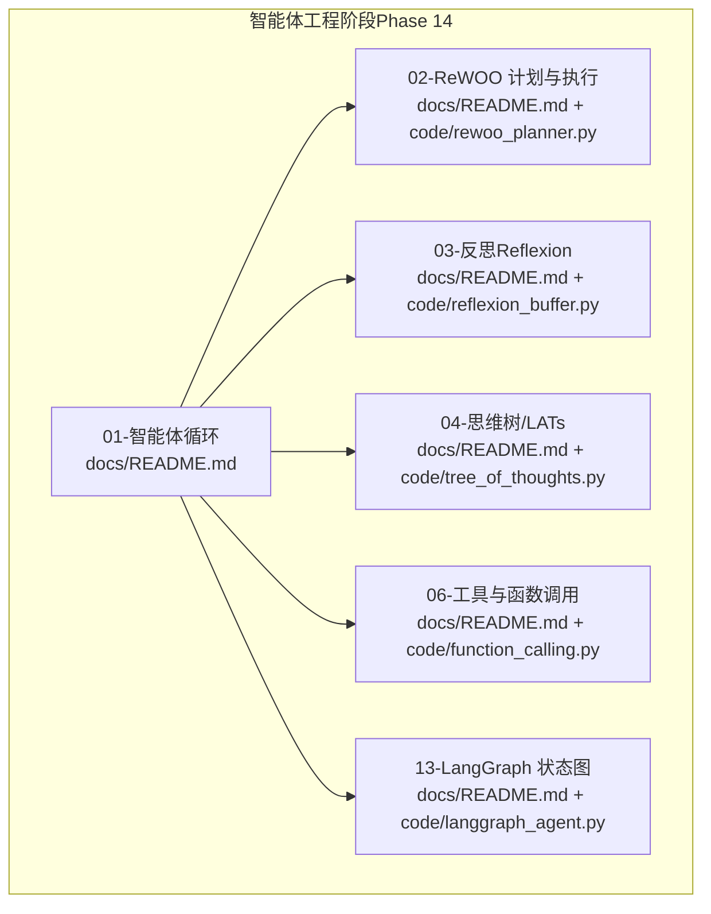
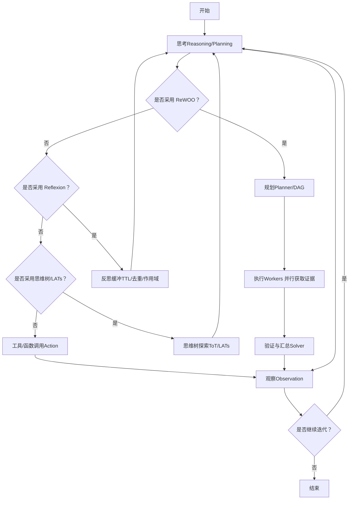
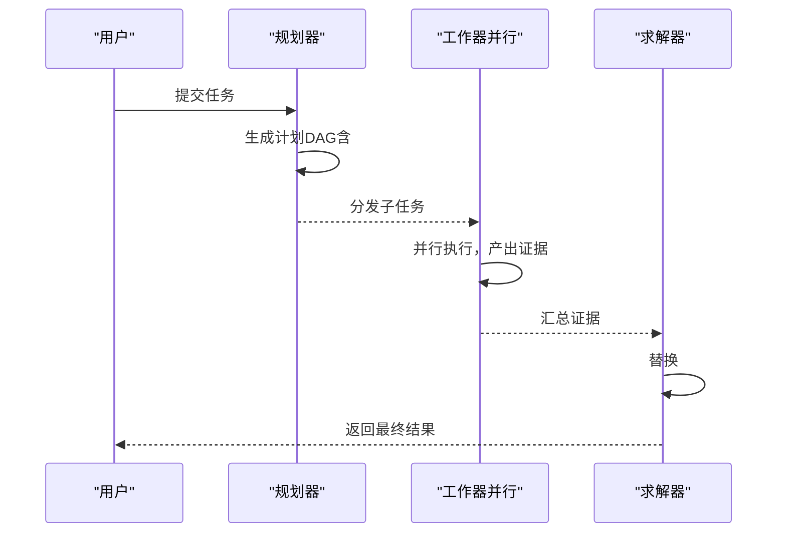
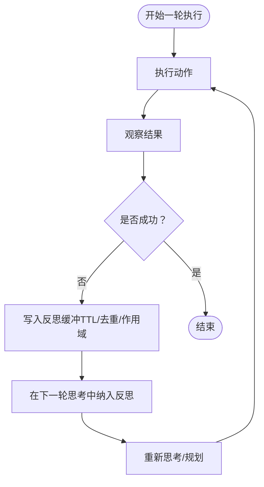
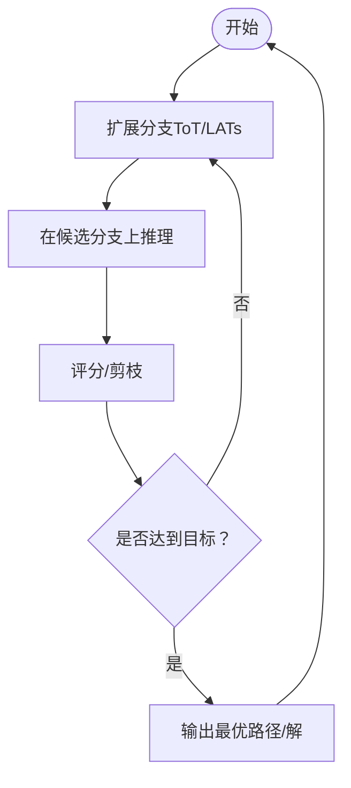
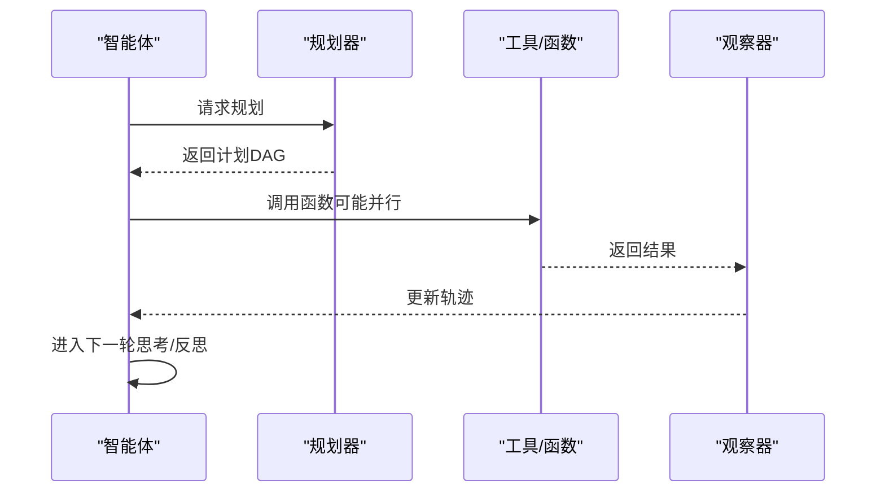
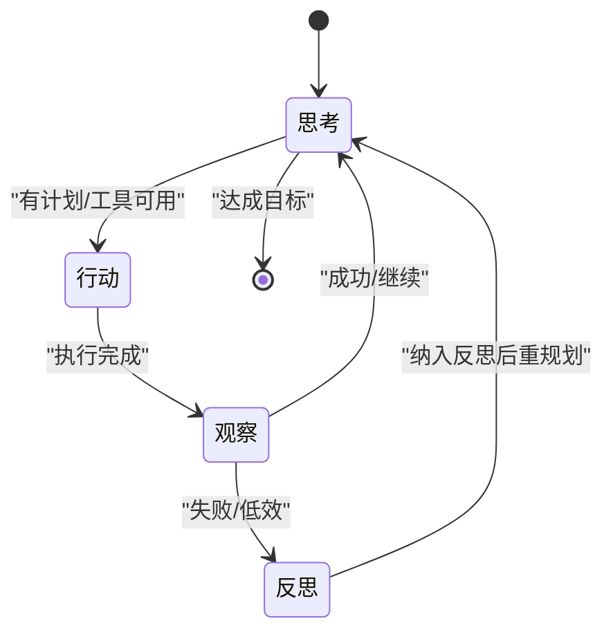
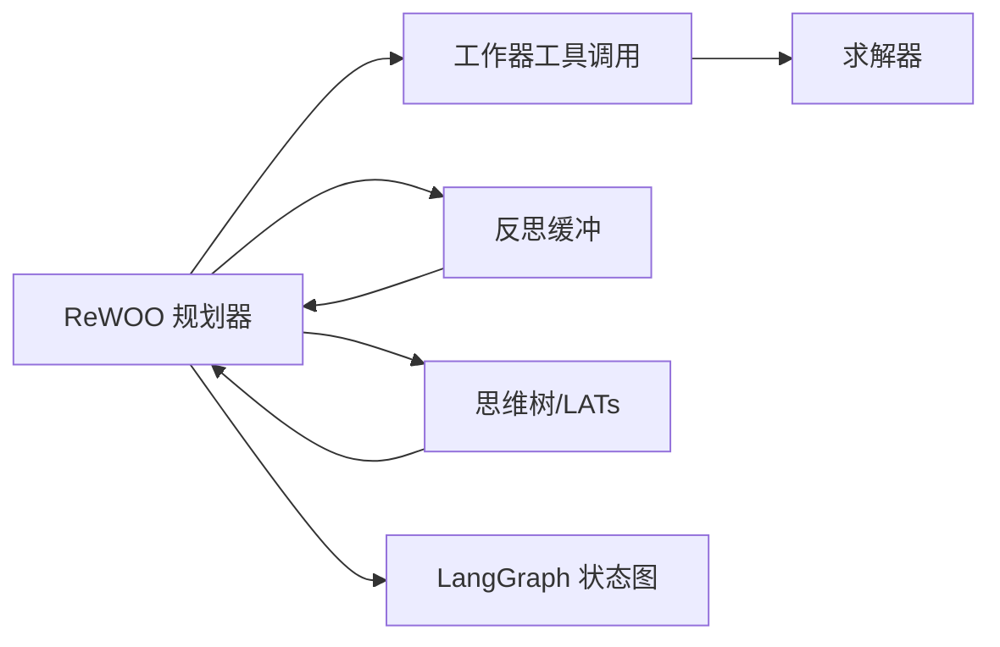

# 智能体循环基础

<cite>
**本文引用的文件**
- [site/figures-agents-alignment.js](file://site/figures-agents-alignment.js)
- [site/data.js](file://site/data.js)
- [site/vue-app/summary/src/data/content.js](file://site/vue-app/summary/src/data/content.js)
- [phases/14-agent-engineering/01-the-agent-loop/docs/README.md](file://phases/14-agent-engineering/01-the-agent-loop/docs/README.md)
- [phases/14-agent-engineering/01-the-agent-loop/code/agent_loop.py](file://phases/14-agent-engineering/01-the-agent-loop/code/agent_loop.py)
- [phases/14-agent-engineering/02-rewoo-plan-and-execute/docs/README.md](file://phases/14-agent-engineering/02-rewoo-plan-and-execute/docs/README.md)
- [phases/14-agent-engineering/02-rewoo-plan-and-execute/code/rewoo_planner.py](file://phases/14-agent-engineering/02-rewoo-plan-and-execute/code/rewoo_planner.py)
- [phases/14-agent-engineering/03-reflexion-verbal-rl/docs/README.md](file://phases/14-agent-engineering/03-reflexion-verbal-rl/docs/README.md)
- [phases/14-agent-engineering/03-reflexion-verbal-rl/code/reflexion_buffer.py](file://phases/14-agent-engineering/03-reflexion-verbal-rl/code/reflexion_buffer.py)
- [phases/14-agent-engineering/04-tree-of-thoughts-lats/docs/README.md](file://phases/14-agent-engineering/04-tree-of-thoughts-lats/docs/README.md)
- [phases/14-agent-engineering/04-tree-of-thoughts-lats/code/tree_of_thoughts.py](file://phases/14-agent-engineering/04-tree-of-thoughts-lats/code/tree_of_thoughts.py)
- [phases/14-agent-engineering/05-self-refine-and-critic/docs/README.md](file://phases/14-agent-engineering/05-self-refine-and-critic/docs/README.md)
- [phases/14-agent-engineering/06-tool-use-and-function-calling/docs/README.md](file://phases/14-agent-engineering/06-tool-use-and-function-calling/docs/README.md)
- [phases/14-agent-engineering/06-tool-use-and-function-calling/code/function_calling.py](file://phases/14-agent-engineering/06-tool-use-and-function-calling/code/function_calling.py)
- [phases/14-agent-engineering/07-memory-virtual-context-memgpt/docs/README.md](file://phases/14-agent-engineering/07-memory-virtual-context-memgpt/docs/README.md)
- [phases/14-agent-engineering/08-memory-blocks-sleep-time-compute/docs/README.md](file://phases/14-agent-engineering/08-memory-blocks-sleep-time-compute/docs/README.md)
- [phases/14-agent-engineering/09-hybrid-memory-mem0/docs/README.md](file://phases/14-agent-engineering/09-hybrid-memory-mem0/docs/README.md)
- [phases/14-agent-engineering/10-skill-libraries-voyager/docs/README.md](file://phases/14-agent-engineering/10-skill-libraries-voyager/docs/README.md)
- [phases/14-agent-engineering/11-planning-htn-and-evolutionary/docs/README.md](file://phases/14-agent-engineering/11-planning-htn-and-evolutionary/docs/README.md)
- [phases/14-agent-engineering/12-anthropic-workflow-patterns/docs/README.md](file://phases/14-agent-engineering/12-anthropic-workflow-patterns/docs/README.md)
- [phases/14-agent-engineering/13-langgraph-stateful-graphs/docs/README.md](file://phases/14-agent-engineering/13-langgraph-stateful-graphs/docs/README.md)
- [phases/14-agent-engineering/13-langgraph-stateful-graphs/code/langgraph_agent.py](file://phases/14-agent-engineering/13-langgraph-stateful-graphs/code/langgraph_agent.py)
- [phases/14-agent-engineering/14-autogen-actor-model/docs/README.md](file://phases/14-agent-engineering/14-autogen-actor-model/docs/README.md)
- [phases/14-agent-engineering/15-crewai-role-based-crews/docs/README.md](file://phases/14-agent-engineering/15-crewai-role-based-crews/docs/README.md)
- [phases/14-agent-engineering/16-openai-agents-sdk/docs/README.md](file://phases/14-agent-engineering/16-openai-agents-sdk/docs/README.md)
- [phases/14-agent-engineering/17-claude-agent-sdk/docs/README.md](file://phases/14-agent-engineering/17-claude-agent-sdk/docs/README.md)
- [phases/14-agent-engineering/18-agno-and-mastra-runtimes/docs/README.md](file://phases/14-agent-engineering/18-agno-and-mastra-runtimes/docs/README.md)
- [phases/14-agent-engineering/19-benchmarks-swebench-gaia/docs/README.md](file://phases/14-agent-engineering/19-benchmarks-swebench-gaia/docs/README.md)
- [phases/14-agent-engineering/20-benchmarks-webarena-osworld/docs/README.md](file://phases/14-agent-engineering/20-benchmarks-webarena-osworld/docs/README.md)
- [phases/14-agent-engineering/21-computer-use-agents/docs/README.md](file://phases/14-agent-engineering/21-computer-use-agents/docs/README.md)
- [phases/14-agent-engineering/22-voice-agents-pipecat-livekit/docs/README.md](file://phases/14-agent-engineering/22-voice-agents-pipecat-livekit/docs/README.md)
- [phases/14-agent-engineering/23-otel-genai-conventions/docs/README.md](file://phases/14-agent-engineering/23-otel-genai-conventions/docs/README.md)
- [phases/14-agent-engineering/24-agent-observability-platforms/docs/README.md](file://phases/14-agent-engineering/24-agent-observability-platforms/docs/README.md)
- [phases/14-agent-engineering/25-multi-agent-debate/docs/README.md](file://phases/14-agent-engineering/25-multi-agent-debate/docs/README.md)
- [phases/14-agent-engineering/26-failure-modes-agentic/docs/README.md](file://phases/14-agent-engineering/26-failure-modes-agentic/docs/README.md)
- [phases/14-agent-engineering/27-prompt-injection-defense/docs/README.md](file://phases/14-agent-engineering/27-prompt-injection-defense/docs/README.md)
- [phases/14-agent-engineering/28-orchestration-patterns/docs/README.md](file://phases/14-agent-engineering/28-orchestration-patterns/docs/README.md)
- [phases/14-agent-engineering/29-production-runtimes/docs/README.md](file://phases/14-agent-engineering/29-production-runtimes/docs/README.md)
- [phases/14-agent-engineering/30-eval-driven-agent-development/docs/README.md](file://phases/14-agent-engineering/30-eval-driven-agent-development/docs/README.md)
- [phases/14-agent-engineering/31-agent-workbench-why-models-fail/docs/README.md](file://phases/14-agent-engineering/31-agent-workbench-why-models-fail/docs/README.md)
- [phases/14-agent-engineering/32-minimal-agent-workbench/docs/README.md](file://phases/14-agent-engineering/32-minimal-agent-workbench/docs/README.md)
- [phases/14-agent-engineering/33-instructions-as-executable-constraints/docs/README.md](file://phases/14-agent-engineering/33-instructions-as-executable-constraints/docs/README.md)
- [phases/14-agent-engineering/34-repo-memory-and-state/docs/README.md](file://phases/14-agent-engineering/34-repo-memory-and-state/docs/README.md)
- [phases/14-agent-engineering/35-initialization-scripts/docs/README.md](file://phases/14-agent-engineering/35-initialization-scripts/docs/README.md)
- [phases/14-agent-engineering/36-scope-contracts/docs/README.md](file://phases/14-agent-engineering/36-scope-contracts/docs/README.md)
- [phases/14-agent-engineering/37-runtime-feedback-loops/docs/README.md](file://phases/14-agent-engineering/37-runtime-feedback-loops/docs/README.md)
- [phases/14-agent-engineering/38-verification-gates/docs/README.md](file://phases/14-agent-engineering/38-verification-gates/docs/README.md)
- [phases/14-agent-engineering/39-reviewer-agent/docs/README.md](file://phases/14-agent-engineering/39-reviewer-agent/docs/README.md)
- [phases/14-agent-engineering/40-multi-session-handoff/docs/README.md](file://phases/14-agent-engineering/40-multi-session-handoff/docs/README.md)
- [phases/14-agent-engineering/41-workbench-for-real-repos/docs/README.md](file://phases/14-agent-engineering/41-workbench-for-real-repos/docs/README.md)
- [phases/14-agent-engineering/42-agent-workbench-capstone/docs/README.md](file://phases/14-agent-engineering/42-agent-workbench-capstone/docs/README.md)
</cite>

## 目录
1. 引言
2. 项目结构
3. 核心组件
4. 架构总览
5. 详细组件分析
6. 依赖关系分析
7. 性能考虑
8. 故障排查指南
9. 结论
10. 附录

## 引言
本课程围绕“智能体循环基础”展开，系统讲解智能体的感知-思考-行动-观察闭环，以及在此基础上的高级推理与执行范式。重点覆盖：
- ReWOO（Reasoning with Outcome-Oriented）：先规划后执行的计划-执行范式，强调规划阶段不依赖观察、执行阶段并行获取证据、最终由求解器汇总。
- Reflexion（反思）：通过自我反思提升智能体性能，结合记忆缓冲与 TTL 去重策略。
- Tree of Thoughts（思维树）与 LATs（Latent Tree Search）：高级推理方法，探索多种推理路径以提升决策质量。
- 工具使用与函数调用：将外部能力接入智能体循环，形成可迭代的执行闭环。
- 多智能体与运行时：LangGraph、AutoGen、CrewAI 等框架下的状态机与编排模式。

## 项目结构
本仓库以“阶段-课程”的方式组织教学内容，智能体工程相关课程集中在第14阶段（Agent Engineering）。每个课程包含：
- docs/README.md：课程讲义与要点
- code/：配套代码实现
- outputs/：生成的技能文档或产物
- assets/：配套图示与资源
- notebook/：Jupyter 示例（部分课程）

下图给出与“智能体循环基础”直接相关的课程模块与文件分布概览：

图表来源
- [phases/14-agent-engineering/01-the-agent-loop/docs/README.md](file://phases/14-agent-engineering/01-the-agent-loop/docs/README.md)
- [phases/14-agent-engineering/02-rewoo-plan-and-execute/docs/README.md](file://phases/14-agent-engineering/02-rewoo-plan-and-execute/docs/README.md)
- [phases/14-agent-engineering/03-reflexion-verbal-rl/docs/README.md](file://phases/14-agent-engineering/03-reflexion-verbal-rl/docs/README.md)
- [phases/14-agent-engineering/04-tree-of-thoughts-lats/docs/README.md](file://phases/14-agent-engineering/04-tree-of-thoughts-lats/docs/README.md)
- [phases/14-agent-engineering/06-tool-use-and-function-calling/docs/README.md](file://phases/14-agent-engineering/06-tool-use-and-function-calling/docs/README.md)
- [phases/14-agent-engineering/13-langgraph-stateful-graphs/docs/README.md](file://phases/14-agent-engineering/13-langgraph-stateful-graphs/docs/README.md)

章节来源
- [phases/14-agent-engineering/01-the-agent-loop/docs/README.md](file://phases/14-agent-engineering/01-the-agent-loop/docs/README.md)
- [phases/14-agent-engineering/02-rewoo-plan-and-execute/docs/README.md](file://phases/14-agent-engineering/02-rewoo-plan-and-execute/docs/README.md)
- [phases/14-agent-engineering/03-reflexion-verbal-rl/docs/README.md](file://phases/14-agent-engineering/03-reflexion-verbal-rl/docs/README.md)
- [phases/14-agent-engineering/04-tree-of-thoughts-lats/docs/README.md](file://phases/14-agent-engineering/04-tree-of-thoughts-lats/docs/README.md)
- [phases/14-agent-engineering/06-tool-use-and-function-calling/docs/README.md](file://phases/14-agent-engineering/06-tool-use-and-function-calling/docs/README.md)
- [phases/14-agent-engineering/13-langgraph-stateful-graphs/docs/README.md](file://phases/14-agent-engineering/13-langgraph-stateful-graphs/docs/README.md)

## 核心组件
本节聚焦“智能体循环”的关键环节：感知、思考、行动、观察，并结合 ReWOO、Reflexion、思维树等方法，说明如何构建可迭代的闭环。

- 感知（Perception/Observation）
  - 从环境或工具返回中读取信息，作为下一步决策依据。
  - 在 ReWOO 中，规划阶段不依赖观察；执行阶段才真正读取证据。
- 思考（Reasoning/Planning）
  - 使用 ReWOO 的 Planner 生成可验证的计划 DAG；使用 Reflexion 维护反思缓冲；使用思维树探索多条推理路径。
- 行动（Action/Tool Use）
  - 通过函数调用或工具接口执行具体动作；支持并行执行以提升吞吐。
- 反思（Reflection）
  - 将失败或低效的轨迹写入反思缓冲，用于后续策略改进；结合 TTL 去重与作用域控制。

章节来源
- [site/figures-agents-alignment.js](file://site/figures-agents-alignment.js)
- [site/data.js](file://site/data.js)
- [site/vue-app/summary/src/data/content.js](file://site/vue-app/summary/src/data/content.js)
- [phases/14-agent-engineering/02-rewoo-plan-and-execute/docs/README.md](file://phases/14-agent-engineering/02-rewoo-plan-and-execute/docs/README.md)
- [phases/14-agent-engineering/03-reflexion-verbal-rl/docs/README.md](file://phases/14-agent-engineering/03-reflexion-verbal-rl/docs/README.md)
- [phases/14-agent-engineering/04-tree-of-thoughts-lats/docs/README.md](file://phases/14-agent-engineering/04-tree-of-thoughts-lats/docs/README.md)
- [phases/14-agent-engineering/06-tool-use-and-function-calling/docs/README.md](file://phases/14-agent-engineering/06-tool-use-and-function-calling/docs/README.md)

## 架构总览
下图展示了“智能体循环”的可视化流程，突出 THINK→ACT→OBSERVE 的闭环，以及 ReWOO、Reflexion、思维树等方法在不同阶段的集成点。

图表来源
- [site/figures-agents-alignment.js](file://site/figures-agents-alignment.js)
- [site/data.js](file://site/data.js)
- [site/vue-app/summary/src/data/content.js](file://site/vue-app/summary/src/data/content.js)
- [phases/14-agent-engineering/02-rewoo-plan-and-execute/docs/README.md](file://phases/14-agent-engineering/02-rewoo-plan-and-execute/docs/README.md)
- [phases/14-agent-engineering/03-reflexion-verbal-rl/docs/README.md](file://phases/14-agent-engineering/03-reflexion-verbal-rl/docs/README.md)
- [phases/14-agent-engineering/04-tree-of-thoughts-lats/docs/README.md](file://phases/14-agent-engineering/04-tree-of-thoughts-lats/docs/README.md)
- [phases/14-agent-engineering/06-tool-use-and-function-calling/docs/README.md](file://phases/14-agent-engineering/06-tool-use-and-function-calling/docs/README.md)

## 详细组件分析

### ReWOO（Reasoning with Outcome-Oriented）：先规划后执行
- 核心思想
  - Planner 在不看观察的情况下生成计划 DAG，明确步骤与依赖。
  - Workers 并行执行步骤，收集证据；Solver 汇总并得出结论。
  - 使用 #E1 等证据占位符，规划时未知前序输出，执行时再替换为真实值。
- 适用场景
  - 任务可分解且执行相对独立；需要高吞吐的证据收集与汇总。
- 成本与补救
  - 计划一次性定死，执行中遇到意外难以回溯调整。
  - 补救方案：Plan-and-Execute，在工作器返回错误时回过头修改计划。

图表来源
- [site/vue-app/summary/src/data/content.js](file://site/vue-app/summary/src/data/content.js)
- [phases/14-agent-engineering/02-rewoo-plan-and-execute/docs/README.md](file://phases/14-agent-engineering/02-rewoo-plan-and-execute/docs/README.md)

章节来源
- [site/vue-app/summary/src/data/content.js](file://site/vue-app/summary/src/data/content.js)
- [phases/14-agent-engineering/02-rewoo-plan-and-execute/docs/README.md](file://phases/14-agent-engineering/02-rewoo-plan-and-execute/docs/README.md)

### Reflexion（反思）：自我反思提升性能
- 核心思想
  - 维护一个带 TTL 的情节记忆缓冲区，记录失败或低效的轨迹。
  - 去重与作用域控制，避免无效重复；在后续思考中纳入反思，形成自修复闭环。
- 与 Verbal RL 的关系
  - 通过口头反思（Verbal RL）增强策略学习与稳定性。

图表来源
- [site/data.js](file://site/data.js)
- [phases/14-agent-engineering/03-reflexion-verbal-rl/docs/README.md](file://phases/14-agent-engineering/03-reflexion-verbal-rl/docs/README.md)

章节来源
- [site/data.js](file://site/data.js)
- [phases/14-agent-engineering/03-reflexion-verbal-rl/docs/README.md](file://phases/14-agent-engineering/03-reflexion-verbal-rl/docs/README.md)

### Tree of Thoughts（思维树）与 LATs（Latent Tree Search）
- 核心思想
  - 思维树：在多个推理分支上同时探索，选择最优路径。
  - Latent Tree Search：在潜在空间中进行树形搜索，提升复杂问题的解的质量。
- 与 ReWOO 的关系
  - 可在 ReWOO 的“思考”阶段引入 ToT/LATs，以更充分地探索推理路径，降低局部最优风险。

图表来源
- [phases/14-agent-engineering/04-tree-of-thoughts-lats/docs/README.md](file://phases/14-agent-engineering/04-tree-of-thoughts-lats/docs/README.md)
- [phases/14-agent-engineering/04-tree-of-thoughts-lats/code/tree_of_thoughts.py](file://phases/14-agent-engineering/04-tree-of-thoughts-lats/code/tree_of_thoughts.py)

章节来源
- [phases/14-agent-engineering/04-tree-of-thoughts-lats/docs/README.md](file://phases/14-agent-engineering/04-tree-of-thoughts-lats/docs/README.md)
- [phases/14-agent-engineering/04-tree-of-thoughts-lats/code/tree_of_thoughts.py](file://phases/14-agent-engineering/04-tree-of-thoughts-lats/code/tree_of_thoughts.py)

### 工具使用与函数调用：将外部能力接入循环
- 目标
  - 将工具/函数调用封装为智能体的“行动”，并在观察阶段读取返回结果。
- 关键点
  - 函数签名设计、参数校验、并发调用与错误处理。
  - 与 ReWOO 的 Planner 配合，将工具调用作为 DAG 的叶子节点。

图表来源
- [phases/14-agent-engineering/06-tool-use-and-function-calling/docs/README.md](file://phases/14-agent-engineering/06-tool-use-and-function-calling/docs/README.md)
- [phases/14-agent-engineering/06-tool-use-and-function-calling/code/function_calling.py](file://phases/14-agent-engineering/06-tool-use-and-function-calling/code/function_calling.py)

章节来源
- [phases/14-agent-engineering/06-tool-use-and-function-calling/docs/README.md](file://phases/14-agent-engineering/06-tool-use-and-function-calling/docs/README.md)
- [phases/14-agent-engineering/06-tool-use-and-function-calling/code/function_calling.py](file://phases/14-agent-engineering/06-tool-use-and-function-calling/code/function_calling.py)

### LangGraph 状态图：可迭代的状态机
- 核心思想
  - 使用状态图描述智能体的多轮对话与状态转换，便于可视化与调试。
  - 支持条件边、并行分支与回调逻辑，适配 ReWOO/Reflexion/思维树等范式。
- 实践建议
  - 将“思考/规划”“行动/工具调用”“观察/反思”映射为状态节点，用边表示控制流。

图表来源
- [phases/14-agent-engineering/13-langgraph-stateful-graphs/docs/README.md](file://phases/14-agent-engineering/13-langgraph-stateful-graphs/docs/README.md)
- [phases/14-agent-engineering/13-langgraph-stateful-graphs/code/langgraph_agent.py](file://phases/14-agent-engineering/13-langgraph-stateful-graphs/code/langgraph_agent.py)

章节来源
- [phases/14-agent-engineering/13-langgraph-stateful-graphs/docs/README.md](file://phases/14-agent-engineering/13-langgraph-stateful-graphs/docs/README.md)
- [phases/14-agent-engineering/13-langgraph-stateful-graphs/code/langgraph_agent.py](file://phases/14-agent-engineering/13-langgraph-stateful-graphs/code/langgraph_agent.py)

## 依赖关系分析
- 模块耦合
  - ReWOO 与工具调用强耦合：Planner 生成的 DAG 依赖工具接口；Workers 与 Solver 依赖工具返回格式。
  - Reflexion 与思考/规划弱耦合：通过反思缓冲影响下一轮思考，不改变执行路径。
  - 思维树与 ReWOO 可叠加：在思考阶段引入 ToT/LATs，提升规划质量。
- 外部依赖
  - 工具/函数调用依赖外部服务或本地脚本；需考虑超时、重试与错误传播。
  - LangGraph 依赖状态图定义与消息协议；需统一状态命名与转换规则。

图表来源
- [phases/14-agent-engineering/02-rewoo-plan-and-execute/docs/README.md](file://phases/14-agent-engineering/02-rewoo-plan-and-execute/docs/README.md)
- [phases/14-agent-engineering/03-reflexion-verbal-rl/docs/README.md](file://phases/14-agent-engineering/03-reflexion-verbal-rl/docs/README.md)
- [phases/14-agent-engineering/04-tree-of-thoughts-lats/docs/README.md](file://phases/14-agent-engineering/04-tree-of-thoughts-lats/docs/README.md)
- [phases/14-agent-engineering/13-langgraph-stateful-graphs/docs/README.md](file://phases/14-agent-engineering/13-langgraph-stateful-graphs/docs/README.md)

章节来源
- [phases/14-agent-engineering/02-rewoo-plan-and-execute/docs/README.md](file://phases/14-agent-engineering/02-rewoo-plan-and-execute/docs/README.md)
- [phases/14-agent-engineering/03-reflexion-verbal-rl/docs/README.md](file://phases/14-agent-engineering/03-reflexion-verbal-rl/docs/README.md)
- [phases/14-agent-engineering/04-tree-of-thoughts-lats/docs/README.md](file://phases/14-agent-engineering/04-tree-of-thoughts-lats/docs/README.md)
- [phases/14-agent-engineering/13-langgraph-stateful-graphs/docs/README.md](file://phases/14-agent-engineering/13-langgraph-stateful-graphs/docs/README.md)

## 性能考虑
- 并行执行
  - ReWOO 的 Workers 应尽量并行化，减少端到端延迟。
- 缓冲与去重
  - Reflexion 的反思缓冲应设置合理 TTL，避免过期数据污染；去重策略减少冗余。
- 推理深度与剪枝
  - ToT/LATs 的分支扩展需配合剪枝策略，避免指数爆炸。
- 工具调用开销
  - 对外部工具调用增加超时与重试；对批量调用进行分批与合并。
- 状态图可观测性
  - 使用 LangGraph 的状态图可视化与日志追踪，定位瓶颈。

## 故障排查指南
- ReWOO 执行失败
  - 检查 Planner 生成的 DAG 是否正确；确认 #E 占位符在执行阶段被替换。
  - 核对 Workers 的输入参数与工具接口一致性。
- 反思未生效
  - 确认反思缓冲的 TTL 未过期、去重策略未误删有效样本。
  - 检查下一轮思考是否正确读取反思缓冲。
- 思维树无进展
  - 检查分支扩展策略与评分/剪枝阈值；适当降低分支数或增加启发式约束。
- 工具调用异常
  - 增加重试与熔断；记录调用耗时与错误码；必要时降级为串行执行。
- 状态图卡住
  - 检查状态转换条件与消息格式；确保每轮都有明确的下一步。

章节来源
- [site/vue-app/summary/src/data/content.js](file://site/vue-app/summary/src/data/content.js)
- [phases/14-agent-engineering/02-rewoo-plan-and-execute/docs/README.md](file://phases/14-agent-engineering/02-rewoo-plan-and-execute/docs/README.md)
- [phases/14-agent-engineering/03-reflexion-verbal-rl/docs/README.md](file://phases/14-agent-engineering/03-reflexion-verbal-rl/docs/README.md)
- [phases/14-agent-engineering/04-tree-of-thoughts-lats/docs/README.md](file://phases/14-agent-engineering/04-tree-of-thoughts-lats/docs/README.md)
- [phases/14-agent-engineering/06-tool-use-and-function-calling/docs/README.md](file://phases/14-agent-engineering/06-tool-use-and-function-calling/docs/README.md)
- [phases/14-agent-engineering/13-langgraph-stateful-graphs/docs/README.md](file://phases/14-agent-engineering/13-langgraph-stateful-graphs/docs/README.md)

## 结论
- 智能体循环的基础在于“感知-思考-行动-观察”的闭环，ReWOO、Reflexion、思维树等方法提供了不同的优化路径。
- ReWOO 适合可分解的任务，强调规划与并行执行；Reflexion 通过反思缓冲持续改进；ToT/LATs 则在思考阶段引入更广的探索。
- 工具与函数调用是连接智能体与外部世界的关键；LangGraph 等状态图工具有助于构建可维护的可迭代循环。
- 实战中应结合性能与可靠性需求，选择合适的范式组合，并建立完善的可观测性与故障排查体系。

## 附录
- 课程索引与对应文件
  - 01-智能体循环：[phases/14-agent-engineering/01-the-agent-loop/docs/README.md](file://phases/14-agent-engineering/01-the-agent-loop/docs/README.md)，[phases/14-agent-engineering/01-the-agent-loop/code/agent_loop.py](file://phases/14-agent-engineering/01-the-agent-loop/code/agent_loop.py)
  - 02-ReWOO 计划与执行：[phases/14-agent-engineering/02-rewoo-plan-and-execute/docs/README.md](file://phases/14-agent-engineering/02-rewoo-plan-and-execute/docs/README.md)，[phases/14-agent-engineering/02-rewoo-plan-and-execute/code/rewoo_planner.py](file://phases/14-agent-engineering/02-rewoo-plan-and-execute/code/rewoo_planner.py)
  - 03-反思（Reflexion）：[phases/14-agent-engineering/03-reflexion-verbal-rl/docs/README.md](file://phases/14-agent-engineering/03-reflexion-verbal-rl/docs/README.md)，[phases/14-agent-engineering/03-reflexion-verbal-rl/code/reflexion_buffer.py](file://phases/14-agent-engineering/03-reflexion-verbal-rl/code/reflexion_buffer.py)
  - 04-思维树/LATs：[phases/14-agent-engineering/04-tree-of-thoughts-lats/docs/README.md](file://phases/14-agent-engineering/04-tree-of-thoughts-lats/docs/README.md)，[phases/14-agent-engineering/04-tree-of-thoughts-lats/code/tree_of_thoughts.py](file://phases/14-agent-engineering/04-tree-of-thoughts-lats/code/tree_of_thoughts.py)
  - 06-工具与函数调用：[phases/14-agent-engineering/06-tool-use-and-function-calling/docs/README.md](file://phases/14-agent-engineering/06-tool-use-and-function-calling/docs/README.md)，[phases/14-agent-engineering/06-tool-use-and-function-calling/code/function_calling.py](file://phases/14-agent-engineering/06-tool-use-and-function-calling/code/function_calling.py)
  - 13-LangGraph 状态图：[phases/14-agent-engineering/13-langgraph-stateful-graphs/docs/README.md](file://phases/14-agent-engineering/13-langgraph-stateful-graphs/docs/README.md)，[phases/14-agent-engineering/13-langgraph-stateful-graphs/code/langgraph_agent.py](file://phases/14-agent-engineering/13-langgraph-stateful-graphs/code/langgraph_agent.py)