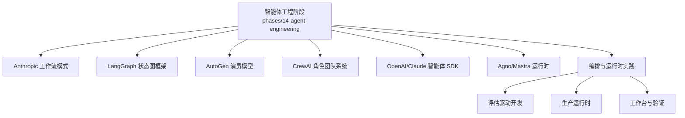
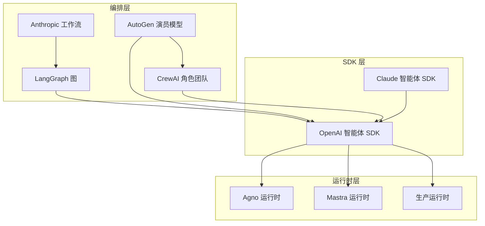
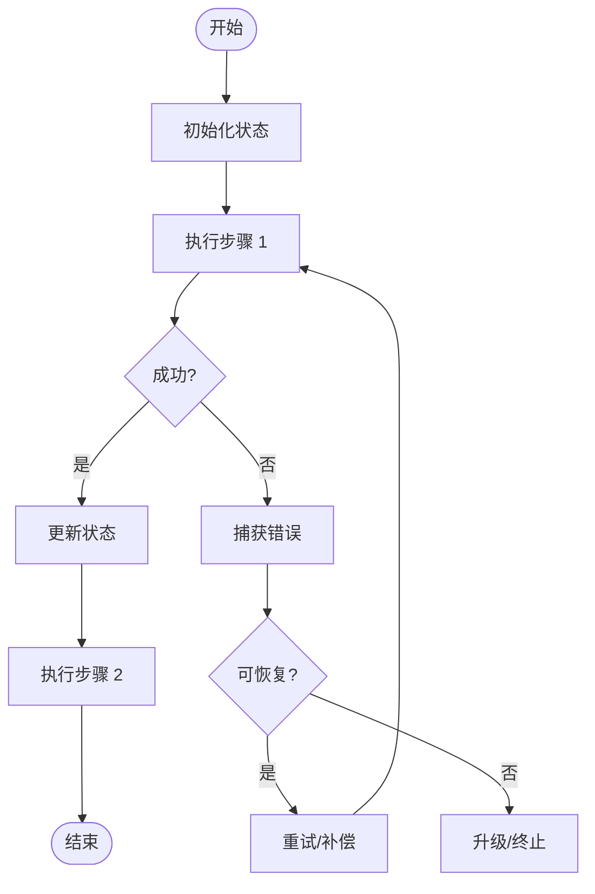
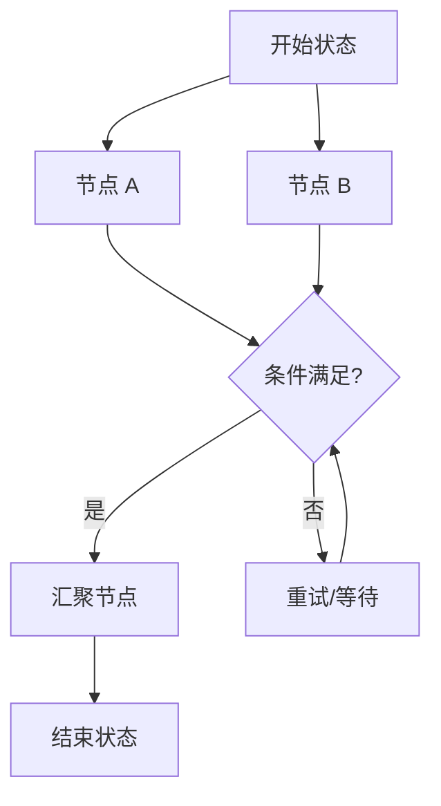
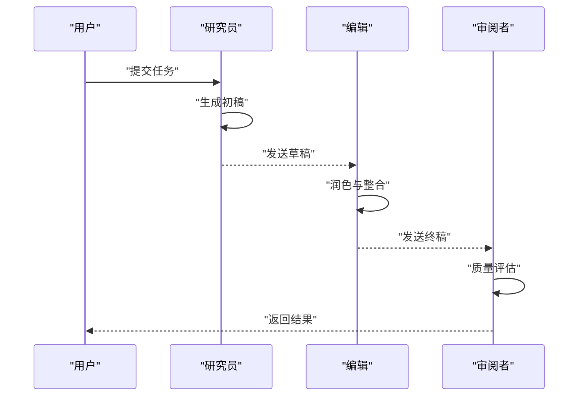
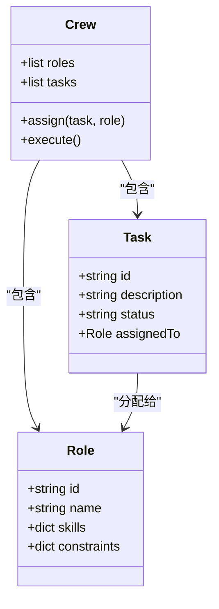
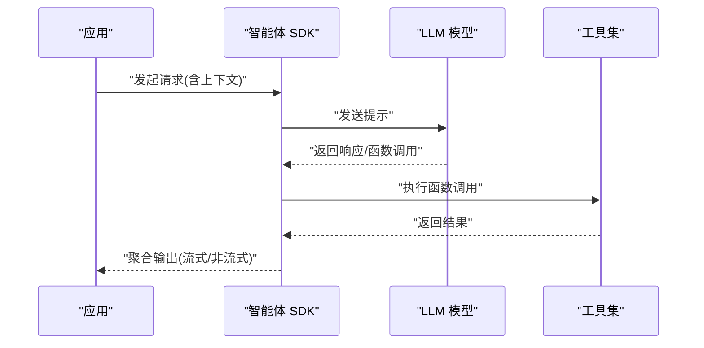
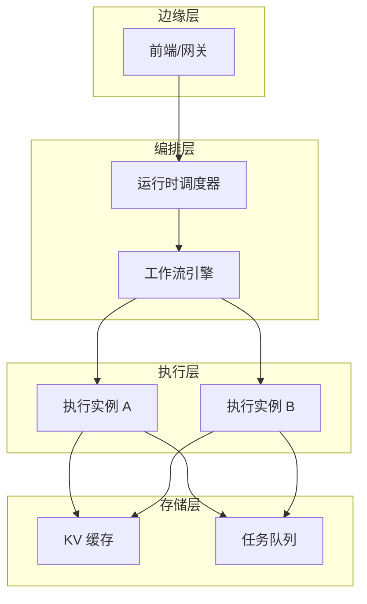
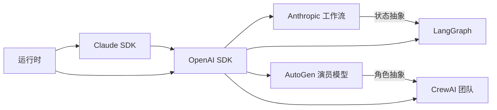

# 智能体框架对比

<cite>
**本文引用的文件**
- [phases/14-agent-engineering/README.md](file://phases/14-agent-engineering/README.md)
- [phases/14-agent-engineering/12-anthropic-workflow-patterns/docs/anthropic-workflow-patterns.md](file://phases/14-agent-engineering/12-anthropic-workflow-patterns/docs/anthropic-workflow-patterns.md)
- [phases/14-agent-engineering/12-anthropic-workflow-patterns/code/anthropic-workflow-patterns.py](file://phases/14-agent-engineering/12-anthropic-workflow-patterns/code/anthropic-workflow-patterns.py)
- [phases/14-agent-engineering/13-langgraph-stateful-graphs/docs/langgraph-stateful-graphs.md](file://phases/14-agent-engineering/13-langgraph-stateful-graphs/docs/langgraph-stateful-graphs.md)
- [phases/14-agent-engineering/13-langgraph-stateful-graphs/code/langgraph-stateful-graphs.py](file://phases/14-agent-engineering/13-langgraph-stateful-graphs/code/langgraph-stateful-graphs.py)
- [phases/14-agent-engineering/14-autogen-actor-model/docs/autogen-actor-model.md](file://phases/14-agent-engineering/14-autogen-actor-model/docs/autogen-actor-model.md)
- [phases/14-agent-engineering/14-autogen-actor-model/code/autogen-actor-model.py](file://phases/14-agent-engineering/14-autogen-actor-model/code/autogen-actor-model.py)
- [phases/14-agent-engineering/15-crewai-role-based-crews/docs/crewai-role-based-crews.md](file://phases/14-agent-engineering/15-crewai-role-based-crews/docs/crewai-role-based-crews.md)
- [phases/14-agent-engineering/15-crewai-role-based-crews/code/crewai-role-based-crews.py](file://phases/14-agent-engineering/15-crewai-role-based-crews/code/crewai-role-based-crews.py)
- [phases/14-agent-engineering/16-openai-agents-sdk/docs/openai-agents-sdk.md](file://phases/14-agent-engineering/16-openai-agents-sdk/docs/openai-agents-sdk.md)
- [phases/14-agent-engineering/16-openai-agents-sdk/code/openai-agents-sdk.py](file://phases/14-agent-engineering/16-openai-agents-sdk/code/openai-agents-sdk.py)
- [phases/14-agent-engineering/17-claude-agent-sdk/docs/claude-agent-sdk.md](file://phases/14-agent-engineering/17-claude-agent-sdk/docs/claude-agent-sdk.md)
- [phases/14-agent-engineering/17-claude-agent-sdk/code/claude-agent-sdk.py](file://phases/14-agent-engineering/17-claude-agent-sdk/code/claude-agent-sdk.py)
- [phases/14-agent-engineering/18-agno-and-mastra-runtimes/docs/agno-and-mastra-runtimes.md](file://phases/14-agent-engineering/18-agno-and-mastra-runtimes/docs/agno-and-mastra-runtimes.md)
- [phases/14-agent-engineering/18-agno-and-mastra-runtimes/code/agno-and-mastra-runtimes.py](file://phases/14-agent-engineering/18-agno-and-mastra-runtimes/code/agno-and-mastra-runtimes.py)
- [phases/14-agent-engineering/28-orchestration-patterns/docs/orchestration-patterns.md](file://phases/14-agent-engineering/28-orchestration-patterns/docs/orchestration-patterns.md)
- [phases/14-agent-engineering/29-production-runtimes/docs/production-runtimes.md](file://phases/14-agent-engineering/29-production-runtimes/docs/production-runtimes.md)
- [phases/14-agent-engineering/30-eval-driven-agent-development/docs/eval-driven-agent-development.md](file://phases/14-agent-engineering/30-eval-driven-agent-development/docs/eval-driven-agent-development.md)
- [phases/14-agent-engineering/31-agent-workbench-why-models-fail/docs/agent-workbench-why-models-fail.md](file://phases/14-agent-engineering/31-agent-workbench-why-models-fail/docs/agent-workbench-why-models-fail.md)
- [phases/14-agent-engineering/32-minimal-agent-workbench/docs/minimal-agent-workbench.md](file://phases/14-agent-engineering/32-minimal-agent-workbench/docs/minimal-agent-workbench.md)
- [phases/14-agent-engineering/33-instructions-as-executable-constraints/docs/instructions-as-executable-constraints.md](file://phases/14-agent-engineering/33-instructions-as-executable-constraints/docs/instructions-as-executable-constraints.md)
- [phases/14-agent-engineering/34-repo-memory-and-state/docs/repo-memory-and-state.md](file://phases/14-agent-engineering/34-repo-memory-and-state/docs/repo-memory-and-state.md)
- [phases/14-agent-engineering/35-initialization-scripts/docs/initialization-scripts.md](file://phases/14-agent-engineering/35-initialization-scripts/docs/initialization-scripts.md)
- [phases/14-agent-engineering/36-scope-contracts/docs/scope-contracts.md](file://phases/14-agent-engineering/36-scope-contracts/docs/scope-contracts.md)
- [phases/14-agent-engineering/37-runtime-feedback-loops/docs/runtime-feedback-loops.md](file://phases/14-agent-engineering/37-runtime-feedback-loops/docs/runtime-feedback-loops.md)
- [phases/14-agent-engineering/38-verification-gates/docs/verification-gates.md](file://phases/14-agent-engineering/38-verification-gates/docs/verification-gates.md)
- [phases/14-agent-engineering/39-reviewer-agent/docs/reviewer-agent.md](file://phases/14-agent-engineering/39-reviewer-agent/docs/reviewer-agent.md)
- [phases/14-agent-engineering/40-multi-session-handoff/docs/multi-session-handoff.md](file://phases/14-agent-engineering/40-multi-session-handoff/docs/multi-session-handoff.md)
- [phases/14-agent-engineering/41-workbench-for-real-repos/docs/workbench-for-real-repos.md](file://phases/14-agent-engineering/41-workbench-for-real-repos/docs/workbench-for-real-repos.md)
- [phases/14-agent-engineering/42-agent-workbench-capstone/docs/agent-workbench-capstone.md](file://phases/14-agent-engineering/42-agent-workbench-capstone/docs/agent-workbench-capstone.md)
</cite>

## 目录
1. [引言](#引言)
2. [项目结构](#项目结构)
3. [核心组件](#核心组件)
4. [架构总览](#架构总览)
5. [详细组件分析](#详细组件分析)
6. [依赖关系分析](#依赖关系分析)
7. [性能考量](#性能考量)
8. [故障排查指南](#故障排查指南)
9. [结论](#结论)
10. [附录](#附录)

## 引言
本文件面向“智能体框架对比”课程，系统梳理并对比以下主流智能体与多智能体框架：Anthropic 工作流模式、LangGraph 状态图框架、AutoGen 演员模型、CrewAI 基于角色的团队系统；同时介绍 OpenAI 与 Claude 的智能体 SDK、Agno 与 Mastra 运行时系统，并提供框架选型指南与迁移策略，帮助开发者在不同业务目标下做出合理选择。

## 项目结构
该仓库以“阶段化学习路径”的方式组织内容，其中第 14 阶段“智能体工程”覆盖了从基础循环到高级运行时的完整知识体系。本次文档聚焦于以下主题模块：
- Anthropic 工作流模式（任务编排、状态管理、错误恢复）
- LangGraph 状态图框架（DAG 设计、状态转换、并发处理）
- AutoGen 演员模型（角色分配、对话管理、协作策略）
- CrewAI 基于角色的团队系统（角色定义、任务分配、团队协调）
- OpenAI 与 Claude 智能体 SDK（功能特性与使用场景）
- Agno 与 Mastra 运行时系统（部署架构、性能优化、扩展能力）

**章节来源**
- [phases/14-agent-engineering/README.md](file://phases/14-agent-engineering/README.md)

## 核心组件
本节概述各框架的关键抽象与职责边界，便于快速建立整体认知。

- Anthropic 工作流模式
  - 关注任务编排、状态持久化与错误恢复，强调可解释性与可控性。
  - 典型流程：接收输入 → 初始化状态 → 执行步骤 → 更新状态 → 处理异常 → 决策是否重试或终止。

- LangGraph 状态图框架
  - 使用有向无环图（DAG）表达状态与转换，支持并发节点与条件分支。
  - 关键点：状态键设计、边条件判断、并发执行与合并策略。

- AutoGen 演员模型
  - 基于角色的多智能体协作，强调对话管理与角色分工。
  - 关键点：角色定义、消息路由、会话控制、工具调用与反馈闭环。

- CrewAI 团队系统
  - 以角色为中心的团队编排，强调任务分解与团队协调。
  - 关键点：角色职责、任务分配、进度跟踪、质量门禁与评审。

- OpenAI/Claude 智能体 SDK
  - 提供标准化的智能体构建接口与工具集成能力。
  - 关键点：会话上下文、函数调用、流式输出、可观测性与安全控制。

- Agno/Mastra 运行时
  - 面向生产的运行时系统，关注部署、性能与扩展。
  - 关键点：服务架构、缓存与批处理、弹性伸缩、监控与告警。

**章节来源**
- [phases/14-agent-engineering/12-anthropic-workflow-patterns/docs/anthropic-workflow-patterns.md](file://phases/14-agent-engineering/12-anthropic-workflow-patterns/docs/anthropic-workflow-patterns.md)
- [phases/14-agent-engineering/13-langgraph-stateful-graphs/docs/langgraph-stateful-graphs.md](file://phases/14-agent-engineering/13-langgraph-stateful-graphs/docs/langgraph-stateful-graphs.md)
- [phases/14-agent-engineering/14-autogen-actor-model/docs/autogen-actor-model.md](file://phases/14-agent-engineering/14-autogen-actor-model/docs/autogen-actor-model.md)
- [phases/14-agent-engineering/15-crewai-role-based-crews/docs/crewai-role-based-crews.md](file://phases/14-agent-engineering/15-crewai-role-based-crews/docs/crewai-role-based-crews.md)
- [phases/14-agent-engineering/16-openai-agents-sdk/docs/openai-agents-sdk.md](file://phases/14-agent-engineering/16-openai-agents-sdk/docs/openai-agents-sdk.md)
- [phases/14-agent-engineering/17-claude-agent-sdk/docs/claude-agent-sdk.md](file://phases/14-agent-engineering/17-claude-agent-sdk/docs/claude-agent-sdk.md)
- [phases/14-agent-engineering/18-agno-and-mastra-runtimes/docs/agno-and-mastra-runtimes.md](file://phases/14-agent-engineering/18-agno-and-mastra-runtimes/docs/agno-and-mastra-runtimes.md)

## 架构总览
下图展示了各框架在“任务编排—状态管理—错误恢复—运行时”维度上的抽象与交互关系。

**图表来源**
- [phases/14-agent-engineering/12-anthropic-workflow-patterns/docs/anthropic-workflow-patterns.md](file://phases/14-agent-engineering/12-anthropic-workflow-patterns/docs/anthropic-workflow-patterns.md)
- [phases/14-agent-engineering/13-langgraph-stateful-graphs/docs/langgraph-stateful-graphs.md](file://phases/14-agent-engineering/13-langgraph-stateful-graphs/docs/langgraph-stateful-graphs.md)
- [phases/14-agent-engineering/14-autogen-actor-model/docs/autogen-actor-model.md](file://phases/14-agent-engineering/14-autogen-actor-model/docs/autogen-actor-model.md)
- [phases/14-agent-engineering/15-crewai-role-based-crews/docs/crewai-role-based-crews.md](file://phases/14-agent-engineering/15-crewai-role-based-crews/docs/crewai-role-based-crews.md)
- [phases/14-agent-engineering/16-openai-agents-sdk/docs/openai-agents-sdk.md](file://phases/14-agent-engineering/16-openai-agents-sdk/docs/openai-agents-sdk.md)
- [phases/14-agent-engineering/17-claude-agent-sdk/docs/claude-agent-sdk.md](file://phases/14-agent-engineering/17-claude-agent-sdk/docs/claude-agent-sdk.md)
- [phases/14-agent-engineering/18-agno-and-mastra-runtimes/docs/agno-and-mastra-runtimes.md](file://phases/14-agent-engineering/18-agno-and-mastra-runtimes/docs/agno-and-mastra-runtimes.md)

## 详细组件分析

### Anthropic 工作流模式
- 任务编排
  - 将复杂任务拆解为可追踪的步骤，每个步骤具备明确输入/输出与前置条件。
  - 支持条件分支与回滚点，确保流程可中断与可恢复。
- 状态管理
  - 使用结构化状态对象保存中间结果，便于跨步骤共享与审计。
  - 状态键命名规范与版本兼容策略。
- 错误恢复
  - 定义异常类型与恢复策略（重试、降级、人工介入）。
  - 记录失败原因与补偿动作，形成闭环。

**图表来源**
- [phases/14-agent-engineering/12-anthropic-workflow-patterns/docs/anthropic-workflow-patterns.md](file://phases/14-agent-engineering/12-anthropic-workflow-patterns/docs/anthropic-workflow-patterns.md)

**章节来源**
- [phases/14-agent-engineering/12-anthropic-workflow-patterns/docs/anthropic-workflow-patterns.md](file://phases/14-agent-engineering/12-anthropic-workflow-patterns/docs/anthropic-workflow-patterns.md)
- [phases/14-agent-engineering/12-anthropic-workflow-patterns/code/anthropic-workflow-patterns.py](file://phases/14-agent-engineering/12-anthropic-workflow-patterns/code/anthropic-workflow-patterns.py)

### LangGraph 状态图框架
- DAG 设计
  - 节点表示状态与处理逻辑，边表示状态转换与触发条件。
  - 通过状态键聚合数据，避免全局共享状态引发竞态。
- 状态转换
  - 条件边实现分支与汇聚，支持并行节点与合并策略。
  - 转换函数负责读取状态、执行计算、写回新状态。
- 并发处理
  - 并行节点提升吞吐，需注意资源竞争与一致性。
  - 合并策略（如优先级、去重、冲突解决）保障最终一致性。

**图表来源**
- [phases/14-agent-engineering/13-langgraph-stateful-graphs/docs/langgraph-stateful-graphs.md](file://phases/14-agent-engineering/13-langgraph-stateful-graphs/docs/langgraph-stateful-graphs.md)

**章节来源**
- [phases/14-agent-engineering/13-langgraph-stateful-graphs/docs/langgraph-stateful-graphs.md](file://phases/14-agent-engineering/13-langgraph-stateful-graphs/docs/langgraph-stateful-graphs.md)
- [phases/14-agent-engineering/13-langgraph-stateful-graphs/code/langgraph-stateful-graphs.py](file://phases/14-agent-engineering/13-langgraph-stateful-graphs/code/langgraph-stateful-graphs.py)

### AutoGen 演员模型
- 角色分配
  - 明确角色职责（如研究者、编辑、审阅者），减少重复与遗漏。
  - 角色模板化与参数化，便于复用与定制。
- 对话管理
  - 基于消息轮次的上下文维护，支持多轮对话与历史摘要。
  - 消息路由规则（广播、单播、组播）决定信息流向。
- 协作策略
  - 会话控制（开始/结束/暂停）、工具调用与结果汇总。
  - 反馈闭环（评分、校正、迭代）提升产出质量。

**图表来源**
- [phases/14-agent-engineering/14-autogen-actor-model/docs/autogen-actor-model.md](file://phases/14-agent-engineering/14-autogen-actor-model/docs/autogen-actor-model.md)

**章节来源**
- [phases/14-agent-engineering/14-autogen-actor-model/docs/autogen-actor-model.md](file://phases/14-agent-engineering/14-autogen-actor-model/docs/autogen-actor-model.md)
- [phases/14-agent-engineering/14-autogen-actor-model/code/autogen-actor-model.py](file://phases/14-agent-engineering/14-autogen-actor-model/code/autogen-actor-model.py)

### CrewAI 基于角色的团队系统
- 角色定义
  - 明确角色能力、偏好与约束，作为任务分配依据。
  - 角色间依赖关系与技能匹配度影响调度效率。
- 任务分配
  - 基于角色可用性与任务优先级进行动态分配。
  - 支持手动干预与重分配，保证关键路径不阻塞。
- 团队协调
  - 进度可视化与里程碑管理，及时发现偏差。
  - 质量门禁与评审流程，确保交付物符合标准。

**图表来源**
- [phases/14-agent-engineering/15-crewai-role-based-crews/docs/crewai-role-based-crews.md](file://phases/14-agent-engineering/15-crewai-role-based-crews/docs/crewai-role-based-crews.md)

**章节来源**
- [phases/14-agent-engineering/15-crewai-role-based-crews/docs/crewai-role-based-crews.md](file://phases/14-agent-engineering/15-crewai-role-based-crews/docs/crewai-role-based-crews.md)
- [phases/14-agent-engineering/15-crewai-role-based-crews/code/crewai-role-based-crews.py](file://phases/14-agent-engineering/15-crewai-role-based-crews/code/crewai-role-based-crews.py)

### OpenAI 与 Claude 智能体 SDK
- 功能特性
  - 会话上下文管理、函数调用与工具集成、流式输出与事件回调。
  - 安全控制（提示注入检测、内容过滤）、可观测性（日志、指标、追踪）。
- 使用场景
  - OpenAI SDK 更适合通用对话与工具调用；Claude SDK 在长文本与结构化输出方面优势明显。
  - 结合 LangGraph/AutoGen/CrewAI 构建端到端智能体应用。

**图表来源**
- [phases/14-agent-engineering/16-openai-agents-sdk/docs/openai-agents-sdk.md](file://phases/14-agent-engineering/16-openai-agents-sdk/docs/openai-agents-sdk.md)
- [phases/14-agent-engineering/17-claude-agent-sdk/docs/claude-agent-sdk.md](file://phases/14-agent-engineering/17-claude-agent-sdk/docs/claude-agent-sdk.md)

**章节来源**
- [phases/14-agent-engineering/16-openai-agents-sdk/docs/openai-agents-sdk.md](file://phases/14-agent-engineering/16-openai-agents-sdk/docs/openai-agents-sdk.md)
- [phases/14-agent-engineering/16-openai-agents-sdk/code/openai-agents-sdk.py](file://phases/14-agent-engineering/16-openai-agents-sdk/code/openai-agents-sdk.py)
- [phases/14-agent-engineering/17-claude-agent-sdk/docs/claude-agent-sdk.md](file://phases/14-agent-engineering/17-claude-agent-sdk/docs/claude-agent-sdk.md)
- [phases/14-agent-engineering/17-claude-agent-sdk/code/claude-agent-sdk.py](file://phases/14-agent-engineering/17-claude-agent-sdk/code/claude-agent-sdk.py)

### Agno 与 Mastra 运行时系统
- 部署架构
  - 微服务化与容器化，支持水平扩展与灰度发布。
  - 缓存层（热点数据）与批处理队列（低优先级任务）分离。
- 性能优化
  - KV 缓存与语义缓存结合，降低重复计算成本。
  - 流水线并行与异步任务调度，提高吞吐。
- 扩展能力
  - 插件化工具注册与版本管理，支持第三方扩展。
  - 监控与告警体系，保障线上稳定性。

**图表来源**
- [phases/14-agent-engineering/18-agno-and-mastra-runtimes/docs/agno-and-mastra-runtimes.md](file://phases/14-agent-engineering/18-agno-and-mastra-runtimes/docs/agno-and-mastra-runtimes.md)

**章节来源**
- [phases/14-agent-engineering/18-agno-and-mastra-runtimes/docs/agno-and-mastra-runtimes.md](file://phases/14-agent-engineering/18-agno-and-mastra-runtimes/docs/agno-and-mastra-runtimes.md)
- [phases/14-agent-engineering/18-agno-and-mastra-runtimes/code/agno-and-mastra-runtimes.py](file://phases/14-agent-engineering/18-agno-and-mastra-runtimes/code/agno-and-mastra-runtimes.py)

## 依赖关系分析
- 组件耦合
  - Anthropic 工作流与 LangGraph 在“状态管理”层面存在互补：前者强调可控性与可解释性，后者强调图结构与并发。
  - AutoGen 与 CrewAI 在“角色与任务”层面互补：前者强调对话与协作，后者强调团队与进度。
  - OpenAI/Claude SDK 作为统一接入层，向上游编排与运行时提供一致的接口。
- 外部依赖
  - LLM 服务、工具注册中心、缓存与队列系统。
  - 监控与日志平台，用于可观测性与问题定位。

**图表来源**
- [phases/14-agent-engineering/12-anthropic-workflow-patterns/docs/anthropic-workflow-patterns.md](file://phases/14-agent-engineering/12-anthropic-workflow-patterns/docs/anthropic-workflow-patterns.md)
- [phases/14-agent-engineering/13-langgraph-stateful-graphs/docs/langgraph-stateful-graphs.md](file://phases/14-agent-engineering/13-langgraph-stateful-graphs/docs/langgraph-stateful-graphs.md)
- [phases/14-agent-engineering/14-autogen-actor-model/docs/autogen-actor-model.md](file://phases/14-agent-engineering/14-autogen-actor-model/docs/autogen-actor-model.md)
- [phases/14-agent-engineering/15-crewai-role-based-crews/docs/crewai-role-based-crews.md](file://phases/14-agent-engineering/15-crewai-role-based-crews/docs/crewai-role-based-crews.md)
- [phases/14-agent-engineering/16-openai-agents-sdk/docs/openai-agents-sdk.md](file://phases/14-agent-engineering/16-openai-agents-sdk/docs/openai-agents-sdk.md)
- [phases/14-agent-engineering/17-claude-agent-sdk/docs/claude-agent-sdk.md](file://phases/14-agent-engineering/17-claude-agent-sdk/docs/claude-agent-sdk.md)
- [phases/14-agent-engineering/18-agno-and-mastra-runtimes/docs/agno-and-mastra-runtimes.md](file://phases/14-agent-engineering/18-agno-and-mastra-runtimes/docs/agno-and-mastra-runtimes.md)

## 性能考量
- 编排层
  - 减少状态键数量与层级深度，避免过度耦合。
  - 利用条件边与短路逻辑，缩短关键路径。
- 执行层
  - 并行节点与批处理结合，平衡延迟与吞吐。
  - 合理设置超时与重试退避，防止级联故障。
- 运行时
  - 缓存热点查询与工具调用结果，降低 LLM 调用频率。
  - 异步任务与后台批处理分离，保障实时性。

## 故障排查指南
- 常见问题
  - 状态未更新：检查状态键命名与写回逻辑。
  - 死锁/活锁：审查并发节点与合并策略。
  - 角色冲突：核对角色权限与任务依赖。
  - 工具调用失败：确认工具注册与鉴权配置。
- 排查步骤
  - 开启细粒度日志与追踪 ID，定位失败节点。
  - 快照关键状态，回放最小化路径复现问题。
  - 分离缓存与队列，验证数据一致性。

**章节来源**
- [phases/14-agent-engineering/28-orchestration-patterns/docs/orchestration-patterns.md](file://phases/14-agent-engineering/28-orchestration-patterns/docs/orchestration-patterns.md)
- [phases/14-agent-engineering/29-production-runtimes/docs/production-runtimes.md](file://phases/14-agent-engineering/29-production-runtimes/docs/production-runtimes.md)
- [phases/14-agent-engineering/30-eval-driven-agent-development/docs/eval-driven-agent-development.md](file://phases/14-agent-engineering/30-eval-driven-agent-development/docs/eval-driven-agent-development.md)

## 结论
- 若追求可控性与可解释性，优先考虑 Anthropic 工作流模式。
- 若需要灵活的图结构编排与并发，LangGraph 是理想选择。
- 若强调角色与对话协作，AutoGen 与 CrewAI 各有所长，可按场景组合使用。
- OpenAI/Claude SDK 提供统一接入与可观测能力，适合作为运行时的通用底座。
- Agno/Mastra 运行时适合生产级部署，关注缓存、批处理与弹性伸缩。

## 附录
- 实践建议
  - 评估阶段：先用 SDK 快速原型，再引入编排与运行时。
  - 迭代阶段：以评估驱动开发为核心，持续优化编排与运行时。
  - 生产阶段：以生产运行时为基座，结合监控与告警体系保障稳定。
- 迁移策略
  - 从 SDK 到编排：逐步将函数调用封装为节点，引入状态键与条件边。
  - 从编排到运行时：抽象通用节点与工具，统一接入 SDK，启用缓存与批处理。
  - 从运行时到生产：引入弹性伸缩与灰度发布，完善可观测性与应急预案。

**章节来源**
- [phases/14-agent-engineering/31-agent-workbench-why-models-fail/docs/agent-workbench-why-models-fail.md](file://phases/14-agent-engineering/31-agent-workbench-why-models-fail/docs/agent-workbench-why-models-fail.md)
- [phases/14-agent-engineering/32-minimal-agent-workbench/docs/minimal-agent-workbench.md](file://phases/14-agent-engineering/32-minimal-agent-workbench/docs/minimal-agent-workbench.md)
- [phases/14-agent-engineering/33-instructions-as-executable-constraints/docs/instructions-as-executable-constraints.md](file://phases/14-agent-engineering/33-instructions-as-executable-constraints/docs/instructions-as-executable-constraints.md)
- [phases/14-agent-engineering/34-repo-memory-and-state/docs/repo-memory-and-state.md](file://phases/14-agent-engineering/34-repo-memory-and-state/docs/repo-memory-and-state.md)
- [phases/14-agent-engineering/35-initialization-scripts/docs/initialization-scripts.md](file://phases/14-agent-engineering/35-initialization-scripts/docs/initialization-scripts.md)
- [phases/14-agent-engineering/36-scope-contracts/docs/scope-contracts.md](file://phases/14-agent-engineering/36-scope-contracts/docs/scope-contracts.md)
- [phases/14-agent-engineering/37-runtime-feedback-loops/docs/runtime-feedback-loops.md](file://phases/14-agent-engineering/37-runtime-feedback-loops/docs/runtime-feedback-loops.md)
- [phases/14-agent-engineering/38-verification-gates/docs/verification-gates.md](file://phases/14-agent-engineering/38-verification-gates/docs/verification-gates.md)
- [phases/14-agent-engineering/39-reviewer-agent/docs/reviewer-agent.md](file://phases/14-agent-engineering/39-reviewer-agent/docs/reviewer-agent.md)
- [phases/14-agent-engineering/40-multi-session-handoff/docs/multi-session-handoff.md](file://phases/14-agent-engineering/40-multi-session-handoff/docs/multi-session-handoff.md)
- [phases/14-agent-engineering/41-workbench-for-real-repos/docs/workbench-for-real-repos.md](file://phases/14-agent-engineering/41-workbench-for-real-repos/docs/workbench-for-real-repos.md)
- [phases/14-agent-engineering/42-agent-workbench-capstone/docs/agent-workbench-capstone.md](file://phases/14-agent-engineering/42-agent-workbench-capstone/docs/agent-workbench-capstone.md)