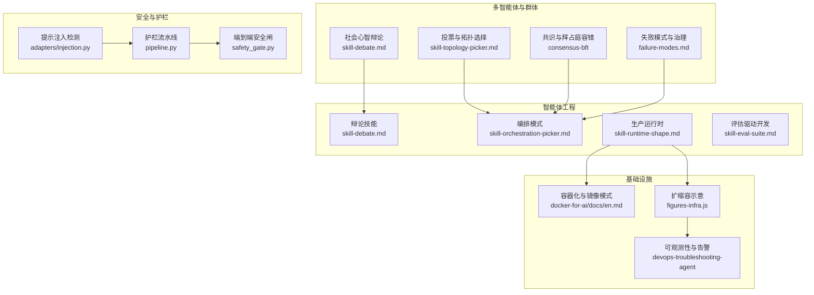
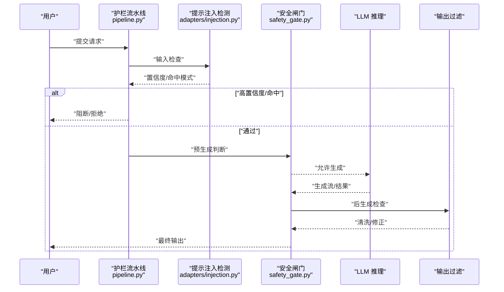
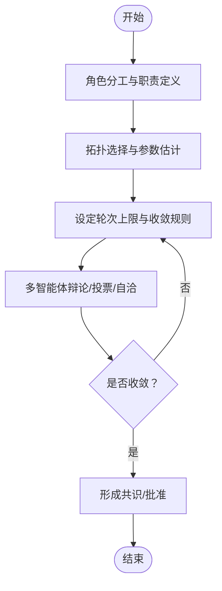
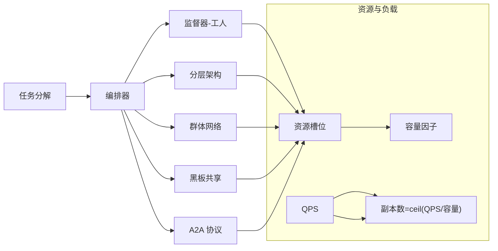
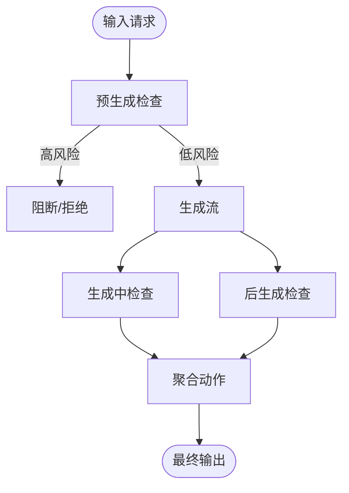
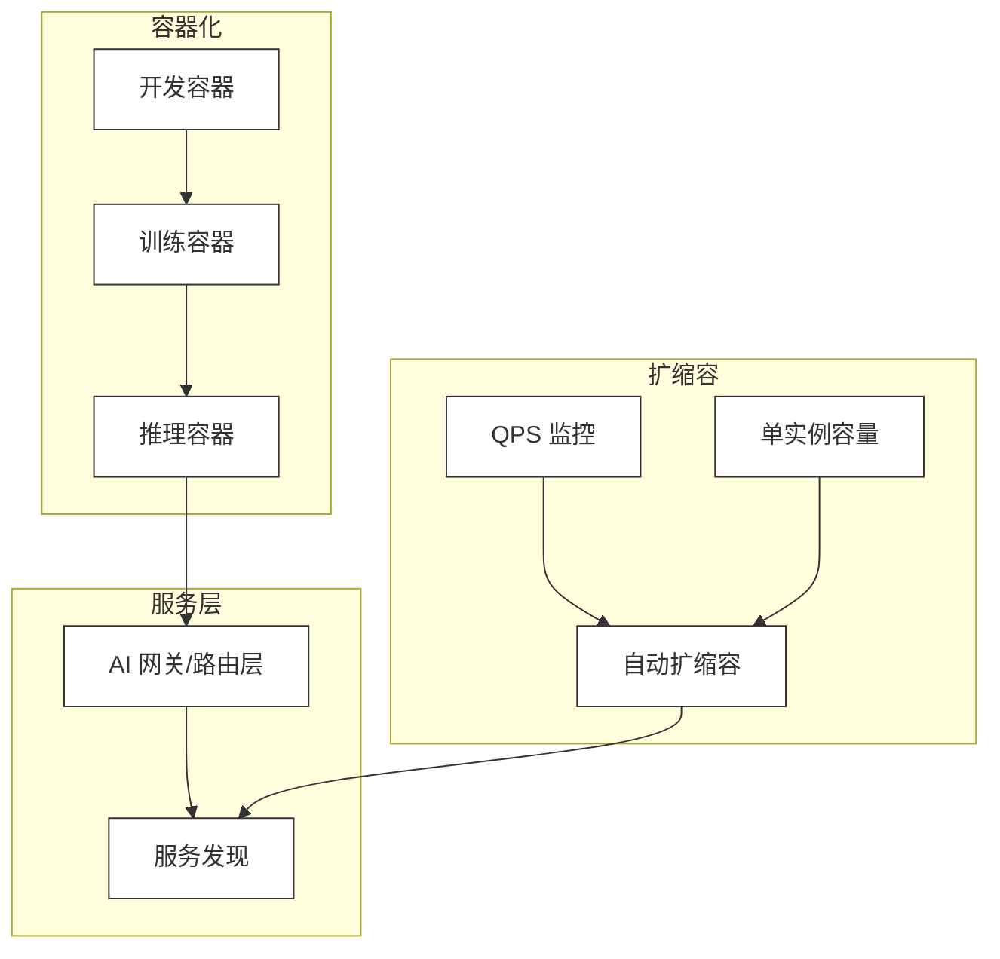
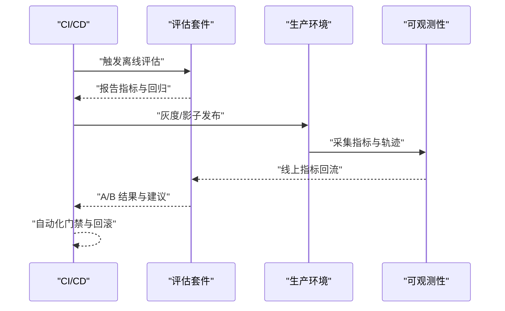
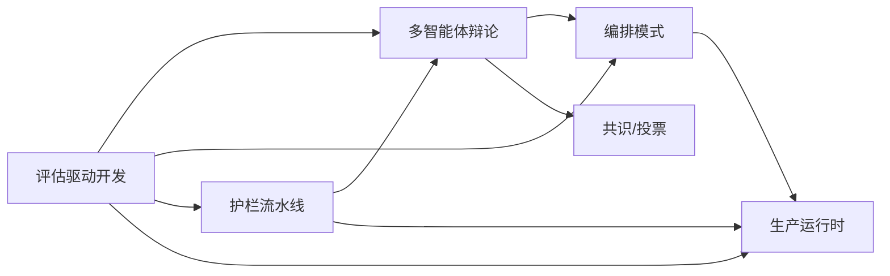
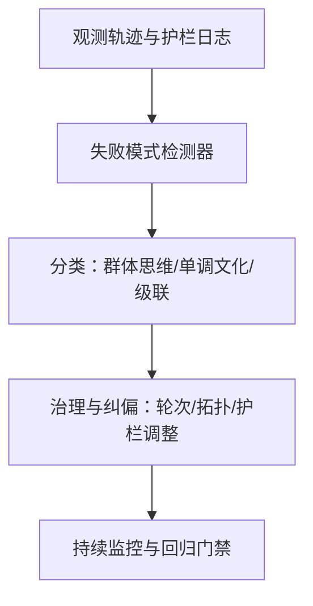

# 生产部署与运行

<cite>
**本文引用的文件**   
- [phases/16-multi-agent-and-swarms/07-society-of-mind-debate/outputs/skill-debate.md](file://phases/16-multi-agent-and-swarms/07-society-of-mind-debate/outputs/skill-debate.md)
- [phases/16-multi-agent-and-swarms/15-voting-debate-topology/outputs/skill-topology-picker.md](file://phases/16-multi-agent-and-swarms/15-voting-debate-topology/outputs/skill-topology-picker.md)
- [phases/14-agent-engineering/25-multi-agent-debate/outputs/skill-debate.md](file://phases/14-agent-engineering/25-multi-agent-debate/outputs/skill-debate.md)
- [phases/14-agent-engineering/28-orchestration-patterns/outputs/skill-orchestration-picker.md](file://phases/14-agent-engineering/28-orchestration-patterns/outputs/skill-orchestration-picker.md)
- [phases/14-agent-engineering/29-production-runtimes/outputs/skill-runtime-shape.md](file://phases/14-agent-engineering/29-production-runtimes/outputs/skill-runtime-shape.md)
- [phases/14-agent-engineering/30-eval-driven-agent-development/outputs/skill-eval-suite.md](file://phases/14-agent-engineering/30-eval-driven-agent-development/outputs/skill-eval-suite.md)
- [phases/16-multi-agent-and-swarms/23-failure-modes-mast-groupthink/outputs/failure-modes.md](file://phases/16-multi-agent-and-swarms/23-failure-modes-mast-groupthink/outputs/failure-modes.md)
- [phases/14-agent-engineering/27-prompt-injection-defense/outputs/skill-prompt-injection-defense.md](file://phases/14-agent-engineering/27-prompt-injection-defense/outputs/skill-prompt-injection-defense.md)
- [guardrails-sandbox/backend/adapters/injection.py](file://guardrails-sandbox/backend/adapters/injection.py)
- [guardrails-sandbox/backend/pipeline.py](file://guardrails-sandbox/backend/pipeline.py)
- [phases/19-capstone-projects/87-end-to-end-safety-gate/code/safety_gate.py](file://phases/19-capstone-projects/87-end-to-end-safety-gate/code/safety_gate.py)
- [site/figures-infra.js](file://site/figures-infra.js)
- [phases/00-setup-and-tooling/07-docker-for-ai/docs/en.md](file://phases/00-setup-and-tooling/07-docker-for-ai/docs/en.md)
- [phases/19-capstone-projects/06-devops-troubleshooting-agent/code/main.py](file://phases/19-capstone-projects/06-devops-troubleshooting-agent/code/main.py)
- [phases/19-capstone-projects/06-devops-troubleshooting-agent/code/ts/src/agent.ts](file://phases/19-capstone-projects/06-devops-troubleshooting-agent/code/ts/src/agent.ts)
- [phases/19-capstone-projects/16-github-issue-to-pr-agent/code/main.py](file://phases/19-capstone-projects/16-github-issue-to-pr-agent/code/main.py)
- [site/figures-agents-alignment.js](file://site/figures-agents-alignment.js)
- [site/data.js](file://site/data.js)
</cite>

## 目录
1. [引言](#引言)
2. [项目结构](#项目结构)
3. [核心组件](#核心组件)
4. [架构总览](#架构总览)
5. [详细组件分析](#详细组件分析)
6. [依赖关系分析](#依赖关系分析)
7. [性能考量](#性能考量)
8. [故障排查指南](#故障排查指南)
9. [结论](#结论)
10. [附录](#附录)

## 引言
本文件面向“智能体生产部署与运行”课程，围绕多智能体辩论系统展开，系统性阐述协调机制、冲突化解与共识形成；剖析智能体失败模式与异常处理策略；讲解提示注入防御体系；深入分析编排模式（任务调度、资源分配、负载均衡）；介绍生产运行时系统（容器化、服务发现、自动扩缩容）；并给出评估驱动的智能体开发流程（A/B 测试、性能监控、持续改进）与完整部署指南及运维最佳实践。

## 项目结构
本仓库以“阶段化学习路径”组织内容，涵盖从基础数学、机器学习、大模型原理到工程化部署与生产的完整闭环。与本主题直接相关的内容主要分布在以下模块：
- 多智能体与群体：社会心智辩论、投票与拓扑、共识与拜占庭容错、失败模式等
- 智能体工程：辩论技能、编排模式、生产运行时、评估驱动开发
- 安全与护栏：提示注入检测与输出过滤
- 运行基础设施：容器化、扩缩容示意与可观测性

**图表来源**
- [phases/16-multi-agent-and-swarms/07-society-of-mind-debate/outputs/skill-debate.md:1-200](file://phases/16-multi-agent-and-swarms/07-society-of-mind-debate/outputs/skill-debate.md#L1-L200)
- [phases/16-multi-agent-and-swarms/15-voting-debate-topology/outputs/skill-topology-picker.md:1-200](file://phases/16-multi-agent-and-swarms/15-voting-debate-topology/outputs/skill-topology-picker.md#L1-L200)
- [phases/14-agent-engineering/28-orchestration-patterns/outputs/skill-orchestration-picker.md:1-200](file://phases/14-agent-engineering/28-orchestration-patterns/outputs/skill-orchestration-picker.md#L1-L200)
- [phases/14-agent-engineering/29-production-runtimes/outputs/skill-runtime-shape.md:1-200](file://phases/14-agent-engineering/29-production-runtimes/outputs/skill-runtime-shape.md#L1-L200)
- [phases/14-agent-engineering/30-eval-driven-agent-development/outputs/skill-eval-suite.md:1-200](file://phases/14-agent-engineering/30-eval-driven-agent-development/outputs/skill-eval-suite.md#L1-L200)
- [guardrails-sandbox/backend/adapters/injection.py:1-87](file://guardrails-sandbox/backend/adapters/injection.py#L1-L87)
- [guardrails-sandbox/backend/pipeline.py:95-133](file://guardrails-sandbox/backend/pipeline.py#L95-L133)
- [phases/19-capstone-projects/87-end-to-end-safety-gate/code/safety_gate.py:199-233](file://phases/19-capstone-projects/87-end-to-end-safety-gate/code/safety_gate.py#L199-L233)
- [site/figures-infra.js:310-358](file://site/figures-infra.js#L310-L358)
- [phases/00-setup-and-tooling/07-docker-for-ai/docs/en.md:50-96](file://phases/00-setup-and-tooling/07-docker-for-ai/docs/en.md#L50-L96)
- [phases/19-capstone-projects/06-devops-troubleshooting-agent/code/main.py:1-74](file://phases/19-capstone-projects/06-devops-troubleshooting-agent/code/main.py#L1-L74)

**章节来源**
- [site/data.js:14565-14595](file://site/data.js#L14565-L14595)
- [site/data.js:16143-16173](file://site/data.js#L16143-L16173)
- [site/data.js:14677-14720](file://site/data.js#L14677-L14720)
- [site/data.js:14713-14757](file://site/data.js#L14713-L14757)

## 核心组件
- 多智能体辩论系统：由角色分工（规划师、执行者、评论员等）、拓扑选择（全连、星型、环型等）、轮次与收敛规则构成，支持社会心智式共识形成与冲突化解。
- 编排模式：覆盖监督器-工人、分层架构、群体网络、黑板共享、A2A 协议等，支撑任务分解、资源分配与负载均衡。
- 安全护栏：输入/输出过滤、提示注入检测、护栏闸门与拒绝文本，贯穿预生成、生成中与后生成阶段。
- 生产运行时：容器化镜像模式、请求-响应/流式/队列/事件/持久形态、可观测性与告警。
- 评估驱动开发：静态基准、自定义离线评测、在线生产评测与 CI 门禁，形成评估器-优化器闭环。

**章节来源**
- [phases/16-multi-agent-and-swarms/07-society-of-mind-debate/outputs/skill-debate.md:1-200](file://phases/16-multi-agent-and-swarms/07-society-of-mind-debate/outputs/skill-debate.md#L1-L200)
- [phases/16-multi-agent-and-swarms/15-voting-debate-topology/outputs/skill-topology-picker.md:1-200](file://phases/16-multi-agent-and-swarms/15-voting-debate-topology/outputs/skill-topology-picker.md#L1-L200)
- [phases/14-agent-engineering/28-orchestration-patterns/outputs/skill-orchestration-picker.md:1-200](file://phases/14-agent-engineering/28-orchestration-patterns/outputs/skill-orchestration-picker.md#L1-L200)
- [phases/14-agent-engineering/29-production-runtimes/outputs/skill-runtime-shape.md:1-200](file://phases/14-agent-engineering/29-production-runtimes/outputs/skill-runtime-shape.md#L1-L200)
- [phases/14-agent-engineering/30-eval-driven-agent-development/outputs/skill-eval-suite.md:1-200](file://phases/14-agent-engineering/30-eval-driven-agent-development/outputs/skill-eval-suite.md#L1-L200)

## 架构总览
下图展示从用户请求到护栏过滤再到推理与输出的端到端流程，以及编排与运行时如何协同保障一致性与稳定性。

**图表来源**
- [guardrails-sandbox/backend/pipeline.py:95-133](file://guardrails-sandbox/backend/pipeline.py#L95-L133)
- [guardrails-sandbox/backend/adapters/injection.py:1-87](file://guardrails-sandbox/backend/adapters/injection.py#L1-L87)
- [phases/19-capstone-projects/87-end-to-end-safety-gate/code/safety_gate.py:199-233](file://phases/19-capstone-projects/87-end-to-end-safety-gate/code/safety_gate.py#L199-L233)

## 详细组件分析

### 组件A：多智能体辩论系统（协调、冲突化解、共识）
- 角色设计与职责：规划师负责任务分解与计划制定；执行者负责具体操作；评论员负责质量把关与反馈；验证者负责事实校验与收敛判定。
- 拓扑选择：根据任务复杂度与质量目标选择全连、星型、环型或稀疏图拓扑，并估计收益与 token 成本。
- 协调机制：基于轮次预算与收敛规则，结合投票/自洽/辩论策略达成共识；在多智能体场景下降低“群体思维”风险。
- 社会心智式共识：通过多视角讨论与迭代，逐步逼近稳定解，避免单点失效。

**图表来源**
- [phases/16-multi-agent-and-swarms/07-society-of-mind-debate/outputs/skill-debate.md:1-200](file://phases/16-multi-agent-and-swarms/07-society-of-mind-debate/outputs/skill-debate.md#L1-L200)
- [phases/16-multi-agent-and-swarms/15-voting-debate-topology/outputs/skill-topology-picker.md:1-200](file://phases/16-multi-agent-and-swarms/15-voting-debate-topology/outputs/skill-topology-picker.md#L1-L200)
- [phases/14-agent-engineering/25-multi-agent-debate/outputs/skill-debate.md:1-200](file://phases/14-agent-engineering/25-multi-agent-debate/outputs/skill-debate.md#L1-L200)

**章节来源**
- [phases/16-multi-agent-and-swarms/07-society-of-mind-debate/outputs/skill-debate.md:1-200](file://phases/16-multi-agent-and-swarms/07-society-of-mind-debate/outputs/skill-debate.md#L1-L200)
- [phases/16-multi-agent-and-swarms/15-voting-debate-topology/outputs/skill-topology-picker.md:1-200](file://phases/16-multi-agent-and-swarms/15-voting-debate-topology/outputs/skill-topology-picker.md#L1-L200)
- [phases/14-agent-engineering/25-multi-agent-debate/outputs/skill-debate.md:1-200](file://phases/14-agent-engineering/25-multi-agent-debate/outputs/skill-debate.md#L1-L200)

### 组件B：编排模式（任务调度、资源分配、负载均衡）
- 模式选择：监督器-工人、分层架构、群体网络、黑板共享、A2A 协议等，依据任务粒度与耦合度选择最优形态。
- 资源分配：将子任务映射到可用资源槽位，结合容量因子与路由策略，避免过载与浪费。
- 负载均衡：基于 QPS 与单实例容量动态调整副本数，保持延迟与成本平衡。

**图表来源**
- [phases/14-agent-engineering/28-orchestration-patterns/outputs/skill-orchestration-picker.md:1-200](file://phases/14-agent-engineering/28-orchestration-patterns/outputs/skill-orchestration-picker.md#L1-L200)
- [site/figures-llms2.js:281-306](file://site/figures-llms2.js#L281-L306)
- [site/figures-infra.js:310-358](file://site/figures-infra.js#L310-L358)

**章节来源**
- [phases/14-agent-engineering/28-orchestration-patterns/outputs/skill-orchestration-picker.md:1-200](file://phases/14-agent-engineering/28-orchestration-patterns/outputs/skill-orchestration-picker.md#L1-L200)
- [site/figures-llms2.js:281-306](file://site/figures-llms2.js#L281-L306)
- [site/figures-infra.js:310-358](file://site/figures-infra.js#L310-L358)

### 组件C：提示注入防御机制（输入验证、内容过滤、安全检查）
- 输入验证：采用正则匹配已知攻击模式，计算最大置信度与命中计数，决定是否阻断。
- 内容过滤：护栏流水线在输入/输出两阶段进行检查，记录日志与延迟指标。
- 安全闸门：预生成阶段快速阻断高风险请求；生成中/后生成阶段进行细粒度判定与动作聚合。

**图表来源**
- [guardrails-sandbox/backend/adapters/injection.py:1-87](file://guardrails-sandbox/backend/adapters/injection.py#L1-L87)
- [guardrails-sandbox/backend/pipeline.py:95-133](file://guardrails-sandbox/backend/pipeline.py#L95-L133)
- [phases/19-capstone-projects/87-end-to-end-safety-gate/code/safety_gate.py:199-233](file://phases/19-capstone-projects/87-end-to-end-safety-gate/code/safety_gate.py#L199-L233)
- [site/figures-agents-alignment.js:366-391](file://site/figures-agents-alignment.js#L366-L391)

**章节来源**
- [phases/14-agent-engineering/27-prompt-injection-defense/outputs/skill-prompt-injection-defense.md:1-200](file://phases/14-agent-engineering/27-prompt-injection-defense/outputs/skill-prompt-injection-defense.md#L1-L200)
- [guardrails-sandbox/backend/adapters/injection.py:1-87](file://guardrails-sandbox/backend/adapters/injection.py#L1-L87)
- [guardrails-sandbox/backend/pipeline.py:95-133](file://guardrails-sandbox/backend/pipeline.py#L95-L133)
- [phases/19-capstone-projects/87-end-to-end-safety-gate/code/safety_gate.py:199-233](file://phases/19-capstone-projects/87-end-to-end-safety-gate/code/safety_gate.py#L199-L233)
- [site/figures-agents-alignment.js:366-391](file://site/figures-agents-alignment.js#L366-L391)

### 组件D：生产运行时系统（容器化、服务发现、自动扩缩容）
- 容器化：区分开发容器、训练容器与推理容器，优化镜像大小与启动时间。
- 服务发现：通过网关与路由层实现模型选择与版本管理。
- 自动扩缩容：副本数随 QPS 与单实例容量动态调整，确保延迟目标与成本控制。

**图表来源**
- [phases/00-setup-and-tooling/07-docker-for-ai/docs/en.md:50-96](file://phases/00-setup-and-tooling/07-docker-for-ai/docs/en.md#L50-L96)
- [site/figures-infra.js:310-358](file://site/figures-infra.js#L310-L358)

**章节来源**
- [phases/00-setup-and-tooling/07-docker-for-ai/docs/en.md:50-96](file://phases/00-setup-and-tooling/07-docker-for-ai/docs/en.md#L50-L96)
- [site/figures-infra.js:310-358](file://site/figures-infra.js#L310-L358)

### 组件E：评估驱动的智能体开发（A/B 测试、性能监控、持续改进）
- 三层评估套件：静态基准、自定义离线评测、在线生产评测；CI 门禁保证回归质量。
- 评估器-优化器循环：基于指标反馈迭代改进，形成闭环。
- 可观测性：端到端跟踪请求轨迹、护栏决策与生成过程，便于定位问题与优化瓶颈。

**图表来源**
- [phases/14-agent-engineering/30-eval-driven-agent-development/outputs/skill-eval-suite.md:1-200](file://phases/14-agent-engineering/30-eval-driven-agent-development/outputs/skill-eval-suite.md#L1-L200)
- [site/data.js:14724-14757](file://site/data.js#L14724-L14757)

**章节来源**
- [phases/14-agent-engineering/30-eval-driven-agent-development/outputs/skill-eval-suite.md:1-200](file://phases/14-agent-engineering/30-eval-driven-agent-development/outputs/skill-eval-suite.md#L1-L200)
- [site/data.js:14724-14757](file://site/data.js#L14724-L14757)

## 依赖关系分析
- 多智能体辩论依赖编排模式进行任务分解与资源调度；共识形成受拓扑与轮次规则影响。
- 安全护栏贯穿推理全流程，前置阻断高风险请求，减少下游开销。
- 生产运行时为上述组件提供稳定的容器化与扩缩容能力，保障 SLA。
- 评估驱动开发为持续改进提供数据与自动化手段。

**图表来源**
- [phases/16-multi-agent-and-swarms/07-society-of-mind-debate/outputs/skill-debate.md:1-200](file://phases/16-multi-agent-and-swarms/07-society-of-mind-debate/outputs/skill-debate.md#L1-L200)
- [phases/14-agent-engineering/28-orchestration-patterns/outputs/skill-orchestration-picker.md:1-200](file://phases/14-agent-engineering/28-orchestration-patterns/outputs/skill-orchestration-picker.md#L1-L200)
- [guardrails-sandbox/backend/pipeline.py:95-133](file://guardrails-sandbox/backend/pipeline.py#L95-L133)
- [phases/14-agent-engineering/30-eval-driven-agent-development/outputs/skill-eval-suite.md:1-200](file://phases/14-agent-engineering/30-eval-driven-agent-development/outputs/skill-eval-suite.md#L1-L200)

**章节来源**
- [site/data.js:14565-14595](file://site/data.js#L14565-L14595)
- [site/data.js:16143-16173](file://site/data.js#L16143-L16173)
- [site/data.js:14677-14720](file://site/data.js#L14677-L14720)
- [site/data.js:14713-14757](file://site/data.js#L14713-L14757)

## 性能考量
- 训练与推理容器的镜像优化：最小化依赖、分层缓存、精简运行时，缩短冷启动时间。
- 扩缩容策略：以 QPS 与单实例容量为依据，预留头 room，避免尾部延迟尖峰。
- 资源分配与路由：专家容量与路由份额需与任务负载分布匹配，减少丢弃与浪费。
- 护栏前置：在进入推理前完成高置信度阻断，显著降低无效计算与带宽消耗。

[本节为通用指导，无需特定文件引用]

## 故障排查指南
- 多智能体失败模式：群体思维、单调文化、级联效应、系统性错误与边界情况。应建立失败检测器与可观测性追踪，标注行业常见模式与领域特异性签名。
- DevOps 故障排查代理：构建 Kubernetes 知识图谱，串联对象与遥测边，实现只读优先与人机审批，审计每一步破坏性命令。
- GitHub Issue 到 PR 的代理：通过预算与轮次控制，防止超预算与超时；失败原因归因（轮次上限/预算耗尽/时间耗尽）。

**图表来源**
- [phases/16-multi-agent-and-swarms/23-failure-modes-mast-groupthink/outputs/failure-modes.md:1-200](file://phases/16-multi-agent-and-swarms/23-failure-modes-mast-groupthink/outputs/failure-modes.md#L1-L200)
- [phases/19-capstone-projects/06-devops-troubleshooting-agent/code/main.py:1-74](file://phases/19-capstone-projects/06-devops-troubleshooting-agent/code/main.py#L1-L74)
- [phases/19-capstone-projects/16-github-issue-to-pr-agent/code/main.py:120-153](file://phases/19-capstone-projects/16-github-issue-to-pr-agent/code/main.py#L120-L153)

**章节来源**
- [phases/16-multi-agent-and-swarms/23-failure-modes-mast-groupthink/outputs/failure-modes.md:1-200](file://phases/16-multi-agent-and-swarms/23-failure-modes-mast-groupthink/outputs/failure-modes.md#L1-L200)
- [phases/19-capstone-projects/06-devops-troubleshooting-agent/code/main.py:1-74](file://phases/19-capstone-projects/06-devops-troubleshooting-agent/code/main.py#L1-L74)
- [phases/19-capstone-projects/06-devops-troubleshooting-agent/code/ts/src/agent.ts:41-59](file://phases/19-capstone-projects/06-devops-troubleshooting-agent/code/ts/src/agent.ts#L41-L59)
- [phases/19-capstone-projects/16-github-issue-to-pr-agent/code/main.py:120-153](file://phases/19-capstone-projects/16-github-issue-to-pr-agent/code/main.py#L120-L153)

## 结论
多智能体辩论系统在生产环境中需要以“护栏前置、编排有序、运行稳健、评估闭环”为核心原则。通过合理的角色分工与拓扑选择实现高效协调，借助护栏与安全闸门抵御提示注入等安全风险，配合容器化与自动扩缩容保障 SLA，最后以评估驱动开发实现持续改进与质量门禁。该方法论既适用于课堂实验，也可平滑迁移到真实生产。

[本节为总结，无需特定文件引用]

## 附录
- 生产部署清单（建议）
  - 容器镜像：明确开发/训练/推理三类镜像规范与构建步骤
  - 服务网关：统一路由、版本选择与灰度发布
  - 护栏与安全：输入/输出过滤、提示注入检测、拒绝文本与日志
  - 扩缩容：QPS 目标、单实例容量、副本数策略与告警阈值
  - 评估与监控：离线基准、在线指标、CI 门禁与回归检测
  - 可观测性：端到端追踪、护栏决策、生成过程与失败归因

[本节为通用指导，无需特定文件引用]