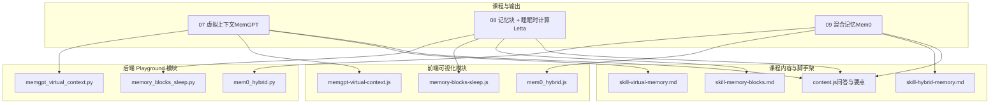
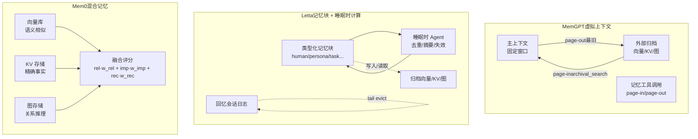
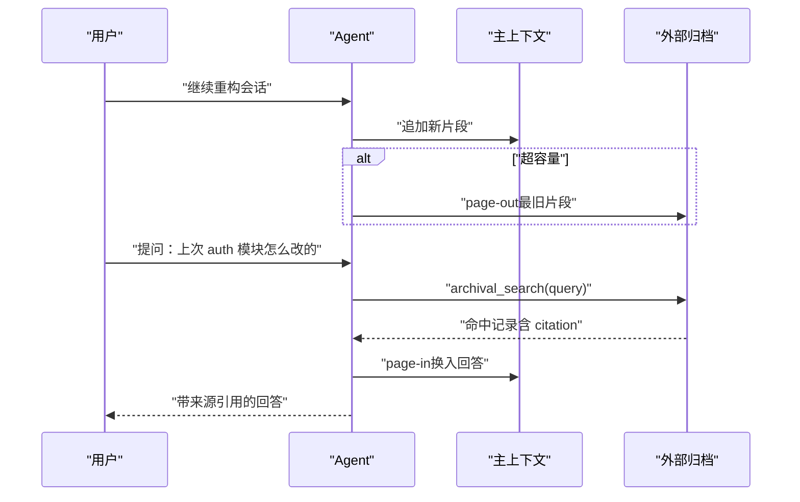
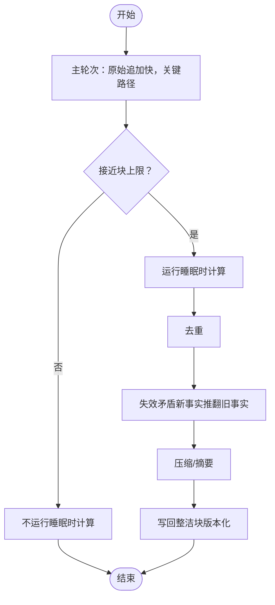
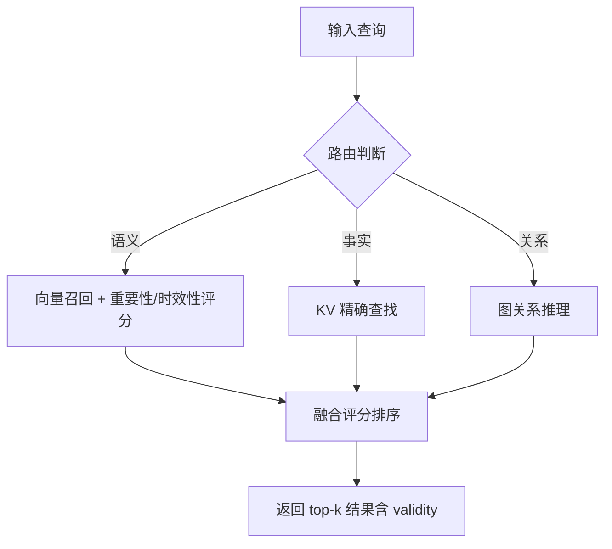
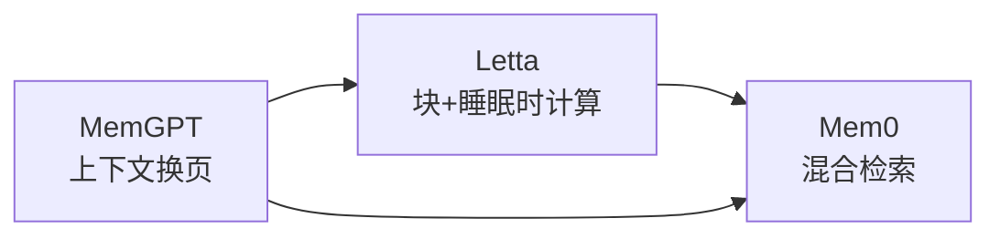

# 记忆系统

<cite>
**本文引用的文件**
- [phases/14-agent-engineering/07-memory-virtual-context-memgpt/outputs/skill-virtual-memory.md](file://phases/14-agent-engineering/07-memory-virtual-context-memgpt/outputs/skill-virtual-memory.md)
- [guardrails-sandbox/backend/playground/modules/memgpt_virtual_context.py](file://guardrails-sandbox/backend/playground/modules/memgpt_virtual_context.py)
- [site/vue-app/summary/src/data/modules/memgpt-virtual-context.js](file://site/vue-app/summary/src/data/modules/memgpt-virtual-context.js)
- [phases/14-agent-engineering/08-memory-blocks-sleep-time-compute/outputs/skill-memory-blocks.md](file://phases/14-agent-engineering/08-memory-blocks-sleep-time-compute/outputs/skill-memory-blocks.md)
- [guardrails-sandbox/backend/playground/modules/memory_blocks_sleep.py](file://guardrails-sandbox/backend/playground/modules/memory_blocks_sleep.py)
- [site/vue-app/summary/src/data/modules/memory-blocks-sleep.js](file://site/vue-app/summary/src/data/modules/memory-blocks-sleep.js)
- [phases/14-agent-engineering/09-hybrid-memory-mem0/outputs/skill-hybrid-memory.md](file://phases/14-agent-engineering/09-hybrid-memory-mem0/outputs/skill-hybrid-memory.md)
- [guardrails-sandbox/backend/playground/modules/mem0_hybrid.py](file://guardrails-sandbox/backend/playground/modules/mem0_hybrid.py)
- [site/vue-app/summary/src/data/content.js](file://site/vue-app/summary/src/data/content.js)
</cite>

## 目录
1. [引言](#引言)
2. [项目结构](#项目结构)
3. [核心组件](#核心组件)
4. [架构总览](#架构总览)
5. [详细组件分析](#详细组件分析)
6. [依赖分析](#依赖分析)
7. [性能考虑](#性能考虑)
8. [故障排查指南](#故障排查指南)
9. [结论](#结论)
10. [附录](#附录)

## 引言
本文件围绕智能体记忆系统课程，系统梳理虚拟上下文记忆（MemGPT）、记忆块（Letta）与混合记忆（Mem0）三大范式，解释其架构设计、数据流与控制流，并给出可落地的实现指引与最佳实践。目标读者既包括初学者，也涵盖希望在真实工程中落地的工程师。

## 项目结构
本仓库将“记忆系统”作为“Agent 工程（Phase 14）”中的核心主题，配套前后端 Playground 模块与前端可视化模块，形成“概念讲解 + 交互式演示 + 代码脚手架”的闭环。

图表来源
- [guardrails-sandbox/backend/playground/modules/memgpt_virtual_context.py:1-101](file://guardrails-sandbox/backend/playground/modules/memgpt_virtual_context.py#L1-L101)
- [guardrails-sandbox/backend/playground/modules/memory_blocks_sleep.py:1-123](file://guardrails-sandbox/backend/playground/modules/memory_blocks_sleep.py#L1-L123)
- [guardrails-sandbox/backend/playground/modules/mem0_hybrid.py:1-131](file://guardrails-sandbox/backend/playground/modules/mem0_hybrid.py#L1-L131)
- [site/vue-app/summary/src/data/modules/memgpt-virtual-context.js:1-105](file://site/vue-app/summary/src/data/modules/memgpt-virtual-context.js#L1-L105)
- [site/vue-app/summary/src/data/modules/memory-blocks-sleep.js:1-114](file://site/vue-app/summary/src/data/modules/memory-blocks-sleep.js#L1-L114)
- [site/vue-app/summary/src/data/content.js:1555-1789](file://site/vue-app/summary/src/data/content.js#L1555-L1789)
- [phases/14-agent-engineering/07-memory-virtual-context-memgpt/outputs/skill-virtual-memory.md:1-34](file://phases/14-agent-engineering/07-memory-virtual-context-memgpt/outputs/skill-virtual-memory.md#L1-L34)
- [phases/14-agent-engineering/08-memory-blocks-sleep-time-compute/outputs/skill-memory-blocks.md:1-34](file://phases/14-agent-engineering/08-memory-blocks-sleep-time-compute/outputs/skill-memory-blocks.md#L1-L34)
- [phases/14-agent-engineering/09-hybrid-memory-mem0/outputs/skill-hybrid-memory.md:1-33](file://phases/14-agent-engineering/09-hybrid-memory-mem0/outputs/skill-hybrid-memory.md#L1-L33)

章节来源
- [site/vue-app/summary/src/data/content.js:1555-1789](file://site/vue-app/summary/src/data/content.js#L1555-L1789)

## 核心组件
- 虚拟上下文记忆（MemGPT）
  - 主上下文（RAM，固定窗口）与外部归档（磁盘，向量/KV/图，无界）
  - 记忆工具调用 = 缺页中断（page-in/page-out）
  - 自编辑记忆：核心段编辑、归档插入/检索、对话检索
- 记忆块（Letta）
  - 类型化记忆块（label/value/limit/description），默认 human/persona/task
  - 睡眠时计算：离线去重/摘要/失效矛盾，移出关键路径
- 混合记忆（Mem0）
  - 三路存储：向量（语义相似）、KV（精确事实）、图（关系推理）
  - 融合评分：相关性·w_rel + 重要性·w_imp + 时效性·w_rec
  - 冲突软删除（valid=False）+ 时间查询

章节来源
- [phases/14-agent-engineering/07-memory-virtual-context-memgpt/outputs/skill-virtual-memory.md:10-34](file://phases/14-agent-engineering/07-memory-virtual-context-memgpt/outputs/skill-virtual-memory.md#L10-L34)
- [phases/14-agent-engineering/08-memory-blocks-sleep-time-compute/outputs/skill-memory-blocks.md:10-34](file://phases/14-agent-engineering/08-memory-blocks-sleep-time-compute/outputs/skill-memory-blocks.md#L10-L34)
- [phases/14-agent-engineering/09-hybrid-memory-mem0/outputs/skill-hybrid-memory.md:10-33](file://phases/14-agent-engineering/09-hybrid-memory-mem0/outputs/skill-hybrid-memory.md#L10-L33)

## 架构总览
下图展示了三类记忆范式的高层架构与数据/控制流映射。

图表来源
- [guardrails-sandbox/backend/playground/modules/memgpt_virtual_context.py:1-101](file://guardrails-sandbox/backend/playground/modules/memgpt_virtual_context.py#L1-L101)
- [guardrails-sandbox/backend/playground/modules/memory_blocks_sleep.py:1-123](file://guardrails-sandbox/backend/playground/modules/memory_blocks_sleep.py#L1-L123)
- [guardrails-sandbox/backend/playground/modules/mem0_hybrid.py:1-131](file://guardrails-sandbox/backend/playground/modules/mem0_hybrid.py#L1-L131)

## 详细组件分析

### 组件A：虚拟上下文记忆（MemGPT）
- 设计要点
  - 主上下文 FIFO，达到容量上限时最旧项被驱逐至外部归档
  - 外部归档支持检索（模拟向量检索），命中后换入主上下文
  - Agent 使用记忆工具进行自编辑：核心段追加/替换、归档插入/检索、对话检索
  - 引用溯源：归档记录携带 citation，回答时必须标注来源
- 数据结构与复杂度
  - 主上下文：FIFO 列表，插入/弹出 O(1)，整体换出 O(n)
  - 外部归档检索：词重叠相似度（token overlap）近似向量检索，排序 O(k log k)，k 为候选数
- 控制流
  - 会话中持续追加主上下文，超容量即 page-out
  - 用户提问触发 archival_search，命中后 page-in 并返回答案
- 安全与合规
  - 禁止将检索到的内容直接写回归档（防止记忆污染）
  - 必须保留 citation，避免引用丢失

图表来源
- [guardrails-sandbox/backend/playground/modules/memgpt_virtual_context.py:50-100](file://guardrails-sandbox/backend/playground/modules/memgpt_virtual_context.py#L50-L100)
- [site/vue-app/summary/src/data/modules/memgpt-virtual-context.js:45-98](file://site/vue-app/summary/src/data/modules/memgpt-virtual-context.js#L45-L98)

章节来源
- [phases/14-agent-engineering/07-memory-virtual-context-memgpt/outputs/skill-virtual-memory.md:10-34](file://phases/14-agent-engineering/07-memory-virtual-context-memgpt/outputs/skill-virtual-memory.md#L10-L34)
- [guardrails-sandbox/backend/playground/modules/memgpt_virtual_context.py:1-101](file://guardrails-sandbox/backend/playground/modules/memgpt_virtual_context.py#L1-L101)
- [site/vue-app/summary/src/data/modules/memgpt-virtual-context.js:1-105](file://site/vue-app/summary/src/data/modules/memgpt-virtual-context.js#L1-L105)

### 组件B：记忆块 + 睡眠时计算（Letta）
- 设计要点
  - 类型化记忆块：label/value/limit/description，支持 human/persona/task 等默认块
  - 主轮次只做快速写入（原始事实可能重复/矛盾），不进行整理
  - 睡眠时 Agent 在关键路径外离线执行去重/摘要/失效矛盾，提升块质量
- 数据结构与复杂度
  - 原始写入：O(1) 追加
  - 睡眠时计算：去重 O(n)，矛盾判定 O(n²)（本演示简化为线性检查）
- 控制流
  - 主轮次：raw append → 快速写入
  - 睡眠时：去重 → 失效矛盾 → 压缩 → 写回整洁块
- 安全与合规
  - 睡眠时接口同样需要安全审查，避免“投毒巩固”
  - 版本化与 diff 可视化，防止静默漂移

图表来源
- [guardrails-sandbox/backend/playground/modules/memory_blocks_sleep.py:27-46](file://guardrails-sandbox/backend/playground/modules/memory_blocks_sleep.py#L27-L46)
- [site/vue-app/summary/src/data/modules/memory-blocks-sleep.js:19-42](file://site/vue-app/summary/src/data/modules/memory-blocks-sleep.js#L19-L42)

章节来源
- [phases/14-agent-engineering/08-memory-blocks-sleep-time-compute/outputs/skill-memory-blocks.md:10-34](file://phases/14-agent-engineering/08-memory-blocks-sleep-time-compute/outputs/skill-memory-blocks.md#L10-L34)
- [guardrails-sandbox/backend/playground/modules/memory_blocks_sleep.py:1-123](file://guardrails-sandbox/backend/playground/modules/memory_blocks_sleep.py#L1-L123)
- [site/vue-app/summary/src/data/modules/memory-blocks-sleep.js:1-114](file://site/vue-app/summary/src/data/modules/memory-blocks-sleep.js#L1-L114)

### 组件C：混合记忆（Mem0）
- 设计要点
  - 三路存储：向量（语义相似）、KV（精确事实）、图（关系推理）
  - 融合评分：score = w_rel·相关性 + w_imp·重要性 + w_rec·时效性
  - 冲突软删除：同 subject/relation 矛盾时，旧边标记 valid=False，保留历史
  - 时间查询：支持“某时刻有效”的历史视图
- 数据结构与复杂度
  - 向量检索：top-k 相似度（本演示使用 token overlap 近似）
  - KV 查找：O(1)
  - 图推理：邻接/边过滤，支持 valid 标记
- 控制流
  - 查询路由：根据关键词判断主路（向量/KV/图）
  - 融合评分：三路召回合并，按权重打分排序
  - 冲突处理：软删除旧边，写入新边，更新 KV
- 安全与合规
  - 单存储不可称为“Mem0-shaped”，必须三路并存
  - 跨作用域检索需显式过滤或权重配置，避免隐私泄露

图表来源
- [guardrails-sandbox/backend/playground/modules/mem0_hybrid.py:45-131](file://guardrails-sandbox/backend/playground/modules/mem0_hybrid.py#L45-L131)
- [site/vue-app/summary/src/data/modules/mem0_hybrid.js:1-131](file://site/vue-app/summary/src/data/modules/mem0_hybrid.js#L1-L131)

章节来源
- [phases/14-agent-engineering/09-hybrid-memory-mem0/outputs/skill-hybrid-memory.md:10-33](file://phases/14-agent-engineering/09-hybrid-memory-mem0/outputs/skill-hybrid-memory.md#L10-L33)
- [guardrails-sandbox/backend/playground/modules/mem0_hybrid.py:1-131](file://guardrails-sandbox/backend/playground/modules/mem0_hybrid.py#L1-L131)

## 依赖分析
- 组件耦合
  - MemGPT 与 Letta：同属“上下文换页”范式，但 Letta 将整理移出关键路径，降低尾延迟
  - Letta 与 Mem0：Letta 解决“上下文放不下”的控制流，Mem0 解决“多类查询用一套接口”的检索融合
- 外部依赖
  - 向量检索：本课程使用 token overlap 近似，实际工程建议接入向量数据库（如 Qdrant、Chroma、pgvector）
  - KV/图：可采用内存字典或外部 KV/图数据库（如 Redis、Neo4j）
- 潜在循环依赖
  - 三范式均通过“工具调用/检索接口”解耦，不存在直接循环依赖

图表来源
- [site/vue-app/summary/src/data/content.js:1590-1596](file://site/vue-app/summary/src/data/content.js#L1590-L1596)

章节来源
- [site/vue-app/summary/src/data/content.js:1590-1596](file://site/vue-app/summary/src/data/content.js#L1590-L1596)

## 性能考虑
- MemGPT
  - 主上下文容量 cap 控制窗口大小，cap 越大越少 page-out，但窗口溢出风险越高
  - 外部归档检索应避免全量 LLM 重排，优先 BM25 或向量 top-k，再由 LLM 对 top-k 重排
- Letta
  - 睡眠时计算移出关键路径，主轮次延迟几乎不变
  - 块接近上限（阈值 0.8）时应触发摘要/压缩，避免频繁去重带来的 O(n²) 开销
- Mem0
  - 融合权重按场景调参：聊天重时效、合规重重要性、检索重相关性
  - 图边数量增长快，建议限制每条 add 的边数，避免图爆炸
  - 向量嵌入漂移需定期重嵌，保持语义一致性

## 故障排查指南
- 记忆腐烂
  - 症状：新旧事实共存，检索时互相干扰
  - 处理：启用睡眠时计算的“失效矛盾”流程，或在 Mem0 中软删除旧边
- 记忆投毒
  - 症状：恶意内容被写入归档/块，召回时重摄取
  - 处理：禁止“全量写回归档”；对检索到的内容进行安全审查；对睡眠时接口进行同等安全审查
- 引用丢失
  - 症状：回答能回忆起内容但无法溯源
  - 处理：归档写入时强制保存 citation；回答时必须标注来源
- 跨作用域泄漏
  - 症状：用户 A 的记录被用户 B 检索到
  - 处理：Mem0 必须按作用域（user/session/agent）过滤检索；明确权重或显式 scope 参数

章节来源
- [site/vue-app/summary/src/data/content.js:1590-1596](file://site/vue-app/summary/src/data/content.js#L1590-L1596)
- [phases/14-agent-engineering/07-memory-virtual-context-memgpt/outputs/skill-virtual-memory.md:20-31](file://phases/14-agent-engineering/07-memory-virtual-context-memgpt/outputs/skill-virtual-memory.md#L20-L31)
- [phases/14-agent-engineering/09-hybrid-memory-mem0/outputs/skill-hybrid-memory.md:20-31](file://phases/14-agent-engineering/09-hybrid-memory-mem0/outputs/skill-hybrid-memory.md#L20-L31)

## 结论
- MemGPT 以“虚拟内存”类比上下文管理，解决“上下文放不下”的问题
- Letta 在 MemGPT 基础上引入类型化块与睡眠时计算，将整理移出关键路径，降低尾延迟
- Mem0 将向量/KV/图三路融合，统一检索接口，支持冲突软删除与时间查询
- 工程落地建议：先实现 MemGPT 的换页与检索，再引入 Letta 的块与睡眠时计算，最后按需叠加 Mem0 的混合检索与冲突治理

## 附录
- 代码实现示例（路径）
  - MemGPT 页面换入/换出：[memgpt_virtual_context.py:50-100](file://guardrails-sandbox/backend/playground/modules/memgpt_virtual_context.py#L50-L100)、[memgpt-virtual-context.js:45-98](file://site/vue-app/summary/src/data/modules/memgpt-virtual-context.js#L45-L98)
  - 记忆块 + 睡眠时计算：[memory_blocks_sleep.py:27-46](file://guardrails-sandbox/backend/playground/modules/memory_blocks_sleep.py#L27-L46)、[memory-blocks-sleep.js:19-42](file://site/vue-app/summary/src/data/modules/memory-blocks-sleep.js#L19-L42)
  - Mem0 混合检索与软删除：[mem0_hybrid.py:45-131](file://guardrails-sandbox/backend/playground/modules/mem0_hybrid.py#L45-L131)
- 最佳实践清单
  - MemGPT：严格设置主上下文容量；外部归档检索走 top-k；回答必须标注 citation
  - Letta：主轮次只写不整；睡眠时计算做去重/摘要/失效；版本化与 diff 可视化
  - Mem0：三路存储缺一不可；融合权重按产品调；冲突软删除；跨作用域过滤