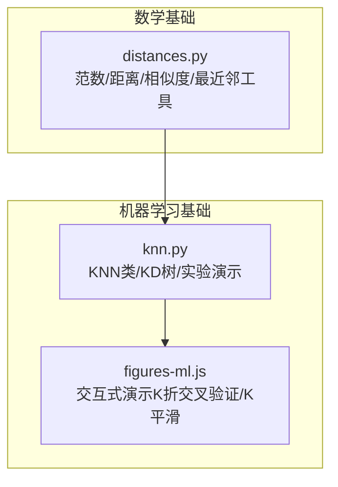
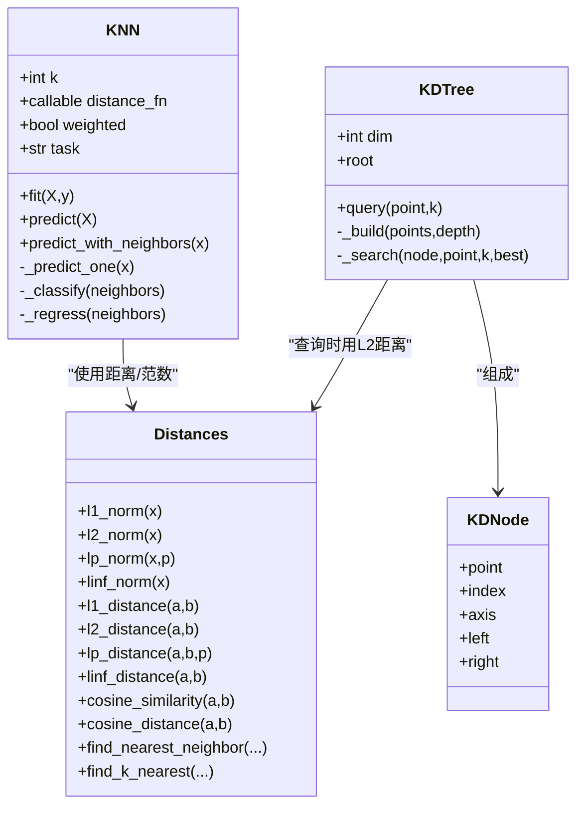
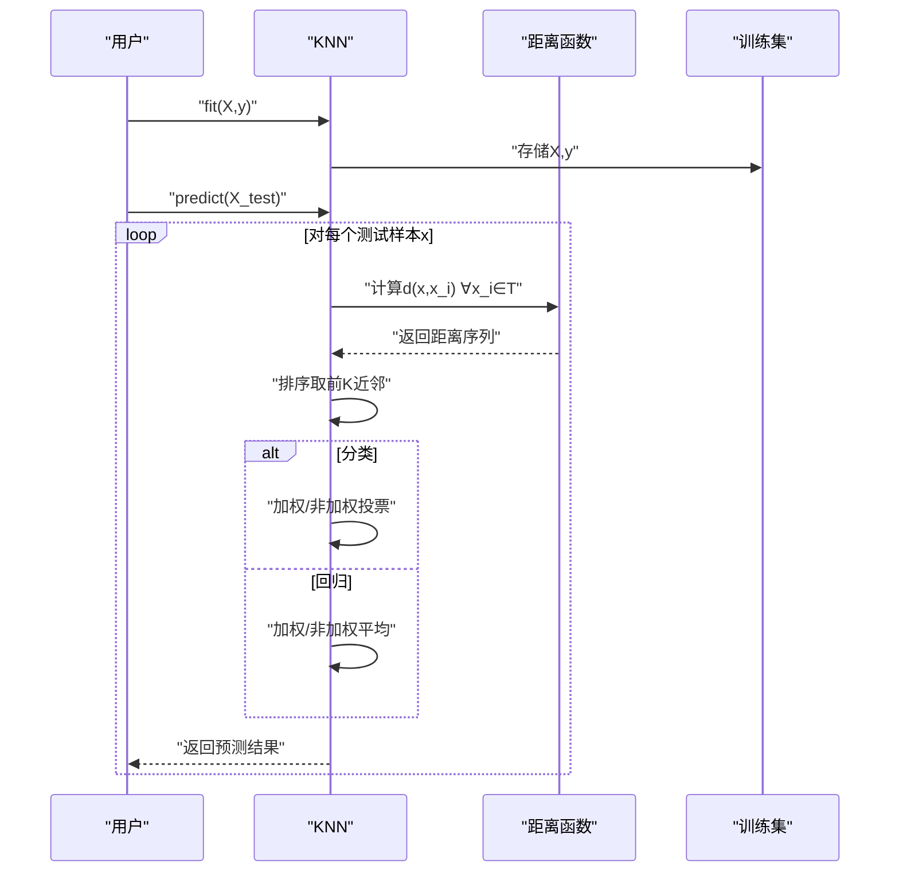
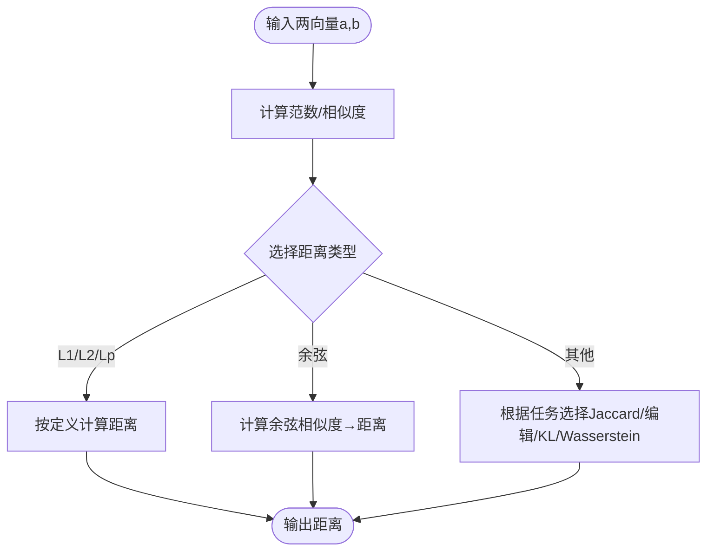
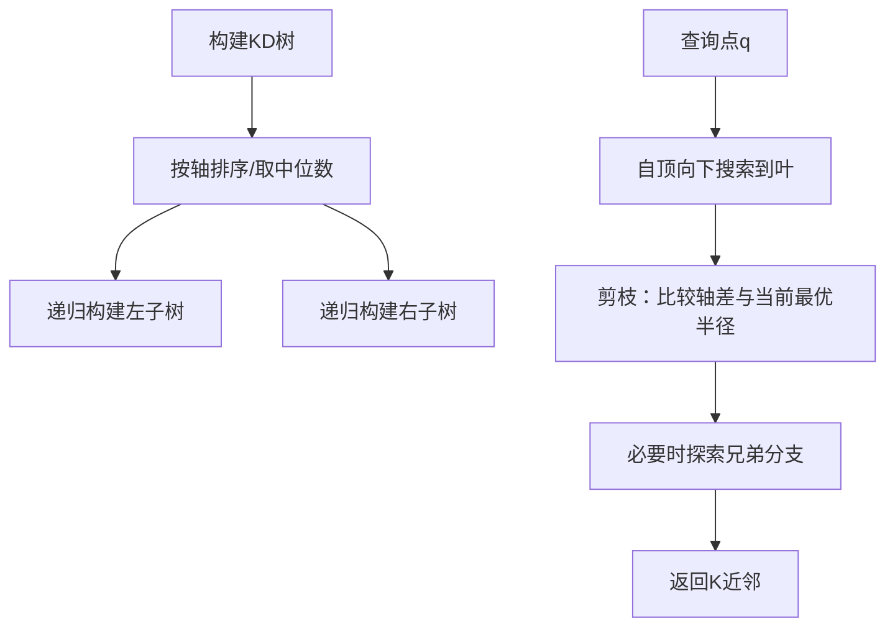
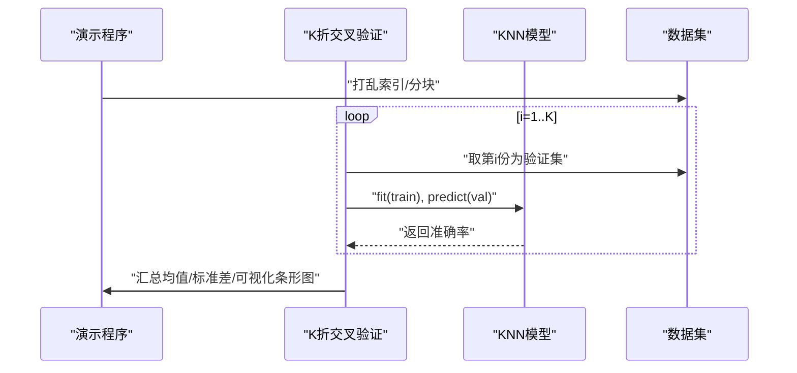
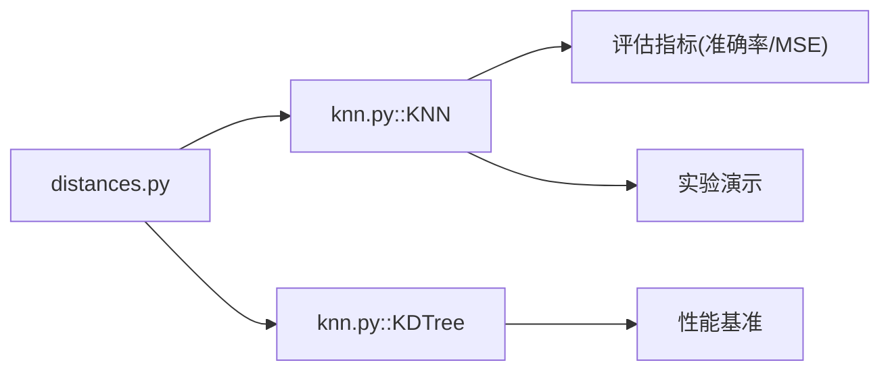

# K近邻与距离度量

<cite>
**本文引用的文件**
- [knn.py](file://phases/02-ml-fundamentals/06-knn-and-distances/code/knn.py)
- [distances.py](file://phases/01-math-foundations/14-norms-and-distances/code/distances.py)
- [figures-ml.js](file://site/figures-ml.js)
- [README.md](file://README.md)
</cite>

## 目录
1. [引言](#引言)
2. [项目结构](#项目结构)
3. [核心组件](#核心组件)
4. [架构总览](#架构总览)
5. [详细组件分析](#详细组件分析)
6. [依赖分析](#依赖分析)
7. [性能考虑](#性能考虑)
8. [故障排查指南](#故障排查指南)
9. [结论](#结论)
10. [附录](#附录)

## 引言
本文件系统性阐述K近邻（KNN）算法与距离度量在该代码库中的实现与应用，覆盖以下要点：
- KNN工作原理与实现细节（分类与回归、加权策略、懒学习特性）
- 距离度量体系（L1/L2/Cosine/Minkowski等）及其适用场景
- 关键参数与超参（K值、权重、特征缩放）对模型性能的影响
- 高维数据下的“维度灾难”现象与应对策略
- 计算效率优化（暴力搜索、KD树、交叉验证选K）

## 项目结构
本主题涉及的代码主要分布在两个模块：
- 数学基础模块：提供范数、距离、相似度等基础工具函数
- 机器学习基础模块：提供KNN分类/回归、KD树、实验演示与可视化脚本

图示来源
- [knn.py](file://phases/02-ml-fundamentals/06-knn-and-distances/code/knn.py)
- [distances.py](file://phases/01-math-foundations/14-norms-and-distances/code/distances.py)
- [figures-ml.js](file://site/figures-ml.js)

章节来源
- [knn.py](file://phases/02-ml-fundamentals/06-knn-and-distances/code/knn.py)
- [distances.py](file://phases/01-math-foundations/14-norms-and-distances/code/distances.py)
- [figures-ml.js](file://site/figures-ml.js)

## 核心组件
- 距离度量函数族
  - L1（曼哈顿）、L2（欧几里得）、余弦距离、Minkowski（包含L1/L2/切比雪夫）
  - 提供范数与距离的统一接口，便于替换与扩展
- KNN分类器
  - 支持分类与回归任务
  - 支持加权投票/加权平均（距离倒数权重）
  - 懒学习：训练仅存数据，预测时计算所有距离并排序取K近邻
- KD树
  - 低维空间高效最近邻搜索的数据结构
  - 查询路径基于坐标轴划分与剪枝策略
- 实验与演示
  - 基础KNN、距离度量对比、加权效果、回归拟合
  - 维度灾难、特征缩放、K值选择（K折交叉验证）、懒学习与预训练对比
  - 交互式可视化（K折CV、K平滑曲线）

章节来源
- [knn.py](file://phases/02-ml-fundamentals/06-knn-and-distances/code/knn.py)
- [distances.py](file://phases/01-math-foundations/14-norms-and-distances/code/distances.py)

## 架构总览
KNN与距离度量在代码库中的关系如下：

图示来源
- [knn.py](file://phases/02-ml-fundamentals/06-knn-and-distances/code/knn.py)
- [distances.py](file://phases/01-math-foundations/14-norms-and-distances/code/distances.py)

## 详细组件分析

### KNN分类器与预测流程
- 训练阶段：保存训练集（懒学习）
- 预测阶段：
  - 对每个样本计算与训练集中所有样本的距离
  - 按距离升序排序，取前K个邻居
  - 分类：按标签计票；可加权（距离倒数）
  - 回归：取目标值均值；可加权（距离倒数）

图示来源
- [knn.py](file://phases/02-ml-fundamentals/06-knn-and-distances/code/knn.py)

章节来源
- [knn.py](file://phases/02-ml-fundamentals/06-knn-and-distances/code/knn.py)

### 距离度量与范数
- L1（曼哈顿）：各维差绝对值之和，强调坐标分量独立贡献
- L2（欧几里得）：平方和开方，最常用的距离
- Lp与Minkowski：通过参数p控制对最大差异的敏感度
- 余弦距离：基于方向相似度，适合文本/高维稀疏向量
- 其他：Jaccard、编辑距离、KL散度、Wasserstein等（用于特定任务）

图示来源
- [distances.py](file://phases/01-math-foundations/14-norms-and-distances/code/distances.py)

章节来源
- [distances.py](file://phases/01-math-foundations/14-norms-and-distances/code/distances.py)

### KD树：高效最近邻搜索
- 构建：按深度轮换坐标轴，中位数分割，递归构建左右子树
- 查询：先到叶，再回溯检查是否需要探索兄弟分支（基于轴上差值与当前最优半径）

图示来源
- [knn.py](file://phases/02-ml-fundamentals/06-knn-and-distances/code/knn.py)

章节来源
- [knn.py](file://phases/02-ml-fundamentals/06-knn-and-distances/code/knn.py)

### 实验与演示：K值选择与K折交叉验证
- K值选择：通过不同K在验证集上的准确率评估，选择稳定且性能最佳的K
- K折交叉验证：将数据均匀分成K份，轮流以一份为验证集，其余为训练集，综合K次评估结果

图示来源
- [knn.py](file://phases/02-ml-fundamentals/06-knn-and-distances/code/knn.py)

章节来源
- [knn.py](file://phases/02-ml-fundamentals/06-knn-and-distances/code/knn.py)

### 交互式可视化：K平滑与K折CV
- K平滑：展示不同K下决策边界/概率曲线的平滑程度变化
- K折CV：直观显示不同K对应的验证分数分布

章节来源
- [figures-ml.js](file://site/figures-ml.js)

## 依赖分析
- KNN依赖距离度量函数族（L1/L2/Cosine/Minkowski等）
- KD树依赖L2距离进行节点距离判定与剪枝
- 实验演示依赖数据生成、标准化、训练/测试拆分与评估指标

图示来源
- [knn.py](file://phases/02-ml-fundamentals/06-knn-and-distances/code/knn.py)
- [distances.py](file://phases/01-math-foundations/14-norms-and-distances/code/distances.py)

章节来源
- [knn.py](file://phases/02-ml-fundamentals/06-knn-and-distances/code/knn.py)
- [distances.py](file://phases/01-math-foundations/14-norms-and-distances/code/distances.py)

## 性能考虑
- 计算复杂度
  - 懒学习：训练O(1)，预测O(n×d)每查询（n为样本数，d为特征维）
  - 暴力搜索：每次查询需遍历全部训练样本
- 优化策略
  - 低维空间：使用KD树/Ball树加速最近邻搜索
  - 中高维空间：考虑近似最近邻（ANN）或局部敏感哈希（LSH）
  - 特征缩放：确保各维尺度一致，避免数值不稳定
  - 数据预处理：PCA降维（保持方差占比）缓解维度灾难
- 实践建议
  - 小规模数据直接暴力搜索即可
  - 大规模数据优先KD树/Ball树或向量数据库
  - 文本/稀疏高维向量优先余弦距离+L2归一化

## 故障排查指南
- 现象：K过大导致欠拟合，K过小导致过拟合
  - 排查：通过K折交叉验证观察验证曲线，选择“拐点”或“稳定峰值”
- 现象：特征尺度差异大导致距离失准
  - 排查：检查各维均值/方差，使用标准化或归一化
- 现象：高维数据准确率下降
  - 排查：计算距离方差比，尝试PCA降维或特征选择
- 现象：预测速度慢
  - 排查：确认是否使用了KD树/Ball树；若未使用，考虑引入

章节来源
- [knn.py](file://phases/02-ml-fundamentals/06-knn-and-distances/code/knn.py)
- [distances.py](file://phases/01-math-foundations/14-norms-and-distances/code/distances.py)

## 结论
- KNN是简单而强大的懒学习算法，其性能高度依赖距离度量与参数K的选择
- 合理的距离度量（如L2/Cosine）与特征缩放是提升精度的关键
- 在大数据与高维场景下，KD树等高效搜索结构与降维技术不可或缺
- 通过K折交叉验证与可视化工具，可以稳健地完成参数调优与模型诊断

## 附录
- 参考资料与进一步阅读
  - 项目总览与背景：[README.md](file://README.md)
  - 维度灾难与降维：[README.md](file://README.md)（在数学与ML基础部分有相关内容）