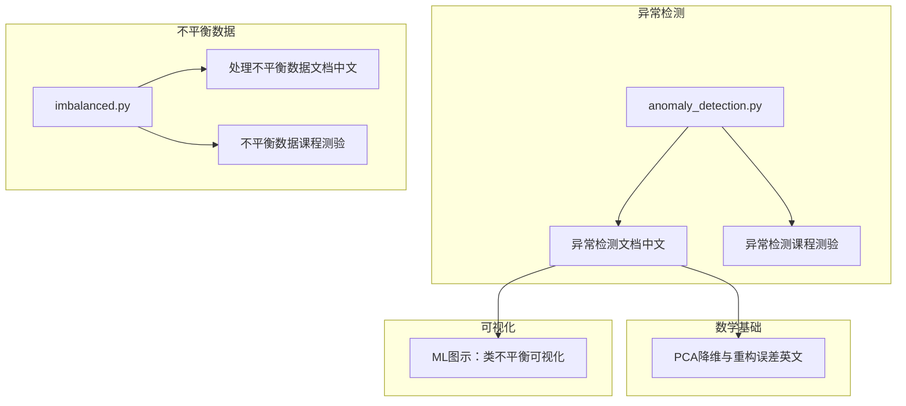
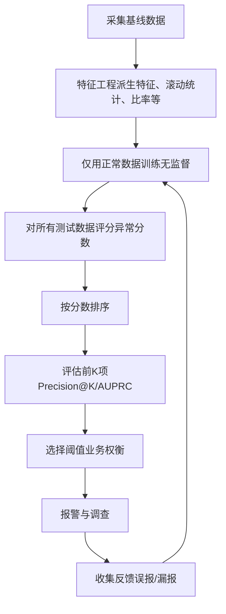
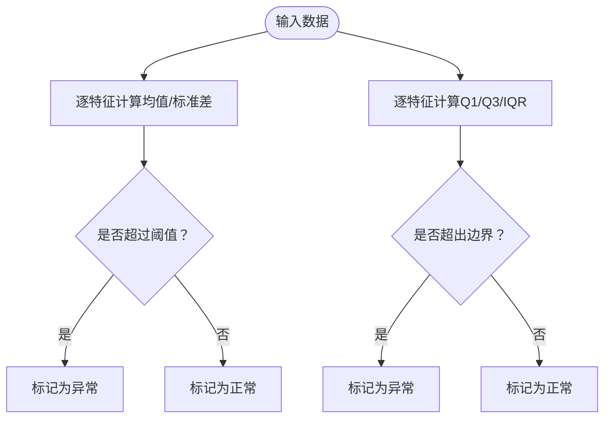
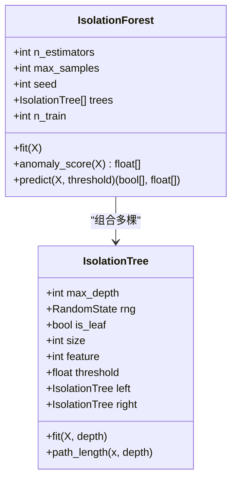
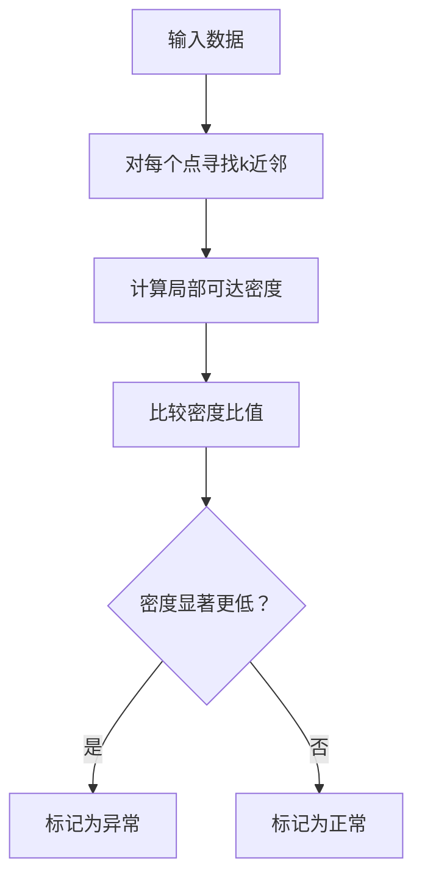
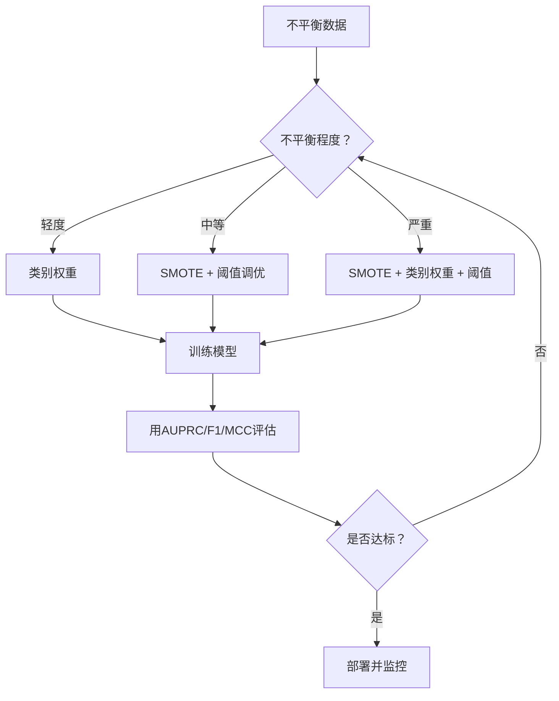
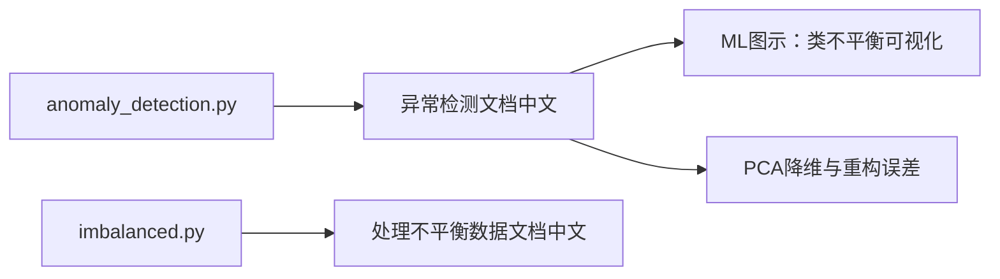

# 异常检测

<cite>
**本文引用的文件**   
- [anomaly_detection.py](file://phases/02-ml-fundamentals/16-anomaly-detection/code/anomaly_detection.py)
- [异常检测文档（中文）](file://phases/02-ml-fundamentals/16-anomaly-detection/docs/zh.md)
- [imbalanced.py](file://phases/02-ml-fundamentals/17-imbalanced-data/code/imbalanced.py)
- [处理不平衡数据文档（中文）](file://phases/02-ml-fundamentals/17-imbalanced-data/docs/zh.md)
- [异常检测课程测验](file://phases/02-ml-fundamentals/16-anomaly-detection/quiz.json)
- [不平衡数据课程测验](file://phases/02-ml-fundamentals/17-imbalanced-data/quiz.json)
- [PCA降维与重构误差（英文）](file://phases/01-math-foundamentals/10-dimensionality-reduction/docs/en.md)
- [ML图示：类不平衡可视化](file://site/figures-ml.js)
</cite>

## 目录
1. [引言](#引言)
2. [项目结构](#项目结构)
3. [核心组件](#核心组件)
4. [架构总览](#架构总览)
5. [详细组件分析](#详细组件分析)
6. [依赖关系分析](#依赖关系分析)
7. [性能考量](#性能考量)
8. [故障排查指南](#故障排查指南)
9. [结论](#结论)
10. [附录](#附录)

## 引言
本文件围绕异常检测的理论与实践展开，系统梳理基于统计（Z-score、IQR）、基于距离（孤立森林、局部异常因子 LOF）与基于密度（One-Class SVM）的主流方法，并结合不平衡数据处理策略与评估指标，提供金融欺诈检测与网络入侵检测等典型场景的落地建议。文档同时强调异常检测“对正常建模”的无监督范式，以及在生产环境中的阈值选择、特征工程与反馈闭环。

## 项目结构
本仓库中与异常检测直接相关的知识与实现主要分布在如下模块：
- 异常检测基础与实现：统计方法（Z-score、IQR）、树集成方法（孤立森林）、局部密度方法（LOF）、One-Class SVM 预览、评估与生产实践
- 不平衡数据处理：SMOTE、重采样、类别权重、阈值调优、AUPRC/MCC 等指标
- 数学基础：PCA 重构误差可用于异常检测
- 可视化与教学材料：类不平衡图示、阈值权衡图示等

图表来源
- [异常检测文档（中文）:1-460](file://phases/02-ml-fundamentals/16-anomaly-detection/docs/zh.md#L1-L460)
- [处理不平衡数据文档（中文）:1-535](file://phases/02-ml-fundamentals/17-imbalanced-data/docs/zh.md#L1-L535)
- [anomaly_detection.py:1-341](file://phases/02-ml-fundamentals/16-anomaly-detection/code/anomaly_detection.py#L1-L341)
- [imbalanced.py:1-353](file://phases/02-ml-fundamentals/17-imbalanced-data/code/imbalanced.py#L1-L353)
- [PCA降维与重构误差（英文）:172-195](file://phases/01-math-foundamentals/10-dimensionality-reduction/docs/en.md#L172-L195)
- [ML图示：类不平衡可视化:403-437](file://site/figures-ml.js#L403-L437)

章节来源
- [异常检测文档（中文）:1-460](file://phases/02-ml-fundamentals/16-anomaly-detection/docs/zh.md#L1-L460)
- [处理不平衡数据文档（中文）:1-535](file://phases/02-ml-fundamentals/17-imbalanced-data/docs/zh.md#L1-L535)

## 核心组件
- 统计方法
  - Z-score：逐特征标准化后取最大绝对偏差，阈值通常取 3 左右
  - IQR：基于四分位距的稳健边界，适合偏态与存在异常值的单变量场景
- 基于距离/树的方法
  - 孤立森林：通过随机分割快速孤立异常点，路径长度越短越异常，最终得分经期望路径长度归一化
  - 局部异常因子（LOF）：比较点的局部密度与其邻居密度，局部稀疏点为异常
- 基于密度的方法
  - One-Class SVM：在高维特征空间用核技巧拟合正常样本边界
- 不平衡数据处理
  - SMOTE：少数类样本与其 k 近邻间插值生成合成样本
  - 重采样：随机过采样/欠采样
  - 类别权重：在损失中为少数类样本赋予更高权重
  - 阈值调优：在验证集上扫描阈值，优化目标指标（如 F1 或 AUPRC）

章节来源
- [anomaly_detection.py:4-25](file://phases/02-ml-fundamentals/16-anomaly-detection/code/anomaly_detection.py#L4-L25)
- [anomaly_detection.py:90-133](file://phases/02-ml-fundamentals/16-anomaly-detection/code/anomaly_detection.py#L90-L133)
- [异常检测文档（中文）:83-186](file://phases/02-ml-fundamentals/16-anomaly-detection/docs/zh.md#L83-L186)
- [imbalanced.py:29-45](file://phases/02-ml-fundamentals/17-imbalanced-data/code/imbalanced.py#L29-L45)
- [imbalanced.py:48-87](file://phases/02-ml-fundamentals/17-imbalanced-data/code/imbalanced.py#L48-L87)
- [imbalanced.py:114-121](file://phases/02-ml-fundamentals/17-imbalanced-data/code/imbalanced.py#L114-L121)
- [imbalanced.py:158-183](file://phases/02-ml-fundamentals/17-imbalanced-data/code/imbalanced.py#L158-L183)

## 架构总览
异常检测系统的核心流程由“数据采集—特征工程—无监督建模—评分—阈值选择—报警与反馈”构成。不平衡数据贯穿训练与评估阶段，需采用 AUPRC、MCC 等指标替代准确率，并结合类别权重与阈值调优提升召回。

图表来源
- [异常检测文档（中文）:216-228](file://phases/02-ml-fundamentals/16-anomaly-detection/docs/zh.md#L216-L228)

章节来源
- [异常检测文档（中文）:216-228](file://phases/02-ml-fundamentals/16-anomaly-detection/docs/zh.md#L216-L228)

## 详细组件分析

### 统计方法：Z-score 与 IQR
- Z-score
  - 思路：对每个特征计算均值与标准差，取绝对偏差的最大值，若超过阈值则判定为异常
  - 适用：单变量、近似正态分布、无多峰
  - 限制：对多峰、偏态与训练集异常值敏感
- IQR
  - 思路：基于 Q1/Q3 与 IQR 设定边界，逐特征独立判断
  - 适用：偏态、存在异常值的单变量
  - 限制：无法发现“单独特征均正常但联合空间异常”的点

图表来源
- [anomaly_detection.py:4-11](file://phases/02-ml-fundamentals/16-anomaly-detection/code/anomaly_detection.py#L4-L11)
- [anomaly_detection.py:14-25](file://phases/02-ml-fundamentals/16-anomaly-detection/code/anomaly_detection.py#L14-L25)

章节来源
- [anomaly_detection.py:4-25](file://phases/02-ml-fundamentals/16-anomaly-detection/code/anomaly_detection.py#L4-L25)
- [异常检测文档（中文）:83-122](file://phases/02-ml-fundamentals/16-anomaly-detection/docs/zh.md#L83-L122)

### 基于距离/树：孤立森林
- 核心思想：异常点稀少且不同，随机分割时更易被快速孤立，平均路径更短
- 归一化：使用期望路径长度 c(n) 进行归一化，使不同规模数据可比
- 超参数：树数量、每树样本数、最大深度、contamination（仅用于阈值设定）

图表来源
- [anomaly_detection.py:37-88](file://phases/02-ml-fundamentals/16-anomaly-detection/code/anomaly_detection.py#L37-L88)
- [anomaly_detection.py:90-133](file://phases/02-ml-fundamentals/16-anomaly-detection/code/anomaly_detection.py#L90-L133)

章节来源
- [anomaly_detection.py:37-133](file://phases/02-ml-fundamentals/16-anomaly-detection/code/anomaly_detection.py#L37-L133)
- [异常检测文档（中文）:123-165](file://phases/02-ml-fundamentals/16-anomaly-detection/docs/zh.md#L123-L165)

### 局部异常因子（LOF）
- 思路：对每个点计算其局部可达密度（k 近邻范围内的稠密程度），与邻居密度比较，密度显著更低则为异常
- 优势：能发现局部异常，适用于不同密度簇
- 限制：复杂度较高，对 k 敏感，高维效果受维数灾难影响

图表来源
- [异常检测文档（中文）:166-186](file://phases/02-ml-fundamentals/16-anomaly-detection/docs/zh.md#L166-L186)

章节来源
- [异常检测文档（中文）:166-186](file://phases/02-ml-fundamentals/16-anomaly-detection/docs/zh.md#L166-L186)

### 基于密度：One-Class SVM
- 思路：在高维特征空间用核技巧对正常样本拟合边界，远离边界的点为异常
- 注意：核矩阵二次增长，不适合极大数据集

章节来源
- [异常检测文档（中文）:360-373](file://phases/02-ml-fundamentals/16-anomaly-detection/docs/zh.md#L360-L373)

### 不平衡数据处理与评估
- 指标替换：准确率在极度不平衡下失效，推荐 Precision@K、AUPRC、MCC
- 策略对比：随机过采样、随机欠采样、SMOTE、类别权重、阈值调优
- SMOTE：在少数类样本与其 k 近邻间插值生成新样本，避免直接复制
- 阈值调优：在验证集上扫描阈值，优化目标指标（如 F1）

图表来源
- [处理不平衡数据文档（中文）:58-74](file://phases/02-ml-fundamentals/17-imbalanced-data/docs/zh.md#L58-L74)

章节来源
- [imbalanced.py:29-45](file://phases/02-ml-fundamentals/17-imbalanced-data/code/imbalanced.py#L29-L45)
- [imbalanced.py:48-87](file://phases/02-ml-fundamentals/17-imbalanced-data/code/imbalanced.py#L48-L87)
- [imbalanced.py:114-121](file://phases/02-ml-fundamentals/17-imbalanced-data/code/imbalanced.py#L114-L121)
- [imbalanced.py:158-183](file://phases/02-ml-fundamentals/17-imbalanced-data/code/imbalanced.py#L158-L183)
- [处理不平衡数据文档（中文）:58-74](file://phases/02-ml-fundamentals/17-imbalanced-data/docs/zh.md#L58-L74)

### 评估与阈值选择
- 评估挑战：极端不平衡导致准确率误导；AUROC 在严重不平衡下也可能失真
- 推荐指标：Precision@K、AUPRC、MCC
- 阈值选择：业务驱动，权衡误报与漏报成本；可绘制精确率/召回率随阈值变化曲线辅助决策

章节来源
- [异常检测文档（中文）:196-214](file://phases/02-ml-fundamentals/16-anomaly-detection/docs/zh.md#L196-L214)
- [异常检测文档（中文）:407-416](file://phases/02-ml-fundamentals/16-anomaly-detection/docs/zh.md#L407-L416)

### 生产注意事项
- 阈值漂移：定期监控分数分布并调整阈值
- 报警疲劳：从较高阈值起步，逐步收紧
- 特征工程：原始特征不足，需加入滚动统计、比率、时间间隔等
- 反馈闭环：将人工核查结果反馈系统，持续优化

章节来源
- [异常检测文档（中文）:393-400](file://phases/02-ml-fundamentals/16-anomaly-detection/docs/zh.md#L393-L400)

## 依赖关系分析
- 代码层
  - anomaly_detection.py 提供 Z-score、IQR、孤立森林的完整实现，便于理解与扩展
  - imbalanced.py 提供 SMOTE、重采样、类别权重与阈值调优的实现，支撑不平衡场景
- 文档层
  - 异常检测文档系统阐述了方法论、评估与生产实践
  - 不平衡数据文档系统阐述了指标、策略与流程
- 可视化层
  - ML 图示提供类不平衡与阈值权衡的直观展示

图表来源
- [异常检测文档（中文）:1-460](file://phases/02-ml-fundamentals/16-anomaly-detection/docs/zh.md#L1-L460)
- [处理不平衡数据文档（中文）:1-535](file://phases/02-ml-fundamentals/17-imbalanced-data/docs/zh.md#L1-L535)
- [ML图示：类不平衡可视化:403-437](file://site/figures-ml.js#L403-L437)
- [PCA降维与重构误差（英文）:172-195](file://phases/01-math-foundamentals/10-dimensionality-reduction/docs/en.md#L172-L195)

章节来源
- [anomaly_detection.py:1-341](file://phases/02-ml-fundamentals/16-anomaly-detection/code/anomaly_detection.py#L1-L341)
- [imbalanced.py:1-353](file://phases/02-ml-fundamentals/17-imbalanced-data/code/imbalanced.py#L1-L353)

## 性能考量
- 孤立森林
  - 优点：无分布假设、高维友好、可扩展（子采样+多树）
  - 限制：密集区域易掩蔽异常、无关特征增多时随机分割效果下降
- LOF
  - 优点：检测局部异常、对不同密度簇敏感
  - 限制：复杂度高（朴素实现 O(n^2)）、对 k 与高维敏感
- One-Class SVM
  - 优点：在中小规模高维数据上表现良好
  - 限制：核矩阵二次增长，难以扩展到大规模数据
- 不平衡数据
  - SMOTE 插值生成新样本，减少过拟合风险；类别权重在期望上等价于过采样但更快
  - 阈值调优在验证集上进行，避免在测试集上过拟合

章节来源
- [异常检测文档（中文）:157-186](file://phases/02-ml-fundamentals/16-anomaly-detection/docs/zh.md#L157-L186)
- [处理不平衡数据文档（中文）:115-134](file://phases/02-ml-fundamentals/17-imbalanced-data/docs/zh.md#L115-L134)

## 故障排查指南
- 准确率误导
  - 现象：在极不平衡数据上准确率极高但召回为 0
  - 处理：改用 AUPRC、MCC、Precision@K；必要时使用阈值调优
- Z-score 失效
  - 现象：多峰、偏态或训练集中存在异常值导致阈值漂移
  - 处理：改用 IQR 或孤立森林；或对特征做变换/分箱
- 孤立森林误报过多
  - 现象：阈值过低导致误报
  - 处理：提高阈值；结合特征工程与集成策略
- LOF 计算开销大
  - 现象：数据量大时训练/推理缓慢
  - 处理：考虑近似最近邻、降维或改用孤立森林
- One-Class SVM 不适配大规模
  - 现象：内存与时间复杂度随样本数平方增长
  - 处理：改用孤立森林或降维后 One-Class SVM

章节来源
- [异常检测文档（中文）:196-214](file://phases/02-ml-fundamentals/16-anomaly-detection/docs/zh.md#L196-L214)
- [异常检测文档（中文）:393-400](file://phases/02-ml-fundamentals/16-anomaly-detection/docs/zh.md#L393-L400)
- [处理不平衡数据文档（中文）:42-57](file://phases/02-ml-fundamentals/17-imbalanced-data/docs/zh.md#L42-L57)

## 结论
异常检测的关键在于“对正常建模”，在无监督范式下应对新型异常与海量数据。统计方法（Z-score、IQR）简单高效，适合单变量与近似正态场景；孤立森林与 LOF 在高维与复杂分布中更具鲁棒性；One-Class SVM 适合中小规模高维数据。面对不平衡问题，应采用 AUPRC、MCC、Precision@K 等指标，并结合类别权重、阈值调优与 SMOTE 等策略。生产中重视特征工程、阈值漂移监控与反馈闭环，才能持续稳定地发现异常。

## 附录

### 实际应用案例要点
- 金融欺诈检测
  - 数据预处理：交易金额、时间窗口统计、商户/地域特征、用户行为画像
  - 模型训练：仅用正常交易拟合（无监督），可选孤立森林或 One-Class SVM
  - 评估：Precision@K（如前 100/500 个最高风险样本中欺诈占比）、AUPRC、MCC
  - 阈值：根据误报（调查成本）与漏报（退单/损失）成本权衡
- 网络入侵检测
  - 数据预处理：流量统计、连接时长、协议分布、端口访问模式
  - 模型训练：孤立森林或基于 PCA 的重构误差（异常点重构误差大）
  - 评估：AUPRC、MCC；关注误报（误伤正常流量）与漏报（放过攻击）
  - 阈值：结合告警抑制与人工复核流程

章节来源
- [异常检测文档（中文）:17-25](file://phases/02-ml-fundamentals/16-anomaly-detection/docs/zh.md#L17-L25)
- [PCA降维与重构误差（英文）:172-195](file://phases/01-math-foundamentals/10-dimensionality-reduction/docs/en.md#L172-L195)

### 测验要点参考
- 异常检测测验
  - 无监督框架与监督分类的权衡
  - Z-score 的适用与失效条件
  - 孤立森林与距离/密度方法的区别
  - 何时优先无监督异常检测
- 不平衡数据测验
  - 准确率失效与替代指标
  - SMOTE 的生成机制
  - 阈值下调对精确率/召回率的影响
  - AUPRC 相比 AUC-ROC 的优势

章节来源
- [异常检测课程测验:1-68](file://phases/02-ml-fundamentals/16-anomaly-detection/quiz.json#L1-L68)
- [不平衡数据课程测验:1-68](file://phases/02-ml-fundamentals/17-imbalanced-data/quiz.json#L1-L68)