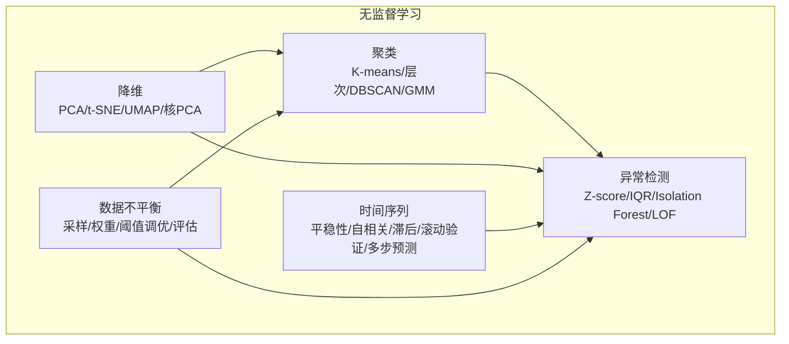
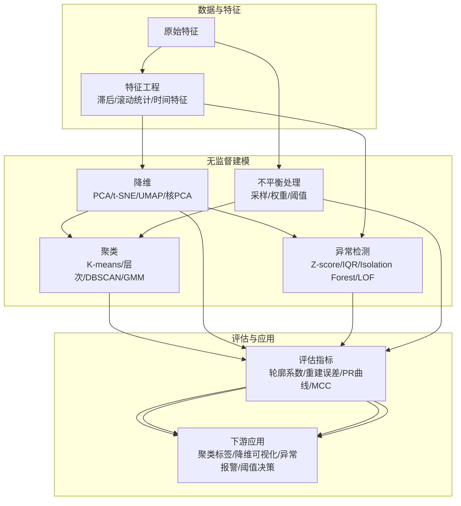
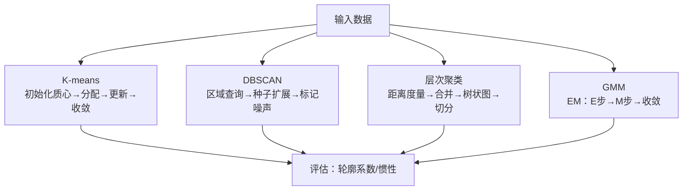
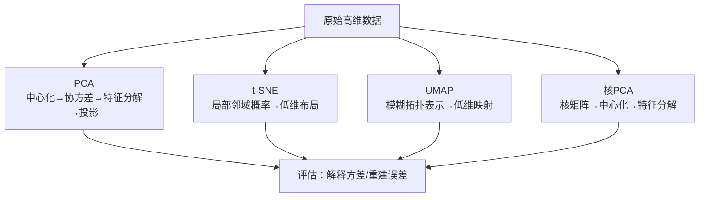
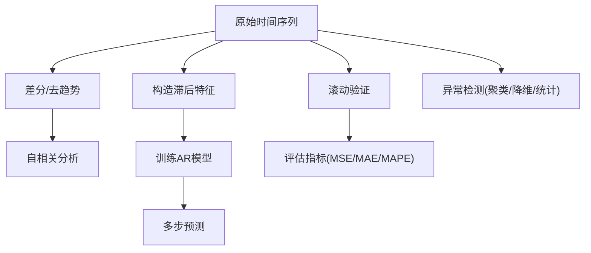
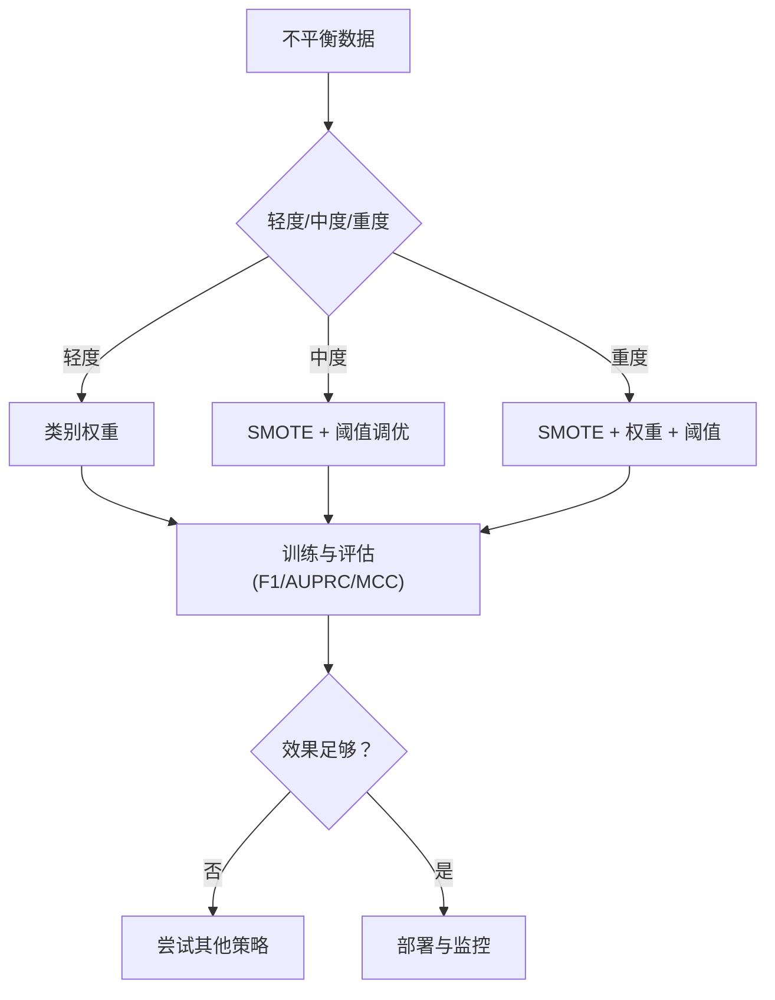
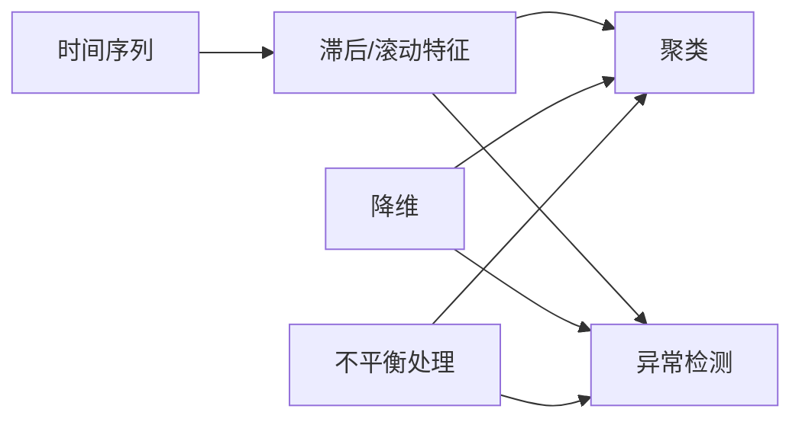

# 无监督学习算法

<cite>
**本文引用的文件**
- [clustering.py](file://phases/02-ml-fundamentals/07-unsupervised-learning/code/clustering.py)
- [unsupervised-learning 文档](file://phases/02-ml-fundamentals/07-unsupervised-learning/docs/en.md)
- [skill-clustering-guide.md](file://phases/02-ml-fundamentals/07-unsupervised-learning/outputs/skill-clustering-guide.md)
- [time_series.py](file://phases/02-ml-fundamentals/15-time-series/code/time_series.py)
- [anomaly_detection.py](file://phases/02-ml-fundamentals/16-anomaly-detection/code/anomaly_detection.py)
- [anomaly-detection 文档](file://phases/02-ml-fundamentals/16-anomaly-detection/docs/en.md)
- [imbalanced.py](file://phases/02-ml-fundamentals/17-imbalanced-data/code/imbalanced.py)
- [imbalanced-data 文档](file://phases/02-ml-fundamentals/17-imbalanced-data/docs/en.md)
- [dimensionality_reduction 文档](file://phases/01-math-foundations/10-dimensionality-reduction/docs/en.md)
- [skill-dimensionality-reduction.md](file://phases/01-math-foundamentals/10-dimensionality-reduction/outputs/skill-dimensionality-reduction.md)
</cite>

## 目录
1. [引言](#引言)
2. [项目结构](#项目结构)
3. [核心组件](#核心组件)
4. [架构总览](#架构总览)
5. [详细组件分析](#详细组件分析)
6. [依赖分析](#依赖分析)
7. [性能考虑](#性能考虑)
8. [故障排查指南](#故障排查指南)
9. [结论](#结论)
10. [附录](#附录)

## 引言
本文件系统性梳理仓库中与“无监督学习”相关的实现与知识，覆盖以下主题：
- 聚类：K-means、层次聚类（凝聚式）、DBSCAN、高斯混合模型（GMM）
- 降维：主成分分析（PCA）、t-SNE、UMAP、核PCA
- 时间序列分析与异常检测：平稳性检验、自相关、滞后特征、滚动验证、多步预测
- 数据不平衡：采样策略（随机过采样、随机欠采样、SMOTE）、类别权重、阈值调优、评估指标
- 实战案例与代码路径指引

## 项目结构
围绕无监督学习的关键代码与文档分布如下：
- 聚类与降维：位于“机器学习基础/无监督学习”与“数学基础/降维”模块
- 时间序列：位于“机器学习基础/时间序列”
- 异常检测：位于“机器学习基础/异常检测”
- 数据不平衡：位于“机器学习基础/数据不平衡”

图示来源
- [clustering.py:1-398](file://phases/02-ml-fundamentals/07-unsupervised-learning/code/clustering.py#L1-L398)
- [time_series.py:1-353](file://phases/02-ml-fundamentals/15-time-series/code/time_series.py#L1-L353)
- [anomaly_detection.py:1-341](file://phases/02-ml-fundamentals/16-anomaly-detection/code/anomaly_detection.py#L1-L341)
- [imbalanced.py:1-353](file://phases/02-ml-fundamentals/17-imbalanced-data/code/imbalanced.py#L1-L353)
- [dimensionality_reduction 文档:1-375](file://phases/01-math-foundations/10-dimensionality-reduction/docs/en.md#L1-L375)

章节来源
- [unsupervised-learning 文档:1-502](file://phases/02-ml-fundamentals/07-unsupervised-learning/docs/en.md#L1-L502)
- [anomaly-detection 文档:1-460](file://phases/02-ml-fundamentals/16-anomaly-detection/docs/en.md#L1-L460)
- [imbalanced-data 文档:1-535](file://phases/02-ml-fundamentals/17-imbalanced-data/docs/en.md#L1-L535)
- [dimensionality_reduction 文档:1-375](file://phases/01-math-foundations/10-dimensionality-reduction/docs/en.md#L1-L375)

## 核心组件
- 聚类算法实现：K-means、DBSCAN、层次聚类（凝聚式 Ward/单/全/平均）、GMM（EM）
- 降维方法：PCA、t-SNE、UMAP、核PCA
- 时间序列工具：合成数据生成、差分、滚动窗口统计、自相关、滞后特征、滚动验证、多步预测
- 异常检测：Z-score、IQR、Isolation Forest、Local Outlier Factor（LOF）
- 不平衡数据处理：随机过采样、随机欠采样、SMOTE、类别权重、阈值优化、综合评估

章节来源
- [clustering.py:1-398](file://phases/02-ml-fundamentals/07-unsupervised-learning/code/clustering.py#L1-L398)
- [time_series.py:1-353](file://phases/02-ml-fundamentals/15-time-series/code/time_series.py#L1-L353)
- [anomaly_detection.py:1-341](file://phases/02-ml-fundamentals/16-anomaly-detection/code/anomaly_detection.py#L1-L341)
- [imbalanced.py:1-353](file://phases/02-ml-fundamentals/17-imbalanced-data/code/imbalanced.py#L1-L353)
- [dimensionality_reduction 文档:1-375](file://phases/01-math-foundations/10-dimensionality-reduction/docs/en.md#L1-L375)

## 架构总览
下图展示无监督学习各子任务之间的关系与典型工作流。

图示来源
- [unsupervised-learning 文档:1-502](file://phases/02-ml-fundamentals/07-unsupervised-learning/docs/en.md#L1-L502)
- [anomaly-detection 文档:1-460](file://phases/02-ml-fundamentals/16-anomaly-detection/docs/en.md#L1-L460)
- [imbalanced-data 文档:1-535](file://phases/02-ml-fundamentals/17-imbalanced-data/docs/en.md#L1-L535)
- [dimensionality_reduction 文档:1-375](file://phases/01-math-foundations/10-dimensionality-reduction/docs/en.md#L1-L375)

## 详细组件分析

### 聚类算法
- K-means：迭代分配与重算质心；支持肘部法与轮廓系数选K；适合球状簇、大规模数据
- DBSCAN：基于密度发现任意形状簇并自动识别噪声；需调参 eps 与 min_samples
- 层次聚类（凝聚式）：自底向上合并，支持单/全/均/ Ward 链接；适合小规模、需要树状结构
- 高斯混合模型（GMM）：软分配、椭圆簇、可处理重叠；用 EM 算法估计参数

图示来源
- [clustering.py:9-45](file://phases/02-ml-fundamentals/07-unsupervised-learning/code/clustering.py#L9-L45)
- [clustering.py:111-159](file://phases/02-ml-fundamentals/07-unsupervised-learning/code/clustering.py#L111-L159)
- [clustering.py:224-302](file://phases/02-ml-fundamentals/07-unsupervised-learning/code/clustering.py#L224-L302)
- [clustering.py:162-221](file://phases/02-ml-fundamentals/07-unsupervised-learning/code/clustering.py#L162-L221)

章节来源
- [unsupervised-learning 文档:44-117](file://phases/02-ml-fundamentals/07-unsupervised-learning/docs/en.md#L44-L117)
- [clustering.py:1-398](file://phases/02-ml-fundamentals/07-unsupervised-learning/code/clustering.py#L1-L398)
- [skill-clustering-guide.md:1-78](file://phases/02-ml-fundamentals/07-unsupervised-learning/outputs/skill-clustering-guide.md#L1-L78)

### 降维技术
- PCA：中心化→协方差→特征分解→投影；用解释方差比与肘部法选维度；可做重建误差用于异常检测
- t-SNE：保局部邻域概率，适合可视化；非线性、随机、慢
- UMAP：更快、更好全局结构；近似 NN 图
- 核PCA：核技巧映射到高维特征空间再降维，适合非线性流形

图示来源
- [dimensionality_reduction 文档:45-195](file://phases/01-math-foundations/10-dimensionality-reduction/docs/en.md#L45-L195)
- [clustering.py:384-398](file://phases/02-ml-fundamentals/07-unsupervised-learning/code/clustering.py#L384-L398)

章节来源
- [dimensionality_reduction 文档:1-375](file://phases/01-math-foundations/10-dimensionality-reduction/docs/en.md#L1-L375)
- [skill-dimensionality-reduction.md:1-33](file://phases/01-math-foundations/10-dimensionality-reduction/outputs/skill-dimensionality-reduction.md#L1-L33)

### 时间序列分析与异常检测
- 数据生成：合成趋势+季节性+噪声；周期性序列
- 平稳性检验：滚动均值/方差对比；判断是否需要差分
- 自相关分析：计算滞后自相关；显著滞后指示周期性
- 滞后特征：构造 X/y；训练 AR 模型；多步预测
- 滚动验证：walk-forward 分割；更贴近生产时序特性
- 异常检测：结合聚类/降维/统计方法识别偏离正常模式的点

图示来源
- [time_series.py:4-353](file://phases/02-ml-fundamentals/15-time-series/code/time_series.py#L4-L353)
- [anomaly_detection.py:1-341](file://phases/02-ml-fundamentals/16-anomaly-detection/code/anomaly_detection.py#L1-L341)

章节来源
- [time_series.py:1-353](file://phases/02-ml-fundamentals/15-time-series/code/time_series.py#L1-L353)
- [anomaly-detection 文档:1-460](file://phases/02-ml-fundamentals/16-anomaly-detection/docs/en.md#L1-L460)

### 数据不平衡问题
- 识别：准确率误导；应关注精确率、召回率、F1、AUPRC、MCC
- 处理策略：
  - 采样：随机过采样、随机欠采样、SMOTE（合成少数类）
  - 类别权重：在损失函数中提高少数类误判成本
  - 阈值调优：在验证集上寻找最优阈值最大化目标指标
- 综合流程：采样/权重/阈值组合，持续监控与反馈

图示来源
- [imbalanced-data 文档:58-212](file://phases/02-ml-fundamentals/17-imbalanced-data/docs/en.md#L58-L212)
- [imbalanced.py:1-353](file://phases/02-ml-fundamentals/17-imbalanced-data/code/imbalanced.py#L1-L353)

章节来源
- [imbalanced-data 文档:1-535](file://phases/02-ml-fundamentals/17-imbalanced-data/docs/en.md#L1-L535)
- [imbalanced.py:1-353](file://phases/02-ml-fundamentals/17-imbalanced-data/code/imbalanced.py#L1-L353)

## 依赖分析
- 聚类与降维：聚类结果常作为下游模型输入（如分类器前的降维），异常检测可复用聚类/降维得到的嵌入
- 时间序列：滞后特征与滚动验证依赖于平稳性与自相关分析；异常检测可结合时间特征
- 不平衡数据：采样与权重策略可与聚类/异常检测联合使用，提升少数类识别能力

图示来源
- [time_series.py:75-104](file://phases/02-ml-fundamentals/15-time-series/code/time_series.py#L75-L104)
- [clustering.py:305-335](file://phases/02-ml-fundamentals/07-unsupervised-learning/code/clustering.py#L305-L335)
- [anomaly_detection.py:135-178](file://phases/02-ml-fundamentals/16-anomaly-detection/code/anomaly_detection.py#L135-L178)
- [imbalanced.py:29-87](file://phases/02-ml-fundamentals/17-imbalanced-data/code/imbalanced.py#L29-L87)

## 性能考虑
- 聚类
  - K-means：O(n·k·i·d)，适合大规模；建议多次随机初始化或使用 K-means++
  - DBSCAN：朴素实现 O(n^2)；可用 k-NN/索引优化；eps 与 min_samples 影响性能与质量
  - 层次聚类：O(n^3) 时间、O(n^2) 内存，仅适用于中小规模
  - GMM：EM 迭代次数影响性能；高维时注意协方差正则化
- 降维
  - PCA：O(min(n^2d, d^2n))；大样本优先考虑增量/随机化变体
  - t-SNE/UMAP：t-SNE 默认 O(n^2)；UMAP 更高效，适合大规模
  - 核PCA：核矩阵 O(n^2)，内存受限
- 时间序列
  - 差分与自相关：计算量与窗口长度相关；滚动验证按折数线性增长
- 异常检测
  - Z-score/IQR：向量化实现极快；Isolation Forest：树数量与子采样决定速度与稳定性
  - LOF：朴素实现 O(n^2)，高维表现受“维度诅咒”影响
- 不平衡数据
  - SMOTE：k-NN 计算开销；随机过采样/欠采样最简单但可能过拟合或丢失信息

## 故障排查指南
- 聚类
  - K-means 收敛慢或陷入局部最优：尝试 K-means++ 初始化、多随机种子、调整最大迭代
  - DBSCAN 参数不当：eps 过大/过小导致全簇或全噪声；用 k-距离图辅助选择 eps
  - 层次聚类内存溢出：改用 MiniBatch K-Means 或 BIRCH
  - GMM 发散：正则化协方差、合理初始化、检查维度与样本数
- 降维
  - PCA 解释方差不足：增大组件数或采用核PCA；检查特征缩放
  - t-SNE/UMAP 结果不稳定：固定随机种子；t-SNE 对超参敏感，建议先小数据集调参
- 时间序列
  - 自相关显著滞后不明显：检查差分是否过度；确认周期长度与采样频率
  - 滚动验证分数偏乐观：确保严格的时间顺序分割，避免未来信息泄漏
- 异常检测
  - Z-score/IQR 对多峰/非高斯无效：改用 Isolation Forest 或 LOF
  - 阈值漂移：定期重新校准阈值；记录异常分数分布
- 不平衡数据
  - 准确率虚高：改用 F1、AUPRC、MCC；SMOTE 合成边界噪声：适当降低合成比例或使用改进版 SMOTE

章节来源
- [unsupervised-learning 文档:496-502](file://phases/02-ml-fundamentals/07-unsupervised-learning/docs/en.md#L496-L502)
- [anomaly-detection 文档:196-228](file://phases/02-ml-fundamentals/16-anomaly-detection/docs/en.md#L196-L228)
- [imbalanced-data 文档:515-535](file://phases/02-ml-fundamentals/17-imbalanced-data/docs/en.md#L515-L535)

## 结论
本仓库提供了从理论到实践的一站式无监督学习实现与指导：
- 聚类与降维：从基础算法到可视化与异常检测应用
- 时间序列：从特征工程到稳健的时序评估
- 异常检测：多种方法对比与生产级管线
- 不平衡数据：系统化的采样、权重与阈值策略

建议在实际项目中：
- 先用降维与聚类探索数据结构，再引入异常检测
- 使用滚动验证评估时间序列模型
- 针对不平衡问题，优先类别权重+阈值调优，必要时结合 SMOTE
- 将异常检测与不平衡处理纳入持续监控与反馈闭环

## 附录
- 实际案例与代码路径
  - 聚类：参考 [clustering.py:338-398](file://phases/02-ml-fundamentals/07-unsupervised-learning/code/clustering.py#L338-L398)
  - 降维：参考 [dimensionality_reduction 文档:197-311](file://phases/01-math-foundations/10-dimensionality-reduction/docs/en.md#L197-L311)
  - 时间序列：参考 [time_series.py:162-353](file://phases/02-ml-fundamentals/15-time-series/code/time_series.py#L162-L353)
  - 异常检测：参考 [anomaly_detection.py:204-341](file://phases/02-ml-fundamentals/16-anomaly-detection/code/anomaly_detection.py#L204-L341)
  - 不平衡数据：参考 [imbalanced.py:203-353](file://phases/02-ml-fundamentals/17-imbalanced-data/code/imbalanced.py#L203-L353)