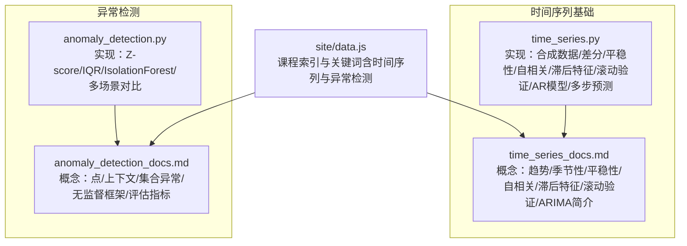
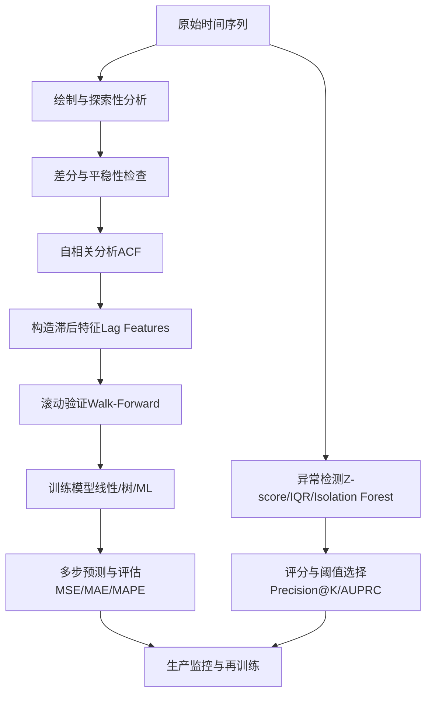
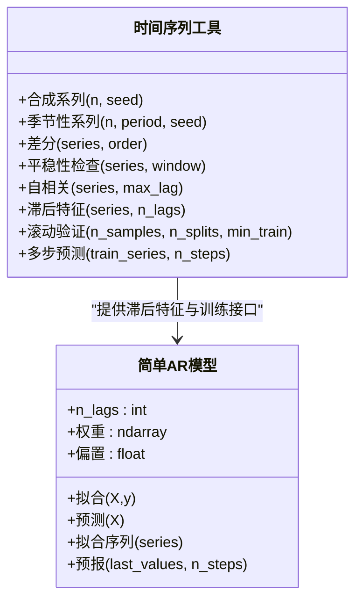
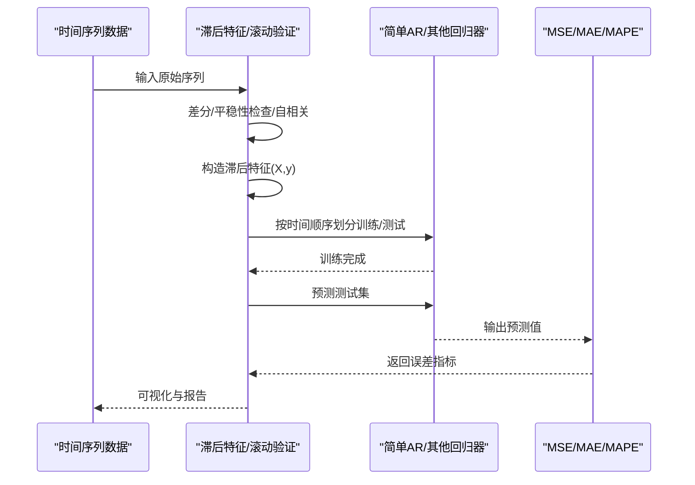
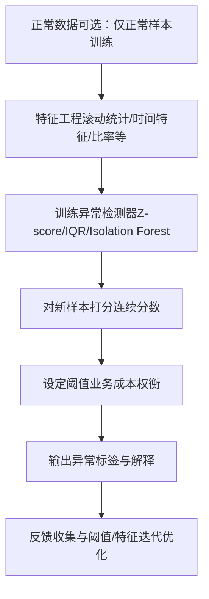

# 时间序列分析

<cite>
**本文引用的文件**
- [phases/02-ml-fundamentals/15-time-series/code/time_series.py](file://phases/02-ml-fundamentals/15-time-series/code/time_series.py)
- [phases/02-ml-fundamentals/15-time-series/docs/en.md](file://phases/02-ml-fundamentals/15-time-series/docs/en.md)
- [phases/02-ml-fundamentals/16-anomaly-detection/code/anomaly_detection.py](file://phases/02-ml-fundamentals/16-anomaly-detection/code/anomaly_detection.py)
- [phases/02-ml-fundamentals/16-anomaly-detection/docs/en.md](file://phases/02-ml-fundamentals/16-anomaly-detection/docs/en.md)
- [site/data.js](file://site/data.js)
</cite>

## 目录
1. [引言](#引言)
2. [项目结构](#项目结构)
3. [核心组件](#核心组件)
4. [架构总览](#架构总览)
5. [详细组件分析](#详细组件分析)
6. [依赖关系分析](#依赖关系分析)
7. [性能考量](#性能考量)
8. [故障排查指南](#故障排查指南)
9. [结论](#结论)
10. [附录](#附录)

## 引言
本文件系统化梳理仓库中与“时间序列分析”相关的教学与实现资源，围绕以下目标展开：时间序列基本概念（趋势、季节性、残差）、平稳性检验、自相关分析、滚动窗口验证、经典统计模型（ARIMA 简介）、现代机器学习方法（基于滞后特征的线性/树模型）以及无监督学习在异常检测中的应用。文档同时给出可操作的实践建议、可视化图示与常见陷阱，帮助读者从理论到工程落地。

## 项目结构
与时间序列分析直接相关的模块主要分布在“机器学习基础”阶段的两门课程中：
- 时间序列基础与建模：包含合成数据生成、差分、平稳性检查、自相关、滞后特征构造、滚动验证、简单自回归模型与多步预测演示。
- 异常检测：包含 Z-score、IQR、Isolation Forest 等无监督方法，以及在多峰/高维场景下的对比实验。

图表来源
- [phases/02-ml-fundamentals/15-time-series/code/time_series.py](file://phases/02-ml-fundamentals/15-time-series/code/time_series.py)
- [phases/02-ml-fundamentals/15-time-series/docs/en.md](file://phases/02-ml-fundamentals/15-time-series/docs/en.md)
- [phases/02-ml-fundamentals/16-anomaly-detection/code/anomaly_detection.py](file://phases/02-ml-fundamentals/16-anomaly-detection/code/anomaly_detection.py)
- [phases/02-ml-fundamentals/16-anomaly-detection/docs/en.md](file://phases/02-ml-fundamentals/16-anomaly-detection/docs/en.md)
- [site/data.js](file://site/data.js)

章节来源
- [phases/02-ml-fundamentals/15-time-series/code/time_series.py](file://phases/02-ml-fundamentals/15-time-series/code/time_series.py)
- [phases/02-ml-fundamentals/15-time-series/docs/en.md](file://phases/02-ml-fundamentals/15-time-series/docs/en.md)
- [phases/02-ml-fundamentals/16-anomaly-detection/code/anomaly_detection.py](file://phases/02-ml-fundamentals/16-anomaly-detection/code/anomaly_detection.py)
- [phases/02-ml-fundamentals/16-anomaly-detection/docs/en.md](file://phases/02-ml-fundamentals/16-anomaly-detection/docs/en.md)
- [site/data.js](file://site/data.js)

## 核心组件
- 合成与季节性数据生成：用于演示趋势+季节性的组合，便于后续差分与自相关分析。
- 差分与平稳性检查：滚动均值/方差与半段统计比较，判断是否需要一阶或二阶差分。
- 自相关分析：计算 ACF 并给出显著性阈值，识别周期性（如周/月）。
- 滞后特征与简单 AR 模型：将时间序列转为监督学习问题，使用最小二乘拟合权重并支持多步递归预测。
- 滚动验证（Walk-Forward）：严格的时间顺序划分，避免未来信息泄漏，模拟生产部署的评估方式。
- 评估指标：MSE、MAE、MAPE，并强调与基线（持久、季节性、移动平均）的对比。
- 异常检测：Z-score、IQR、Isolation Forest 的从零实现与对比，覆盖单峰与多峰场景。

章节来源
- [phases/02-ml-fundamentals/15-time-series/code/time_series.py](file://phases/02-ml-fundamentals/15-time-series/code/time_series.py)
- [phases/02-ml-fundamentals/15-time-series/docs/en.md](file://phases/02-ml-fundamentals/15-time-series/docs/en.md)
- [phases/02-ml-fundamentals/16-anomaly-detection/code/anomaly_detection.py](file://phases/02-ml-fundamentals/16-anomaly-detection/code/anomaly_detection.py)
- [phases/02-ml-fundamentals/16-anomaly-detection/docs/en.md](file://phases/02-ml-fundamentals/16-anomaly-detection/docs/en.md)

## 架构总览
下图展示了时间序列从数据准备到模型训练与评估的关键流程，以及与异常检测的关系：前者关注“预测未来”，后者关注“偏离常态”。

图表来源
- [phases/02-ml-fundamentals/15-time-series/code/time_series.py](file://phases/02-ml-fundamentals/15-time-series/code/time_series.py)
- [phases/02-ml-fundamentals/16-anomaly-detection/code/anomaly_detection.py](file://phases/02-ml-fundamentals/16-anomaly-detection/code/anomaly_detection.py)

## 详细组件分析

### 组件A：时间序列基础工具链
- 合成与季节性数据生成：支持趋势项、正弦季节项与噪声叠加，便于构造真实感强的演示数据。
- 差分与平稳性检查：滚动窗口统计与前后半段统计量对比，直观判断是否需要差分及差分次数。
- 自相关分析：计算 ACF 并给出显著性阈值，辅助确定滞后数量与周期性。
- 滞后特征与 AR 模型：将时间序列转换为监督学习问题，使用最小二乘求解权重；支持多步递归预测。
- 滚动验证：按时间顺序划分训练/测试集，避免未来信息泄漏。
- 评估指标：MSE、MAE、MAPE，并强调与基线的对比。

图表来源
- [phases/02-ml-fundamentals/15-time-series/code/time_series.py](file://phases/02-ml-fundamentals/15-time-series/code/time_series.py)

章节来源
- [phases/02-ml-fundamentals/15-time-series/code/time_series.py](file://phases/02-ml-fundamentals/15-time-series/code/time_series.py)
- [phases/02-ml-fundamentals/15-time-series/docs/en.md](file://phases/02-ml-fundamentals/15-time-series/docs/en.md)

### 组件B：滚动验证与模型训练流程
- 随机分割 vs 滚动验证：通过对比展示随机分割可能过度乐观，而滚动验证更接近生产表现。
- 多种滞后数量的比较：观察不同 n_lags 对误差的影响，指导滞后选择。
- 多步预测策略：递归（误差会累积）与直接（每个步长单独建模）的权衡。

图表来源
- [phases/02-ml-fundamentals/15-time-series/code/time_series.py](file://phases/02-ml-fundamentals/15-time-series/code/time_series.py)

章节来源
- [phases/02-ml-fundamentals/15-time-series/code/time_series.py](file://phases/02-ml-fundamentals/15-time-series/code/time_series.py)

### 组件C：异常检测（无监督）
- Z-score：对每维特征计算均值/标准差，按阈值判定异常；对多峰/右偏数据效果有限。
- IQR：基于四分位距的稳健方法，适合单变量异常检测；无法捕捉联合空间中的异常。
- Isolation Forest：基于随机切割的孤立森林，短路径代表异常；天然支持高维与混合类型特征。
- 多场景对比：单峰注入离群点、多峰数据、高维稀疏异常，评估 Precision@K、召回与 F1。

图表来源
- [phases/02-ml-fundamentals/16-anomaly-detection/code/anomaly_detection.py](file://phases/02-ml-fundamentals/16-anomaly-detection/code/anomaly_detection.py)

章节来源
- [phases/02-ml-fundamentals/16-anomaly-detection/code/anomaly_detection.py](file://phases/02-ml-fundamentals/16-anomaly-detection/code/anomaly_detection.py)
- [phases/02-ml-fundamentals/16-anomaly-detection/docs/en.md](file://phases/02-ml-fundamentals/16-anomaly-detection/docs/en.md)

### 组件D：时间序列预测方法概览
- 经典统计模型：ARIMA（自回归/差分/移动平均）作为时间序列建模的“教科书”起点，适合单变量短期预测。
- 现代 ML 方法：以滞后特征为核心，结合线性回归、梯度提升等，天然支持外部特征与时序外生变量。
- 深度学习：仓库未直接提供 LSTM 实现，但时间序列基础课已涵盖 ARIMA 与滞后特征方法，为后续引入神经网络打下基础。

章节来源
- [phases/02-ml-fundamentals/15-time-series/docs/en.md](file://phases/02-ml-fundamentals/15-time-series/docs/en.md)

## 依赖关系分析
- 时间序列工具链内部高度内聚：差分/平稳性/自相关/滞后特征/滚动验证/AR 模型形成闭环，支撑端到端的预测工作流。
- 异常检测与时间序列互补：前者关注“偏离常态”，后者关注“未来值”。两者均可受益于相同的特征工程（滚动统计、日历特征）。
- 课程索引与关键词：站点数据中明确列出时间序列与异常检测课程，体现其在知识体系中的定位。

图表来源
- [phases/02-ml-fundamentals/15-time-series/code/time_series.py](file://phases/02-ml-fundamentals/15-time-series/code/time_series.py)
- [phases/02-ml-fundamentals/16-anomaly-detection/code/anomaly_detection.py](file://phases/02-ml-fundamentals/16-anomaly-detection/code/anomaly_detection.py)
- [site/data.js](file://site/data.js)

章节来源
- [site/data.js](file://site/data.js)

## 性能考量
- 滞后特征数量：ACF 显著滞后决定 n_lags 上限，过多滞后会增加过拟风险与计算成本。
- 滚动验证优于随机分割：避免未来信息泄漏，更贴近生产性能。
- 差分策略：尽量使序列平稳，提升线性模型与统计模型的稳定性。
- 评估指标选择：MAE 易解释，RMSE 对大偏差敏感，MAPE 无量纲但对零值无效；应结合业务语义选择。
- 基线对比：持久、季节性、移动平均等简单基线是模型能力的“底线”，若无法超越需审视特征或评估方式。

## 故障排查指南
- 常见错误与修复
  - 使用随机分割进行时间序列评估：改为滚动验证。
  - 特征包含未来值（目标对齐陷阱）：确保所有特征均来自 t-1 或更早。
  - 过度拟合季节性：在测试集中保留至少一个完整周期。
  - 忽略尺度变化：考虑百分比变化而非绝对值。
  - 滞后过多：用 ACF 确定合理滞后范围。
  - 不做差分：线性模型需要平稳性，树模型相对鲁棒但差分通常有益。
- 异常检测
  - Z-score/IQR 对多峰/右偏数据效果有限：优先尝试 Isolation Forest。
  - 阈值漂移：定期监控异常分数分布并调整阈值。
  - 误报疲劳：采用多方法融合与业务阈值权衡。

章节来源
- [phases/02-ml-fundamentals/15-time-series/docs/en.md](file://phases/02-ml-fundamentals/15-time-series/docs/en.md)
- [phases/02-ml-fundamentals/16-anomaly-detection/docs/en.md](file://phases/02-ml-fundamentals/16-anomaly-detection/docs/en.md)

## 结论
本仓库提供了时间序列分析的“从零到一”实现与教学材料：从数据生成、差分与平稳性、自相关分析，到滞后特征与滚动验证，再到简单 AR 模型与多步预测策略。同时，异常检测模块展示了无监督视角下“偏离常态”的识别方法。这些组件共同构成可复用的工程化工作流，既可用于教学演示，也可作为生产级时间序列任务的起点。

## 附录
- 实际案例建议
  - 股价预测：以收盘价序列为例，先做差分与 ACF 分析，构造滞后特征，使用滚动验证评估线性/树模型；对高频序列可加入交易量、技术指标等外部特征。
  - 销售预测：以日/周销量为例，加入节假日、促销、天气等外部变量，使用滚动验证与基线对比（持久、季节性、移动平均）。
- 进一步阅读
  - Hyndman《Forecasting: Principles and Practice》第三版（免费在线教材）
  - scikit-learn TimeSeriesSplit 文档
  - statsmodels ARIMA 文档

章节来源
- [phases/02-ml-fundamentals/15-time-series/docs/en.md](file://phases/02-ml-fundamentals/15-time-series/docs/en.md)
- [phases/02-ml-fundamentals/16-anomaly-detection/docs/en.md](file://phases/02-ml-fundamentals/16-anomaly-detection/docs/en.md)