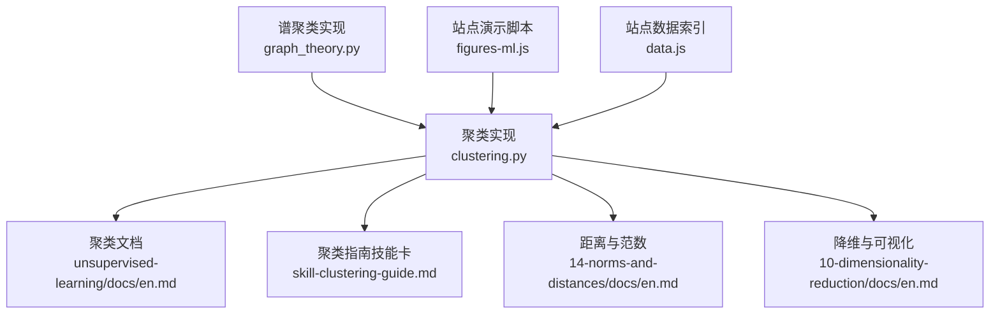
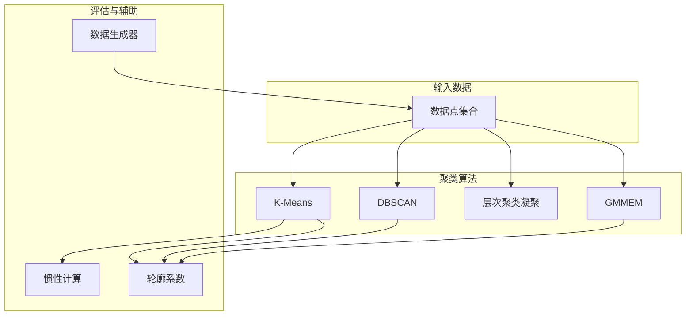
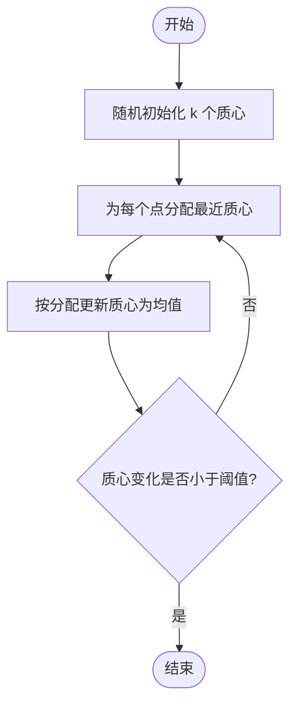
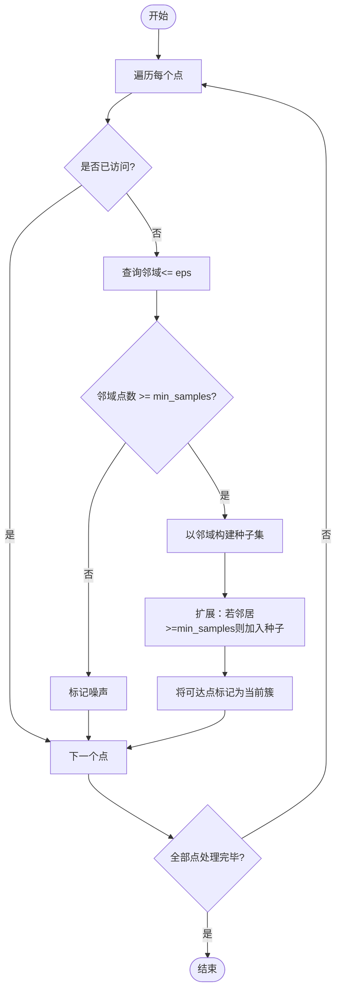
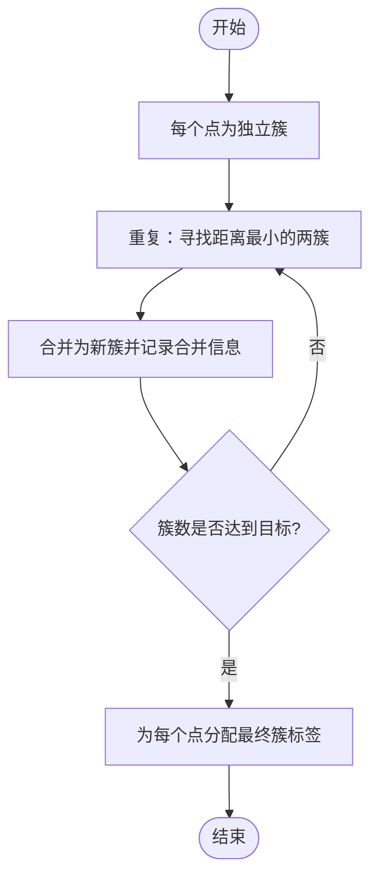
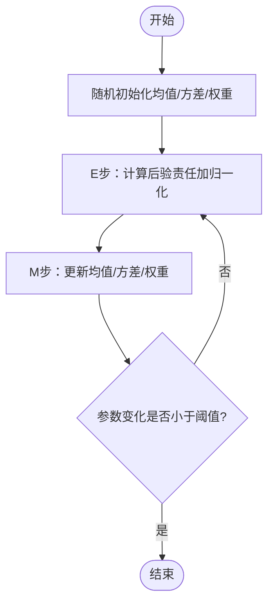
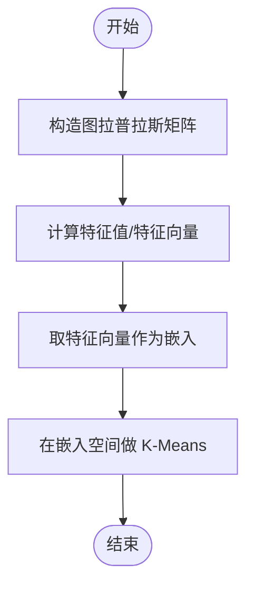
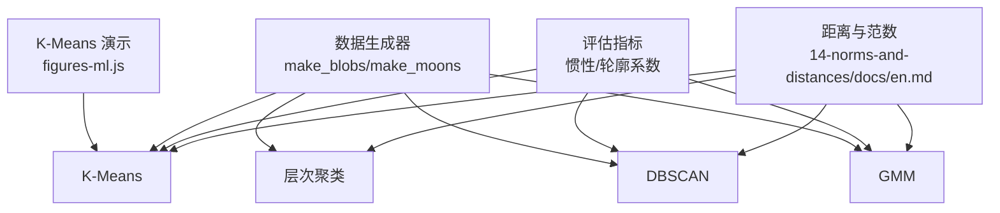

# 聚类算法

<cite>
**本文引用的文件列表**
- [clustering.py](file://phases/02-ml-fundamentals/07-unsupervised-learning/code/clustering.py)
- [unsupervised-learning 文档](file://phases/02-ml-fundamentals/07-unsupervised-learning/docs/en.md)
- [聚类指南技能卡](file://phases/02-ml-fundamentals/07-unsupervised-learning/outputs/skill-clustering-guide.md)
- [图论与谱聚类](file://phases/01-math-foundations/21-graph-theory/code/graph_theory.py)
- [距离与范数](file://phases/01-math-foundations/14-norms-and-distances/docs/en.md)
- [降维与可视化](file://phases/01-math-foundations/10-dimensionality-reduction/docs/en.md)
- [站点数据与图表脚本](file://site/data.js)
- [ML 图形演示脚本](file://site/figures-ml.js)
</cite>

## 目录
1. [引言](#引言)
2. [项目结构](#项目结构)
3. [核心组件](#核心组件)
4. [架构总览](#架构总览)
5. [详细组件分析](#详细组件分析)
6. [依赖关系分析](#依赖关系分析)
7. [性能考量](#性能考量)
8. [故障排查指南](#故障排查指南)
9. [结论](#结论)
10. [附录](#附录)

## 引言
本文件系统性梳理仓库中“聚类算法”的实现与知识体系，覆盖 K-Means、DBSCAN、层次聚类（自底向上）、GMM（软聚类），并结合评估指标、参数调优与可视化流程，帮助读者从原理到实践全面掌握聚类方法。同时给出算法选择建议与常见陷阱，便于在真实场景中做出合理决策。

## 项目结构
围绕聚类主题，相关代码与文档主要分布在以下位置：
- 实现层：phases/02-ml-fundamentals/07-unsupervised-learning/code/clustering.py 提供 K-Means、DBSCAN、GMM、层次聚类等完整实现。
- 文档层：unsupervised-learning/docs/en.md 提供概念、流程与练习说明；outputs/skill-clustering-guide.md 提供算法选择清单与评估指标速查。
- 数学基础：phases/01-math-foundations/14-norms-and-distances/docs/en.md 阐述距离与范数，支撑聚类相似度定义；phases/01-math-foundations/10-dimensionality-reduction/docs/en.md 提供降维与可视化建议。
- 图论扩展：phases/01-math-foundations/21-graph-theory/code/graph_theory.py 包含谱聚类实现，展示基于图拉普拉斯的聚类思路。
- 可视化：site/figures-ml.js 提供 K-Means 迭代过程的交互式演示；site/data.js 中包含聚类相关技能卡片与课程索引。

**图表来源**
- [clustering.py:1-398](file://phases/02-ml-fundamentals/07-unsupervised-learning/code/clustering.py#L1-L398)
- [unsupervised-learning 文档:1-502](file://phases/02-ml-fundamentals/07-unsupervised-learning/docs/en.md#L1-L502)
- [聚类指南技能卡:1-78](file://phases/02-ml-fundamentals/07-unsupervised-learning/outputs/skill-clustering-guide.md#L1-L78)
- [距离与范数:1-200](file://phases/01-math-foundations/14-norms-and-distances/docs/en.md#L1-L200)
- [降维与可视化:85-110](file://phases/01-math-foundations/10-dimensionality-reduction/docs/en.md#L85-L110)
- [图论与谱聚类:99-139](file://phases/01-math-foundations/21-graph-theory/code/graph_theory.py#L99-L139)
- [ML 图形演示脚本:154-266](file://site/figures-ml.js#L154-L266)
- [站点数据与图表脚本:377-5931](file://site/data.js#L377-L5931)

**章节来源**
- [clustering.py:1-398](file://phases/02-ml-fundamentals/07-unsupervised-learning/code/clustering.py#L1-L398)
- [unsupervised-learning 文档:1-502](file://phases/02-ml-fundamentals/07-unsupervised-learning/docs/en.md#L1-L502)
- [聚类指南技能卡:1-78](file://phases/02-ml-fundamentals/07-unsupervised-learning/outputs/skill-clustering-guide.md#L1-L78)
- [距离与范数:1-200](file://phases/01-math-foundations/14-norms-and-distances/docs/en.md#L1-L200)
- [降维与可视化:85-110](file://phases/01-math-foundations/10-dimensionality-reduction/docs/en.md#L85-L110)
- [图论与谱聚类:99-139](file://phases/01-math-foundations/21-graph-theory/code/graph_theory.py#L99-L139)
- [ML 图形演示脚本:154-266](file://site/figures-ml.js#L154-L266)
- [站点数据与图表脚本:377-5931](file://site/data.js#L377-L5931)

## 核心组件
- K-Means：迭代分配与重计算质心，最小化簇内平方误差（惯性）。支持随机初始化与收敛判断。
- DBSCAN：基于密度的自动聚类，通过半径 eps 与最小样本数 min_samples 识别核心点、边界点与噪声点。
- 高斯混合模型（GMM）：软聚类，用 EM 算法估计各簇的均值、方差与权重，输出概率归属。
- 层次聚类（自底向上，凝聚式）：按单链、全链、平均链与 Ward 链接准则合并簇，生成树状图（dendrogram）。
- 评估指标：惯性（越小越好）、轮廓系数（越大越好）、可选 Calinski-Harabasz、Davies-Bouldin 等。
- 数据生成器：make_blobs、make_moons，用于测试不同形状与噪声场景。

**章节来源**
- [clustering.py:9-45](file://phases/02-ml-fundamentals/07-unsupervised-learning/code/clustering.py#L9-L45)
- [clustering.py:111-159](file://phases/02-ml-fundamentals/07-unsupervised-learning/code/clustering.py#L111-L159)
- [clustering.py:162-221](file://phases/02-ml-fundamentals/07-unsupervised-learning/code/clustering.py#L162-L221)
- [clustering.py:224-302](file://phases/02-ml-fundamentals/07-unsupervised-learning/code/clustering.py#L224-L302)
- [clustering.py:48-108](file://phases/02-ml-fundamentals/07-unsupervised-learning/code/clustering.py#L48-L108)
- [clustering.py:305-335](file://phases/02-ml-fundamentals/07-unsupervised-learning/code/clustering.py#L305-L335)

## 架构总览
下图展示了聚类模块内部的函数关系与数据流，体现从数据到标签/质心/隶属度的映射路径。

**图表来源**
- [clustering.py:9-45](file://phases/02-ml-fundamentals/07-unsupervised-learning/code/clustering.py#L9-L45)
- [clustering.py:111-159](file://phases/02-ml-fundamentals/07-unsupervised-learning/code/clustering.py#L111-L159)
- [clustering.py:224-302](file://phases/02-ml-fundamentals/07-unsupervised-learning/code/clustering.py#L224-L302)
- [clustering.py:162-221](file://phases/02-ml-fundamentals/07-unsupervised-learning/code/clustering.py#L162-L221)
- [clustering.py:48-108](file://phases/02-ml-fundamentals/07-unsupervised-learning/code/clustering.py#L48-L108)
- [clustering.py:305-335](file://phases/02-ml-fundamentals/07-unsupervised-learning/code/clustering.py#L305-L335)

## 详细组件分析

### K-Means 组件分析
- 初始化策略：随机初始化质心；可通过 K-Means++ 思想扩展（见练习建议）。
- 收敛条件：当质心移动小于阈值时停止；或达到最大迭代次数。
- 复杂度：每轮 O(n*k*d)，n 为样本数，k 为簇数，d 为维度。
- 适用场景：球形簇、已知簇数、大规模数据（可扩展为 Mini-Batch K-Means）。

**图表来源**
- [clustering.py:9-45](file://phases/02-ml-fundamentals/07-unsupervised-learning/code/clustering.py#L9-L45)

**章节来源**
- [clustering.py:9-45](file://phases/02-ml-fundamentals/07-unsupervised-learning/code/clustering.py#L9-L45)
- [unsupervised-learning 文档:44-64](file://phases/02-ml-fundamentals/07-unsupervised-learning/docs/en.md#L44-L64)

### DBSCAN 组件分析
- 参数：eps（邻域半径）、min_samples（密度阈值）。
- 类型：核心点、边界点、噪声点三类。
- 流程：遍历未访问点，若为核心点则扩展形成簇；否则标记噪声。
- 优势：无需指定簇数、能发现任意形状、自动检测异常点。
- 限制：对不同密度的簇效果不佳；eps 需要仔细调参。

**图表来源**
- [clustering.py:111-159](file://phases/02-ml-fundamentals/07-unsupervised-learning/code/clustering.py#L111-L159)

**章节来源**
- [clustering.py:111-159](file://phases/02-ml-fundamentals/07-unsupervised-learning/code/clustering.py#L111-L159)
- [unsupervised-learning 文档:65-81](file://phases/02-ml-fundamentals/07-unsupervised-learning/docs/en.md#L65-L81)

### 层次聚类（自底向上）组件分析
- 链接准则：single（最短边）、complete（最长边）、average（平均距离）、ward（最小化簇内方差增量）。
- 流程：每次合并距离最小的两个簇，直到达到目标簇数或满足终止条件。
- 产物：最终簇标签与合并历史（可用于绘制树状图）。

**图表来源**
- [clustering.py:224-302](file://phases/02-ml-fundamentals/07-unsupervised-learning/code/clustering.py#L224-L302)

**章节来源**
- [clustering.py:224-302](file://phases/02-ml-fundamentals/07-unsupervised-learning/code/clustering.py#L224-L302)
- [unsupervised-learning 文档:82-97](file://phases/02-ml-fundamentals/07-unsupervised-learning/docs/en.md#L82-L97)

### GMM 组件分析
- 假设：数据由 K 个高斯分布混合生成。
- 算法：EM（期望-最大化）交替估计后验责任（软分配）与更新参数（均值、方差、权重）。
- 输出：硬/软分配、各簇均值与权重、后验责任矩阵。

**图表来源**
- [clustering.py:162-221](file://phases/02-ml-fundamentals/07-unsupervised-learning/code/clustering.py#L162-L221)

**章节来源**
- [clustering.py:162-221](file://phases/02-ml-fundamentals/07-unsupervised-learning/code/clustering.py#L162-L221)
- [unsupervised-learning 文档:98-108](file://phases/02-ml-fundamentals/07-unsupervised-learning/docs/en.md#L98-L108)

### 谱聚类（图论视角）
- 思路：利用图拉普拉斯矩阵的特征向量进行嵌入，再在低维空间做 K-Means 聚类。
- 适用：社区检测、二分类或 K 分割问题，尤其在图结构数据上表现良好。

**图表来源**
- [图论与谱聚类:99-139](file://phases/01-math-foundations/21-graph-theory/code/graph_theory.py#L99-L139)

**章节来源**
- [图论与谱聚类:99-139](file://phases/01-math-foundations/21-graph-theory/code/graph_theory.py#L99-L139)

## 依赖关系分析
- 距离度量：K-Means、层次聚类、DBSCAN、GMM 均依赖欧氏距离；距离选择影响相似度定义与聚类效果。
- 评估指标：惯性、轮廓系数等用于比较不同 K 或算法；Calinski-Harabasz、Davies-Bouldin 等可作为补充。
- 数据生成：make_blobs、make_moons 用于模拟球形簇与月牙形簇，便于对比算法差异。
- 可视化：站点脚本提供 K-Means 迭代演示，有助于理解算法行为。

**图表来源**
- [距离与范数:61-89](file://phases/01-math-foundations/14-norms-and-distances/docs/en.md#L61-L89)
- [clustering.py:48-108](file://phases/02-ml-fundamentals/07-unsupervised-learning/code/clustering.py#L48-L108)
- [clustering.py:305-335](file://phases/02-ml-fundamentals/07-unsupervised-learning/code/clustering.py#L305-L335)
- [ML 图形演示脚本:154-266](file://site/figures-ml.js#L154-L266)

**章节来源**
- [距离与范数:61-89](file://phases/01-math-foundations/14-norms-and-distances/docs/en.md#L61-L89)
- [clustering.py:48-108](file://phases/02-ml-fundamentals/07-unsupervised-learning/code/clustering.py#L48-L108)
- [clustering.py:305-335](file://phases/02-ml-fundamentals/07-unsupervised-learning/code/clustering.py#L305-L335)
- [ML 图形演示脚本:154-266](file://site/figures-ml.js#L154-L266)

## 性能考量
- K-Means：适合大规模数据；可用 Mini-Batch K-Means 进一步提速；注意特征缩放避免尺度主导距离。
- DBSCAN：对不同密度敏感；eps 需要 k-距离图辅助选择；内存与时间复杂度较高。
- 层次聚类：O(n^3) 时间与 O(n^2) 内存，不适合超大数据集；可考虑采样或近似方法。
- GMM：假设高斯分布，对非凸形状效果有限；EM 易陷入局部最优，需多次随机初始化。
- 降维与可视化：PCA/t-SNE/UMAP 可用于探索结构与参数选择；注意下游任务性能验证。

[本节为通用指导，不直接分析具体文件]

## 故障排查指南
- 特征尺度问题：K-Means 对尺度敏感，应先标准化/归一化。
- K 值选择：使用肘部法则与轮廓系数联合判断；避免仅凭二维直觉选择。
- DBSCAN 参数：eps 过大导致合并、过小导致噪声过多；可参考 k-距离图。
- 层次聚类规模：数据量过大时会内存爆炸，优先考虑其他方法或降采样。
- GMM 收敛：初始值敏感，建议多次运行并选择最佳结果。

**章节来源**
- [聚类指南技能卡:59-67](file://phases/02-ml-fundamentals/07-unsupervised-learning/outputs/skill-clustering-guide.md#L59-L67)
- [unsupervised-learning 文档:109-117](file://phases/02-ml-fundamentals/07-unsupervised-learning/docs/en.md#L109-L117)

## 结论
该仓库提供了从零实现的 K-Means、DBSCAN、GMM 与层次聚类，并配套评估指标、参数调优与可视化资源。结合数学基础（距离与范数、降维）与图论扩展（谱聚类），读者可在理论与实践之间建立完整桥梁。实际应用中，应根据数据形状、噪声水平与规模选择合适算法，并通过多指标与可视化验证结果。

[本节为总结性内容，不直接分析具体文件]

## 附录

### 算法选择与评估速查
- 何时用 K-Means：球形簇、已知 K、大规模数据。
- 何时用 DBSCAN：未知 K、任意形状、异常检测。
- 何时用层次聚类：需要探索多粒度结构、小数据集。
- 何时用 GMM：需要软分配、椭圆/重叠簇。
- 评估指标：轮廓系数（越大越好）、惯性（越小越好）、Calinski-Harabasz、Davies-Bouldin。

**章节来源**
- [聚类指南技能卡:49-78](file://phases/02-ml-fundamentals/07-unsupervised-learning/outputs/skill-clustering-guide.md#L49-L78)

### 可视化与演示
- K-Means 迭代演示：通过站点脚本直观观察 WCSS 下降与质心迁移。
- 降维与可视化：PCA/t-SNE/UMAP 用于探索簇结构与参数选择。

**章节来源**
- [ML 图形演示脚本:154-266](file://site/figures-ml.js#L154-L266)
- [降维与可视化:85-110](file://phases/01-math-foundations/10-dimensionality-reduction/docs/en.md#L85-L110)