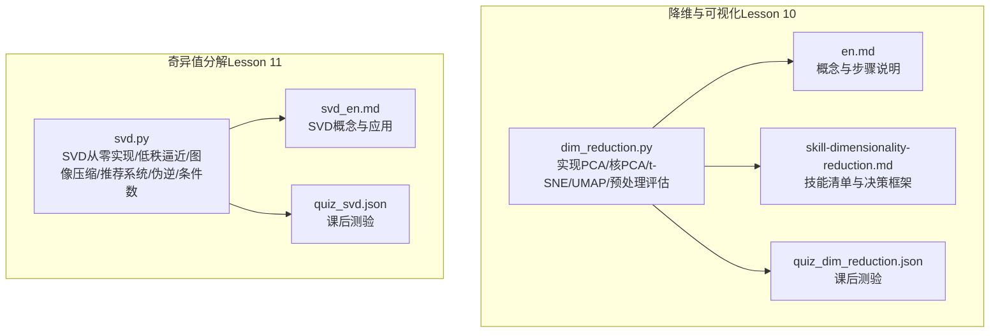
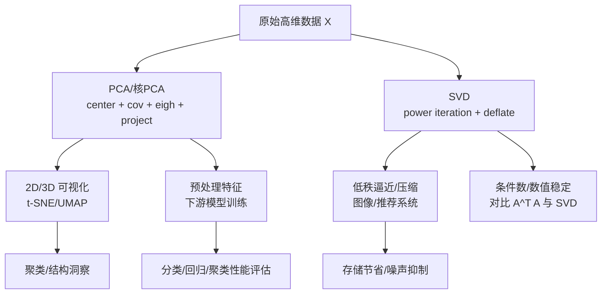
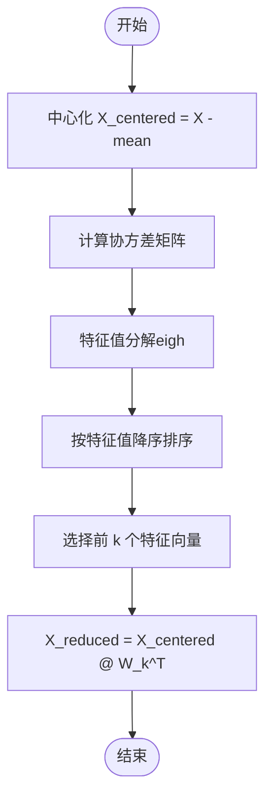
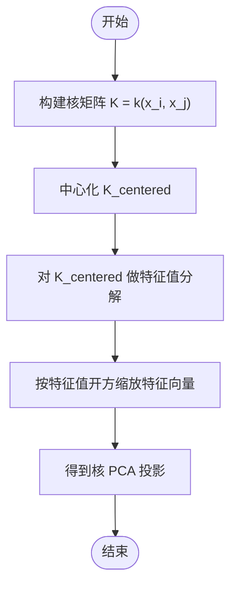
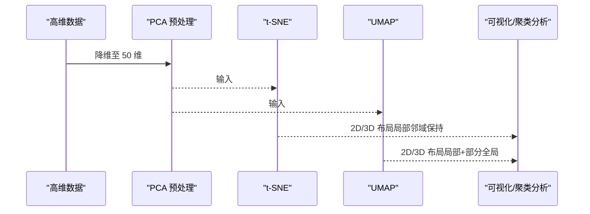
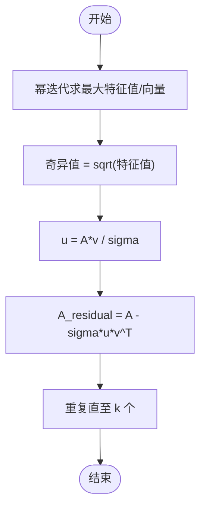
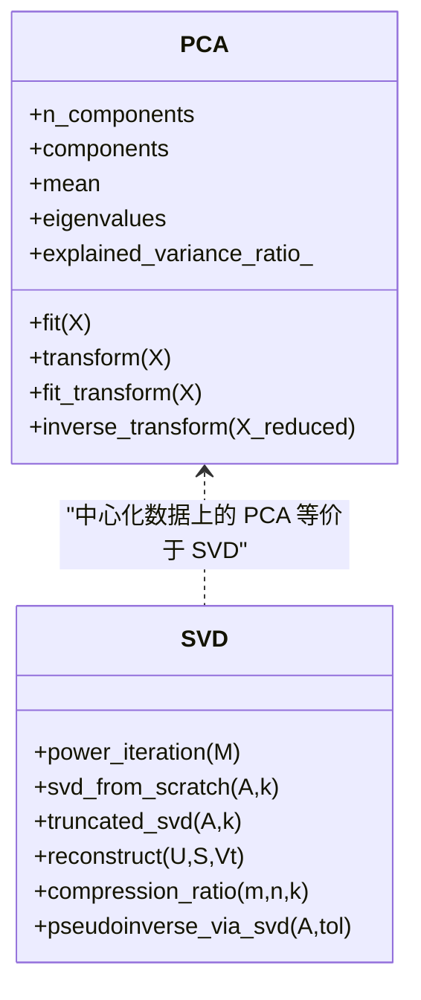
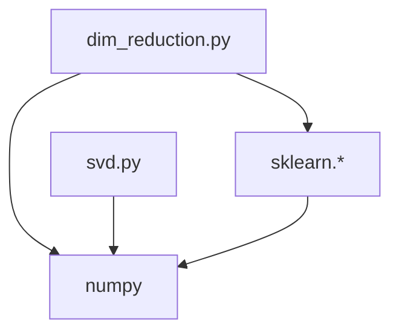

# 降维技术

<cite>
**本文引用的文件**
- [dim_reduction.py](file://phases/01-math-foundations/10-dimensionality-reduction/code/dim_reduction.py)
- [en.md](file://phases/01-math-foundations/10-dimensionality-reduction/docs/en.md)
- [skill-dimensionality-reduction.md](file://phases/01-math-foundations/10-dimensionality-reduction/outputs/skill-dimensionality-reduction.md)
- [svd.py](file://phases/01-math-foundations/11-singular-value-decomposition/code/svd.py)
- [svd_en.md](file://phases/01-math-foundations/11-singular-value-decomposition/docs/en.md)
- [quiz_dim_reduction.json](file://phases/01-math-foundations/10-dimensionality-reduction/quiz.json)
- [quiz_svd.json](file://phases/01-math-foundations/11-singular-value-decomposition/quiz.json)
</cite>

## 目录
1. [引言](#引言)
2. [项目结构](#项目结构)
3. [核心组件](#核心组件)
4. [架构总览](#架构总览)
5. [详细组件分析](#详细组件分析)
6. [依赖分析](#依赖分析)
7. [性能考量](#性能考量)
8. [故障排查指南](#故障排查指南)
9. [结论](#结论)
10. [附录](#附录)

## 引言
本文件系统性梳理降维技术，围绕主成分分析（PCA）、奇异值分解（SVD）、核主成分分析（Kernel PCA）、t-SNE、UMAP 等方法，结合仓库中的教学材料与示例代码，给出数学原理、实现流程、数据流与处理逻辑、集成点、错误处理与性能特性，并提供实际案例与最佳实践建议。读者无需深入数学背景即可理解并应用这些方法。

## 项目结构
本主题涉及两门数学基础课程：
- 降维与可视化（Lesson 10）：涵盖 PCA、t-SNE、UMAP、核 PCA、重建误差与决策框架
- 奇异值分解（Lesson 11）：涵盖 SVD 的几何意义、低秩逼近、图像压缩、推荐系统、伪逆、条件数与数值稳定性、以及与 PCA 的联系

图表来源
- [dim_reduction.py:1-334](file://phases/01-math-foundations/10-dimensionality-reduction/code/dim_reduction.py#L1-L334)
- [en.md:1-375](file://phases/01-math-foundations/10-dimensionality-reduction/docs/en.md#L1-L375)
- [skill-dimensionality-reduction.md:1-58](file://phases/01-math-foundations/10-dimensionality-reduction/outputs/skill-dimensionality-reduction.md#L1-L58)
- [svd.py:1-642](file://phases/01-math-foundations/11-singular-value-decomposition/code/svd.py#L1-L642)
- [svd_en.md:1-551](file://phases/01-math-foundations/11-singular-value-decomposition/docs/en.md#L1-L551)

章节来源
- [dim_reduction.py:1-334](file://phases/01-math-foundations/10-dimensionality-reduction/code/dim_reduction.py#L1-L334)
- [en.md:1-375](file://phases/01-math-foundations/10-dimensionality-reduction/docs/en.md#L1-L375)
- [svd.py:1-642](file://phases/01-math-foundations/11-singular-value-decomposition/code/svd.py#L1-L642)
- [svd_en.md:1-551](file://phases/01-math-foundations/11-singular-value-decomposition/docs/en.md#L1-L551)

## 核心组件
- PCA 类与核 PCA：提供从零实现的 PCA 与核 PCA，支持拟合、变换、逆变换与重建误差评估
- t-SNE 与 UMAP：演示在 MNIST 上的 2D 可视化，强调参数与适用场景
- SVD 从零实现：基于幂迭代求最大奇异值与向量，逐次消去构造完整 SVD
- 低秩逼近与图像压缩：展示截断 SVD 的最优逼近性质与存储节省
- 推荐系统与潜在因子：利用 SVD 分解用户-物品评分矩阵，预测缺失评分
- 条件数与数值稳定性：对比直接对 A^T A 求特征值与 SVD 的数值稳健性差异
- PCA 与 SVD 的等价性：中心化数据上的 PCA 即 SVD 的推导与验证

章节来源
- [dim_reduction.py:4-41](file://phases/01-math-foundations/10-dimensionality-reduction/code/dim_reduction.py#L4-L41)
- [dim_reduction.py:197-224](file://phases/01-math-foundations/10-dimensionality-reduction/code/dim_reduction.py#L197-L224)
- [svd.py:4-59](file://phases/01-math-foundations/11-singular-value-decomposition/code/svd.py#L4-L59)
- [svd.py:62-68](file://phases/01-math-foundations/11-singular-value-decomposition/code/svd.py#L62-L68)
- [svd.py:192-231](file://phases/01-math-foundations/11-singular-value-decomposition/code/svd.py#L192-L231)
- [svd.py:234-296](file://phases/01-math-foundations/11-singular-value-decomposition/code/svd.py#L234-L296)
- [svd.py:526-587](file://phases/01-math-foundations/11-singular-value-decomposition/code/svd.py#L526-L587)

## 架构总览
下图展示了降维与 SVD 的核心模块及其交互关系，以及它们在数据管线中的位置。

图表来源
- [dim_reduction.py:12-41](file://phases/01-math-foundations/10-dimensionality-reduction/code/dim_reduction.py#L12-L41)
- [dim_reduction.py:124-161](file://phases/01-math-foundations/10-dimensionality-reduction/code/dim_reduction.py#L124-L161)
- [svd.py:4-59](file://phases/01-math-foundations/11-singular-value-decomposition/code/svd.py#L4-L59)
- [svd.py:192-231](file://phases/01-math-foundations/11-singular-value-decomposition/code/svd.py#L192-L231)
- [svd.py:526-587](file://phases/01-math-foundations/11-singular-value-decomposition/code/svd.py#L526-L587)

## 详细组件分析

### 主成分分析（PCA）
- 数学原理：中心化数据，计算协方差矩阵，对其进行特征值分解，按特征值降序排列，取前 k 个特征向量构成投影基，得到降维后的坐标；解释方差比与重建误差可衡量压缩质量。
- 实现要点：fit 计算均值、协方差、特征值/向量并排序，transform 使用投影矩阵，fit_transform 一步完成；inverse_transform 由投影矩阵与均值还原。
- 参数选择策略：阈值法（累计解释方差≥0.90/0.95）、肘部法则（解释方差随 k 的变化）、下游性能（在预处理中扫描 k 并评估模型准确率）。
- 与 SVD 的关系：中心化数据的 PCA 等价于对该数据矩阵做 SVD，主成分方向即右奇异向量，解释方差与奇异值平方成比例。

图表来源
- [dim_reduction.py:12-33](file://phases/01-math-foundations/10-dimensionality-reduction/code/dim_reduction.py#L12-L33)

章节来源
- [dim_reduction.py:4-41](file://phases/01-math-foundations/10-dimensionality-reduction/code/dim_reduction.py#L4-L41)
- [en.md:49-68](file://phases/01-math-foundations/10-dimensionality-reduction/docs/en.md#L49-L68)
- [en.md:85-91](file://phases/01-math-foundations/10-dimensionality-reduction/docs/en.md#L85-L91)
- [svd_en.md:337-361](file://phases/01-math-foundations/11-singular-value-decomposition/docs/en.md#L337-L361)

### 核主成分分析（Kernel PCA）
- 适用场景：当数据位于非线性流形上（如同心圆），线性 PCA 无法分离时，核 PCA 通过核技巧将数据映射到更高维特征空间，在该空间中再进行线性降维。
- 核函数族：RBF（高斯）、多项式、Sigmoid；RBF 在大多数非线性平滑流形上表现良好。
- 算法流程：构建核矩阵 K，中心化 K，对中心化核矩阵做特征值分解，取前 k 个特征向量并按特征值缩放，得到投影结果。
- 注意事项：核矩阵规模为 n×n，内存受限；逆变换通常需要预图像近似；解释性不如线性 PCA。

图表来源
- [dim_reduction.py:197-224](file://phases/01-math-foundations/10-dimensionality-reduction/code/dim_reduction.py#L197-L224)

章节来源
- [en.md:131-161](file://phases/01-math-foundations/10-dimensionality-reduction/docs/en.md#L131-L161)
- [dim_reduction.py:231-282](file://phases/01-math-foundations/10-dimensionality-reduction/code/dim_reduction.py#L231-L282)

### t-SNE 与 UMAP
- t-SNE：为可视化设计，保留局部邻域概率分布，适合发现聚类结构；非线性、随机、慢（默认 O(n^2)）；输出簇间距离无意义，仅簇本身有意义；典型困惑度范围 5–50。
- UMAP：更快、更好全局结构，使用近似最近邻图；相对位置更有意义；参数 n_neighbors 控制局部/全局结构，min_dist 控制簇密度。
- 使用建议：先用 PCA 降至 50 维，再用 t-SNE/UMAP；不要将 t-SNE 输出直接作为模型输入特征。

图表来源
- [dim_reduction.py:124-161](file://phases/01-math-foundations/10-dimensionality-reduction/code/dim_reduction.py#L124-L161)
- [en.md:93-128](file://phases/01-math-foundations/10-dimensionality-reduction/docs/en.md#L93-L128)

章节来源
- [en.md:93-128](file://phases/01-math-foundations/10-dimensionality-reduction/docs/en.md#L93-L128)
- [skill-dimensionality-reduction.md:10-58](file://phases/01-math-foundations/10-dimensionality-reduction/outputs/skill-dimensionality-reduction.md#L10-L58)

### 奇异值分解（SVD）
- 几何意义：任意矩阵 A 可分解为 UΣV^T，即“旋转-缩放-旋转”三步；Σ 的非负对角元素为奇异值，V 的列向量为输入空间的标准正交基，U 的列向量为输出空间的标准正交基。
- 与特征值分解的关系：奇异值等于 A^T A 或 AA^T 的特征值的平方根；左/右奇异向量分别对应 A A^T/A^T A 的特征向量。
- 截断 SVD：按 Eckart-Young 定理，保留前 k 个奇异值与向量构成的最佳秩 k 近似；Frobenius 范数与谱范数下的误差分别为 σ_{k+1} 及其平方根之和。
- 实际应用：图像压缩（存储节省与重构误差）、推荐系统（潜在因子分解与缺失评分预测）、噪声抑制（按奇异值阈值截断）、伪逆（最小二乘与最小范数解）。

图表来源
- [svd.py:4-59](file://phases/01-math-foundations/11-singular-value-decomposition/code/svd.py#L4-L59)

章节来源
- [svd_en.md:23-47](file://phases/01-math-foundations/11-singular-value-decomposition/docs/en.md#L23-L47)
- [svd_en.md:112-139](file://phases/01-math-foundations/11-singular-value-decomposition/docs/en.md#L112-L139)
- [svd_en.md:141-157](file://phases/01-math-foundations/11-singular-value-decomposition/docs/en.md#L141-L157)
- [svd.py:192-231](file://phases/01-math-foundations/11-singular-value-decomposition/code/svd.py#L192-L231)
- [svd.py:234-296](file://phases/01-math-foundations/11-singular-value-decomposition/code/svd.py#L234-L296)
- [svd.py:418-481](file://phases/01-math-foundations/11-singular-value-decomposition/code/svd.py#L418-L481)
- [svd.py:485-524](file://phases/01-math-foundations/11-singular-value-decomposition/code/svd.py#L485-L524)

### PCA 与 SVD 的等价性
- 中心化数据 X_centered 的协方差矩阵 C 与 X 的 SVD 存在一一对应关系：C 的特征值（除以 n-1）与 X 的奇异值平方相等，特征向量（方向）与右奇异向量相同。
- sklearn 的 PCA 实现采用 SVD，避免形成 A^T A 导致的条件数放大问题，提升数值稳定性。

图表来源
- [dim_reduction.py:4-41](file://phases/01-math-foundations/10-dimensionality-reduction/code/dim_reduction.py#L4-L41)
- [svd.py:4-68](file://phases/01-math-foundations/11-singular-value-decomposition/code/svd.py#L4-L68)
- [svd.py:526-587](file://phases/01-math-foundations/11-singular-value-decomposition/code/svd.py#L526-L587)

章节来源
- [svd_en.md:337-361](file://phases/01-math-foundations/11-singular-value-decomposition/docs/en.md#L337-L361)
- [svd.py:526-587](file://phases/01-math-foundations/11-singular-value-decomposition/code/svd.py#L526-L587)

## 依赖分析
- 外部库依赖：NumPy（线性代数运算）、scikit-learn（PCA、TSNE、数据集加载）、可选 umap-learn（UMAP）、matplotlib/seaborn（可视化，示例脚本中常见但未在上述文件中直接导入）。
- 内部模块耦合：
  - dim_reduction.py 依赖 sklearn.datasets、sklearn.decomposition、sklearn.manifold、sklearn.linear_model、sklearn.model_selection、sklearn.metrics
  - svd.py 依赖 numpy，部分功能依赖 matplotlib（示例脚本中使用，但未在核心函数中硬编码导入）

图表来源
- [dim_reduction.py:77-117](file://phases/01-math-foundations/10-dimensionality-reduction/code/dim_reduction.py#L77-L117)
- [svd.py:1-1](file://phases/01-math-foundations/11-singular-value-decomposition/code/svd.py#L1-L1)

章节来源
- [dim_reduction.py:77-117](file://phases/01-math-foundations/10-dimensionality-reduction/code/dim_reduction.py#L77-L117)
- [svd.py:1-1](file://phases/01-math-foundations/11-singular-value-decomposition/code/svd.py#L1-L1)

## 性能考量
- PCA
  - 时间复杂度：O(min(n^2 d, d^2 n))，其中 n 为样本数，d 为特征数；中心化 O(nd)，协方差 O(nd^2) 或 O(n^2 d)，特征分解 O(d^3) 或 O(n^2 d)。
  - 空间复杂度：O(d^2)（协方差矩阵）或 O(nd)（SVD 直接法）。
  - 建议：大规模数据优先考虑 SVD 实现（sklearn 已内置），并配合 PCA 预处理。
- t-SNE
  - 默认 O(n^2)；适合 <10k 样本；可通过 PCA 预降维缓解。
- UMAP
  - 更快，适合大规模数据；参数 n_neighbors 与 min_dist 影响局部/全局结构。
- SVD
  - 功耗与数值稳定性：直接对 A 做 SVD 比先形成 A^T A 再求特征值更稳定；截断 SVD 的误差由最小未保留奇异值决定。
  - 图像压缩：存储节省与重构误差呈反比，需平衡视觉质量与存储成本。

[本节为通用指导，不直接分析具体文件]

## 故障排查指南
- t-SNE 不适合作为预处理特征
  - 现象：t-SNE 输出不稳定、簇间距离无意义、不同随机种子产生不同布局。
  - 处理：仅用于可视化；预处理阶段使用 PCA。
- 忘记中心化
  - 现象：PCA 结果偏移或方向异常。
  - 处理：确保先减去均值再计算协方差或 SVD。
- 组件数量选择不当
  - 现象：过少丢失信号，过多引入噪声。
  - 处理：用阈值法（累计解释方差≥0.90/0.95）、肘部法、下游性能扫描综合判断。
- 核 PCA 参数敏感
  - 现象：RBF 核 gamma 过大/过小导致分离效果差。
  - 处理：网格搜索 gamma，观察内/外环均值分离的变化。
- UMAP 参数调优
  - 现象：n_neighbors 过小导致噪声，过大破坏局部结构；min_dist 过小造成重叠，过大簇稀疏。
  - 处理：从默认值出发，逐步调整并验证聚类稳定性。

章节来源
- [skill-dimensionality-reduction.md:51-58](file://phases/01-math-foundations/10-dimensionality-reduction/outputs/skill-dimensionality-reduction.md#L51-L58)
- [en.md:93-128](file://phases/01-math-foundations/10-dimensionality-reduction/docs/en.md#L93-L128)

## 结论
- PCA 是降维与预处理的核心工具，解释方差与重建误差提供了直观的质量度量；SVD 从更一般的角度揭示了线性变换的本质，并在 PCA 中发挥关键作用。
- 对于非线性结构，核 PCA 提供了有效的线性化手段；t-SNE/UMAP 则专注于可视化与聚类结构探索，不应直接作为模型输入特征。
- SVD 的截断近似、图像压缩、推荐系统、伪逆与条件数分析构成了完整的数值线性代数应用体系。
- 最佳实践：先用 PCA 降低噪声与冗余，再用 t-SNE/UMAP 观察结构；在预处理阶段用下游性能选择合适的 k；在需要鲁棒性的场景优先采用 SVD 而非 A^T A 的特征值分解。

[本节为总结性内容，不直接分析具体文件]

## 附录

### 实际案例与应用场景
- 图像压缩（SVD）
  - 使用截断 SVD 对灰度图像进行低秩近似，比较不同 k 下的存储节省与重构误差，验证自然图像奇异值快速衰减的特性。
  - 参考路径：[svd.py:192-231](file://phases/01-math-foundations/11-singular-value-decomposition/code/svd.py#L192-L231)
- 推荐系统（SVD）
  - 对用户-物品评分矩阵进行低秩分解，填充缺失评分，预测用户对未评分物品的偏好。
  - 参考路径：[svd.py:234-296](file://phases/01-math-foundations/11-singular-value-decomposition/code/svd.py#L234-L296)
- 数据可视化（PCA + t-SNE/UMAP）
  - 在 MNIST 上先用 PCA 降至 50 维，再用 t-SNE/UMAP 显示数字的聚类结构；核 PCA 用于分离同心圆等非线性结构。
  - 参考路径：[dim_reduction.py:124-161](file://phases/01-math-foundations/10-dimensionality-reduction/code/dim_reduction.py#L124-L161)、[dim_reduction.py:231-282](file://phases/01-math-foundations/10-dimensionality-reduction/code/dim_reduction.py#L231-L282)
- 预处理与下游性能（PCA）
  - 在逻辑回归上扫描不同 k，记录准确率与解释方差，观察性能平台期，选择合适的 k。
  - 参考路径：[dim_reduction.py:164-194](file://phases/01-math-foundations/10-dimensionality-reduction/code/dim_reduction.py#L164-L194)

### 测验要点
- 降维与可视化测验（Lesson 10）
  - 关键点：维度灾难、PCA 的几何意义、t-SNE/UMAP 的适用场景与限制、核 PCA 的使用时机。
  - 参考路径：[quiz_dim_reduction.json:1-40](file://phases/01-math-foundations/10-dimensionality-reduction/quiz.json#L1-L40)
- SVD 测验（Lesson 11）
  - 关键点：SVD 的通用性、低秩逼近的最优性、与特征值分解的关系、数值稳定性与条件数。
  - 参考路径：[quiz_svd.json:1-40](file://phases/01-math-foundations/11-singular-value-decomposition/quiz.json#L1-L40)