# 机器学习基础

<cite>
**本文档引用的文件**
- [phases/02-ml-fundamentals/README.md](file://phases/02-ml-fundamentals/README.md)
- [phases/02-ml-fundamentals/01-what-is-machine-learning/docs/en.md](file://phases/02-ml-fundamentals/01-what-is-machine-learning/docs/en.md)
- [phases/02-ml-fundamentals/02-linear-regression/docs/en.md](file://phases/02-ml-fundamentals/02-linear-regression/docs/en.md)
- [phases/02-ml-fundamentals/03-logistic-regression/docs/en.md](file://phases/02-ml-fundamentals/03-logistic-regression/docs/en.md)
- [phases/02-ml-fundamentals/04-decision-trees/docs/en.md](file://phases/02-ml-fundamentals/04-decision-trees/docs/en.md)
- [phases/02-ml-fundamentals/05-support-vector-machines/docs/en.md](file://phases/02-ml-fundamentals/05-support-vector-machines/docs/en.md)
- [phases/02-ml-fundamentals/06-knn-and-distances/docs/en.md](file://phases/02-ml-fundamentals/06-knn-and-distances/docs/en.md)
- [phases/02-ml-fundamentals/07-unsupervised-learning/docs/en.md](file://phases/02-ml-fundamentals/07-unsupervised-learning/docs/en.md)
- [phases/02-ml-fundamentals/08-feature-engineering/docs/en.md](file://phases/02-ml-fundamentals/08-feature-engineering/docs/en.md)
- [phases/02-ml-fundamentals/09-model-evaluation/docs/en.md](file://phases/02-ml-fundamentals/09-model-evaluation/docs/en.md)
- [phases/02-ml-fundamentals/10-bias-variance/docs/en.md](file://phases/02-ml-fundamentals/10-bias-variance/docs/en.md)
- [phases/02-ml-fundamentals/11-ensemble-methods/docs/en.md](file://phases/02-ml-fundamentals/11-ensemble-methods/docs/en.md)
- [phases/02-ml-fundamentals/12-hyperparameter-tuning/docs/en.md](file://phases/02-ml-fundamentals/12-hyperparameter-tuning/docs/en.md)
- [site/figures-ml.js](file://site/figures-ml.js)
- [site/lesson.html](file://site/lesson.html)
- [site/data.js](file://site/data.js)
</cite>

## 目录
1. [引言](#引言)
2. [项目结构](#项目结构)
3. [核心组件](#核心组件)
4. [架构总览](#架构总览)
5. [详细组件分析](#详细组件分析)
6. [依赖分析](#依赖分析)
7. [性能考虑](#性能考虑)
8. [故障排除指南](#故障排除指南)
9. [结论](#结论)
10. [附录](#附录)

## 引言
本课程面向机器学习入门与实战，系统覆盖监督学习（线性回归、逻辑回归、决策树、支持向量机、K近邻）、无监督学习（聚类、降维）、模型评估与诊断、集成方法、特征工程与特征选择、超参数调优等经典主题。课程强调“从零实现”与“可视化理解”，通过可运行的代码示例、清晰的数学推导与流程图，帮助读者建立对机器学习的系统性认知，并掌握在真实数据上进行建模、评估与优化的方法论。

## 项目结构
该仓库以“阶段化学习路径”的方式组织内容，机器学习基础课程位于 phase 2。每个主题均包含：
- 文档：英文版学习指南，含目标、概念、构建步骤、使用建议与练习
- 代码：对应算法的从零实现或演示脚本
- 输出：可复用的提示词与技能卡片，便于工程化应用

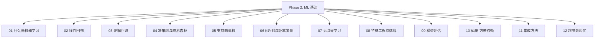

图表来源
- [phases/02-ml-fundamentals/README.md](file://phases/02-ml-fundamentals/README.md)

章节来源
- [phases/02-ml-fundamentals/README.md](file://phases/02-ml-fundamentals/README.md)

## 核心组件
- 监督学习基础：线性回归、逻辑回归、决策树、支持向量机、K近邻
- 无监督学习：K-Means、DBSCAN、高斯混合模型
- 特征工程与选择：数值变换、类别编码、文本向量化、缺失值处理、过滤式选择
- 模型评估：训练/验证/测试划分、K折交叉验证、分类与回归指标、学习曲线
- 集成方法：Bagging、AdaBoost、梯度提升、XGBoost、堆叠
- 超参数调优：网格搜索、随机搜索、贝叶斯优化、早停、分层策略

章节来源
- [phases/02-ml-fundamentals/02-linear-regression/docs/en.md](file://phases/02-ml-fundamentals/02-linear-regression/docs/en.md)
- [phases/02-ml-fundamentals/03-logistic-regression/docs/en.md](file://phases/02-ml-fundamentals/03-logistic-regression/docs/en.md)
- [phases/02-ml-fundamentals/04-decision-trees/docs/en.md](file://phases/02-ml-fundamentals/04-decision-trees/docs/en.md)
- [phases/02-ml-fundamentals/05-support-vector-machines/docs/en.md](file://phases/02-ml-fundamentals/05-support-vector-machines/docs/en.md)
- [phases/02-ml-fundamentals/07-unsupervised-learning/docs/en.md](file://phases/02-ml-fundamentals/07-unsupervised-learning/docs/en.md)
- [phases/02-ml-fundamentals/08-feature-engineering/docs/en.md](file://phases/02-ml-fundamentals/08-feature-engineering/docs/en.md)
- [phases/02-ml-fundamentals/09-model-evaluation/docs/en.md](file://phases/02-ml-fundamentals/09-model-evaluation/docs/en.md)
- [phases/02-ml-fundamentals/11-ensemble-methods/docs/en.md](file://phases/02-ml-fundamentals/11-ensemble-methods/docs/en.md)
- [phases/02-ml-fundamentals/12-hyperparameter-tuning/docs/en.md](file://phases/02-ml-fundamentals/12-hyperparameter-tuning/docs/en.md)

## 架构总览
下图展示了课程中各模块之间的关系与演进顺序：从“问题定义与数据准备”到“特征工程”，再到“模型训练与评估”，最后进入“集成与调参”的闭环。

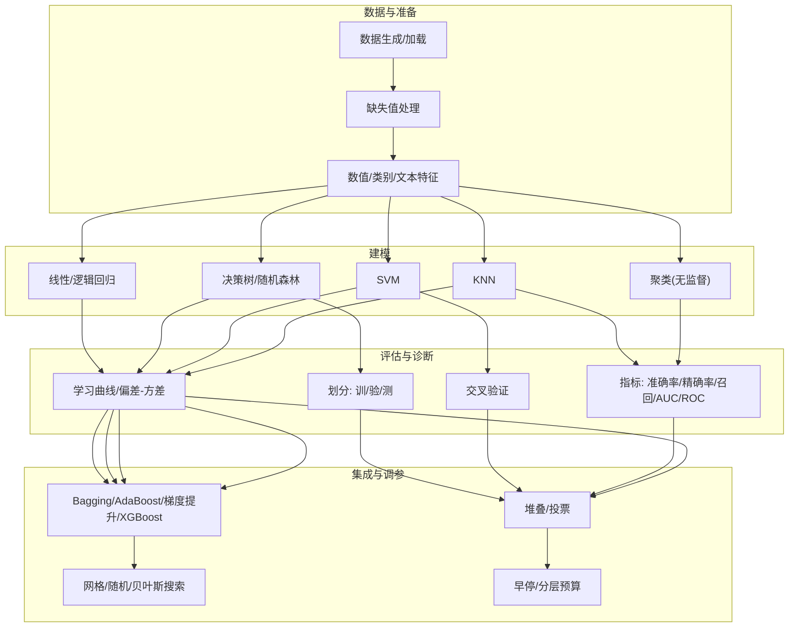

图表来源
- [phases/02-ml-fundamentals/08-feature-engineering/docs/en.md](file://phases/02-ml-fundamentals/08-feature-engineering/docs/en.md)
- [phases/02-ml-fundamentals/09-model-evaluation/docs/en.md](file://phases/02-ml-fundamentals/09-model-evaluation/docs/en.md)
- [phases/02-ml-fundamentals/11-ensemble-methods/docs/en.md](file://phases/02-ml-fundamentals/11-ensemble-methods/docs/en.md)
- [phases/02-ml-fundamentals/12-hyperparameter-tuning/docs/en.md](file://phases/02-ml-fundamentals/12-hyperparameter-tuning/docs/en.md)

## 详细组件分析

### 线性回归
- 数学原理：最小二乘/均方误差(MSE)、梯度下降、正规方程；正则化(岭回归)防止过拟合
- 实现要点：批量/随机梯度下降、特征标准化、多项式特征、R²评价
- 适用场景：回归基准、需求可解释性、特征工程友好

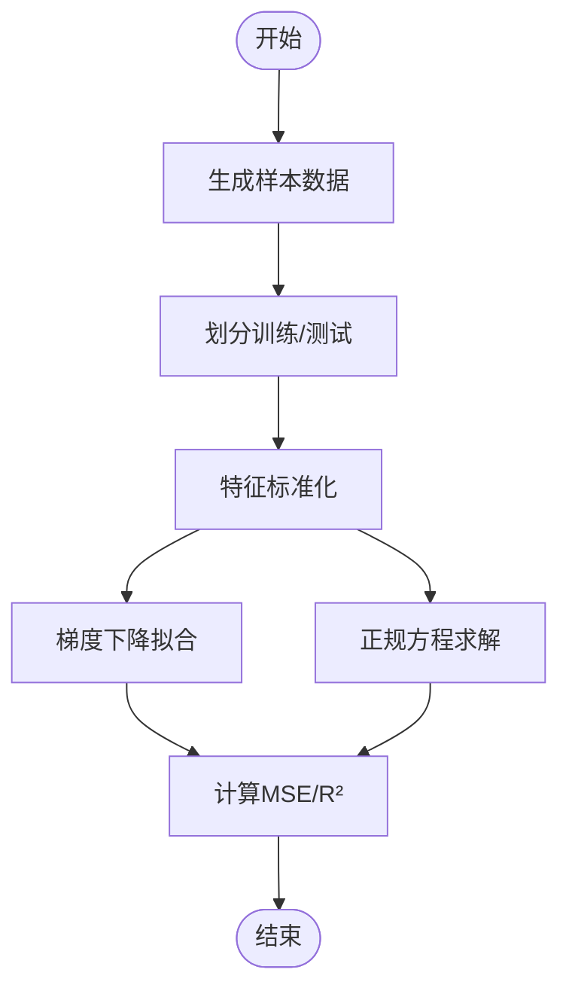

图表来源
- [phases/02-ml-fundamentals/02-linear-regression/docs/en.md](file://phases/02-ml-fundamentals/02-linear-regression/docs/en.md)

章节来源
- [phases/02-ml-fundamentals/02-linear-regression/docs/en.md](file://phases/02-ml-fundamentals/02-linear-regression/docs/en.md)

### 逻辑回归
- 数学原理：sigmoid函数、二元交叉熵损失、凸性保证；softmax扩展至多分类
- 实现要点：梯度更新、阈值调优、混淆矩阵与精度/召回/F1/AUC
- 适用场景：二分类/多分类、概率输出、快速基线

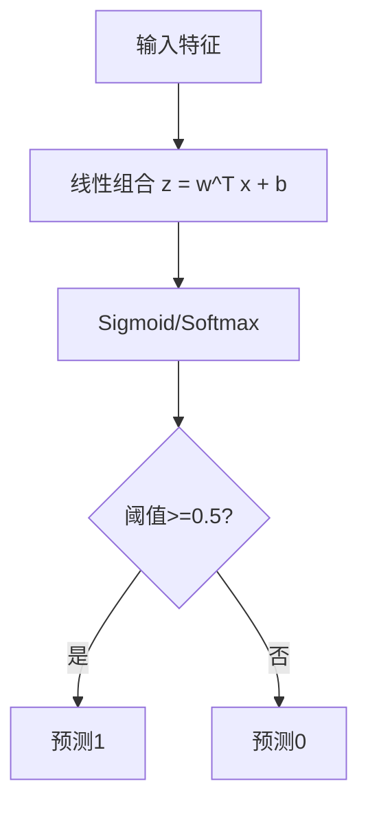

图表来源
- [phases/02-ml-fundamentals/03-logistic-regression/docs/en.md](file://phases/02-ml-fundamentals/03-logistic-regression/docs/en.md)

章节来源
- [phases/02-ml-fundamentals/03-logistic-regression/docs/en.md](file://phases/02-ml-fundamentals/03-logistic-regression/docs/en.md)

### 决策树与随机森林
- 数学原理：基尼不纯度/熵、信息增益、递归分割；预剪枝/后剪枝；随机森林通过自助采样与特征随机化降低方差
- 实现要点：最佳分割搜索、停止条件、MDI特征重要性、袋外误差估计
- 适用场景：表格数据、非线性边界、可解释性、抗噪声

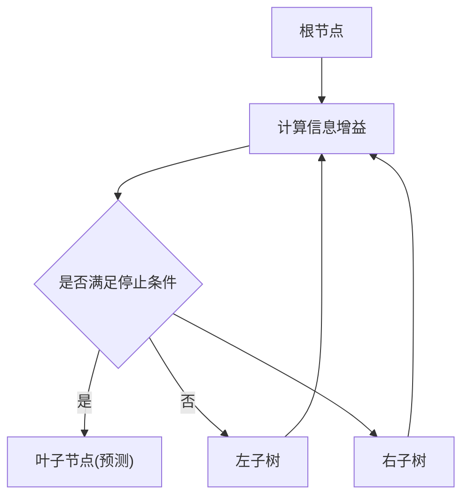

图表来源
- [phases/02-ml-fundamentals/04-decision-trees/docs/en.md](file://phases/02-ml-fundamentals/04-decision-trees/docs/en.md)

章节来源
- [phases/02-ml-fundamentals/04-decision-trees/docs/en.md](file://phases/02-ml-fundamentals/04-decision-trees/docs/en.md)

### 支持向量机
- 数学原理：最大间隔、软间隔、铰链损失、核技巧；RBF/多项式/线性核
- 实现要点：梯度下降求解、支持向量识别、特征缩放
- 适用场景：中小规模高维稀疏数据、需要理论界、内存效率

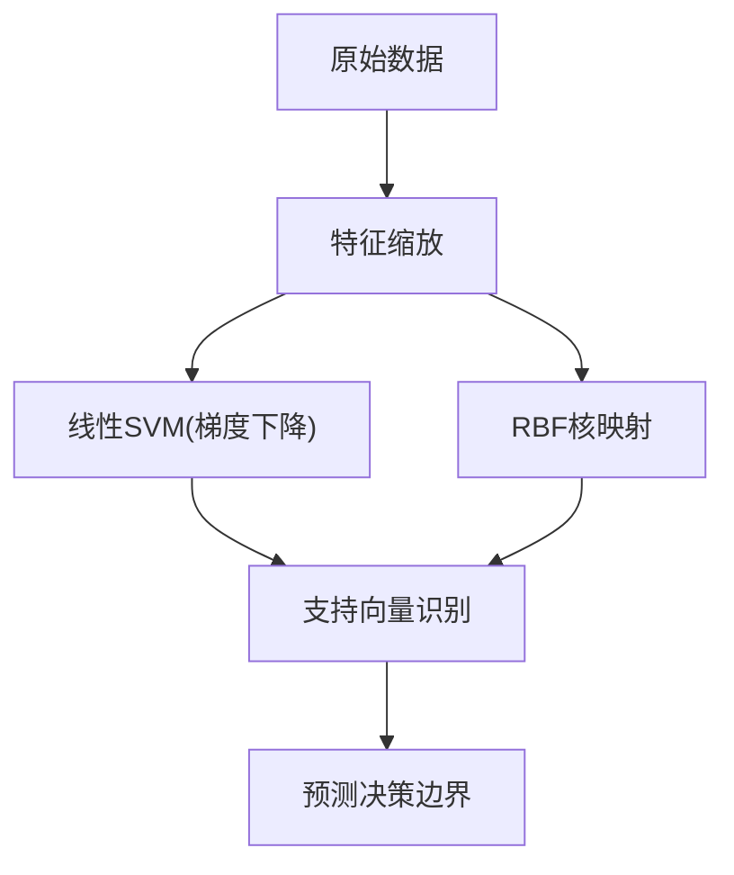

图表来源
- [phases/02-ml-fundamentals/05-support-vector-machines/docs/en.md](file://phases/02-ml-fundamentals/05-support-vector-machines/docs/en.md)

章节来源
- [phases/02-ml-fundamentals/05-support-vector-machines/docs/en.md](file://phases/02-ml-fundamentals/05-support-vector-machines/docs/en.md)

### K近邻与距离度量
- 数学原理：基于实例的学习、距离度量(欧氏/曼哈顿/余弦)、k值选择
- 实现要点：特征缩放、加权投票、交叉验证选k
- 适用场景：局部模式明显、小样本、无需显式模型

章节来源
- [phases/02-ml-fundamentals/06-knn-and-distances/docs/en.md](file://phases/02-ml-fundamentals/06-knn-and-distances/docs/en.md)

### 无监督学习：聚类与异常检测
- 方法对比：K-Means(球形簇)、DBSCAN(任意形状/噪声)、GMM(软分配/椭球)
- 评估：轮廓系数、肘部法则、密度参数敏感性
- 应用：异常点检测、客户细分、降维预处理

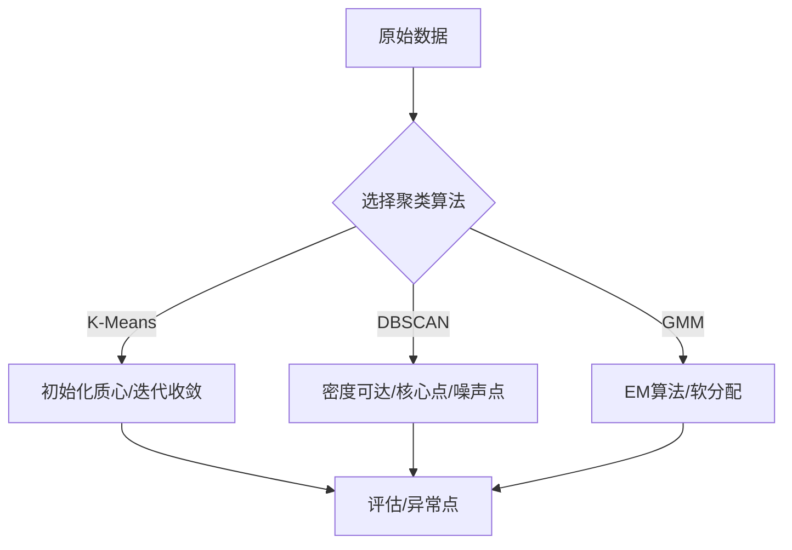

图表来源
- [phases/02-ml-fundamentals/07-unsupervised-learning/docs/en.md](file://phases/02-ml-fundamentals/07-unsupervised-learning/docs/en.md)

章节来源
- [phases/02-ml-fundamentals/07-unsupervised-learning/docs/en.md](file://phases/02-ml-fundamentals/07-unsupervised-learning/docs/en.md)

### 特征工程与特征选择
- 变换：标准化/归一化、对数/分箱、多项式交互
- 编码：独热/标签/目标编码(注意数据泄露风险)
- 文本：词频/TF-IDF
- 选择：方差阈值、相关性过滤、互信息

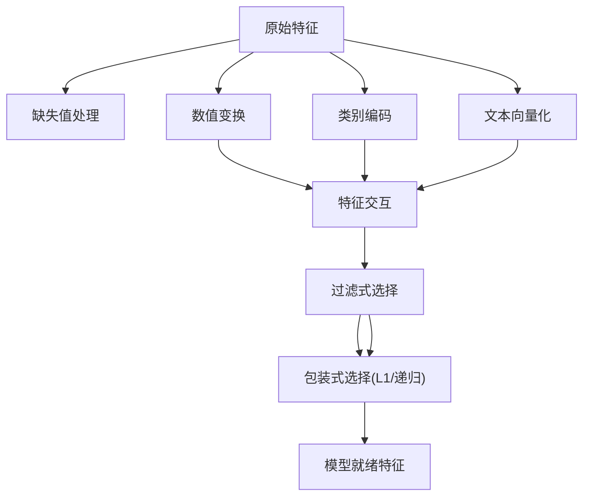

图表来源
- [phases/02-ml-fundamentals/08-feature-engineering/docs/en.md](file://phases/02-ml-fundamentals/08-feature-engineering/docs/en.md)

章节来源
- [phases/02-ml-fundamentals/08-feature-engineering/docs/en.md](file://phases/02-ml-fundamentals/08-feature-engineering/docs/en.md)

### 模型评估与偏差-方差诊断
- 划分：训练/验证/测试三集；K折/分层K折
- 指标：分类(AUC-ROC/PR)、回归(MSE/RMSE/MAE/R²)
- 诊断：学习曲线、验证曲线、偏差-方差权衡
- 常见误区：数据泄露、错误指标、测试集滥用

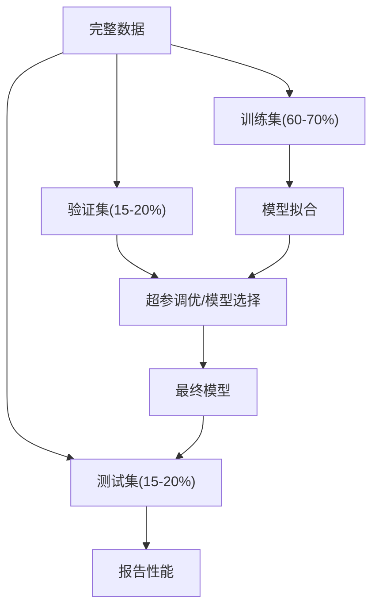

图表来源
- [phases/02-ml-fundamentals/09-model-evaluation/docs/en.md](file://phases/02-ml-fundamentals/09-model-evaluation/docs/en.md)

章节来源
- [phases/02-ml-fundamentals/09-model-evaluation/docs/en.md](file://phases/02-ml-fundamentals/09-model-evaluation/docs/en.md)
- [phases/02-ml-fundamentals/10-bias-variance/docs/en.md](file://phases/02-ml-fundamentals/10-bias-variance/docs/en.md)

### 集成方法
- Bagging：通过自助采样降低方差
- Boosting：AdaBoost/梯度提升逐步减小偏差
- XGBoost：工程化优化的梯度提升，广泛用于表格数据
- Stacking：元学习器融合多个基学习器

图表来源
- [phases/02-ml-fundamentals/11-ensemble-methods/docs/en.md](file://phases/02-ml-fundamentals/11-ensemble-methods/docs/en.md)

章节来源
- [phases/02-ml-fundamentals/11-ensemble-methods/docs/en.md](file://phases/02-ml-fundamentals/11-ensemble-methods/docs/en.md)

### 超参数调优
- 搜索策略：网格/随机/贝叶斯优化；早停/Hyperband
- 学习率调度：阶梯衰减/余弦退火/热身+退火
- 分层策略：先粗后精、按重要性分配预算、嵌套交叉验证

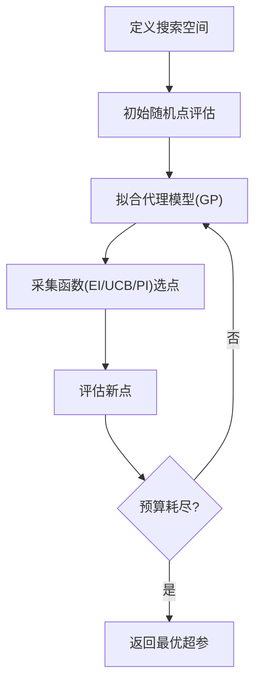

图表来源
- [phases/02-ml-fundamentals/12-hyperparameter-tuning/docs/en.md](file://phases/02-ml-fundamentals/12-hyperparameter-tuning/docs/en.md)

章节来源
- [phases/02-ml-fundamentals/12-hyperparameter-tuning/docs/en.md](file://phases/02-ml-fundamentals/12-hyperparameter-tuning/docs/en.md)

## 依赖分析
- 算法间耦合：特征工程直接影响模型表现；评估策略决定超参选择可信度；集成方法在评估基础上进一步提升性能
- 外部依赖：课程提供从零实现与可视化演示，便于理解底层机制；生产落地可结合sklearn等库

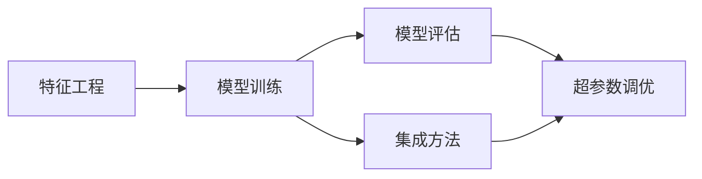

图表来源
- [phases/02-ml-fundamentals/08-feature-engineering/docs/en.md](file://phases/02-ml-fundamentals/08-feature-engineering/docs/en.md)
- [phases/02-ml-fundamentals/09-model-evaluation/docs/en.md](file://phases/02-ml-fundamentals/09-model-evaluation/docs/en.md)
- [phases/02-ml-fundamentals/11-ensemble-methods/docs/en.md](file://phases/02-ml-fundamentals/11-ensemble-methods/docs/en.md)
- [phases/02-ml-fundamentals/12-hyperparameter-tuning/docs/en.md](file://phases/02-ml-fundamentals/12-hyperparameter-tuning/docs/en.md)

## 性能考虑
- 计算复杂度：线性/逻辑回归、SVM(线性核)适合大规模；树模型在中等规模表现稳健；深度学习在结构化数据上未必优于树模型
- 数据规模与维度：SVM在高维稀疏数据上高效；随机森林/XGBoost在表格数据上通常更胜一筹
- 工程化建议：优先特征工程与简单模型；必要时引入集成与调参；始终以独立测试集评估最终性能

## 故障排除指南
- 数据泄露：预处理必须在划分之后进行，避免未来信息污染
- 指标误用：不平衡数据用精确率/召回/F1/AUC，而非准确率
- 过拟合迹象：训练高、验证低；增大正则、收集更多数据、简化模型
- 评估不稳定：使用分层K折；避免多次查看测试集
- 调参陷阱：搜索范围过窄、未考虑参数交互、过度拟合验证集

章节来源
- [phases/02-ml-fundamentals/09-model-evaluation/docs/en.md](file://phases/02-ml-fundamentals/09-model-evaluation/docs/en.md)
- [phases/02-ml-fundamentals/12-hyperparameter-tuning/docs/en.md](file://phases/02-ml-fundamentals/12-hyperparameter-tuning/docs/en.md)

## 结论
机器学习基础课程以“从零实现+可视化理解+工程化实践”为主线，系统覆盖监督学习、无监督学习、模型评估、集成与调参等关键环节。通过本课程，学习者不仅能够掌握经典算法的数学原理与实现细节，还能形成在真实数据上进行特征工程、模型选择与超参数调优的系统方法论，为后续深度学习与大模型工程打下坚实基础。

## 附录
- 互动可视化：课程配套可视化脚本展示了交叉验证、SVM边距、KNN平滑、K-Means步进、决策树深度、特征缩放、朴素贝叶斯、类别不平衡、K折CV等概念
- 在线测验：站点内包含与ML、回归、分类、监督学习相关的测验题，可用于自检与强化

章节来源
- [site/figures-ml.js](file://site/figures-ml.js)
- [site/lesson.html](file://site/lesson.html)
- [site/data.js](file://site/data.js)