# 机器学习概述

<cite>
**本文档引用的文件**
- [phases/02-ml-fundamentals/01-what-is-machine-learning/docs/en.md](file://phases/02-ml-fundamentals/01-what-is-machine-learning/docs/en.md)
- [phases/02-ml-fundamentals/02-linear-regression/docs/en.md](file://phases/02-ml-fundamentals/02-linear-regression/docs/en.md)
- [phases/02-ml-fundamentals/03-logistic-regression/docs/en.md](file://phases/02-ml-fundamentals/03-logistic-regression/docs/en.md)
- [phases/02-ml-fundamentals/07-unsupervised-learning/docs/en.md](file://phases/02-ml-fundamentals/07-unsupervised-learning/docs/en.md)
- [phases/02-ml-fundamentals/08-feature-engineering/docs/en.md](file://phases/02-ml-fundamentals/08-feature-engineering/docs/en.md)
- [phases/02-ml-fundamentals/09-model-evaluation/docs/en.md](file://phases/02-ml-fundamentals/09-model-evaluation/docs/en.md)
- [phases/02-ml-fundamentals/10-bias-variance/docs/en.md](file://phases/02-ml-fundamentals/10-bias-variance/docs/en.md)
- [phases/02-ml-fundamentals/11-ensemble-methods/docs/en.md](file://phases/02-ml-fundamentals/11-ensemble-methods/docs/en.md)
- [phases/02-ml-fundamentals/12-hyperparameter-tuning/docs/en.md](file://phases/02-ml-fundamentals/12-hyperparameter-tuning/docs/en.md)
- [site/lesson.html](file://site/lesson.html)
</cite>

## 目录
1. [引言](#引言)
2. [项目结构](#项目结构)
3. [核心组件](#核心组件)
4. [架构总览](#架构总览)
5. [详细组件分析](#详细组件分析)
6. [依赖关系分析](#依赖关系分析)
7. [性能考量](#性能考量)
8. [故障排除指南](#故障排除指南)
9. [结论](#结论)
10. [附录](#附录)

## 引言
本课程面向初学者，系统性地介绍机器学习的基础知识与实践路径。你将理解什么是机器学习、监督学习与无监督学习的区别、机器学习的基本流程与核心概念；掌握数据收集、特征工程、模型训练、评估与部署的关键环节；并通过真实场景案例加深对整体流程的认知。

## 项目结构
该仓库以“阶段化学习”的方式组织内容，其中第二阶段“机器学习基础”提供了从入门到进阶的完整路径。每个主题都包含：
- 教学文档：讲解概念、算法原理与实践步骤
- 示例代码：从零实现关键算法，便于深入理解
- 练习与作业：巩固知识点并提升实战能力
- 输出产物：可复用的提示词与技能模板

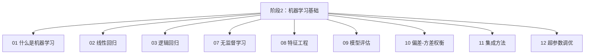

**章节来源**
- [phases/02-ml-fundamentals/01-what-is-machine-learning/docs/en.md:1-412](file://phases/02-ml-fundamentals/01-what-is-machine-learning/docs/en.md#L1-L412)
- [phases/02-ml-fundamentals/02-linear-regression/docs/en.md:1-549](file://phases/02-ml-fundamentals/02-linear-regression/docs/en.md#L1-L549)
- [phases/02-ml-fundamentals/03-logistic-regression/docs/en.md:1-527](file://phases/02-ml-fundamentals/03-logistic-regression/docs/en.md#L1-L527)
- [phases/02-ml-fundamentals/07-unsupervised-learning/docs/en.md:1-502](file://phases/02-ml-fundamentals/07-unsupervised-learning/docs/en.md#L1-L502)
- [phases/02-ml-fundamentals/08-feature-engineering/docs/en.md:1-585](file://phases/02-ml-fundamentals/08-feature-engineering/docs/en.md#L1-L585)
- [phases/02-ml-fundamentals/09-model-evaluation/docs/en.md:1-680](file://phases/02-ml-fundamentals/09-model-evaluation/docs/en.md#L1-L680)
- [phases/02-ml-fundamentals/10-bias-variance/docs/en.md:1-468](file://phases/02-ml-fundamentals/10-bias-variance/docs/en.md#L1-L468)
- [phases/02-ml-fundamentals/11-ensemble-methods/docs/en.md:1-352](file://phases/02-ml-fundamentals/11-ensemble-methods/docs/en.md#L1-L352)
- [phases/02-ml-fundamentals/12-hyperparameter-tuning/docs/en.md:1-566](file://phases/02-ml-fundamentals/12-hyperparameter-tuning/docs/en.md#L1-L566)

## 核心组件
- 机器学习定义与范式
  - 机器学习是“从数据中发现模式”的技术，区别于传统编程（手工写规则）。三大范式：监督学习（分类/回归）、无监督学习（聚类/降维）、强化学习（策略优化/价值学习）。
  - 分类与回归任务的输出空间、损失函数与决策边界不同，需选择合适的算法与评估指标。
- 机器学习工作流
  - 数据收集 → 清洗与探索 → 特征工程 → 数据划分（训练/验证/测试）→ 训练模型 → 评估 → 部署 → 监控与再训练。
- 关键诊断与权衡
  - 过拟合（高方差）与欠拟合（高偏差）的识别与修复策略；偏差-方差权衡决定模型复杂度的选择。
- 实践工具链
  - 从零实现线性/逻辑回归、K-Means、随机森林、梯度提升等经典算法；使用交叉验证、学习曲线、AUC等评估手段；通过超参数调优提升性能。

**章节来源**
- [phases/02-ml-fundamentals/01-what-is-machine-learning/docs/en.md:104-152](file://phases/02-ml-fundamentals/01-what-is-machine-learning/docs/en.md#L104-L152)
- [phases/02-ml-fundamentals/10-bias-variance/docs/en.md:27-53](file://phases/02-ml-fundamentals/10-bias-variance/docs/en.md#L27-L53)
- [phases/02-ml-fundamentals/09-model-evaluation/docs/en.md:27-50](file://phases/02-ml-fundamentals/09-model-evaluation/docs/en.md#L27-L50)

## 架构总览
下图展示了机器学习项目的端到端流程与各模块之间的关系：

**图表来源**
- [phases/02-ml-fundamentals/01-what-is-machine-learning/docs/en.md:120-152](file://phases/02-ml-fundamentals/01-what-is-machine-learning/docs/en.md#L120-L152)

**章节来源**
- [phases/02-ml-fundamentals/01-what-is-machine-learning/docs/en.md:120-152](file://phases/02-ml-fundamentals/01-what-is-machine-learning/docs/en.md#L120-L152)

## 详细组件分析

### 1. 什么是机器学习
- 学习目标
  - 区分监督、无监督、强化学习；识别问题类型；实现最近邻质心分类器并对比随机基线。
- 核心概念
  - 三种范式与子类（分类、回归、聚类、降维、策略优化、价值学习）。
  - 分类 vs 回归：离散类别 vs 连续数值；损失函数与决策边界差异。
  - 工作流：数据收集 → 清洗 → 特征工程 → 划分 → 训练 → 评估 → 部署 → 监控。
  - 训练/验证/测试划分与交叉验证；过拟合与欠拟合的识别与修复。
- 实践要点
  - 任何模型都要与基线比较；不要在测试集上做超参数调整；当数据量不足时采用K折交叉验证。

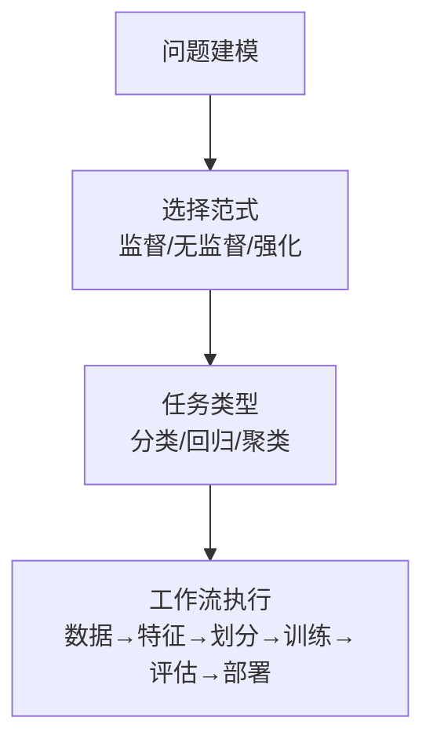

**图表来源**
- [phases/02-ml-fundamentals/01-what-is-machine-learning/docs/en.md:54-84](file://phases/02-ml-fundamentals/01-what-is-machine-learning/docs/en.md#L54-L84)
- [phases/02-ml-fundamentals/01-what-is-machine-learning/docs/en.md:104-152](file://phases/02-ml-fundamentals/01-what-is-machine-learning/docs/en.md#L104-L152)

**章节来源**
- [phases/02-ml-fundamentals/01-what-is-machine-learning/docs/en.md:10-16](file://phases/02-ml-fundamentals/01-what-is-machine-learning/docs/en.md#L10-L16)
- [phases/02-ml-fundamentals/01-what-is-machine-learning/docs/en.md:54-84](file://phases/02-ml-fundamentals/01-what-is-machine-learning/docs/en.md#L54-L84)
- [phases/02-ml-fundamentals/01-what-is-machine-learning/docs/en.md:104-152](file://phases/02-ml-fundamentals/01-what-is-machine-learning/docs/en.md#L104-L152)

### 2. 线性回归
- 学习目标
  - 推导均方误差的梯度下降更新规则并从零实现；对比批量梯度下降与正规方程；构建多元线性回归并进行特征标准化；解释岭回归（L2正则）如何防止过拟合。
- 核心概念
  - 线性模型假设输入与输出存在线性关系；均方误差作为成本函数；梯度下降迭代更新参数；正规方程给出闭式解；多项式回归通过构造非线性特征拟合曲线；R²衡量解释方差比例；L2正则收缩权重，缓解过拟合。
- 实践要点
  - 多特征需标准化；多项式度数过高易过拟合；Ridge回归用于控制复杂度。

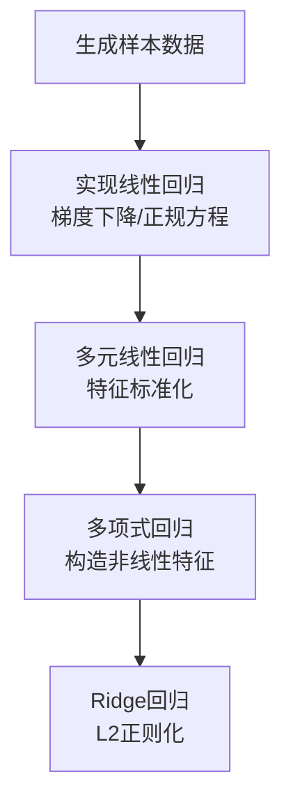

**图表来源**
- [phases/02-ml-fundamentals/02-linear-regression/docs/en.md:25-149](file://phases/02-ml-fundamentals/02-linear-regression/docs/en.md#L25-L149)

**章节来源**
- [phases/02-ml-fundamentals/02-linear-regression/docs/en.md:10-16](file://phases/02-ml-fundamentals/02-linear-regression/docs/en.md#L10-L16)
- [phases/02-ml-fundamentals/02-linear-regression/docs/en.md:25-149](file://phases/02-ml-fundamentals/02-linear-regression/docs/en.md#L25-L149)

### 3. 逻辑回归
- 学习目标
  - 使用Sigmoid函数与二元交叉熵实现逻辑回归；计算并解释混淆矩阵、精确率、召回率、F1分数；解释为何MSE不适合分类；多分类使用Softmax；阈值调优权衡。
- 核心概念
  - 线性模型 + Sigmoid得到概率输出；二元交叉熵保证凸性；决策边界由权重与偏置决定；多分类扩展至Softmax；评估指标强调在不平衡场景下的意义。
- 实践要点
  - 不要仅看准确率；根据业务代价选择Precision或Recall优先；阈值可调以适配不同场景。

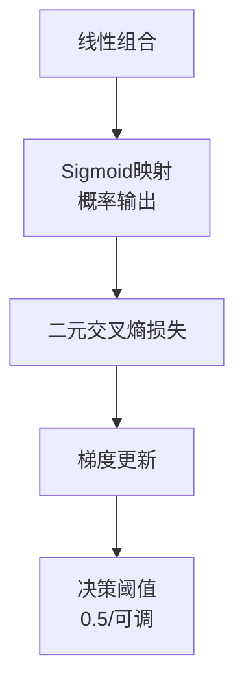

**图表来源**
- [phases/02-ml-fundamentals/03-logistic-regression/docs/en.md:60-111](file://phases/02-ml-fundamentals/03-logistic-regression/docs/en.md#L60-L111)

**章节来源**
- [phases/02-ml-fundamentals/03-logistic-regression/docs/en.md:10-16](file://phases/02-ml-fundamentals/03-logistic-regression/docs/en.md#L10-L16)
- [phases/02-ml-fundamentals/03-logistic-regression/docs/en.md:75-111](file://phases/02-ml-fundamentals/03-logistic-regression/docs/en.md#L75-L111)

### 4. 无监督学习
- 学习目标
  - 从零实现K-Means、DBSCAN、GMM；使用轮廓系数与肘部法则选K；基于聚类构建异常检测流水线。
- 核心概念
  - K-Means：球形簇、硬分配；DBSCAN：密度可达、自动确定簇数、识别噪声；层次聚类：树状结构；GMM：软分配、椭球簇。
- 实践要点
  - K-Means适合球形且已知K；DBSCAN适合任意形状与异常点；GMM适合重叠簇；结合业务语义选择合适方法。

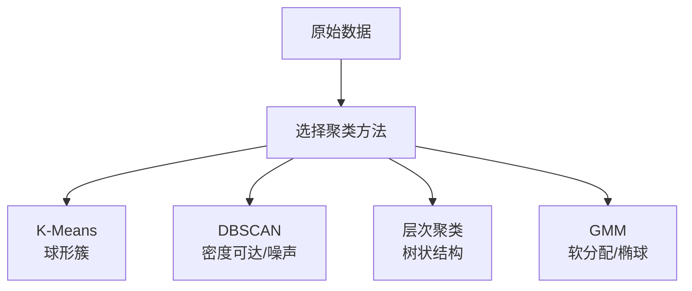

**图表来源**
- [phases/02-ml-fundamentals/07-unsupervised-learning/docs/en.md:27-42](file://phases/02-ml-fundamentals/07-unsupervised-learning/docs/en.md#L27-L42)

**章节来源**
- [phases/02-ml-fundamentals/07-unsupervised-learning/docs/en.md:10-16](file://phases/02-ml-fundamentals/07-unsupervised-learning/docs/en.md#L10-L16)
- [phases/02-ml-fundamentals/07-unsupervised-learning/docs/en.md:27-42](file://phases/02-ml-fundamentals/07-unsupervised-learning/docs/en.md#L27-L42)

### 5. 特征工程与选择
- 学习目标
  - 数值变换（标准化、最小-最大缩放、对数变换、分箱）、类别编码（独热、标签、目标编码）、文本向量化（TF-IDF）、缺失值处理、特征交互与筛选。
- 核心概念
  - 特征工程比算法更重要；数值缩放让距离敏感算法公平竞争；独热编码避免引入虚假序关系；目标编码有泄漏风险；TF-IDF突出文档中独特词汇；方差阈值、相关性、互信息等过滤冗余特征。
- 实践要点
  - 先清洗缺失值，再进行变换；注意类别分布与稀疏性；谨慎使用目标编码，避免数据泄漏。

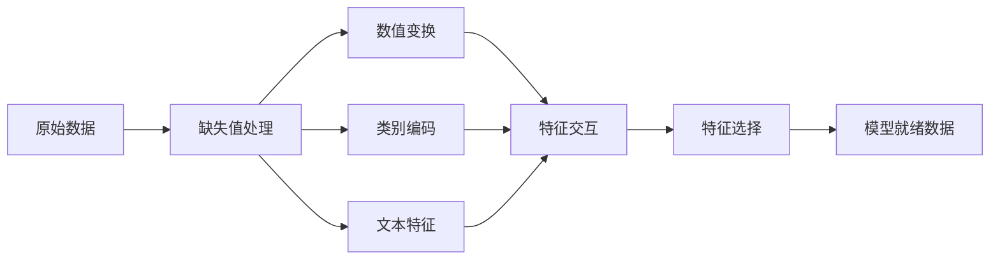

**图表来源**
- [phases/02-ml-fundamentals/08-feature-engineering/docs/en.md:29-42](file://phases/02-ml-fundamentals/08-feature-engineering/docs/en.md#L29-L42)

**章节来源**
- [phases/02-ml-fundamentals/08-feature-engineering/docs/en.md:10-16](file://phases/02-ml-fundamentals/08-feature-engineering/docs/en.md#L10-L16)
- [phases/02-ml-fundamentals/08-feature-engineering/docs/en.md:29-42](file://phases/02-ml-fundamentals/08-feature-engineering/docs/en.md#L29-L42)

### 6. 模型评估
- 学习目标
  - 从零实现K折与分层K折交叉验证；计算精度、召回率、F1、AUC-ROC与回归指标（MSE、RMSE、MAE、R²）；解读学习曲线诊断偏差/方差；识别常见评估错误（数据泄漏、指标误用、测试集污染）。
- 核心概念
  - 训练/验证/测试三阶段职责明确；K折交叉验证稳定估计泛化性能；分层采样保持类别比例；学习曲线揭示是否数据不足或容量不足；AUC-ROC不依赖阈值。
- 实践要点
  - 测试集只用一次；不平衡数据用Precision/Recall/AUC；避免数据泄漏；用嵌套交叉验证报告最终结果。

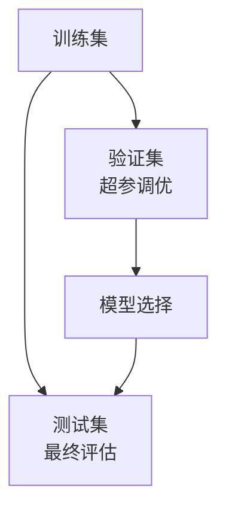

**图表来源**
- [phases/02-ml-fundamentals/09-model-evaluation/docs/en.md:27-50](file://phases/02-ml-fundamentals/09-model-evaluation/docs/en.md#L27-L50)

**章节来源**
- [phases/02-ml-fundamentals/09-model-evaluation/docs/en.md:10-16](file://phases/02-ml-fundamentals/09-model-evaluation/docs/en.md#L10-L16)
- [phases/02-ml-fundamentals/09-model-evaluation/docs/en.md:27-50](file://phases/02-ml-fundamentals/09-model-evaluation/docs/en.md#L27-L50)

### 7. 偏差-方差权衡
- 学习目标
  - 推导偏差-方差分解并解释不可约噪声；用训练/测试误差模式诊断偏差或方差主导；理解正则化如何在两者间折中；可视化不同复杂度下的偏差-方差曲线。
- 核心概念
  - 预期预测误差 = 偏差² + 方差 + 不可约噪声；高偏差导致欠拟合，高方差导致过拟合；正则化（L1/L2、Dropout、早停）降低方差；双下降现象说明超定情形下泛化可能再次改善。
- 实践要点
  - 先诊断再决策：若两者高则偏向增加复杂度，若差距大则偏向正则化；用学习曲线判断是否需要更多数据。

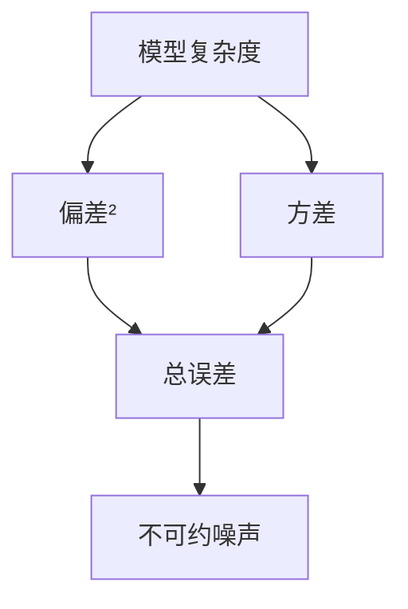

**图表来源**
- [phases/02-ml-fundamentals/10-bias-variance/docs/en.md:55-73](file://phases/02-ml-fundamentals/10-bias-variance/docs/en.md#L55-L73)

**章节来源**
- [phases/02-ml-fundamentals/10-bias-variance/docs/en.md:10-16](file://phases/02-ml-fundamentals/10-bias-variance/docs/en.md#L10-L16)
- [phases/02-ml-fundamentals/10-bias-variance/docs/en.md:55-73](file://phases/02-ml-fundamentals/10-bias-variance/docs/en.md#L55-L73)

### 8. 集成方法
- 学习目标
  - 从零实现AdaBoost与梯度提升；构建Bagging集成；比较Bagging（降方差）、Boosting（降偏差）、Stacking（元学习）；评估集成多样性。
- 核心概念
  - Bagging通过自助采样降低方差；随机森林在分割时随机选特征；AdaBoost按错误加权逐步纠正；梯度提升以残差为目标拟合；XGBoost工程优化广泛用于表格数据。
- 实践要点
  - 先尝试XGBoost/LightGBM，再考虑Stacking；确保基学习器多样性；避免在同一批数据上同时生成元特征。

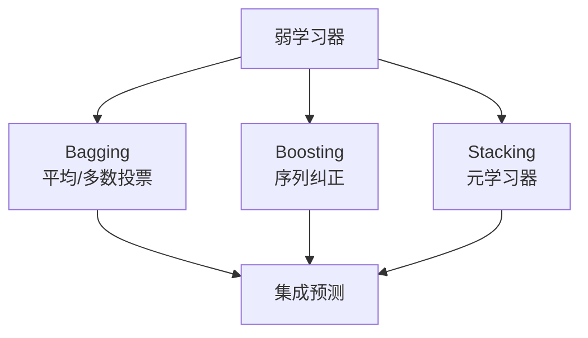

**图表来源**
- [phases/02-ml-fundamentals/11-ensemble-methods/docs/en.md:42-91](file://phases/02-ml-fundamentals/11-ensemble-methods/docs/en.md#L42-L91)

**章节来源**
- [phases/02-ml-fundamentals/11-ensemble-methods/docs/en.md:10-16](file://phases/02-ml-fundamentals/11-ensemble-methods/docs/en.md#L10-L16)
- [phases/02-ml-fundamentals/11-ensemble-methods/docs/en.md:42-91](file://phases/02-ml-fundamentals/11-ensemble-methods/docs/en.md#L42-L91)

### 9. 超参数调优
- 学习目标
  - 从零实现网格搜索、随机搜索与贝叶斯优化；解释为什么随机搜索在低有效维度下更高效；设计避免过拟合验证集的策略。
- 核心概念
  - 参数vs超参数：前者训练中学习，后者训练前设定；网格搜索穷举但昂贵；随机搜索覆盖重要维度更高效；贝叶斯优化用代理模型与采集函数引导搜索；早停减少无效训练；Hyperband自适应资源分配。
- 实践要点
  - 先默认后粗调，再细调；优先调学习率与正则强度；用嵌套交叉验证报告最终性能；对迭代模型使用早停替代调轮数。

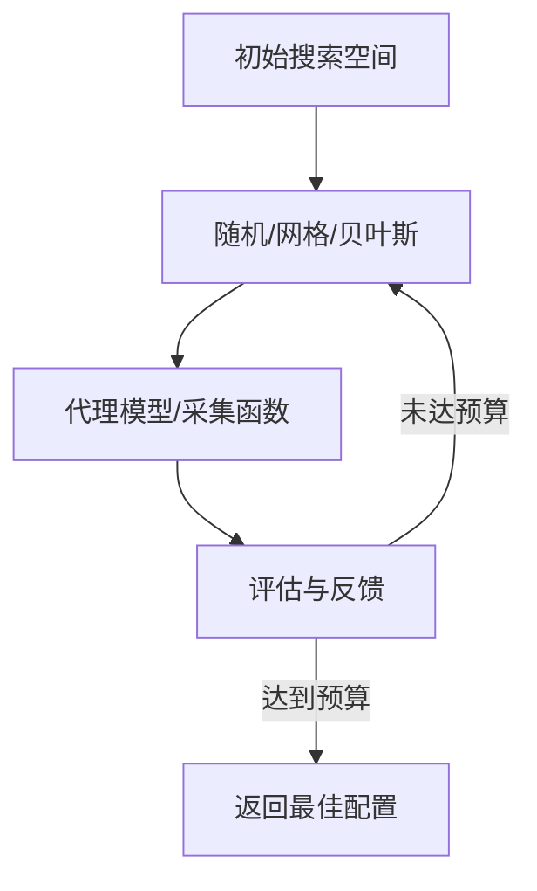

**图表来源**
- [phases/02-ml-fundamentals/12-hyperparameter-tuning/docs/en.md:83-109](file://phases/02-ml-fundamentals/12-hyperparameter-tuning/docs/en.md#L83-L109)

**章节来源**
- [phases/02-ml-fundamentals/12-hyperparameter-tuning/docs/en.md:10-16](file://phases/02-ml-fundamentals/12-hyperparameter-tuning/docs/en.md#L10-L16)
- [phases/02-ml-fundamentals/12-hyperparameter-tuning/docs/en.md:83-109](file://phases/02-ml-fundamentals/12-hyperparameter-tuning/docs/en.md#L83-L109)

## 依赖关系分析
- 主题内依赖
  - “什么是机器学习”为后续所有主题奠定概念基础；“线性/逻辑回归”提供监督学习入门；“无监督学习”承接特征工程与评估；“偏差-方差”贯穿模型诊断；“集成方法”与“超参数调优”用于提升性能。
- 实践依赖
  - 评估与调优依赖于正确的数据划分与指标选择；特征工程直接影响模型效果；集成与正则化用于解决偏差/方差问题。

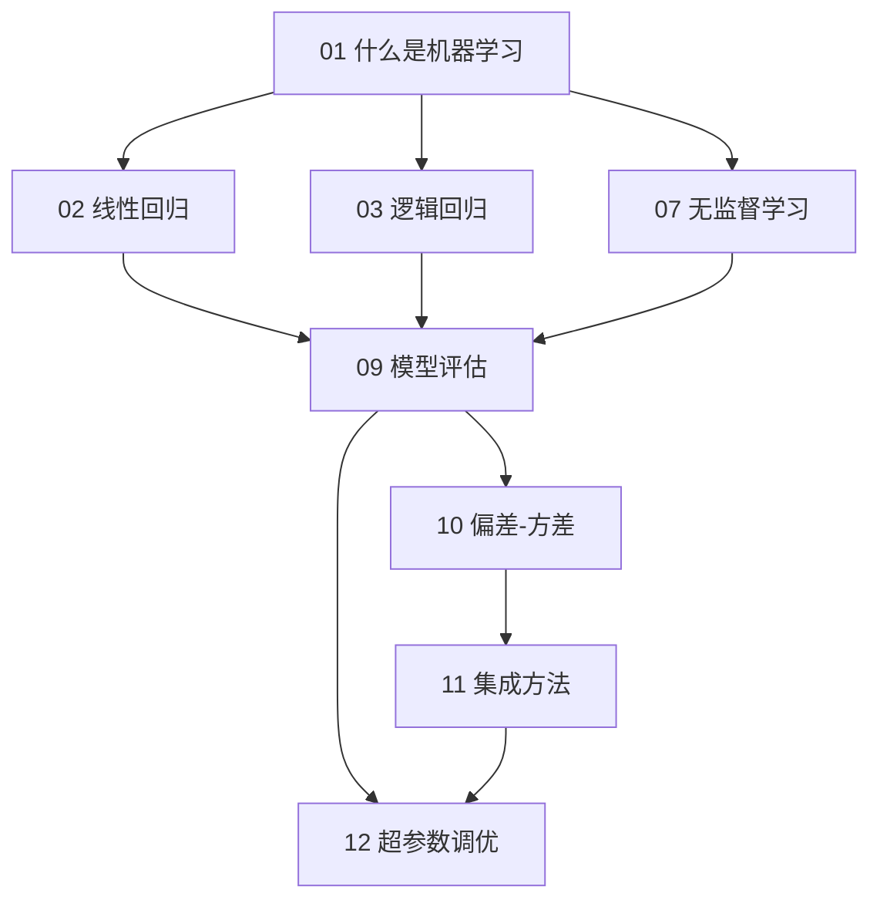

**图表来源**
- [phases/02-ml-fundamentals/01-what-is-machine-learning/docs/en.md:104-152](file://phases/02-ml-fundamentals/01-what-is-machine-learning/docs/en.md#L104-L152)
- [phases/02-ml-fundamentals/09-model-evaluation/docs/en.md:27-50](file://phases/02-ml-fundamentals/09-model-evaluation/docs/en.md#L27-L50)
- [phases/02-ml-fundamentals/10-bias-variance/docs/en.md:140-161](file://phases/02-ml-fundamentals/10-bias-variance/docs/en.md#L140-L161)

**章节来源**
- [phases/02-ml-fundamentals/01-what-is-machine-learning/docs/en.md:104-152](file://phases/02-ml-fundamentals/01-what-is-machine-learning/docs/en.md#L104-L152)
- [phases/02-ml-fundamentals/09-model-evaluation/docs/en.md:27-50](file://phases/02-ml-fundamentals/09-model-evaluation/docs/en.md#L27-L50)
- [phases/02-ml-fundamentals/10-bias-variance/docs/en.md:140-161](file://phases/02-ml-fundamentals/10-bias-variance/docs/en.md#L140-L161)

## 性能考量
- 数据层面
  - 更多数据通常更好，但质量更重要；小样本采用K折或分层K折；不平衡数据用分层采样与合适指标。
- 特征层面
  - 缩放与编码让模型公平竞争；去除冗余特征降低噪声；合理构造交互特征。
- 模型层面
  - 正则化控制复杂度；早停避免过度拟合；集成方法平衡偏差与方差。
- 调优层面
  - 随机搜索在低有效维度下更高效；贝叶斯优化用代理模型与采集函数引导；嵌套交叉验证可靠评估最终性能。

## 故障排除指南
- 常见误区
  - 在测试集上做超参数调整；仅用准确率评估不平衡问题；预处理先于划分导致数据泄漏；忽略阈值调优带来的权衡。
- 诊断步骤
  - 对比训练/测试误差，判断高偏差还是高方差；绘制学习曲线观察是否数据不足；用交叉验证稳定评估；检查特征分布与异常值。
- 解决方案
  - 增大数据或改进特征以解决高偏差；正则化、早停、集成以解决高方差；重新审视指标与阈值设置。

**章节来源**
- [phases/02-ml-fundamentals/09-model-evaluation/docs/en.md:133-144](file://phases/02-ml-fundamentals/09-model-evaluation/docs/en.md#L133-L144)
- [phases/02-ml-fundamentals/10-bias-variance/docs/en.md:140-161](file://phases/02-ml-fundamentals/10-bias-variance/docs/en.md#L140-L161)

## 结论
本课程以循序渐进的方式带你掌握机器学习的核心思想与实践流程。通过从零实现关键算法、系统化评估与调优，以及结合真实场景的案例分析，你将建立起对机器学习从数据到部署的完整认知，并具备在生产环境中解决问题的能力。

## 附录
- 课后练习建议
  - 将仓库中的示例代码在本地运行，替换为自己的数据集，观察不同指标与超参数的影响。
  - 尝试在真实业务场景中应用上述流程：先定义问题、再选择范式与算法、最后评估与部署。
- 相关题目参考
  - 仓库中还包含与机器学习相关的测验题目，可用于自检与加深理解。

**章节来源**
- [site/lesson.html:3202-3208](file://site/lesson.html#L3202-L3208)