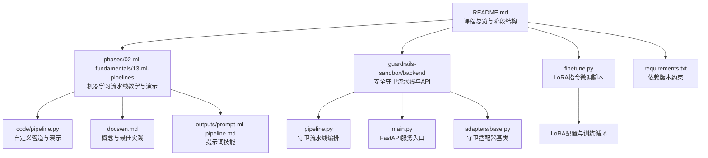
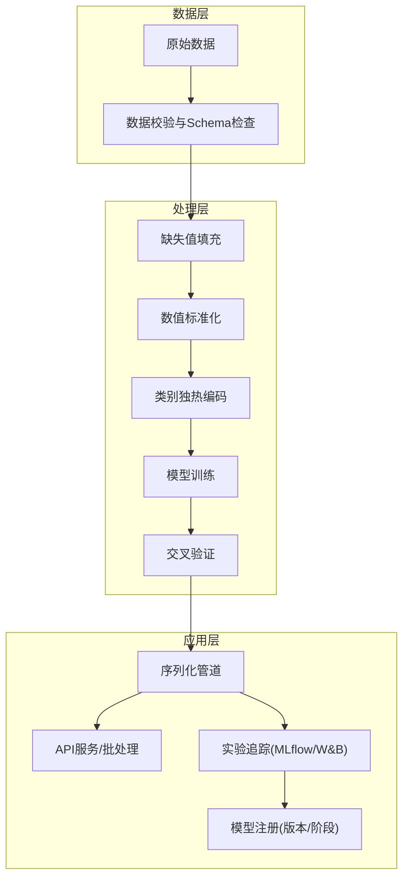
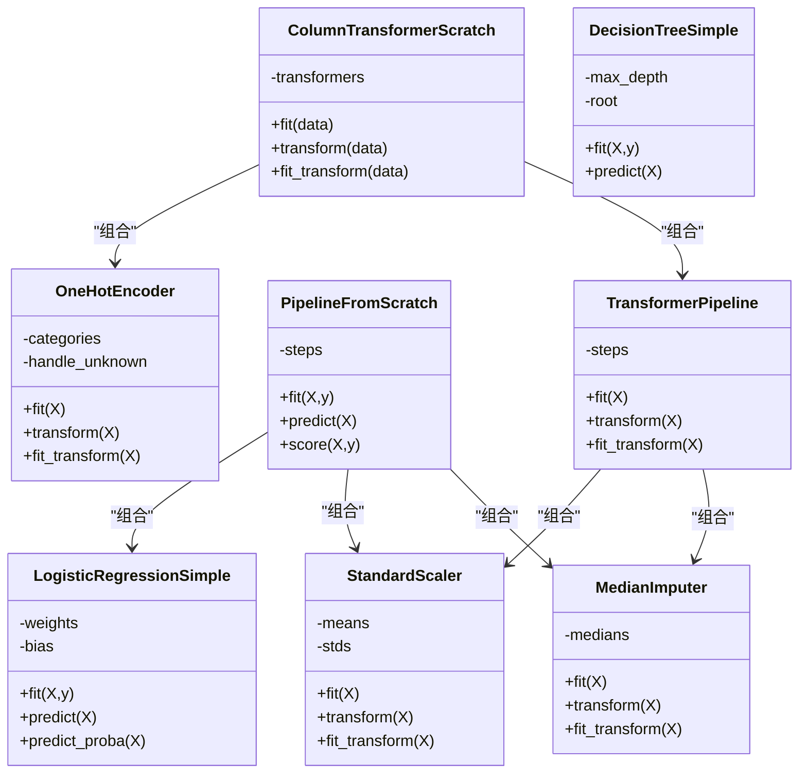
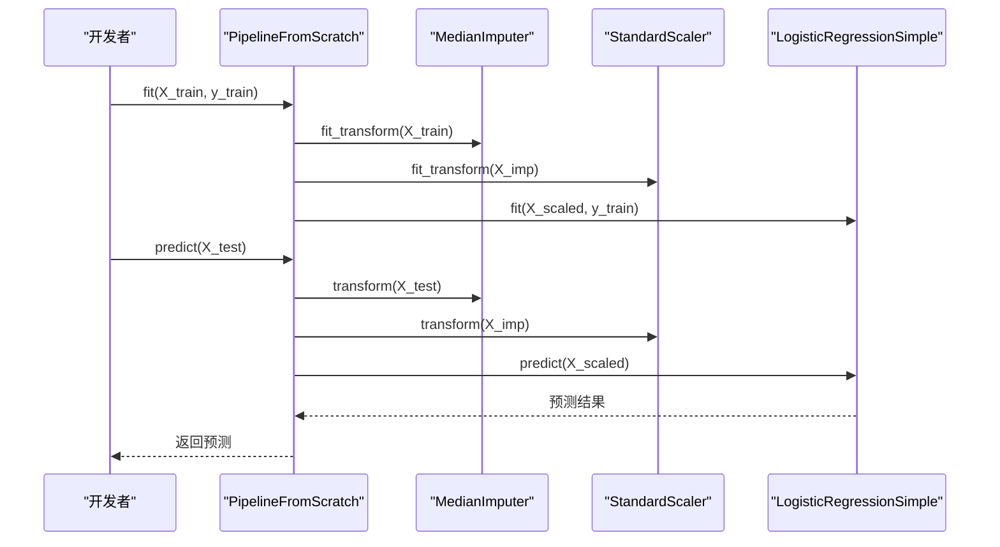
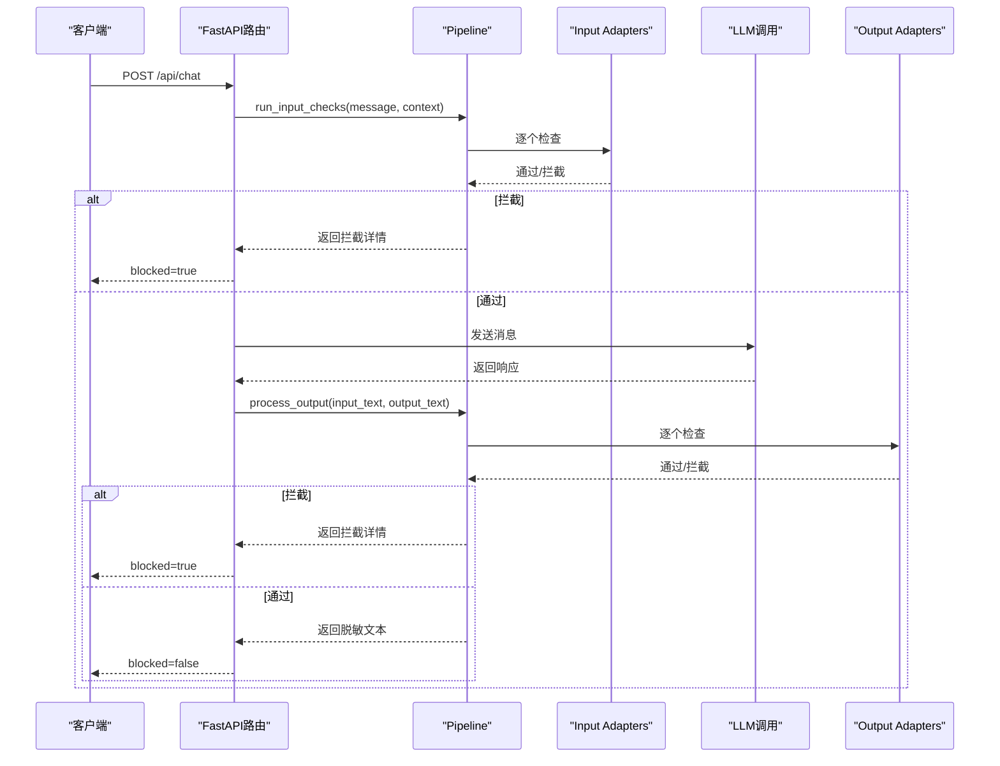
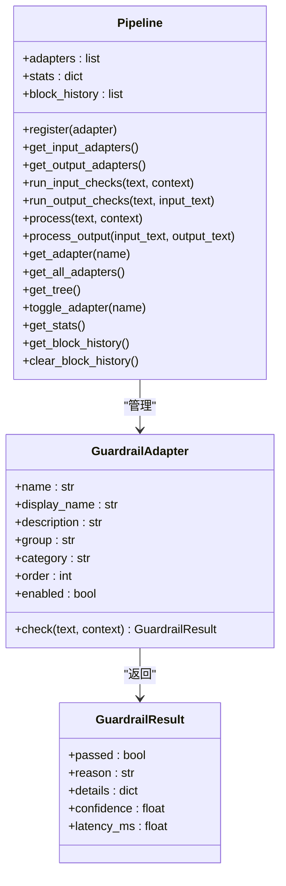
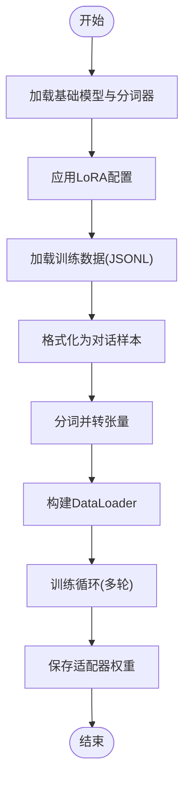
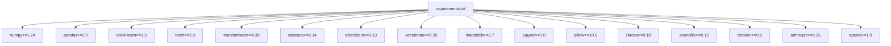

# 机器学习流水线

<cite>
**本文引用的文件**
- [README.md](file://README.md)
- [requirements.txt](file://requirements.txt)
- [phases/02-ml-fundamentals/13-ml-pipelines/code/pipeline.py](file://phases/02-ml-fundamentals/13-ml-pipelines/code/pipeline.py)
- [phases/02-ml-fundamentals/13-ml-pipelines/docs/en.md](file://phases/02-ml-fundamentals/13-ml-pipelines/docs/en.md)
- [phases/02-ml-fundamentals/13-ml-pipelines/outputs/prompt-ml-pipeline.md](file://phases/02-ml-fundamentals/13-ml-pipelines/outputs/prompt-ml-pipeline.md)
- [guardrails-sandbox/backend/pipeline.py](file://guardrails-sandbox/backend/pipeline.py)
- [guardrails-sandbox/backend/main.py](file://guardrails-sandbox/backend/main.py)
- [guardrails-sandbox/backend/adapters/base.py](file://guardrails-sandbox/backend/adapters/base.py)
- [finetune.py](file://finetune.py)
</cite>

## 目录
1. [引言](#引言)
2. [项目结构](#项目结构)
3. [核心组件](#核心组件)
4. [架构总览](#架构总览)
5. [详细组件分析](#详细组件分析)
6. [依赖关系分析](#依赖关系分析)
7. [性能考虑](#性能考虑)
8. [故障排查指南](#故障排查指南)
9. [结论](#结论)
10. [附录](#附录)

## 引言
本文件面向“从零开始构建AI工程”的学习者，系统性阐述如何从数据准备到模型部署，构建一条可复用、可追踪、可回滚、可扩展的机器学习流水线。该流水线覆盖数据加载、清洗、转换、训练、评估、预测等环节，并以“管道化”为核心设计原则，强调避免数据泄漏、跨折验证、实验追踪、版本管理与生产一致性。

## 项目结构
该项目是一个多阶段、多主题的工程化学习体系，其中与机器学习流水线直接相关的核心模块包括：
- 机器学习流水线教学与演示：位于“phases/02-ml-fundamentals/13-ml-pipelines”，包含从零实现的管道、交叉验证、未知类别处理、实验追踪等演示。
- 安全与合规守卫流水线：位于“guardrails-sandbox/backend”，提供输入/输出守卫的流水线编排与API接口，体现生产级流水线的“先检查再推理”的设计思想。
- 微调脚本：位于根目录的“finetune.py”，展示基于LoRA的指令微调流水线，体现训练与部署的一体化思路。
- 依赖清单：位于“requirements.txt”，统一约束了NumPy、PyTorch、Transformers、Scikit-learn、Pandas等关键库版本。

图表来源
- [README.md:1-120](file://README.md#L1-L120)
- [requirements.txt:1-19](file://requirements.txt#L1-L19)
- [phases/02-ml-fundamentals/13-ml-pipelines/code/pipeline.py:1-655](file://phases/02-ml-fundamentals/13-ml-pipelines/code/pipeline.py#L1-L655)
- [guardrails-sandbox/backend/pipeline.py:1-285](file://guardrails-sandbox/backend/pipeline.py#L1-L285)
- [guardrails-sandbox/backend/main.py:1-421](file://guardrails-sandbox/backend/main.py#L1-L421)
- [guardrails-sandbox/backend/adapters/base.py:1-34](file://guardrails-sandbox/backend/adapters/base.py#L1-L34)
- [finetune.py:1-67](file://finetune.py#L1-L67)

章节来源
- [README.md:1-120](file://README.md#L1-L120)
- [requirements.txt:1-19](file://requirements.txt#L1-L19)

## 核心组件
- 自定义机器学习管道（从零实现）：包含缺失值填充、标准化、独热编码、模型训练与预测、交叉验证、未知类别处理、与sklearn风格管道的对比、实验追踪与可复现性演示。
- 守卫流水线（生产级）：将注册的适配器按输入/输出分类、按顺序执行，遇到拦截即短路，全程记录日志与统计，支持开关控制与树形结构展示。
- 微调流水线（LoRA）：加载基础模型与分词器，应用LoRA配置，准备训练数据，进行训练并保存适配器权重。
- 依赖管理：统一的requirements.txt确保NumPy、PyTorch、Transformers、Scikit-learn等库版本一致。

章节来源
- [phases/02-ml-fundamentals/13-ml-pipelines/code/pipeline.py:1-655](file://phases/02-ml-fundamentals/13-ml-pipelines/code/pipeline.py#L1-L655)
- [guardrails-sandbox/backend/pipeline.py:1-285](file://guardrails-sandbox/backend/pipeline.py#L1-L285)
- [guardrails-sandbox/backend/main.py:1-421](file://guardrails-sandbox/backend/main.py#L1-L421)
- [guardrails-sandbox/backend/adapters/base.py:1-34](file://guardrails-sandbox/backend/adapters/base.py#L1-L34)
- [finetune.py:1-67](file://finetune.py#L1-L67)
- [requirements.txt:1-19](file://requirements.txt#L1-L19)

## 架构总览
机器学习流水线的总体架构分为三层：
- 数据层：原始数据加载与校验（可结合DVC进行数据版本管理）。
- 处理层：数据清洗、特征工程、预处理（数值/类别分别处理）、模型训练与评估（交叉验证）。
- 应用层：序列化管道、对外提供API或批处理服务、实验追踪与模型注册。

图表来源
- [phases/02-ml-fundamentals/13-ml-pipelines/docs/en.md:135-156](file://phases/02-ml-fundamentals/13-ml-pipelines/docs/en.md#L135-L156)
- [phases/02-ml-fundamentals/13-ml-pipelines/docs/en.md:172-181](file://phases/02-ml-fundamentals/13-ml-pipelines/docs/en.md#L172-L181)
- [phases/02-ml-fundamentals/13-ml-pipelines/docs/en.md:182-196](file://phases/02-ml-fundamentals/13-ml-pipelines/docs/en.md#L182-L196)

## 详细组件分析

### 组件A：自定义机器学习流水线（从零实现）
- 功能要点
  - 缺失值填充：中位数填充器，支持多列NaN掩码替换。
  - 数值标准化：均值方差标准化，避免零方差导致除零。
  - 独热编码：记录类别集合，未知类别返回零向量，防止生产崩溃。
  - 管道封装：将多个步骤串联，统一fit/transform/predict接口。
  - 列式变换器：针对不同列类型应用不同预处理子管道。
  - 交叉验证：每折仅在训练集上拟合预处理器，避免数据泄漏。
  - 模型比较：通过管道快速对比不同模型的CV分数。
  - 实验追踪：手动记录超参、指标、标准差，便于挑选最优模型。
  - 可复现性：固定随机种子，相同输入得到相同结果。
  - 与sklearn对比：展示ColumnTransformer与Pipeline的等价用法。

图表来源
- [phases/02-ml-fundamentals/13-ml-pipelines/code/pipeline.py:59-215](file://phases/02-ml-fundamentals/13-ml-pipelines/code/pipeline.py#L59-L215)
- [phases/02-ml-fundamentals/13-ml-pipelines/code/pipeline.py:119-141](file://phases/02-ml-fundamentals/13-ml-pipelines/code/pipeline.py#L119-L141)
- [phases/02-ml-fundamentals/13-ml-pipelines/code/pipeline.py:143-162](file://phases/02-ml-fundamentals/13-ml-pipelines/code/pipeline.py#L143-L162)
- [phases/02-ml-fundamentals/13-ml-pipelines/code/pipeline.py:164-182](file://phases/02-ml-fundamentals/13-ml-pipelines/code/pipeline.py#L164-L182)
- [phases/02-ml-fundamentals/13-ml-pipelines/code/pipeline.py:184-215](file://phases/02-ml-fundamentals/13-ml-pipelines/code/pipeline.py#L184-L215)
- [phases/02-ml-fundamentals/13-ml-pipelines/code/pipeline.py:217-271](file://phases/02-ml-fundamentals/13-ml-pipelines/code/pipeline.py#L217-L271)

图表来源
- [phases/02-ml-fundamentals/13-ml-pipelines/code/pipeline.py:119-141](file://phases/02-ml-fundamentals/13-ml-pipelines/code/pipeline.py#L119-L141)
- [phases/02-ml-fundamentals/13-ml-pipelines/code/pipeline.py:184-215](file://phases/02-ml-fundamentals/13-ml-pipelines/code/pipeline.py#L184-L215)

章节来源
- [phases/02-ml-fundamentals/13-ml-pipelines/code/pipeline.py:1-655](file://phases/02-ml-fundamentals/13-ml-pipelines/code/pipeline.py#L1-L655)
- [phases/02-ml-fundamentals/13-ml-pipelines/docs/en.md:103-134](file://phases/02-ml-fundamentals/13-ml-pipelines/docs/en.md#L103-L134)
- [phases/02-ml-fundamentals/13-ml-pipelines/docs/en.md:135-156](file://phases/02-ml-fundamentals/13-ml-pipelines/docs/en.md#L135-L156)
- [phases/02-ml-fundamentals/13-ml-pipelines/docs/en.md:172-196](file://phases/02-ml-fundamentals/13-ml-pipelines/docs/en.md#L172-L196)

### 组件B：生产级守卫流水线（输入/输出检查）
- 功能要点
  - 适配器注册与排序：按组、类别、顺序自动排序，支持动态开关。
  - 输入检查：对用户输入进行多层守卫检测，任一拦截即短路返回。
  - 输出检查：对LLM输出进行脱敏与合规检查，必要时返回脱敏文本。
  - 统计与历史：记录总次数、拦截次数、按层统计、拦截历史，支持清空。
  - API集成：FastAPI路由提供守卫查询、切换、对比模式、基准测试等能力。

图表来源
- [guardrails-sandbox/backend/main.py:155-221](file://guardrails-sandbox/backend/main.py#L155-L221)
- [guardrails-sandbox/backend/pipeline.py:31-84](file://guardrails-sandbox/backend/pipeline.py#L31-L84)
- [guardrails-sandbox/backend/pipeline.py:129-160](file://guardrails-sandbox/backend/pipeline.py#L129-L160)

图表来源
- [guardrails-sandbox/backend/adapters/base.py:5-34](file://guardrails-sandbox/backend/adapters/base.py#L5-L34)
- [guardrails-sandbox/backend/pipeline.py:12-285](file://guardrails-sandbox/backend/pipeline.py#L12-L285)

章节来源
- [guardrails-sandbox/backend/pipeline.py:1-285](file://guardrails-sandbox/backend/pipeline.py#L1-L285)
- [guardrails-sandbox/backend/main.py:1-421](file://guardrails-sandbox/backend/main.py#L1-L421)
- [guardrails-sandbox/backend/adapters/base.py:1-34](file://guardrails-sandbox/backend/adapters/base.py#L1-L34)

### 组件C：LoRA指令微调流水线
- 功能要点
  - 加载基础模型与分词器，启用半精度与设备映射。
  - 应用LoRA配置，打印可训练参数信息。
  - 读取训练数据，格式化为对话样本，分词并转张量。
  - 构建数据加载器，设置优化器，进行多轮训练。
  - 保存适配器权重，便于后续部署或继续微调。

图表来源
- [finetune.py:6-67](file://finetune.py#L6-L67)

章节来源
- [finetune.py:1-67](file://finetune.py#L1-L67)

### 组件D：实验追踪与可复现性
- 实验追踪：通过手动记录超参与指标，形成可比对的实验报告；可接入MLflow或W&B实现自动化。
- 数据版本：建议使用DVC对训练数据进行版本管理，确保每次提交都对应确定的数据集。
- 可复现性：固定随机种子、依赖版本锁定、配置文件化、序列化完整管道。

章节来源
- [phases/02-ml-fundamentals/13-ml-pipelines/docs/en.md:135-156](file://phases/02-ml-fundamentals/13-ml-pipelines/docs/en.md#L135-L156)
- [phases/02-ml-fundamentals/13-ml-pipelines/docs/en.md:172-196](file://phases/02-ml-fundamentals/13-ml-pipelines/docs/en.md#L172-L196)
- [phases/02-ml-fundamentals/13-ml-pipelines/docs/en.md:198-222](file://phases/02-ml-fundamentals/13-ml-pipelines/docs/en.md#L198-L222)

## 依赖关系分析
- 核心库依赖
  - NumPy/Pandas：数据结构与数值计算。
  - Scikit-learn：管道、列式变换器、交叉验证等。
  - PyTorch/Transformers：深度学习与大模型微调。
  - 其他：音频处理、图像处理、OpenAI/Anthropic等外部服务集成。

图表来源
- [requirements.txt:1-19](file://requirements.txt#L1-L19)

章节来源
- [requirements.txt:1-19](file://requirements.txt#L1-L19)

## 性能考虑
- 预处理性能
  - 使用向量化操作（NumPy）替代循环，减少Python层开销。
  - 对于大规模数据，优先使用稀疏输出的独热编码或目标编码策略。
- 训练性能
  - 半精度训练（float16）与设备映射（device_map）降低显存占用。
  - 批大小与梯度累积平衡吞吐与内存。
- 服务性能
  - 将守卫适配器按类别分层，短路拦截减少不必要的计算。
  - 输出脱敏采用轻量规则或缓存策略，避免重复计算。

## 故障排查指南
- 数据泄漏
  - 现象：交叉验证分数显著高于Holdout；生产准确率下降。
  - 排查：确认预处理器仅在训练集上拟合；交叉验证包裹整个管道。
- 未知类别崩溃
  - 现象：生产出现新类别导致编码器报错。
  - 排查：独热编码设置handle_unknown="ignore"；在管道中统一处理。
- 训练/推理漂移
  - 现象：笔记本可用但生产不可用。
  - 排查：确保训练与推理使用同一管道对象；特征工程步骤一致。
- 可复现性问题
  - 现象：多次运行结果不一致。
  - 排查：固定随机种子；依赖版本锁定；数据版本化；配置文件化。

章节来源
- [phases/02-ml-fundamentals/13-ml-pipelines/docs/en.md:250-260](file://phases/02-ml-fundamentals/13-ml-pipelines/docs/en.md#L250-L260)
- [phases/02-ml-fundamentals/13-ml-pipelines/outputs/prompt-ml-pipeline.md:37-52](file://phases/02-ml-fundamentals/13-ml-pipelines/outputs/prompt-ml-pipeline.md#L37-L52)

## 结论
本项目提供了从理论到实践的完整机器学习流水线范式：以管道化为核心，贯穿数据清洗、特征工程、模型训练与评估、部署与监控的全生命周期。通过自定义管道与sklearn风格管道的对比、生产级守卫流水线的编排、LoRA微调脚本的示例，以及实验追踪与可复现性的最佳实践，学习者可以构建稳定、可靠、可扩展的AI工程流水线。

## 附录
- 提示词技能：用于构建、调试与部署可复现的机器学习流水线。
- 快速开始
  - 运行自定义管道演示：参考“phases/02-ml-fundamentals/13-ml-pipelines/code/pipeline.py”中的主程序。
  - 启动守卫流水线服务：参考“guardrails-sandbox/backend/main.py”中的FastAPI入口。
  - 执行LoRA微调：参考“finetune.py”。

章节来源
- [phases/02-ml-fundamentals/13-ml-pipelines/outputs/prompt-ml-pipeline.md:1-52](file://phases/02-ml-fundamentals/13-ml-pipelines/outputs/prompt-ml-pipeline.md#L1-L52)
- [phases/02-ml-fundamentals/13-ml-pipelines/code/pipeline.py:644-655](file://phases/02-ml-fundamentals/13-ml-pipelines/code/pipeline.py#L644-L655)
- [guardrails-sandbox/backend/main.py:413-421](file://guardrails-sandbox/backend/main.py#L413-L421)
- [finetune.py:1-67](file://finetune.py#L1-L67)