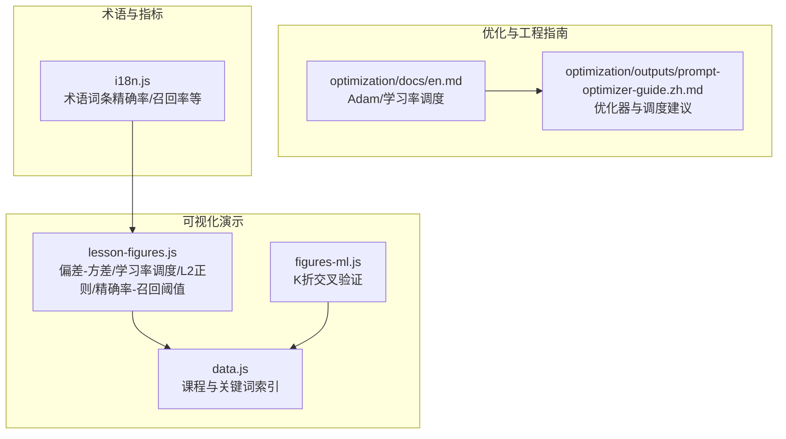
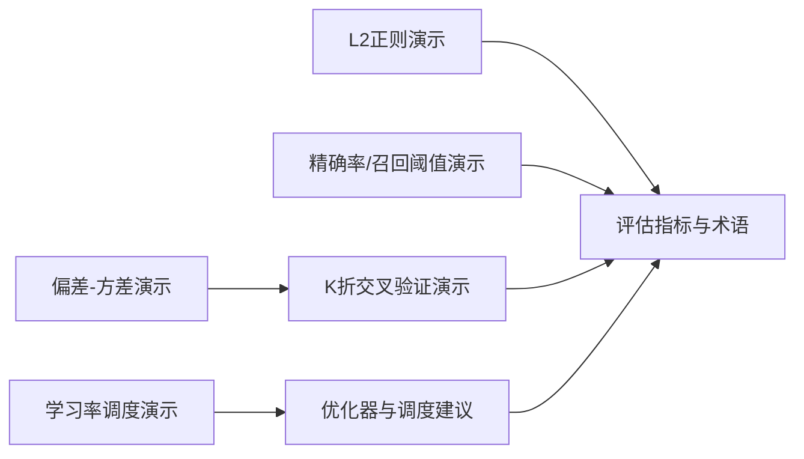
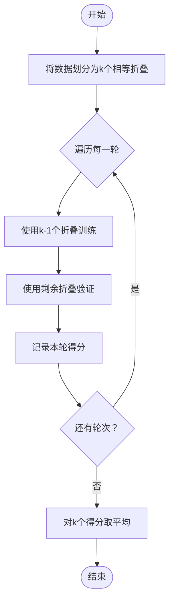
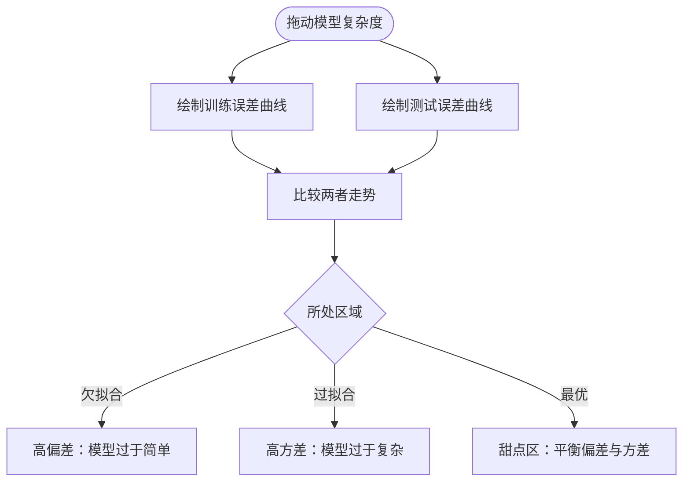
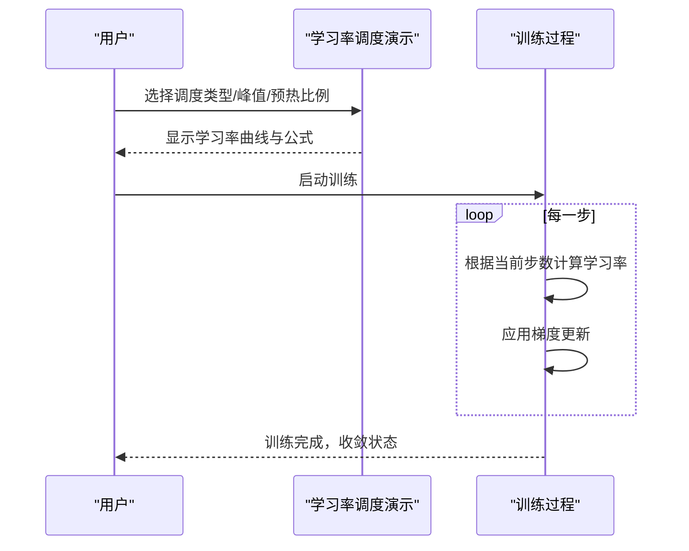
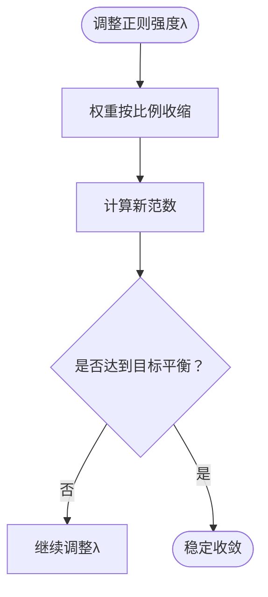
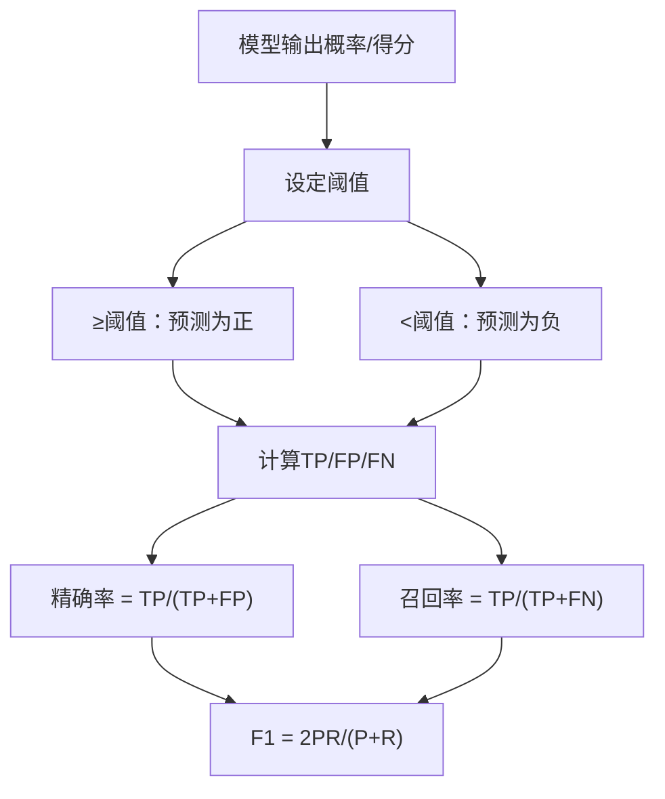
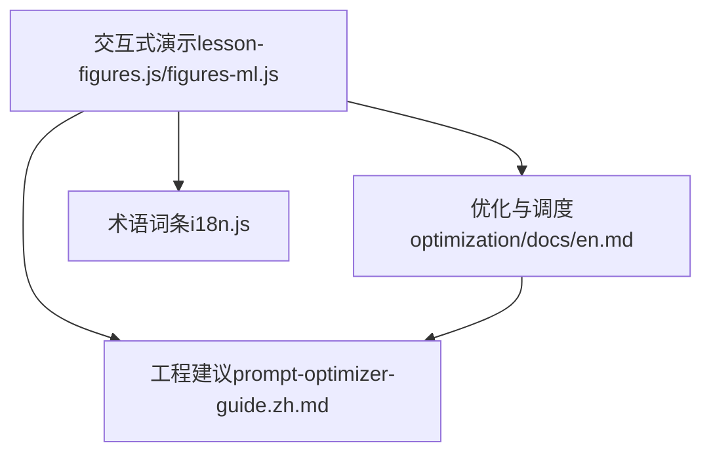

# 模型评估与选择

<cite>
**本文引用的文件**   
- [site/lesson-figures.js](file://site/lesson-figures.js)
- [site/figures-ml.js](file://site/figures-ml.js)
- [site/data.js](file://site/data.js)
- [phases/01-math-foundations/08-optimization/docs/en.md](file://phases/01-math-foundations/08-optimization/docs/en.md)
- [phases/01-math-foundations/08-optimization/outputs/prompt-optimizer-guide.zh.md](file://phases/01-math-foundations/08-optimization/outputs/prompt-optimizer-guide.zh.md)
- [site/i18n.js](file://site/i18n.js)
</cite>

## 目录
1. [引言](#引言)
2. [项目结构](#项目结构)
3. [核心组件](#核心组件)
4. [架构总览](#架构总览)
5. [详细组件分析](#详细组件分析)
6. [依赖关系分析](#依赖关系分析)
7. [性能考量](#性能考量)
8. [故障排查指南](#故障排查指南)
9. [结论](#结论)
10. [附录](#附录)

## 引言
本文件围绕“模型评估与选择”主题，系统梳理并整合仓库中已有的可视化演示、教学资料与工程建议，形成一套面向实践者的综合性文档。内容覆盖：
- 交叉验证（K折）、网格搜索、随机搜索等评估与超参搜索方法
- 偏差-方差权衡的直观理解与实践路径
- 超参数调优策略：学习率调度、正则化参数选择
- 评估指标：准确率、精确率、召回率、F1分数、AUC等的计算与解读
- 模型选择最佳实践与常见陷阱

## 项目结构
该仓库以“阶段化课程 + 可视化演示 + 工程指南”的方式组织内容。与本主题直接相关的知识来源主要分布在：
- site 目录下的交互式演示脚本与数据索引
- phases 下数学与优化基础文档与实践建议
- i18n 国际化词条中对关键术语的定义

**图表来源**
- [site/lesson-figures.js:223-256](file://site/lesson-figures.js#L223-L256)
- [site/figures-ml.js:439-488](file://site/figures-ml.js#L439-L488)
- [site/data.js:420-429](file://site/data.js#L420-L429)
- [phases/01-math-foundations/08-optimization/docs/en.md:121-155](file://phases/01-math-foundations/08-optimization/docs/en.md#L121-L155)
- [phases/01-math-foundations/08-optimization/outputs/prompt-optimizer-guide.zh.md:1-80](file://phases/01-math-foundations/08-optimization/outputs/prompt-optimizer-guide.zh.md#L1-L80)
- [site/i18n.js:571-583](file://site/i18n.js#L571-L583)

**章节来源**
- [site/lesson-figures.js:223-256](file://site/lesson-figures.js#L223-L256)
- [site/figures-ml.js:439-488](file://site/figures-ml.js#L439-L488)
- [site/data.js:420-429](file://site/data.js#L420-L429)
- [phases/01-math-foundations/08-optimization/docs/en.md:121-155](file://phases/01-math-foundations/08-optimization/docs/en.md#L121-L155)
- [phases/01-math-foundations/08-optimization/outputs/prompt-optimizer-guide.zh.md:1-80](file://phases/01-math-foundations/08-optimization/outputs/prompt-optimizer-guide.zh.md#L1-L80)
- [site/i18n.js:571-583](file://site/i18n.js#L571-L583)

## 核心组件
- 偏差-方差权衡演示：通过多项式拟合复杂度与训练/测试误差曲线，直观展示欠拟合、过拟合与最优区间。
- K折交叉验证演示：可视化每轮训练/验证折叠分配，强调稳定估计与每个样本被评分一次。
- 学习率调度演示：对比常数、阶梯、指数、余弦退火与预热+余弦等多种策略。
- L2正则演示：展示权重收缩与范数变化，帮助理解正则化对模型复杂度的影响。
- 精确率/召回率与阈值演示：通过两类分布移动阈值，观察精确率、召回率与F1的权衡。
- 优化器与学习率调度：提供针对不同任务的优化器选择、初始超参数与调度建议。
- 评估指标术语：明确精确率、召回率等关键指标的定义与使用场景。

**章节来源**
- [site/lesson-figures.js:223-256](file://site/lesson-figures.js#L223-L256)
- [site/lesson-figures.js:295-339](file://site/lesson-figures.js#L295-L339)
- [site/lesson-figures.js:258-293](file://site/lesson-figures.js#L258-L293)
- [site/lesson-figures.js:529-563](file://site/lesson-figures.js#L529-L563)
- [site/figures-ml.js:439-488](file://site/figures-ml.js#L439-L488)
- [phases/01-math-foundations/08-optimization/docs/en.md:121-155](file://phases/01-math-foundations/08-optimization/docs/en.md#L121-L155)
- [phases/01-math-foundations/08-optimization/outputs/prompt-optimizer-guide.zh.md:1-80](file://phases/01-math-foundations/08-optimization/outputs/prompt-optimizer-guide.zh.md#L1-L80)
- [site/i18n.js:571-583](file://site/i18n.js#L571-L583)

## 架构总览
下图展示了“评估与选择”相关组件之间的关系：可视化演示作为认知入口，优化与工程指南提供实操建议，术语词条统一关键概念。

**图表来源**
- [site/lesson-figures.js:223-256](file://site/lesson-figures.js#L223-L256)
- [site/figures-ml.js:439-488](file://site/figures-ml.js#L439-L488)
- [site/lesson-figures.js:295-339](file://site/lesson-figures.js#L295-L339)
- [site/lesson-figures.js:258-293](file://site/lesson-figures.js#L258-L293)
- [site/lesson-figures.js:529-563](file://site/lesson-figures.js#L529-L563)
- [phases/01-math-foundations/08-optimization/docs/en.md:121-155](file://phases/01-math-foundations/08-optimization/docs/en.md#L121-L155)
- [phases/01-math-foundations/08-optimization/outputs/prompt-optimizer-guide.zh.md:1-80](file://phases/01-math-foundations/08-optimization/outputs/prompt-optimizer-guide.zh.md#L1-L80)

## 详细组件分析

### 交叉验证（K折）
- 目标：通过将数据拆分为k个相等子集，轮流以k-1个子集训练、1个子集验证，得到更稳定的性能估计。
- 关键点：每一轮用不同折叠作为验证集，每个样本恰好被评分一次；k越大，方差越小但计算成本越高。
- 实践建议：k取5或10；在资源允许时优先使用分层抽样以保持类别比例。

**图表来源**
- [site/figures-ml.js:439-488](file://site/figures-ml.js#L439-L488)

**章节来源**
- [site/figures-ml.js:439-488](file://site/figures-ml.js#L439-L488)

### 偏差-方差权衡
- 目标：理解模型复杂度如何影响训练误差与测试误差，找到偏差与方差平衡点。
- 关键点：简单模型欠拟合（高偏差）；复杂模型过拟合（高方差）；测试误差近似为两者的和，存在最优复杂度。
- 实践建议：通过正则化、集成方法、增加数据或特征工程降低方差或提升偏差-方差平衡。

**图表来源**
- [site/lesson-figures.js:223-256](file://site/lesson-figures.js#L223-L256)

**章节来源**
- [site/lesson-figures.js:223-256](file://site/lesson-figures.js#L223-L256)

### 学习率调度
- 目标：在训练过程中动态调整学习率，兼顾前期快速收敛与后期精细收敛。
- 常见策略：常数、阶梯衰减、指数衰减、余弦退火、预热+余弦。
- 实践建议：大模型与Transformer常用预热+余弦；GAN可考虑较低的beta1；强化学习中梯度裁剪更为关键。

**图表来源**
- [site/lesson-figures.js:295-339](file://site/lesson-figures.js#L295-L339)
- [phases/01-math-foundations/08-optimization/docs/en.md:144-155](file://phases/01-math-foundations/08-optimization/docs/en.md#L144-L155)
- [phases/01-math-foundations/08-optimization/outputs/prompt-optimizer-guide.zh.md:23-46](file://phases/01-math-foundations/08-optimization/outputs/prompt-optimizer-guide.zh.md#L23-L46)

**章节来源**
- [site/lesson-figures.js:295-339](file://site/lesson-figures.js#L295-L339)
- [phases/01-math-foundations/08-optimization/docs/en.md:144-155](file://phases/01-math-foundations/08-optimization/docs/en.md#L144-L155)
- [phases/01-math-foundations/08-optimization/outputs/prompt-optimizer-guide.zh.md:23-46](file://phases/01-math-foundations/08-optimization/outputs/prompt-optimizer-guide.zh.md#L23-L46)

### 正则化（L2权重衰减）
- 目标：通过在损失函数中加入权重范数项，抑制模型复杂度，缓解过拟合。
- 关键点：增大正则强度会整体压缩权重，范数下降；过强会导致欠拟合。
- 实践建议：结合学习曲线与验证误差选择合适的λ；与数据增强、Dropout等手段协同。

**图表来源**
- [site/lesson-figures.js:258-293](file://site/lesson-figures.js#L258-L293)

**章节来源**
- [site/lesson-figures.js:258-293](file://site/lesson-figures.js#L258-L293)

### 网格搜索与随机搜索
- 目标：系统或高效地探索超参数空间，寻找最优组合。
- 关键点：网格搜索覆盖全面但计算昂贵；随机搜索在同等预算下可能更高效；贝叶斯优化、SMAC等进阶方法可进一步提升效率。
- 实践建议：先粗后细、分层搜索；结合学习曲线与验证误差；注意时间预算与资源限制。

[本节为通用方法论总结，不直接分析具体源码文件]

### 评估指标与解读
- 准确率：整体预测正确的比例。在类别极度不平衡时可能具有误导性。
- 精确率（Precision）：预测为正的样本中真正为正的比例；关注“尽量少误报”。
- 召回率（Recall）：所有真正为正的样本中被正确预测的比例；关注“尽量少漏报”。
- F1分数：精确率与召回率的调和平均，平衡二者权衡。
- AUC：ROC曲线下面积，衡量二分类器在不同阈值下的整体判别能力。
- 阈值选择：通过滑动阈值观察精确率、召回率与F1的变化，依据业务代价选择最优阈值。

**图表来源**
- [site/lesson-figures.js:529-563](file://site/lesson-figures.js#L529-L563)
- [site/i18n.js:571-583](file://site/i18n.js#L571-L583)

**章节来源**
- [site/lesson-figures.js:529-563](file://site/lesson-figures.js#L529-L563)
- [site/i18n.js:571-583](file://site/i18n.js#L571-L583)

### 模型选择最佳实践与陷阱
- 最佳实践
  - 先用简单的模型与基线策略建立可复现的评估流程
  - 使用交叉验证稳定评估；对超参数进行分层搜索
  - 结合偏差-方差诊断与学习曲线判断下一步改进方向
  - 采用合适的评估指标与阈值，避免单一指标误导
  - 正则化、数据增强、集成方法等多管齐下
- 常见陷阱
  - 仅看准确率：在类别不平衡时可能掩盖问题
  - 过早停止：未充分观察学习曲线就切换模型
  - 盲目追求更高复杂度：忽视泛化能力
  - 忽视阈值选择：固定阈值导致业务指标失真

[本节为通用方法论总结，不直接分析具体源码文件]

## 依赖关系分析
- 可视化演示依赖于交互式控件（滑块、下拉框）与SVG渲染，用于直观展示算法行为
- 优化与工程指南为演示提供理论支撑与实操建议
- 术语词条为关键指标与概念提供统一定义，便于跨模块一致性

**图表来源**
- [site/lesson-figures.js:223-256](file://site/lesson-figures.js#L223-L256)
- [site/figures-ml.js:439-488](file://site/figures-ml.js#L439-L488)
- [phases/01-math-foundations/08-optimization/docs/en.md:121-155](file://phases/01-math-foundations/08-optimization/docs/en.md#L121-L155)
- [phases/01-math-foundations/08-optimization/outputs/prompt-optimizer-guide.zh.md:1-80](file://phases/01-math-foundations/08-optimization/outputs/prompt-optimizer-guide.zh.md#L1-L80)
- [site/i18n.js:571-583](file://site/i18n.js#L571-L583)

**章节来源**
- [site/lesson-figures.js:223-256](file://site/lesson-figures.js#L223-L256)
- [site/figures-ml.js:439-488](file://site/figures-ml.js#L439-L488)
- [phases/01-math-foundations/08-optimization/docs/en.md:121-155](file://phases/01-math-foundations/08-optimization/docs/en.md#L121-L155)
- [phases/01-math-foundations/08-optimization/outputs/prompt-optimizer-guide.zh.md:1-80](file://phases/01-math-foundations/08-optimization/outputs/prompt-optimizer-guide.zh.md#L1-L80)
- [site/i18n.js:571-583](file://site/i18n.js#L571-L583)

## 性能考量
- 计算开销：K折与网格搜索的计算成本随k与参数维度增长；随机搜索在同等预算下通常更高效
- 收敛稳定性：学习率调度与正则化有助于稳定训练与提升泛化
- 指标鲁棒性：在不平衡数据上优先关注精确率、召回率与F1，必要时结合AUC

[本节提供一般性指导，不直接分析具体文件]

## 故障排查指南
- 损失NaN或发散：降低学习率、添加梯度裁剪、检查数据数值异常
- 早期停滞：提高学习率、确认模型容量、检查数据流水线
- 训练损失下降但验证上升：增加权重衰减、引入Dropout或数据增强、减小模型容量
- Adam收敛快但最终精度偏低：切换到带动量的SGD，配合余弦退火

**章节来源**
- [phases/01-math-foundations/08-optimization/outputs/prompt-optimizer-guide.zh.md:48-79](file://phases/01-math-foundations/08-optimization/outputs/prompt-optimizer-guide.zh.md#L48-L79)

## 结论
本文件将可视化演示、优化建议与术语定义整合为一套完整的“模型评估与选择”知识体系。建议在实际工程中：
- 以可视化工具建立直觉认知
- 以交叉验证与学习曲线稳定评估
- 以正则化与学习率调度控制偏差-方差
- 以多指标与阈值权衡满足业务需求
- 以工程建议规避常见陷阱

[本节为总结性内容，不直接分析具体文件]

## 附录
- 术语速览：精确率、召回率、F1分数、AUC、学习率调度、L2正则、K折交叉验证、偏差-方差权衡

**章节来源**
- [site/i18n.js:571-583](file://site/i18n.js#L571-L583)