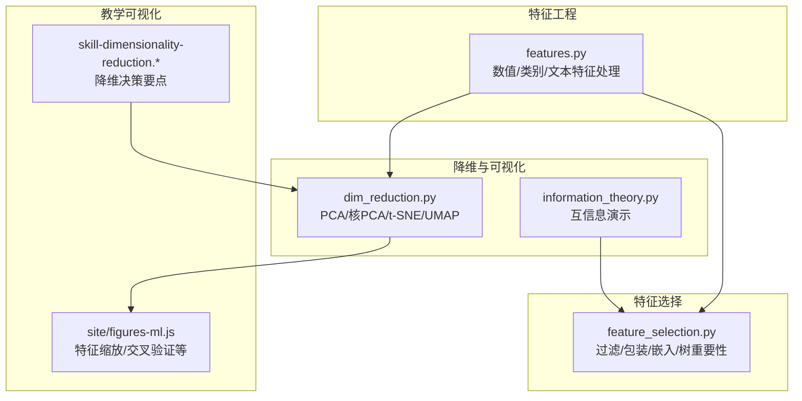
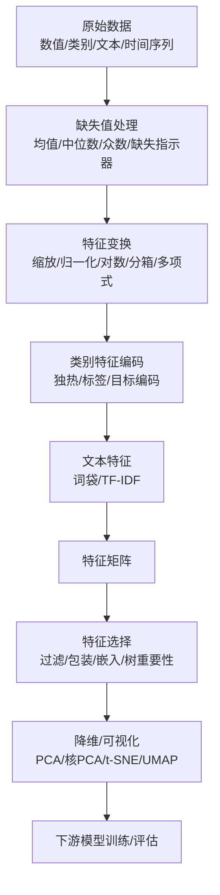
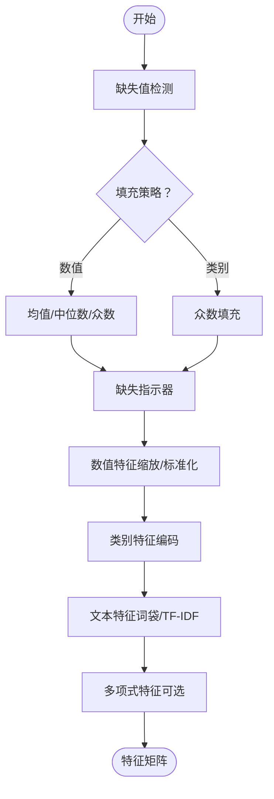
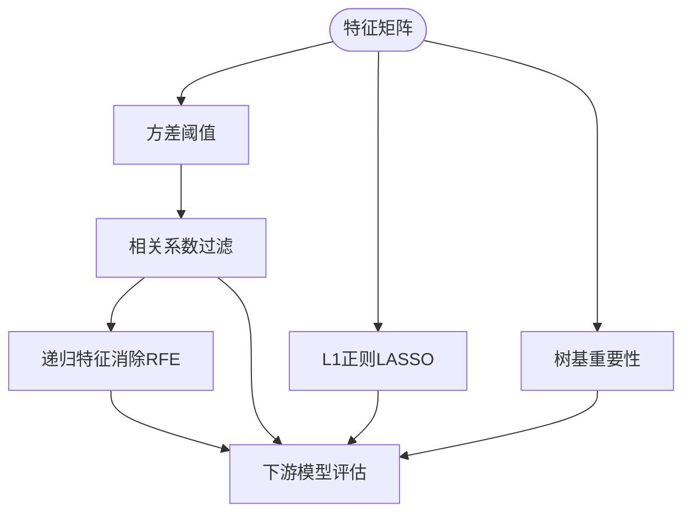
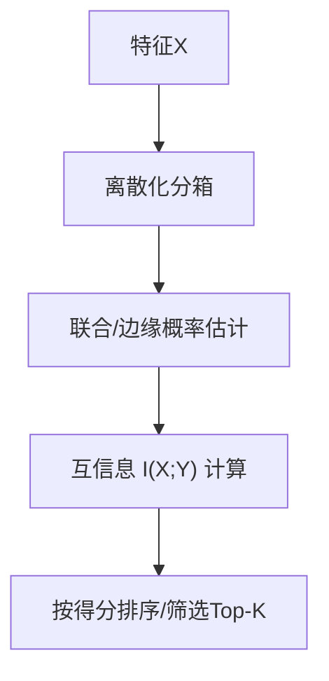
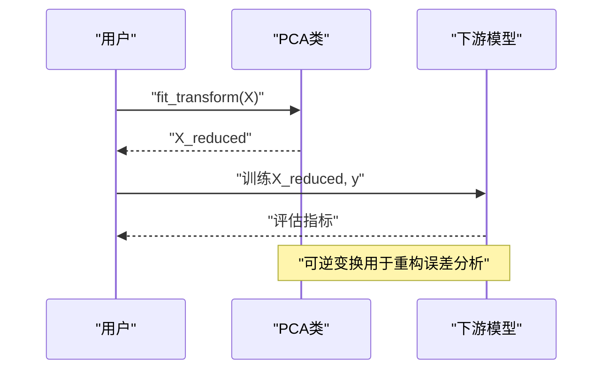
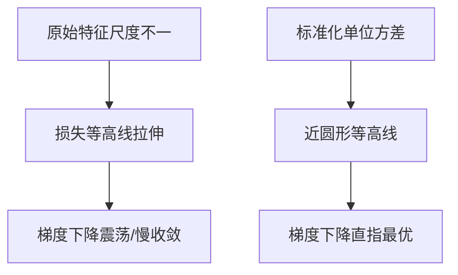
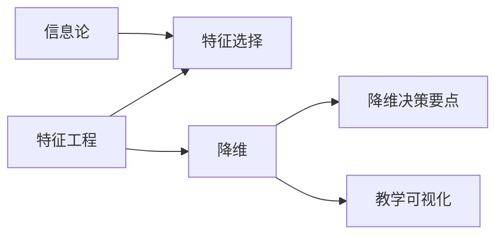

# 特征工程与选择

<cite>
**本文引用的文件**
- [features.py](file://phases/02-ml-fundamentals/08-feature-engineering/code/features.py)
- [feature_selection.py](file://phases/02-ml-fundamentals/18-feature-selection/code/feature_selection.py)
- [dim_reduction.py](file://phases/01-math-foundations/10-dimensionality-reduction/code/dim_reduction.py)
- [information_theory.py](file://phases/01-math-foundations/09-information-theory/code/information_theory.py)
- [site/figures-ml.js](file://site/figures-ml.js)
- [skill-dimensionality-reduction.md](file://phases/01-math-foundations/10-dimensionality-reduction/outputs/skill-dimensionality-reduction.md)
- [skill-dimensionality-reduction.zh.md](file://phases/01-math-foundations/10-dimensionality-reduction/outputs/skill-dimensionality-reduction.zh.md)
</cite>

## 目录
1. [引言](#引言)
2. [项目结构](#项目结构)
3. [核心组件](#核心组件)
4. [架构总览](#架构总览)
5. [详细组件分析](#详细组件分析)
6. [依赖分析](#依赖分析)
7. [性能考虑](#性能考虑)
8. [故障排查指南](#故障排查指南)
9. [结论](#结论)
10. [附录](#附录)

## 引言
本文件围绕“特征工程与选择”主题，系统梳理并呈现仓库中的实现与教学材料。内容覆盖：
- 特征提取与变换：数值型与类别型特征的处理策略（标准化、归一化、对数变换、分箱、多项式特征等）
- 文本特征：词袋与TF-IDF
- 缺失值与异常值：均值/中位数/众数填充、缺失指示器、离群检测思路
- 特征选择：过滤法（方差阈值、相关系数过滤）、包装法（递归特征消除）、嵌入法（L1正则）、基于树的特征重要性
- 信息论视角：互信息用于特征选择
- 降维：PCA、核PCA、t-SNE、UMAP及其在预处理与可视化中的应用

## 项目结构
与特征工程与选择直接相关的代码与输出主要分布在以下路径：
- 数学基础与信息论：降维与信息论演示
- 机器学习基础：特征工程与特征选择的实现
- 可视化：特征缩放与交叉验证等教学图示

**图表来源**
- [features.py:1-392](file://phases/02-ml-fundamentals/08-feature-engineering/code/features.py#L1-L392)
- [feature_selection.py:1-354](file://phases/02-ml-fundamentals/18-feature-selection/code/feature_selection.py#L1-L354)
- [dim_reduction.py:1-334](file://phases/01-math-foundations/10-dimensionality-reduction/code/dim_reduction.py#L1-L334)
- [information_theory.py:1-360](file://phases/01-math-foundations/09-information-theory/code/information_theory.py#L1-L360)
- [site/figures-ml.js:320-488](file://site/figures-ml.js#L320-L488)
- [skill-dimensionality-reduction.md:1-28](file://phases/01-math-foundations/10-dimensionality-reduction/outputs/skill-dimensionality-reduction.md#L1-L28)

**章节来源**
- [features.py:1-392](file://phases/02-ml-fundamentals/08-feature-engineering/code/features.py#L1-L392)
- [feature_selection.py:1-354](file://phases/02-ml-fundamentals/18-feature-selection/code/feature_selection.py#L1-L354)
- [dim_reduction.py:1-334](file://phases/01-math-foundations/10-dimensionality-reduction/code/dim_reduction.py#L1-L334)
- [information_theory.py:1-360](file://phases/01-math-foundations/09-information-theory/code/information_theory.py#L1-L360)
- [site/figures-ml.js:320-488](file://site/figures-ml.js#L320-L488)
- [skill-dimensionality-reduction.md:1-28](file://phases/01-math-foundations/10-dimensionality-reduction/outputs/skill-dimensionality-reduction.md#L1-L28)
- [skill-dimensionality-reduction.zh.md:1-33](file://phases/01-math-foundations/10-dimensionality-reduction/outputs/skill-dimensionality-reduction.zh.md#L1-L33)

## 核心组件
- 特征工程工具集（数值/类别/文本）
  - 数值型：最小-最大缩放、Z-score标准化、对数变换、分箱、多项式特征
  - 类别型：独热编码、标签编码、目标编码
  - 文本：词袋向量化、TF-IDF
  - 缺失值：均值/中位数/众数填充、缺失指示器
  - 相关性与互信息：皮尔逊相关、互信息度量
- 特征选择工具集
  - 过滤法：方差阈值、相关系数过滤
  - 包装法：递归特征消除（RFE）
  - 嵌入法：L1正则（LASSO）特征选择
  - 基于树的重要性：随机/引导树构建与特征重要性聚合
- 降维与可视化
  - 自制PCA类、核PCA、t-SNE、UMAP
  - PCA作为下游模型预处理的实验
- 信息论与互信息
  - 互信息计算与特征选择演示
- 教学可视化
  - 特征缩放对比（不同尺度导致损失面拉伸与收敛缓慢）
  - K折交叉验证流程示意

**章节来源**
- [features.py:5-392](file://phases/02-ml-fundamentals/08-feature-engineering/code/features.py#L5-L392)
- [feature_selection.py:37-354](file://phases/02-ml-fundamentals/18-feature-selection/code/feature_selection.py#L37-L354)
- [dim_reduction.py:4-334](file://phases/01-math-foundations/10-dimensionality-reduction/code/dim_reduction.py#L4-L334)
- [information_theory.py:52-172](file://phases/01-math-foundations/09-information-theory/code/information_theory.py#L52-L172)
- [site/figures-ml.js:320-488](file://site/figures-ml.js#L320-L488)

## 架构总览
下图展示特征工程与选择在端到端流程中的位置与交互。

**图表来源**
- [features.py:146-224](file://phases/02-ml-fundamentals/08-feature-engineering/code/features.py#L146-L224)
- [feature_selection.py:37-221](file://phases/02-ml-fundamentals/18-feature-selection/code/feature_selection.py#L37-L221)
- [dim_reduction.py:164-194](file://phases/01-math-foundations/10-dimensionality-reduction/code/dim_reduction.py#L164-L194)

## 详细组件分析

### 特征工程模块（数值/类别/文本）
- 数值型特征处理
  - 最小-最大缩放：将特征映射到固定区间，适合边界敏感模型
  - Z-score标准化：零均值单位方差，适合大多数线性/神经网络
  - 对数变换：缓解右偏分布影响
  - 分箱：离散化连续变量，便于规则化或与树模型结合
  - 多项式特征：生成二次项与交互项，增强非线性表达能力
- 类别型特征处理
  - 独热编码：消除序数假设，适用于线性模型
  - 标签编码：整数映射，适用于树模型或有序类别
  - 目标编码：利用目标均值平滑，降低维度同时保留统计信息
- 文本特征
  - 词袋：统计词频
  - TF-IDF：强调区分性词汇
- 缺失值与异常值
  - 均值/中位数/众数填充：分别适配不同分布形态
  - 缺失指示器：显式建模缺失模式
  - 异常值：可采用统计方法（如IQR/Z-score）或无监督方法（孤立森林/LOF），本仓库以概念性材料为主

**图表来源**
- [features.py:146-179](file://phases/02-ml-fundamentals/08-feature-engineering/code/features.py#L146-L179)
- [features.py:5-68](file://phases/02-ml-fundamentals/08-feature-engineering/code/features.py#L5-L68)
- [features.py:90-143](file://phases/02-ml-fundamentals/08-feature-engineering/code/features.py#L90-L143)
- [features.py:39-48](file://phases/02-ml-fundamentals/08-feature-engineering/code/features.py#L39-L48)

**章节来源**
- [features.py:5-179](file://phases/02-ml-fundamentals/08-feature-engineering/code/features.py#L5-L179)
- [features.py:90-143](file://phases/02-ml-fundamentals/08-feature-engineering/code/features.py#L90-L143)
- [features.py:181-224](file://phases/02-ml-fundamentals/08-feature-engineering/code/features.py#L181-L224)

### 特征选择模块（过滤/包装/嵌入/树重要性）
- 过滤法
  - 方差阈值：剔除低方差恒定/近恒定特征
  - 相关系数过滤：移除与目标高度共线的冗余特征
- 包装法
  - 递归特征消除（RFE）：基于模型权重逐步剔除最不重要特征
- 嵌入法
  - L1正则（LASSO）：在优化目标中加入L1惩罚，使部分权重衰减至零
- 基于树的重要性
  - 通过自助采样与子特征抽样构建多棵决策树，汇总特征分裂增益作为重要性

**图表来源**
- [feature_selection.py:37-41](file://phases/02-ml-fundamentals/18-feature-selection/code/feature_selection.py#L37-L41)
- [feature_selection.py:241-259](file://phases/02-ml-fundamentals/18-feature-selection/code/feature_selection.py#L241-L259)
- [feature_selection.py:91-113](file://phases/02-ml-fundamentals/18-feature-selection/code/feature_selection.py#L91-L113)
- [feature_selection.py:119-138](file://phases/02-ml-fundamentals/18-feature-selection/code/feature_selection.py#L119-L138)
- [feature_selection.py:200-221](file://phases/02-ml-fundamentals/18-feature-selection/code/feature_selection.py#L200-L221)

**章节来源**
- [feature_selection.py:37-221](file://phases/02-ml-fundamentals/18-feature-selection/code/feature_selection.py#L37-L221)

### 信息论与互信息（特征选择）
- 互信息衡量变量间任意统计依赖（线性/非线性/单调/非单调）
- 在特征选择中，通过离散化后计算特征与目标的互信息，作为排序依据
- 演示程序展示了强信号、弱信号、噪声与常量特征的互信息差异

**图表来源**
- [information_theory.py:134-172](file://phases/01-math-foundations/09-information-theory/code/information_theory.py#L134-L172)
- [feature_selection.py:52-73](file://phases/02-ml-fundamentals/18-feature-selection/code/feature_selection.py#L52-L73)

**章节来源**
- [information_theory.py:134-172](file://phases/01-math-foundations/09-information-theory/code/information_theory.py#L134-L172)
- [feature_selection.py:52-73](file://phases/02-ml-fundamentals/18-feature-selection/code/feature_selection.py#L52-L73)

### 降维与可视化（PCA/核PCA/t-SNE/UMAP）
- 自制PCA类：中心化、协方差矩阵特征分解、主成分投影与重构
- 核PCA：核技巧（RBF/Poly）将线性PCA推广到非线性场景
- t-SNE/UMAP：高维数据低维可视化，先用PCA预降维再进行流形学习
- 实验：比较不同k下的准确率与方差捕获；核PCA分离同心圆

**图表来源**
- [dim_reduction.py:4-41](file://phases/01-math-foundations/10-dimensionality-reduction/code/dim_reduction.py#L4-L41)
- [dim_reduction.py:164-194](file://phases/01-math-foundations/10-dimensionality-reduction/code/dim_reduction.py#L164-L194)

**章节来源**
- [dim_reduction.py:4-41](file://phases/01-math-foundations/10-dimensionality-reduction/code/dim_reduction.py#L4-L41)
- [dim_reduction.py:164-194](file://phases/01-math-foundations/10-dimensionality-reduction/code/dim_reduction.py#L164-L194)
- [dim_reduction.py:197-225](file://phases/01-math-foundations/10-dimensionality-reduction/code/dim_reduction.py#L197-L225)
- [dim_reduction.py:231-283](file://phases/01-math-foundations/10-dimensionality-reduction/code/dim_reduction.py#L231-L283)

### 教学可视化：特征缩放与交叉验证
- 特征缩放：对比原始尺度与标准化后的等高线形状，说明梯度下降收敛路径差异
- K折交叉验证：直观展示折间轮换与稳定性估计

**图表来源**
- [site/figures-ml.js:320-359](file://site/figures-ml.js#L320-L359)

**章节来源**
- [site/figures-ml.js:320-359](file://site/figures-ml.js#L320-L359)
- [site/figures-ml.js:465-488](file://site/figures-ml.js#L465-L488)

## 依赖分析
- 组件内聚与耦合
  - 特征工程与特征选择模块相对独立，前者负责数据预处理，后者负责特征子集选择
  - 降维模块既可作为特征选择的前置步骤，也可用于可视化
  - 信息论模块为特征选择提供理论支撑（互信息）
- 外部依赖
  - scikit-learn（PCA、LogisticRegression、TSNE、UMAP等）用于对比与演示
  - numpy用于数值计算

**图表来源**
- [feature_selection.py:1-354](file://phases/02-ml-fundamentals/18-feature-selection/code/feature_selection.py#L1-L354)
- [features.py:1-392](file://phases/02-ml-fundamentals/08-feature-engineering/code/features.py#L1-L392)
- [dim_reduction.py:103-161](file://phases/01-math-foundations/10-dimensionality-reduction/code/dim_reduction.py#L103-L161)
- [information_theory.py:134-172](file://phases/01-math-foundations/09-information-theory/code/information_theory.py#L134-L172)
- [skill-dimensionality-reduction.md:10-28](file://phases/01-math-foundations/10-dimensionality-reduction/outputs/skill-dimensionality-reduction.md#L10-L28)

**章节来源**
- [feature_selection.py:1-354](file://phases/02-ml-fundamentals/18-feature-selection/code/feature_selection.py#L1-L354)
- [features.py:1-392](file://phases/02-ml-fundamentals/08-feature-engineering/code/features.py#L1-L392)
- [dim_reduction.py:103-161](file://phases/01-math-foundations/10-dimensionality-reduction/code/dim_reduction.py#L103-L161)
- [information_theory.py:134-172](file://phases/01-math-foundations/09-information-theory/code/information_theory.py#L134-L172)
- [skill-dimensionality-reduction.md:10-28](file://phases/01-math-foundations/10-dimensionality-reduction/outputs/skill-dimensionality-reduction.md#L10-L28)

## 性能考虑
- 计算复杂度
  - PCA：O(n·d²)级协方差与特征分解，适合大规模数据的预处理
  - 核PCA：O(n²·d)，适合中小规模非线性分离问题
  - t-SNE/UMAP：O(n log n)近似算法更适用于大规模数据
- 存储与传输
  - 降维后特征数量减少，显著降低内存与带宽占用
- 选择k的策略
  - 以累计解释方差为目标（如≥95%）或以下游任务性能为目标进行网格搜索

[本节为通用指导，无需特定文件引用]

## 故障排查指南
- 特征缩放导致数值不稳定
  - 现象：梯度爆炸/消失、收敛困难
  - 排查：确认是否对每列计算了正确的均值/方差；注意常数列的方差为零时的分母处理
- 缺失值填充策略不当
  - 现象：引入偏差或信息丢失
  - 排查：检查填充值是否与分布一致；缺失指示器是否同步
- 特征选择过度
  - 现象：欠拟合或信息不足
  - 排查：对比全量特征与子集的下游性能；关注互信息与相关性的互补性
- 降维破坏结构
  - 现象：可视化混乱、聚类效果差
  - 排查：尝试不同核函数/邻居数/距离参数；先PCA预降维再流形学习

**章节来源**
- [features.py:13-18](file://phases/02-ml-fundamentals/08-feature-engineering/code/features.py#L13-L18)
- [features.py:146-179](file://phases/02-ml-fundamentals/08-feature-engineering/code/features.py#L146-L179)
- [dim_reduction.py:197-225](file://phases/01-math-foundations/10-dimensionality-reduction/code/dim_reduction.py#L197-L225)

## 结论
本仓库提供了从数据预处理到特征选择与可视化的完整实践路径。通过数值/类别/文本特征的系统化处理，结合过滤/包装/嵌入/树重要性的多种特征选择策略，并辅以信息论与降维技术，能够有效提升模型性能与可解释性。建议在实际项目中：
- 先完成缺失值与异常值的稳健处理
- 以标准化/归一化统一特征尺度
- 尝试多项式特征与交互项增强非线性表达
- 使用互信息与相关性进行初步筛选
- 采用RFE/L1/树重要性进行精细选择
- 利用PCA/核PCA/t-SNE/UMAP进行预处理与可视化

[本节为总结性内容，无需特定文件引用]

## 附录
- 降维决策要点（来自教学输出）
  - 预处理模型：优先PCA
  - 2D可视化：默认UMAP，小数据可用t-SNE
  - 噪声去除：PCA方差阈值
  - 存储/速度压缩：PCA，以下游性能选择k
  - 线性vs非线性：非线性用UMAP/t-SNE，PCA仅线性
  - 新数据变换：PCA可精确变换，UMAP近似，t-SNE不可
  - 可解释性：PCA成分可解释为原特征加权组合
  - 高维输入：先PCA到50-100维，再t-SNE/UMAP

**章节来源**
- [skill-dimensionality-reduction.md:10-33](file://phases/01-math-foundations/10-dimensionality-reduction/outputs/skill-dimensionality-reduction.md#L10-L33)
- [skill-dimensionality-reduction.zh.md:10-33](file://phases/01-math-foundations/10-dimensionality-reduction/outputs/skill-dimensionality-reduction.zh.md#L10-L33)