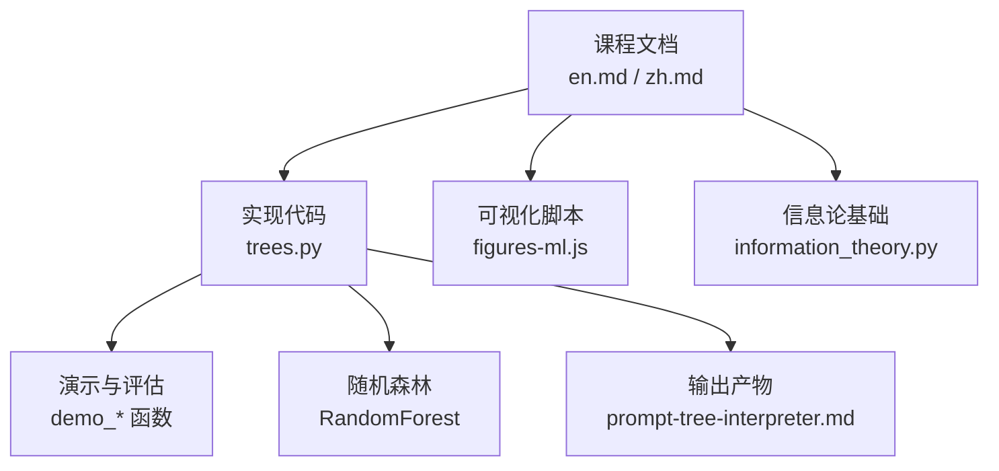
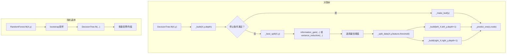
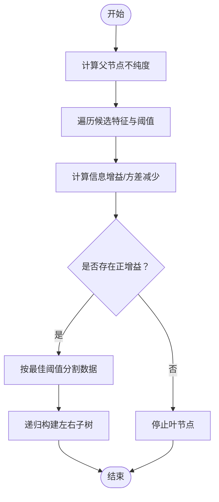
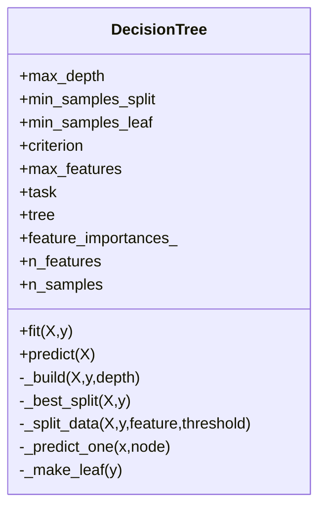
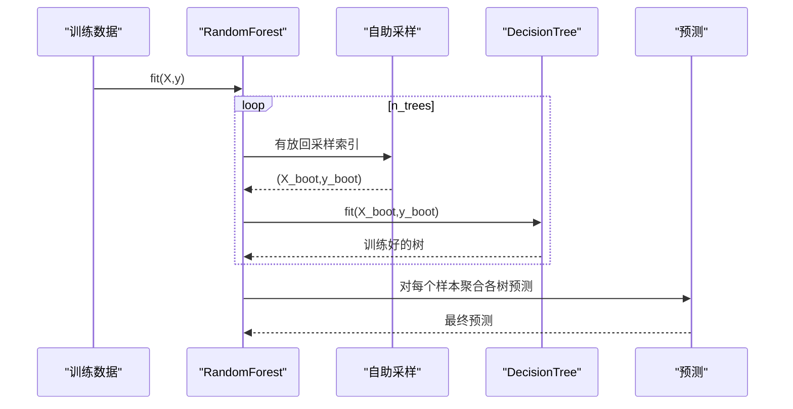
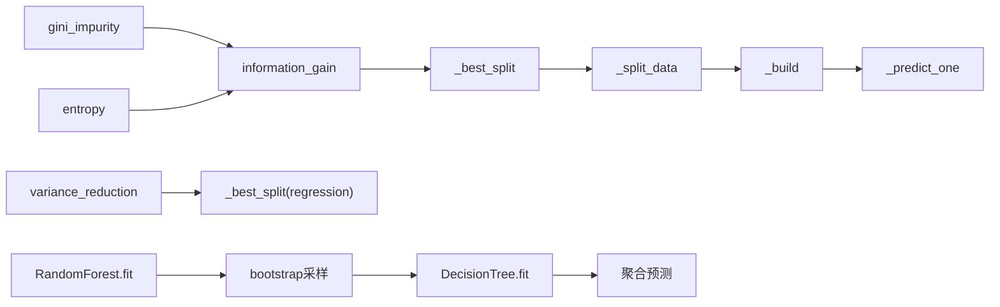

# 决策树

<cite>
**本文引用的文件**
- [trees.py](file://phases/02-ml-fundamentals/04-decision-trees/code/trees.py)
- [en.md](file://phases/02-ml-fundamentals/04-decision-trees/docs/en.md)
- [zh.md](file://phases/02-ml-fundamentals/04-decision-trees/docs/zh.md)
- [prompt-tree-interpreter.md](file://phases/02-ml-fundamentals/04-decision-trees/outputs/prompt-tree-interpreter.md)
- [prompt-tree-interpreter.zh.md](file://phases/02-ml-fundamentals/04-decision-trees/outputs/prompt-tree-interpreter.zh.md)
- [figures-ml.js](file://site/figures-ml.js)
- [information_theory.py](file://phases/01-math-foundations/09-information-theory/code/information_theory.py)
</cite>

## 目录
1. [简介](#简介)
2. [项目结构](#项目结构)
3. [核心组件](#核心组件)
4. [架构总览](#架构总览)
5. [详细组件分析](#详细组件分析)
6. [依赖分析](#依赖分析)
7. [性能考量](#性能考量)
8. [故障排查指南](#故障排查指南)
9. [结论](#结论)
10. [附录](#附录)

## 简介
本文件系统性梳理仓库中的决策树与随机森林实现，围绕以下目标展开：
- 深入解释决策树构建过程：信息增益、基尼不纯度等分割准则
- 对比 ID3、C4.5、CART 等经典算法变体的差异与适用场景
- 提供完整代码实现路径：递归分割、停止条件、特征重要性
- 解释过拟合问题与预剪枝、后剪枝策略
- 涵盖特征选择、缺失值处理等工程实践要点

## 项目结构
决策树相关内容集中在“机器学习基础”阶段的“决策树与随机森林”课程中，配套有：
- Python 实现：trees.py（含决策树、随机森林、演示函数）
- 文档：英文版 en.md 与中文版 zh.md
- 输出产物：prompt-tree-interpreter.md（面向业务解释的提示词）
- 可视化脚本：site/figures-ml.js（包含决策树深度示意）
- 数学基础：信息论模块（entropy、互信息等）

图表来源
- [trees.py:1-653](file://phases/02-ml-fundamentals/04-decision-trees/code/trees.py#L1-L653)
- [en.md:1-382](file://phases/02-ml-fundamentals/04-decision-trees/docs/en.md#L1-L382)
- [zh.md:1-378](file://phases/02-ml-fundamentals/04-decision-trees/docs/zh.md#L1-L378)
- [prompt-tree-interpreter.md:1-90](file://phases/02-ml-fundamentals/04-decision-trees/outputs/prompt-tree-interpreter.md#L1-L90)
- [figures-ml.js:268-318](file://site/figures-ml.js#L268-L318)
- [information_theory.py:134-172](file://phases/01-math-foundations/09-information-theory/code/information_theory.py#L134-L172)

章节来源
- [trees.py:1-653](file://phases/02-ml-fundamentals/04-decision-trees/code/trees.py#L1-L653)
- [en.md:1-382](file://phases/02-ml-fundamentals/04-decision-trees/docs/en.md#L1-L382)
- [zh.md:1-378](file://phases/02-ml-fundamentals/04-decision-trees/docs/zh.md#L1-L378)
- [prompt-tree-interpreter.md:1-90](file://phases/02-ml-fundamentals/04-decision-trees/outputs/prompt-tree-interpreter.md#L1-L90)
- [figures-ml.js:268-318](file://site/figures-ml.js#L268-L318)
- [information_theory.py:134-172](file://phases/01-math-foundations/09-information-theory/code/information_theory.py#L134-L172)

## 核心组件
- 基础度量
  - 基尼不纯度：gini_impurity
  - 熵：entropy
  - 信息增益：information_gain（支持“gini/entropy”两种准则）
  - 方差减少：variance_reduction（回归树）
- 决策树主体：DecisionTree
  - fit/predict/递归构建_build
  - 停止条件：max_depth、min_samples_split、min_samples_leaf、min_gain（隐含在信息增益<=0时）
  - 特征随机化：max_features（支持“sqrt”或整数）
  - 特征重要性：feature_importances_（MDI）
- 随机森林：RandomForest
  - 自助采样（bootstrap）、特征随机化、多数投票/均值
- 辅助与演示
  - 数据生成、训练/测试划分、评估指标
  - 多组演示：分割准则对比、信息增益、决策树、随机森林、回归树、Gini vs 熵、稳定性对比等

章节来源
- [trees.py:5-65](file://phases/02-ml-fundamentals/04-decision-trees/code/trees.py#L5-L65)
- [trees.py:75-221](file://phases/02-ml-fundamentals/04-decision-trees/code/trees.py#L75-L221)
- [trees.py:223-279](file://phases/02-ml-fundamentals/04-decision-trees/code/trees.py#L223-L279)
- [trees.py:281-330](file://phases/02-ml-fundamentals/04-decision-trees/code/trees.py#L281-L330)
- [trees.py:332-625](file://phases/02-ml-fundamentals/04-decision-trees/code/trees.py#L332-L625)

## 架构总览
决策树与随机森林的实现采用“自顶向下递归分割”的贪心策略，结合预剪枝控制树的深度与叶子纯度；随机森林通过自助采样与特征随机化降低方差。

图表来源
- [trees.py:90-143](file://phases/02-ml-fundamentals/04-decision-trees/code/trees.py#L90-L143)
- [trees.py:151-190](file://phases/02-ml-fundamentals/04-decision-trees/code/trees.py#L151-L190)
- [trees.py:192-201](file://phases/02-ml-fundamentals/04-decision-trees/code/trees.py#L192-L201)
- [trees.py:203-221](file://phases/02-ml-fundamentals/04-decision-trees/code/trees.py#L203-L221)
- [trees.py:235-267](file://phases/02-ml-fundamentals/04-decision-trees/code/trees.py#L235-L267)

## 详细组件分析

### 基础度量与分割准则
- 基尼不纯度：衡量“随机取样被错误分类”的概率，越低越纯
- 熵：信息论中的不确定性度量，越低越纯
- 信息增益：父节点不纯度减去加权子节点不纯度
- 方差减少：回归树的等价准则，父方差减去加权子方差

图表来源
- [trees.py:27-39](file://phases/02-ml-fundamentals/04-decision-trees/code/trees.py#L27-L39)
- [trees.py:42-51](file://phases/02-ml-fundamentals/04-decision-trees/code/trees.py#L42-L51)
- [trees.py:151-190](file://phases/02-ml-fundamentals/04-decision-trees/code/trees.py#L151-L190)

章节来源
- [trees.py:5-25](file://phases/02-ml-fundamentals/04-decision-trees/code/trees.py#L5-L25)
- [trees.py:27-39](file://phases/02-ml-fundamentals/04-decision-trees/code/trees.py#L27-L39)
- [trees.py:42-51](file://phases/02-ml-fundamentals/04-decision-trees/code/trees.py#L42-L51)
- [en.md:45-91](file://phases/02-ml-fundamentals/04-decision-trees/docs/en.md#L45-L91)
- [zh.md:45-91](file://phases/02-ml-fundamentals/04-decision-trees/docs/zh.md#L45-L91)

### 决策树类（DecisionTree）
- 初始化参数：max_depth、min_samples_split、min_samples_leaf、criterion（gini/entropy/regression）、max_features（sqrt/整数/None）
- fit：统计特征重要性（MDI），规范化
- _build：递归构建，结合停止条件与最佳分割
- _best_split：在候选特征子集上遍历阈值，计算增益
- _split_data：按阈值二分数据
- _predict_one：从根到叶的路径推理

图表来源
- [trees.py:75-221](file://phases/02-ml-fundamentals/04-decision-trees/code/trees.py#L75-L221)

章节来源
- [trees.py:75-149](file://phases/02-ml-fundamentals/04-decision-trees/code/trees.py#L75-L149)
- [trees.py:151-201](file://phases/02-ml-fundamentals/04-decision-trees/code/trees.py#L151-L201)
- [trees.py:203-221](file://phases/02-ml-fundamentals/04-decision-trees/code/trees.py#L203-L221)

### 随机森林（RandomForest）
- 自助采样：对样本索引进行有放回采样
- 特征随机化：在每次分割时从特征子集选择最佳特征
- 预测：分类采用多数投票，回归采用平均

图表来源
- [trees.py:235-267](file://phases/02-ml-fundamentals/04-decision-trees/code/trees.py#L235-L267)

章节来源
- [trees.py:223-279](file://phases/02-ml-fundamentals/04-decision-trees/code/trees.py#L223-L279)

### 算法变体与对比（ID3/C4.5/CART）
- ID3：使用信息增益作为分割准则，偏向选择取值较多的特征
- C4.5：使用信息增益率（信息增益除以分割信息），缓解 ID3 的偏向
- CART：二叉树，使用基尼不纯度（分类）或方差减少（回归）
- 本实现
  - 支持“gini/entropy”两种准则（对应 ID3/C4.5 的思想，C4.5 的增益率未直接实现）
  - 默认使用基尼不纯度，回归使用方差减少
  - 通过 max_features 实现特征随机化（C4.5 的特征子集思想）

章节来源
- [trees.py:27-39](file://phases/02-ml-fundamentals/04-decision-trees/code/trees.py#L27-L39)
- [trees.py:156-165](file://phases/02-ml-fundamentals/04-decision-trees/code/trees.py#L156-L165)
- [en.md:122-133](file://phases/02-ml-fundamentals/04-decision-trees/docs/en.md#L122-L133)
- [zh.md:122-133](file://phases/02-ml-fundamentals/04-decision-trees/docs/zh.md#L122-L133)

### 过拟合与剪枝策略
- 预剪枝
  - 设置 max_depth、min_samples_split、min_samples_leaf
  - 通过信息增益阈值（隐含在 best_gain<=0）停止
- 后剪枝
  - 本实现未直接实现成本复杂度剪枝或减少误差剪枝
  - 可通过调参（增大 min_samples_leaf、限制 max_depth）达到类似效果

章节来源
- [trees.py:113-129](file://phases/02-ml-fundamentals/04-decision-trees/code/trees.py#L113-L129)
- [trees.py:185-188](file://phases/02-ml-fundamentals/04-decision-trees/code/trees.py#L185-L188)
- [en.md:106-121](file://phases/02-ml-fundamentals/04-decision-trees/docs/en.md#L106-L121)
- [zh.md:106-121](file://phases/02-ml-fundamentals/04-decision-trees/docs/zh.md#L106-L121)

### 特征选择与重要性
- 特征选择
  - 通过 max_features 控制每次分割考虑的特征数量（sqrt/n_features/整数）
- 特征重要性（MDI）
  - 在构建过程中累计每个特征的 impurity decrease × 样本权重
  - 随机森林层面再做归一化

章节来源
- [trees.py:156-165](file://phases/02-ml-fundamentals/04-decision-trees/code/trees.py#L156-L165)
- [trees.py:131-132](file://phases/02-ml-fundamentals/04-decision-trees/code/trees.py#L131-L132)
- [trees.py:269-278](file://phases/02-ml-fundamentals/04-decision-trees/code/trees.py#L269-L278)
- [en.md:162-176](file://phases/02-ml-fundamentals/04-decision-trees/docs/en.md#L162-L176)
- [zh.md:162-176](file://phases/02-ml-fundamentals/04-decision-trees/docs/zh.md#L162-L176)

### 缺失值处理
- 本实现未包含缺失值处理逻辑
- 常见策略（概念性说明）
  - 分割时忽略缺失值
  - 使用“缺失值专用分支”
  - 基于代理分割或模型填补

[本节为概念性说明，不直接分析具体文件]

## 依赖分析
- 决策树依赖
  - 基础度量：gini_impurity、entropy、information_gain、variance_reduction
  - 数据分割：_split_data
  - 预测：_predict_one
- 随机森林依赖
  - 自助采样：random.randint
  - 决策树：DecisionTree.fit/predict

图表来源
- [trees.py:5-25](file://phases/02-ml-fundamentals/04-decision-trees/code/trees.py#L5-L25)
- [trees.py:27-39](file://phases/02-ml-fundamentals/04-decision-trees/code/trees.py#L27-L39)
- [trees.py:42-51](file://phases/02-ml-fundamentals/04-decision-trees/code/trees.py#L42-L51)
- [trees.py:151-201](file://phases/02-ml-fundamentals/04-decision-trees/code/trees.py#L151-L201)
- [trees.py:235-267](file://phases/02-ml-fundamentals/04-decision-trees/code/trees.py#L235-L267)

章节来源
- [trees.py:1-653](file://phases/02-ml-fundamentals/04-decision-trees/code/trees.py#L1-L653)

## 性能考量
- 时间复杂度
  - 每层遍历特征与阈值，复杂度近似 O(n_features × n_thresholds × n_samples)
  - 递归深度受 max_depth 限制，整体复杂度随树深度指数增长
- 空间复杂度
  - 树存储与递归栈深度
- 优化建议
  - 使用 max_features 控制特征搜索范围
  - 限制 max_depth、min_samples_split、min_samples_leaf
  - 回归使用方差减少，分类使用基尼不纯度（无对数运算，更快）

[本节为通用指导，不直接分析具体文件]

## 故障排查指南
- 过拟合迹象
  - 训练准确率显著高于测试准确率
  - 树深度过大（如>6层且样本数<1000）
  - 叶节点样本极少
  - 建议：降低 max_depth、提高 min_samples_leaf、使用随机森林
- 欠拟合迹象
  - 训练/测试准确率均低
  - 树过浅（深度1-2）
  - 建议：增大 max_depth、放宽 min_samples 约束
- 类别不平衡
  - 整体准确率高但少数类召回低
  - 建议：关注每类准确率，必要时使用平衡采样或代价敏感
- 特征泄露
  - 单一特征在根部给出极高准确率
  - 建议：检查是否编码了目标变量
- 高基数偏差
  - 高基数特征（如ID、zip）显得重要
  - 建议：用排列重要性校验

章节来源
- [prompt-tree-interpreter.md:40-89](file://phases/02-ml-fundamentals/04-decision-trees/outputs/prompt-tree-interpreter.md#L40-L89)
- [prompt-tree-interpreter.zh.md:40-89](file://phases/02-ml-fundamentals/04-decision-trees/outputs/prompt-tree-interpreter.zh.md#L40-L89)
- [figures-ml.js:268-318](file://site/figures-ml.js#L268-L318)

## 结论
本实现以简洁清晰的方式复刻了决策树与随机森林的核心机制：以信息增益/基尼不纯度为准则进行贪心分割，结合预剪枝与特征随机化有效控制过拟合；随机森林通过自助采样与特征随机化显著降低方差，提升稳定性。文档与演示覆盖了从理论到实践的关键要点，适合教学与入门研究。

[本节为总结性内容，不直接分析具体文件]

## 附录

### 代码实现路径参考
- 基础度量与分割
  - [gini_impurity:5-12](file://phases/02-ml-fundamentals/04-decision-trees/code/trees.py#L5-L12)
  - [entropy:15-24](file://phases/02-ml-fundamentals/04-decision-trees/code/trees.py#L15-L24)
  - [information_gain:27-39](file://phases/02-ml-fundamentals/04-decision-trees/code/trees.py#L27-L39)
  - [variance_reduction:42-51](file://phases/02-ml-fundamentals/04-decision-trees/code/trees.py#L42-L51)
- 决策树主体
  - [DecisionTree.fit/predict:90-103](file://phases/02-ml-fundamentals/04-decision-trees/code/trees.py#L90-L103)
  - [DecisionTree._build:104-143](file://phases/02-ml-fundamentals/04-decision-trees/code/trees.py#L104-L143)
  - [DecisionTree._best_split:151-190](file://phases/02-ml-fundamentals/04-decision-trees/code/trees.py#L151-L190)
  - [DecisionTree._split_data:192-201](file://phases/02-ml-fundamentals/04-decision-trees/code/trees.py#L192-L201)
  - [DecisionTree._predict_one:203-221](file://phases/02-ml-fundamentals/04-decision-trees/code/trees.py#L203-L221)
- 随机森林
  - [RandomForest.fit/predict:235-267](file://phases/02-ml-fundamentals/04-decision-trees/code/trees.py#L235-L267)
- 演示与评估
  - [demo_split_criteria:332-357](file://phases/02-ml-fundamentals/04-decision-trees/code/trees.py#L332-L357)
  - [demo_information_gain:359-396](file://phases/02-ml-fundamentals/04-decision-trees/code/trees.py#L359-L396)
  - [demo_decision_tree:398-435](file://phases/02-ml-fundamentals/04-decision-trees/code/trees.py#L398-L435)
  - [demo_gini_vs_entropy:548-575](file://phases/02-ml-fundamentals/04-decision-trees/code/trees.py#L548-L575)
  - [demo_random_forest:437-468](file://phases/02-ml-fundamentals/04-decision-trees/code/trees.py#L437-L468)
  - [demo_feature_importance:470-508](file://phases/02-ml-fundamentals/04-decision-trees/code/trees.py#L470-L508)
  - [demo_regression_tree:510-546](file://phases/02-ml-fundamentals/04-decision-trees/code/trees.py#L510-L546)
  - [demo_single_tree_vs_forest:577-625](file://phases/02-ml-fundamentals/04-decision-trees/code/trees.py#L577-L625)
  - [print_summary:627-641](file://phases/02-ml-fundamentals/04-decision-trees/code/trees.py#L627-L641)

### 理论与可视化补充
- 决策树深度示意（可视化）
  - [decisionTreeDepth:268-318](file://site/figures-ml.js#L268-L318)
- 信息论基础（熵、互信息）
  - [feature_selection_mi_demo:134-172](file://phases/01-math-foundations/09-information-theory/code/information_theory.py#L134-L172)