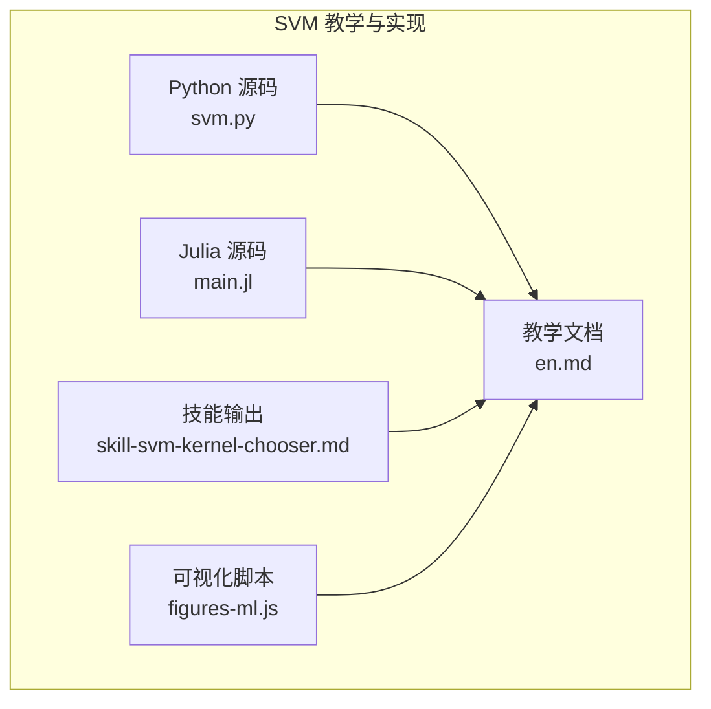
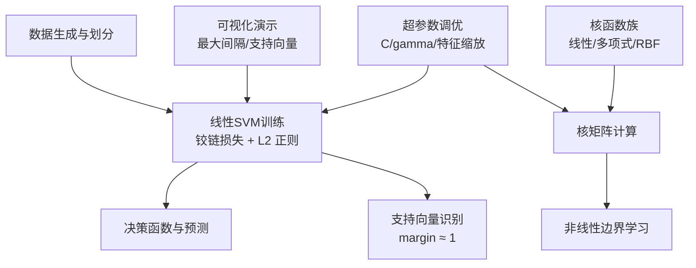
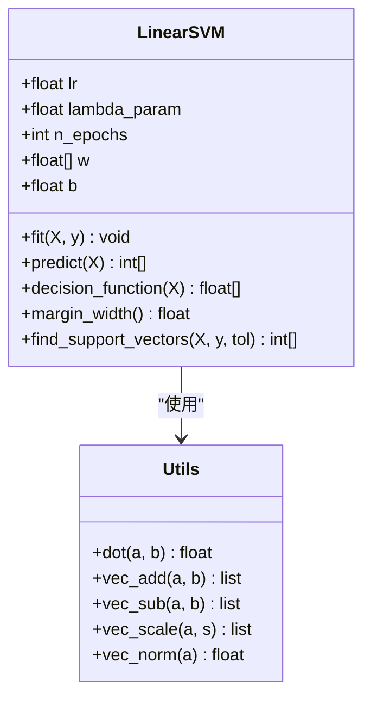
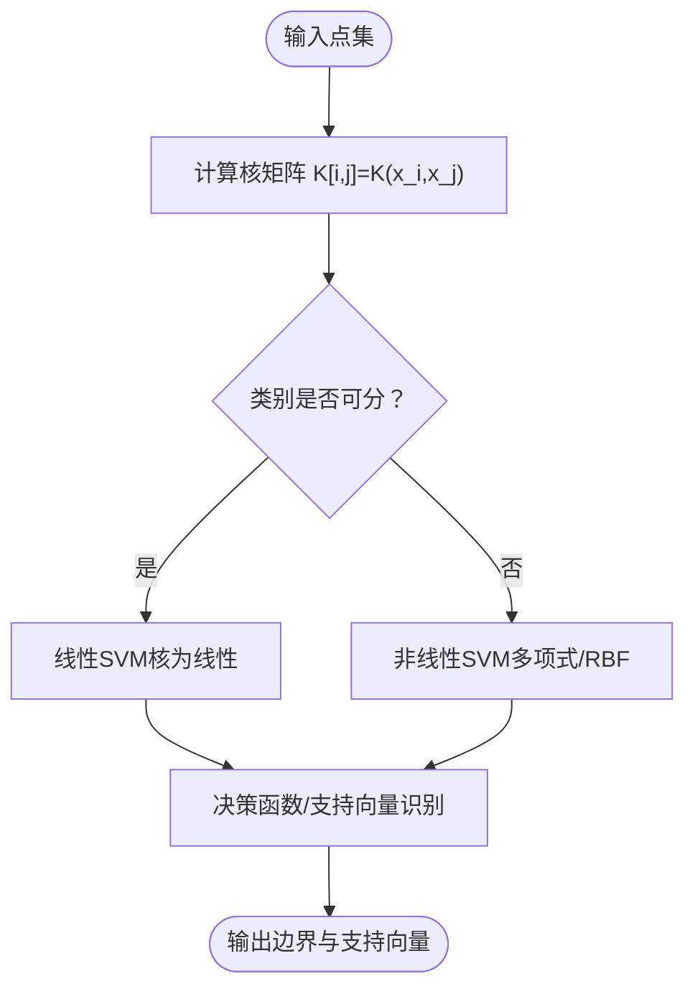
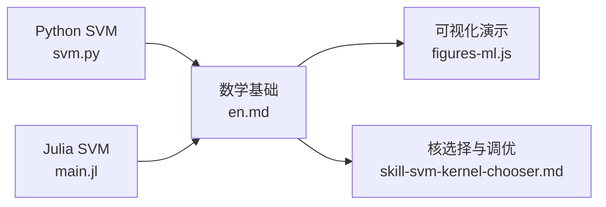
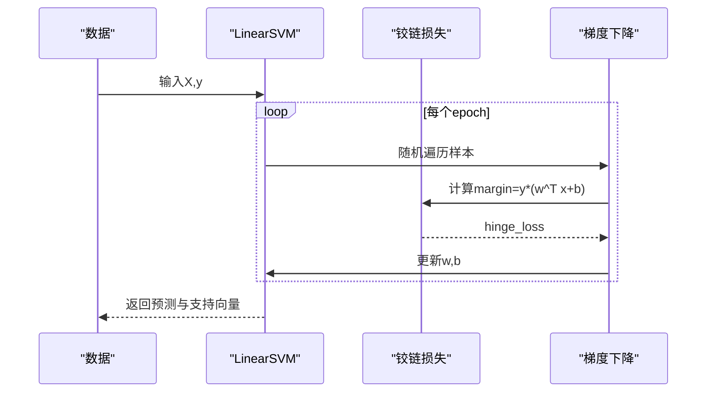
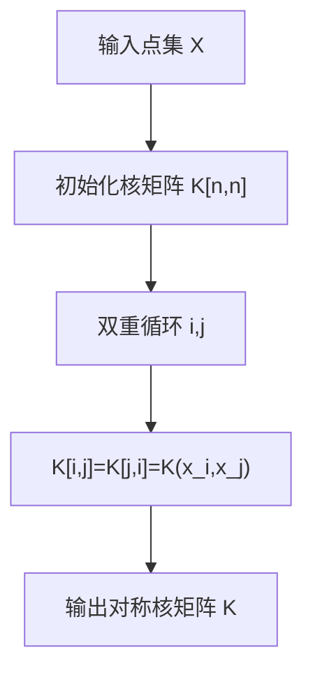

# 支持向量机

<cite>
**本文引用的文件**
- [svm.py](file://phases/02-ml-fundamentals/05-support-vector-machines/code/svm.py)
- [main.jl](file://phases/02-ml-fundamentals/05-support-vector-machines/code/main.jl)
- [en.md](file://phases/02-ml-fundamentals/05-support-vector-machines/docs/en.md)
- [skill-svm-kernel-chooser.md](file://phases/02-ml-fundamentals/05-support-vector-machines/outputs/skill-svm-kernel-chooser.md)
- [figures-ml.js](file://site/figures-ml.js)
</cite>

## 目录
1. [引言](#引言)
2. [项目结构](#项目结构)
3. [核心组件](#核心组件)
4. [架构总览](#架构总览)
5. [详细组件分析](#详细组件分析)
6. [依赖分析](#依赖分析)
7. [性能考量](#性能考量)
8. [故障排查指南](#故障排查指南)
9. [结论](#结论)
10. [附录](#附录)

## 引言
本文件系统性梳理支持向量机（SVM）的几何直观、优化问题、软间隔与硬间隔、核技巧的数学基础与实现要点，并结合仓库中的示例代码与教学材料，给出从零实现线性SVM、核函数、超参数调优到可视化演示的完整路径。同时补充多分类扩展思路与实践建议，帮助读者在小样本、高维稀疏数据等场景下构建稳健的SVM模型。

## 项目结构
该模块位于“机器学习基础”阶段，配套有：
- Python 实现：线性SVM、核函数、损失与梯度、数据生成与训练流程演示
- Julia 实现：与Python版本等价的功能与演示
- 教学文档：SVM概念、软硬间隔、核技巧、SVR、使用建议与术语
- 可视化脚本：交互式展示SVM边界的最大间隔特性
- 技能输出：核选择与超参数调优的决策清单与流程图

图表来源
- [svm.py](file://phases/02-ml-fundamentals/05-support-vector-machines/code/svm.py)
- [main.jl](file://phases/02-ml-fundamentals/05-support-vector-machines/code/main.jl)
- [en.md](file://phases/02-ml-fundamentals/05-support-vector-machines/docs/en.md)
- [skill-svm-kernel-chooser.md](file://phases/02-ml-fundamentals/05-support-vector-machines/outputs/skill-svm-kernel-chooser.md)
- [figures-ml.js](file://site/figures-ml.js)

章节来源
- [svm.py](file://phases/02-ml-fundamentals/05-support-vector-machines/code/svm.py)
- [main.jl](file://phases/02-ml-fundamentals/05-support-vector-machines/code/main.jl)
- [en.md](file://phases/02-ml-fundamentals/05-support-vector-machines/docs/en.md)
- [skill-svm-kernel-chooser.md](file://phases/02-ml-fundamentals/05-support-vector-machines/outputs/skill-svm-kernel-chooser.md)
- [figures-ml.js](file://site/figures-ml.js)

## 核心组件
- 线性SVM（软间隔）：以梯度下降最小化正则化的铰链损失，无需显式求解二次规划；提供权重、偏置、决策函数、支持向量识别与边界宽度计算。
- 核函数族：线性核、多项式核、RBF核；提供核矩阵计算与可视化对比。
- 数据生成与评估：线性可分、带噪声、圆形不可分数据集；训练/测试划分与准确率统计。
- 超参数与调优：C参数（正则化强度）、gamma（RBF局部性），配合特征缩放与交叉验证策略。
- 可视化与教学：交互式最大间隔演示，标注支持向量与边界。

章节来源
- [svm.py](file://phases/02-ml-fundamentals/05-support-vector-machines/code/svm.py)
- [main.jl](file://phases/02-ml-fundamentals/05-support-vector-machines/code/main.jl)
- [en.md](file://phases/02-ml-fundamentals/05-support-vector-machines/docs/en.md)
- [skill-svm-kernel-chooser.md](file://phases/02-ml-fundamentals/05-support-vector-machines/outputs/skill-svm-kernel-chooser.md)

## 架构总览
SVM的实现由以下层次构成：
- 数学与优化层：最大间隔几何、软间隔与硬间隔、铰链损失、拉格朗日对偶与KKT条件
- 核技巧层：核函数定义与核矩阵计算，避免显式高维映射
- 训练与预测层：线性SVM（梯度下降）、支持向量识别、决策函数
- 数据与评估层：数据生成、训练/测试划分、准确率与边界宽度
- 可视化与教学层：交互式最大间隔演示、核函数对比、超参数调优流程

图表来源
- [svm.py](file://phases/02-ml-fundamentals/05-support-vector-machines/code/svm.py)
- [en.md](file://phases/02-ml-fundamentals/05-support-vector-machines/docs/en.md)
- [figures-ml.js](file://site/figures-ml.js)

## 详细组件分析

### 几何原理与优化问题（硬间隔与软间隔）
- 最大间隔几何：通过超平面 w^T x + b = 0 将两类分离，间隔为 2/||w||，目标是最大化间隔。
- 硬间隔：约束 y_i(w^T x_i + b) ≥ 1 对所有样本成立；仅支持向量满足等号。
- 软间隔：引入松弛变量 ξ_i，允许部分样本误判或进入间隔，目标为最小化 ||w||^2/2 + C Σ ξ_i。
- 铰链损失：max(0, 1 - y_i f(x_i))，外侧为0，内部线性惩罚；与逻辑损失相比更稀疏（仅支持向量贡献）。

章节来源
- [en.md](file://phases/02-ml-fundamentals/05-support-vector-machines/docs/en.md)

### 线性SVM实现（梯度下降）
- 前向：f(x) = sign(w^T x + b)，决策函数返回标量用于距离度量与支持向量判定
- 损失：铰链损失平均到每个样本
- 梯度：当 y_i(w^T x_i + b) ≥ 1 时仅L2正则项；否则加入误分类项
- 训练：随机打乱样本顺序进行SGD更新，记录损失历史便于观察收敛

图表来源
- [svm.py](file://phases/02-ml-fundamentals/05-support-vector-machines/code/svm.py)

章节来源
- [svm.py](file://phases/02-ml-fundamentals/05-support-vector-machines/code/svm.py)

### 核技巧与核函数
- 核函数本质：用 K(x, z) 替代内积 x^T z，使学习非线性边界成为可能
- 常用核：
  - 线性核：K(x, z) = x^T z
  - 多项式核：K(x, z) = (x^T z + c)^d
  - RBF核：K(x, z) = exp(-γ ||x - z||^2)
- 核矩阵：K[i,j] = K(x_i, x_j)，用于衡量样本相似性；RBF在局部近似时值高，在远距离时接近0
- 特征映射：多项式核隐式将输入映射到更高维空间，维度随度数指数增长；核技巧避免显式构造

图表来源
- [svm.py](file://phases/02-ml-fundamentals/05-support-vector-machines/code/svm.py)

章节来源
- [svm.py](file://phases/02-ml-fundamentals/05-support-vector-machines/code/svm.py)
- [en.md](file://phases/02-ml-fundamentals/05-support-vector-machines/docs/en.md)

### 正则化参数C与调优策略
- C含义：C越大，越惩罚误分类，倾向于窄间隔、低偏差、高方差；C越小，允许更多误分类，倾向于宽间隔、高偏差、低方差
- 调优建议：
  - 先固定特征缩放，再网格搜索C（如10^(-3)到10^3）
  - 对RBF核，同时搜索gamma（如10^(-3)到10^1）
  - 使用交叉验证评估泛化性能
  - 注意C与gamma的交互效应：低gamma+高C易过拟合；高gamma+低C易欠拟合

章节来源
- [skill-svm-kernel-chooser.md](file://phases/02-ml-fundamentals/05-support-vector-machines/outputs/skill-svm-kernel-chooser.md)
- [svm.py](file://phases/02-ml-fundamentals/05-support-vector-machines/code/svm.py)

### 多分类扩展（一对一、一对多）
- 一对一（OvO）：对每对类别训练一个二分类器，预测时采用投票机制
- 一对多（OvR）：对每个类别训练一个二分类器（正类 vs 其余），预测时取置信度最高者
- 在SVM中，两种策略均可与核函数结合；实践中OvR更常见且易于并行化

章节来源
- [en.md](file://phases/02-ml-fundamentals/05-support-vector-machines/docs/en.md)

### 实际应用案例与建议
- 文本分类（TF-IDF高维稀疏）：优先线性核或LinearSVC，速度快且效果好
- 小样本/高维数据：SVM仍具优势，注意特征缩放与正则化
- 图像/音频：需手工特征或深度特征，SVM可作为后处理分类器
- 异常检测：一类SVM（one-class SVM）适合无异常样本的边界估计

章节来源
- [en.md](file://phases/02-ml-fundamentals/05-support-vector-machines/docs/en.md)

## 依赖分析
- Python实现依赖标准库（math、random），自定义向量运算工具函数
- Julia实现同样自含内核与向量操作，便于跨语言理解
- 教学文档与可视化脚本相互印证，强调最大间隔与支持向量的几何意义

图表来源
- [svm.py](file://phases/02-ml-fundamentals/05-support-vector-machines/code/svm.py)
- [main.jl](file://phases/02-ml-fundamentals/05-support-vector-machines/code/main.jl)
- [en.md](file://phases/02-ml-fundamentals/05-support-vector-machines/docs/en.md)
- [skill-svm-kernel-chooser.md](file://phases/02-ml-fundamentals/05-support-vector-machines/outputs/skill-svm-kernel-chooser.md)
- [figures-ml.js](file://site/figures-ml.js)

章节来源
- [svm.py](file://phases/02-ml-fundamentals/05-support-vector-machines/code/svm.py)
- [main.jl](file://phases/02-ml-fundamentals/05-support-vector-machines/code/main.jl)
- [en.md](file://phases/02-ml-fundamentals/05-support-vector-machines/docs/en.md)
- [skill-svm-kernel-chooser.md](file://phases/02-ml-fundamentals/05-support-vector-machines/outputs/skill-svm-kernel-chooser.md)
- [figures-ml.js](file://site/figures-ml.js)

## 性能考量
- 线性SVM（梯度下降）：每轮O(n·d)，适合大规模稀疏数据
- 决策边界：仅支持向量参与预测，内存占用低
- 核方法：核矩阵计算O(n^2)，大样本不建议直接使用核SVM；可考虑LinearSVC或降维
- 特征缩放：SVM对尺度敏感，务必标准化后再训练
- 超参数：C与gamma影响训练时间与泛化；网格搜索需权衡计算成本

## 故障排查指南
- 未缩放特征导致边界扭曲：先做标准化
- 过拟合（高C/低gamma）：降低C或提高gamma，增加正则
- 欠拟合（低C/高gamma）：提高C或降低gamma
- 支持向量过少/过多：检查C与数据分布，必要时重采样或特征工程
- 训练不收敛：调整学习率、增加迭代次数、检查标签符号一致性

章节来源
- [skill-svm-kernel-chooser.md](file://phases/02-ml-fundamentals/05-support-vector-machines/outputs/skill-svm-kernel-chooser.md)
- [svm.py](file://phases/02-ml-fundamentals/05-support-vector-machines/code/svm.py)

## 结论
SVM以最大间隔为核心思想，结合软间隔与铰链损失，形成稀疏、可解释的二分类模型。通过核技巧，SVM能够学习非线性边界而无需显式高维映射。在小样本、高维稀疏数据等场景，SVM仍具有显著优势。结合正确的特征缩放、合理的C/gamma调优以及支持向量识别，可获得稳健的分类结果。

## 附录

### 关键流程：线性SVM训练（序列图）

图表来源
- [svm.py](file://phases/02-ml-fundamentals/05-support-vector-machines/code/svm.py)

### 关键流程：核矩阵计算（流程图）

图表来源
- [svm.py](file://phases/02-ml-fundamentals/05-support-vector-machines/code/svm.py)

### 可视化演示：最大间隔与支持向量
- 交互式旋转边界、调节间隔宽度，突出支持向量在边界上的关键作用
- 展示“只有支持向量决定边界”的几何直觉

章节来源
- [figures-ml.js](file://site/figures-ml.js)