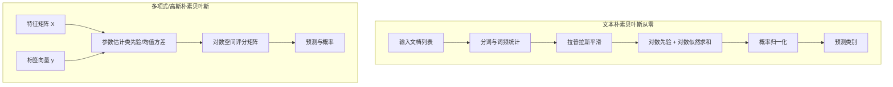
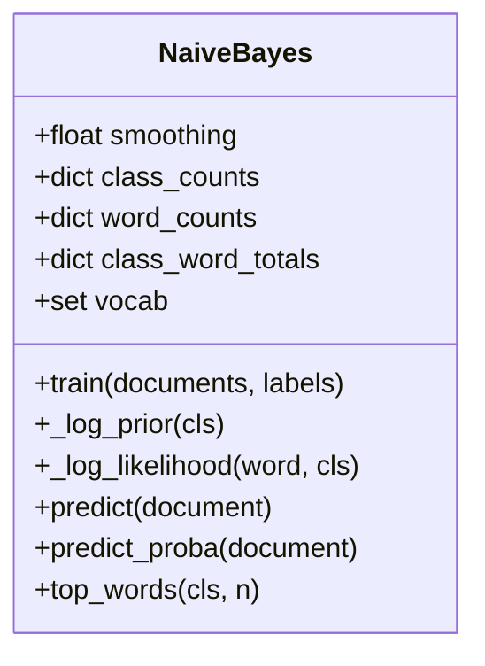
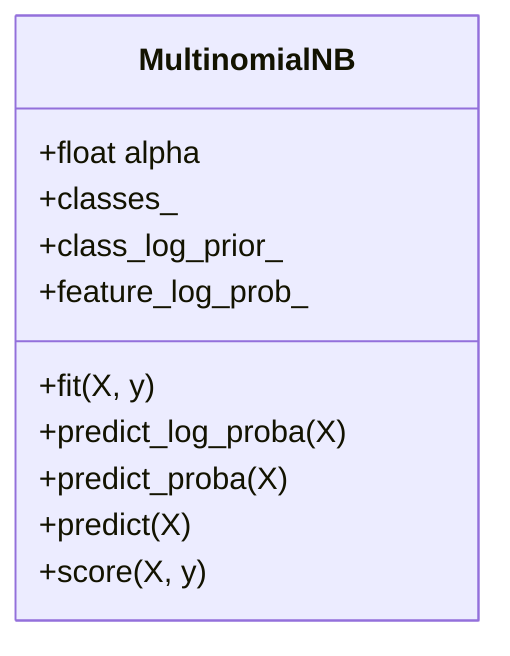
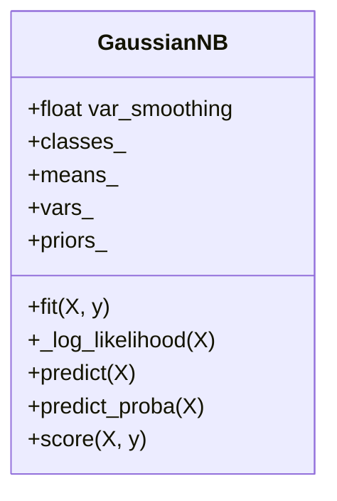
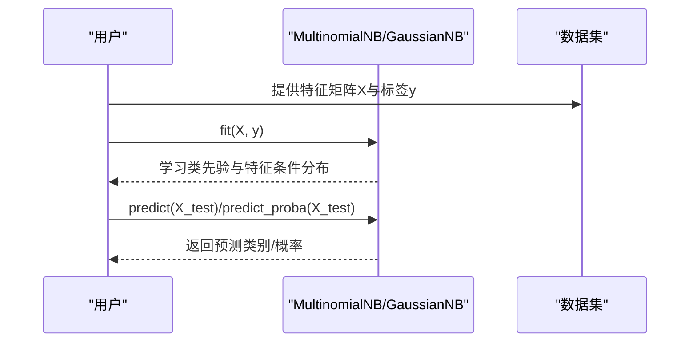
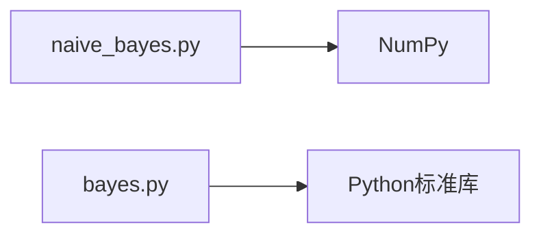

# 朴素贝叶斯

<cite>
**本文引用的文件**
- [naive_bayes.py](file://phases/02-ml-fundamentals/14-naive-bayes/code/naive_bayes.py)
- [bayes.py](file://phases/01-math-foundations/07-bayes-theorem/code/bayes.py)
- [朴素贝叶斯文档](file://phases/02-ml-fundamentals/14-naive-bayes/docs/en.md)
- [贝叶斯定理文档](file://phases/01-math-foundations/07-bayes-theorem/docs/en.md)
</cite>

## 目录
1. [引言](#引言)
2. [项目结构](#项目结构)
3. [核心组件](#核心组件)
4. [架构总览](#架构总览)
5. [详细组件分析](#详细组件分析)
6. [依赖关系分析](#依赖关系分析)
7. [性能考量](#性能考量)
8. [故障排查指南](#故障排查指南)
9. [结论](#结论)
10. [附录](#附录)

## 引言
本文件系统化梳理朴素贝叶斯算法在该仓库中的实现与理论基础，覆盖以下要点：
- 贝叶斯定理与“朴素”独立性假设的数学原理
- 多项式、高斯、伯努利三种变体的适用场景与差异
- 完整代码实现：概率估计、拉普拉斯平滑、对数空间计算
- 连续特征与离散特征的处理方式
- 文本分类、垃圾邮件检测等经典应用与性能评估方法

## 项目结构
与朴素贝叶斯相关的核心文件位于两个阶段：
- 数学基础阶段（07-贝叶斯定理）：提供从零实现的朴素贝叶斯文本分类器，演示拉普拉斯平滑与对数空间推理
- 机器学习基础阶段（14-朴素贝叶斯）：提供多类变体的完整实现（多项式、高斯），并包含对比实验、训练规模影响、混淆矩阵与指标

图表来源
- [naive_bayes.py](file://phases/02-ml-fundamentals/14-naive-bayes/code/naive_bayes.py)
- [bayes.py](file://phases/01-math-foundations/07-bayes-theorem/code/bayes.py)
- [朴素贝叶斯文档](file://phases/02-ml-fundamentals/14-naive-bayes/docs/en.md)
- [贝叶斯定理文档](file://phases/01-math-foundations/07-bayes-theorem/docs/en.md)

章节来源
- [naive_bayes.py](file://phases/02-ml-fundamentals/14-naive-bayes/code/naive_bayes.py)
- [bayes.py](file://phases/01-math-foundations/07-bayes-theorem/code/bayes.py)
- [朴素贝叶斯文档](file://phases/02-ml-fundamentals/14-naive-bayes/docs/en.md)
- [贝叶斯定理文档](file://phases/01-math-foundations/07-bayes-theorem/docs/en.md)

## 核心组件
- 文本朴素贝叶斯（从零实现）
  - 类：NaiveBayes
  - 功能：分词、统计词频、拉普拉斯平滑、对数空间预测、概率归一化、类别词表导出
  - 关键路径：[训练与预测流程](file://phases/01-math-foundations/07-bayes-theorem/code/bayes.py)
- 多项式朴素贝叶斯（大规模文本）
  - 类：MultinomialNB
  - 功能：非负计数输入、拉普拉斯平滑、对数空间矩阵乘法预测、准确率评估
  - 关键路径：[多项式NB实现与演示](file://phases/02-ml-fundamentals/14-naive-bayes/code/naive_bayes.py)
- 高斯朴素贝叶斯（连续特征）
  - 类：GaussianNB
  - 功能：每类每维均值方差估计、正则化方差、对数似然求和、概率归一化
  - 关键路径：[高斯NB实现与演示](file://phases/02-ml-fundamentals/14-naive-bayes/code/naive_bayes.py)
- 变体选择与使用建议
  - 文档：[变体与应用场景](file://phases/02-ml-fundamentals/14-naive-bayes/docs/en.md)

章节来源
- [naive_bayes.py](file://phases/02-ml-fundamentals/14-naive-bayes/code/naive_bayes.py)
- [bayes.py](file://phases/01-math-foundations/07-bayes-theorem/code/bayes.py)
- [朴素贝叶斯文档](file://phases/02-ml-fundamentals/14-naive-bayes/docs/en.md)

## 架构总览
下图展示两类实现的总体架构与数据流：

图表来源
- [naive_bayes.py](file://phases/02-ml-fundamentals/14-naive-bayes/code/naive_bayes.py)
- [bayes.py](file://phases/01-math-foundations/07-bayes-theorem/code/bayes.py)

## 详细组件分析

### 组件A：文本朴素贝叶斯（NaiveBayes）
- 设计要点
  - 使用字典存储每个类别的词频与总词数
  - 拉普拉斯平滑：(词频 + α) / (类总词数 + α × 词汇表大小)
  - 对数空间避免下溢：log P(类别) + Σ log P(词|类别)
  - 预测时比较对数得分，归一化得到概率分布
- 关键接口与路径
  - 训练：[train](file://phases/01-math-foundations/07-bayes-theorem/code/bayes.py)
  - 先验对数：[_log_prior](file://phases/01-math-foundations/07-bayes-theorem/code/bayes.py)
  - 似然对数：[_log_likelihood](file://phases/01-math-foundations/07-bayes-theorem/code/bayes.py)
  - 预测与概率：[predict/predict_proba](file://phases/01-math-foundations/07-bayes-theorem/code/bayes.py)
  - 词表导出：[top_words](file://phases/01-math-foundations/07-bayes-theorem/code/bayes.py)

图表来源
- [bayes.py](file://phases/01-math-foundations/07-bayes-theorem/code/bayes.py)

章节来源
- [bayes.py](file://phases/01-math-foundations/07-bayes-theorem/code/bayes.py)

### 组件B：多项式朴素贝叶斯（MultinomialNB）
- 设计要点
  - 输入必须为非负计数（如词频、TF-IDF）
  - 每类每维进行拉普拉斯平滑：(频数 + α) / (类总频数 + α × 特征数)
  - 预测通过矩阵乘法：X @ 特征对数概率.T + 类先验对数
  - 支持 predict_log_proba、predict_proba、predict、score
- 关键接口与路径
  - 初始化与拟合：[MultinomialNB.__init__/fit](file://phases/02-ml-fundamentals/14-naive-bayes/code/naive_bayes.py)
  - 预测对数概率：[predict_log_proba](file://phases/02-ml-fundamentals/14-naive-bayes/code/naive_bayes.py)
  - 预测概率与类别：[predict_proba/predict](file://phases/02-ml-fundamentals/14-naive-bayes/code/naive_bayes.py)
  - 准确率评估：[score](file://phases/02-ml-fundamentals/14-naive-bayes/code/naive_bayes.py)

图表来源
- [naive_bayes.py](file://phases/02-ml-fundamentals/14-naive-bayes/code/naive_bayes.py)

章节来源
- [naive_bayes.py](file://phases/02-ml-fundamentals/14-naive-bayes/code/naive_bayes.py)

### 组件C：高斯朴素贝叶斯（GaussianNB）
- 设计要点
  - 假设每类每维特征服从高斯分布
  - 每类估计均值与方差，并对方差加极小常数防止除零
  - 对数似然为各维高斯对数密度之和，再加类先验对数
  - 支持 predict、predict_proba、score
- 关键接口与路径
  - 初始化与拟合：[GaussianNB.__init__/fit](file://phases/02-ml-fundamentals/14-naive-bayes/code/naive_bayes.py)
  - 对数似然计算：[_log_likelihood](file://phases/02-ml-fundamentals/14-naive-bayes/code/naive_bayes.py)
  - 预测与概率：[predict/predict_proba](file://phases/02-ml-fundamentals/14-naive-bayes/code/naive_bayes.py)

图表来源
- [naive_bayes.py](file://phases/02-ml-fundamentals/14-naive-bayes/code/naive_bayes.py)

章节来源
- [naive_bayes.py](file://phases/02-ml-fundamentals/14-naive-bayes/code/naive_bayes.py)

### 组件D：变体选择与使用建议
- 适用场景
  - 多项式：文本分类（词频/TF-IDF）、离散计数
  - 高斯：连续特征、近似正态分布
  - 伯努利：短文本或二值特征（需将词频转为0/1）
- 平滑与校准
  - 拉普拉斯平滑（α）控制先验强度
  - 若需要可靠概率，可使用校准器（CalibratedClassifierCV）

章节来源
- [朴素贝叶斯文档](file://phases/02-ml-fundamentals/14-naive-bayes/docs/en.md)

### 组件E：文本分类与垃圾邮件检测流程
- 文本朴素贝叶斯演示
  - 训练与预测：[demo_naive_bayes](file://phases/01-math-foundations/07-bayes-theorem/code/bayes.py)
  - 词表导出与置信度：[top_words/predict_proba](file://phases/01-math-foundations/07-bayes-theorem/code/bayes.py)
- 多项式/高斯对比与训练规模影响
  - 对比演示：[demo_comparison](file://phases/02-ml-fundamentals/14-naive-bayes/code/naive_bayes.py)
  - 训练规模曲线：[demo_training_size](file://phases/02-ml-fundamentals/14-naive-bayes/code/naive_bayes.py)
  - 混淆矩阵与指标：[demo_confusion_matrix](file://phases/02-ml-fundamentals/14-naive-bayes/code/naive_bayes.py)

图表来源
- [naive_bayes.py](file://phases/02-ml-fundamentals/14-naive-bayes/code/naive_bayes.py)

章节来源
- [naive_bayes.py](file://phases/02-ml-fundamentals/14-naive-bayes/code/naive_bayes.py)
- [bayes.py](file://phases/01-math-foundations/07-bayes-theorem/code/bayes.py)

## 依赖关系分析
- 内部依赖
  - MultinomialNB 与 GaussianNB 均依赖 NumPy 进行数值计算
  - 文本朴素贝叶斯依赖标准库集合类型与数学函数
- 外部依赖
  - 文档中给出 scikit-learn 的使用示例，便于与生产实现对照

图表来源
- [naive_bayes.py](file://phases/02-ml-fundamentals/14-naive-bayes/code/naive_bayes.py)
- [bayes.py](file://phases/01-math-foundations/07-bayes-theorem/code/bayes.py)

章节来源
- [naive_bayes.py](file://phases/02-ml-fundamentals/14-naive-bayes/code/naive_bayes.py)
- [bayes.py](file://phases/01-math-foundations/07-bayes-theorem/code/bayes.py)

## 性能考量
- 计算复杂度
  - 多项式NB：预测 O(n×d×k)，一次矩阵乘法
  - 高斯NB：预测 O(n×d×k)，每样本对每类每维计算高斯密度
- 数值稳定性
  - 对数空间避免下溢；预测前减去各行最大值再指数化，保证数值稳定
- 数据规模
  - 小样本时，朴素独立性假设带来强先验，降低过拟合风险
  - 大样本时，判别模型可能更灵活，但NB仍具备极快的推理速度

章节来源
- [朴素贝叶斯文档](file://phases/02-ml-fundamentals/14-naive-bayes/docs/en.md)
- [naive_bayes.py](file://phases/02-ml-fundamentals/14-naive-bayes/code/naive_bayes.py)

## 故障排查指南
- 多项式NB报错“特征值必须非负”
  - 现象：当特征含负值时报错
  - 解决：改用高斯NB，或将特征移位至非负区间
  - 参考：[fit校验](file://phases/02-ml-fundamentals/14-naive-bayes/code/naive_bayes.py)
- 高斯NB方差为零导致除零
  - 现象：某类某维方差为零
  - 解决：使用极小常数平滑
  - 参考：[方差平滑](file://phases/02-ml-fundamentals/14-naive-bayes/code/naive_bayes.py)
- 概率未校准
  - 现象：输出概率不可靠
  - 解决：使用校准器（文档建议）
  - 参考：[校准建议](file://phases/02-ml-fundamentals/14-naive-bayes/docs/en.md)

章节来源
- [naive_bayes.py](file://phases/02-ml-fundamentals/14-naive-bayes/code/naive_bayes.py)
- [朴素贝叶斯文档](file://phases/02-ml-fundamentals/14-naive-bayes/docs/en.md)

## 结论
- 朴素贝叶斯以“错误”的独立性假设换取强大的实用表现：在高维稀疏文本数据上，小样本也能稳健泛化
- 三种变体各有侧重：多项式NB适合计数型文本；高斯NB适合连续特征；伯努利NB适合短文本或二值特征
- 实践中应结合数据特性选择变体与平滑强度，并关注概率校准与评估指标（精度、召回、F1）

## 附录

### 数学原理与变体速查
- 贝叶斯定理与“朴素”独立性假设
  - 参考：[贝叶斯定理与独立性假设](file://phases/01-math-foundations/07-bayes-theorem/docs/en.md)
- 三种变体与适用场景
  - 参考：[变体与应用场景](file://phases/02-ml-fundamentals/14-naive-bayes/docs/en.md)
- 拉普拉斯平滑与对数空间
  - 参考：[平滑与对数空间](file://phases/02-ml-fundamentals/14-naive-bayes/docs/en.md)

### 代码片段路径索引
- 文本朴素贝叶斯
  - 训练与预测：[train/predict](file://phases/01-math-foundations/07-bayes-theorem/code/bayes.py)
  - 平滑与概率归一化：[predict_proba/top_words](file://phases/01-math-foundations/07-bayes-theorem/code/bayes.py)
- 多项式NB
  - 拟合与预测：[MultinomialNB.fit/predict_log_proba](file://phases/02-ml-fundamentals/14-naive-bayes/code/naive_bayes.py)
  - 矩阵乘法预测：[predict_log_proba](file://phases/02-ml-fundamentals/14-naive-bayes/code/naive_bayes.py)
- 高斯NB
  - 拟合与对数似然：[GaussianNB.fit/_log_likelihood](file://phases/02-ml-fundamentals/14-naive-bayes/code/naive_bayes.py)