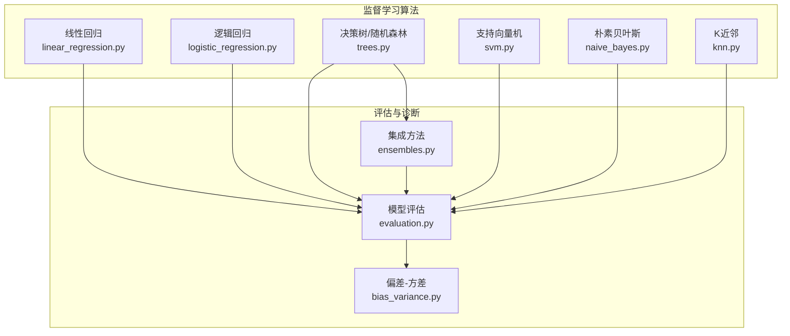
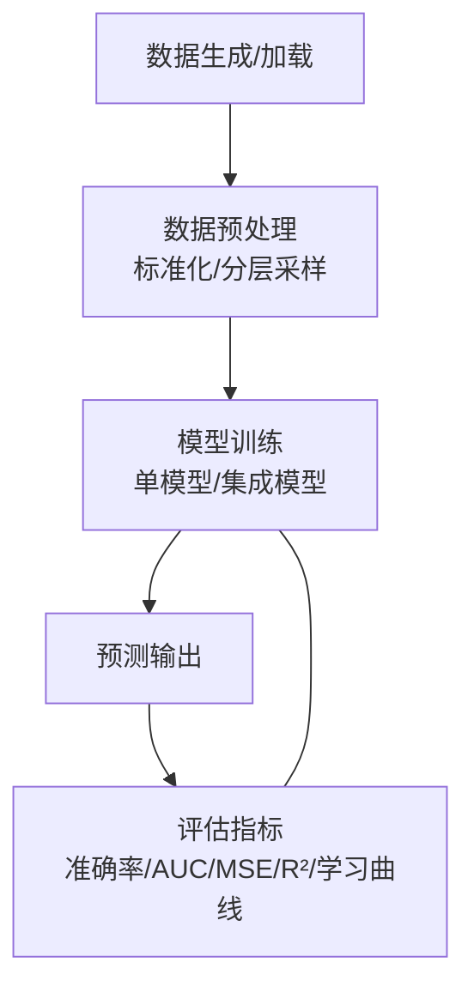
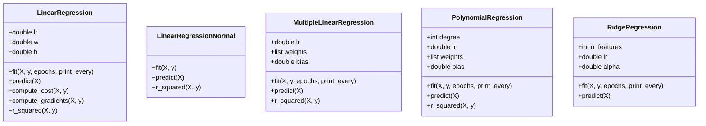
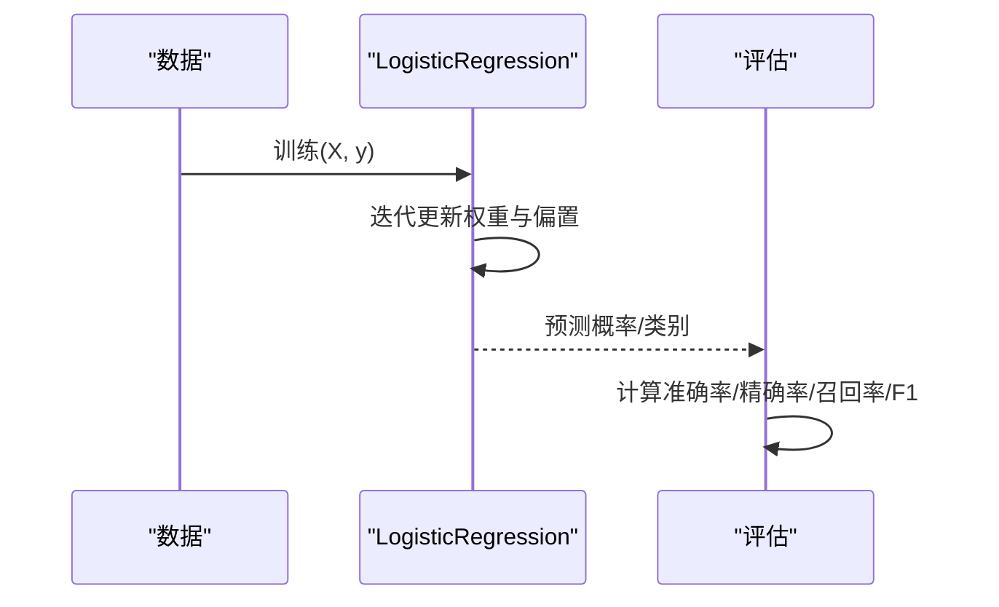
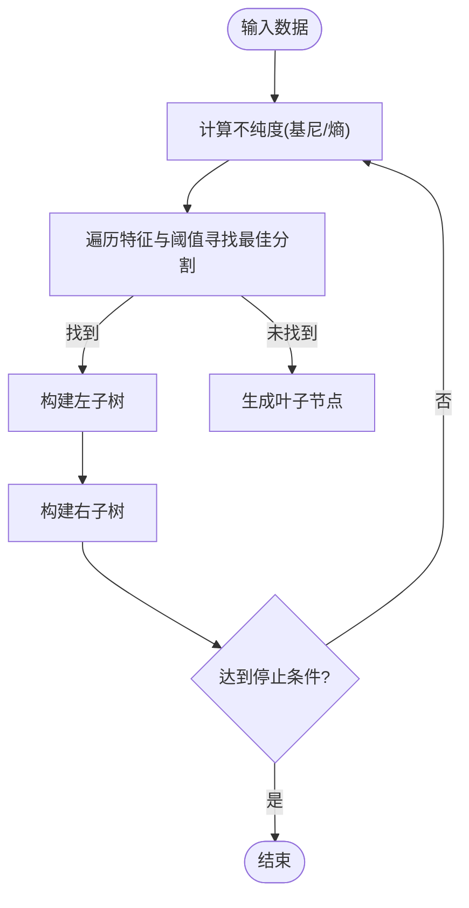
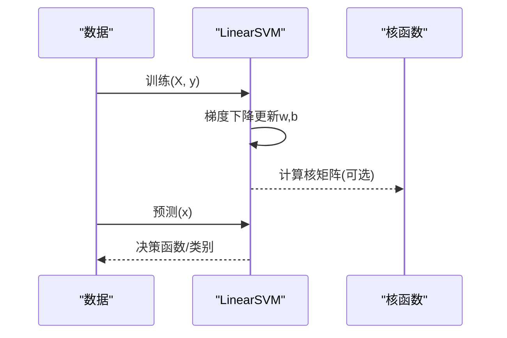
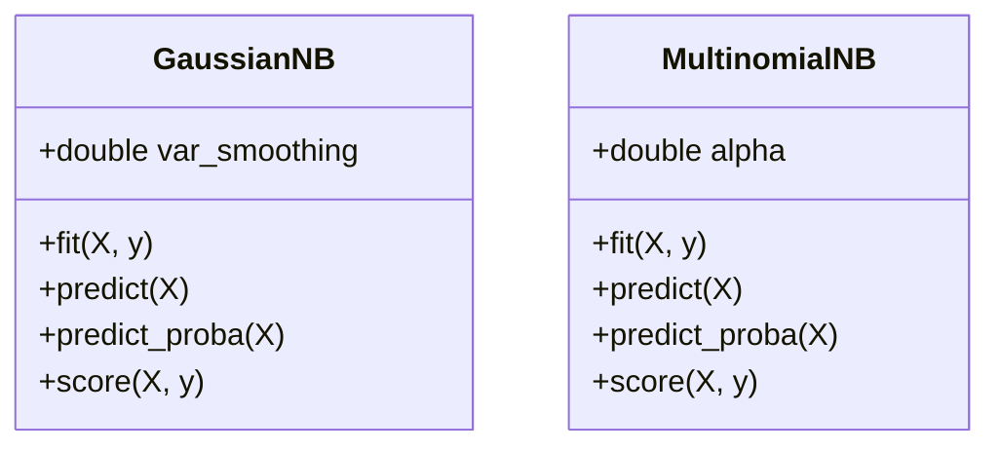
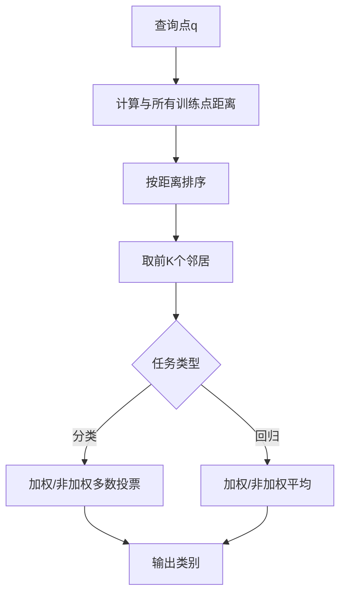
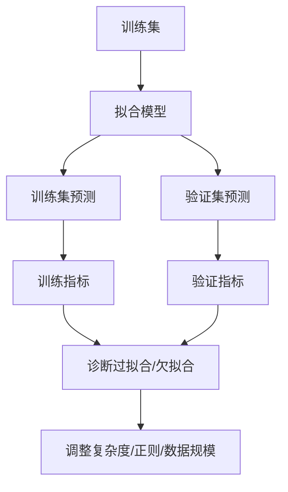

# 监督学习算法

<cite>
**本文档引用的文件**
- [linear_regression.py](file://phases/02-ml-fundamentals/02-linear-regression/code/linear_regression.py)
- [logistic_regression.py](file://phases/02-ml-fundamentals/03-logistic-regression/code/logistic_regression.py)
- [trees.py](file://phases/02-ml-fundamentals/04-decision-trees/code/trees.py)
- [svm.py](file://phases/02-ml-fundamentals/05-support-vector-machines/code/svm.py)
- [naive_bayes.py](file://phases/02-ml-fundamentals/14-naive-bayes/code/naive_bayes.py)
- [evaluation.py](file://phases/02-ml-fundamentals/09-model-evaluation/code/evaluation.py)
- [bias_variance.py](file://phases/02-ml-fundamentals/10-bias-variance/code/bias_variance.py)
- [ensembles.py](file://phases/02-ml-fundamentals/11-ensemble-methods/code/ensembles.py)
- [knn.py](file://phases/02-ml-fundamentals/06-knn-and-distances/code/knn.py)
</cite>

## 目录
1. [引言](#引言)
2. [项目结构](#项目结构)
3. [核心组件](#核心组件)
4. [架构总览](#架构总览)
5. [详细组件分析](#详细组件分析)
6. [依赖关系分析](#依赖关系分析)
7. [性能考量](#性能考量)
8. [故障排查指南](#故障排查指南)
9. [结论](#结论)
10. [附录](#附录)

## 引言
本文件系统化梳理了监督学习中的核心算法与实践要点，覆盖回归与分类两大任务：线性回归、逻辑回归、决策树（含随机森林）、支持向量机、朴素贝叶斯以及K近邻。文档不仅阐述数学原理、适用场景、优缺点与实现细节，还结合仓库中的从零实现与演示脚本，给出训练/测试流程、模型评估指标、偏差-方差权衡、正则化策略、过拟合与欠拟合诊断方法，并提供基于真实数据集的对比实验路径。

## 项目结构
监督学习相关代码集中在“机器学习基础”阶段的多个子模块中，每个算法均配有独立的Python实现与演示脚本，便于对照理解与实操验证。



**图表来源**
- [linear_regression.py:1-344](file://phases/02-ml-fundamentals/02-linear-regression/code/linear_regression.py#L1-L344)
- [logistic_regression.py:1-326](file://phases/02-ml-fundamentals/03-logistic-regression/code/logistic_regression.py#L1-L326)
- [trees.py:1-653](file://phases/02-ml-fundamentals/04-decision-trees/code/trees.py#L1-L653)
- [svm.py:1-567](file://phases/02-ml-fundamentals/05-support-vector-machines/code/svm.py#L1-L567)
- [naive_bayes.py:1-345](file://phases/02-ml-fundamentals/14-naive-bayes/code/naive_bayes.py#L1-L345)
- [knn.py:1-735](file://phases/02-ml-fundamentals/06-knn-and-distances/code/knn.py#L1-L735)
- [evaluation.py:1-462](file://phases/02-ml-fundamentals/09-model-evaluation/code/evaluation.py#L1-L462)
- [bias_variance.py:1-325](file://phases/02-ml-fundamentals/10-bias-variance/code/bias_variance.py#L1-L325)
- [ensembles.py:1-503](file://phases/02-ml-fundamentals/11-ensemble-methods/code/ensembles.py#L1-L503)

**章节来源**
- [linear_regression.py:1-344](file://phases/02-ml-fundamentals/02-linear-regression/code/linear_regression.py#L1-L344)
- [logistic_regression.py:1-326](file://phases/02-ml-fundamentals/03-logistic-regression/code/logistic_regression.py#L1-L326)
- [trees.py:1-653](file://phases/02-ml-fundamentals/04-decision-trees/code/trees.py#L1-L653)
- [svm.py:1-567](file://phases/02-ml-fundamentals/05-support-vector-machines/code/svm.py#L1-L567)
- [naive_bayes.py:1-345](file://phases/02-ml-fundamentals/14-naive-bayes/code/naive_bayes.py#L1-L345)
- [knn.py:1-735](file://phases/02-ml-fundamentals/06-knn-and-distances/code/knn.py#L1-L735)
- [evaluation.py:1-462](file://phases/02-ml-fundamentals/09-model-evaluation/code/evaluation.py#L1-L462)
- [bias_variance.py:1-325](file://phases/02-ml-fundamentals/10-bias-variance/code/bias_variance.py#L1-L325)
- [ensembles.py:1-503](file://phases/02-ml-fundamentals/11-ensemble-methods/code/ensembles.py#L1-L503)

## 核心组件
- 线性回归：最小二乘法与梯度下降求解，支持正规方程、多项式特征与L2正则（岭回归），并提供训练/测试拆分与R²评估。
- 逻辑回归：使用sigmoid函数建模概率，交叉熵损失，支持多分类Softmax回归，阈值调参与混淆矩阵报告。
- 决策树与随机森林：基于基尼/熵的最优切分，支持回归树与分类树，集成方法包含Bagging、AdaBoost、梯度提升与堆叠。
- 支持向量机：线性SVM的梯度下降实现，铰链损失，C参数控制正则，核技巧（线性/多项式/RBF）演示。
- 朴素贝叶斯：高斯NB与多项式NB，平滑参数alpha调优，文本与连续特征处理。
- K近邻：多种距离度量（L1/L2/余弦/Minkowski），KD树加速，特征标准化的重要性，维度灾难与懒惰学习特性。
- 模型评估：训练/验证/测试划分、K折与分层K折、学习曲线、AUC-ROC、回归指标（MSE/RMSE/MAE/R²）。
- 偏差-方差：分解与可视化、正则化效果、数据规模影响、诊断规则与学习曲线解读。

**章节来源**
- [linear_regression.py:18-344](file://phases/02-ml-fundamentals/02-linear-regression/code/linear_regression.py#L18-L344)
- [logistic_regression.py:36-326](file://phases/02-ml-fundamentals/03-logistic-regression/code/logistic_regression.py#L36-L326)
- [trees.py:75-653](file://phases/02-ml-fundamentals/04-decision-trees/code/trees.py#L75-L653)
- [svm.py:53-567](file://phases/02-ml-fundamentals/05-support-vector-machines/code/svm.py#L53-L567)
- [naive_bayes.py:4-345](file://phases/02-ml-fundamentals/14-naive-bayes/code/naive_bayes.py#L4-L345)
- [knn.py:49-735](file://phases/02-ml-fundamentals/06-knn-and-distances/code/knn.py#L49-L735)
- [evaluation.py:5-462](file://phases/02-ml-fundamentals/09-model-evaluation/code/evaluation.py#L5-L462)
- [bias_variance.py:34-325](file://phases/02-ml-fundamentals/10-bias-variance/code/bias_variance.py#L34-L325)
- [ensembles.py:59-503](file://phases/02-ml-fundamentals/11-ensemble-methods/code/ensembles.py#L59-L503)

## 架构总览
下图展示了从零实现的监督学习算法在数据准备、训练、预测与评估上的整体流程，体现各模块间的协作关系。



**图表来源**
- [evaluation.py:5-462](file://phases/02-ml-fundamentals/09-model-evaluation/code/evaluation.py#L5-L462)
- [ensembles.py:196-503](file://phases/02-ml-fundamentals/11-ensemble-methods/code/ensembles.py#L196-L503)
- [bias_variance.py:190-325](file://phases/02-ml-fundamentals/10-bias-variance/code/bias_variance.py#L190-L325)

## 详细组件分析

### 线性回归
- 数学原理：最小二乘目标函数，梯度下降迭代更新权重；正规方程直接求解；可扩展到多项式特征与L2正则（岭回归）。
- 实现要点：类封装预测、损失计算、梯度更新、R²评估；支持多特征与多项式特征映射；标准化对收敛与稳定性的影响。
- 适用场景：数值型连续变量的线性关系建模；作为基线模型与解释性强的回归器。
- 优缺点：简单高效、可解释；对非线性关系表达能力有限，易受异常值影响。
- 代码路径参考：
  - [线性回归类定义与训练:18-100](file://phases/02-ml-fundamentals/02-linear-regression/code/linear_regression.py#L18-L100)
  - [正规方程实现:68-92](file://phases/02-ml-fundamentals/02-linear-regression/code/linear_regression.py#L68-L92)
  - [多项式回归与岭回归:186-288](file://phases/02-ml-fundamentals/02-linear-regression/code/linear_regression.py#L186-L288)
  - [训练/测试拆分与sklearn对比:290-344](file://phases/02-ml-fundamentals/02-linear-regression/code/linear_regression.py#L290-L344)



**图表来源**
- [linear_regression.py:18-344](file://phases/02-ml-fundamentals/02-linear-regression/code/linear_regression.py#L18-L344)

**章节来源**
- [linear_regression.py:18-344](file://phases/02-ml-fundamentals/02-linear-regression/code/linear_regression.py#L18-L344)

### 逻辑回归
- 数学原理：sigmoid函数将线性组合映射为概率，交叉熵损失用于二分类与多分类（Softmax）。
- 实现要点：显式梯度下降；支持阈值调参；混淆矩阵与各类指标（准确率、精确率、召回率、F1）。
- 适用场景：二分类与多分类问题；需要概率输出与可解释系数时。
- 优缺点：训练稳定、可解释；对复杂非线性边界表达能力弱，需特征工程或核技巧。
- 代码路径参考：
  - [二分类逻辑回归:36-97](file://phases/02-ml-fundamentals/03-logistic-regression/code/logistic_regression.py#L36-L97)
  - [多分类Softmax回归:165-252](file://phases/02-ml-fundamentals/03-logistic-regression/code/logistic_regression.py#L165-L252)
  - [阈值调优与决策边界:254-289](file://phases/02-ml-fundamentals/03-logistic-regression/code/logistic_regression.py#L254-L289)
  - [sklearn对比:291-326](file://phases/02-ml-fundamentals/03-logistic-regression/code/logistic_regression.py#L291-L326)



**图表来源**
- [logistic_regression.py:36-142](file://phases/02-ml-fundamentals/03-logistic-regression/code/logistic_regression.py#L36-L142)
- [evaluation.py:107-127](file://phases/02-ml-fundamentals/09-model-evaluation/code/evaluation.py#L107-L127)

**章节来源**
- [logistic_regression.py:36-326](file://phases/02-ml-fundamentals/03-logistic-regression/code/logistic_regression.py#L36-L326)
- [evaluation.py:107-127](file://phases/02-ml-fundamentals/09-model-evaluation/code/evaluation.py#L107-L127)

### 决策树与随机森林
- 数学原理：基于信息增益（基尼/熵）选择最优分割；回归树以方差减少衡量；集成通过自助采样与弱学习器组合降低方差。
- 实现要点：递归构建树、剪枝参数（最大深度、叶节点最少样本数）、特征随机化（随机森林）。
- 适用场景：结构化数据、非线性与非单调关系；特征重要性排序。
- 优缺点：可解释局部规则、对噪声鲁棒；易过拟合，需剪枝与集成。
- 代码路径参考：
  - [决策树类与分裂准则:75-221](file://phases/02-ml-fundamentals/04-decision-trees/code/trees.py#L75-L221)
  - [随机森林与特征重要性:223-279](file://phases/02-ml-fundamentals/04-decision-trees/code/trees.py#L223-L279)
  - [回归树与学习曲线演示:510-546](file://phases/02-ml-fundamentals/04-decision-trees/code/trees.py#L510-L546)
  - [集成方法演示:196-503](file://phases/02-ml-fundamentals/11-ensemble-methods/code/ensembles.py#L196-L503)



**图表来源**
- [trees.py:104-191](file://phases/02-ml-fundamentals/04-decision-trees/code/trees.py#L104-L191)

**章节来源**
- [trees.py:75-653](file://phases/02-ml-fundamentals/04-decision-trees/code/trees.py#L75-L653)
- [ensembles.py:196-503](file://phases/02-ml-fundamentals/11-ensemble-methods/code/ensembles.py#L196-L503)

### 支持向量机
- 数学原理：最大化间隔超平面，铰链损失惩罚误分类与越界样本；通过核技巧映射到高维空间。
- 实现要点：线性SVM梯度下降；C参数控制正则；RBF核的局部相似性。
- 适用场景：中小规模高维稀疏数据；需要稀疏模型（仅支持向量参与决策）。
- 优缺点：理论稳健、泛化能力强；对大规模数据训练成本高；核与参数敏感。
- 代码路径参考：
  - [线性SVM与铰链损失:53-111](file://phases/02-ml-fundamentals/05-support-vector-machines/code/svm.py#L53-L111)
  - [核函数与核矩阵:25-36](file://phases/02-ml-fundamentals/05-support-vector-machines/code/svm.py#L25-L36)
  - [C参数与边界演示:253-287](file://phases/02-ml-fundamentals/05-support-vector-machines/code/svm.py#L253-L287)
  - [非线性边界与核技巧:371-412](file://phases/02-ml-fundamentals/05-support-vector-machines/code/svm.py#L371-L412)



**图表来源**
- [svm.py:53-111](file://phases/02-ml-fundamentals/05-support-vector-machines/code/svm.py#L53-L111)
- [svm.py:180-189](file://phases/02-ml-fundamentals/05-support-vector-machines/code/svm.py#L180-L189)

**章节来源**
- [svm.py:53-567](file://phases/02-ml-fundamentals/05-support-vector-machines/code/svm.py#L53-L567)

### 朴素贝叶斯
- 数学原理：基于贝叶斯定理与特征条件独立假设；高斯NB适用于连续特征，多项式NB适用于离散/计数特征。
- 实现要点：拉普拉斯平滑（alpha）；对数概率避免数值下溢；多分类预测。
- 适用场景：文本分类、垃圾邮件检测、高维稀疏数据。
- 优缺点：训练快速、小样本表现好；条件独立假设常不成立；对零概率敏感（需平滑）。
- 代码路径参考：
  - [高斯NB与多项式NB:4-101](file://phases/02-ml-fundamentals/14-naive-bayes/code/naive_bayes.py#L4-L101)
  - [文本与连续数据演示:176-345](file://phases/02-ml-fundamentals/14-naive-bayes/code/naive_bayes.py#L176-L345)



**图表来源**
- [naive_bayes.py:4-101](file://phases/02-ml-fundamentals/14-naive-bayes/code/naive_bayes.py#L4-L101)

**章节来源**
- [naive_bayes.py:4-345](file://phases/02-ml-fundamentals/14-naive-bayes/code/naive_bayes.py#L4-L345)

### K近邻
- 数学原理：基于距离度量的懒惰学习；K个最近邻居投票（分类）或加权平均（回归）。
- 实现要点：多种距离度量（L1/L2/余弦/Minkowski）；KD树加速搜索；特征标准化至关重要。
- 适用场景：局部相似性明显的数据；无需显式模型假设。
- 优缺点：简单直观、无需训练；预测时间复杂度高；对维度灾难敏感。
- 代码路径参考：
  - [KNN类与预测逻辑:49-110](file://phases/02-ml-fundamentals/06-knn-and-distances/code/knn.py#L49-L110)
  - [KD树实现与查询:121-172](file://phases/02-ml-fundamentals/06-knn-and-distances/code/knn.py#L121-L172)
  - [维度灾难与懒惰学习:389-607](file://phases/02-ml-fundamentals/06-knn-and-distances/code/knn.py#L389-L607)



**图表来源**
- [knn.py:66-110](file://phases/02-ml-fundamentals/06-knn-and-distances/code/knn.py#L66-L110)

**章节来源**
- [knn.py:49-735](file://phases/02-ml-fundamentals/06-knn-and-distances/code/knn.py#L49-L735)

### 模型评估与偏差-方差
- 评估工具：训练/验证/测试划分、K折与分层K折、学习曲线、AUC-ROC、回归指标（MSE/RMSE/MAE/R²）。
- 偏差-方差：分解总误差为偏差、方差与噪声项；正则化与数据规模对两者的影响；诊断规则与学习曲线判别。
- 代码路径参考：
  - [评估指标与交叉验证:5-224](file://phases/02-ml-fundamentals/09-model-evaluation/code/evaluation.py#L5-L224)
  - [AUC-ROC与混淆矩阵:129-188](file://phases/02-ml-fundamentals/09-model-evaluation/code/evaluation.py#L129-L188)
  - [偏差-方差分解与学习曲线:34-325](file://phases/02-ml-fundamentals/10-bias-variance/code/bias_variance.py#L34-L325)



**图表来源**
- [evaluation.py:190-224](file://phases/02-ml-fundamentals/09-model-evaluation/code/evaluation.py#L190-L224)
- [bias_variance.py:190-277](file://phases/02-ml-fundamentals/10-bias-variance/code/bias_variance.py#L190-L277)

**章节来源**
- [evaluation.py:5-462](file://phases/02-ml-fundamentals/09-model-evaluation/code/evaluation.py#L5-L462)
- [bias_variance.py:34-325](file://phases/02-ml-fundamentals/10-bias-variance/code/bias_variance.py#L34-L325)

## 依赖关系分析
- 组件内聚：各算法模块自包含训练、预测与评估逻辑，便于独立运行与对比。
- 组件耦合：评估模块被广泛复用；集成方法依赖基础树模型；KNN依赖距离度量与标准化。
- 外部依赖：部分脚本包含sklearn对比（如线性回归、逻辑回归、SVM），但核心实现完全自举。

```mermaid
graph LR
EVAL["evaluation.py"] <- --> LR["linear_regression.py"]
EVAL <- --> LOG["logistic_regression.py"]
EVAL <- --> SVM["svm.py"]
EVAL <- --> NB["naive_bayes.py"]
EVAL <- --> KNN["knn.py"]
EVAL <- --> DT["trees.py"]
ENS["ensembles.py"] --> DT
BV["bias_variance.py"] --> LR
BV --> LOG
BV --> DT
```

**图表来源**
- [evaluation.py:1-462](file://phases/02-ml-fundamentals/09-model-evaluation/code/evaluation.py#L1-L462)
- [ensembles.py:1-503](file://phases/02-ml-fundamentals/11-ensemble-methods/code/ensembles.py#L1-L503)
- [bias_variance.py:1-325](file://phases/02-ml-fundamentals/10-bias-variance/code/bias_variance.py#L1-L325)

**章节来源**
- [evaluation.py:1-462](file://phases/02-ml-fundamentals/09-model-evaluation/code/evaluation.py#L1-L462)
- [ensembles.py:1-503](file://phases/02-ml-fundamentals/11-ensemble-methods/code/ensembles.py#L1-L503)
- [bias_variance.py:1-325](file://phases/02-ml-fundamentals/10-bias-variance/code/bias_variance.py#L1-L325)

## 性能考量
- 计算复杂度：线性/逻辑回归为解析或小批量梯度下降；决策树/随机森林训练为O(n log n)至O(n²)（取决于分裂策略）；SVM在大规模数据上训练成本高；KNN预测为O(n·d)，KD树可降低为O(log n)附近（低维）。
- 特征工程：标准化/归一化对KNN/SVM/线性模型尤为关键；多项式特征可提升非线性表达能力但增加过拟合风险。
- 正则化：L2（岭回归）、L1（Lasso）与树模型剪枝共同抑制过拟合；C参数与alpha平滑对泛化有显著影响。
- 并行与缓存：KNN查询可并行化；SVM与树模型可利用多核；K折交叉验证建议分层采样以保持类别平衡。

## 故障排查指南
- 过拟合迹象：训练误差低、验证误差高；学习曲线中训练/验证曲线分离且差距大；偏差-方差曲线中方差主导。
  - 解决方案：增加数据、正则化（L2/L1/剪枝）、简化模型、早停、数据增强。
- 欠拟合迹象：训练/验证误差均高；学习曲线未收敛；偏差主导。
  - 解决方案：增加特征、多项式/交互特征、增大模型容量、减少正则、尝试非线性模型。
- 类别不平衡：准确率误导，应关注精确率/召回率/F1/AUC-ROC。
  - 解决方案：重采样（过采样/欠采样）、代价敏感学习、阈值移动、集成方法。
- 超参数调优：网格/随机搜索结合K折交叉验证；先粗后细；注意过拟合搜索空间。
- 数据质量：缺失值填充、异常值检测、特征缩放一致性（训练/测试共享统计量）。

**章节来源**
- [evaluation.py:318-462](file://phases/02-ml-fundamentals/09-model-evaluation/code/evaluation.py#L318-L462)
- [bias_variance.py:190-325](file://phases/02-ml-fundamentals/10-bias-variance/code/bias_variance.py#L190-L325)

## 结论
本仓库提供了监督学习核心算法的完整从零实现与系统化演示，涵盖回归与分类、评估与诊断、偏差-方差权衡与正则化策略。通过对比不同算法在相同数据集上的表现，读者可以掌握算法选择策略与性能比较方法，并具备解决实际问题所需的工程化能力。

## 附录
- 实际数据集与演示路径：
  - 回归：线性回归、多项式回归、岭回归与训练/测试拆分演示。
    - 参考：[linear_regression.py:290-344](file://phases/02-ml-fundamentals/02-linear-regression/code/linear_regression.py#L290-L344)
  - 分类：逻辑回归（二/多分类）、阈值调优、决策边界与sklearn对比。
    - 参考：[logistic_regression.py:85-326](file://phases/02-ml-fundamentals/03-logistic-regression/code/logistic_regression.py#L85-L326)
  - 集成：随机森林、AdaBoost、梯度提升与堆叠。
    - 参考：[trees.py:223-279](file://phases/02-ml-fundamentals/04-decision-trees/code/trees.py#L223-L279), [ensembles.py:59-503](file://phases/02-ml-fundamentals/11-ensemble-methods/code/ensembles.py#L59-L503)
  - 非线性：SVM核技巧、RBF核与C参数影响。
    - 参考：[svm.py:253-412](file://phases/02-ml-fundamentals/05-support-vector-machines/code/svm.py#L253-L412)
  - 文本/连续：高斯/多项式朴素贝叶斯与平滑参数调优。
    - 参考：[naive_bayes.py:176-345](file://phases/02-ml-fundamentals/14-naive-bayes/code/naive_bayes.py#L176-L345)
  - 懒惰学习：KNN距离度量、KD树、维度灾难与懒惰学习。
    - 参考：[knn.py:241-735](file://phases/02-ml-fundamentals/06-knn-and-distances/code/knn.py#L241-L735)
  - 评估与诊断：K折/分层K折、学习曲线、AUC-ROC、偏差-方差分解。
    - 参考：[evaluation.py:71-224](file://phases/02-ml-fundamentals/09-model-evaluation/code/evaluation.py#L71-L224), [bias_variance.py:34-325](file://phases/02-ml-fundamentals/10-bias-variance/code/bias_variance.py#L34-L325)