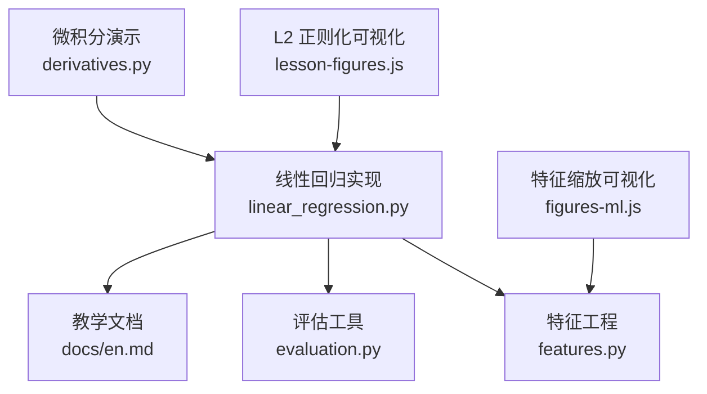
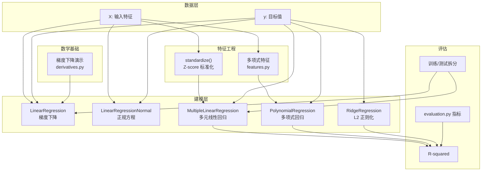
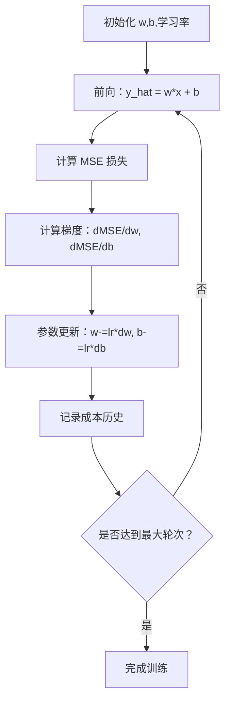
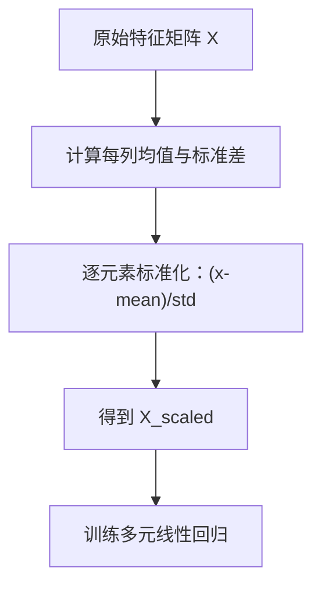
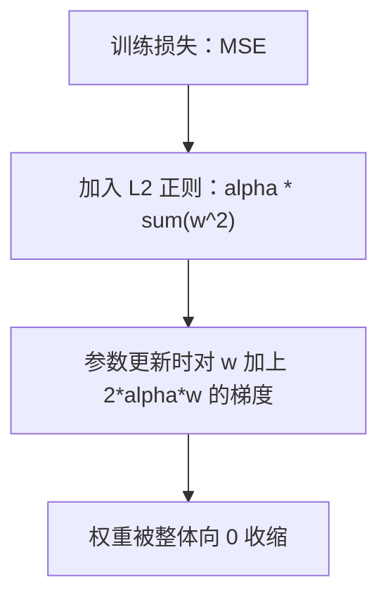
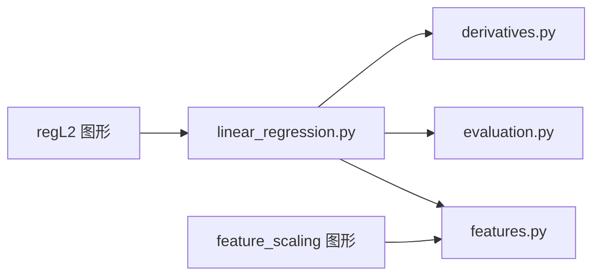

# 线性回归

<cite>
**本文引用的文件**
- [linear_regression.py](file://phases/02-ml-fundamentals/02-linear-regression/code/linear_regression.py)
- [en.md（线性回归文档）](file://phases/02-ml-fundamentals/02-linear-regression/docs/en.md)
- [derivatives.py（微积分与梯度演示）](file://phases/01-math-foundations/04-calculus-for-ml/code/derivatives.py)
- [evaluation.py（模型评估与回归指标）](file://phases/02-ml-fundamentals/09-model-evaluation/code/evaluation.py)
- [features.py（特征工程与标准化）](file://phases/02-ml-fundamentals/08-feature-engineering/code/features.py)
- [feature_scaling 图形（特征缩放可视化）](file://site/figures-ml.js)
- [regL2 图形（L2 正则化可视化）](file://site/lesson-figures.js)
</cite>

## 目录
1. [引言](#引言)
2. [项目结构](#项目结构)
3. [核心组件](#核心组件)
4. [架构总览](#架构总览)
5. [详细组件分析](#详细组件分析)
6. [依赖分析](#依赖分析)
7. [性能考虑](#性能考虑)
8. [故障排查指南](#故障排查指南)
9. [结论](#结论)
10. [附录](#附录)

## 引言
本文件系统性梳理仓库中的线性回归实现与相关数学基础、特征工程与评估方法，覆盖单变量与多元线性回归、损失函数与参数更新流程、特征缩放、L2 正则化（Ridge）、多项式回归、训练/测试拆分与 R² 等评估指标，并通过可视化帮助理解关键概念。

## 项目结构
围绕线性回归的相关代码与文档分布如下：
- 实现与示例：phases/02-ml-fundamentals/02-linear-regression/code/linear_regression.py
- 教学文档：phases/02-ml-fundamentals/02-linear-regression/docs/en.md
- 数学基础（梯度、泰勒展开、数值导数）：phases/01-math-foundations/04-calculus-for-ml/code/derivatives.py
- 模型评估（回归指标、学习曲线等）：phases/02-ml-fundamentals/09-model-evaluation/code/evaluation.py
- 特征工程（标准化、多项式特征等）：phases/02-ml-fundamentals/08-feature-engineering/code/features.py
- 可视化（特征缩放、L2 正则化）：site/figures-ml.js、site/lesson-figures.js

**图表来源**
- [linear_regression.py](file://phases/02-ml-fundamentals/02-linear-regression/code/linear_regression.py)
- [en.md（线性回归文档）](file://phases/02-ml-fundamentals/02-linear-regression/docs/en.md)
- [derivatives.py（微积分与梯度演示）](file://phases/01-math-foundations/04-calculus-for-ml/code/derivatives.py)
- [evaluation.py（模型评估与回归指标）](file://phases/02-ml-fundamentals/09-model-evaluation/code/evaluation.py)
- [features.py（特征工程与标准化）](file://phases/02-ml-fundamentals/08-feature-engineering/code/features.py)
- [feature_scaling 图形（特征缩放可视化）](file://site/figures-ml.js)
- [regL2 图形（L2 正则化可视化）](file://site/lesson-figures.js)

**章节来源**
- [linear_regression.py](file://phases/02-ml-fundamentals/02-linear-regression/code/linear_regression.py)
- [en.md（线性回归文档）](file://phases/02-ml-fundamentals/02-linear-regression/docs/en.md)

## 核心组件
- 单变量线性回归（梯度下降）
  - 类 LinearRegression：支持预测、均方误差损失、显式梯度计算、训练循环、R² 计算
  - 示例：生成带噪声的 y = wx + b 数据，训练并输出 R²
- 正规方程（闭式解）
  - 类 LinearRegressionNormal：基于均值中心化推导的解析解
- 多元线性回归
  - 类 MultipleLinearRegression：多维输入、批量参数更新、成本历史记录、R²
  - 标准化：standardize 函数对多特征进行 Z-score 标准化
- 多项式回归
  - 类 PolynomialRegression：通过构造 x 的幂次特征实现非线性拟合
- 岭回归（L2 正则化）
  - 类 RidgeRegression：在损失中加入权重平方和惩罚项，控制过拟合
- 训练/测试拆分与对比
  - 使用切片方式划分训练/测试集，分别评估 R²
- scikit-learn 对比
  - LinearRegression、PolynomialFeatures、StandardScaler、Ridge 的调用与指标输出

**章节来源**
- [linear_regression.py](file://phases/02-ml-fundamentals/02-linear-regression/code/linear_regression.py)
- [en.md（线性回归文档）](file://phases/02-ml-fundamentals/02-linear-regression/docs/en.md)

## 架构总览
下图展示从“数据生成”到“模型训练/评估”的端到端流程，以及与数学基础、特征工程、评估模块的交互。

**图表来源**
- [linear_regression.py](file://phases/02-ml-fundamentals/02-linear-regression/code/linear_regression.py)
- [derivatives.py（微积分与梯度演示）](file://phases/01-math-foundations/04-calculus-for-ml/code/derivatives.py)
- [features.py（特征工程与标准化）](file://phases/02-ml-fundamentals/08-feature-engineering/code/features.py)
- [evaluation.py（模型评估与回归指标）](file://phases/02-ml-fundamentals/09-model-evaluation/code/evaluation.py)

## 详细组件分析

### 单变量线性回归（梯度下降）
- 模型形式：y = wx + b
- 损失函数：均方误差（MSE），对每个样本的平方误差求平均
- 参数更新：显式计算 dMSE/dw 与 dMSE/db，按学习率迭代更新
- 输出：每若干轮打印损失、w、b；最后输出 R²

**图表来源**
- [linear_regression.py](file://phases/02-ml-fundamentals/02-linear-regression/code/linear_regression.py)

**章节来源**
- [linear_regression.py](file://phases/02-ml-fundamentals/02-linear-regression/code/linear_regression.py)

### 正规方程（闭式解）
- 通过代数推导直接给出最优参数，无需迭代
- 适用于小规模数据或作为梯度下降的对照

**章节来源**
- [linear_regression.py](file://phases/02-ml-fundamentals/02-linear-regression/code/linear_regression.py)

### 多元线性回归与特征缩放
- 模型形式：y = w1*x1 + ... + wn*xn + b
- 关键点：不同量级特征会导致损失面拉伸，收敛变慢；需先标准化
- 标准化：对每个特征减去均值并除以标准差，使各维度方差近似相等

**图表来源**
- [linear_regression.py](file://phases/02-ml-fundamentals/02-linear-regression/code/linear_regression.py)
- [features.py（特征工程与标准化）](file://phases/02-ml-fundamentals/08-feature-engineering/code/features.py)
- [feature_scaling 图形（特征缩放可视化）](file://site/figures-ml.js)

**章节来源**
- [linear_regression.py](file://phases/02-ml-fundamentals/02-linear-regression/code/linear_regression.py)
- [features.py（特征工程与标准化）](file://phases/02-ml-fundamentals/08-feature-engineering/code/features.py)
- [feature_scaling 图形（特征缩放可视化）](file://site/figures-ml.js)

### 多项式回归
- 思路：将输入 x 映射为 [x, x^2, ..., x^d]，再用线性回归拟合
- 优点：仍保持“线性模型在线性权重上”的结构，便于优化
- 风险：高次项易导致过拟合，应结合验证集选择合适次数

**章节来源**
- [linear_regression.py](file://phases/02-ml-fundamentals/02-linear-regression/code/linear_regression.py)

### 岭回归（L2 正则化）
- 在损失中增加权重平方和的惩罚项，抑制大权重，缓解过拟合
- 可视化显示：随着正则强度 λ 上升，所有权重被收缩

**图表来源**
- [linear_regression.py](file://phases/02-ml-fundamentals/02-linear-regression/code/linear_regression.py)
- [regL2 图形（L2 正则化可视化）](file://site/lesson-figures.js)

**章节来源**
- [linear_regression.py](file://phases/02-ml-fundamentals/02-linear-regression/code/linear_regression.py)
- [regL2 图形（L2 正则化可视化）](file://site/lesson-figures.js)

### 训练/测试拆分与 R² 评估
- 将数据按比例切分为训练集与测试集，分别训练与评估
- R²：衡量模型解释目标方差的比例，范围通常为负到 1

**章节来源**
- [linear_regression.py](file://phases/02-ml-fundamentals/02-linear-regression/code/linear_regression.py)
- [evaluation.py（模型评估与回归指标）](file://phases/02-ml-fundamentals/09-model-evaluation/code/evaluation.py)

### 与 scikit-learn 的对比
- LinearRegression：基础线性回归
- PolynomialFeatures：构造多项式特征
- StandardScaler：特征标准化
- Ridge：L2 正则线性回归
- 通过相同随机种子与数据划分，可复现相似结果

**章节来源**
- [linear_regression.py](file://phases/02-ml-fundamentals/02-linear-regression/code/linear_regression.py)

## 依赖分析
- 内部依赖
  - linear_regression.py 依赖 features.py 中的标准化函数与多项式特征构造思路
  - evaluation.py 提供回归指标（MSE、RMSE、MAE、R²）与学习曲线等工具
  - derivatives.py 提供梯度下降与数值导数的演示，加深对优化过程的理解
- 可视化依赖
  - feature_scaling 与 regL2 的图形用于直观展示特征缩放与 L2 正则效果

**图表来源**
- [linear_regression.py](file://phases/02-ml-fundamentals/02-linear-regression/code/linear_regression.py)
- [features.py（特征工程与标准化）](file://phases/02-ml-fundamentals/08-feature-engineering/code/features.py)
- [evaluation.py（模型评估与回归指标）](file://phases/02-ml-fundamentals/09-model-evaluation/code/evaluation.py)
- [derivatives.py（微积分与梯度演示）](file://phases/01-math-foundations/04-calculus-for-ml/code/derivatives.py)
- [feature_scaling 图形（特征缩放可视化）](file://site/figures-ml.js)
- [regL2 图形（L2 正则化可视化）](file://site/lesson-figures.js)

**章节来源**
- [linear_regression.py](file://phases/02-ml-fundamentals/02-linear-regression/code/linear_regression.py)
- [features.py（特征工程与标准化）](file://phases/02-ml-fundamentals/08-feature-engineering/code/features.py)
- [evaluation.py（模型评估与回归指标）](file://phases/02-ml-fundamentals/09-model-evaluation/code/evaluation.py)
- [derivatives.py（微积分与梯度演示）](file://phases/01-math-foundations/04-calculus-for-ml/code/derivatives.py)
- [feature_scaling 图形（特征缩放可视化）](file://site/figures-ml.js)
- [regL2 图形（L2 正则化可视化）](file://site/lesson-figures.js)

## 性能考虑
- 学习率选择
  - 过大：震荡甚至发散；过小：收敛缓慢
  - 建议从 0.01、0.001 起步，观察损失曲线调整
- 特征缩放
  - 不同尺度特征会形成狭长的损失面，导致梯度下降震荡
  - 标准化可显著提升收敛速度与稳定性
- 正则化
  - L2 正则在防止过拟合的同时可能降低训练集拟合度
  - 应结合验证集选择合适的 α
- 数据规模
  - 小规模：正规方程可行；大规模：优先梯度下降
- 多项式度数
  - 度数越高表达能力越强，但更易过拟合，建议交叉验证选择

[本节为通用指导，不直接分析具体文件]

## 故障排查指南
- 损失不降反升
  - 检查学习率是否过大；尝试减小学习率或引入动量/自适应优化
- 收敛极慢
  - 检查是否进行了特征缩放；确认特征量纲相近
- R² 为负
  - 模型表现不如“总是预测均值”的基线，需检查数据与建模流程
- 过拟合
  - 增加正则（L2）、减少多项式度数、收集更多数据、使用交叉验证

**章节来源**
- [linear_regression.py](file://phases/02-ml-fundamentals/02-linear-regression/code/linear_regression.py)
- [evaluation.py（模型评估与回归指标）](file://phases/02-ml-fundamentals/09-model-evaluation/code/evaluation.py)

## 结论
本仓库提供了从数学基础到工程实践的完整闭环：以梯度下降为核心，结合正规方程、特征缩放、正则化与多项式扩展，辅以 R² 等指标与可视化，既适合入门理解，也便于生产环境对照与迁移。

[本节为总结性内容，不直接分析具体文件]

## 附录
- 数学基础参考
  - 梯度下降、数值导数、泰勒展开与海塞矩阵演示，有助于理解优化路径与局部性质
- 可视化资源
  - 特征缩放：展示标准化如何让损失面更圆润，加速收敛
  - L2 正则：展示权重随 λ 上升被整体收缩的过程

**章节来源**
- [derivatives.py（微积分与梯度演示）](file://phases/01-math-foundations/04-calculus-for-ml/code/derivatives.py)
- [feature_scaling 图形（特征缩放可视化）](file://site/figures-ml.js)
- [regL2 图形（L2 正则化可视化）](file://site/lesson-figures.js)