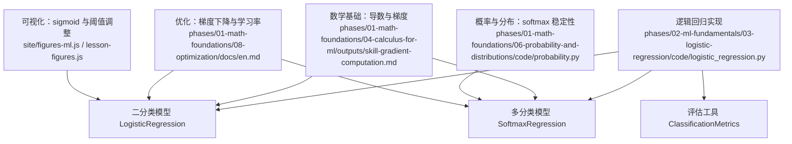
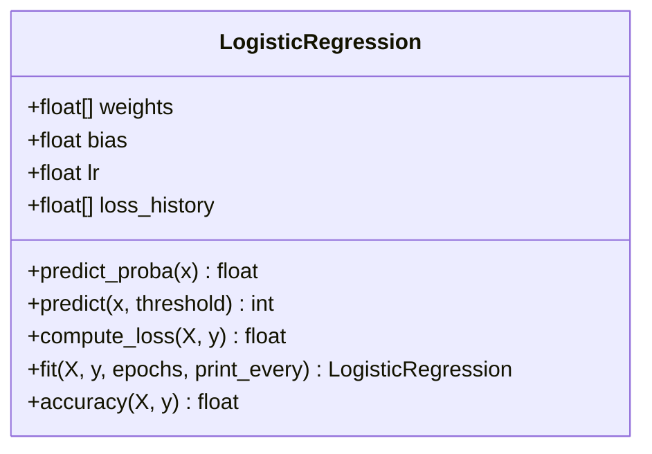
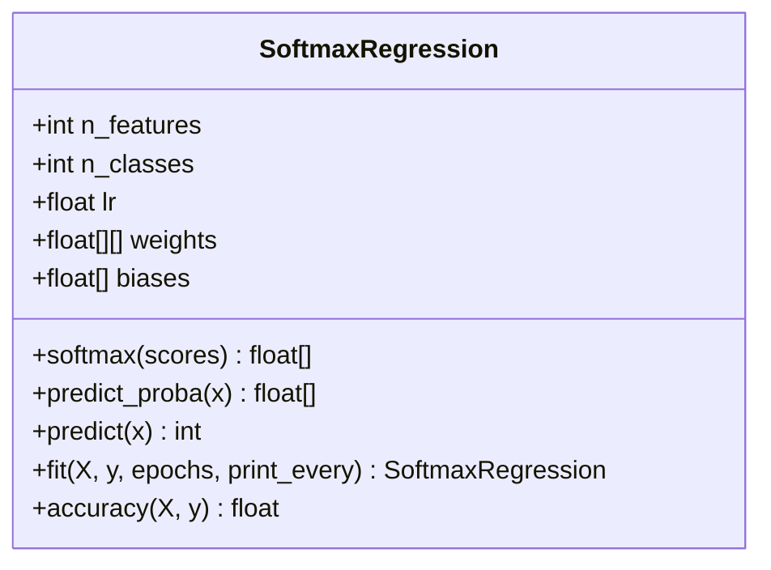
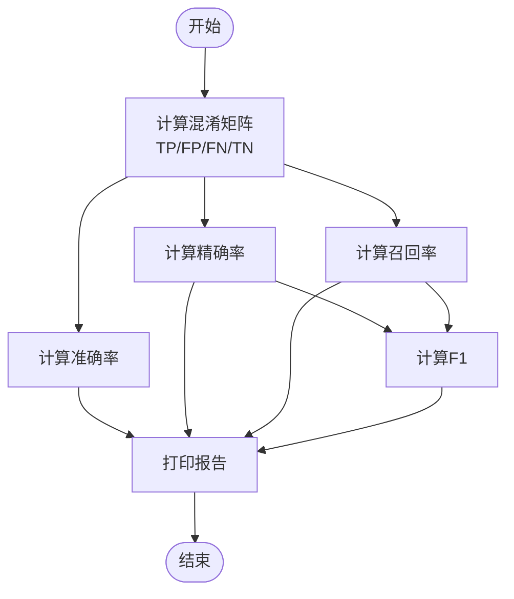
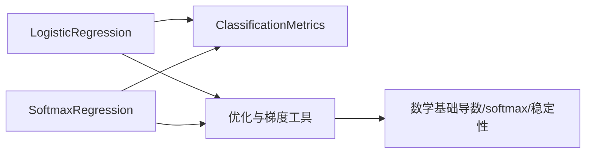

# 逻辑回归

<cite>
**本文引用的文件**
- [logistic_regression.py](file://phases/02-ml-fundamentals/03-logistic-regression/code/logistic_regression.py)
- [skill-gradient-computation.md](file://phases/01-math-foundations/04-calculus-for-ml/outputs/skill-gradient-computation.md)
- [figures-ml.js](file://site/figures-ml.js)
- [lesson-figures.js](file://site/lesson-figures.js)
- [probability.py](file://phases/01-math-foundations/06-probability-and-distributions/code/probability.py)
- [en.md](file://phases/01-math-foundations/08-optimization/docs/en.md)
</cite>

## 目录
1. [引言](#引言)
2. [项目结构](#项目结构)
3. [核心组件](#核心组件)
4. [架构总览](#架构总览)
5. [详细组件分析](#详细组件分析)
6. [依赖关系分析](#依赖关系分析)
7. [性能考量](#性能考量)
8. [故障排查指南](#故障排查指南)
9. [结论](#结论)
10. [附录](#附录)

## 引言
本文件围绕逻辑回归算法构建系统化文档，覆盖数学基础（sigmoid、对数似然与最大似然估计）、二分类与多分类实现（softmax回归）、完整训练流程（梯度计算与参数更新）、正则化与过拟合预防策略，以及评估指标（准确率、精确率、召回率、F1、混淆矩阵、阈值调优）与可视化说明。文档同时提供可运行的从零实现示例与对比参考，帮助读者从理论到实践全面掌握逻辑回归。

## 项目结构
本仓库中与逻辑回归直接相关的实现位于“机器学习基础”阶段的“逻辑回归”课程目录下，配套有数学基础与优化相关内容，便于理解梯度、损失与收敛机制。



图表来源
- [logistic_regression.py:36-326](file://phases/02-ml-fundamentals/03-logistic-regression/code/logistic_regression.py#L36-L326)
- [skill-gradient-computation.md:31-47](file://phases/01-math-foundations/04-calculus-for-ml/outputs/skill-gradient-computation.md#L31-L47)
- [probability.py:193-219](file://phases/01-math-foundations/06-probability-and-distributions/code/probability.py#L193-L219)
- [en.md:37-76](file://phases/01-math-foundations/08-optimization/docs/en.md#L37-L76)
- [figures-ml.js:55-90](file://site/figures-ml.js#L55-L90)
- [lesson-figures.js:529-563](file://site/lesson-figures.js#L529-L563)

章节来源
- [logistic_regression.py:1-326](file://phases/02-ml-fundamentals/03-logistic-regression/code/logistic_regression.py#L1-L326)

## 核心组件
- 二分类逻辑回归模型 LogisticRegression
  - 提供 sigmoid 激活、预测概率与类别、批量交叉熵损失、批量梯度下降训练、准确率评估与决策边界分析。
- 多分类 softmax 回归 SoftmaxRegression
  - 提供 softmax 概率计算、one-hot 目标构造、批量梯度下降训练与准确率评估。
- 评估工具 ClassificationMetrics
  - 计算混淆矩阵、准确率、精确率、召回率、F1 分数，并打印报告。
- 可视化与阈值调优
  - sigmoid 曲线交互演示、阈值滑动对精度/召回/F1的影响、类不平衡与准确率陷阱说明。

章节来源
- [logistic_regression.py:36-326](file://phases/02-ml-fundamentals/03-logistic-regression/code/logistic_regression.py#L36-L326)

## 架构总览
下面的序列图展示了二分类训练流程：数据准备、前向传播（线性+sigmoid）、损失计算、反向传播（误差项）、参数更新、评估与决策边界分析。

```mermaid
sequenceDiagram
participant Data as "数据集"
participant Model as "LogisticRegression"
participant Loss as "交叉熵损失"
participant Grad as "梯度计算"
participant Opt as "批量梯度下降"
participant Eval as "评估工具"
Data->>Model : 输入特征 X, 标签 y
loop 每个epoch
loop 批内样本
Model->>Model : 前向 : 线性得分 z = w·x + b
Model->>Model : 激活 : p = sigmoid(z)
Loss->>Model : 计算负对数似然
Grad->>Model : 计算误差项 error = p - y
Grad->>Model : 累加梯度 dw, db
end
Opt->>Model : 更新权重与偏置
end
Eval->>Model : 预测并评估准确率
Eval->>Model : 计算混淆矩阵与指标
```

图表来源
- [logistic_regression.py:36-82](file://phases/02-ml-fundamentals/03-logistic-regression/code/logistic_regression.py#L36-L82)
- [logistic_regression.py:58-78](file://phases/02-ml-fundamentals/03-logistic-regression/code/logistic_regression.py#L58-L78)

## 详细组件分析

### 二分类：LogisticRegression
- 数学基础
  - 线性得分：z = w^T x + b
  - 激活函数：σ(z) = 1 / (1 + exp(-z))，将实数映射到(0,1)，作为正类概率
  - 损失函数：二元交叉熵（对数似然），对每个样本为 -(y log p + (1-y) log (1-p))，整体取均值
  - 最大似然估计：最大化样本联合概率等价于最小化负对数似然
- 实现要点
  - 概率裁剪防止 log(0)：p ∈ [ε, 1-ε]
  - 梯度：对每个样本误差 error = p - y，对权重与偏置的梯度分别为 X·error 与 1·error
  - 批量更新：按样本累加梯度后除以样本数，再用学习率更新
  - 决策边界：w·x + b = 0，可解出 x2 关于 x1 的表达式（当权重非零时）
- 可视化与阈值调优
  - sigmoid 曲线演示权重与偏置如何改变决策边界
  - 阈值滑动影响精确率/召回率/F1，展示权衡



图表来源
- [logistic_regression.py:36-82](file://phases/02-ml-fundamentals/03-logistic-regression/code/logistic_regression.py#L36-L82)

章节来源
- [logistic_regression.py:5-7](file://phases/02-ml-fundamentals/03-logistic-regression/code/logistic_regression.py#L5-L7)
- [logistic_regression.py:43-48](file://phases/02-ml-fundamentals/03-logistic-regression/code/logistic_regression.py#L43-L48)
- [logistic_regression.py:50-57](file://phases/02-ml-fundamentals/03-logistic-regression/code/logistic_regression.py#L50-L57)
- [logistic_regression.py:58-78](file://phases/02-ml-fundamentals/03-logistic-regression/code/logistic_regression.py#L58-L78)
- [logistic_regression.py:144-162](file://phases/02-ml-fundamentals/03-logistic-regression/code/logistic_regression.py#L144-L162)
- [figures-ml.js:55-90](file://site/figures-ml.js#L55-L90)
- [lesson-figures.js:529-563](file://site/lesson-figures.js#L529-L563)

### 多分类：SoftmaxRegression
- 数学基础
  - 多类概率：softmax(s_k) = exp(s_k) / Σ_j exp(s_j)，其中 s_k = w_k^T x + b_k
  - 损失函数：多类交叉熵（对数似然），对每个样本为 -log p_{true_class}
  - 最大似然估计：对所有样本最大化联合概率
- 实现要点
  - 数值稳定性：先减去最大 logit 再求指数，避免溢出
  - 梯度：误差项 error = p_k - 1{y==k}，对每个类别 k 累加梯度并更新
  - 准确率：预测为概率最大的类别索引
- 与二分类的关系
  - 二分类是 softmax 的特例（两类时可退化为 sigmoid）
  - softmax 对应的梯度在交叉熵下可简化为 (p - y)，避免显式雅可比矩阵



图表来源
- [logistic_regression.py:165-216](file://phases/02-ml-fundamentals/03-logistic-regression/code/logistic_regression.py#L165-L216)
- [probability.py:193-219](file://phases/01-math-foundations/06-probability-and-distributions/code/probability.py#L193-L219)

章节来源
- [logistic_regression.py:165-216](file://phases/02-ml-fundamentals/03-logistic-regression/code/logistic_regression.py#L165-L216)
- [logistic_regression.py:173-177](file://phases/02-ml-fundamentals/03-logistic-regression/code/logistic_regression.py#L173-L177)
- [logistic_regression.py:190-212](file://phases/02-ml-fundamentals/03-logistic-regression/code/logistic_regression.py#L190-L212)
- [probability.py:193-219](file://phases/01-math-foundations/06-probability-and-distributions/code/probability.py#L193-L219)

### 指标与评估：ClassificationMetrics
- 指标计算
  - 混淆矩阵：TP、FP、FN、TN
  - 准确率：(TP + TN) / (TP + TN + FP + FN)
  - 精确率：TP / (TP + FP)
  - 召回率：TP / (TP + FN)
  - F1：2PR/(P+R)
- 使用场景
  - 测试集上打印混淆矩阵与各类指标
  - 阈值调优：通过不同阈值比较准确率、精确率、召回率、F1，选择满足业务目标的阈值



图表来源
- [logistic_regression.py:99-136](file://phases/02-ml-fundamentals/03-logistic-regression/code/logistic_regression.py#L99-L136)
- [lesson-figures.js:529-563](file://site/lesson-figures.js#L529-L563)

章节来源
- [logistic_regression.py:99-136](file://phases/02-ml-fundamentals/03-logistic-regression/code/logistic_regression.py#L99-L136)
- [lesson-figures.js:529-563](file://site/lesson-figures.js#L529-L563)

### 正则化与过拟合预防
- L2 正则化（权重衰减）
  - 在损失中加入 λ||w||^2，使权重向零收缩，缓解过拟合
  - 通过增大正则强度 λ 观察权重收缩趋势
- L1 正则化（稀疏性）
  - 在损失中加入 λΣ|w|，倾向于产生稀疏权重，可用于特征选择
- 其他策略
  - 数据增强与特征工程
  - 早停（基于验证集监控）
  - 学习率调度与批量大小选择
  - 交叉验证（k 折）评估泛化能力

章节来源
- [figures-ml.js:258-293](file://site/figures-ml.js#L258-L293)
- [figures-ml.js:439-464](file://site/figures-ml.js#L439-L464)
- [en.md:37-76](file://phases/01-math-foundations/08-optimization/docs/en.md#L37-L76)

### 优化与梯度计算
- 梯度计算要点
  - 二分类：对交叉熵与 sigmoid 的复合，梯度为 (p - y)
  - 多分类：对交叉熵与 softmax 的复合，梯度为 (p - y_onehot)
  - 注意批平均损失的 1/n 归一化
- 学习率与收敛
  - 学习率过大导致发散，过小导致收敛缓慢
  - 动量与自适应优化器（如 Adam）可加速稳定收敛
- 数值稳定性
  - softmax 中先减去最大 logit 再指数
  - 概率裁剪避免 log(0)

章节来源
- [skill-gradient-computation.md:31-47](file://phases/01-math-foundations/04-calculus-for-ml/outputs/skill-gradient-computation.md#L31-L47)
- [skill-gradient-computation.md:49-55](file://phases/01-math-foundations/04-calculus-for-ml/outputs/skill-gradient-computation.md#L49-L55)
- [probability.py:193-219](file://phases/01-math-foundamentals/06-probability-and-distributions/code/probability.py#L193-L219)
- [en.md:37-76](file://phases/01-math-foundations/08-optimization/docs/en.md#L37-L76)

## 依赖关系分析
- 组件耦合
  - LogisticRegression 与 SoftmaxRegression 独立实现，共享概率与损失概念
  - ClassificationMetrics 仅依赖预测结果与真实标签，低耦合
- 外部依赖
  - 示例中包含 scikit-learn 对比（可选），不影响纯手工实现
- 可能的循环依赖
  - 无循环导入；模块职责清晰



图表来源
- [logistic_regression.py:36-326](file://phases/02-ml-fundamentals/03-logistic-regression/code/logistic_regression.py#L36-L326)
- [skill-gradient-computation.md:31-47](file://phases/01-math-foundations/04-calculus-for-ml/outputs/skill-gradient-computation.md#L31-L47)
- [probability.py:193-219](file://phases/01-math-foundations/06-probability-and-distributions/code/probability.py#L193-L219)

章节来源
- [logistic_regression.py:36-326](file://phases/02-ml-fundamentals/03-logistic-regression/code/logistic_regression.py#L36-L326)

## 性能考量
- 训练效率
  - 批量梯度下降：一次遍历计算全梯度，适合中小规模数据
  - 学习率与迭代次数：需权衡收敛速度与稳定性
- 数值稳定性
  - softmax 溢出防护：logits 减最大值
  - 概率裁剪：避免 log(0)
- 可扩展性
  - 向量化实现（如 NumPy）可显著提升速度
  - 大数据场景建议使用 mini-batch 或 Adam 等优化器

## 故障排查指南
- 发散或不收敛
  - 检查学习率是否过大；尝试减小学习率或使用动量/Adam
  - 检查数据预处理（如标准化）是否合理
- 概率溢出或 NaN
  - 确保 softmax 前减去最大 logit
  - 损失计算中对概率进行裁剪
- 指标异常
  - 精确率/召回率为 0：检查阈值设置与类别分布
  - 类别不平衡：关注召回率与 F1，而非仅看准确率

章节来源
- [skill-gradient-computation.md:49-55](file://phases/01-math-foundations/04-calculus-for-ml/outputs/skill-gradient-computation.md#L49-L55)
- [probability.py:193-219](file://phases/01-math-foundations/06-probability-and-distributions/code/probability.py#L193-L219)
- [figures-ml.js:403-437](file://site/figures-ml.js#L403-L437)

## 结论
逻辑回归是二分类与多分类的基础模型，其核心在于将线性变换通过 sigmoid 或 softmax 映射为概率，并以交叉熵为损失进行最大似然估计。通过从零实现的训练流程、数值稳定性处理与评估指标，可以深入理解参数更新、决策边界与阈值调优的作用。配合正则化与交叉验证等策略，可在保证性能的同时有效预防过拟合。

## 附录
- 与 scikit-learn 的对比
  - 示例中使用 StandardScaler 进行特征标准化，再用 LogisticRegression 训练并评估
  - 用于验证手写实现与主流库的一致性

章节来源
- [logistic_regression.py:291-326](file://phases/02-ml-fundamentals/03-logistic-regression/code/logistic_regression.py#L291-L326)