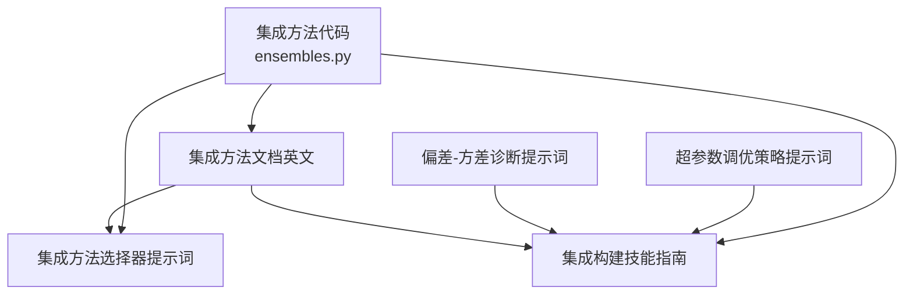
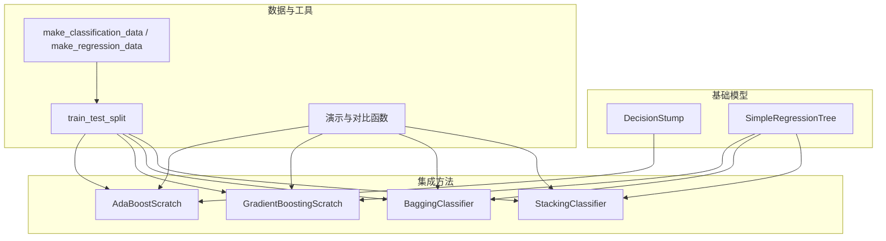
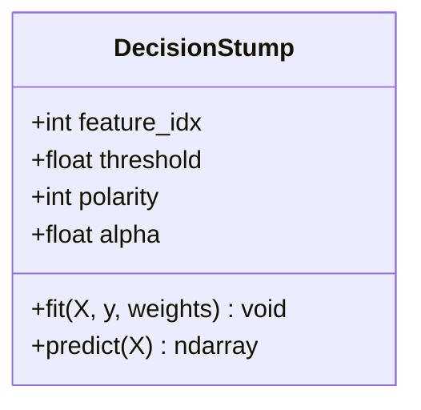
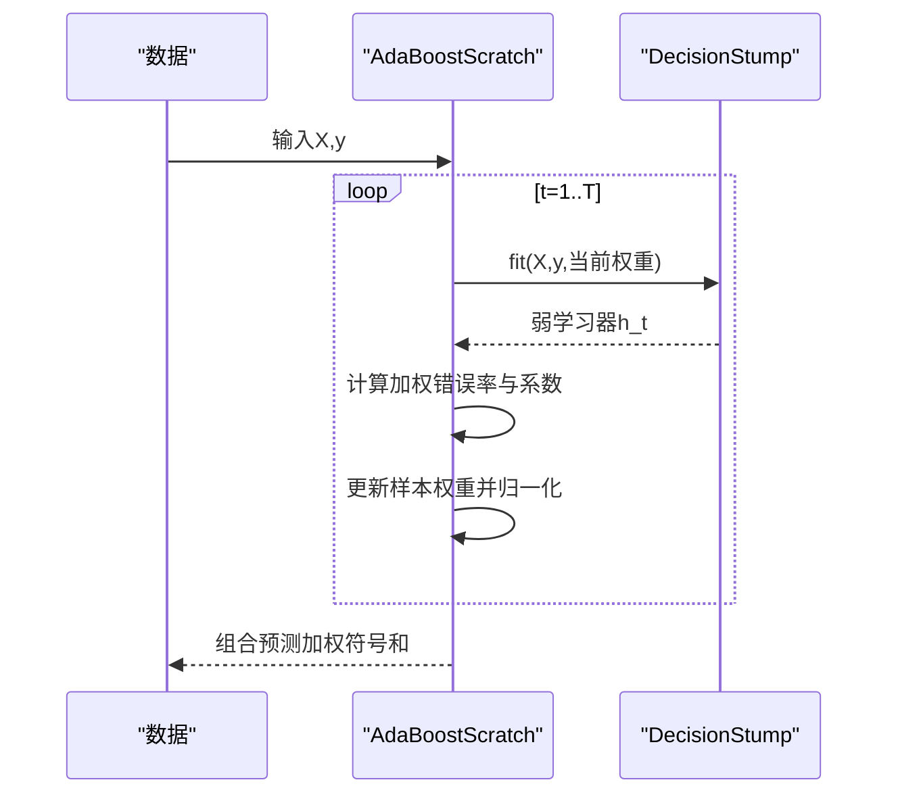
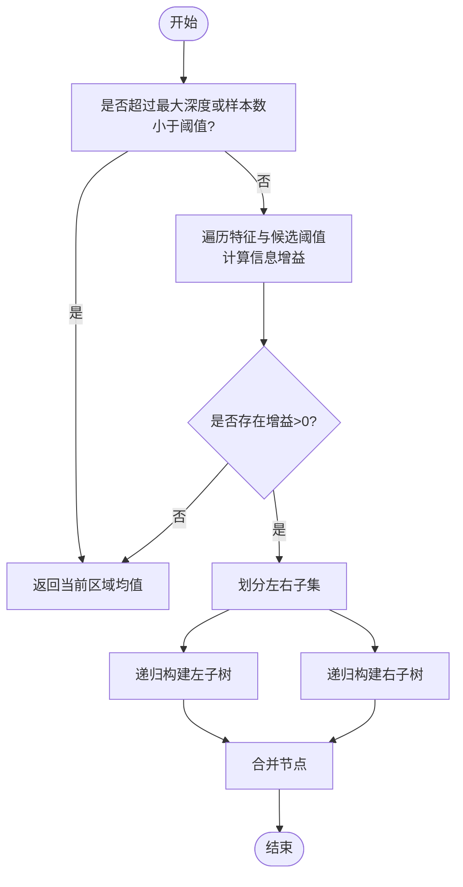
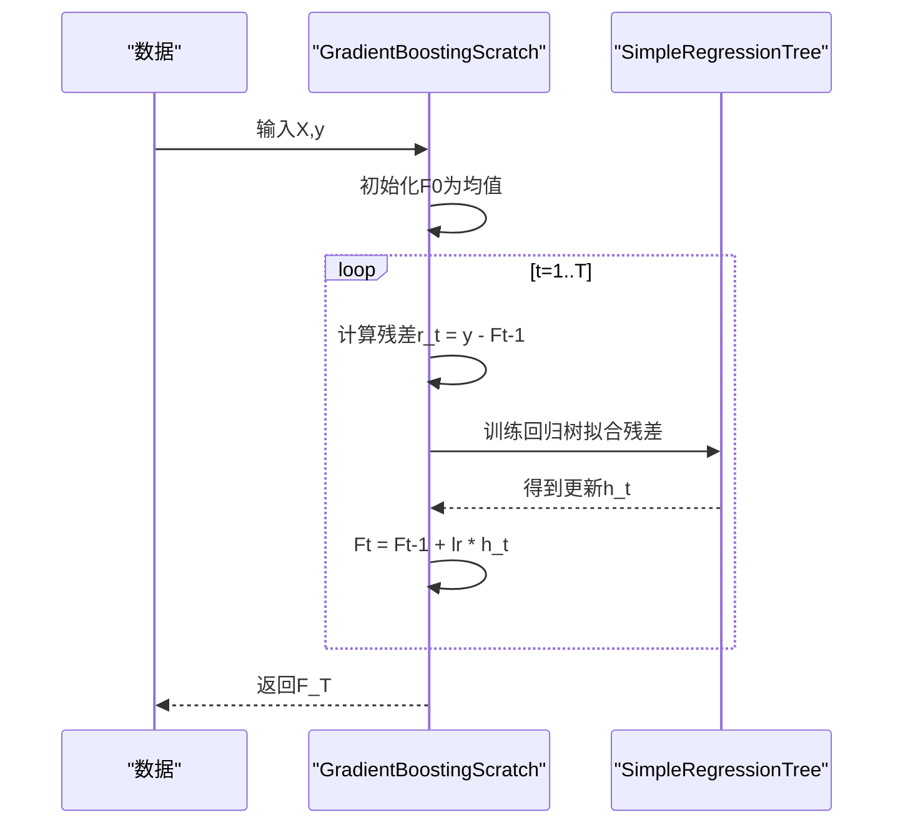
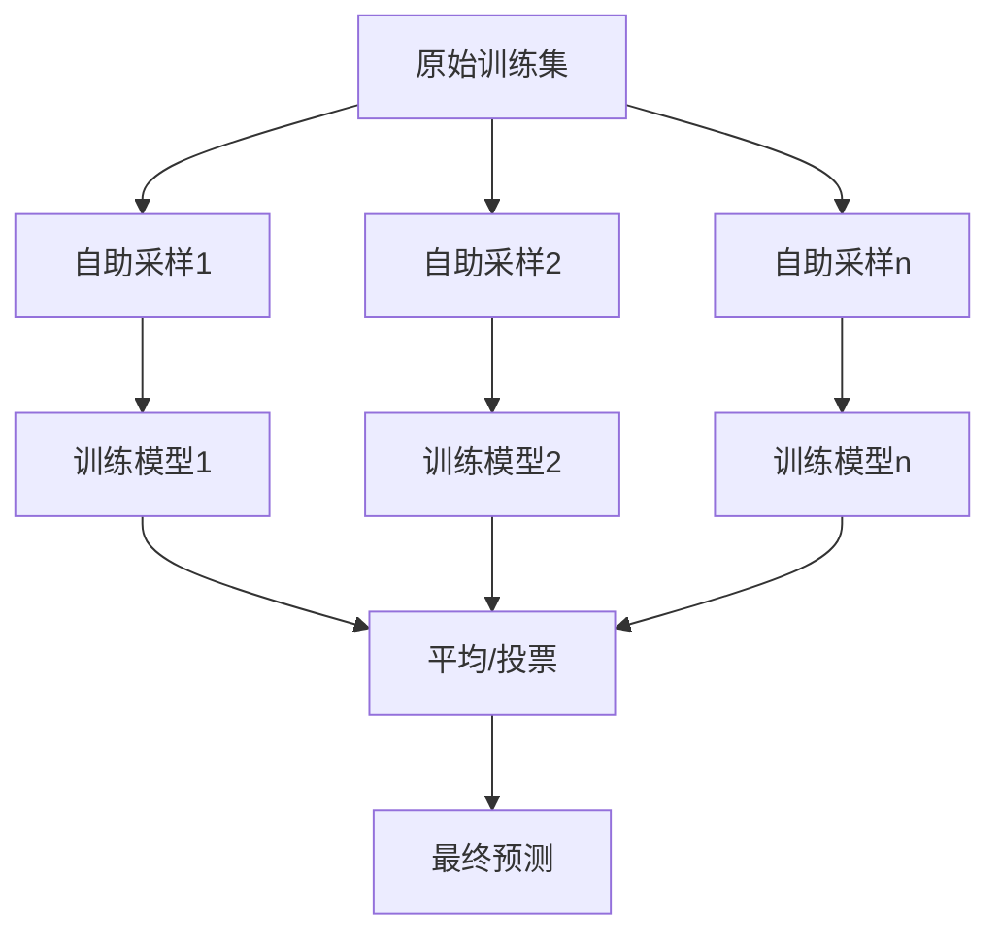
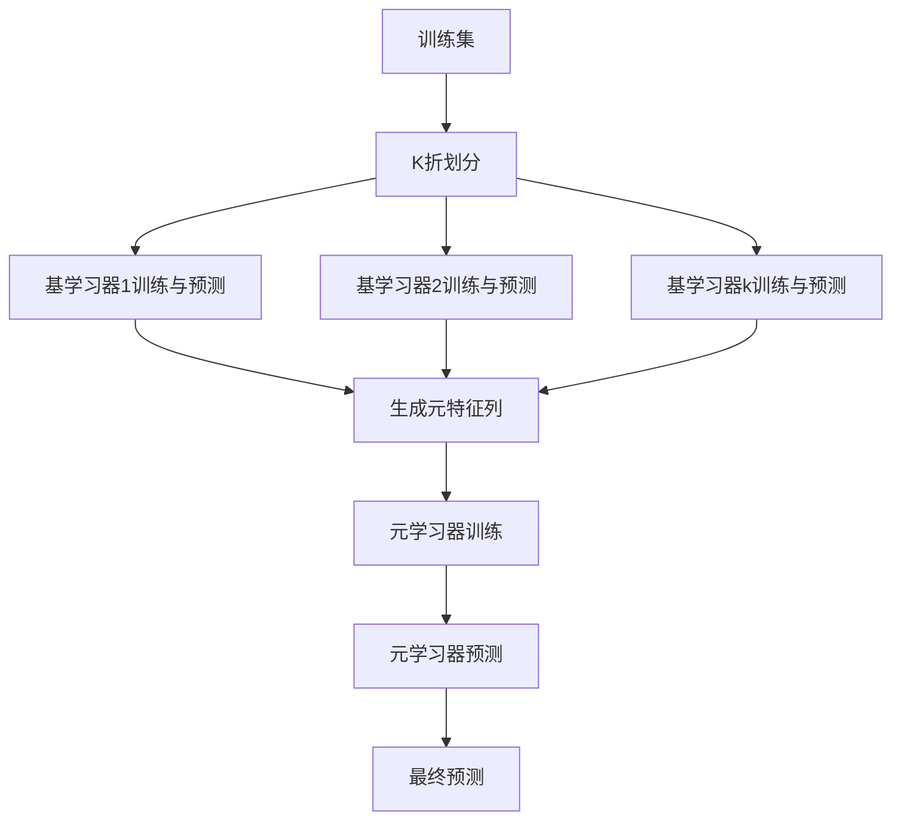
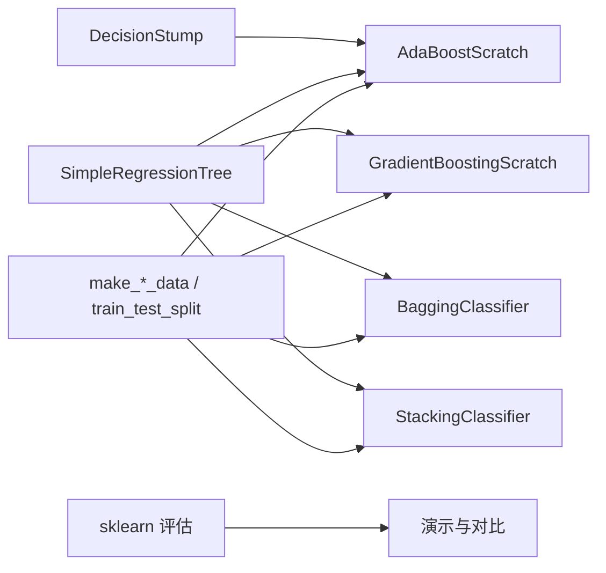

# 集成学习方法

<cite>
**本文引用的文件**
- [ensembles.py](file://phases/02-ml-fundamentals/11-ensemble-methods/code/ensembles.py)
- [集成方法文档（英文）](file://phases/02-ml-fundamentals/11-ensemble-methods/docs/en.md)
- [集成方法选择器提示词](file://phases/02-ml-fundamentals/11-ensemble-methods/outputs/prompt-ensemble-selector.md)
- [集成构建技能指南](file://phases/02-ml-fundamentals/11-ensemble-methods/outputs/skill-ensemble-builder.md)
- [超参数调优策略提示词](file://phases/02-ml-fundamentals/12-hyperparameter-tuning/outputs/prompt-tuning-strategy.md)
- [偏差-方差诊断提示词](file://phases/02-ml-fundamentals/10-bias-variance/outputs/prompt-model-diagnostics.md)
</cite>

## 目录
1. [引言](#引言)
2. [项目结构](#项目结构)
3. [核心组件](#核心组件)
4. [架构总览](#架构总览)
5. [详细组件分析](#详细组件分析)
6. [依赖关系分析](#依赖关系分析)
7. [性能考量](#性能考量)
8. [故障排查指南](#故障排查指南)
9. [结论](#结论)
10. [附录](#附录)

## 引言
本文件系统化梳理集成学习方法，围绕 Bagging、Boosting、Stacking 等技术，结合从零实现的 AdaBoost、梯度提升树、随机森林思想与投票策略，并对 XGBoost 等工业级实现进行方法论与实践层面的对比说明。文档同时给出参数调优与性能优化建议、常见陷阱与实战流程，帮助读者在真实任务中快速做出正确决策。

## 项目结构
本仓库中与集成学习直接相关的内容集中在“机器学习基础”阶段的第 11 课“集成方法”，配套有：
- 代码实现：从零实现的决策桩、AdaBoost、梯度提升树、Bagging 分类器、Stacking 分类器与演示脚本
- 文档：英文版集成方法教程，涵盖概念、公式、流程图与实现要点
- 输出产物：集成方法选择器提示词与集成构建技能指南，用于辅助选型与配置
- 超参数调优：面向不同模型类型的策略提示词，指导搜索空间与实验流程
- 偏差-方差诊断：用于定位高偏差或高方差问题，指导后续集成策略选择

图表来源
- [ensembles.py:1-503](file://phases/02-ml-fundamentals/11-ensemble-methods/code/ensembles.py#L1-L503)
- [集成方法文档（英文）:1-352](file://phases/02-ml-fundamentals/11-ensemble-methods/docs/en.md#L1-L352)
- [集成方法选择器提示词:1-88](file://phases/02-ml-fundamentals/11-ensemble-methods/outputs/prompt-ensemble-selector.md#L1-L88)
- [集成构建技能指南:1-95](file://phases/02-ml-fundamentals/11-ensemble-methods/outputs/skill-ensemble-builder.md#L1-L95)
- [超参数调优策略提示词:1-127](file://phases/02-ml-fundamentals/12-hyperparameter-tuning/outputs/prompt-tuning-strategy.md#L1-L127)
- [偏差-方差诊断提示词:1-108](file://phases/02-ml-fundamentals/10-bias-variance/outputs/prompt-model-diagnostics.md#L1-L108)

章节来源
- [ensembles.py:1-503](file://phases/02-ml-fundamentals/11-ensemble-methods/code/ensembles.py#L1-L503)
- [集成方法文档（英文）:1-352](file://phases/02-ml-fundamentals/11-ensemble-methods/docs/en.md#L1-L352)

## 核心组件
本节聚焦于从零实现的核心组件及其职责：
- 决策桩（DecisionStump）：深度为 1 的简单二叉树，作为弱学习器
- AdaBoostScratch：基于样本权重更新的序列加法模型，组合多个弱学习器
- SimpleRegressionTree：带剪枝与特征采样的回归树，用于梯度提升的基础模型
- GradientBoostingScratch：以残差为目标的序列拟合过程
- BaggingClassifier：通过自助采样训练多棵决策树并平均预测
- StackingClassifier：使用交叉验证生成元特征，再用元学习器融合
- 演示函数：对比不同方法在分类与回归上的表现，并与 sklearn 进行对照

章节来源
- [ensembles.py:27-57](file://phases/02-ml-fundamentals/11-ensemble-methods/code/ensembles.py#L27-L57)
- [ensembles.py:59-91](file://phases/02-ml-fundamentals/11-ensemble-methods/code/ensembles.py#L59-L91)
- [ensembles.py:102-164](file://phases/02-ml-fundamentals/11-ensemble-methods/code/ensembles.py#L102-L164)
- [ensembles.py:166-194](file://phases/02-ml-fundamentals/11-ensemble-methods/code/ensembles.py#L166-L194)
- [ensembles.py:196-218](file://phases/02-ml-fundamentals/11-ensemble-methods/code/ensembles.py#L196-L218)
- [ensembles.py:220-272](file://phases/02-ml-fundamentals/11-ensemble-methods/code/ensembles.py#L220-L272)
- [ensembles.py:274-503](file://phases/02-ml-fundamentals/11-ensemble-methods/code/ensembles.py#L274-L503)

## 架构总览
下图展示从零实现的集成学习模块之间的关系与数据流：

图表来源
- [ensembles.py:5-25](file://phases/02-ml-fundamentals/11-ensemble-methods/code/ensembles.py#L5-L25)
- [ensembles.py:27-57](file://phases/02-ml-fundamentals/11-ensemble-methods/code/ensembles.py#L27-L57)
- [ensembles.py:102-164](file://phases/02-ml-fundamentals/11-ensemble-methods/code/ensembles.py#L102-L164)
- [ensembles.py:59-91](file://phases/02-ml-fundamentals/11-ensemble-methods/code/ensembles.py#L59-L91)
- [ensembles.py:166-194](file://phases/02-ml-fundamentals/11-ensemble-methods/code/ensembles.py#L166-L194)
- [ensembles.py:196-218](file://phases/02-ml-fundamentals/11-ensemble-methods/code/ensembles.py#L196-L218)
- [ensembles.py:220-272](file://phases/02-ml-fundamentals/11-ensemble-methods/code/ensembles.py#L220-L272)
- [ensembles.py:274-503](file://phases/02-ml-fundamentals/11-ensemble-methods/code/ensembles.py#L274-L503)

## 详细组件分析

### 决策桩（DecisionStump）
- 作用：作为最简单的弱学习器，按某一特征与阈值做一次分割
- 关键点：遍历每个特征的所有唯一阈值，尝试正负极性，最小化加权错误率；支持带权重的样本输入
- 复杂度：对每个样本与特征检查阈值，整体复杂度与特征数量、唯一阈值数量相关

图表来源
- [ensembles.py:27-57](file://phases/02-ml-fundamentals/11-ensemble-methods/code/ensembles.py#L27-L57)

章节来源
- [ensembles.py:27-57](file://phases/02-ml-fundamentals/11-ensemble-methods/code/ensembles.py#L27-L57)

### AdaBoost 从零实现（AdaBoostScratch）
- 思想：迭代训练弱学习器，依据当前模型的加权错误率分配样本权重，逐步纠正错误
- 流程要点：初始化权重 → 训练弱学习器 → 计算系数 → 更新权重并归一化 → 加权多数投票
- 适用场景：弱学习器稳定、数据相对干净；对噪声敏感，易放大异常点

图表来源
- [ensembles.py:59-91](file://phases/02-ml-fundamentals/11-ensemble-methods/code/ensembles.py#L59-L91)

章节来源
- [ensembles.py:59-91](file://phases/02-ml-fundamentals/11-ensemble-methods/code/ensembles.py#L59-L91)
- [集成方法文档（英文）:92-115](file://phases/02-ml-fundamentals/11-ensemble-methods/docs/en.md#L92-L115)

### 回归树（SimpleRegressionTree）
- 作用：递归地在最佳特征与阈值上做二分切割，以降低方差；支持最大深度与最小分裂样本数控制过拟合
- 特性：当节点样本数不足或达到最大深度时，返回该区域内均值；对连续特征采用分位数采样以加速

图表来源
- [ensembles.py:102-164](file://phases/02-ml-fundamentals/11-ensemble-methods/code/ensembles.py#L102-L164)

章节来源
- [ensembles.py:102-164](file://phases/02-ml-fundamentals/11-ensemble-methods/code/ensembles.py#L102-L164)

### 梯度提升（GradientBoostingScratch）
- 思想：以损失函数的负梯度为残差，逐轮拟合一棵回归树，累加得到最终预测
- 学习率（收缩）：控制每棵树的贡献幅度，较小学习率通常泛化更好但需要更多树
- 实现要点：初始化为常数预测（如均值），每轮拟合残差并累加

图表来源
- [ensembles.py:166-194](file://phases/02-ml-fundamentals/11-ensemble-methods/code/ensembles.py#L166-L194)

章节来源
- [ensembles.py:166-194](file://phases/02-ml-fundamentals/11-ensemble-methods/code/ensembles.py#L166-L194)
- [集成方法文档（英文）:116-138](file://phases/02-ml-fundamentals/11-ensemble-methods/docs/en.md#L116-L138)

### 随机森林思想（BaggingClassifier）
- 思想：对训练集进行自助采样（有放回），分别训练多个模型，最后对预测结果进行平均（回归）或多数投票（分类）
- 方差减少：不同树对噪声的过拟合方向不同，平均后相互抵消
- 可扩展：可引入特征子集随机采样（随机森林的关键额外多样性）

图表来源
- [ensembles.py:196-218](file://phases/02-ml-fundamentals/11-ensemble-methods/code/ensembles.py#L196-L218)

章节来源
- [ensembles.py:196-218](file://phases/02-ml-fundamentals/11-ensemble-methods/code/ensembles.py#L196-L218)
- [集成方法文档（英文）:42-71](file://phases/02-ml-fundamentals/11-ensemble-methods/docs/en.md#L42-L71)

### Stacking（StackingClassifier）
- 思想：先用 K 折交叉验证生成各基学习器的“元特征”，再用一个元学习器（如逻辑回归）对这些特征进行建模
- 关键点：避免数据泄露，元特征必须来自交叉验证；元学习器权重通过梯度下降优化

图表来源
- [ensembles.py:220-272](file://phases/02-ml-fundamentals/11-ensemble-methods/code/ensembles.py#L220-L272)

章节来源
- [ensembles.py:220-272](file://phases/02-ml-fundamentals/11-ensemble-methods/code/ensembles.py#L220-L272)
- [集成方法文档（英文）:152-176](file://phases/02-ml-fundamentals/11-ensemble-methods/docs/en.md#L152-L176)

### 演示与对比（demo_* 函数）
- AdaBoost 与单棵决策桩对比：展示随着弱学习器数量增加，准确率提升与误差下降
- 梯度提升：展示不同学习率与树数量对测试误差的影响，强调学习率与树数量的权衡
- Bagging：对比单树与 Bagging 在准确率与方差上的差异
- Stacking：对比多个深度不同的树与 Stacking 的准确率，展示元权重
- 全面对比：在同一数据集上比较单树、Bagging、AdaBoost 的表现
- 与 sklearn 对比：验证从零实现与工业库的一致性

章节来源
- [ensembles.py:274-503](file://phases/02-ml-fundamentals/11-ensemble-methods/code/ensembles.py#L274-L503)

## 依赖关系分析
- 内部依赖
  - DecisionStump 与 SimpleRegressionTree 是 AdaBoost 与梯度提升的基础弱学习器
  - BaggingClassifier 与 StackingClassifier 依赖 SimpleRegressionTree 作为基学习器
  - 演示函数统一使用 make_classification_data/make_regression_data 与 train_test_split 生成数据
- 外部依赖
  - 与 sklearn 的对比依赖 sklearn.ensemble 中的 AdaBoostClassifier、GradientBoostingClassifier、RandomForestClassifier

图表来源
- [ensembles.py:5-25](file://phases/02-ml-fundamentals/11-ensemble-methods/code/ensembles.py#L5-L25)
- [ensembles.py:27-57](file://phases/02-ml-fundamentals/11-ensemble-methods/code/ensembles.py#L27-L57)
- [ensembles.py:102-164](file://phases/02-ml-fundamentals/11-ensemble-methods/code/ensembles.py#L102-L164)
- [ensembles.py:59-91](file://phases/02-ml-fundamentals/11-ensemble-methods/code/ensembles.py#L59-L91)
- [ensembles.py:166-194](file://phases/02-ml-fundamentals/11-ensemble-methods/code/ensembles.py#L166-L194)
- [ensembles.py:196-218](file://phases/02-ml-fundamentals/11-ensemble-methods/code/ensembles.py#L196-L218)
- [ensembles.py:220-272](file://phases/02-ml-fundamentals/11-ensemble-methods/code/ensembles.py#L220-L272)
- [ensembles.py:458-492](file://phases/02-ml-fundamentals/11-ensemble-methods/code/ensembles.py#L458-L492)

章节来源
- [ensembles.py:458-492](file://phases/02-ml-fundamentals/11-ensemble-methods/code/ensembles.py#L458-L492)

## 性能考量
- 计算复杂度
  - 决策桩：对每个特征的唯一阈值进行遍历，复杂度与特征数与阈值分布有关
  - 回归树：递归分割，剪枝参数控制深度与样本数，避免过拟合
  - AdaBoost：迭代 T 次，每次训练弱学习器；T 越大，预测越稳定但耗时越高
  - 梯度提升：每轮拟合残差，学习率越小需更多树；可通过早停减少无效迭代
  - Bagging：训练 n_estimator 棵树，预测时需聚合所有树的结果
  - Stacking：K 折交叉生成元特征，元学习器训练与预测带来额外开销
- 泛化能力
  - Bagging 通过自助采样与平均显著降低方差，适合噪声较多的数据
  - Boosting 通过序列拟合残差降低偏差，但易受噪声影响，需早停与合理学习率
  - Stacking 通过元学习器自适应组合，追求更高精度，但需注意过拟合与数据泄露
- 工业实践
  - XGBoost/LightGBM 在表格数据上通常优于神经网络，具备正则化、稀疏感知与高效实现
  - 调参优先级：学习率 > 最大树深 > 子样本比例 > 正则项

章节来源
- [集成方法文档（英文）:139-151](file://phases/02-ml-fundamentals/11-ensemble-methods/docs/en.md#L139-L151)
- [集成构建技能指南:67-82](file://phases/02-ml-fundamentals/11-ensemble-methods/outputs/skill-ensemble-builder.md#L67-L82)
- [超参数调优策略提示词:48-90](file://phases/02-ml-fundamentals/12-hyperparameter-tuning/outputs/prompt-tuning-strategy.md#L48-L90)

## 故障排查指南
- 何时使用哪种方法
  - 高方差（过拟合）：优先 Bagging（随机森林）
  - 高偏差（欠拟合）：优先 Boosting（梯度提升/XGBoost）
  - 需极致精度且有足够算力：Stacking
- 常见误区
  - 梯度提升不早停会过拟合；学习率过高不稳定
  - 随机森林无法解决欠拟合（仅降方差）
  - Stacking 使用同质模型无多样性收益
  - AdaBoost 在噪声数据上会被异常点放大
- 诊断与修复
  - 使用偏差-方差诊断提示词判断问题来源，再决定是否引入集成方法
  - 若为高方差，考虑 Bagging 或随机森林；若为高偏差，考虑提升树或调参

章节来源
- [集成构建技能指南:58-66](file://phases/02-ml-fundamentals/11-ensemble-methods/outputs/skill-ensemble-builder.md#L58-L66)
- [偏差-方差诊断提示词:20-49](file://phases/02-ml-fundamentals/10-bias-variance/outputs/prompt-model-diagnostics.md#L20-L49)

## 结论
- Bagging 通过自助采样与平均显著降低方差，适合噪声数据与快速基线
- Boosting 通过序列拟合残差降低偏差，适合干净数据与追求精度，但需谨慎调参
- Stacking 通过元学习器自适应组合，追求极致精度，需注意多样性与过拟合
- 在工业实践中，XGBoost/LightGBM 通常为表格数据首选，配合合理的超参数搜索策略与早停机制

## 附录
- 选型助手与配置参考
  - 集成方法选择器提示词：根据数据规模、特征类型、噪声水平与类别平衡给出主备方案与起始超参
  - 集成构建技能指南：提供方法适用场景、常见错误、调参优先级与快速参考表
- 超参数调优策略
  - 针对随机森林、XGBoost/LightGBM 等模型，给出搜索策略（网格/随机/贝叶斯/Hyperband）、搜索空间与试验次数建议
- 实战流程
  - 从默认配置开始，粗调后细调，结合交叉验证与早停，最终在独立测试集上评估

章节来源
- [集成方法选择器提示词:12-88](file://phases/02-ml-fundamentals/11-ensemble-methods/outputs/prompt-ensemble-selector.md#L12-L88)
- [集成构建技能指南:14-95](file://phases/02-ml-fundamentals/11-ensemble-methods/outputs/skill-ensemble-builder.md#L14-L95)
- [超参数调优策略提示词:21-127](file://phases/02-ml-fundamentals/12-hyperparameter-tuning/outputs/prompt-tuning-strategy.md#L21-L127)