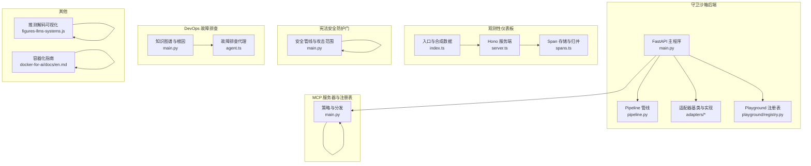
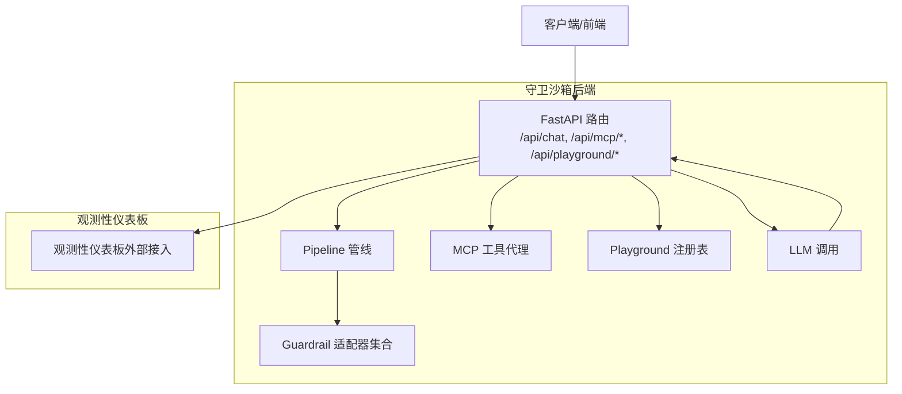
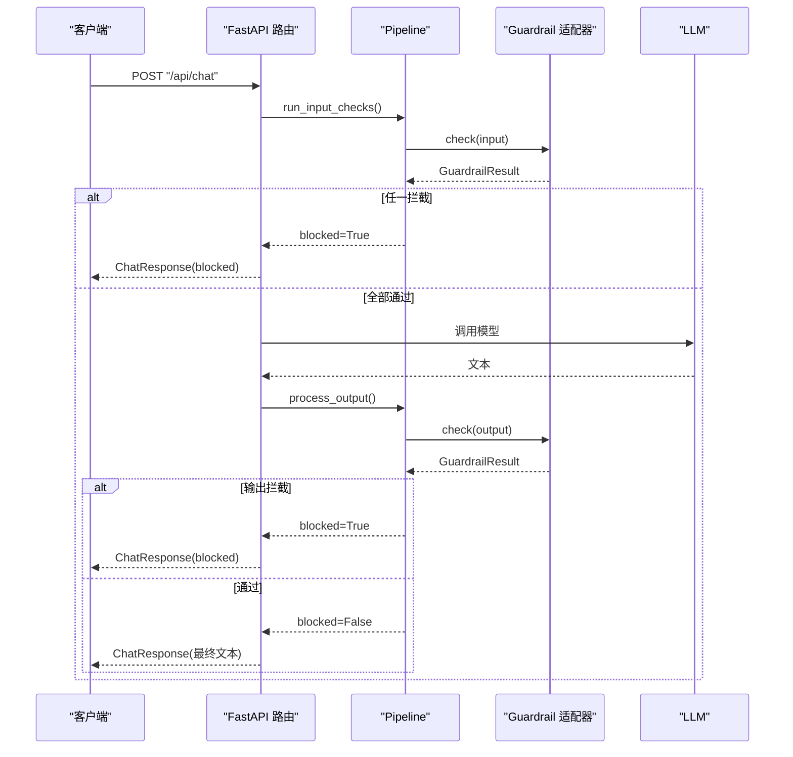
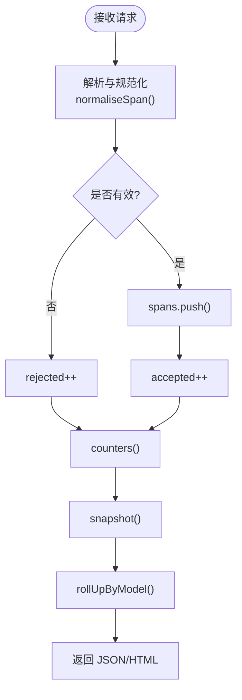
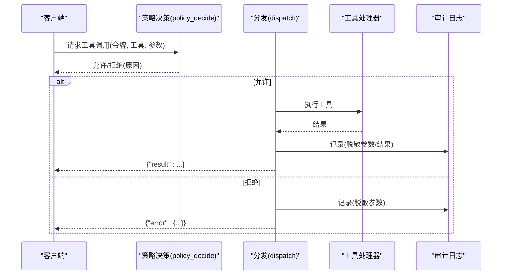
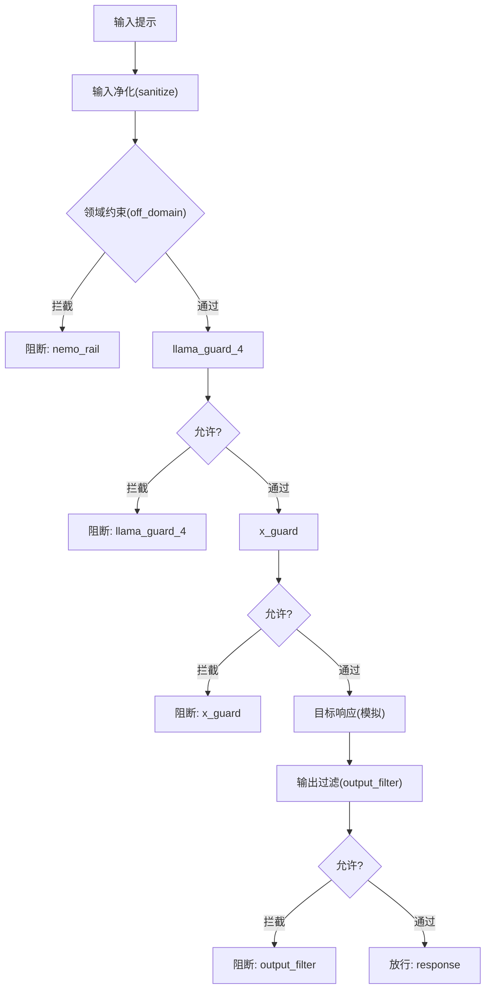
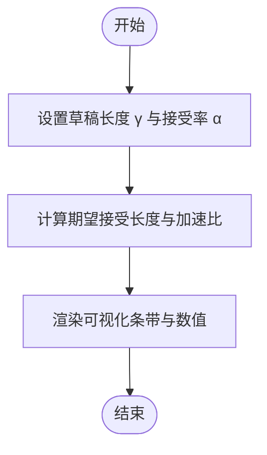
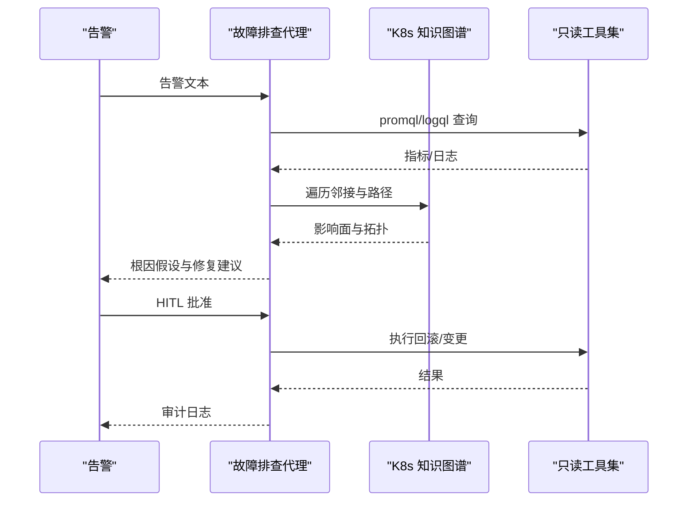
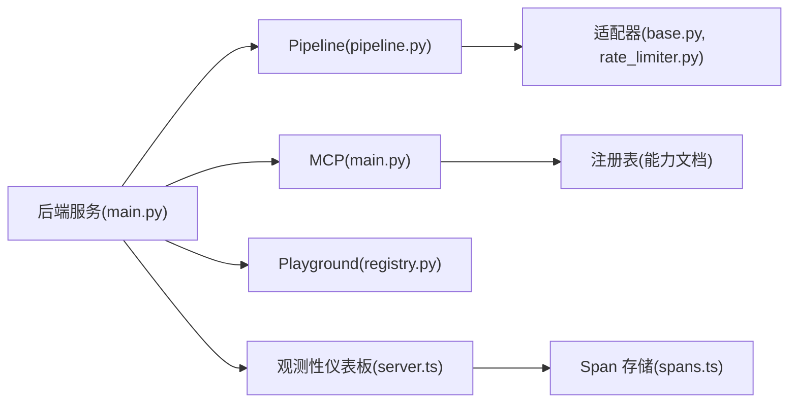

# 基础设施项目

<cite>
**本文引用的文件**
- [guardrails-sandbox/backend/main.py](file://guardrails-sandbox/backend/main.py)
- [guardrails-sandbox/backend/pipeline.py](file://guardrails-sandbox/backend/pipeline.py)
- [guardrails-sandbox/backend/adapters/base.py](file://guardrails-sandbox/backend/adapters/base.py)
- [guardrails-sandbox/backend/adapters/rate_limiter.py](file://guardrails-sandbox/backend/adapters/rate_limiter.py)
- [guardrails-sandbox/backend/playground/registry.py](file://guardrails-sandbox/backend/playground/registry.py)
- [guardrails-sandbox/backend/playground/modules/tool_use.py](file://guardrails-sandbox/backend/playground/modules/tool_use.py)
- [phases/19-capstone-projects/11-llm-observability-dashboard/code/ts/src/server.ts](file://phases/19-capstone-projects/11-llm-observability-dashboard/code/ts/src/server.ts)
- [phases/19-capstone-projects/11-llm-observability-dashboard/code/ts/src/spans.ts](file://phases/19-capstone-projects/11-llm-observability-dashboard/code/ts/src/spans.ts)
- [phases/19-capstone-projects/11-llm-observability-dashboard/code/ts/src/index.ts](file://phases/19-capstone-projects/11-llm-observability-dashboard/code/ts/src/index.ts)
- [phases/19-capstone-projects/13-mcp-server-with-registry/code/main.py](file://phases/19-capstone-projects/13-mcp-server-with-registry/code/main.py)
- [phases/19-capstone-projects/15-constitutional-safety-harness/code/main.py](file://phases/19-capstone-projects/15-constitutional-safety-harness/code/main.py)
- [phases/00-setup-and-tooling/07-docker-for-ai/docs/en.md](file://phases/00-setup-and-tooling/07-docker-for-ai/docs/en.md)
- [phases/19-capstone-projects/06-devops-troubleshooting-agent/code/main.py](file://phases/19-capstone-projects/06-devops-troubleshooting-agent/code/main.py)
- [phases/19-capstone-projects/06-devops-troubleshooting-agent/code/ts/src/agent.ts](file://phases/19-capstone-projects/06-devops-troubleshooting-agent/code/ts/src/agent.ts)
- [site/figures-llms-systems.js](file://site/figures-llms-systems.js)
</cite>

## 目录
1. [引言](#引言)
2. [项目结构](#项目结构)
3. [核心组件](#核心组件)
4. [架构总览](#架构总览)
5. [详细组件分析](#详细组件分析)
6. [依赖分析](#依赖分析)
7. [性能考虑](#性能考虑)
8. [故障排查指南](#故障排查指南)
9. [结论](#结论)
10. [附录](#附录)

## 引言
本项目围绕生产级基础设施展开，聚焦四大核心能力：
- LLM 可观测性仪表板：采集、归并、统计与可视化 GenAI 调用链与性能指标，支持健康检查与实时面板。
- MCP 服务器与注册表：实现工具能力发现、OAuth 风格作用域授权、审计日志与策略决策，支撑多服务器协作与安全治理。
- 推测解码服务：以可视化与公式推导展示推测解码的加速原理，为推理优化提供直观参考。
- 宪法安全防护门：构建分层安全管线，覆盖输入净化、领域约束、多分类器检测与输出过滤，并提供红队攻击范围评估。

同时，文档覆盖可观测性指标定义、日志收集、性能分析、告警机制；服务治理包括 MCP 协议实现、工具注册、访问控制与安全认证；并提供推理优化、缓存策略、负载均衡等性能优化实践，以及容器化部署、自动化运维与灾难恢复等运维保障措施。

## 项目结构
项目采用“课程实验台 + 能力骨架”的组织方式，核心模块分布如下：
- 守卫沙箱后端：FastAPI 服务，集成 Guardrails 管线、MCP 工具代理、Playground 模块注册表与检查点数据库查看器。
- 观测性仪表板：TypeScript Hono 服务，接收 OpenTelemetry GenAI Span，滚动缓冲存储，聚合统计与仪表盘渲染。
- MCP 服务器与注册表：Python 骨架实现工具能力文档、策略决策与审计日志，配合 TypeScript 传输示例。
- 宪法安全防护门：五层安全管线与红队攻击范围，演示阻断与评分流程。
- 推测解码：站点脚本可视化展示，帮助理解推测解码的期望接受长度与加速比。
- DevOps 故障排查代理：Kubernetes 知识图谱与人工在环审批门，提供根因分析与审计日志。
- Docker for AI：容器化概念与最佳实践，支撑多服务编排与 GPU 驱动隔离。

**图表来源**
- [guardrails-sandbox/backend/main.py:1-421](file://guardrails-sandbox/backend/main.py#L1-L421)
- [guardrails-sandbox/backend/pipeline.py:1-285](file://guardrails-sandbox/backend/pipeline.py#L1-L285)
- [guardrails-sandbox/backend/adapters/base.py:1-34](file://guardrails-sandbox/backend/adapters/base.py#L1-L34)
- [phases/19-capstone-projects/11-llm-observability-dashboard/code/ts/src/server.ts:1-73](file://phases/19-capstone-projects/11-llm-observability-dashboard/code/ts/src/server.ts#L1-L73)
- [phases/19-capstone-projects/11-llm-observability-dashboard/code/ts/src/spans.ts:1-136](file://phases/19-capstone-projects/11-llm-observability-dashboard/code/ts/src/spans.ts#L1-L136)
- [phases/19-capstone-projects/13-mcp-server-with-registry/code/main.py:1-238](file://phases/19-capstone-projects/13-mcp-server-with-registry/code/main.py#L1-L238)
- [phases/19-capstone-projects/15-constitutional-safety-harness/code/main.py:1-293](file://phases/19-capstone-projects/15-constitutional-safety-harness/code/main.py#L1-L293)
- [phases/19-capstone-projects/06-devops-troubleshooting-agent/code/main.py:1-229](file://phases/19-capstone-projects/06-devops-troubleshooting-agent/code/main.py#L1-L229)
- [phases/19-capstone-projects/06-devops-troubleshooting-agent/code/ts/src/agent.ts:1-59](file://phases/19-capstone-projects/06-devops-troubleshooting-agent/code/ts/src/agent.ts#L1-L59)
- [site/figures-llms-systems.js:73-116](file://site/figures-llms-systems.js#L73-L116)
- [phases/00-setup-and-tooling/07-docker-for-ai/docs/en.md:23-96](file://phases/00-setup-and-tooling/07-docker-for-ai/docs/en.md#L23-L96)

**章节来源**
- [guardrails-sandbox/backend/main.py:1-421](file://guardrails-sandbox/backend/main.py#L1-L421)
- [guardrails-sandbox/backend/pipeline.py:1-285](file://guardrails-sandbox/backend/pipeline.py#L1-L285)
- [phases/19-capstone-projects/11-llm-observability-dashboard/code/ts/src/server.ts:1-73](file://phases/19-capstone-projects/11-llm-observability-dashboard/code/ts/src/server.ts#L1-L73)
- [phases/19-capstone-projects/13-mcp-server-with-registry/code/main.py:1-238](file://phases/19-capstone-projects/13-mcp-server-with-registry/code/main.py#L1-L238)
- [phases/19-capstone-projects/15-constitutional-safety-harness/code/main.py:1-293](file://phases/19-capstone-projects/15-constitutional-safety-harness/code/main.py#L1-L293)
- [phases/19-capstone-projects/06-devops-troubleshooting-agent/code/main.py:1-229](file://phases/19-capstone-projects/06-devops-troubleshooting-agent/code/main.py#L1-L229)
- [site/figures-llms-systems.js:73-116](file://site/figures-llms-systems.js#L73-L116)
- [phases/00-setup-and-tooling/07-docker-for-ai/docs/en.md:23-96](file://phases/00-setup-and-tooling/07-docker-for-ai/docs/en.md#L23-L96)

## 核心组件
- 守卫沙箱后端（FastAPI）：提供聊天接口、对比模式、基准测试、MCP 工具调用桥接与 Playground 模块运行。
- Pipeline 管线：统一编排 Guardrail 适配器，按分组与顺序执行，支持启用/禁用、统计与拦截历史。
- 观测性仪表板（Hono + TypeScript）：接收 OTel GenAI Span，滚动缓冲存储，聚合统计与仪表盘渲染。
- MCP 服务器与注册表：工具能力文档、OAuth 风格作用域策略、审计日志与分发。
- 宪法安全防护门：五层安全管线与红队攻击范围，支持阻断与评分。
- 推测解码可视化：以动画与公式展示推测解码的加速原理。
- DevOps 故障排查代理：Kubernetes 知识图谱与人工在环审批门。
- Docker for AI：容器化概念与多服务编排实践。

**章节来源**
- [guardrails-sandbox/backend/main.py:121-281](file://guardrails-sandbox/backend/main.py#L121-L281)
- [guardrails-sandbox/backend/pipeline.py:12-161](file://guardrails-sandbox/backend/pipeline.py#L12-L161)
- [phases/19-capstone-projects/11-llm-observability-dashboard/code/ts/src/server.ts:14-42](file://phases/19-capstone-projects/11-llm-observability-dashboard/code/ts/src/server.ts#L14-L42)
- [phases/19-capstone-projects/13-mcp-server-with-registry/code/main.py:37-144](file://phases/19-capstone-projects/13-mcp-server-with-registry/code/main.py#L37-L144)
- [phases/19-capstone-projects/15-constitutional-safety-harness/code/main.py:95-125](file://phases/19-capstone-projects/15-constitutional-safety-harness/code/main.py#L95-L125)
- [phases/19-capstone-projects/06-devops-troubleshooting-agent/code/main.py:24-142](file://phases/19-capstone-projects/06-devops-troubleshooting-agent/code/main.py#L24-L142)
- [phases/00-setup-and-tooling/07-docker-for-ai/docs/en.md:23-96](file://phases/00-setup-and-tooling/07-docker-for-ai/docs/en.md#L23-L96)

## 架构总览
下图展示了守卫沙箱后端如何串联 Guardrails 管线、MCP 工具代理与 Playground 模块，并与观测性仪表板形成闭环的数据流。

**图表来源**
- [guardrails-sandbox/backend/main.py:155-221](file://guardrails-sandbox/backend/main.py#L155-L221)
- [guardrails-sandbox/backend/pipeline.py:31-127](file://guardrails-sandbox/backend/pipeline.py#L31-L127)
- [phases/19-capstone-projects/11-llm-observability-dashboard/code/ts/src/server.ts:17-39](file://phases/19-capstone-projects/11-llm-observability-dashboard/code/ts/src/server.ts#L17-L39)

**章节来源**
- [guardrails-sandbox/backend/main.py:155-221](file://guardrails-sandbox/backend/main.py#L155-L221)
- [guardrails-sandbox/backend/pipeline.py:31-127](file://guardrails-sandbox/backend/pipeline.py#L31-L127)

## 详细组件分析

### 守卫沙箱后端与 Pipeline 管线
- 组件职责
  - FastAPI 提供聊天接口、对比模式、基准测试、MCP 工具调用桥接与 Playground 模块运行。
  - Pipeline 将注册的 Guardrail 适配器按分组与顺序执行，遇到拦截即短路，记录统计与拦截历史。
- 关键流程
  - 输入检查：逐层执行 input 适配器，任一拦截即返回阻断信息与日志。
  - LLM 调用：在异常情况下返回错误阻断。
  - 输出检查：对 LLM 输出执行 output 适配器，支持脱敏与最终文本替换。
  - 对比模式：同时运行无 Guardrails 与有 Guardrails 的路径，便于效果对比。
- 性能与可观测性
  - 记录总耗时与 LLM 耗时，便于端到端性能分析。
  - 支持启用/禁用单个适配器，便于灰度与调试。
  - 提供拦截历史与统计，辅助告警与容量规划。

**图表来源**
- [guardrails-sandbox/backend/main.py:155-221](file://guardrails-sandbox/backend/main.py#L155-L221)
- [guardrails-sandbox/backend/pipeline.py:31-161](file://guardrails-sandbox/backend/pipeline.py#L31-L161)
- [guardrails-sandbox/backend/adapters/base.py:5-34](file://guardrails-sandbox/backend/adapters/base.py#L5-L34)

**章节来源**
- [guardrails-sandbox/backend/main.py:155-221](file://guardrails-sandbox/backend/main.py#L155-L221)
- [guardrails-sandbox/backend/pipeline.py:31-161](file://guardrails-sandbox/backend/pipeline.py#L31-L161)
- [guardrails-sandbox/backend/adapters/rate_limiter.py:22-56](file://guardrails-sandbox/backend/adapters/rate_limiter.py#L22-L56)

### 观测性仪表板（OTel GenAI）
- 组件职责
  - 接收 OTel GenAI Span，进行规范化与计数统计。
  - 使用环形缓冲存储最近 N 条 Span，支持快照与滚动聚合。
  - 提供健康检查、仪表盘 JSON 与 HTML 渲染。
- 关键指标
  - 接受/持有/拒绝计数器。
  - 按模型聚合的计数、错误、令牌用量与成本估算。
  - 分位延迟（p50/p95/p99）。
- 处理流程

**图表来源**
- [phases/19-capstone-projects/11-llm-observability-dashboard/code/ts/src/spans.ts:72-135](file://phases/19-capstone-projects/11-llm-observability-dashboard/code/ts/src/spans.ts#L72-L135)
- [phases/19-capstone-projects/11-llm-observability-dashboard/code/ts/src/server.ts:17-39](file://phases/19-capstone-projects/11-llm-observability-dashboard/code/ts/src/server.ts#L17-L39)

**章节来源**
- [phases/19-capstone-projects/11-llm-observability-dashboard/code/ts/src/spans.ts:72-135](file://phases/19-capstone-projects/11-llm-observability-dashboard/code/ts/src/spans.ts#L72-L135)
- [phases/19-capstone-projects/11-llm-observability-dashboard/code/ts/src/server.ts:14-42](file://phases/19-capstone-projects/11-llm-observability-dashboard/code/ts/src/server.ts#L14-L42)
- [phases/19-capstone-projects/11-llm-observability-dashboard/code/ts/src/index.ts:92-122](file://phases/19-capstone-projects/11-llm-observability-dashboard/code/ts/src/index.ts#L92-L122)

### MCP 服务器与注册表
- 组件职责
  - 工具注册：定义工具 schema（名称、所需作用域、破坏性标记、输入模式）。
  - 能力文档：生成 .well-known/mcp-capabilities 文档，供注册表拉取与校验。
  - 策略决策：基于 OAuth 风格作用域与破坏性工具的人工批准窗口进行授权。
  - 审计日志：结构化 JSONL，PII 脱敏，记录每次调用的参数与结果。
  - 分发：查找工具、执行处理器并返回结果或错误。
- 关键流程

**图表来源**
- [phases/19-capstone-projects/13-mcp-server-with-registry/code/main.py:85-144](file://phases/19-capstone-projects/13-mcp-server-with-registry/code/main.py#L85-L144)

**章节来源**
- [phases/19-capstone-projects/13-mcp-server-with-registry/code/main.py:25-144](file://phases/19-capstone-projects/13-mcp-server-with-registry/code/main.py#L25-L144)

### 宪法安全防护门
- 组件职责
  - 五层安全管线：输入净化、领域约束、多分类器检测、输出过滤，每层独立可观测。
  - 红队范围：六类攻击家族（PAIR/TAP/GCG/编码/多语言/多轮），评分基于 CVSS。
  - 误拒测量：在银行领域良性提示上测量误拒率。
- 关键流程

**图表来源**
- [phases/19-capstone-projects/15-constitutional-safety-harness/code/main.py:99-124](file://phases/19-capstone-projects/15-constitutional-safety-harness/code/main.py#L99-L124)

**章节来源**
- [phases/19-capstone-projects/15-constitutional-safety-harness/code/main.py:95-125](file://phases/19-capstone-projects/15-constitutional-safety-harness/code/main.py#L95-L125)

### 推测解码服务（可视化）
- 组件职责
  - 通过站点脚本可视化展示推测解码的“草稿长度”与“接受率”，计算期望接受长度与加速比。
- 关键流程

**图表来源**
- [site/figures-llms-systems.js:74-116](file://site/figures-llms-systems.js#L74-L116)

**章节来源**
- [site/figures-llms-systems.js:74-116](file://site/figures-llms-systems.js#L74-L116)

### DevOps 故障排查代理
- 组件职责
  - Kubernetes 知识图谱：节点、Pod、Deployment、Service、监控与日志等对象及其关系。
  - 代理：根据告警文本生成根因假设、证据与建议修复动作。
  - 审计日志：记录工具调用、是否已批准及批准人。
- 关键流程

**图表来源**
- [phases/19-capstone-projects/06-devops-troubleshooting-agent/code/main.py:190-229](file://phases/19-capstone-projects/06-devops-troubleshooting-agent/code/main.py#L190-L229)
- [phases/19-capstone-projects/06-devops-troubleshooting-agent/code/ts/src/agent.ts:5-59](file://phases/19-capstone-projects/06-devops-troubleshooting-agent/code/ts/src/agent.ts#L5-L59)

**章节来源**
- [phases/19-capstone-projects/06-devops-troubleshooting-agent/code/main.py:24-142](file://phases/19-capstone-projects/06-devops-troubleshooting-agent/code/main.py#L24-L142)
- [phases/19-capstone-projects/06-devops-troubleshooting-agent/code/ts/src/agent.ts:5-59](file://phases/19-capstone-projects/06-devops-troubleshooting-agent/code/ts/src/agent.ts#L5-L59)

### Playground 模块与工具使用
- Playground 注册表：集中注册模块，按 phase 分组并提供 input_schema，驱动前端导航。
- 工具使用模块：模拟 read_file/grep/run_tests 三个工具，演示结构化输出、参数校验、并行调用与错误回灌。

**章节来源**
- [guardrails-sandbox/backend/playground/registry.py:48-84](file://guardrails-sandbox/backend/playground/registry.py#L48-L84)
- [guardrails-sandbox/backend/playground/modules/tool_use.py:62-118](file://guardrails-sandbox/backend/playground/modules/tool_use.py#L62-L118)

## 依赖分析
- 组件耦合
  - 守卫沙箱后端与 Pipeline：强耦合（编排与执行），弱耦合于适配器（通过接口抽象）。
  - 观测性仪表板与后端：弱耦合（通过 HTTP 接口与 OTel 标准）。
  - MCP 服务器与注册表：通过 .well-known/mcp-capabilities 文档进行能力发现与校验。
  - 宪法安全防护门与红队：内聚高，通过攻击家族与评分体系解耦。
- 外部依赖
  - OTel GenAI 标准用于观测性指标。
  - MCP 协议与 JSON-RPC 2.0 用于工具调用。
  - Docker 与 Compose 用于容器化与多服务编排。

**图表来源**
- [guardrails-sandbox/backend/main.py:1-421](file://guardrails-sandbox/backend/main.py#L1-L421)
- [guardrails-sandbox/backend/pipeline.py:1-285](file://guardrails-sandbox/backend/pipeline.py#L1-L285)
- [phases/19-capstone-projects/11-llm-observability-dashboard/code/ts/src/server.ts:1-73](file://phases/19-capstone-projects/11-llm-observability-dashboard/code/ts/src/server.ts#L1-L73)
- [phases/19-capstone-projects/13-mcp-server-with-registry/code/main.py:1-238](file://phases/19-capstone-projects/13-mcp-server-with-registry/code/main.py#L1-L238)
- [guardrails-sandbox/backend/adapters/base.py:1-34](file://guardrails-sandbox/backend/adapters/base.py#L1-L34)

**章节来源**
- [guardrails-sandbox/backend/main.py:1-421](file://guardrails-sandbox/backend/main.py#L1-L421)
- [guardrails-sandbox/backend/pipeline.py:1-285](file://guardrails-sandbox/backend/pipeline.py#L1-L285)
- [phases/19-capstone-projects/11-llm-observability-dashboard/code/ts/src/server.ts:1-73](file://phases/19-capstone-projects/11-llm-observability-dashboard/code/ts/src/server.ts#L1-L73)
- [phases/19-capstone-projects/13-mcp-server-with-registry/code/main.py:1-238](file://phases/19-capstone-projects/13-mcp-server-with-registry/code/main.py#L1-L238)
- [guardrails-sandbox/backend/adapters/base.py:1-34](file://guardrails-sandbox/backend/adapters/base.py#L1-L34)

## 性能考虑
- 推测解码加速
  - 通过可视化脚本展示草稿长度与接受率对加速比的影响，指导参数调优。
- 速率限制与排队
  - 基于滑动窗口的 RPM 限制，按用户等级动态调整限额，避免突发流量冲击。
- 观测性与容量规划
  - 仪表板提供 p50/p95/p99 延迟与成本估算，结合拦截历史与统计，辅助容量与成本优化。
- 缓存策略
  - Playground 模块与工具使用场景体现结构化输出与参数校验的重要性，减少无效调用与重试。
- 负载均衡与弹性
  - 建议在容器化环境中使用负载均衡与自动扩缩容，结合健康检查与熔断策略。

**章节来源**
- [site/figures-llms-systems.js:74-116](file://site/figures-llms-systems.js#L74-L116)
- [guardrails-sandbox/backend/adapters/rate_limiter.py:16-56](file://guardrails-sandbox/backend/adapters/rate_limiter.py#L16-L56)
- [phases/19-capstone-projects/11-llm-observability-dashboard/code/ts/src/server.ts:17-39](file://phases/19-capstone-projects/11-llm-observability-dashboard/code/ts/src/server.ts#L17-L39)

## 故障排查指南
- 守卫沙箱
  - 使用对比模式快速定位 Guardrails 对输出的影响。
  - 通过拦截历史与统计查看阻断原因与频率，结合启用/禁用单个适配器进行灰度验证。
- 观测性仪表板
  - 使用健康检查端点确认服务状态与计数器。
  - 通过仪表盘 JSON 获取聚合指标，定位异常模型与延迟峰值。
- MCP 服务器
  - 检查策略决策日志与审计日志，确认作用域缺失或破坏性工具未获批准。
  - 校验 .well-known/mcp-capabilities 文档是否正确发布与拉取。
- 宪法安全防护门
  - 使用红队范围评估阻断效果，关注误拒率与 CVSS 成功案例。
- DevOps 故障排查
  - 通过代理生成的根因假设与证据链定位问题，必要时进行人工在环审批与回滚。

**章节来源**
- [guardrails-sandbox/backend/main.py:223-266](file://guardrails-sandbox/backend/main.py#L223-L266)
- [phases/19-capstone-projects/11-llm-observability-dashboard/code/ts/src/server.ts:37-39](file://phases/19-capstone-projects/11-llm-observability-dashboard/code/ts/src/server.ts#L37-L39)
- [phases/19-capstone-projects/13-mcp-server-with-registry/code/main.py:126-144](file://phases/19-capstone-projects/13-mcp-server-with-registry/code/main.py#L126-L144)
- [phases/19-capstone-projects/15-constitutional-safety-harness/code/main.py:240-249](file://phases/19-capstone-projects/15-constitutional-safety-harness/code/main.py#L240-L249)
- [phases/19-capstone-projects/06-devops-troubleshooting-agent/code/main.py:190-229](file://phases/19-capstone-projects/06-devops-troubleshooting-agent/code/main.py#L190-L229)

## 结论
本项目以“课程实验台 + 生产级骨架”的方式，系统性地覆盖了 LLM 可观测性、MCP 服务治理、安全防护与运维自动化等关键基础设施能力。通过清晰的组件边界、标准化的协议与可观测性指标，既满足教学演示，又具备工程落地的参考价值。建议在生产环境中进一步完善：
- 容器化与多服务编排（Docker/Compose/Kubernetes）。
- 自动化运维与灾难恢复（备份、蓝绿/金丝雀发布、混沌工程）。
- 合规与安全（PII 脱敏、审计日志、最小权限与访问控制）。
- 性能优化（缓存、负载均衡、推理加速与资源调度）。

## 附录
- 容器化部署与多服务编排
  - Docker 容器共享宿主内核，隔离运行时与依赖，适合 GPU 驱动与模型权重管理。
  - 多服务架构常见于真实 AI 应用，需通过 Compose 或编排平台统一管理。
- 推测解码参数建议
  - 通过可视化脚本调整草稿长度与接受率，平衡吞吐与准确性。
- MCP 工具治理
  - 严格定义工具 schema 与作用域，破坏性工具必须经人工在环批准。
- 守卫沙箱扩展
  - 新增适配器遵循统一接口，按分组与顺序注册，支持在线启停与统计追踪。

**章节来源**
- [phases/00-setup-and-tooling/07-docker-for-ai/docs/en.md:23-96](file://phases/00-setup-and-tooling/07-docker-for-ai/docs/en.md#L23-L96)
- [site/figures-llms-systems.js:74-116](file://site/figures-llms-systems.js#L74-L116)
- [phases/19-capstone-projects/13-mcp-server-with-registry/code/main.py:25-62](file://phases/19-capstone-projects/13-mcp-server-with-registry/code/main.py#L25-L62)
- [guardrails-sandbox/backend/adapters/base.py:14-34](file://guardrails-sandbox/backend/adapters/base.py#L14-L34)