# 多模态项目

<cite>
**本文档引用的文件**
- [README.md](file://README.md)
- [ROADMAP.md](file://ROADMAP.md)
- [site/figures-llms-systems.js](file://site/figures-llms-systems.js)
- [site/figures-transformers.js](file://site/figures-transformers.js)
- [phases/19-capstone-projects/58-vision-encoder-patches/code/main.py](file://phases/19-capstone-projects/58-vision-encoder-patches/code/main.py)
- [phases/19-capstone-projects/59-vit-transformer/code/main.py](file://phases/19-capstone-projects/59-vit-transformer/code/main.py)
- [phases/19-capstone-projects/60-projection-layer-modality-align/code/main.py](file://phases/19-capstone-projects/60-projection-layer-modality-align/code/main.py)
- [phases/19-capstone-projects/61-cross-attention-fusion/code/main.py](file://phases/19-capstone-projects/61-cross-attention-fusion/code/main.py)
- [phases/19-capstone-projects/62-vision-language-pretraining/code/main.py](file://phases/19-capstone-projects/62-vision-language-pretraining/code/main.py)
- [phases/19-capstone-projects/64-chunking-strategies-advanced/code/main.py](file://phases/19-capstone-projects/64-chunking-strategies-advanced/code/main.py)
- [phases/19-capstone-projects/65-hybrid-retrieval-bm25-dense/code/main.py](file://phases/19-capstone-projects/65-hybrid-retrieval-bm25-dense/code/main.py)
- [phases/19-capstone-projects/66-reranker-cross-encoder/code/main.py](file://phases/19-capstone-projects/66-reranker-cross-encoder/code/main.py)
- [phases/19-capstone-projects/67-query-rewriting-hyde/code/main.py](file://phases/19-capstone-projects/67-query-rewriting-hyde/code/main.py)
- [phases/19-capstone-projects/68-rag-eval-precision-recall/code/main.py](file://phases/19-capstone-projects/68-rag-eval-precision-recall/code/main.py)
- [phases/19-capstone-projects/69-end-to-end-rag-system/code/main.py](file://phases/19-capstone-projects/69-end-to-end-rag-system/code/main.py)
- [phases/19-capstone-projects/04-multimodal-document-qa/code/main.py](file://phases/19-capstone-projects/04-multimodal-document-qa/code/main.py)
- [phases/12-multimodal-ai/23-colpali-vision-native-rag/code/main.py](file://phases/12-multimodal-ai/23-colpali-vision-native-rag/code/main.py)
- [phases/12-multimodal-ai/24-multimodal-rag-cross-modal/code/main.py](file://phases/12-multimodal-ai/24-multimodal-rag-cross-modal/code/main.py)
</cite>

## 目录
1. [引言](#引言)
2. [项目结构](#项目结构)
3. [核心组件](#核心组件)
4. [架构总览](#架构总览)
5. [详细组件分析](#详细组件分析)
6. [依赖关系分析](#依赖关系分析)
7. [性能考量](#性能考量)
8. [故障排查指南](#故障排查指南)
9. [结论](#结论)
10. [附录](#附录)

## 引言
本项目围绕“从零构建多模态AI系统”的目标，系统性地覆盖了视觉编码器补丁提取、Vision Transformer变换器、模态对齐投影层、交叉注意力融合、视觉语言预训练、多模态评估、高级分块策略、混合检索（BM25+稠密）、交叉编码重排序器、查询重写（HyDE/Multi-Query/分解）、RAG评估（精度、召回、MRR、nDCG、可信度、答案相关性）、以及端到端RAG系统等关键主题。文档以循序渐进的方式组织，既适合初学者理解原理与实现，也便于有经验工程师直接定位工程化要点。

## 项目结构
该项目采用“阶段-课程-实战项目”的层级组织方式，其中：
- Phase 12 多模态AI：系统讲解视觉-语言范式、Late Interaction、ColPali 等核心思想
- Phase 19 深度实战：以“Capstone”形式串联多模态与RAG的关键能力，形成可运行的端到端流水线

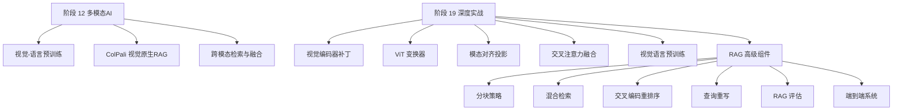

图示来源
- [ROADMAP.md:292-320](file://ROADMAP.md#L292-L320)
- [README.md:860-931](file://README.md#L860-L931)

章节来源
- [ROADMAP.md:292-320](file://ROADMAP.md#L292-L320)
- [README.md:860-931](file://README.md#L860-L931)

## 核心组件
本节聚焦于多模态系统的关键构件及其职责：
- 视觉前端：将图像切分为补丁序列，并加入位置信号
- ViT 编码器：堆叠的自注意力块，生成上下文化的视觉标记
- 投影对齐：将视觉表征映射到文本嵌入空间
- 交叉注意力解码器：文本侧查询与图像记忆键值交互
- 视觉-语言预训练：对比学习 + 语言建模联合优化
- RAG 分块策略：固定窗口、句子打包、递归分割、语义聚类、结构化 Markdown
- 混合检索：BM25 + 稠密向量 + RRF 融合
- 交叉编码重排序：小规模交叉注意力模型进行细粒度打分
- 查询重写：HyDE、多查询、问题分解
- RAG 评估：精度、召回、MRR、nDCG、可信度、答案相关性
- 端到端系统：从索引构建到查询回答的完整链路

章节来源
- [phases/19-capstone-projects/58-vision-encoder-patches/code/main.py:1-230](file://phases/19-capstone-projects/58-vision-encoder-patches/code/main.py#L1-L230)
- [phases/19-capstone-projects/59-vit-transformer/code/main.py:1-237](file://phases/19-capstone-projects/59-vit-transformer/code/main.py#L1-L237)
- [phases/19-capstone-projects/60-projection-layer-modality-align/code/main.py:1-236](file://phases/19-capstone-projects/60-projection-layer-modality-align/code/main.py#L1-L236)
- [phases/19-capstone-projects/61-cross-attention-fusion/code/main.py:1-271](file://phases/19-capstone-projects/61-cross-attention-fusion/code/main.py#L1-L271)
- [phases/19-capstone-projects/62-vision-language-pretraining/code/main.py:1-302](file://phases/19-capstone-projects/62-vision-language-pretraining/code/main.py#L1-L302)
- [phases/19-capstone-projects/64-chunking-strategies-advanced/code/main.py:1-407](file://phases/19-capstone-projects/64-chunking-strategies-advanced/code/main.py#L1-L407)
- [phases/19-capstone-projects/65-hybrid-retrieval-bm25-dense/code/main.py:1-255](file://phases/19-capstone-projects/65-hybrid-retrieval-bm25-dense/code/main.py#L1-L255)
- [phases/19-capstone-projects/66-reranker-cross-encoder/code/main.py:1-322](file://phases/19-capstone-projects/66-reranker-cross-encoder/code/main.py#L1-L322)
- [phases/19-capstone-projects/67-query-rewriting-hyde/code/main.py:1-432](file://phases/19-capstone-projects/67-query-rewriting-hyde/code/main.py#L1-L432)
- [phases/19-capstone-projects/68-rag-eval-precision-recall/code/main.py:1-433](file://phases/19-capstone-projects/68-rag-eval-precision-recall/code/main.py#L1-L433)
- [phases/19-capstone-projects/69-end-to-end-rag-system/code/main.py:1-722](file://phases/19-capstone-projects/69-end-to-end-rag-system/code/main.py#L1-L722)

## 架构总览
下图展示了从输入到输出的端到端流程，包括视觉理解、文本编码、模态对齐、跨模态检索与生成等关键步骤。

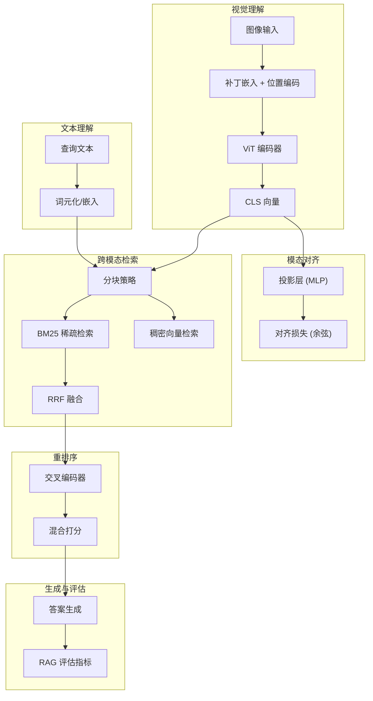

图示来源
- [phases/19-capstone-projects/58-vision-encoder-patches/code/main.py:105-129](file://phases/19-capstone-projects/58-vision-encoder-patches/code/main.py#L105-L129)
- [phases/19-capstone-projects/59-vit-transformer/code/main.py:136-166](file://phases/19-capstone-projects/59-vit-transformer/code/main.py#L136-L166)
- [phases/19-capstone-projects/60-projection-layer-modality-align/code/main.py:61-71](file://phases/19-capstone-projects/60-projection-layer-modality-align/code/main.py#L61-L71)
- [phases/19-capstone-projects/64-chunking-strategies-advanced/code/main.py:38-149](file://phases/19-capstone-projects/64-chunking-strategies-advanced/code/main.py#L38-L149)
- [phases/19-capstone-projects/65-hybrid-retrieval-bm25-dense/code/main.py:166-191](file://phases/19-capstone-projects/65-hybrid-retrieval-bm25-dense/code/main.py#L166-L191)
- [phases/19-capstone-projects/66-reranker-cross-encoder/code/main.py:70-101](file://phases/19-capstone-projects/66-reranker-cross-encoder/code/main.py#L70-L101)
- [phases/19-capstone-projects/69-end-to-end-rag-system/code/main.py:470-529](file://phases/19-capstone-projects/69-end-to-end-rag-system/code/main.py#L470-L529)

## 详细组件分析

### 视觉编码器补丁提取
- 功能：将224×224×3图像切分为14×14网格，每个补丁展平后经线性投影得到768维视觉标记；附加2D正弦位置编码；在首位插入可学习的CLS标记。
- 关键点：卷积步幅等于补丁大小等价于“展开+矩阵乘法”；位置编码一半维度编码行，另一半编码列；支持批量一致性与数值一致性校验。
- 应用：作为ViT的输入前端，为后续自注意力提供序列化表示。

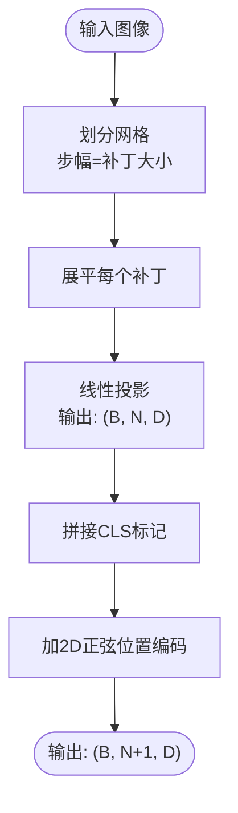

图示来源
- [phases/19-capstone-projects/58-vision-encoder-patches/code/main.py:69-129](file://phases/19-capstone-projects/58-vision-encoder-patches/code/main.py#L69-L129)

章节来源
- [phases/19-capstone-projects/58-vision-encoder-patches/code/main.py:1-230](file://phases/19-capstone-projects/58-vision-encoder-patches/code/main.py#L1-L230)

### Vision Transformer 变换器
- 功能：12层预LN结构，每层含多头自注意力与前馈网络；最终输出上下文化后的视觉标记序列与CLS向量。
- 关键点：预LayerNorm稳定训练；多头注意力支持注意力可视化；梯度回传验证从CLS到卷积权重的路径。
- 应用：为下游任务（如对齐投影）提供上下文丰富的视觉表征。

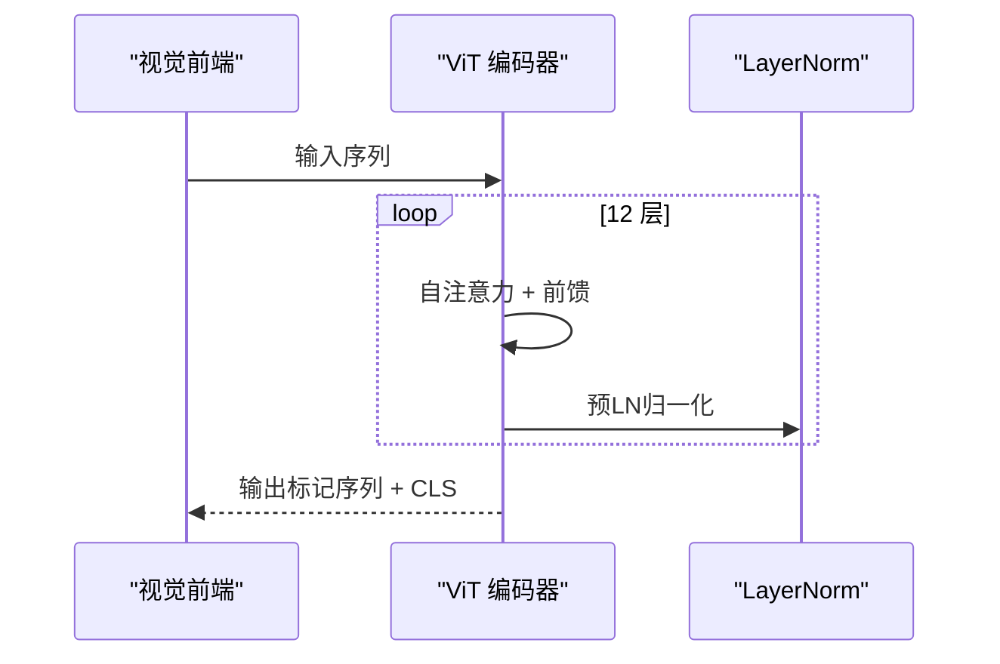

图示来源
- [phases/19-capstone-projects/59-vit-transformer/code/main.py:136-166](file://phases/19-capstone-projects/59-vit-transformer/code/main.py#L136-L166)

章节来源
- [phases/19-capstone-projects/59-vit-transformer/code/main.py:1-237](file://phases/19-capstone-projects/59-vit-transformer/code/main.py#L1-L237)

### 模态对齐投影层
- 功能：将ViT的CLS向量映射到文本嵌入空间，使用两层MLP；冻结视觉编码器与文本嵌入表，仅训练投影参数。
- 目标：最小化图像与文本的余弦对齐损失，使同一语义下的视觉与文本向量尽可能一致。
- 应用：为视觉-语言解码器提供统一的嵌入空间。

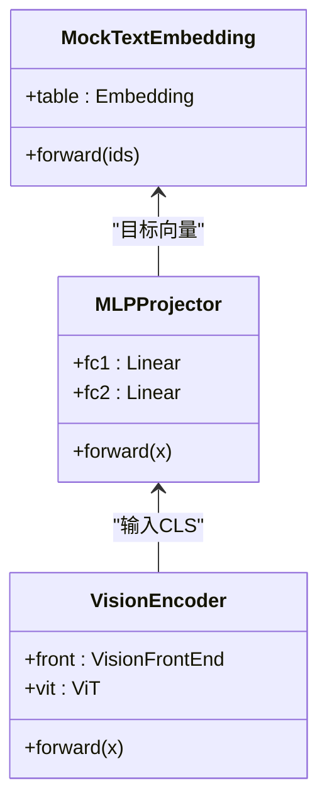

图示来源
- [phases/19-capstone-projects/60-projection-layer-modality-align/code/main.py:61-96](file://phases/19-capstone-projects/60-projection-layer-modality-align/code/main.py#L61-L96)

章节来源
- [phases/19-capstone-projects/60-projection-layer-modality-align/code/main.py:1-236](file://phases/19-capstone-projects/60-projection-layer-modality-align/code/main.py#L1-L236)

### 交叉注意力融合
- 功能：文本侧自回归解码，同时对图像记忆执行交叉注意力；支持KV缓存复用以加速推理。
- 关键点：自注意力使用下三角掩码；交叉注意力无掩码，允许文本任意位置关注全部图像标记；提供KV缓存一致性校验。
- 应用：在生成阶段将视觉记忆融入语言生成过程。

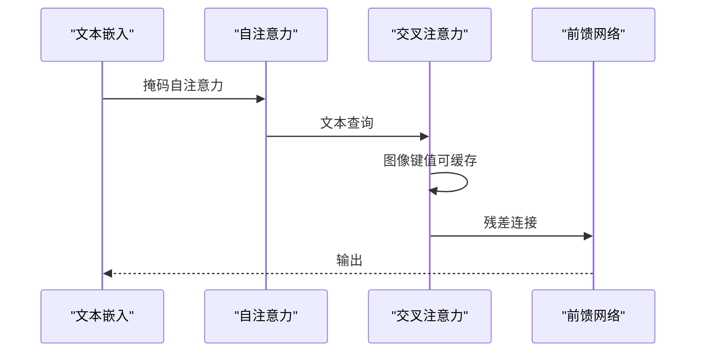

图示来源
- [phases/19-capstone-projects/61-cross-attention-fusion/code/main.py:146-202](file://phases/19-capstone-projects/61-cross-attention-fusion/code/main.py#L146-L202)

章节来源
- [phases/19-capstone-projects/61-cross-attention-fusion/code/main.py:1-271](file://phases/19-capstone-projects/61-cross-attention-fusion/code/main.py#L1-L271)

### 视觉-语言预训练
- 功能：组合ViT编码器、投影层与交叉注意力解码器，同时优化对比损失（InfoNCE）与语言建模损失。
- 关键点：共享温度参数；文本侧简单均值池化；合成数据集驱动收敛。
- 应用：获得可微的视觉-语言联合表征，支撑下游检索与生成。

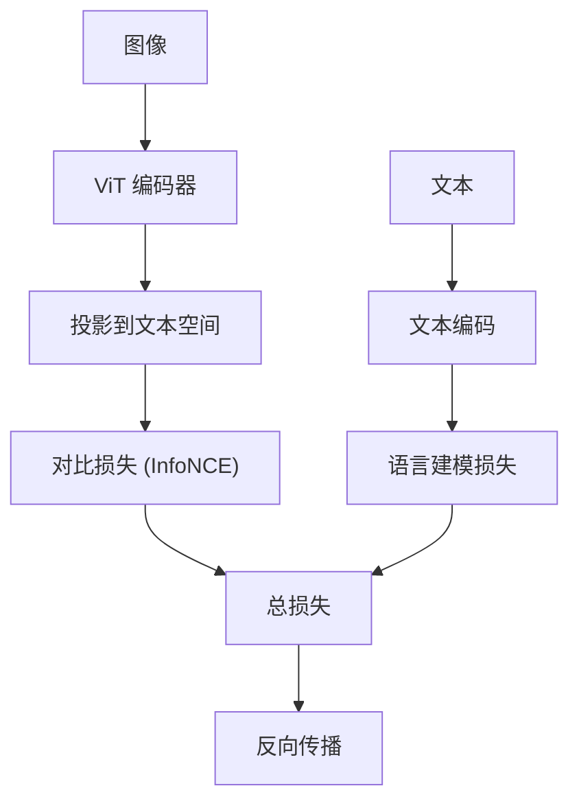

图示来源
- [phases/19-capstone-projects/62-vision-language-pretraining/code/main.py:130-189](file://phases/19-capstone-projects/62-vision-language-pretraining/code/main.py#L130-L189)

章节来源
- [phases/19-capstone-projects/62-vision-language-pretraining/code/main.py:1-302](file://phases/19-capstone-projects/62-vision-language-pretraining/code/main.py#L1-L302)

### 多模态评估
- 指标：精确率@K、召回率@K、MRR、nDCG、可信度（Faithfulness）、答案相关性（Answer Relevance）。
- 方法：基于内容词的判定器模拟LLM判断；支持基线、混合检索与混合+重排三种流水线对比。
- 应用：量化不同模块（检索、重排、生成）对最终问答质量的影响。

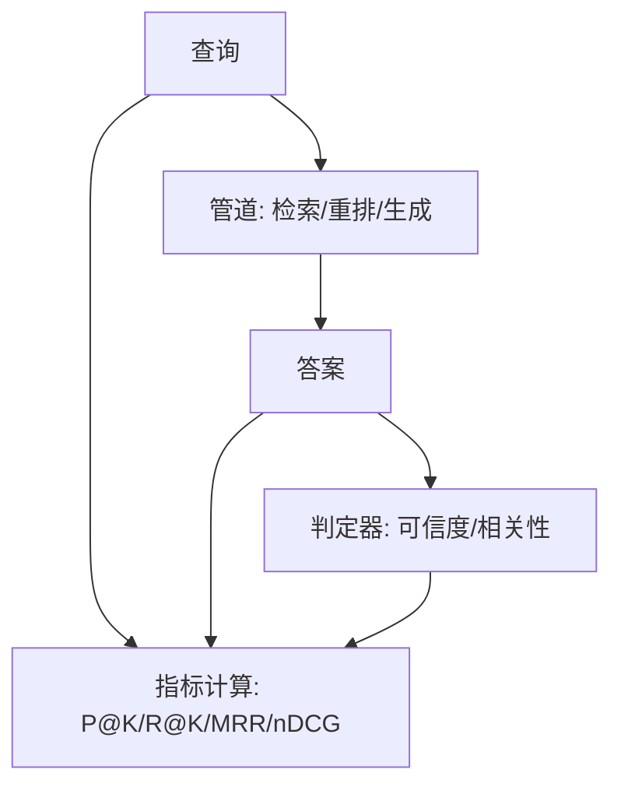

图示来源
- [phases/19-capstone-projects/68-rag-eval-precision-recall/code/main.py:354-395](file://phases/19-capstone-projects/68-rag-eval-precision-recall/code/main.py#L354-L395)

章节来源
- [phases/19-capstone-projects/68-rag-eval-precision-recall/code/main.py:1-433](file://phases/19-capstone-projects/68-rag-eval-precision-recall/code/main.py#L1-L433)

### 高级分块策略
- 策略：固定窗口、句子打包、递归分割、语义聚类、结构化Markdown。
- 评测：在合成语料上比较召回@K，统计各策略的块数量。
- 应用：为RAG提供更高质量的段落单元，提升检索与生成效果。

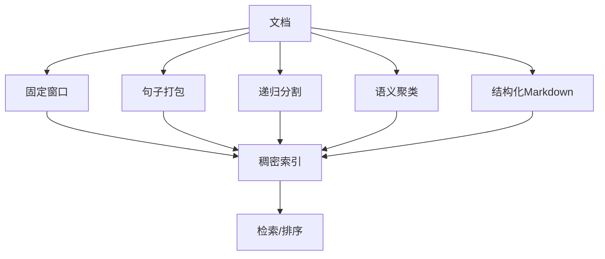

图示来源
- [phases/19-capstone-projects/64-chunking-strategies-advanced/code/main.py:38-241](file://phases/19-capstone-projects/64-chunking-strategies-advanced/code/main.py#L38-L241)

章节来源
- [phases/19-capstone-projects/64-chunking-strategies-advanced/code/main.py:1-407](file://phases/19-capstone-projects/64-chunking-strategies-advanced/code/main.py#L1-L407)

### 混合检索（BM25 + 稠密 + RRF）
- BM25：基于 Robertson-Sparck-Jones 的词频-反文档频率公式。
- 稠密：确定性哈希嵌入，避免引入额外库。
- RRF：Reciprocal Rank Fusion 将稀疏与稠密结果融合。
- 应用：在RAG中平衡关键词匹配与语义近似。

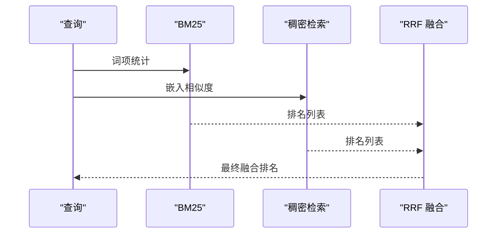

图示来源
- [phases/19-capstone-projects/65-hybrid-retrieval-bm25-dense/code/main.py:166-191](file://phases/19-capstone-projects/65-hybrid-retrieval-bm25-dense/code/main.py#L166-L191)

章节来源
- [phases/19-capstone-projects/65-hybrid-retrieval-bm25-dense/code/main.py:1-255](file://phases/19-capstone-projects/65-hybrid-retrieval-bm25-dense/code/main.py#L1-L255)

### 交叉编码重排序器
- 结构：小型交叉注意力模型，输入为“[CLS] 查询 [SEP] 文档 [SEP]”的拼接序列，输出为单标打分。
- 训练：使用三元组（查询、相关文档、无关/难负）监督训练。
- 应用：在候选集合上进行细粒度重排，显著提升下游指标。

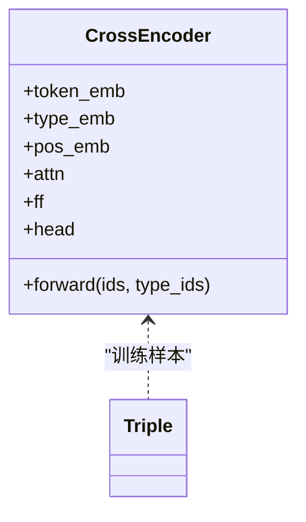

图示来源
- [phases/19-capstone-projects/66-reranker-cross-encoder/code/main.py:70-101](file://phases/19-capstone-projects/66-reranker-cross-encoder/code/main.py#L70-L101)

章节来源
- [phases/19-capstone-projects/66-reranker-cross-encoder/code/main.py:1-322](file://phases/19-capstone-projects/66-reranker-cross-encoder/code/main.py#L1-L322)

### 查询重写（HyDE/Multi-Query/分解）
- HyDE：为查询生成“假设性段落”，用其向量参与稠密检索，保留原始查询用于BM25。
- Multi-Query：同义扩展生成多个变体，提升覆盖面。
- 分解：将复合问题拆分为子问题，分别检索再合并。
- 应用：缓解查询与文档词汇不匹配的问题，提升召回。

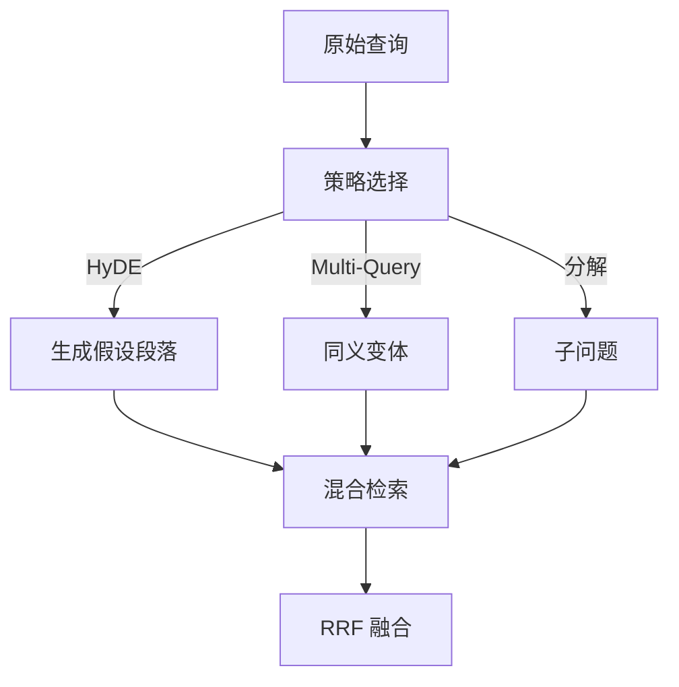

图示来源
- [phases/19-capstone-projects/67-query-rewriting-hyde/code/main.py:321-342](file://phases/19-capstone-projects/67-query-rewriting-hyde/code/main.py#L321-L342)

章节来源
- [phases/19-capstone-projects/67-query-rewriting-hyde/code/main.py:1-432](file://phases/19-capstone-projects/67-query-rewriting-hyde/code/main.py#L1-L432)

### 端到端RAG系统
- 组成：分块器、混合索引（BM25+稠密+RRF）、查询重写器、交叉编码重排序器、答案生成器、评估器。
- 流程：根据查询自动选择重写策略，检索候选，重排，生成答案并标注引用。
- 指标：在测试集上计算召回@5、精确率@1、MRR、可信度、答案相关性，并与阈值对比决定通过/失败。

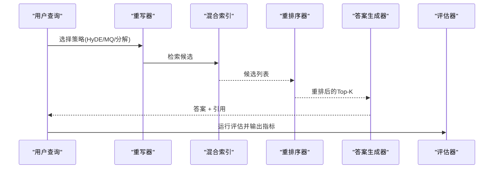

图示来源
- [phases/19-capstone-projects/69-end-to-end-rag-system/code/main.py:470-529](file://phases/19-capstone-projects/69-end-to-end-rag-system/code/main.py#L470-L529)

章节来源
- [phases/19-capstone-projects/69-end-to-end-rag-system/code/main.py:1-722](file://phases/19-capstone-projects/69-end-to-end-rag-system/code/main.py#L1-L722)

### 多模态文档问答（ColPali风格）
- Late Interaction：查询词向量与文档补丁逐元素最大相似度求和，形成MaxSim分数。
- DocPruner：按补丁范数方差裁剪低信息密度补丁，减少存储与计算。
- 应用：无需OCR与分块，直接对页面图像进行检索与排序。

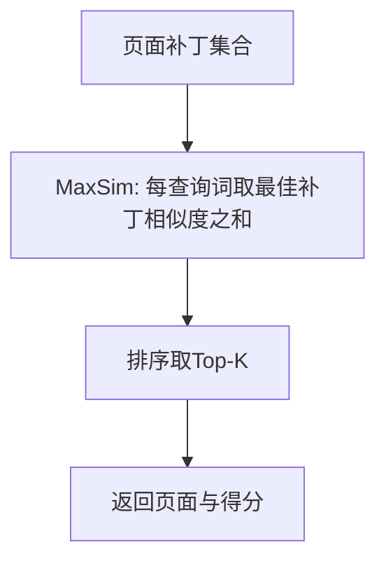

图示来源
- [phases/19-capstone-projects/04-multimodal-document-qa/code/main.py:90-102](file://phases/19-capstone-projects/04-multimodal-document-qa/code/main.py#L90-L102)

章节来源
- [phases/19-capstone-projects/04-multimodal-document-qa/code/main.py:1-165](file://phases/19-capstone-projects/04-multimodal-document-qa/code/main.py#L1-L165)

### ColPali 视觉原生RAG
- 特点：页面级补丁编码，查询词与补丁的MaxSim打分，无需OCR与文本分块。
- 对比：与传统文本RAG相比，存储占用更高但能保持版面信息与布局不变。
- 应用：面向表格、图表、手写体等复杂文档的问答。

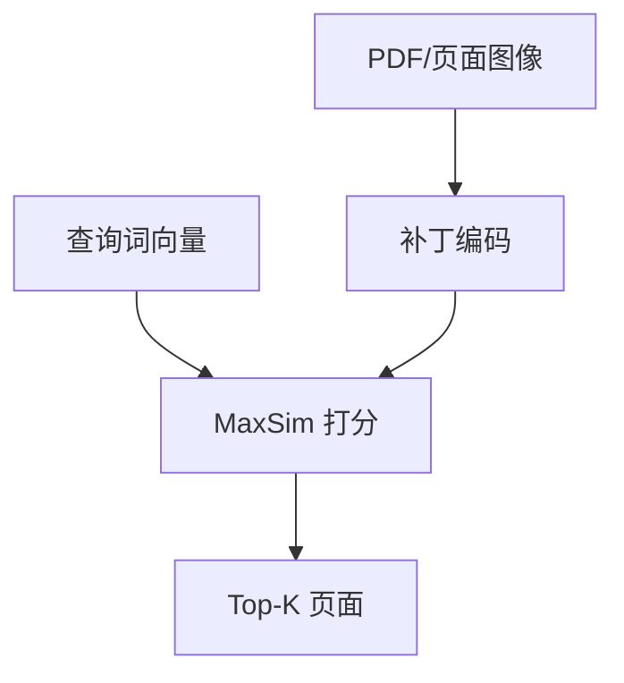

图示来源
- [phases/12-multimodal-ai/23-colpali-vision-native-rag/code/main.py:70-74](file://phases/12-multimodal-ai/23-colpali-vision-native-rag/code/main.py#L70-L74)

章节来源
- [phases/12-multimodal-ai/23-colpali-vision-native-rag/code/main.py:1-132](file://phases/12-multimodal-ai/23-colpali-vision-native-rag/code/main.py#L1-L132)

### 跨模态RAG（文本/图像/音频）
- 多路检索：文本关键词、图像标签、音频响度阈值。
- 融合：加权求和，偏向主导模态。
- 生成：基于检索结果生成带引用的答案。
- 应用：餐厅推荐场景中综合“安静环境、自然光照、素食”等多模态线索。

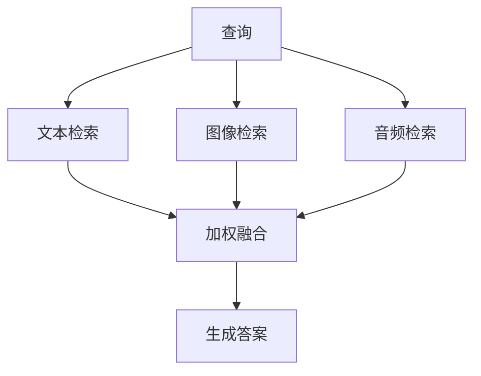

图示来源
- [phases/12-multimodal-ai/24-multimodal-rag-cross-modal/code/main.py:85-117](file://phases/12-multimodal-ai/24-multimodal-rag-cross-modal/code/main.py#L85-L117)

章节来源
- [phases/12-multimodal-ai/24-multimodal-rag-cross-modal/code/main.py:1-154](file://phases/12-multimodal-ai/24-multimodal-rag-cross-modal/code/main.py#L1-L154)

## 依赖关系分析
- 模块内依赖：视觉前端与ViT编解码器耦合紧密；投影层与解码器共同构成视觉-语言桥接；RAG流水线由分块、检索、重排、生成、评估组成。
- 数据流：图像→补丁→ViT→投影→对齐→检索/生成；文本→分块→BM25/稠密→RRF→重排→生成。
- 外部接口：纯Python实现，避免第三方检索库，便于离线演示与教学。

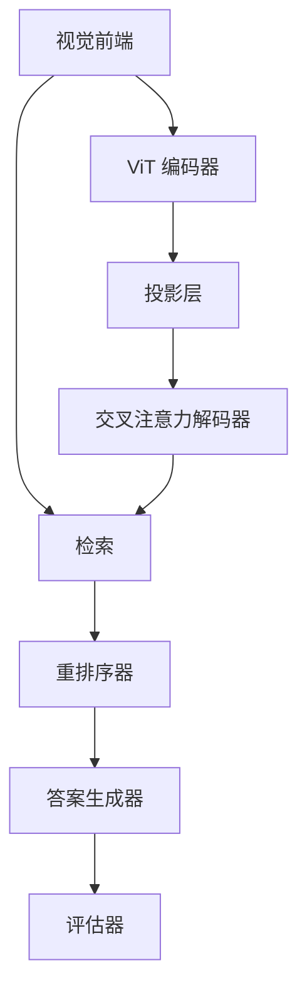

图示来源
- [phases/19-capstone-projects/58-vision-encoder-patches/code/main.py:105-129](file://phases/19-capstone-projects/58-vision-encoder-patches/code/main.py#L105-L129)
- [phases/19-capstone-projects/59-vit-transformer/code/main.py:136-166](file://phases/19-capstone-projects/59-vit-transformer/code/main.py#L136-L166)
- [phases/19-capstone-projects/60-projection-layer-modality-align/code/main.py:61-71](file://phases/19-capstone-projects/60-projection-layer-modality-align/code/main.py#L61-L71)
- [phases/19-capstone-projects/61-cross-attention-fusion/code/main.py:166-202](file://phases/19-capstone-projects/61-cross-attention-fusion/code/main.py#L166-L202)
- [phases/19-capstone-projects/65-hybrid-retrieval-bm25-dense/code/main.py:166-191](file://phases/19-capstone-projects/65-hybrid-retrieval-bm25-dense/code/main.py#L166-L191)
- [phases/19-capstone-projects/66-reranker-cross-encoder/code/main.py:70-101](file://phases/19-capstone-projects/66-reranker-cross-encoder/code/main.py#L70-L101)
- [phases/19-capstone-projects/69-end-to-end-rag-system/code/main.py:470-529](file://phases/19-capstone-projects/69-end-to-end-rag-system/code/main.py#L470-L529)

## 性能考量
- 计算复杂度：ViT自注意力为O(N^2·D)，其中N为补丁数（如196），D为隐藏维；交叉注意力为O(Nt·Nv·D)。
- 存储开销：ColPali需保存每页每补丁向量，相较文本RAG（每块一个向量）成本更高；可通过压缩或页面级向量降低存储。
- 推理效率：KV缓存复用可显著降低解码时延；重排序器可采用轻量模型或混合打分以平衡质量与时延。
- 并行化：分块策略与混合检索可并行化；重排序阶段可批量化。

## 故障排查指南
- 形状与维度错误：确保输入张量维度与配置一致（如图像尺寸、通道数、补丁大小）；检查投影层输入/输出维度匹配。
- 数值稳定性：注意力分数需softmax前掩码填充；投影层使用正交/截断初始化有助于稳定训练。
- 梯度异常：若CLS到卷积权重无梯度，检查预LN顺序与残差连接；确认冻结参数设置正确。
- 检索退化：若BM25/稠密得分异常，检查词表、ID映射与归一化；确认RRF权重与融合逻辑。
- 重排过拟合：交叉编码器在未训练查询上可能噪声较大，建议混合内容重叠信号或降低交叉编码权重。

章节来源
- [phases/19-capstone-projects/58-vision-encoder-patches/code/main.py:87-102](file://phases/19-capstone-projects/58-vision-encoder-patches/code/main.py#L87-L102)
- [phases/19-capstone-projects/61-cross-attention-fusion/code/main.py:105-133](file://phases/19-capstone-projects/61-cross-attention-fusion/code/main.py#L105-L133)
- [phases/19-capstone-projects/65-hybrid-retrieval-bm25-dense/code/main.py:143-160](file://phases/19-capstone-projects/65-hybrid-retrieval-bm25-dense/code/main.py#L143-L160)
- [phases/19-capstone-projects/66-reranker-cross-encoder/code/main.py:130-144](file://phases/19-capstone-projects/66-reranker-cross-encoder/code/main.py#L130-L144)

## 结论
本项目以“从零到一”的方式，系统实现了多模态视觉理解与RAG的关键构件：从视觉补丁提取、ViT编码、模态对齐，到跨模态检索与生成，再到评估与端到端系统集成。通过纯Python实现与清晰的模块边界，既满足教学演示需求，也为工程落地提供了可扩展的参考架构。建议在生产环境中进一步引入高效索引、分布式训练与推理优化，并结合领域数据持续迭代重排与生成模块。

## 附录
- 参考资料与路线图：见项目根目录的 README 与 ROADMAP 文件，涵盖阶段与课程安排、Capstone清单与进度跟踪。
- 在线图示：站点脚本包含Transformer与多模态融合的可视化，有助于直观理解注意力与融合机制。

章节来源
- [README.md:860-931](file://README.md#L860-L931)
- [ROADMAP.md:292-320](file://ROADMAP.md#L292-L320)
- [site/figures-llms-systems.js:417-482](file://site/figures-llms-systems.js#L417-L482)
- [site/figures-transformers.js:358-380](file://site/figures-transformers.js#L358-L380)