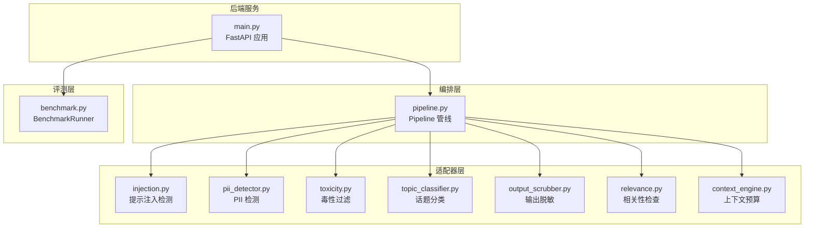
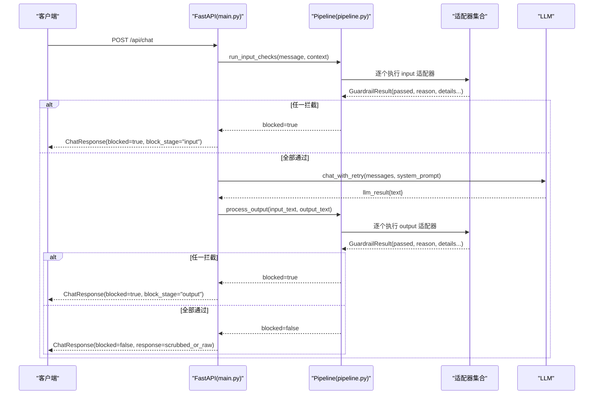
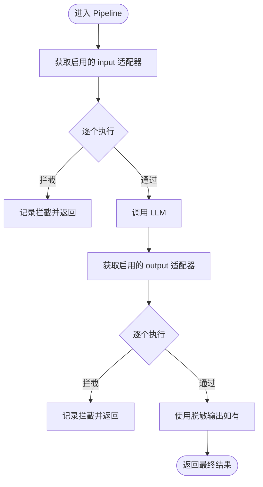
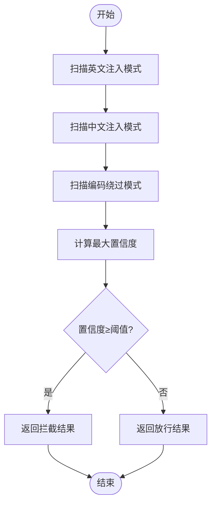
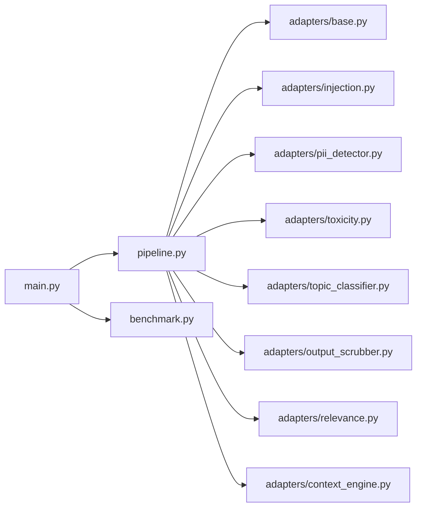

# 安全与防护项目

<cite>
**本文引用的文件**
- [main.py](file://guardrails-sandbox/backend/main.py)
- [pipeline.py](file://guardrails-sandbox/backend/pipeline.py)
- [base.py](file://guardrails-sandbox/backend/adapters/base.py)
- [injection.py](file://guardrails-sandbox/backend/adapters/injection.py)
- [topic_classifier.py](file://guardrails-sandbox/backend/adapters/topic_classifier.py)
- [output_scrubber.py](file://guardrails-sandbox/backend/adapters/output_scrubber.py)
- [context_engine.py](file://guardrails-sandbox/backend/adapters/context_engine.py)
- [pii_detector.py](file://guardrails-sandbox/backend/adapters/pii_detector.py)
- [toxicity.py](file://guardrails-sandbox/backend/adapters/toxicity.py)
- [relevance.py](file://guardrails-sandbox/backend/adapters/relevance.py)
- [benchmark.py](file://guardrails-sandbox/backend/benchmark.py)
</cite>

## 目录
1. [引言](#引言)
2. [项目结构](#项目结构)
3. [核心组件](#核心组件)
4. [架构总览](#架构总览)
5. [详细组件分析](#详细组件分析)
6. [依赖分析](#依赖分析)
7. [性能考虑](#性能考虑)
8. [故障排查指南](#故障排查指南)
9. [结论](#结论)
10. [附录](#附录)

## 引言
本项目围绕“安全与防护”目标，构建了一套可扩展、可观测、可评测的AI系统安全防护体系。其核心能力包括：
- 对抗攻击分类与提示注入检测：通过正则模式与编码绕过检测，识别并阻断典型提示注入攻击。
- 拒绝评估与内容审核：基于敏感词与毒性内容规则，进行输入级拒绝与内容分级处理。
- 内容分类器集成：对输入话题进行白名单/黑名单判定，确保业务合规。
- 宪法规则引擎与端到端安全防护门：以“输入过滤—策略校验—输出净化”的闭环机制，形成可审计、可回溯的安全门禁。
- 基准测试与性能度量：提供对抗样本与正常样本的评测框架，支持准确率、拦截率、误拦率等指标。

本技术文档将从系统架构、组件设计、数据流、处理逻辑、依赖关系、性能与运维保障等方面进行全面阐述，并给出安全工程流程建议与实战经验。

## 项目结构
项目采用“后端服务 + 管线编排 + 适配器集合 + 基准测试”的分层组织方式：
- 后端服务：FastAPI 提供 REST API，负责请求接入、LLM 调用桥接、适配器编排与可视化接口。
- 管线编排：Pipeline 统一调度输入/输出适配器，支持短路拦截、统计与拦截历史记录。
- 适配器集合：覆盖输入/输出两大类安全能力，包括注入检测、PII 检测、毒性过滤、话题分类、输出脱敏、相关性检查、上下文预算与工具选择等。
- 基准测试：BenchmarkRunner 提供对抗样本与正常样本的评测，输出统计摘要与分层分析。

**图表来源**
- [main.py:118-281](file://guardrails-sandbox/backend/main.py#L118-L281)
- [pipeline.py:12-128](file://guardrails-sandbox/backend/pipeline.py#L12-L128)
- [injection.py:44-88](file://guardrails-sandbox/backend/adapters/injection.py#L44-L88)
- [pii_detector.py:19-54](file://guardrails-sandbox/backend/adapters/pii_detector.py#L19-L54)
- [toxicity.py:22-64](file://guardrails-sandbox/backend/adapters/toxicity.py#L22-L64)
- [topic_classifier.py:20-54](file://guardrails-sandbox/backend/adapters/topic_classifier.py#L20-L54)
- [output_scrubber.py:16-56](file://guardrails-sandbox/backend/adapters/output_scrubber.py#L16-L56)
- [relevance.py:23-70](file://guardrails-sandbox/backend/adapters/relevance.py#L23-L70)
- [context_engine.py:179-243](file://guardrails-sandbox/backend/adapters/context_engine.py#L179-L243)
- [benchmark.py:10-169](file://guardrails-sandbox/backend/benchmark.py#L10-L169)

**章节来源**
- [main.py:1-421](file://guardrails-sandbox/backend/main.py#L1-L421)
- [pipeline.py:1-285](file://guardrails-sandbox/backend/pipeline.py#L1-L285)

## 核心组件
- 管线编排器（Pipeline）
  - 负责注册、排序、执行与统计适配器；支持输入/输出两类检查；短路拦截；记录拦截历史；提供树形结构展示与开关控制。
- 适配器基类（GuardrailAdapter/GuardrailResult）
  - 统一的适配器接口与结果结构，定义分组、类别、顺序与启用状态；check(text, context) 返回标准化结果。
- 安全适配器集合
  - 输入侧：提示注入检测、PII 检测、毒性过滤、话题分类。
  - 输出侧：输出脱敏、相关性检查、上下文预算与工具选择。
- 基准测试（BenchmarkRunner）
  - 对测试用例执行输入检查，统计准确率、拦截率、误拦率与分层命中情况。

**章节来源**
- [pipeline.py:12-285](file://guardrails-sandbox/backend/pipeline.py#L12-L285)
- [base.py:5-34](file://guardrails-sandbox/backend/adapters/base.py#L5-L34)
- [benchmark.py:10-169](file://guardrails-sandbox/backend/benchmark.py#L10-L169)

## 架构总览
整体工作流分为三阶段：输入检查（短路）、LLM 调用、输出检查（短路）。服务端在主流程中串联 Pipeline，对输入进行拦截判断；若通过，则调用 LLM 并对输出进行二次检查；最终返回统一响应模型。

**图表来源**
- [main.py:155-221](file://guardrails-sandbox/backend/main.py#L155-L221)
- [pipeline.py:31-161](file://guardrails-sandbox/backend/pipeline.py#L31-L161)

**章节来源**
- [main.py:155-221](file://guardrails-sandbox/backend/main.py#L155-L221)
- [pipeline.py:86-161](file://guardrails-sandbox/backend/pipeline.py#L86-L161)

## 详细组件分析

### 管线编排器（Pipeline）
- 职责
  - 注册适配器并按 order 排序；区分 input/output 两类；短路拦截；累计统计与拦截历史；提供树形结构与开关控制。
- 关键行为
  - run_input_checks：遍历启用的 input 适配器，遇阻即返回；记录拦截与通过计数。
  - run_output_checks：遍历启用的 output 适配器，遇阻即返回；支持 context["scrubbed_output"]。
  - process/process_output：对外暴露统一处理入口，返回带拦截原因与日志的结构化结果。
  - get_tree/toggle_adapter/get_stats：提供可视化与运维能力。
- 性能与可观测性
  - 记录每步 latency_ms；聚合 by_layer 统计；维护 block_history 便于审计。

**图表来源**
- [pipeline.py:31-161](file://guardrails-sandbox/backend/pipeline.py#L31-L161)

**章节来源**
- [pipeline.py:12-285](file://guardrails-sandbox/backend/pipeline.py#L12-L285)

### 适配器基类（GuardrailAdapter/GuardrailResult）
- 设计要点
  - 统一字段：name/display_name/description/group/category/order/enabled。
  - 结果结构：passed/reason/details/confidence/latency_ms。
  - 仅需实现 check(text, context) 即可接入 Pipeline。
- 作用
  - 将具体安全策略封装为可插拔组件，便于组合、开关与观测。

**章节来源**
- [base.py:5-34](file://guardrails-sandbox/backend/adapters/base.py#L5-L34)

### 提示注入检测（InjectionDetector）
- 能力
  - 正则匹配典型注入模式（英文与中文），并检测编码绕过（Unicode、Base64、ROT13、十六进制等）。
- 规则与置信度
  - 不同模式赋予不同置信度；当最大置信度达到阈值时触发拦截。
- 处理流程
  - 遍历模式匹配，汇总最高置信度与匹配项；返回 GuardrailResult。

**图表来源**
- [injection.py:53-88](file://guardrails-sandbox/backend/adapters/injection.py#L53-L88)

**章节来源**
- [injection.py:44-88](file://guardrails-sandbox/backend/adapters/injection.py#L44-L88)

### PII 检测（PiiDetector）
- 能力
  - 检测手机号、邮箱、身份证、信用卡、IP 地址等敏感信息。
- 行为
  - 对于高置信度敏感项直接拦截；对 IP 地址仅警告（降低误报）。
- 输出
  - 返回 detected 列表与最高置信度。

**章节来源**
- [pii_detector.py:19-54](file://guardrails-sandbox/backend/adapters/pii_detector.py#L19-L54)

### 毒性过滤（ToxicityFilter）
- 能力
  - 过滤暴力、违法活动、自残、仇恨、色情等敏感内容。
- 特殊处理
  - 若输入以特定安全上下文前缀开头，则直接放行。
- 输出
  - 返回 flagged 列表与置信度。

**章节来源**
- [toxicity.py:22-64](file://guardrails-sandbox/backend/adapters/toxicity.py#L22-L64)

### 话题分类（TopicClassifier）
- 能力
  - 白名单/黑名单策略：明确禁止的关键词直接拦截；其余输入默认放行。
- 输出
  - 返回 matched_keyword 或 topics_allowed。

**章节来源**
- [topic_classifier.py:20-54](file://guardrails-sandbox/backend/adapters/topic_classifier.py#L20-L54)

### 输出脱敏（OutputScrubber）
- 能力
  - 在输出层替换邮箱、身份证、手机号、信用卡等 PII 为占位符。
- 行为
  - 始终放行，但通过 context["scrubbed_output"] 传递清洗后的文本给后续适配器。

**章节来源**
- [output_scrubber.py:16-56](file://guardrails-sandbox/backend/adapters/output_scrubber.py#L16-L56)

### 相关性检查（RelevanceChecker）
- 能力
  - 基于关键词重叠度评估输出与输入的相关性；低于阈值则拦截。
- 特殊处理
  - 当输入/输出有效词较少时跳过检查，避免对简洁回答误判。

**章节来源**
- [relevance.py:23-70](file://guardrails-sandbox/backend/adapters/relevance.py#L23-L70)

### 上下文预算（ContextEngine）
- 能力
  - Token 预算分配：系统提示、生成、历史、工具等组件竞争窗口；动态选择工具；压缩历史；报告预算使用情况。
- 行为
  - 永不拦截，仅提供预算与历史统计信息，辅助优化上下文质量与稳定性。

**章节来源**
- [context_engine.py:179-243](file://guardrails-sandbox/backend/adapters/context_engine.py#L179-L243)

### 基准测试（BenchmarkRunner）
- 能力
  - 对测试用例执行输入检查，统计准确率、拦截率、误拦率、精确率与 F1；按类别与拦截层聚合分析。
- 行为
  - 保存/恢复适配器状态与限流窗口，保证评测一致性。

**章节来源**
- [benchmark.py:10-169](file://guardrails-sandbox/backend/benchmark.py#L10-L169)

## 依赖分析
- 组件耦合
  - main.py 依赖 pipeline.py 与各类适配器；pipeline.py 依赖 adapters.base；各适配器依赖 base。
- 外部依赖
  - sentence-transformers（离线加载）用于语义相似度场景（在 main.py 中预加载）。
- 可能的循环依赖
  - 无直接循环导入；通过模块化组织避免。
- 接口契约
  - 所有适配器遵循统一的 check 接口与 GuardrailResult 结构，便于扩展与替换。

**图表来源**
- [main.py:16-58](file://guardrails-sandbox/backend/main.py#L16-L58)
- [pipeline.py:12-24](file://guardrails-sandbox/backend/pipeline.py#L12-L24)
- [base.py:14-34](file://guardrails-sandbox/backend/adapters/base.py#L14-L34)
- [injection.py:44-88](file://guardrails-sandbox/backend/adapters/injection.py#L44-L88)
- [pii_detector.py:19-54](file://guardrails-sandbox/backend/adapters/pii_detector.py#L19-L54)
- [toxicity.py:22-64](file://guardrails-sandbox/backend/adapters/toxicity.py#L22-L64)
- [topic_classifier.py:20-54](file://guardrails-sandbox/backend/adapters/topic_classifier.py#L20-L54)
- [output_scrubber.py:16-56](file://guardrails-sandbox/backend/adapters/output_scrubber.py#L16-L56)
- [relevance.py:23-70](file://guardrails-sandbox/backend/adapters/relevance.py#L23-L70)
- [context_engine.py:179-243](file://guardrails-sandbox/backend/adapters/context_engine.py#L179-L243)
- [benchmark.py:10-169](file://guardrails-sandbox/backend/benchmark.py#L10-L169)

**章节来源**
- [main.py:16-58](file://guardrails-sandbox/backend/main.py#L16-L58)
- [pipeline.py:12-24](file://guardrails-sandbox/backend/pipeline.py#L12-L24)

## 性能考虑
- 时间复杂度
  - 输入/输出适配器检查为 O(n) 级别（n 为适配器数量），且多数为字符串匹配，常数较小。
- 空间复杂度
  - 主要消耗来自上下文历史压缩与预算分配的数据结构，整体可控。
- 关键优化点
  - 适配器短路拦截减少不必要的后续检查。
  - 预加载语义模型（main.py）避免异步环境下的连接问题。
  - 通过 order 控制执行顺序，将高成本适配器置于靠后位置（如相关性检查）。
- 延迟观测
  - 每个适配器返回 latency_ms，Pipeline 聚合统计，便于定位瓶颈。

[本节为通用性能讨论，无需“章节来源”]

## 故障排查指南
- 常见问题
  - 请求被拦截：检查 block_stage 与 block_reason；查看对应适配器的日志 details。
  - 输出异常：确认 OutputScrubber 是否生效；核对相关性检查阈值。
  - 性能下降：关注高延迟适配器；检查是否启用了过多 output 适配器。
- 审计与回溯
  - 使用 /api/guardrails/block-history 获取拦截历史；通过 get_tree 查看适配器树与启用状态。
- 基准测试
  - 使用 /api/benchmark 运行评测，查看 by_category 与 by_layer 的命中分布，定位薄弱环节。

**章节来源**
- [main.py:121-145](file://guardrails-sandbox/backend/main.py#L121-L145)
- [pipeline.py:188-285](file://guardrails-sandbox/backend/pipeline.py#L188-L285)
- [benchmark.py:14-28](file://guardrails-sandbox/backend/benchmark.py#L14-L28)

## 结论
本项目以 Pipeline 为核心，将多种安全能力模块化、可插拔化，形成“输入过滤—策略校验—输出净化”的闭环。通过基准测试与可视化接口，实现了可观测、可评测、可审计的安全工程实践。建议在生产环境中结合宪法规则引擎与端到端安全防护门，进一步提升对抗复杂攻击与合规治理的能力。

[本节为总结性内容，无需“章节来源”]

## 附录

### 安全威胁建模与防护策略
- 威胁建模
  - 提示注入（越狱、覆盖指令、编码绕过）、敏感信息泄露（PII）、有害内容传播（暴力/违法/仇恨/色情）、上下文滥用（工具滥用/历史污染）、输出偏题（无关/误导）。
- 防护策略
  - 正则模式与编码绕过检测（提示注入检测）。
  - PII 检测与输出脱敏。
  - 毒性过滤与话题分类。
  - 上下文预算与历史压缩，降低中间丢失风险。
  - 相关性检查，确保输出聚焦。

[本节为概念性内容，无需“章节来源”]

### 安全工程流程（建议）
- 需求与合规：明确业务边界与合规要求（如 GDPR、CCPA）。
- 威胁建模：识别攻击面与关键资产。
- 防护设计：选择适配器组合，定义拦截阈值与处置动作（阻断/脱敏/告警）。
- 开发与集成：遵循统一接口，接入 Pipeline。
- 测试与评测：使用基准测试评估 TPR/FPR/准确率。
- 运维与监控：持续观测拦截历史、延迟与命中分布。
- 审计与改进：定期回顾规则有效性，迭代优化。

[本节为流程性内容，无需“章节来源”]