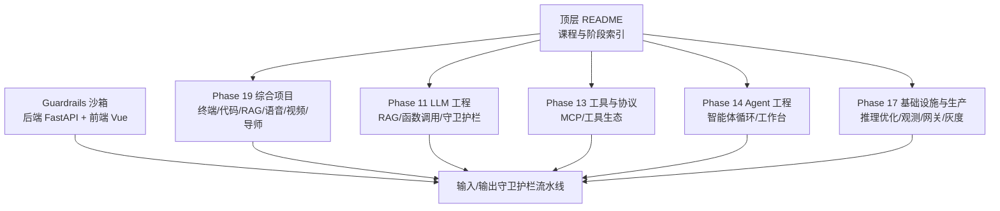
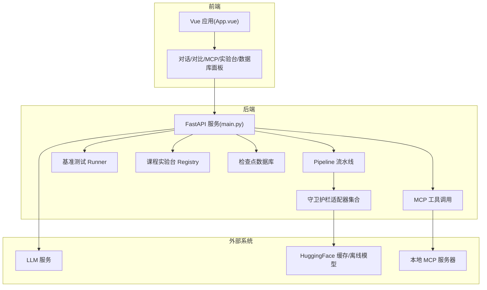
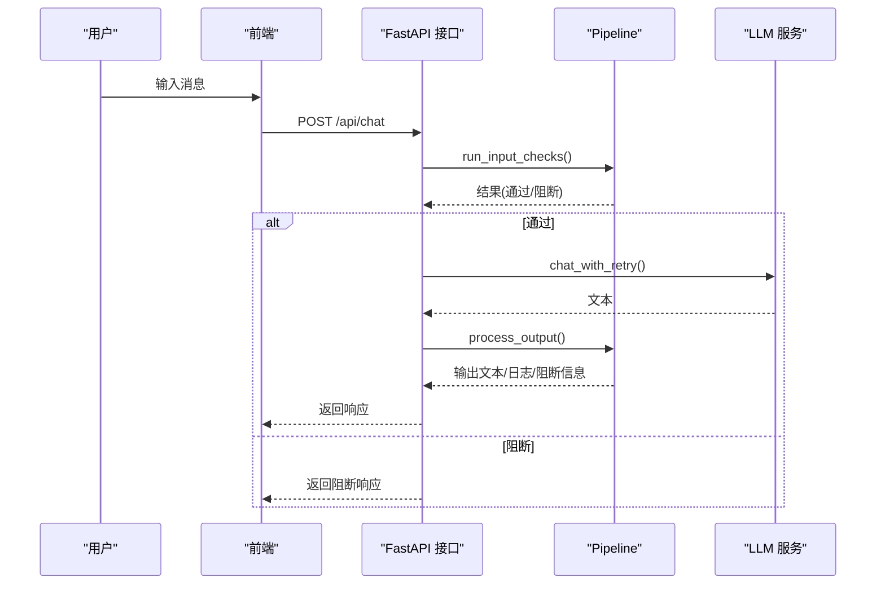
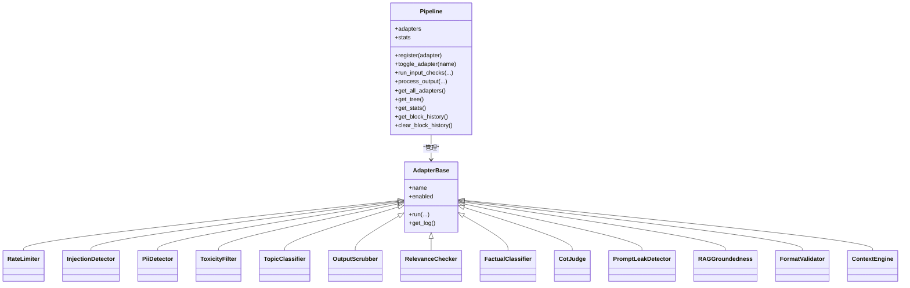
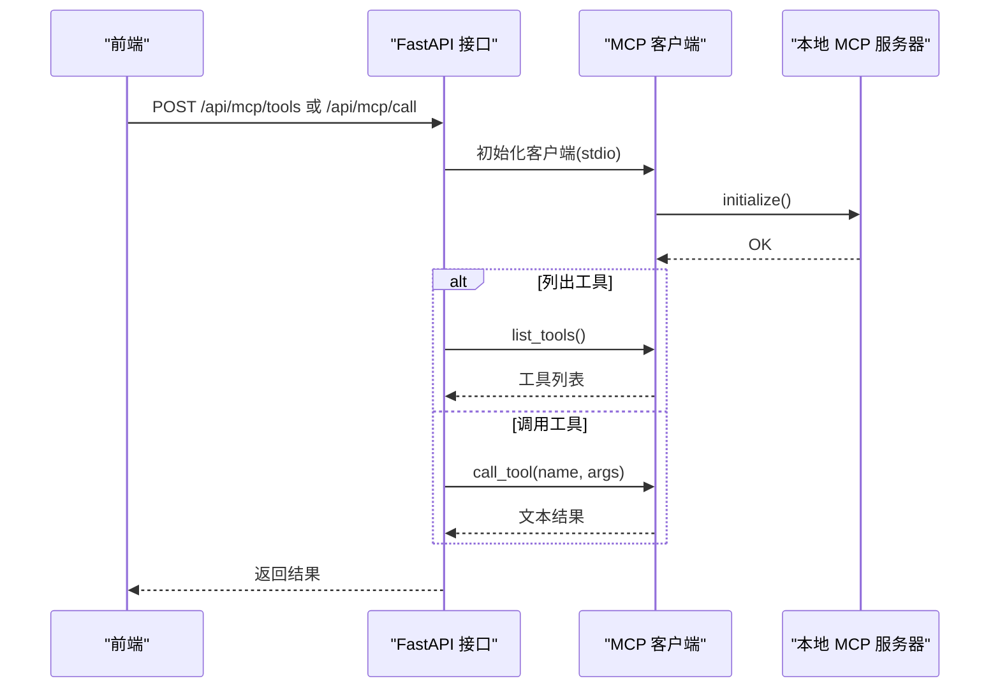
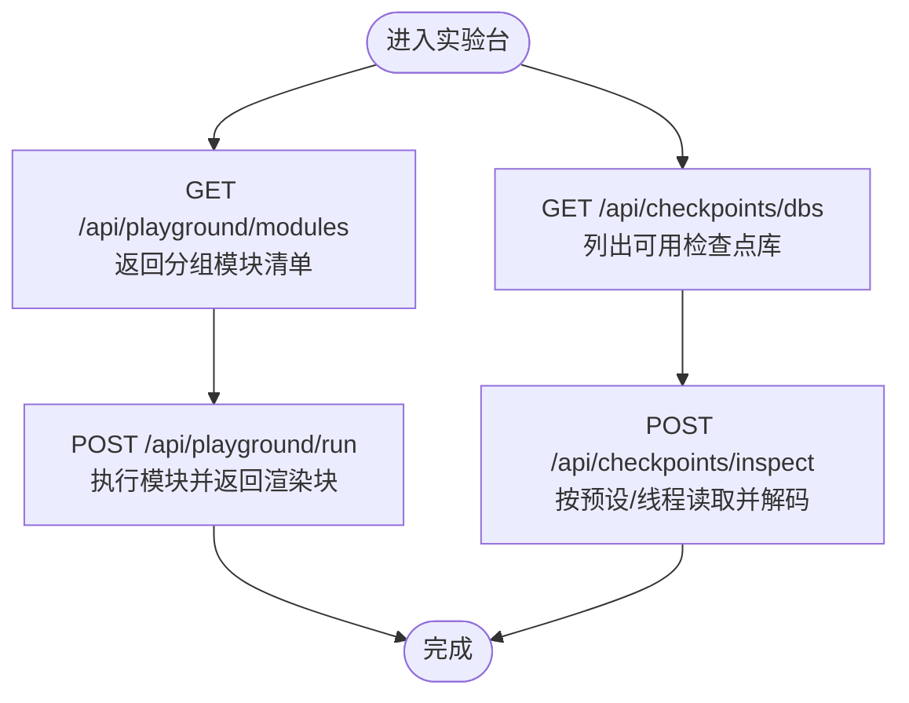
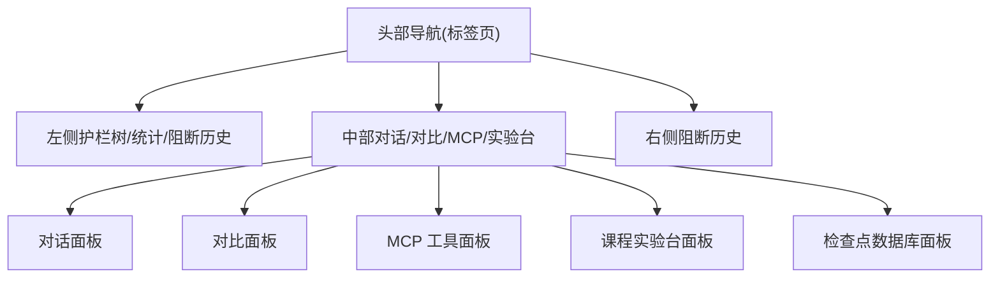
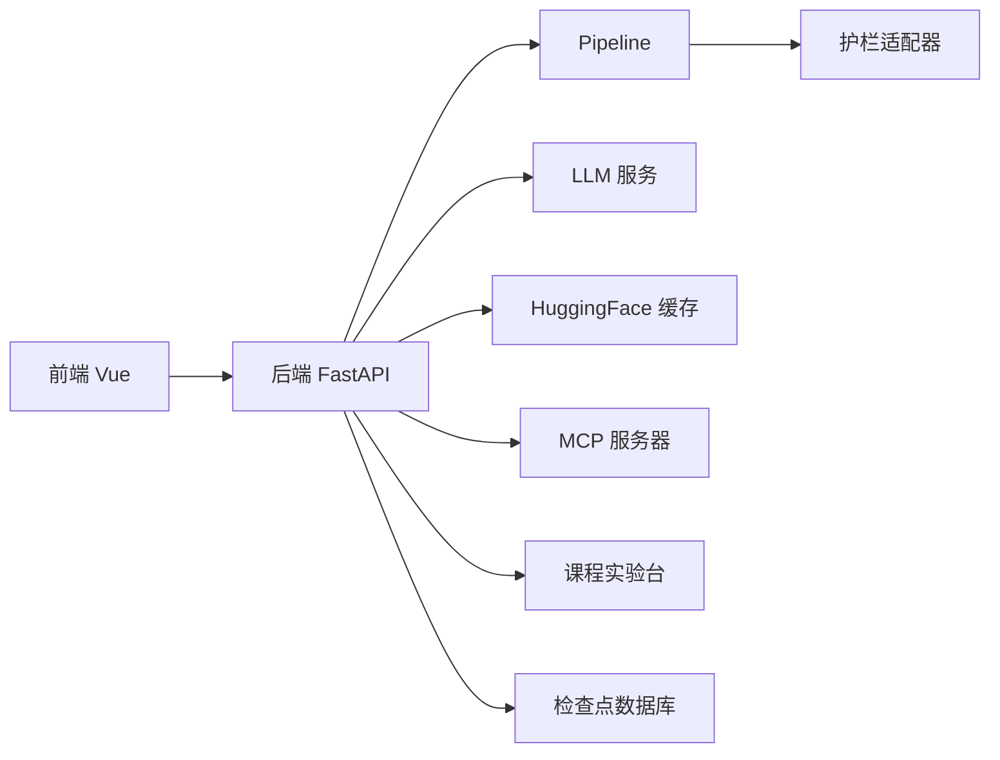

# 应用型项目

<cite>
**本文引用的文件**
- [README.md](file://README.md)
- [guardrails-sandbox/backend/main.py](file://guardrails-sandbox/backend/main.py)
- [guardrails-sandbox/frontend/src/App.vue](file://guardrails-sandbox/frontend/src/App.vue)
- [phases/19-capstone-projects/README.md](file://phases/19-capstone-projects/README.md)
</cite>

## 目录
1. [引言](#引言)
2. [项目结构](#项目结构)
3. [核心组件](#核心组件)
4. [架构总览](#架构总览)
5. [详细组件分析](#详细组件分析)
6. [依赖关系分析](#依赖关系分析)
7. [性能考量](#性能考量)
8. [故障排查指南](#故障排查指南)
9. [结论](#结论)
10. [附录](#附录)

## 引言
本文件面向“应用型项目”的实践与落地，聚焦以下真实场景：终端原生编码代理、RAG 代码库问答、实时语音助手、多模态文档问答、生产级 RAG 聊天机器人、视频理解管道、个人 AI 导师。我们将从业务需求、技术架构、核心功能实现、部署方案、性能优化、错误处理与监控等方面进行系统性阐述，并结合仓库中的 Guardrails 沙箱示例，展示如何在真实系统中集成安全与合规能力。

## 项目结构
该仓库采用“阶段化+课程化”的组织方式，每个阶段包含若干课程，每门课程提供可运行的代码、文档与产出物。应用型项目主要分布在 Phase 19（综合项目）以及相关工程化阶段（如 LLM 工程、工具协议、Agent 工程、基础设施与生产等）。下图给出与应用型项目相关的高层结构映射：

图表来源
- [README.md:1-120](file://README.md#L1-L120)
- [phases/19-capstone-projects/README.md:1-6](file://phases/19-capstone-projects/README.md#L1-L6)

章节来源
- [README.md:240-820](file://README.md#L240-L820)
- [phases/19-capstone-projects/README.md:1-6](file://phases/19-capstone-projects/README.md#L1-L6)

## 核心组件
- 守卫护栏沙箱（Guardrails Sandbox）
  - 后端：基于 FastAPI 的交互式服务，内置输入/输出守卫护栏流水线，支持开关、统计、阻断历史、基准测试、MCP 工具调用与课程实验台集成。
  - 前端：Vue 单页应用，提供“普通对话”“对比模式”“MCP 工具”“课程实验台”“检查点数据库”等面板。
- 应用型项目清单（来自 Phase 19）
  - 终端原生编码代理、RAG 代码库问答、实时语音助手、多模态文档问答、生产级 RAG 聊天机器人、视频理解管道、个人 AI 导师等。

章节来源
- [guardrails-sandbox/backend/main.py:1-421](file://guardrails-sandbox/backend/main.py#L1-L421)
- [guardrails-sandbox/frontend/src/App.vue:1-300](file://guardrails-sandbox/frontend/src/App.vue#L1-L300)
- [phases/19-capstone-projects/README.md:1-6](file://phases/19-capstone-projects/README.md#L1-L6)

## 架构总览
下图展示了 Guardrails 沙箱的整体架构，以及其与应用型项目的关联路径（以 RAG 为例）：

图表来源
- [guardrails-sandbox/backend/main.py:120-331](file://guardrails-sandbox/backend/main.py#L120-L331)
- [guardrails-sandbox/frontend/src/App.vue:84-160](file://guardrails-sandbox/frontend/src/App.vue#L84-L160)

## 详细组件分析

### 组件一：对话与对比模式（Chat/Compare）
- 功能要点
  - 普通对话：先执行输入守卫护栏，再调用 LLM，最后执行输出守卫护栏；记录总耗时与 LLM 耗时。
  - 对比模式：同时发起两次请求，一次绕过守卫护栏（直接调用 LLM），一次走完整护栏流程，便于评估护栏效果。
- 关键流程（序列图）

图表来源
- [guardrails-sandbox/backend/main.py:155-221](file://guardrails-sandbox/backend/main.py#L155-L221)

章节来源
- [guardrails-sandbox/backend/main.py:155-221](file://guardrails-sandbox/backend/main.py#L155-L221)

### 组件二：守卫护栏流水线（Pipeline 与适配器）
- 功能要点
  - 统一注册与管理各类护栏（速率限制、注入检测、PII 检测、毒性过滤、主题分类、格式校验、事实性判断、RAG 基础性、上下文工程等）。
  - 支持动态开关、统计聚合、阻断历史、树形结构展示。
- 类关系示意

图表来源
- [guardrails-sandbox/backend/main.py:24-58](file://guardrails-sandbox/backend/main.py#L24-L58)

章节来源
- [guardrails-sandbox/backend/main.py:24-58](file://guardrails-sandbox/backend/main.py#L24-L58)

### 组件三：MCP 工具调用
- 功能要点
  - 通过标准传输（stdio）连接本地 MCP 服务器，支持列出工具与调用工具，返回文本结果。
  - 在现有事件循环环境中安全运行协程。
- 序列图

图表来源
- [guardrails-sandbox/backend/main.py:324-356](file://guardrails-sandbox/backend/main.py#L324-L356)

章节来源
- [guardrails-sandbox/backend/main.py:283-356](file://guardrails-sandbox/backend/main.py#L283-L356)

### 组件四：课程实验台与检查点数据库
- 功能要点
  - 提供按阶段分组的实验模块清单与运行接口，返回通用渲染块结果。
  - 支持只读检查点数据库浏览，按预设或线程 ID 解码并返回结构化数据。
- 流程图

图表来源
- [guardrails-sandbox/backend/main.py:368-404](file://guardrails-sandbox/backend/main.py#L368-L404)

章节来源
- [guardrails-sandbox/backend/main.py:368-404](file://guardrails-sandbox/backend/main.py#L368-L404)

### 组件五：前端交互与布局
- 功能要点
  - 多标签页布局：课程实验、普通对话、对比模式、MCP 工具、检查点数据库。
  - 与后端 API 交互：加载护栏树、切换护栏、重置统计、运行基准测试、发送对话、对比结果。
- 视图结构示意

图表来源
- [guardrails-sandbox/frontend/src/App.vue:84-160](file://guardrails-sandbox/frontend/src/App.vue#L84-L160)

章节来源
- [guardrails-sandbox/frontend/src/App.vue:1-300](file://guardrails-sandbox/frontend/src/App.vue#L1-L300)

## 依赖关系分析
- 内部耦合
  - 后端通过 Pipeline 统一编排护栏，避免各护栏直接相互依赖，提升内聚性与可扩展性。
  - 前端通过统一的 API 与后端交互，降低对具体护栏实现细节的耦合。
- 外部依赖
  - LLM 服务：用于生成回复；需具备重试与错误兜底。
  - HuggingFace 缓存：离线加载语义模型，减少网络抖动影响。
  - MCP 服务器：通过 stdio 通信，要求稳定的本地进程与命令路径。
- 可能的环路与风险
  - 对话链路中若护栏逻辑异常，可能导致阻断率上升；应通过统计与阻断历史快速定位。
  - MCP 工具调用若超时或初始化失败，需在前端提示并降级处理。

图表来源
- [guardrails-sandbox/backend/main.py:120-331](file://guardrails-sandbox/backend/main.py#L120-L331)

章节来源
- [guardrails-sandbox/backend/main.py:120-331](file://guardrails-sandbox/backend/main.py#L120-L331)

## 性能考量
- 推理与护栏并行化
  - 将输入护栏与 LLM 调用并行化，减少端到端延迟；输出护栏在 LLM 返回后再执行，避免阻断导致的重复计算。
- 模型预热与缓存
  - 启动时预加载语义模型，避免首次调用的冷启动开销；启用离线缓存以稳定响应时间。
- 并发与事件循环
  - 在已存在事件循环的线程中安全运行协程，避免阻塞主线程；必要时使用线程池调度异步任务。
- 监控指标
  - 记录总延迟与 LLM 延迟，便于定位瓶颈；护栏阻断率与各层通过率用于评估护栏有效性。

[本节为通用指导，不直接分析具体文件]

## 故障排查指南
- 常见问题
  - LLM 调用失败：检查密钥、网络连通性与重试策略；后端返回错误信息，前端显示错误提示。
  - 护栏误判：通过“对比模式”验证护栏影响；逐项关闭护栏定位问题护栏；查看阻断历史与详细原因。
  - MCP 工具不可用：确认本地 MCP 服务器路径与命令；检查初始化是否成功；查看工具列表是否为空。
  - 模型加载失败：确认离线缓存可用；检查模型名称与本地文件一致性。
- 建议操作
  - 使用“重置统计”清理历史干扰。
  - 使用“基准测试”批量评估护栏效果。
  - 查看阻断历史与护栏树，定位高频阻断环节。

章节来源
- [guardrails-sandbox/backend/main.py:176-220](file://guardrails-sandbox/backend/main.py#L176-L220)
- [guardrails-sandbox/backend/main.py:324-356](file://guardrails-sandbox/backend/main.py#L324-L356)

## 结论
本项目以“可运行、可评估、可扩展”为目标，围绕 Guardrails 沙箱构建了完整的护栏体系与可视化界面。在此基础上，应用型项目（终端原生编码代理、RAG 代码库问答、实时语音助手、多模态文档问答、生产级 RAG 聊天机器人、视频理解管道、个人 AI 导师）均可复用该护栏框架与工程化能力，确保在真实场景中具备安全性、可观测性与可维护性。

[本节为总结性内容，不直接分析具体文件]

## 附录

### 应用型项目清单与参考路径
- 终端原生编码代理
  - 参考 Phase 19 项目目录与课程文档，结合 Agent 工程与工具协议能力，构建可交互的终端代理。
- RAG 代码库问答
  - 参考 Phase 11 的 RAG 与高级 RAG 课程，结合本沙箱的护栏与评测能力，构建可审计的问答系统。
- 实时语音助手
  - 参考 Phase 6 的语音与音频课程，结合 MCP 工具与护栏，实现安全可控的语音交互。
- 多模态文档问答
  - 参考 Phase 12 的多模态课程，结合 ColPali 等视觉原生 RAG 能力，配合护栏与评测。
- 生产级 RAG 聊天机器人
  - 参考 Phase 17 的基础设施与生产课程，结合本沙箱的护栏与监控，实现高可用部署。
- 视频理解管道
  - 参考 Phase 4 的视频理解课程，结合多模态与 RAG，配合护栏与评测。
- 个人 AI 导师
  - 参考 Phase 14 的 Agent 工程与 Phase 18 的伦理与安全，构建负责任的智能体。

章节来源
- [phases/19-capstone-projects/README.md:1-6](file://phases/19-capstone-projects/README.md#L1-L6)