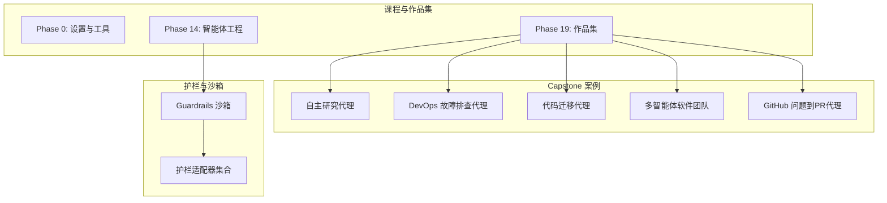
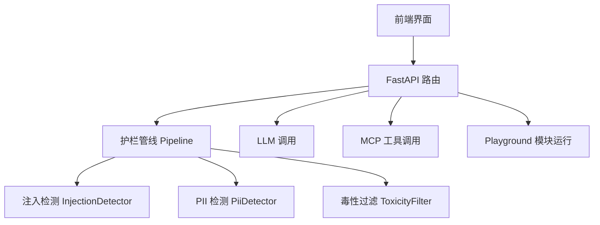
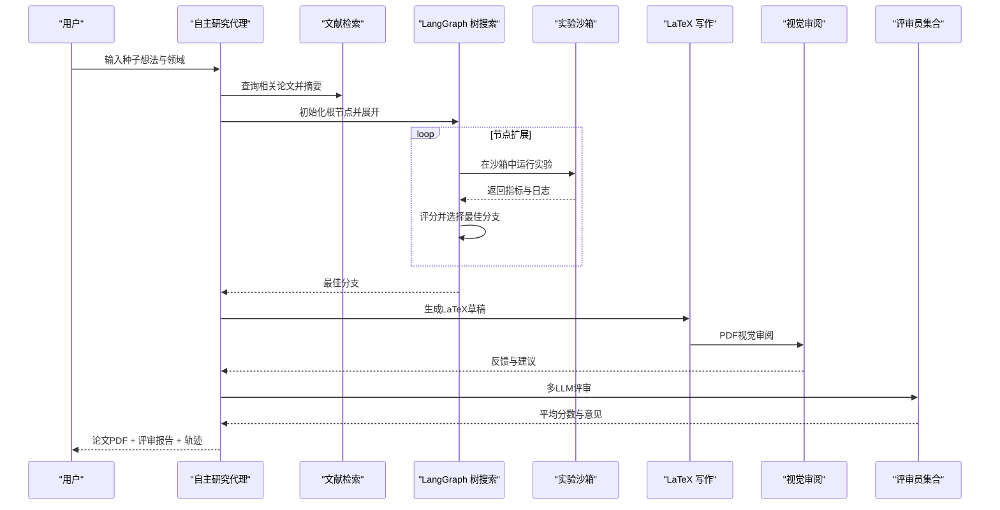
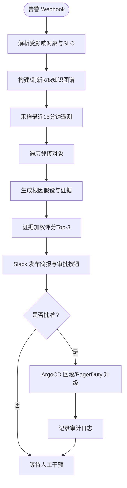
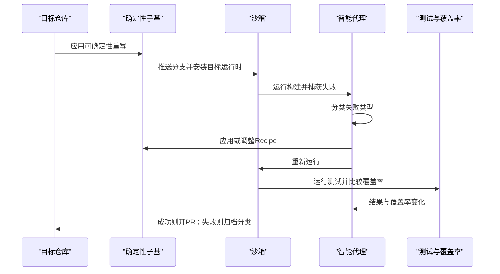
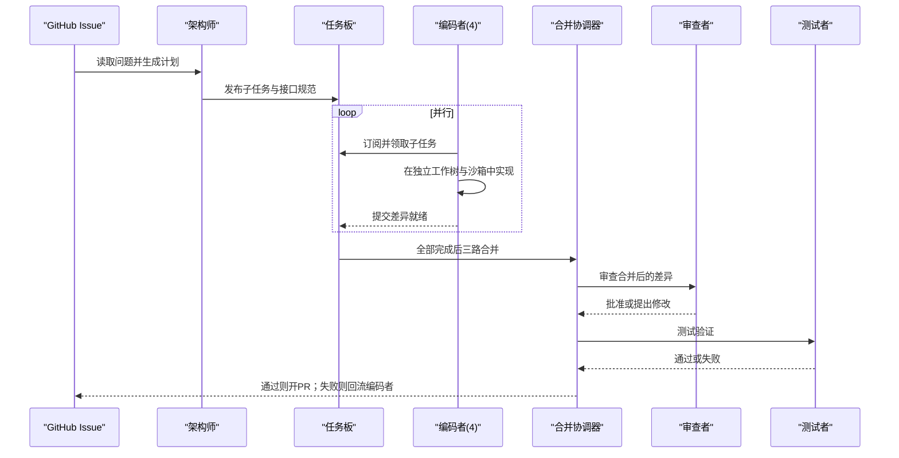
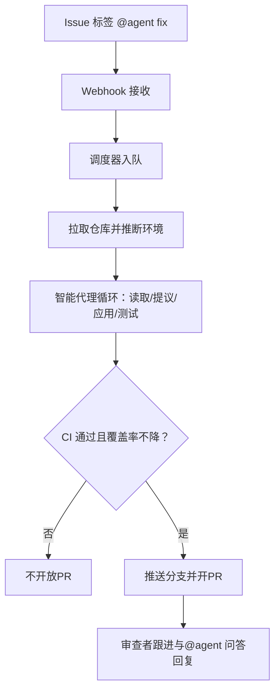
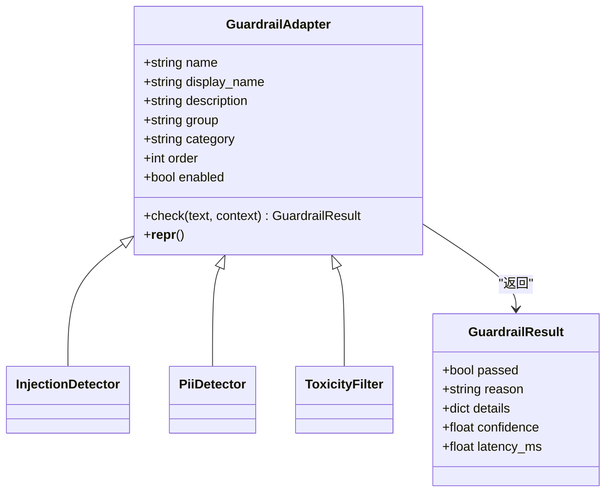
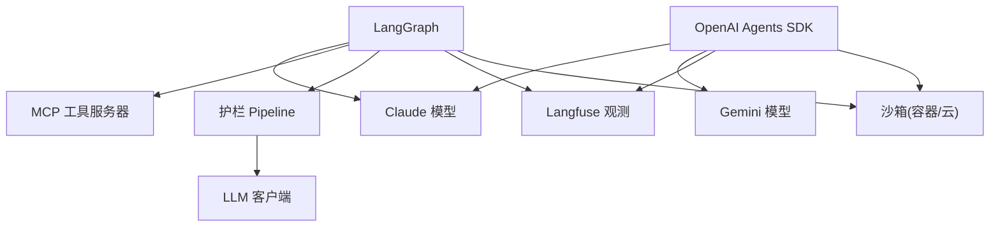

# 智能体系统项目

<cite>
**本文引用的文件**
- [README.md](file://README.md)
- [AGENTS.md](file://AGENTS.md)
- [phases/19-capstone-projects/05-autonomous-research-agent/docs/en.md](file://phases/19-capstone-projects/05-autonomous-research-agent/docs/en.md)
- [phases/19-capstone-projects/06-devops-troubleshooting-agent/docs/en.md](file://phases/19-capstone-projects/06-devops-troubleshooting-agent/docs/en.md)
- [phases/19-capstone-projects/09-code-migration-agent/docs/en.md](file://phases/19-capstone-projects/09-code-migration-agent/docs/en.md)
- [phases/19-capstone-projects/10-multi-agent-software-team/docs/en.md](file://phases/19-capstone-projects/10-multi-agent-software-team/docs/en.md)
- [phases/19-capstone-projects/16-github-issue-to-pr-agent/docs/en.md](file://phases/19-capstone-projects/16-github-issue-to-pr-agent/docs/en.md)
- [guardrails-sandbox/backend/main.py](file://guardrails-sandbox/backend/main.py)
- [guardrails-sandbox/backend/adapters/base.py](file://guardrails-sandbox/backend/adapters/base.py)
- [guardrails-sandbox/backend/adapters/injection.py](file://guardrails-sandbox/backend/adapters/injection.py)
- [guardrails-sandbox/backend/adapters/pii_detector.py](file://guardrails-sandbox/backend/adapters/pii_detector.py)
- [guardrails-sandbox/backend/adapters/toxicity.py](file://guardrails-sandbox/backend/adapters/toxicity.py)
</cite>

## 目录
1. [引言](#引言)
2. [项目结构](#项目结构)
3. [核心组件](#核心组件)
4. [架构总览](#架构总览)
5. [详细组件分析](#详细组件分析)
6. [依赖关系分析](#依赖关系分析)
7. [性能考虑](#性能考虑)
8. [故障排查指南](#故障排查指南)
9. [结论](#结论)
10. [附录](#附录)

## 引言
本项目是一个系统化的“从零开始构建AI工程”的课程与实践平台，涵盖数学基础、机器学习、深度学习、生成式AI、多模态、工具与协议、智能体工程、自治系统、多智能体与集群、基础设施与生产、伦理与对齐、以及最终作品集（Capstone）等20个阶段。每个阶段由大量“可复用工件”组成：提示词、技能、智能体、MCP服务器等。本文聚焦于复杂智能体系统的设计与实现，包括自主研究代理、DevOps故障排查代理、代码迁移代理、多智能体软件团队、GitHub问题到PR代理等，深入解析其状态管理、记忆系统、工具调用、计划执行等核心能力，并总结框架选择、任务分解策略、协作机制设计等关键技术决策，提供调试、监控、安全防护等工程实践，以及部署配置、API接口与集成示例。

## 项目结构
- 课程与作品集组织方式：每个阶段下包含若干课程，每门课程有统一的目录结构：docs/（讲解文档）、code/（可运行实现）、outputs/（可复用工件）。课程遵循“先手写实现，再用生产库复现”的“Build It / Use It”闭环。
- Capstone项目：第19阶段为作品集，包含多个复杂智能体系统案例，覆盖研究、运维、迁移、团队协作、自动化PR等真实工程场景。
- 安全与护栏：guardrails-sandbox提供护栏适配器（输入/输出安全检查）与交互式沙箱前端，支持护栏开关、历史记录、基准测试、MCP工具调用等。

图表来源
- [README.md:243-81](file://README.md#L243-L81)
- [phases/19-capstone-projects/05-autonomous-research-agent/docs/en.md:25-59](file://phases/19-capstone-projects/05-autonomous-research-agent/docs/en.md#L25-L59)
- [phases/19-capstone-projects/06-devops-troubleshooting-agent/docs/en.md:25-54](file://phases/19-capstone-projects/06-devops-troubleshooting-agent/docs/en.md#L25-L54)
- [phases/19-capstone-projects/09-code-migration-agent/docs/en.md:25-53](file://phases/19-capstone-projects/09-code-migration-agent/docs/en.md#L25-L53)
- [phases/19-capstone-projects/10-multi-agent-software-team/docs/en.md:25-54](file://phases/19-capstone-projects/10-multi-agent-software-team/docs/en.md#L25-L54)
- [phases/19-capstone-projects/16-github-issue-to-pr-agent/docs/en.md:25-55](file://phases/19-capstone-projects/16-github-issue-to-pr-agent/docs/en.md#L25-L55)
- [guardrails-sandbox/backend/main.py:24-58](file://guardrails-sandbox/backend/main.py#L24-L58)

章节来源
- [README.md:243-81](file://README.md#L243-L81)
- [AGENTS.md:15-34](file://AGENTS.md#L15-L34)

## 核心组件
- 智能体循环与计划执行：课程与作品集中广泛采用ReAct风格的工具调用循环、计划-执行-验证树搜索、LangGraph状态机等范式，支撑复杂推理与行动。
- 记忆与状态：LangGraph检查点、持久化状态、任务板共享状态、工作树隔离等，确保跨步骤与跨角色的状态一致性。
- 工具与协议：MCP（Model Context Protocol）作为标准化工具传输层，结合JSON-RPC over stdio，提供安全可控的工具调用。
- 护栏与安全：基于正则与分类器的输入/输出护栏，支持动态开关、阻断原因与置信度，配合沙箱隔离与最小权限RBAC。
- 观测与评估：Langfuse追踪、基准测试、覆盖率与成本控制、MTTR/MTBF等指标，贯穿开发与生产。

章节来源
- [phases/19-capstone-projects/05-autonomous-research-agent/docs/en.md:72-107](file://phases/19-capstone-projects/05-autonomous-research-agent/docs/en.md#L72-L107)
- [phases/19-capstone-projects/06-devops-troubleshooting-agent/docs/en.md:67-99](file://phases/19-capstone-projects/06-devops-troubleshooting-agent/docs/en.md#L67-L99)
- [phases/19-capstone-projects/09-code-migration-agent/docs/en.md:66-95](file://phases/19-capstone-projects/09-code-migration-agent/docs/en.md#L66-L95)
- [phases/19-capstone-projects/10-multi-agent-software-team/docs/en.md:67-103](file://phases/19-capstone-projects/10-multi-agent-software-team/docs/en.md#L67-L103)
- [phases/19-capstone-projects/16-github-issue-to-pr-agent/docs/en.md:68-100](file://phases/19-capstone-projects/16-github-issue-to-pr-agent/docs/en.md#L68-L100)
- [guardrails-sandbox/backend/main.py:155-221](file://guardrails-sandbox/backend/main.py#L155-L221)

## 架构总览
以下图展示护栏沙箱与智能体系统的整体交互：前端通过FastAPI路由访问护栏管线，护栏对输入进行多层检查；通过LLM生成响应后，再进行输出护栏；同时支持MCP工具调用与Playground模块运行。

图表来源
- [guardrails-sandbox/backend/main.py:121-281](file://guardrails-sandbox/backend/main.py#L121-L281)
- [guardrails-sandbox/backend/adapters/injection.py:44-88](file://guardrails-sandbox/backend/adapters/injection.py#L44-L88)
- [guardrails-sandbox/backend/adapters/pii_detector.py:19-54](file://guardrails-sandbox/backend/adapters/pii_detector.py#L19-L54)
- [guardrails-sandbox/backend/adapters/toxicity.py:22-64](file://guardrails-sandbox/backend/adapters/toxicity.py#L22-L64)

## 详细组件分析

### 自主研究代理（AI-Scientist 类）
- 目标：在限定预算内，通过树搜索与实验沙箱，产出NeurIPS风格论文与评审意见。
- 关键能力
  - 树搜索：最佳优先扩展，节点评分综合新颖性、质量与预算。
  - 实验沙箱：容器隔离、网络禁用、资源上限、确定性种子。
  - 写作-评审闭环：LaTeX草稿、视觉审阅（VLM）、评审员集合打分。
  - 红队审计：针对沙箱逃逸的对抗测试。
- 状态与记忆：LangGraph检查点、人类审批门禁、轨迹记录。
- 工具与协议：MCP工具用于文献检索、实验执行；Langfuse观测。

图表来源
- [phases/19-capstone-projects/05-autonomous-research-agent/docs/en.md:25-59](file://phases/19-capstone-projects/05-autonomous-research-agent/docs/en.md#L25-L59)
- [phases/19-capstone-projects/05-autonomous-research-agent/docs/en.md:72-107](file://phases/19-capstone-projects/05-autonomous-research-agent/docs/en.md#L72-L107)

章节来源
- [phases/19-capstone-projects/05-autonomous-research-agent/docs/en.md:1-156](file://phases/19-capstone-projects/05-autonomous-research-agent/docs/en.md#L1-L156)

### DevOps 故障排查代理（Kubernetes）
- 目标：告警触发后，读取可观测性数据，构建K8s知识图谱，生成根因假设并通过Slack审批后执行修复。
- 关键能力
  - 知识图谱：K8s对象与遥测边，定期同步kube-state-metrics。
  - 证据评分：近期性、具体性、路径长度反比、引用计数加权。
  - 审批门禁：破坏性动作需Slack批准；审计日志记录“考虑过但未执行”的命令。
- 安全与合规：默认只读RBAC、加固MCP工具服务器、审计日志归档。

图表来源
- [phases/19-capstone-projects/06-devops-troubleshooting-agent/docs/en.md:25-54](file://phases/19-capstone-projects/06-devops-troubleshooting-agent/docs/en.md#L25-L54)
- [phases/19-capstone-projects/06-devops-troubleshooting-agent/docs/en.md:67-99](file://phases/19-capstone-projects/06-devops-troubleshooting-agent/docs/en.md#L67-L99)

章节来源
- [phases/19-capstone-projects/06-devops-troubleshooting-agent/docs/en.md:1-148](file://phases/19-capstone-projects/06-devops-troubleshooting-agent/docs/en.md#L1-L148)

### 代码迁移代理（仓库级语言/运行时升级）
- 目标：在沙箱中自动完成大型仓库的语言/运行时迁移，产出绿色CI分支或失败分类。
- 关键能力
  - 确定性子基：OpenRewrite（Java）或libcst（Python）处理机械重写。
  - 智能代理层：处理Recipes无法覆盖的歧义、构建漂移、依赖冲突、测试波动。
  - 预算与门禁：时间、成本、最大轮次限制；测试覆盖率不降。
- 失败分类：构建、语法、测试、构建工具、预算耗尽等，形成可迭代的Recipe优化闭环。

图表来源
- [phases/19-capstone-projects/09-code-migration-agent/docs/en.md:25-53](file://phases/19-capstone-projects/09-code-migration-agent/docs/en.md#L25-L53)
- [phases/19-capstone-projects/09-code-migration-agent/docs/en.md:66-95](file://phases/19-capstone-projects/09-code-migration-agent/docs/en.md#L66-L95)

章节来源
- [phases/19-capstone-projects/09-code-migration-agent/docs/en.md:1-144](file://phases/19-capstone-projects/09-code-migration-agent/docs/en.md#L1-L144)

### 多智能体软件团队
- 目标：通过角色化智能体并行工作，实现从架构规划到合并审查再到测试验证的流水线。
- 关键能力
  - 角色分工：架构师（规划与子任务）、编码者（并行工作树）、审查者（Gate）、测试者（验证）。
  - 通信协议：A2A协议的Typed消息；共享任务板；合并协调器。
  - 并行吞吐：工作树隔离与沙箱；Token效率与单智能体基线对比。
- 失败分析：手头失效直方图，定位规划不清、合并冲突、审查误判、测试竞争等。

图表来源
- [phases/19-capstone-projects/10-multi-agent-software-team/docs/en.md:25-54](file://phases/19-capstone-projects/10-multi-agent-software-team/docs/en.md#L25-L54)
- [phases/19-capstone-projects/10-multi-agent-software-team/docs/en.md:67-103](file://phases/19-capstone-projects/10-multi-agent-software-team/docs/en.md#L67-L103)

章节来源
- [phases/19-capstone-projects/10-multi-agent-software-team/docs/en.md:1-152](file://phases/19-capstone-projects/10-multi-agent-software-team/docs/en.md#L1-L152)

### GitHub 问题到PR代理
- 目标：通过标签触发，自动在云沙箱中克隆仓库、推断环境、运行测试、编辑文件并打开审查就绪的PR。
- 关键能力
  - 触发与调度：GitHub App + Lambda/Runner；队列与预算控制。
  - 环境推断：语言与包管理器检测，必要时生成Dockerfile。
  - 安全边界：App短令牌、分支保护、禁止写入工作流、预算与强制无强推。
- 验证与发布：沙箱内完整CI与覆盖率检查；PR正文包含理由、差异摘要与轨迹链接。

图表来源
- [phases/19-capstone-projects/16-github-issue-to-pr-agent/docs/en.md:25-55](file://phases/19-capstone-projects/16-github-issue-to-pr-agent/docs/en.md#L25-L55)
- [phases/19-capstone-projects/16-github-issue-to-pr-agent/docs/en.md:68-100](file://phases/19-capstone-projects/16-github-issue-to-pr-agent/docs/en.md#L68-L100)

章节来源
- [phases/19-capstone-projects/16-github-issue-to-pr-agent/docs/en.md:1-149](file://phases/19-capstone-projects/16-github-issue-to-pr-agent/docs/en.md#L1-L149)

### 护栏与安全沙箱
- 护栏适配器基类：定义统一的检查接口、分组/类别/顺序与启用状态。
- 典型适配器
  - 注入检测：正则匹配已知越狱/覆盖指令模式与编码绕过。
  - PII检测：识别手机号、邮箱、身份证、信用卡等敏感信息。
  - 毒性过滤：过滤暴力、违法、自残、仇恨、色情内容，支持安全上下文豁免。
- FastAPI服务：提供护栏查询、切换、对比模式、基准测试、MCP工具调用、Playground模块运行等接口。

图表来源
- [guardrails-sandbox/backend/adapters/base.py:5-34](file://guardrails-sandbox/backend/adapters/base.py#L5-L34)
- [guardrails-sandbox/backend/adapters/injection.py:44-88](file://guardrails-sandbox/backend/adapters/injection.py#L44-L88)
- [guardrails-sandbox/backend/adapters/pii_detector.py:19-54](file://guardrails-sandbox/backend/adapters/pii_detector.py#L19-L54)
- [guardrails-sandbox/backend/adapters/toxicity.py:22-64](file://guardrails-sandbox/backend/adapters/toxicity.py#L22-L64)

章节来源
- [guardrails-sandbox/backend/main.py:1-421](file://guardrails-sandbox/backend/main.py#L1-L421)
- [guardrails-sandbox/backend/adapters/base.py:1-34](file://guardrails-sandbox/backend/adapters/base.py#L1-L34)
- [guardrails-sandbox/backend/adapters/injection.py:1-88](file://guardrails-sandbox/backend/adapters/injection.py#L1-L88)
- [guardrails-sandbox/backend/adapters/pii_detector.py:1-54](file://guardrails-sandbox/backend/adapters/pii_detector.py#L1-L54)
- [guardrails-sandbox/backend/adapters/toxicity.py:1-64](file://guardrails-sandbox/backend/adapters/toxicity.py#L1-L64)

## 依赖关系分析
- 框架与库
  - 智能体工程：LangGraph、OpenAI Agents SDK、Claude/Gemini等模型。
  - 工具与协议：MCP（JSON-RPC over stdio）、FastMCP、Langfuse。
  - 安全护栏：正则表达式、分类器、SentenceTransformers（离线加载）。
  - 基础设施：ECS Fargate、Lambda、SQS、Daytona/E2B沙箱、ArgoCD、PagerDuty、Slack。
- 组件耦合
  - 智能体与护栏：输入护栏前置检查，输出护栏后置检查，二者通过Pipeline串联。
  - 智能体与工具：通过MCP工具服务器调用，支持动态列举与调用。
  - 多智能体：共享任务板与A2A协议消息，合并协调器负责冲突解决。

图表来源
- [phases/19-capstone-projects/05-autonomous-research-agent/docs/en.md:63-71](file://phases/19-capstone-projects/05-autonomous-research-agent/docs/en.md#L63-L71)
- [phases/19-capstone-projects/06-devops-troubleshooting-agent/docs/en.md:58-66](file://phases/19-capstone-projects/06-devops-troubleshooting-agent/docs/en.md#L58-L66)
- [phases/19-capstone-projects/09-code-migration-agent/docs/en.md:57-65](file://phases/19-capstone-projects/09-code-migration-agent/docs/en.md#L57-L65)
- [phases/19-capstone-projects/10-multi-agent-software-team/docs/en.md:58-66](file://phases/19-capstone-projects/10-multi-agent-software-team/docs/en.md#L58-L66)
- [phases/19-capstone-projects/16-github-issue-to-pr-agent/docs/en.md:59-67](file://phases/19-capstone-projects/16-github-issue-to-pr-agent/docs/en.md#L59-L67)
- [guardrails-sandbox/backend/main.py:155-221](file://guardrails-sandbox/backend/main.py#L155-L221)

## 性能考虑
- 计算与成本
  - 预算与门禁：每项Capstone设定硬预算（美元/时间/轮次），避免无限开销。
  - Token效率：多智能体流水线中，跨角色边界会放大Token消耗，需对比单智能体基线。
- 推理与检索
  - 文献检索与知识图谱：FAISS缓存、kube-state-metrics增量同步，降低延迟。
  - 证据评分：近期性、具体性、路径长度反比与引用计数，提升根因质量。
- 沙箱与并发
  - 并行工作树与多编码者：显著缩短墙钟时间，但需关注合并冲突与测试竞争。
  - 沙箱隔离：容器启动与资源上限影响端到端延迟，需预热与容量规划。

## 故障排查指南
- 护栏拦截
  - 输入拦截：注入检测、PII检测、毒性过滤等触发时，返回阻断阶段、原因与置信度详情。
  - 输出拦截：格式校验、事实性判断、泄漏检测等触发时，记录拦截详情。
- 日志与追踪
  - Langfuse：为每个任务/PR建立可追溯的span，标注角色/工具调用/成本。
  - 护栏历史：支持清空与统计，便于定位高频阻断场景。
- 安全与合规
  - GitHub App权限：最小权限与分支保护；禁止写入工作流；无强推策略。
  - MCP工具：破坏性操作仅在审批后执行，审计日志详尽记录“考虑过但未执行”。

章节来源
- [guardrails-sandbox/backend/main.py:155-221](file://guardrails-sandbox/backend/main.py#L155-L221)
- [guardrails-sandbox/backend/main.py:141-153](file://guardrails-sandbox/backend/main.py#L141-L153)
- [phases/19-capstone-projects/16-github-issue-to-pr-agent/docs/en.md:70-85](file://phases/19-capstone-projects/16-github-issue-to-pr-agent/docs/en.md#L70-L85)

## 结论
本项目通过系统化的课程与作品集，提供了从数学基础到生产落地的完整AI工程路径。复杂智能体系统在护栏与沙箱保障下，实现了安全、可控、可观测的自动化流程。关键在于：
- 以LangGraph与A2A协议为核心的编排与协作；
- 以护栏与沙箱为基础的安全与合规；
- 以预算与门禁为约束的成本与质量控制；
- 以观测与基准测试为反馈的持续改进。

这些原则既适用于单一智能体，也适用于多智能体团队与自治系统，为工程化落地提供了可复用的范式与工具链。

## 附录
- 部署与运行
  - 沙箱服务：FastAPI服务监听本地端口，静态资源挂载；可通过路由访问护栏、MCP工具与Playground模块。
  - MCP工具：通过Stdio客户端连接本地MCP服务器，支持列举与调用。
  - 观测：Langfuse追踪与对比模式，便于评估护栏效果与成本。
- API参考
  - 护栏：获取护栏树、切换护栏、清空历史、重置统计。
  - 对话：普通对话、对比模式（有护栏 vs 无护栏）、LLM错误兜底。
  - MCP：列举工具、调用工具。
  - Playground：按分组列出模块、运行模块。
  - 检查点：列出可用数据库、只读检查点解码。

章节来源
- [guardrails-sandbox/backend/main.py:121-281](file://guardrails-sandbox/backend/main.py#L121-L281)
- [guardrails-sandbox/backend/main.py:324-378](file://guardrails-sandbox/backend/main.py#L324-L378)