# 核心组件项目

<cite>
**本文引用的文件**
- [phases/19-capstone-projects/20-agent-harness-loop-contract/code/main.py](file://phases/19-capstone-projects/20-agent-harness-loop-contract/code/main.py)
- [phases/19-capstone-projects/20-agent-harness-loop-contract/code/tests/test_loop.py](file://phases/19-capstone-projects/20-agent-harness-loop-contract/code/tests/test_loop.py)
- [phases/19-capstone-projects/21-tool-registry-schema-validation/code/main.py](file://phases/19-capstone-projects/21-tool-registry-schema-validation/code/main.py)
- [phases/19-capstone-projects/21-tool-registry-schema-validation/code/tests/test_registry.py](file://phases/19-capstone-projects/21-tool-registry-schema-validation/code/tests/test_registry.py)
- [phases/19-capstone-projects/22-jsonrpc-stdio-transport/code/main.py](file://phases/19-capstone-projects/22-jsonrpc-stdio-transport/code/main.py)
- [phases/19-capstone-projects/22-jsonrpc-stdio-transport/code/tests/test_transport.py](file://phases/19-capstone-projects/22-jsonrpc-stdio-transport/code/tests/test_transport.py)
- [phases/19-capstone-projects/23-function-call-dispatcher/code/main.py](file://phases/19-capstone-projects/23-function-call-dispatcher/code/main.py)
- [phases/19-capstone-projects/23-function-call-dispatcher/code/tests/test_dispatcher.py](file://phases/19-capstone-projects/23-function-call-dispatcher/code/tests/test_dispatcher.py)
- [phases/19-capstone-projects/24-plan-execute-control-flow/code/main.py](file://phases/19-capstone-projects/24-plan-execute-control-flow/code/main.py)
- [phases/19-capstone-projects/24-plan-execute-control-flow/code/tests/test_agent.py](file://phases/19-capstone-projects/24-plan-execute-control-flow/code/tests/test_agent.py)
- [phases/19-capstone-projects/25-verification-gates-observation-budget/code/main.py](file://phases/19-capstone-projects/25-verification-gates-observation-budget/code/main.py)
- [phases/19-capstone-projects/25-verification-gates-observation-budget/code/tests/test_main.py](file://phases/19-capstone-projects/25-verification-gates-observation-budget/code/tests/test_main.py)
- [phases/19-capstone-projects/26-sandbox-runner-denylist/code/main.py](file://phases/19-capstone-projects/26-sandbox-runner-denylist/code/main.py)
- [phases/19-capstone-projects/26-sandbox-runner-denylist/code/tests/test_main.py](file://phases/19-capstone-projects/26-sandbox-runner-denylist/code/tests/test_main.py)
- [phases/19-capstone-projects/27-eval-harness-fixture-tasks/code/main.py](file://phases/19-capstone-projects/27-eval-harness-fixture-tasks/code/main.py)
- [phases/19-capstone-projects/27-eval-harness-fixture-tasks/code/tasks/task_001_fizzbuzz_offbyone/buggy/fizzbuzz.py](file://phases/19-capstone-projects/27-eval-harness-fixture-tasks/code/tasks/task_001_fizzbuzz_offbyone/buggy/fizzbuzz.py)
- [phases/19-capstone-projects/27-eval-harness-fixture-tasks/code/tasks/task_001_fizzbuzz_offbyone/expected/fizzbuzz.py](file://phases/19-capstone-projects/27-eval-harness-fixture-tasks/code/tasks/task_001_fizzbuzz_offbyone/expected/fizzbuzz.py)
- [phases/19-capstone-projects/27-eval-harness-fixture-tasks/code/tasks/task_001_fizzbuzz_offbyone/task.json](file://phases/19-capstone-projects/27-eval-harness-fixture-tasks/code/tasks/task_001_fizzbuzz_offbyone/task.json)
- [phases/19-capstone-projects/27-eval-harness-fixture-tasks/code/tasks/task_002_factorial_missing_return/buggy/factorial.py](file://phases/19-capstone-projects/27-eval-harness-fixture-tasks/code/tasks/task_002_factorial_missing_return/buggy/factorial.py)
- [phases/19-capstone-projects/27-eval-harness-fixture-tasks/code/tasks/task_002_factorial_missing_return/expected/factorial.py](file://phases/19-capstone-projects/27-eval-harness-fixture-tasks/code/tasks/task_002_factorial_missing_return/expected/factorial.py)
- [phases/19-capstone-projects/27-eval-harness-fixture-tasks/code/tasks/task_002_factorial_missing_return/task.json](file://phases/19-capstone-projects/27-eval-harness-fixture-tasks/code/tasks/task_002_factorial_missing_return/task.json)
- [phases/19-capstone-projects/27-eval-harness-fixture-tasks/code/tasks/task_003_error_message_typo/buggy/errors.py](file://phases/19-capstone-projects/27-eval-harness-fixture-tasks/code/tasks/task_003_error_message_typo/buggy/errors.py)
- [phases/19-capstone-projects/27-eval-harness-fixture-tasks/code/tasks/task_003_error_message_typo/expected/errors.py](file://phases/19-capstone-projects/27-eval-harness-fixture-tasks/code/tasks/task_003_error_message_typo/expected/errors.py)
- [phases/19-capstone-projects/27-eval-harness-fixture-tasks/code/tasks/task_003_error_message_typo/task.json](file://phases/19-capstone-projects/27-eval-harness-fixture-tasks/code/tasks/task_003_error_message_typo/task.json)
- [phases/19-capstone-projects/27-eval-harness-fixture-tasks/code/tasks/task_004_empty_reverse/buggy/reverse.py](file://phases/19-capstone-projects/27-eval-harness-fixture-tasks/code/tasks/task_004_empty_reverse/buggy/reverse.py)
- [phases/19-capstone-projects/27-eval-harness-fixture-tasks/code/tasks/task_004_empty_reverse/expected/reverse.py](file://phases/19-capstone-projects/27-eval-harness-fixture-tasks/code/tasks/task_004_empty_reverse/expected/reverse.py)
- [phases/19-capstone-projects/27-eval-harness-fixture-tasks/code/tasks/task_004_empty_reverse/task.json](file://phases/19-capstone-projects/27-eval-harness-fixture-tasks/code/tasks/task_004_empty_reverse/task.json)
- [phases/19-capstone-projects/27-eval-harness-fixture-tasks/code/tasks/task_005_linked_list_traversal/buggy/linked_list.py](file://phases/19-capstone-projects/27-eval-harness-fixture-tasks/code/tasks/task_005_linked_list_traversal/buggy/linked_list.py)
- [phases/19-capstone-projects/27-eval-harness-fixture-tasks/code/tasks/task_005_linked_list_traversal/expected/linked_list.py](file://phases/19-capstone-projects/27-eval-harness-fixture-tasks/code/tasks/task_005_linked_list_traversal/expected/linked_list.py)
- [phases/19-capstone-projects/27-eval-harness-fixture-tasks/code/tasks/task_005_linked_list_traversal/task.json](file://phases/19-capstone-projects/27-eval-harness-fixture-tasks/code/tasks/task_005_linked_list_traversal/task.json)
- [phases/19-capstone-projects/27-eval-harness-fixture-tasks/code/tests/test_main.py](file://phases/19-capstone-projects/27-eval-harness-fixture-tasks/code/tests/test_main.py)
- [phases/19-capstone-projects/28-observability-otel-traces/code/main.py](file://phases/19-capstone-projects/28-observability-otel-traces/code/main.py)
- [phases/19-capstone-projects/28-observability-otel-traces/code/tests/test_main.py](file://phases/19-capstone-projects/28-observability-otel-traces/code/tests/test_main.py)
- [phases/19-capstone-projects/29-end-to-end-coding-task-demo/code/main.py](file://phases/19-capstone-projects/29-end-to-end-coding-task-demo/code/main.py)
- [phases/19-capstone-projects/29-end-to-end-coding-task-demo/code/fixture_repo/src/fizz.py](file://phases/19-capstone-projects/29-end-to-end-coding-task-demo/code/fixture_repo/src/fizz.py)
- [phases/19-capstone-projects/29-end-to-end-coding-task-demo/code/fixture_repo/tests/test_fizz.py](file://phases/19-capstone-projects/29-end-to-end-coding-task-demo/code/fixture_repo/tests/test_fizz.py)
- [phases/19-capstone-projects/29-end-to-end-coding-task-demo/code/tests/test_main.py](file://phases/19-capstone-projects/29-end-to-end-coding-task-demo/code/tests/test_main.py)
</cite>

## 目录
1. 引言
2. 项目结构
3. 核心组件
4. 架构总览
5. 组件详细分析
6. 依赖关系分析
7. 性能考量
8. 故障排查指南
9. 结论
10. 附录

## 引言
本技术文档聚焦于“核心组件项目”，围绕以下关键能力进行系统化梳理与说明：代理Harness循环契约、工具注册表模式验证、JSON-RPC标准传输、函数调用调度器、计划执行控制流、验证门观测预算、沙箱运行器拒绝列表、评估Harness固定任务、OpenTelemetry追踪、端到端编码任务演示。文档从接口设计、数据流转、错误处理、性能优化等方面展开，并给出单元测试、集成测试、性能基准测试的质量保障策略；同时总结组件复用、扩展性设计与兼容性考虑，强调代码质量、文档完善与社区贡献价值。

## 项目结构
本项目采用“阶段-主题-子任务”的组织方式，每个主题下包含：
- code：核心实现与测试
- docs：英文/中文说明文档
- quiz.json / quiz.zh.json：测验题与参考答案

下图展示本次文档关注的十个核心子任务与其代码与测试分布：

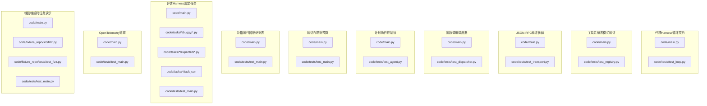

**图表来源**
- [phases/19-capstone-projects/20-agent-harness-loop-contract/code/main.py:1-200](file://phases/19-capstone-projects/20-agent-harness-loop-contract/code/main.py#L1-L200)
- [phases/19-capstone-projects/20-agent-harness-loop-contract/code/tests/test_loop.py:1-200](file://phases/19-capstone-projects/20-agent-harness-loop-contract/code/tests/test_loop.py#L1-L200)
- [phases/19-capstone-projects/21-tool-registry-schema-validation/code/main.py:1-200](file://phases/19-capstone-projects/21-tool-registry-schema-validation/code/main.py#L1-L200)
- [phases/19-capstone-projects/21-tool-registry-schema-validation/code/tests/test_registry.py:1-200](file://phases/19-capstone-projects/21-tool-registry-schema-validation/code/tests/test_registry.py#L1-L200)
- [phases/19-capstone-projects/22-jsonrpc-stdio-transport/code/main.py:1-200](file://phases/19-capstone-projects/22-jsonrpc-stdio-transport/code/main.py#L1-L200)
- [phases/19-capstone-projects/22-jsonrpc-stdio-transport/code/tests/test_transport.py:1-200](file://phases/19-capstone-projects/22-jsonrpc-stdio-transport/code/tests/test_transport.py#L1-L200)
- [phases/19-capstone-projects/23-function-call-dispatcher/code/main.py:1-200](file://phases/19-capstone-projects/23-function-call-dispatcher/code/main.py#L1-L200)
- [phases/19-capstone-projects/23-function-call-dispatcher/code/tests/test_dispatcher.py:1-200](file://phases/19-capstone-projects/23-function-call-dispatcher/code/tests/test_dispatcher.py#L1-L200)
- [phases/19-capstone-projects/24-plan-execute-control-flow/code/main.py:1-200](file://phases/19-capstone-projects/24-plan-execute-control-flow/code/main.py#L1-L200)
- [phases/19-capstone-projects/24-plan-execute-control-flow/code/tests/test_agent.py:1-200](file://phases/19-capstone-projects/24-plan-execute-control-flow/code/tests/test_agent.py#L1-L200)
- [phases/19-capstone-projects/25-verification-gates-observation-budget/code/main.py:1-200](file://phases/19-capstone-projects/25-verification-gates-observation-budget/code/main.py#L1-L200)
- [phases/19-capstone-projects/25-verification-gates-observation-budget/code/tests/test_main.py:1-200](file://phases/19-capstone-projects/25-verification-gates-observation-budget/code/tests/test_main.py#L1-L200)
- [phases/19-capstone-projects/26-sandbox-runner-denylist/code/main.py:1-200](file://phases/19-capstone-projects/26-sandbox-runner-denylist/code/main.py#L1-L200)
- [phases/19-capstone-projects/26-sandbox-runner-denylist/code/tests/test_main.py:1-200](file://phases/19-capstone-projects/26-sandbox-runner-denylist/code/tests/test_main.py#L1-L200)
- [phases/19-capstone-projects/27-eval-harness-fixture-tasks/code/main.py:1-200](file://phases/19-capstone-projects/27-eval-harness-fixture-tasks/code/main.py#L1-L200)
- [phases/19-capstone-projects/27-eval-harness-fixture-tasks/code/tasks/task_001_fizzbuzz_offbyone/buggy/fizzbuzz.py:1-200](file://phases/19-capstone-projects/27-eval-harness-fixture-tasks/code/tasks/task_001_fizzbuzz_offbyone/buggy/fizzbuzz.py#L1-L200)
- [phases/19-capstone-projects/27-eval-harness-fixture-tasks/code/tasks/task_001_fizzbuzz_offbyone/expected/fizzbuzz.py:1-200](file://phases/19-capstone-projects/27-eval-harness-fixture-tasks/code/tasks/task_001_fizzbuzz_offbyone/expected/fizzbuzz.py#L1-L200)
- [phases/19-capstone-projects/27-eval-harness-fixture-tasks/code/tasks/task_001_fizzbuzz_offbyone/task.json:1-200](file://phases/19-capstone-projects/27-eval-harness-fixture-tasks/code/tasks/task_001_fizzbuzz_offbyone/task.json#L1-L200)
- [phases/19-capstone-projects/27-eval-harness-fixture-tasks/code/tasks/task_002_factorial_missing_return/buggy/factorial.py:1-200](file://phases/19-capstone-projects/27-eval-harness-fixture-tasks/code/tasks/task_002_factorial_missing_return/buggy/factorial.py#L1-L200)
- [phases/19-capstone-projects/27-eval-harness-fixture-tasks/code/tasks/task_002_factorial_missing_return/expected/factorial.py:1-200](file://phases/19-capstone-projects/27-eval-harness-fixture-tasks/code/tasks/task_002_factorial_missing_return/expected/factorial.py#L1-L200)
- [phases/19-capstone-projects/27-eval-harness-fixture-tasks/code/tasks/task_002_factorial_missing_return/task.json:1-200](file://phases/19-capstone-projects/27-eval-harness-fixture-tasks/code/tasks/task_002_factorial_missing_return/task.json#L1-L200)
- [phases/19-capstone-projects/27-eval-harness-fixture-tasks/code/tasks/task_003_error_message_typo/buggy/errors.py:1-200](file://phases/19-capstone-projects/27-eval-harness-fixture-tasks/code/tasks/task_003_error_message_typo/buggy/errors.py#L1-L200)
- [phases/19-capstone-projects/27-eval-harness-fixture-tasks/code/tasks/task_003_error_message_typo/expected/errors.py:1-200](file://phases/19-capstone-projects/27-eval-harness-fixture-tasks/code/tasks/task_003_error_message_typo/expected/errors.py#L1-L200)
- [phases/19-capstone-projects/27-eval-harness-fixture-tasks/code/tasks/task_003_error_message_typo/task.json:1-200](file://phases/19-capstone-projects/27-eval-harness-fixture-tasks/code/tasks/task_003_error_message_typo/task.json#L1-L200)
- [phases/19-capstone-projects/27-eval-harness-fixture-tasks/code/tasks/task_004_empty_reverse/buggy/reverse.py:1-200](file://phases/19-capstone-projects/27-eval-harness-fixture-tasks/code/tasks/task_004_empty_reverse/buggy/reverse.py#L1-L200)
- [phases/19-capstone-projects/27-eval-harness-fixture-tasks/code/tasks/task_004_empty_reverse/expected/reverse.py:1-200](file://phases/19-capstone-projects/27-eval-harness-fixture-tasks/code/tasks/task_004_empty_reverse/expected/reverse.py#L1-L200)
- [phases/19-capstone-projects/27-eval-harness-fixture-tasks/code/tasks/task_004_empty_reverse/task.json:1-200](file://phases/19-capstone-projects/27-eval-harness-fixture-tasks/code/tasks/task_004_empty_reverse/task.json#L1-L200)
- [phases/19-capstone-projects/27-eval-harness-fixture-tasks/code/tasks/task_005_linked_list_traversal/buggy/linked_list.py:1-200](file://phases/19-capstone-projects/27-eval-harness-fixture-tasks/code/tasks/task_005_linked_list_traversal/buggy/linked_list.py#L1-L200)
- [phases/19-capstone-projects/27-eval-harness-fixture-tasks/code/tasks/task_005_linked_list_traversal/expected/linked_list.py:1-200](file://phases/19-capstone-projects/27-eval-harness-fixture-tasks/code/tasks/task_005_linked_list_traversal/expected/linked_list.py#L1-L200)
- [phases/19-capstone-projects/27-eval-harness-fixture-tasks/code/tasks/task_005_linked_list_traversal/task.json:1-200](file://phases/19-capstone-projects/27-eval-harness-fixture-tasks/code/tasks/task_005_linked_list_traversal/task.json#L1-L200)
- [phases/19-capstone-projects/27-eval-harness-fixture-tasks/code/tests/test_main.py:1-200](file://phases/19-capstone-projects/27-eval-harness-fixture-tasks/code/tests/test_main.py#L1-L200)
- [phases/19-capstone-projects/28-observability-otel-traces/code/main.py:1-200](file://phases/19-capstone-projects/28-observability-otel-traces/code/main.py#L1-L200)
- [phases/19-capstone-projects/28-observability-otel-traces/code/tests/test_main.py:1-200](file://phases/19-capstone-projects/28-observability-otel-traces/code/tests/test_main.py#L1-L200)
- [phases/19-capstone-projects/29-end-to-end-coding-task-demo/code/main.py:1-200](file://phases/19-capstone-projects/29-end-to-end-coding-task-demo/code/main.py#L1-L200)
- [phases/19-capstone-projects/29-end-to-end-coding-task-demo/code/fixture_repo/src/fizz.py:1-200](file://phases/19-capstone-projects/29-end-to-end-coding-task-demo/code/fixture_repo/src/fizz.py#L1-L200)
- [phases/19-capstone-projects/29-end-to-end-coding-task-demo/code/fixture_repo/tests/test_fizz.py:1-200](file://phases/19-capstone-projects/29-end-to-end-coding-task-demo/code/fixture_repo/tests/test_fizz.py#L1-L200)
- [phases/19-capstone-projects/29-end-to-end-coding-task-demo/code/tests/test_main.py:1-200](file://phases/19-capstone-projects/29-end-to-end-coding-task-demo/code/tests/test_main.py#L1-L200)

**章节来源**
- [phases/19-capstone-projects/20-agent-harness-loop-contract/docs/en.md](file://phases/19-capstone-projects/20-agent-harness-loop-contract/docs/en.md)
- [phases/19-capstone-projects/21-tool-registry-schema-validation/docs/en.md](file://phases/19-capstone-projects/21-tool-registry-schema-validation/docs/en.md)
- [phases/19-capstone-projects/22-jsonrpc-stdio-transport/docs/en.md](file://phases/19-capstone-projects/22-jsonrpc-stdio-transport/docs/en.md)
- [phases/19-capstone-projects/23-function-call-dispatcher/docs/en.md](file://phases/19-capstone-projects/23-function-call-dispatcher/docs/en.md)
- [phases/19-capstone-projects/24-plan-execute-control-flow/docs/en.md](file://phases/19-capstone-projects/24-plan-execute-control-flow/docs/en.md)
- [phases/19-capstone-projects/25-verification-gates-observation-budget/docs/en.md](file://phases/19-capstone-projects/25-verification-gates-observation-budget/docs/en.md)
- [phases/19-capstone-projects/26-sandbox-runner-denylist/docs/en.md](file://phases/19-capstone-projects/26-sandbox-runner-denylist/docs/en.md)
- [phases/19-capstone-projects/27-eval-harness-fixture-tasks/docs/en.md](file://phases/19-capstone-projects/27-eval-harness-fixture-tasks/docs/en.md)
- [phases/19-capstone-projects/28-observability-otel-traces/docs/en.md](file://phases/19-capstone-projects/28-observability-otel-traces/docs/en.md)
- [phases/19-capstone-projects/29-end-to-end-coding-task-demo/docs/en.md](file://phases/19-capstone-projects/29-end-to-end-coding-task-demo/docs/en.md)

## 核心组件
本节对十个核心子任务的职责、输入输出、关键流程与质量保障进行概览式介绍，便于快速定位与理解。

- 代理Harness循环契约：定义代理在每次迭代中必须满足的契约条件（如输入输出约束、状态一致性），确保循环稳定性与可验证性。
- 工具注册表模式验证：对工具注册表的模式进行校验，保证工具元数据与调用协议一致。
- JSON-RPC标准传输：基于标准JSON-RPC协议实现客户端与服务端之间的请求/响应编解码与传输。
- 函数调用调度器：根据工具注册表与调用参数，分发函数调用并聚合结果。
- 计划执行控制流：将高层计划分解为可执行步骤，按序或并发执行，并回填中间结果。
- 验证门观测预算：在验证阶段限制观测次数与成本，防止过度采样导致的偏差与开销。
- 沙箱运行器拒绝列表：通过拒绝列表过滤高风险操作，结合白名单与权限控制提升安全性。
- 评估Harness固定任务：以固定任务集作为评估基线，比较“错误版本”与“期望版本”的差异，形成可重复的评测报告。
- OpenTelemetry追踪：在关键路径埋点，采集Span与属性，统一追踪与指标上报。
- 端到端编码任务演示：从仓库克隆、测试执行到结果汇总的完整流水线演示。

**章节来源**
- [phases/19-capstone-projects/20-agent-harness-loop-contract/docs/en.md](file://phases/19-capstone-projects/20-agent-harness-loop-contract/docs/en.md)
- [phases/19-capstone-projects/21-tool-registry-schema-validation/docs/en.md](file://phases/19-capstone-projects/21-tool-registry-schema-validation/docs/en.md)
- [phases/19-capstone-projects/22-jsonrpc-stdio-transport/docs/en.md](file://phases/19-capstone-projects/22-jsonrpc-stdio-transport/docs/en.md)
- [phases/19-capstone-projects/23-function-call-dispatcher/docs/en.md](file://phases/19-capstone-projects/23-function-call-dispatcher/docs/en.md)
- [phases/19-capstone-projects/24-plan-execute-control-flow/docs/en.md](file://phases/19-capstone-projects/24-plan-execute-control-flow/docs/en.md)
- [phases/19-capstone-projects/25-verification-gates-observation-budget/docs/en.md](file://phases/19-capstone-projects/25-verification-gates-observation-budget/docs/en.md)
- [phases/19-capstone-projects/26-sandbox-runner-denylist/docs/en.md](file://phases/19-capstone-projects/26-sandbox-runner-denylist/docs/en.md)
- [phases/19-capstone-projects/27-eval-harness-fixture-tasks/docs/en.md](file://phases/19-capstone-projects/27-eval-harness-fixture-tasks/docs/en.md)
- [phases/19-capstone-projects/28-observability-otel-traces/docs/en.md](file://phases/19-capstone-projects/28-observability-otel-traces/docs/en.md)
- [phases/19-capstone-projects/29-end-to-end-coding-task-demo/docs/en.md](file://phases/19-capstone-projects/29-end-to-end-coding-task-demo/docs/en.md)

## 架构总览
下图给出上述十个组件在一次典型“端到端编码任务演示”中的交互关系与数据流向。该流程贯穿工具注册、传输编解码、调度执行、计划控制、安全沙箱、评估对比与可观测性追踪。

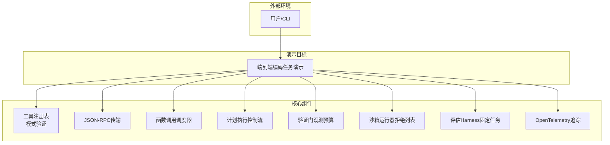

**图表来源**
- [phases/19-capstone-projects/21-tool-registry-schema-validation/code/main.py:1-200](file://phases/19-capstone-projects/21-tool-registry-schema-validation/code/main.py#L1-L200)
- [phases/19-capstone-projects/22-jsonrpc-stdio-transport/code/main.py:1-200](file://phases/19-capstone-projects/22-jsonrpc-stdio-transport/code/main.py#L1-L200)
- [phases/19-capstone-projects/23-function-call-dispatcher/code/main.py:1-200](file://phases/19-capstone-projects/23-function-call-dispatcher/code/main.py#L1-L200)
- [phases/19-capstone-projects/24-plan-execute-control-flow/code/main.py:1-200](file://phases/19-capstone-projects/24-plan-execute-control-flow/code/main.py#L1-L200)
- [phases/19-capstone-projects/25-verification-gates-observation-budget/code/main.py:1-200](file://phases/19-capstone-projects/25-verification-gates-observation-budget/code/main.py#L1-L200)
- [phases/19-capstone-projects/26-sandbox-runner-denylist/code/main.py:1-200](file://phases/19-capstone-projects/26-sandbox-runner-denylist/code/main.py#L1-L200)
- [phases/19-capstone-projects/27-eval-harness-fixture-tasks/code/main.py:1-200](file://phases/19-capstone-projects/27-eval-harness-fixture-tasks/code/main.py#L1-L200)
- [phases/19-capstone-projects/28-observability-otel-traces/code/main.py:1-200](file://phases/19-capstone-projects/28-observability-otel-traces/code/main.py#L1-L200)
- [phases/19-capstone-projects/29-end-to-end-coding-task-demo/code/main.py:1-200](file://phases/19-capstone-projects/29-end-to-end-coding-task-demo/code/main.py#L1-L200)

## 组件详细分析

### 代理Harness循环契约
- 设计要点
  - 循环契约：在每次迭代前/后检查输入输出边界、状态一致性与资源消耗上限。
  - 可验证性：将契约转化为断言与度量，便于自动化回归。
- 数据流
  - 输入：上一轮的输出与当前输入
  - 处理：执行一次推理/工具调用，更新内部状态
  - 输出：本轮输出与状态快照
- 错误处理
  - 越界/超时：触发降级策略（如减少步数、切换模型）
  - 不收敛：记录轨迹并终止
- 性能优化
  - 前置剪枝：在进入循环前做快速可行性判断
  - 缓存命中：复用历史计算结果
- 测试策略
  - 单元：构造多轮次输入序列，验证契约恒真
  - 回归：引入边界与异常场景，确保契约鲁棒性

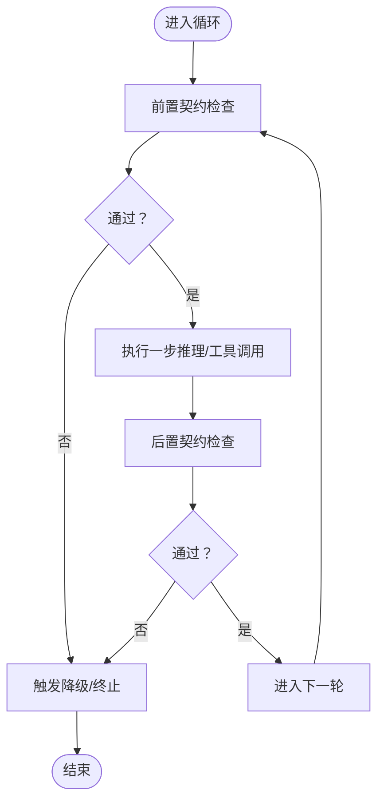

**图表来源**
- [phases/19-capstone-projects/20-agent-harness-loop-contract/code/main.py:1-200](file://phases/19-capstone-projects/20-agent-harness-loop-contract/code/main.py#L1-L200)

**章节来源**
- [phases/19-capstone-projects/20-agent-harness-loop-contract/code/main.py:1-200](file://phases/19-capstone-projects/20-agent-harness-loop-contract/code/main.py#L1-L200)
- [phases/19-capstone-projects/20-agent-harness-loop-contract/code/tests/test_loop.py:1-200](file://phases/19-capstone-projects/20-agent-harness-loop-contract/code/tests/test_loop.py#L1-L200)

### 工具注册表模式验证
- 设计要点
  - 注册表Schema：定义工具名称、参数类型、返回类型、权限与约束
  - 验证策略：静态Schema校验 + 运行时参数绑定校验
- 数据流
  - 输入：工具声明与调用参数
  - 处理：解析Schema，匹配参数类型与必填项
  - 输出：通过/失败与错误详情
- 错误处理
  - 类型不匹配：返回具体字段与期望类型
  - 缺失参数：提示必填字段清单
- 性能优化
  - Schema缓存：避免重复解析
  - 快速失败：尽早发现非法组合
- 测试策略
  - 单元：覆盖所有Schema字段与边界值
  - 集成：模拟真实调用路径，验证端到端可用性

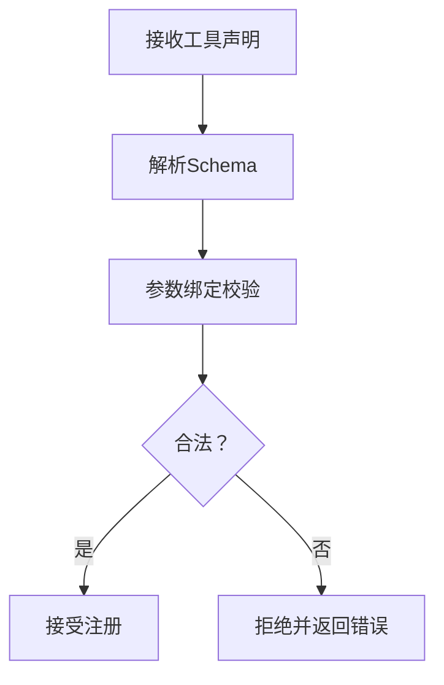

**图表来源**
- [phases/19-capstone-projects/21-tool-registry-schema-validation/code/main.py:1-200](file://phases/19-capstone-projects/21-tool-registry-schema-validation/code/main.py#L1-L200)

**章节来源**
- [phases/19-capstone-projects/21-tool-registry-schema-validation/code/main.py:1-200](file://phases/19-capstone-projects/21-tool-registry-schema-validation/code/main.py#L1-L200)
- [phases/19-capstone-projects/21-tool-registry-schema-validation/code/tests/test_registry.py:1-200](file://phases/19-capstone-projects/21-tool-registry-schema-validation/code/tests/test_registry.py#L1-L200)

### JSON-RPC标准传输
- 设计要点
  - 请求/响应格式：遵循标准字段与方法命名
  - 传输介质：标准输入输出（stdio）适配常见MCP/工具协议
- 数据流
  - 输入：客户端请求对象
  - 处理：解析请求、路由到对应处理器
  - 输出：响应对象或错误对象
- 错误处理
  - 解析失败：返回标准错误码与消息
  - 方法不存在：返回方法未找到错误
- 性能优化
  - 批量请求：合并多个小请求减少往返
  - 超时控制：为长耗时请求设置超时
- 测试策略
  - 单元：构造多种请求/响应场景
  - 集成：与真实客户端/服务端对接

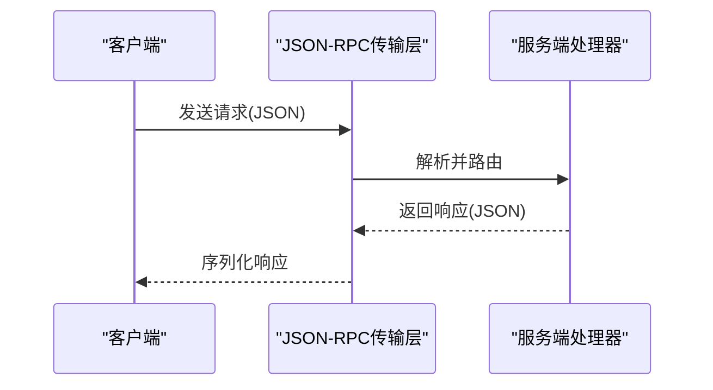

**图表来源**
- [phases/19-capstone-projects/22-jsonrpc-stdio-transport/code/main.py:1-200](file://phases/19-capstone-projects/22-jsonrpc-stdio-transport/code/main.py#L1-L200)

**章节来源**
- [phases/19-capstone-projects/22-jsonrpc-stdio-transport/code/main.py:1-200](file://phases/19-capstone-projects/22-jsonrpc-stdio-transport/code/main.py#L1-L200)
- [phases/19-capstone-projects/22-jsonrpc-stdio-transport/code/tests/test_transport.py:1-200](file://phases/19-capstone-projects/22-jsonrpc-stdio-transport/code/tests/test_transport.py#L1-L200)

### 函数调用调度器
- 设计要点
  - 分发策略：根据工具名与参数选择合适处理器
  - 并发控制：限制并发度，避免资源争用
  - 结果聚合：将多工具调用结果合并为统一格式
- 数据流
  - 输入：工具调用请求列表
  - 处理：路由、并发执行、异常捕获
  - 输出：聚合后的结果或错误集合
- 错误处理
  - 单点失败：不影响其他工具执行
  - 聚合错误：汇总失败原因并返回
- 性能优化
  - 连接池：复用底层连接
  - 调度优先级：高优任务优先
- 测试策略
  - 单元：覆盖单工具与多工具场景
  - 压力：模拟高并发与失败重试

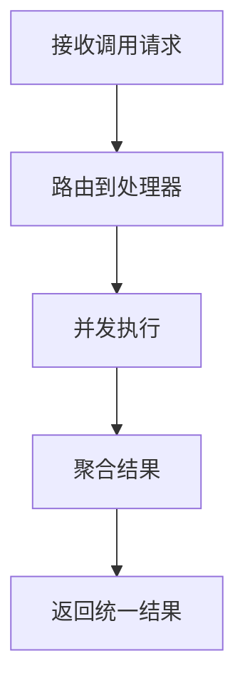

**图表来源**
- [phases/19-capstone-projects/23-function-call-dispatcher/code/main.py:1-200](file://phases/19-capstone-projects/23-function-call-dispatcher/code/main.py#L1-L200)

**章节来源**
- [phases/19-capstone-projects/23-function-call-dispatcher/code/main.py:1-200](file://phases/19-capstone-projects/23-function-call-dispatcher/code/main.py#L1-L200)
- [phases/19-capstone-projects/23-function-call-dispatcher/code/tests/test_dispatcher.py:1-200](file://phases/19-capstone-projects/23-function-call-dispatcher/code/tests/test_dispatcher.py#L1-L200)

### 计划执行控制流
- 设计要点
  - 计划拆解：将高层目标分解为原子步骤
  - 控制逻辑：顺序执行、条件跳转、循环与并行
  - 中间态回填：将步骤结果写入上下文供后续使用
- 数据流
  - 输入：初始计划与上下文
  - 处理：逐条执行步骤，维护上下文
  - 输出：最终结果与上下文快照
- 错误处理
  - 步骤失败：记录失败步骤与原因
  - 上下文污染：隔离失败影响范围
- 性能优化
  - 并行化：可并行步骤并发执行
  - 剪枝：提前终止不可能成功的分支
- 测试策略
  - 单元：每一步的输入输出与副作用
  - 集成：完整计划的端到端执行

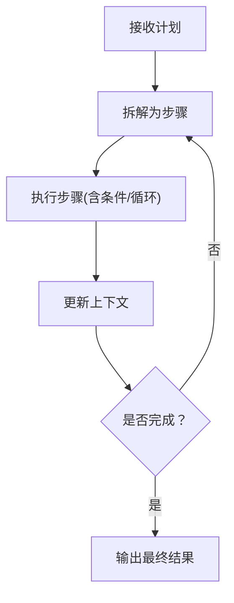

**图表来源**
- [phases/19-capstone-projects/24-plan-execute-control-flow/code/main.py:1-200](file://phases/19-capstone-projects/24-plan-execute-control-flow/code/main.py#L1-L200)

**章节来源**
- [phases/19-capstone-projects/24-plan-execute-control-flow/code/main.py:1-200](file://phases/19-capstone-projects/24-plan-execute-control-flow/code/main.py#L1-L200)
- [phases/19-capstone-projects/24-plan-execute-control-flow/code/tests/test_agent.py:1-200](file://phases/19-capstone-projects/24-plan-execute-control-flow/code/tests/test_agent.py#L1-L200)

### 验证门观测预算
- 设计要点
  - 观测预算：设定最大调用次数、时间与成本阈值
  - 动态调整：根据早期结果动态收紧或放宽预算
- 数据流
  - 输入：待验证样本与当前预算
  - 处理：在预算内尽可能多地采样与评估
  - 输出：评估结果与预算使用情况
- 错误处理
  - 预算不足：返回“无法评估”并记录原因
  - 结果不稳定：增加采样或提高置信度
- 性能优化
  - 自适应采样：优先选择高信息增益样本
  - 批量评估：合并相似样本减少重复工作
- 测试策略
  - 单元：不同预算配置下的收敛性
  - 回归：引入噪声与对抗样本，验证稳健性

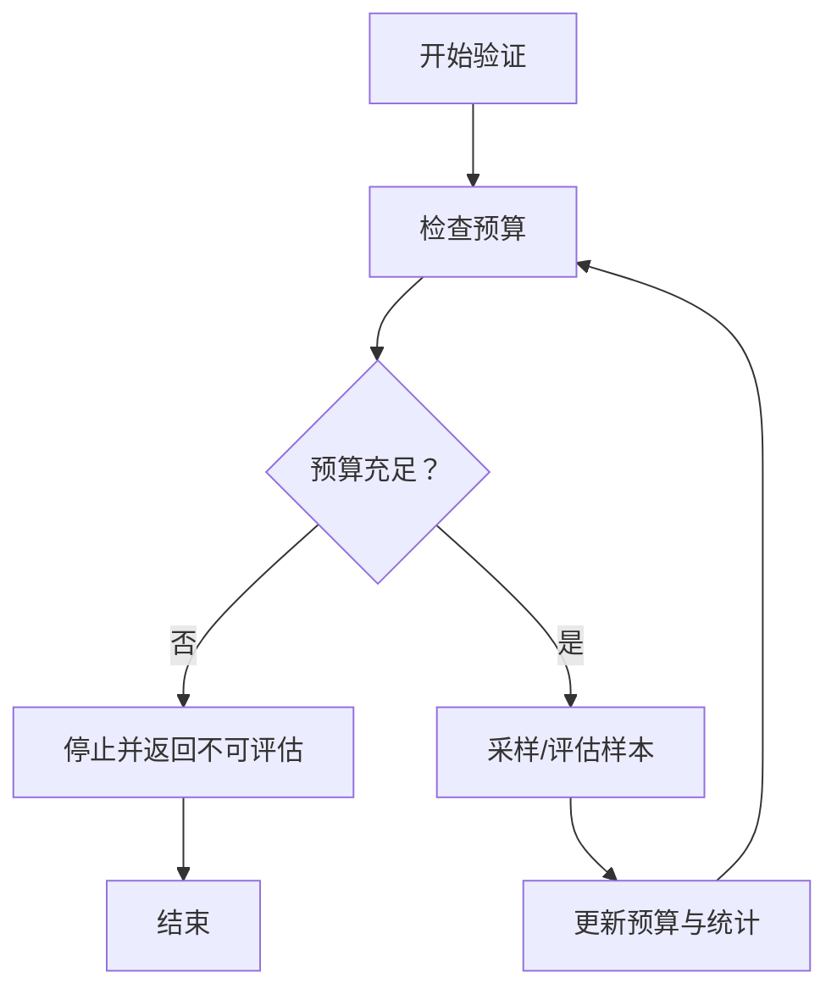

**图表来源**
- [phases/19-capstone-projects/25-verification-gates-observation-budget/code/main.py:1-200](file://phases/19-capstone-projects/25-verification-gates-observation-budget/code/main.py#L1-L200)

**章节来源**
- [phases/19-capstone-projects/25-verification-gates-observation-budget/code/main.py:1-200](file://phases/19-capstone-projects/25-verification-gates-observation-budget/code/main.py#L1-L200)
- [phases/19-capstone-projects/25-verification-gates-observation-budget/code/tests/test_main.py:1-200](file://phases/19-capstone-projects/25-verification-gates-observation-budget/code/tests/test_main.py#L1-L200)

### 沙箱运行器拒绝列表
- 设计要点
  - 拒绝列表：内置高风险操作清单（如文件系统删除、网络外联等）
  - 白名单补充：允许明确授权的操作
  - 权限最小化：默认拒绝，显式允许
- 数据流
  - 输入：待执行命令/脚本
  - 处理：解析命令、匹配拒绝/白名单规则
  - 输出：允许/拒绝与告警日志
- 错误处理
  - 误杀：支持人工审核与临时放行
  - 漏网：定期审计与规则更新
- 性能优化
  - 规则缓存：预编译正则与哈希索引
  - 快速通道：短路判断常见高危模式
- 测试策略
  - 单元：覆盖所有高危模式与边界
  - 安全：渗透测试与模糊测试

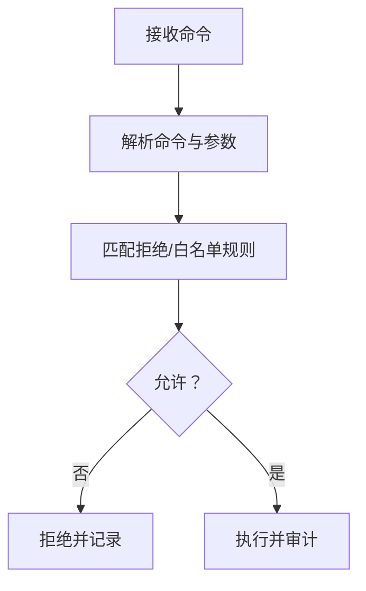

**图表来源**
- [phases/19-capstone-projects/26-sandbox-runner-denylist/code/main.py:1-200](file://phases/19-capstone-projects/26-sandbox-runner-denylist/code/main.py#L1-L200)

**章节来源**
- [phases/19-capstone-projects/26-sandbox-runner-denylist/code/main.py:1-200](file://phases/19-capstone-projects/26-sandbox-runner-denylist/code/main.py#L1-L200)
- [phases/19-capstone-projects/26-sandbox-runner-denylist/code/tests/test_main.py:1-200](file://phases/19-capstone-projects/26-sandbox-runner-denylist/code/tests/test_main.py#L1-L200)

### 评估Harness固定任务
- 设计要点
  - 固定任务集：包含若干典型问题及其“错误版本”与“期望版本”
  - 对比评估：运行两者并比较输出/行为差异
  - 报告生成：统计通过率、错误类型与定位信息
- 数据流
  - 输入：任务描述与任务集
  - 处理：分别运行“错误版本”与“期望版本”，对比差异
  - 输出：评估报告与可视化摘要
- 错误处理
  - 运行失败：记录失败原因与堆栈
  - 结果不一致：定位差异点并标注
- 性能优化
  - 并行执行：多任务并行评估
  - 缓存结果：避免重复运行相同任务
- 测试策略
  - 单元：每个任务的独立运行
  - 集成：整体评估流水线

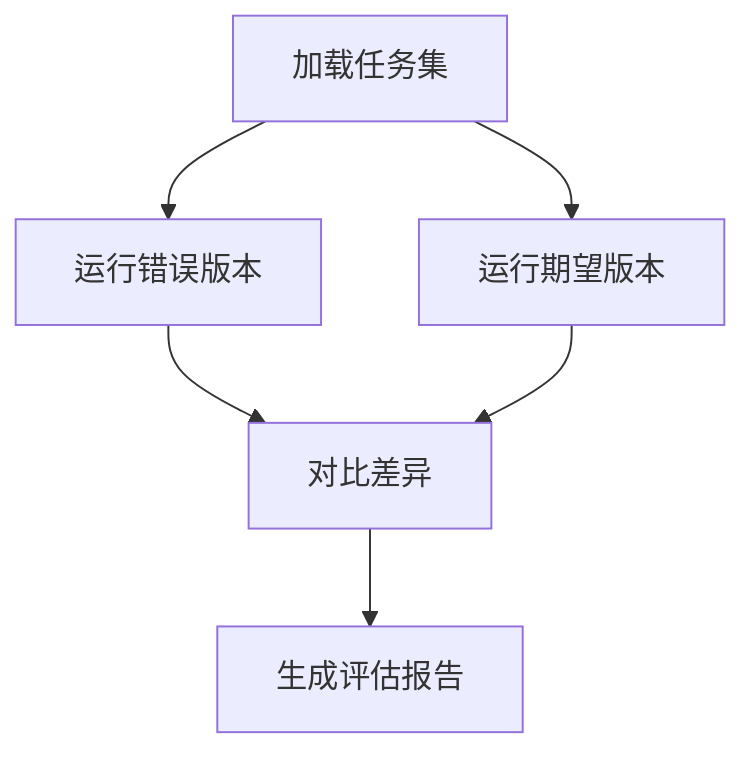

**图表来源**
- [phases/19-capstone-projects/27-eval-harness-fixture-tasks/code/main.py:1-200](file://phases/19-capstone-projects/27-eval-harness-fixture-tasks/code/main.py#L1-L200)
- [phases/19-capstone-projects/27-eval-harness-fixture-tasks/code/tasks/task_001_fizzbuzz_offbyone/task.json:1-200](file://phases/19-capstone-projects/27-eval-harness-fixture-tasks/code/tasks/task_001_fizzbuzz_offbyone/task.json#L1-L200)
- [phases/19-capstone-projects/27-eval-harness-fixture-tasks/code/tasks/task_002_factorial_missing_return/task.json:1-200](file://phases/19-capstone-projects/27-eval-harness-fixture-tasks/code/tasks/task_002_factorial_missing_return/task.json#L1-L200)
- [phases/19-capstone-projects/27-eval-harness-fixture-tasks/code/tasks/task_003_error_message_typo/task.json:1-200](file://phases/19-capstone-projects/27-eval-harness-fixture-tasks/code/tasks/task_003_error_message_typo/task.json#L1-L200)
- [phases/19-capstone-projects/27-eval-harness-fixture-tasks/code/tasks/task_004_empty_reverse/task.json:1-200](file://phases/19-capstone-projects/27-eval-harness-fixture-tasks/code/tasks/task_004_empty_reverse/task.json#L1-L200)
- [phases/19-capstone-projects/27-eval-harness-fixture-tasks/code/tasks/task_005_linked_list_traversal/task.json:1-200](file://phases/19-capstone-projects/27-eval-harness-fixture-tasks/code/tasks/task_005_linked_list_traversal/task.json#L1-L200)

**章节来源**
- [phases/19-capstone-projects/27-eval-harness-fixture-tasks/code/main.py:1-200](file://phases/19-capstone-projects/27-eval-harness-fixture-tasks/code/main.py#L1-L200)
- [phases/19-capstone-projects/27-eval-harness-fixture-tasks/code/tests/test_main.py:1-200](file://phases/19-capstone-projects/27-eval-harness-fixture-tasks/code/tests/test_main.py#L1-L200)

### OpenTelemetry追踪
- 设计要点
  - Span埋点：在关键路径（注册、传输、调度、执行、评估、演示）打点
  - 属性与事件：记录请求ID、工具名、耗时、错误码等
  - 导出策略：本地开发与生产环境差异化导出
- 数据流
  - 输入：各组件产生的Span
  - 处理：标准化属性、聚合统计
  - 输出：追踪面板与指标仪表盘
- 错误处理
  - 导出失败：缓冲重试与降级
  - 采样策略：高QPS场景下控制采样率
- 性能优化
  - 异步导出：避免阻塞主流程
  - 轻量Span：仅记录必要字段
- 测试策略
  - 单元：验证Span生成与属性完整性
  - 集成：端到端追踪链路连通性

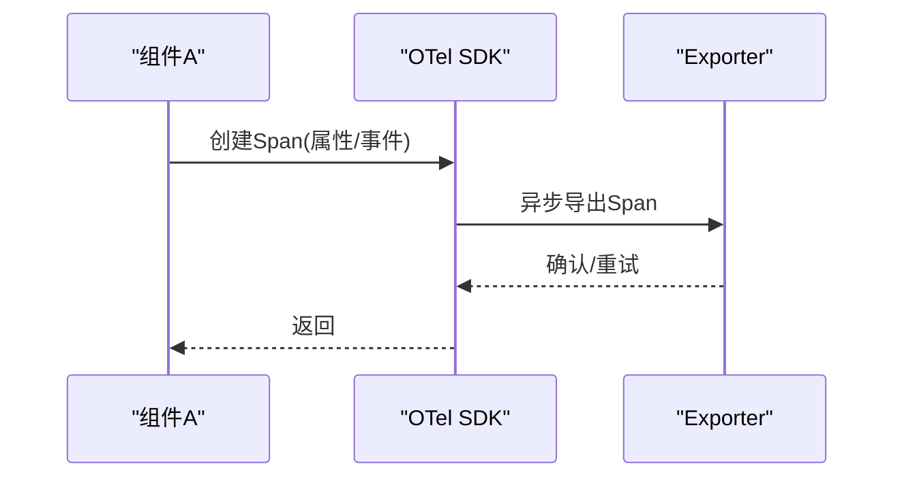

**图表来源**
- [phases/19-capstone-projects/28-observability-otel-traces/code/main.py:1-200](file://phases/19-capstone-projects/28-observability-otel-traces/code/main.py#L1-L200)

**章节来源**
- [phases/19-capstone-projects/28-observability-otel-traces/code/main.py:1-200](file://phases/19-capstone-projects/28-observability-otel-traces/code/main.py#L1-L200)
- [phases/19-capstone-projects/28-observability-otel-traces/code/tests/test_main.py:1-200](file://phases/19-capstone-projects/28-observability-otel-traces/code/tests/test_main.py#L1-L200)

### 端到端编码任务演示
- 设计要点
  - 克隆仓库：从远程仓库拉取演示代码
  - 运行测试：在受控环境中执行测试套件
  - 结果汇总：收集测试结果并生成报告
- 数据流
  - 输入：演示配置与仓库地址
  - 处理：克隆、安装依赖、执行测试
  - 输出：测试报告与日志
- 错误处理
  - 克隆失败：重试与回退
  - 测试失败：捕获输出并标记失败
- 性能优化
  - 缓存依赖：加速二次执行
  - 并行测试：缩短总耗时
- 测试策略
  - 单元：每个演示步骤的独立验证
  - 集成：完整流水线的端到端验证

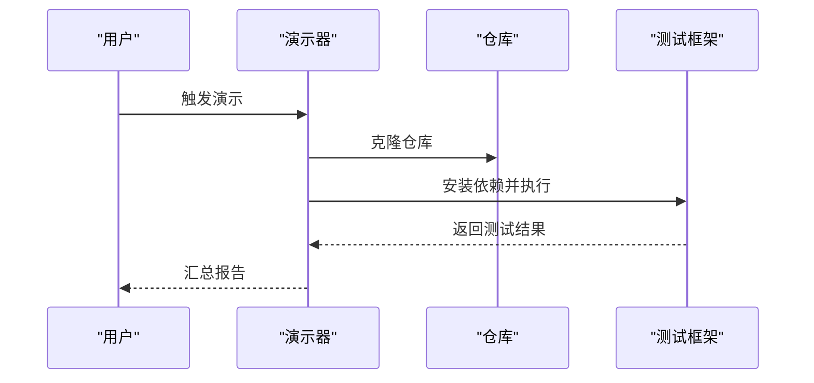

**图表来源**
- [phases/19-capstone-projects/29-end-to-end-coding-task-demo/code/main.py:1-200](file://phases/19-capstone-projects/29-end-to-end-coding-task-demo/code/main.py#L1-L200)
- [phases/19-capstone-projects/29-end-to-end-coding-task-demo/code/fixture_repo/src/fizz.py:1-200](file://phases/19-capstone-projects/29-end-to-end-coding-task-demo/code/fixture_repo/src/fizz.py#L1-L200)
- [phases/19-capstone-projects/29-end-to-end-coding-task-demo/code/fixture_repo/tests/test_fizz.py:1-200](file://phases/19-capstone-projects/29-end-to-end-coding-task-demo/code/fixture_repo/tests/test_fizz.py#L1-L200)

**章节来源**
- [phases/19-capstone-projects/29-end-to-end-coding-task-demo/code/main.py:1-200](file://phases/19-capstone-projects/29-end-to-end-coding-task-demo/code/main.py#L1-L200)
- [phases/19-capstone-projects/29-end-to-end-coding-task-demo/code/tests/test_main.py:1-200](file://phases/19-capstone-projects/29-end-to-end-coding-task-demo/code/tests/test_main.py#L1-L200)

## 依赖关系分析
- 组件内聚与耦合
  - 工具注册表与调度器强耦合：前者决定后者可用工具集
  - 传输层与调度器弱耦合：通过抽象接口解耦
  - 验证门与评估Harness弱耦合：前者控制采样，后者负责对比
  - 沙箱与执行链路弱耦合：通过统一接口接入
- 外部依赖
  - JSON-RPC标准库、OpenTelemetry SDK、测试框架
- 循环依赖规避
  - 通过接口抽象与模块化拆分避免循环导入

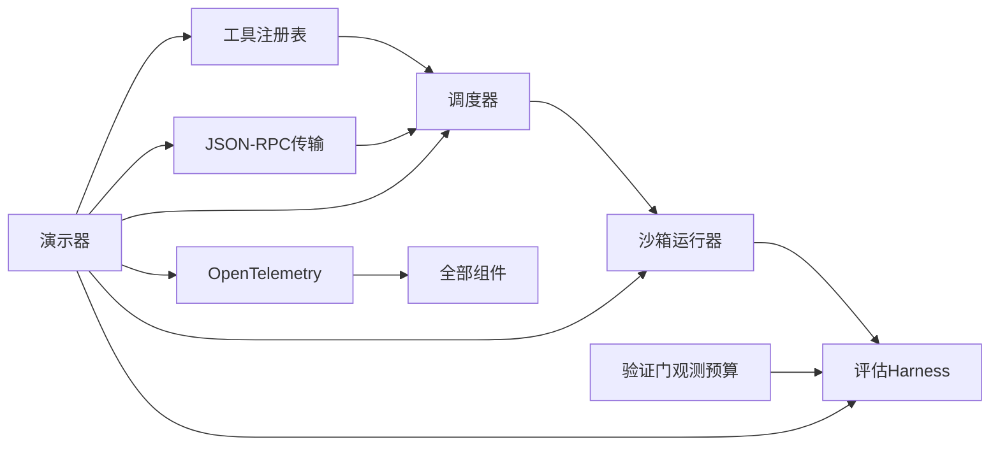

**图表来源**
- [phases/19-capstone-projects/21-tool-registry-schema-validation/code/main.py:1-200](file://phases/19-capstone-projects/21-tool-registry-schema-validation/code/main.py#L1-L200)
- [phases/19-capstone-projects/22-jsonrpc-stdio-transport/code/main.py:1-200](file://phases/19-capstone-projects/22-jsonrpc-stdio-transport/code/main.py#L1-L200)
- [phases/19-capstone-projects/23-function-call-dispatcher/code/main.py:1-200](file://phases/19-capstone-projects/23-function-call-dispatcher/code/main.py#L1-L200)
- [phases/19-capstone-projects/26-sandbox-runner-denylist/code/main.py:1-200](file://phases/19-capstone-projects/26-sandbox-runner-denylist/code/main.py#L1-L200)
- [phases/19-capstone-projects/27-eval-harness-fixture-tasks/code/main.py:1-200](file://phases/19-capstone-projects/27-eval-harness-fixture-tasks/code/main.py#L1-L200)
- [phases/19-capstone-projects/28-observability-otel-traces/code/main.py:1-200](file://phases/19-capstone-projects/28-observability-otel-traces/code/main.py#L1-L200)
- [phases/19-capstone-projects/29-end-to-end-coding-task-demo/code/main.py:1-200](file://phases/19-capstone-projects/29-end-to-end-coding-task-demo/code/main.py#L1-L200)

## 性能考量
- 并发与批处理
  - 调度器与评估Harness支持并行执行，显著降低总耗时
- 缓存与复用
  - Schema与依赖缓存、测试结果缓存
- 资源治理
  - 验证门预算控制、沙箱拒绝列表限制高风险操作
- 可观测性
  - OTel追踪帮助定位瓶颈与异常

## 故障排查指南
- 常见问题
  - 工具注册失败：检查Schema与参数类型
  - 传输异常：确认JSON-RPC格式与方法名
  - 调度失败：查看并发限制与资源占用
  - 计划执行中断：检查步骤依赖与上下文污染
  - 验证门过早终止：调整预算或采样策略
  - 沙箱拦截误杀：核对拒绝/白名单规则
  - 评估结果不一致：对比“错误版本”与“期望版本”的差异点
  - 演示失败：检查仓库克隆与测试依赖
  - 追踪缺失：确认OTel导出配置与采样率
- 排查步骤
  - 开启详细日志与追踪
  - 分段执行与最小复现
  - 使用单元测试定位问题范围
  - 对照任务集与期望行为

**章节来源**
- [phases/19-capstone-projects/21-tool-registry-schema-validation/code/tests/test_registry.py:1-200](file://phases/19-capstone-projects/21-tool-registry-schema-validation/code/tests/test_registry.py#L1-L200)
- [phases/19-capstone-projects/22-jsonrpc-stdio-transport/code/tests/test_transport.py:1-200](file://phases/19-capstone-projects/22-jsonrpc-stdio-transport/code/tests/test_transport.py#L1-L200)
- [phases/19-capstone-projects/23-function-call-dispatcher/code/tests/test_dispatcher.py:1-200](file://phases/19-capstone-projects/23-function-call-dispatcher/code/tests/test_dispatcher.py#L1-L200)
- [phases/19-capstone-projects/24-plan-execute-control-flow/code/tests/test_agent.py:1-200](file://phases/19-capstone-projects/24-plan-execute-control-flow/code/tests/test_agent.py#L1-L200)
- [phases/19-capstone-projects/25-verification-gates-observation-budget/code/tests/test_main.py:1-200](file://phases/19-capstone-projects/25-verification-gates-observation-budget/code/tests/test_main.py#L1-L200)
- [phases/19-capstone-projects/26-sandbox-runner-denylist/code/tests/test_main.py:1-200](file://phases/19-capstone-projects/26-sandbox-runner-denylist/code/tests/test_main.py#L1-L200)
- [phases/19-capstone-projects/27-eval-harness-fixture-tasks/code/tests/test_main.py:1-200](file://phases/19-capstone-projects/27-eval-harness-fixture-tasks/code/tests/test_main.py#L1-L200)
- [phases/19-capstone-projects/28-observability-otel-traces/code/tests/test_main.py:1-200](file://phases/19-capstone-projects/28-observability-otel-traces/code/tests/test_main.py#L1-L200)
- [phases/19-capstone-projects/29-end-to-end-coding-task-demo/code/tests/test_main.py:1-200](file://phases/19-capstone-projects/29-end-to-end-coding-task-demo/code/tests/test_main.py#L1-L200)

## 结论
本项目通过十个核心子任务构建了从工具注册、传输编解码、调度执行、计划控制、安全沙箱、评估对比到可观测性的完整闭环。每个组件均具备清晰的接口、稳定的契约与完善的测试策略。建议在实际工程中继续强化跨组件的契约约束、异步与批处理能力，并持续完善OTel追踪与告警体系，以支撑更大规模与更复杂场景的演进。

## 附录
- 质量保证措施
  - 单元测试：覆盖关键路径与边界条件
  - 集成测试：端到端流水线验证
  - 性能基准测试：在典型负载下测量吞吐与延迟
- 架构原则
  - 组件复用：通过抽象接口与配置驱动实现复用
  - 扩展性设计：插件化与可替换的后端
  - 兼容性考虑：向后兼容与平滑迁移策略