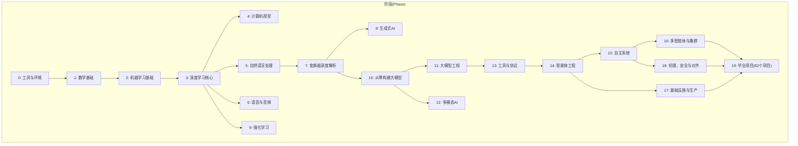
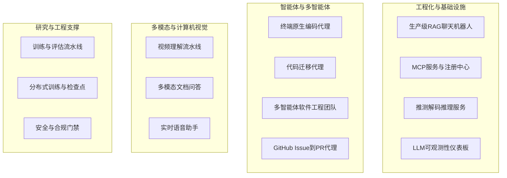
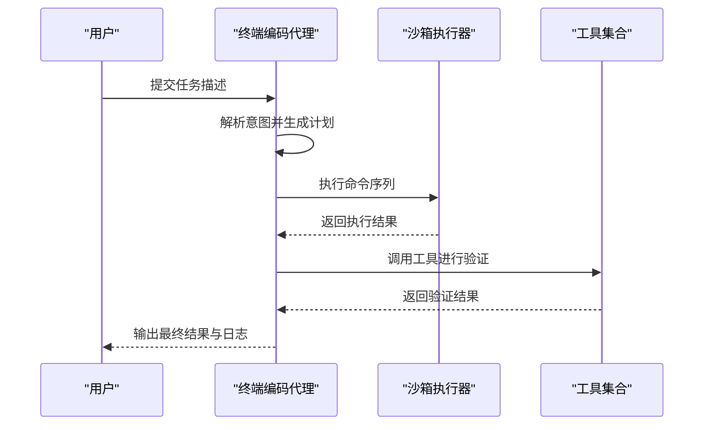
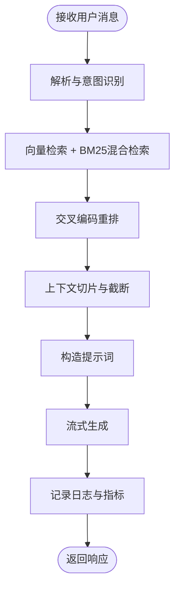
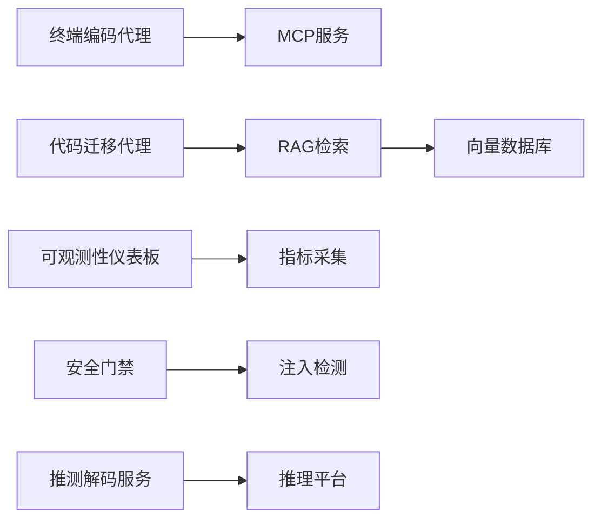

# 毕业项目

<cite>
**本文引用的文件**
- [README.md](file://README.md)
- [ROADMAP.md](file://ROADMAP.md)
- [CONTRIBUTING.md](file://CONTRIBUTING.md)
- [CODE_OF_CONDUCT.md](file://CODE_OF_CONDUCT.md)
- [phases/19-capstone-projects/README.md](file://phases/19-capstone-projects/README.md)
- [phases/19-capstone-projects/01-terminal-native-coding-agent/docs/en.md](file://phases/19-capstone-projects/01-terminal-native-coding-agent/docs/en.md)
- [phases/19-capstone-projects/08-production-rag-chatbot/docs/en.md](file://phases/19-capstone-projects/08-production-rag-chatbot/docs/en.md)
- [phases/19-capstone-projects/09-code-migration-agent/docs/en.md](file://phases/19-capstone-projects/09-code-migration-agent/docs/en.md)
</cite>

## 目录
1. [引言](#引言)
2. [项目结构](#项目结构)
3. [核心组件](#核心组件)
4. [架构总览](#架构总览)
5. [详细组件分析](#详细组件分析)
6. [依赖关系分析](#依赖关系分析)
7. [性能考量](#性能考量)
8. [故障排查指南](#故障排查指南)
9. [结论](#结论)
10. [附录](#附录)

## 引言
本文件面向“毕业项目课程”，系统化梳理并输出82个实际项目的完整设计思路、实施指南与作品展示。项目覆盖从终端原生编码代理、代码迁移代理，到生产级RAG聊天机器人等真实应用场景，贯穿“从简单到复杂”的渐进路径。文档同时总结项目选题的考虑因素、技术栈选择、开发流程、项目管理与团队协作最佳实践，并提供演示、文档编写、代码审查等专业技能训练建议，以及部署、性能优化、用户体验等工程要点，帮助学员以真实项目巩固知识、提升解决实际问题的能力。

## 项目结构
该仓库采用“阶段-课程-项目”三层组织结构：  
- 阶段（Phase）：线性堆叠的知识体系，自数学基础至自主系统与伦理安全，共20个阶段。  
- 课程（Lesson）：每个阶段包含若干课程，按“构建-使用-交付”循环推进，强调“从零实现再框架验证”。  
- 项目（Capstone Project）：第19阶段为毕业项目阶段，包含82个端到端项目，涵盖工程化、多模态、工具协议、智能体等多个方向。

图示来源
- [README.md:57-81](file://README.md#L57-L81)

章节来源
- [README.md:241-246](file://README.md#L241-L246)
- [ROADMAP.md:1-10](file://ROADMAP.md#L1-L10)

## 核心组件
- 课程交付模式：每门课程遵循“问题—概念—构建—使用—交付”的六步循环，先手写实现，再用框架复现，最后产出可复用的提示词、技能、智能体或MCP服务器。
- 项目交付物：每个毕业项目均配套英文与中文文档、测试用例、技能输出与测验，形成可交付、可演示、可评审的作品集。
- 质量与协作规范：贡献指南明确了文档格式、状态标记、提交流程与行为准则，确保项目质量与社区协作的一致性。

章节来源
- [README.md:87-112](file://README.md#L87-L112)
- [CONTRIBUTING.md:25-72](file://CONTRIBUTING.md#L25-L72)
- [CONTRIBUTING.md:145-164](file://CONTRIBUTING.md#L145-L164)

## 架构总览
毕业项目阶段的82个项目可抽象为以下几类主题域，分别对应不同技术栈与工程目标：

图示来源
- [ROADMAP.md:522-611](file://ROADMAP.md#L522-L611)

章节来源
- [ROADMAP.md:522-611](file://ROADMAP.md#L522-L611)

## 详细组件分析

### 终端原生编码代理（项目01）
- 设计目标：在终端环境中完成“理解任务—规划—执行—验证”的完整闭环，支持命令行工具链与脚本执行。
- 关键能力：
  - 任务解析与计划生成
  - 安全沙箱中的命令执行与结果回传
  - 结果校验与重试机制
- 技术要点：TypeScript前端+后端，结合测试驱动开发；强调可审计、可回放的执行轨迹。
- 交付物：可安装的技能包、测试用例、中文与英文文档。

图示来源
- [phases/19-capstone-projects/01-terminal-native-coding-agent/docs/en.md](file://phases/19-capstone-projects/01-terminal-native-coding-agent/docs/en.md)

章节来源
- [phases/19-capstone-projects/01-terminal-native-coding-agent/docs/en.md](file://phases/19-capstone-projects/01-terminal-native-coding-agent/docs/en.md)

### 代码迁移代理（项目09）
- 设计目标：自动化完成跨版本、跨语言的代码迁移，降低维护成本。
- 关键能力：
  - 迁移策略识别与成本估算
  - 分步骤迁移与冲突检测
  - 回滚与一致性校验
- 技术要点：类型安全的迁移引擎、成本模型、测试用例与回归验证。
- 交付物：可复用的迁移技能、中文与英文文档、测验。

章节来源
- [phases/19-capstone-projects/09-code-migration-agent/docs/en.md](file://phases/19-capstone-projects/09-code-migration-agent/docs/en.md)

### 生产级RAG聊天机器人（项目08）
- 设计目标：面向监管垂直领域的生产级RAG聊天机器人，强调检索、重排、上下文管理与可观测性。
- 关键能力：
  - 向量化检索与交叉编码重排
  - 上下文窗口与成本控制
  - 流式响应与会话状态管理
  - 日志与指标采集
- 技术要点：前后端分离、流式传输、缓存与限流、安全与合规。
- 交付物：可部署的服务端、技能包、中文与英文文档、测验。

图示来源
- [phases/19-capstone-projects/08-production-rag-chatbot/docs/en.md](file://phases/19-capstone-projects/08-production-rag-chatbot/docs/en.md)

章节来源
- [phases/19-capstone-projects/08-production-rag-chatbot/docs/en.md](file://phases/19-capstone-projects/08-production-rag-chatbot/docs/en.md)

### 多模态文档问答（项目04）
- 设计目标：基于视觉优先的多模态理解，实现文档与图表的问答系统。
- 关键能力：
  - 视觉编码器与跨模态融合
  - 文档布局与区域定位
  - 多轮对话与上下文追踪
- 技术要点：视觉Transformer、跨注意力融合、评测指标与可视化。
- 交付物：可运行的前端界面、后端服务、技能包与评测脚本。

章节来源
- [ROADMAP.md:529](file://ROADMAP.md#L529)

### 实时语音助手（项目03）
- 设计目标：端到端的语音助手，覆盖ASR、LLM、TTS与回声消除。
- 关键能力：
  - 实时语音转文本与文本转语音
  - 对话管理与工具调用
  - 低延迟与稳定性保障
- 技术要点：流式处理、并发调度、资源编排与监控。
- 交付物：可部署的语音助手服务、技能包与中文/英文文档。

章节来源
- [ROADMAP.md:528](file://ROADMAP.md#L528)

### 多智能体软件工程团队（项目10）
- 设计目标：模拟真实软件工程团队，由多个角色智能体协同完成需求分析、设计、开发与测试。
- 关键能力：
  - 角色分工与任务编排
  - 协作通信与共识达成
  - 状态持久化与回溯
- 技术要点：多智能体编排、共享内存、黑板模式、失败模式治理。
- 交付物：可演示的团队协作流程、中文与英文文档、测验。

章节来源
- [ROADMAP.md:535](file://ROADMAP.md#L535)

### 推测解码推理服务（项目14）
- 设计目标：在推理阶段引入推测解码，显著降低时延。
- 关键能力：
  - 草案生成与验证
  - KV缓存与批处理优化
  - 成本与吞吐权衡
- 技术要点：KV缓存、连续批处理、前缀重用与分块预填充。
- 交付物：可独立部署的推理服务、性能基准与中文/英文文档。

章节来源
- [ROADMAP.md:539](file://ROADMAP.md#L539)

### MCP服务与注册中心（项目13）
- 设计目标：构建符合MCP标准的服务端与客户端，支持资源、提示词与异步任务。
- 关键能力：
  - 传输层抽象与路由
  - 资源与提示词管理
  - 异步任务与权限控制
- 技术要点：MCP协议、OAuth 2.1、网关与注册表、生产级鉴权。
- 交付物：MCP服务端与客户端、中文/英文文档与测试。

章节来源
- [ROADMAP.md:538](file://ROADMAP.md#L538)

### LLM可观测性仪表板（项目11）
- 设计目标：统一采集与展示LLM应用的关键指标，辅助容量规划与问题定位。
- 关键能力：
  - 指标采集与聚合
  - 可视化面板与告警
  - 性能基线与回归检测
- 技术要点：OpenTelemetry GenAI、Prometheus、Grafana集成。
- 交付物：可部署的观测平台、配置模板与中文/英文文档。

章节来源
- [ROADMAP.md:537](file://ROADMAP.md#L537)

### 安全与合规门禁（项目82-87）
- 设计目标：构建从“注入检测—规则引擎—拒绝评估”的闭环安全系统。
- 关键能力：
  - 注入攻击检测与分类
  - 宪章规则引擎与策略执行
  - 拒绝评估与合规报告
- 技术要点：规则分类、内容分类器集成、拒绝评估指标。
- 交付物：安全门禁组件、中文/英文文档与评测套件。

章节来源
- [ROADMAP.md:605-611](file://ROADMAP.md#L605-L611)

## 依赖关系分析
- 内聚与耦合：
  - 项目内聚：各项目围绕单一目标构建，职责清晰，便于独立交付与评审。
  - 项目间耦合：部分项目（如MCP、RAG、安全门禁）作为通用基础设施被其他项目复用。
- 外部依赖：
  - LLM服务与托管平台
  - 向量数据库与检索引擎
  - 观测与监控栈（OpenTelemetry、Prometheus、Grafana）
  - 安全与合规工具链（鉴权、审计、PII清洗）

图示来源
- [ROADMAP.md:522-611](file://ROADMAP.md#L522-L611)

章节来源
- [ROADMAP.md:522-611](file://ROADMAP.md#L522-L611)

## 性能考量
- 推测解码与KV缓存：通过草稿-验证循环与KV缓存减少重复计算，显著降低TTFT与TPOT。
- 混合并行：数据并行、流水线并行与张量并行的组合，配合梯度累积与梯度检查点，平衡显存与吞吐。
- 检索优化：BM25与稠密嵌入混合检索、交叉编码重排、查询改写与HyDE，提升召回与相关性。
- 流式传输：前端与后端均采用流式响应，降低首包时延并改善交互体验。
- 成本控制：上下文切片、缓存策略、限流与配额管理，结合成本模型进行预算治理。

## 故障排查指南
- 常见问题与定位：
  - 推理时延异常：检查KV缓存命中率、批处理大小与连续批处理配置。
  - 检索效果不佳：调整chunk策略、重排器权重与查询改写策略。
  - 安全门禁误判：核查规则引擎配置、内容分类器阈值与拒绝评估指标。
  - 观测性缺失：确认OpenTelemetry导出器、指标标签与告警规则。
- 团队协作与评审：
  - 使用统一的贡献规范与PR流程，确保文档、测试与交付物齐全。
  - 在项目中内置测验与评分，便于自我评估与同伴互评。

章节来源
- [CONTRIBUTING.md:136-164](file://CONTRIBUTING.md#L136-L164)
- [CODE_OF_CONDUCT.md:1-31](file://CODE_OF_CONDUCT.md#L1-L31)

## 结论
通过82个真实项目的系统化训练，学员将掌握从算法实现到工程落地的全链路能力，具备独立设计与交付高质量AI系统的素养。项目强调“做中学、做中教”，结合导师指导与同伴学习，持续迭代与评审，最终形成可展示、可维护、可扩展的作品集，为进入工业界或继续深造打下坚实基础。

## 附录
- 项目清单与时间估算：详见[ROADMAP.md](file://ROADMAP.md)，总时长约314小时（按个人节奏），毕业项目阶段约620小时。
- 课程结构与交付模式：详见[README.md](file://README.md)，每门课程遵循“构建—使用—交付”的循环。
- 贡献与协作规范：详见[CONTRIBUTING.md](file://CONTRIBUTING.md)与[CODE_OF_CONDUCT.md](file://CODE_OF_CONDUCT.md)。

章节来源
- [ROADMAP.md:1-10](file://ROADMAP.md#L1-L10)
- [README.md:87-112](file://README.md#L87-L112)
- [CONTRIBUTING.md:136-164](file://CONTRIBUTING.md#L136-L164)
- [CODE_OF_CONDUCT.md:1-31](file://CODE_OF_CONDUCT.md#L1-L31)