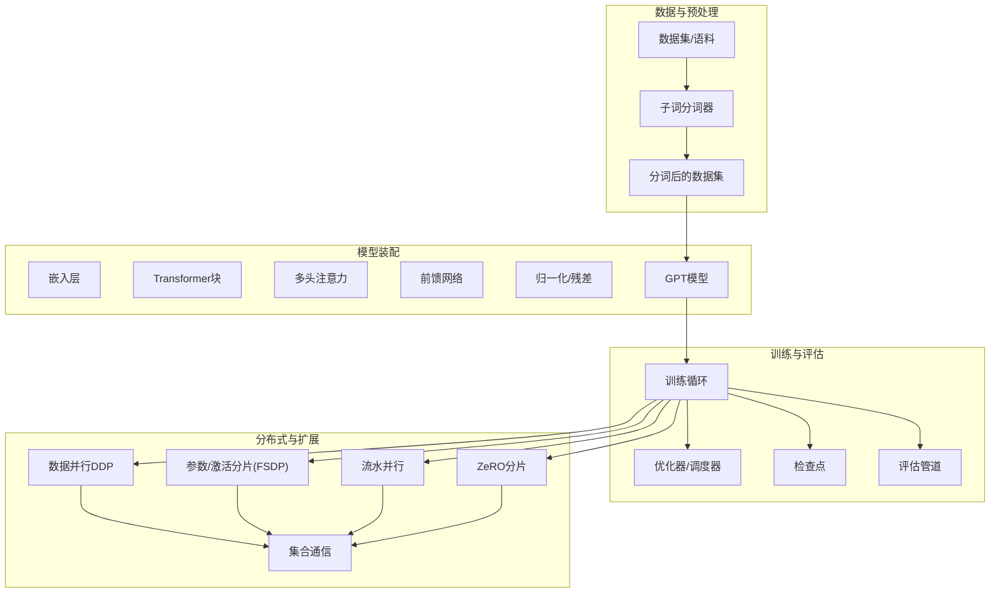
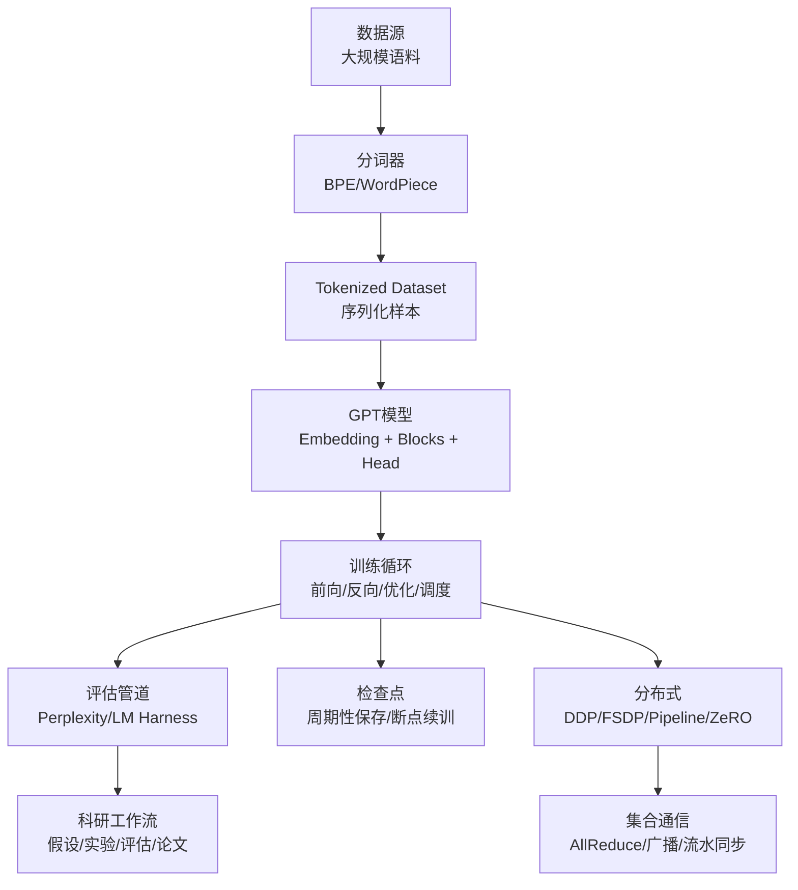
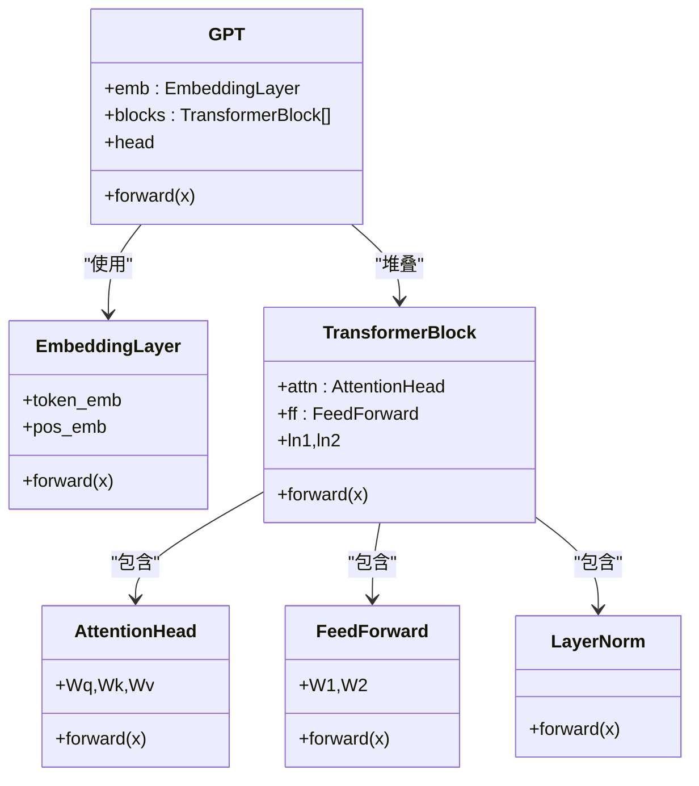
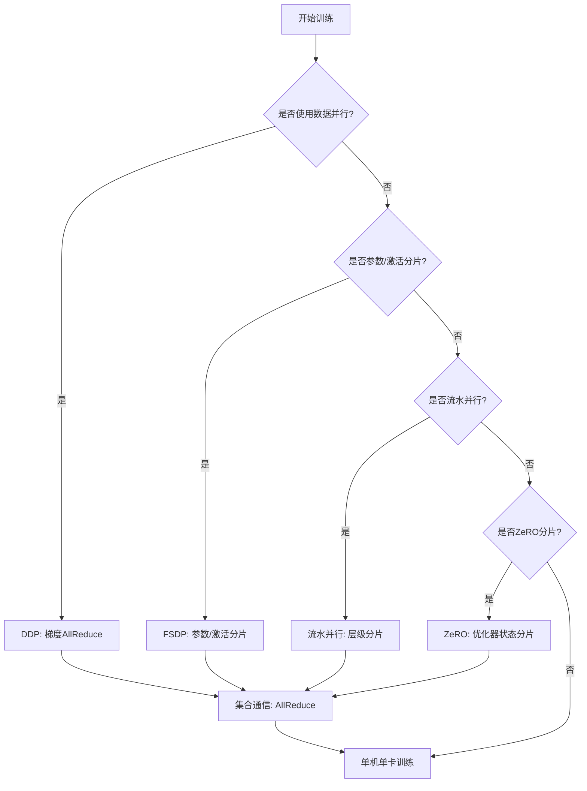
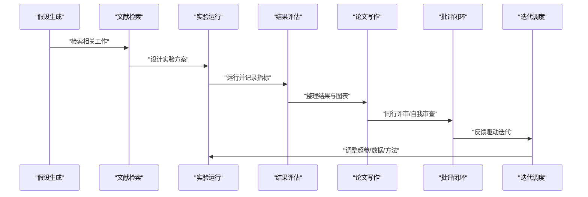
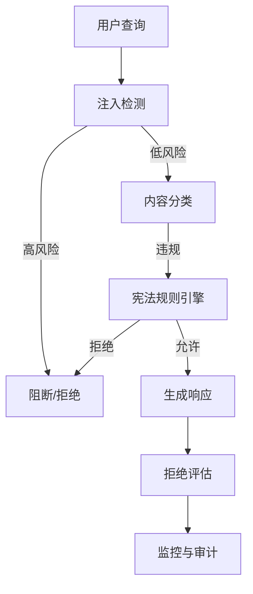
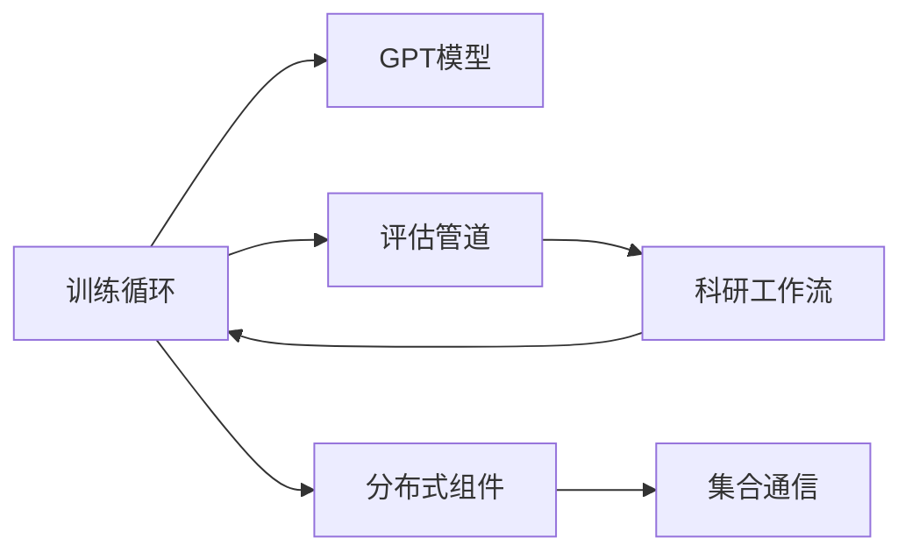

# 训练实现项目

<cite>
**本文引用的文件**
- [train_and_test.py](file://train_and_test.py)
- [finetune.py](file://finetune.py)
- [test_adapter.py](file://test_adapter.py)
- [test_api.py](file://test_api.py)
- [test_embedding.py](file://test_embedding.py)
- [test_eval.py](file://test_eval.py)
- [test_eval_real.py](file://test_eval_real.py)
- [test_lora_demo.py](file://test_lora_demo.py)
- [test_pdf_ocr.py](file://test_pdf_ocr.py)
- [test_production.py](file://test_production.py)
- [test_rag.py](file://test_rag.py)
- [phases/19-capstone-projects/36-training-loop-eval/code/tests/test_training.py](file://phases/19-capstone-projects/36-training-loop-eval/code/tests/test_training.py)
- [phases/19-capstone-projects/35-gpt-model-assembly/code/tests/test_model.py](file://phases/19-capstone-projects/35-gpt-model-assembly/code/tests/test_model.py)
- [phases/19-capstone-projects/48-distributed-fsdp-ddp/outputs/skill-distributed-fsdp-ddp.md](file://phases/19-capstone-projects/48-distributed-fsdp-ddp/outputs/skill-distributed-fsdp-ddp.md)
- [phases/10-llms-from-scratch/05-scaling-distributed/outputs/prompt-distributed-training-planner.md](file://phases/10-llms-from-scratch/05-scaling-distributed/outputs/prompt-distributed-training-planner.md)
- [phases/19-capstone-projects/47-checkpoint-save-resume/outputs/skill-checkpoint-save-resume.md](file://phases/19-capstone-projects/47-checkpoint-save-resume/outputs/skill-checkpoint-save-resume.md)
- [phases/19-capstone-projects/44-cosine-lr-warmup/outputs/skill-cosine-lr-warmup.md](file://phases/19-capstone-projects/44-cosine-lr-warmup/outputs/skill-cosine-lr-warmup.md)
- [phases/19-capstone-projects/45-gradient-clipping-amp/outputs/skill-gradient-clipping-amp.md](file://phases/19-capstone-projects/45-gradient-clipping-amp/outputs/skill-gradient-clipping-amp.md)
- [phases/19-capstone-projects/46-gradient-accumulation/outputs/skill-gradient-accumulation.md](file://phases/19-capstone-projects/46-gradient-accumulation/outputs/skill-gradient-accumulation.md)
- [phases/19-capstone-projects/49-lm-eval-harness/outputs/skill-lm-eval-harness.md](file://phases/19-capstone-projects/49-lm-eval-harness/outputs/skill-lm-eval-harness.md)
- [phases/19-capstone-projects/50-hypothesis-generator/outputs/skill-hypothesis-generator.md](file://phases/19-capstone-projects/50-hypothesis-generator/outputs/skill-hypothesis-generator.md)
- [phases/19-capstone-projects/51-literature-retrieval/outputs/skill-literature-retrieval.md](file://phases/19-capstone-projects/51-literature-retrieval/outputs/skill-literature-retrieval.md)
- [phases/19-capstone-projects/52-experiment-runner/outputs/skill-experiment-runner.md](file://phases/19-capstone-projects/52-experiment-runner/outputs/skill-experiment-runner.md)
- [phases/19-capstone-projects/53-result-evaluator/outputs/skill-result-evaluator.md](file://phases/19-capstone-projects/53-result-evaluator/outputs/skill-result-evaluator.md)
- [phases/19-capstone-projects/54-paper-writer/outputs/skill-paper-writer.md](file://phases/19-capstone-projects/54-paper-writer/outputs/skill-paper-writer.md)
- [phases/19-capstone-projects/55-critic-loop/outputs/skill-critic-loop.md](file://phases/19-capstone-projects/55-critic-loop/outputs/skill-critic-loop.md)
- [phases/19-capstone-projects/56-iteration-scheduler/outputs/skill-iteration-scheduler.md](file://phases/19-capstone-projects/56-iteration-scheduler/outputs/skill-iteration-scheduler.md)
- [phases/19-capstone-projects/57-end-to-end-research-demo/outputs/skill-end-to-end-research-demo.md](file://phases/19-capstone-projects/57-end-to-end-research-demo/outputs/skill-end-to-end-research-demo.md)
- [phases/19-capstone-projects/76-collective-ops-from-scratch/outputs/skill-collective-ops-from-scratch.md](file://phases/19-capstone-projects/76-collective-ops-from-scratch/outputs/skill-collective-ops-from-scratch.md)
- [phases/19-capstone-projects/77-data-parallel-ddp/outputs/skill-data-parallel-ddp.md](file://phases/19-capstone-projects/77-data-parallel-ddp/outputs/skill-data-parallel-ddp.md)
- [phases/19-capstone-projects/78-zero-parameter-sharding/outputs/skill-zero-parameter-sharding.md](file://phases/19-capstone-projects/78-zero-parameter-sharding/outputs/skill-zero-parameter-sharding.md)
- [phases/19-capstone-projects/79-pipeline-parallel/outputs/skill-pipeline-parallel.md](file://phases/19-capstone-projects/79-pipeline-parallel/outputs/skill-pipeline-parallel.md)
- [phases/19-capstone-projects/80-checkpoint-sharded-resume/outputs/skill-checkpoint-sharded-resume.md](file://phases/19-capstone-projects/80-checkpoint-sharded-resume/outputs/skill-checkpoint-sharded-resume.md)
- [phases/19-capstone-projects/81-end-to-end-distributed-train/outputs/skill-end-to-end-distributed-train.md](file://phases/19-capstone-projects/81-end-to-end-distributed-train/outputs/skill-end-to-end-distributed-train.md)
- [phases/19-capstone-projects/82-jailbreak-taxonomy/outputs/skill-jailbreak-taxonomy.md](file://phases/19-capstone-projects/82-jailbreak-taxonomy/outputs/skill-jailbreak-taxonomy.md)
- [phases/19-capstone-projects/83-prompt-injection-detector/outputs/skill-prompt-injection-detector.md](file://phases/19-capstone-projects/83-prompt-injection-detector/outputs/skill-prompt-injection-detector.md)
- [phases/19-capstone-projects/84-refusal-evaluation/outputs/skill-refusal-evaluation.md](file://phases/19-capstone-projects/84-refusal-evaluation/outputs/skill-refusal-evaluation.md)
- [phases/19-capstone-projects/85-content-classifier-integration/outputs/skill-content-classifier-integration.md](file://phases/19-capstone-projects/85-content-classifier-integration/outputs/skill-content-classifier-integration.md)
- [phases/19-capstone-projects/86-constitutional-rules-engine/outputs/skill-constitutional-rules-engine.md](file://phases/19-capstone-projects/86-constitutional-rules-engine/outputs/skill-constitutional-rules-engine.md)
- [phases/19-capstone-projects/87-end-to-end-safety-gate/outputs/skill-end-to-end-safety-gate.md](file://phases/19-capstone-projects/87-end-to-end-safety-gate/outputs/skill-end-to-end-safety-gate.md)
</cite>

## 目录
1. [引言](#引言)
2. [项目结构](#项目结构)
3. [核心组件](#核心组件)
4. [架构总览](#架构总览)
5. [详细组件分析](#详细组件分析)
6. [依赖分析](#依赖分析)
7. [性能考虑](#性能考虑)
8. [故障排查指南](#故障排查指南)
9. [结论](#结论)
10. [附录](#附录)

## 引言
本文件面向“训练实现项目”，系统化梳理从子词分词器到GPT模型组装与训练的完整流水线，覆盖数据预处理、模型架构、训练循环、评估管道、分布式训练、梯度累积、检查点管理、学习率调度等关键环节，并结合仓库中“科研工作流”相关技能输出，给出可重现、可扩展、生产就绪的设计建议与工程实践。

## 项目结构
该项目以“阶段式课程 + 案例项目”的方式组织内容，训练实现相关的核心路径集中在“19号案例项目”（capstone projects）与“10号LLM从零开始”阶段的“分布式与扩展”主题中；同时在根目录提供了若干端到端脚本与测试用例，便于快速验证训练流程与功能模块。

- 根目录训练入口与测试
  - 训练与评测一体化脚本：[train_and_test.py](file://train_and_test.py)
  - 微调脚本：[finetune.py](file://finetune.py)
  - 多类测试用例：[test_adapter.py](file://test_adapter.py)、[test_api.py](file://test_api.py)、[test_embedding.py](file://test_embedding.py)、[test_eval.py](file://test_eval.py)、[test_eval_real.py](file://test_eval_real.py)、[test_lora_demo.py](file://test_lora_demo.py)、[test_pdf_ocr.py](file://test_pdf_ocr.py)、[test_production.py](file://test_production.py)、[test_rag.py](file://test_rag.py)

- 案例项目（Capstone Projects）
  - 训练循环与评估：[36-training-loop-eval](file://phases/19-capstone-projects/36-training-loop-eval/code/tests/test_training.py)
  - GPT模型装配：[35-gpt-model-assembly](file://phases/19-capstone-projects/35-gpt-model-assembly/code/tests/test_model.py)
  - 分布式训练（FSDP/DDP）：[48-distributed-fsdp-ddp](file://phases/19-capstone-projects/48-distributed-fsdp-ddp/outputs/skill-distributed-fsdp-ddp.md)
  - 检查点保存与恢复：[47-checkpoint-save-resume](file://phases/19-capstone-projects/47-checkpoint-save-resume/outputs/skill-checkpoint-save-resume.md)
  - 学习率调度（余弦退火+Warmup）：[44-cosine-lr-warmup](file://phases/19-capstone-projects/44-cosine-lr-warmup/outputs/skill-cosine-lr-warmup.md)
  - 梯度裁剪与AMP：[45-gradient-clipping-amp](file://phases/19-capstone-projects/45-gradient-clipping-amp/outputs/skill-gradient-clipping-amp.md)
  - 梯度累积：[46-gradient-accumulation](file://phases/19-capstone-projects/46-gradient-accumulation/outputs/skill-gradient-accumulation.md)
  - LLM评估Harness：[49-lm-eval-harness](file://phases/19-capstone-projects/49-lm-eval-harness/outputs/skill-lm-eval-harness.md)
  - 科研工作流：假设生成、文献检索、实验运行、结果评估、论文写作、评审迭代、迭代调度等
    - 假设生成：[50-hypothesis-generator](file://phases/19-capstone-projects/50-hypothesis-generator/outputs/skill-hypothesis-generator.md)
    - 文献检索：[51-literature-retrieval](file://phases/19-capstone-projects/51-literature-retrieval/outputs/skill-literature-retrieval.md)
    - 实验运行：[52-experiment-runner](file://phases/19-capstone-projects/52-experiment-runner/outputs/skill-experiment-runner.md)
    - 结果评估：[53-result-evaluator](file://phases/19-capstone-projects/53-result-evaluator/outputs/skill-result-evaluator.md)
    - 论文写作：[54-paper-writer](file://phases/19-capstone-projects/54-paper-writer/outputs/skill-paper-writer.md)
    - 批评闭环：[55-critic-loop](file://phases/19-capstone-projects/55-critic-loop/outputs/skill-critic-loop.md)
    - 迭代调度：[56-iteration-scheduler](file://phases/19-capstone-projects/56-iteration-scheduler/outputs/skill-iteration-scheduler.md)
    - 端到端演示：[57-end-to-end-research-demo](file://phases/19-capstone-projects/57-end-to-end-research-demo/outputs/skill-end-to-end-research-demo.md)

- 分布式与集合通信
  - 集合通信基础：[76-collective-ops-from-scratch](file://phases/19-capstone-projects/76-collective-ops-from-scratch/outputs/skill-collective-ops-from-scratch.md)
  - 数据并行DDP：[77-data-parallel-ddp](file://phases/19-capstone-projects/77-data-parallel-ddp/outputs/skill-data-parallel-ddp.md)
  - 参数分片（ZeRO）：[78-zero-parameter-sharding](file://phases/19-capstone-projects/78-zero-parameter-sharding/outputs/skill-zero-parameter-sharding.md)
  - 流水并行：[79-pipeline-parallel](file://phases/19-capstone-projects/79-pipeline-parallel/outputs/skill-pipeline-parallel.md)
  - 检查点分片与恢复：[80-checkpoint-sharded-resume](file://phases/19-capstone-projects/80-checkpoint-sharded-resume/outputs/skill-checkpoint-sharded-resume.md)
  - 端到端分布式训练：[81-end-to-end-distributed-train](file://phases/19-capstone-projects/81-end-to-end-distributed-train/outputs/skill-end-to-end-distributed-train.md)

- 安全与合规
  - 识别与分类：[82-jailbreak-taxonomy](file://phases/19-capstone-projects/82-jailbreak-taxonomy/outputs/skill-jailbreak-taxonomy.md)
  - 注入检测：[83-prompt-injection-detector](file://phases/19-capstone-projects/83-prompt-injection-detector/outputs/skill-prompt-injection-detector.md)
  - 拒绝评估：[84-refusal-evaluation](file://phases/19-capstone-projects/84-refusal-evaluation/outputs/skill-refusal-evaluation.md)
  - 内容分类集成：[85-content-classifier-integration](file://phases/19-capstone-projects/85-content-classifier-integration/outputs/skill-content-classifier-integration.md)
  - 宪章规则引擎：[86-constitutional-rules-engine](file://phases/19-capstone-projects/86-constitutional-rules-engine/outputs/skill-constitutional-rules-engine.md)
  - 端到端安全门：[87-end-to-end-safety-gate](file://phases/19-capstone-projects/87-end-to-end-safety-gate/outputs/skill-end-to-end-safety-gate.md)



**图表来源**
- [phases/19-capstone-projects/35-gpt-model-assembly/code/tests/test_model.py](file://phases/19-capstone-projects/35-gpt-model-assembly/code/tests/test_model.py)
- [phases/19-capstone-projects/36-training-loop-eval/code/tests/test_training.py](file://phases/19-capstone-projects/36-training-loop-eval/code/tests/test_training.py)
- [phases/19-capstone-projects/48-distributed-fsdp-ddp/outputs/skill-distributed-fsdp-ddp.md](file://phases/19-capstone-projects/48-distributed-fsdp-ddp/outputs/skill-distributed-fsdp-ddp.md)
- [phases/19-capstone-projects/76-collective-ops-from-scratch/outputs/skill-collective-ops-from-scratch.md](file://phases/19-capstone-projects/76-collective-ops-from-scratch/outputs/skill-collective-ops-from-scratch.md)

**章节来源**
- [train_and_test.py](file://train_and_test.py)
- [finetune.py](file://finetune.py)
- [phases/19-capstone-projects/35-gpt-model-assembly/code/tests/test_model.py](file://phases/19-capstone-projects/35-gpt-model-assembly/code/tests/test_model.py)
- [phases/19-capstone-projects/36-training-loop-eval/code/tests/test_training.py](file://phases/19-capstone-projects/36-training-loop-eval/code/tests/test_training.py)

## 核心组件
- 数据与分词
  - 子词分词器：负责将文本切分为子词单元，支持词汇表构建与编码解码。
  - 分词后数据集：以固定长度序列或滑动窗口形式组织，适配因果语言建模任务。
- 模型装配
  - 嵌入层：词嵌入与位置嵌入。
  - Transformer块：多头自注意力 + 前馈网络 + 层归一化与残差连接。
  - 输出投影：将隐藏态映射至词表维度，用于语言建模损失计算。
- 训练循环
  - 前向/反向传播、优化器更新、学习率调度、梯度累积与裁剪、AMP混合精度。
  - 检查点保存与断点续训。
- 评估管道
  - Perplexity、困惑度等指标；LM Harness评估框架。
- 分布式训练
  - DDP数据并行、FSDP参数/激活分片、流水并行、ZeRO分片；集合通信原语。
- 科研工作流
  - 假设生成、文献检索、实验运行、结果评估、论文写作、评审与迭代调度、端到端演示。

**章节来源**
- [phases/19-capstone-projects/44-cosine-lr-warmup/outputs/skill-cosine-lr-warmup.md](file://phases/19-capstone-projects/44-cosine-lr-warmup/outputs/skill-cosine-lr-warmup.md)
- [phases/19-capstone-projects/45-gradient-clipping-amp/outputs/skill-gradient-clipping-amp.md](file://phases/19-capstone-projects/45-gradient-clipping-amp/outputs/skill-gradient-clipping-amp.md)
- [phases/19-capstone-projects/46-gradient-accumulation/outputs/skill-gradient-accumulation.md](file://phases/19-capstone-projects/46-gradient-accumulation/outputs/skill-gradient-accumulation.md)
- [phases/19-capstone-projects/47-checkpoint-save-resume/outputs/skill-checkpoint-save-resume.md](file://phases/19-capstone-projects/47-checkpoint-save-resume/outputs/skill-checkpoint-save-resume.md)
- [phases/19-capstone-projects/49-lm-eval-harness/outputs/skill-lm-eval-harness.md](file://phases/19-capstone-projects/49-lm-eval-harness/outputs/skill-lm-eval-harness.md)
- [phases/19-capstone-projects/50-hypothesis-generator/outputs/skill-hypothesis-generator.md](file://phases/19-capstone-projects/50-hypothesis-generator/outputs/skill-hypothesis-generator.md)
- [phases/19-capstone-projects/51-literature-retrieval/outputs/skill-literature-retrieval.md](file://phases/19-capstone-projects/51-literature-retrieval/outputs/skill-literature-retrieval.md)
- [phases/19-capstone-projects/52-experiment-runner/outputs/skill-experiment-runner.md](file://phases/19-capstone-projects/52-experiment-runner/outputs/skill-experiment-runner.md)
- [phases/19-capstone-projects/53-result-evaluator/outputs/skill-result-evaluator.md](file://phases/19-capstone-projects/53-result-evaluator/outputs/skill-result-evaluator.md)
- [phases/19-capstone-projects/54-paper-writer/outputs/skill-paper-writer.md](file://phases/19-capstone-projects/54-paper-writer/outputs/skill-paper-writer.md)
- [phases/19-capstone-projects/55-critic-loop/outputs/skill-critic-loop.md](file://phases/19-capstone-projects/55-critic-loop/outputs/skill-critic-loop.md)
- [phases/19-capstone-projects/56-iteration-scheduler/outputs/skill-iteration-scheduler.md](file://phases/19-capstone-projects/56-iteration-scheduler/outputs/skill-iteration-scheduler.md)
- [phases/19-capstone-projects/57-end-to-end-research-demo/outputs/skill-end-to-end-research-demo.md](file://phases/19-capstone-projects/57-end-to-end-research-demo/outputs/skill-end-to-end-research-demo.md)

## 架构总览
下图展示从数据到模型再到分布式训练与评估的整体架构，以及科研工作流如何贯穿训练生命周期。



**图表来源**
- [phases/19-capstone-projects/35-gpt-model-assembly/code/tests/test_model.py](file://phases/19-capstone-projects/35-gpt-model-assembly/code/tests/test_model.py)
- [phases/19-capstone-projects/36-training-loop-eval/code/tests/test_training.py](file://phases/19-capstone-projects/36-training-loop-eval/code/tests/test_training.py)
- [phases/19-capstone-projects/48-distributed-fsdp-ddp/outputs/skill-distributed-fsdp-ddp.md](file://phases/19-capstone-projects/48-distributed-fsdp-ddp/outputs/skill-distributed-fsdp-ddp.md)
- [phases/19-capstone-projects/49-lm-eval-harness/outputs/skill-lm-eval-harness.md](file://phases/19-capstone-projects/49-lm-eval-harness/outputs/skill-lm-eval-harness.md)
- [phases/19-capstone-projects/57-end-to-end-research-demo/outputs/skill-end-to-end-research-demo.md](file://phases/19-capstone-projects/57-end-to-end-research-demo/outputs/skill-end-to-end-research-demo.md)

## 详细组件分析

### 组件A：训练循环与评估
- 关键职责
  - 单步训练：前向传播得到损失，反向传播计算梯度，优化器更新参数。
  - 学习率调度：余弦退火配合warmup策略，控制收敛稳定性与速度。
  - 梯度处理：梯度裁剪防止爆炸，AMP混合精度提升吞吐与显存效率。
  - 梯度累积：在有限显存下扩大有效batch size。
  - 检查点：周期性保存权重与状态，支持断点续训。
  - 评估：Perplexity等指标，LM Harness统一评估入口。
- 典型流程（序列图）

```mermaid
sequenceDiagram
participant Loader as "数据加载器"
participant Model as "GPT模型"
participant Train as "训练循环"
participant Opt as "优化器/调度器"
participant Eval as "评估管道"
Loader->>Train : "批次数据"
Train->>Model : "前向传播"
Model-->>Train : "损失值"
Train->>Train : "反向传播/梯度裁剪/AMP"
Train->>Opt : "参数更新/学习率调度"
Train->>Train : "周期性检查点保存"
Eval->>Model : "评估(Perplexity/LM Harness)"
Eval-->>Eval : "记录指标"
```

**图表来源**
- [phases/19-capstone-projects/36-training-loop-eval/code/tests/test_training.py](file://phases/19-capstone-projects/36-training-loop-eval/code/tests/test_training.py)
- [phases/19-capstone-projects/44-cosine-lr-warmup/outputs/skill-cosine-lr-warmup.md](file://phases/19-capstone-projects/44-cosine-lr-warmup/outputs/skill-cosine-lr-warmup.md)
- [phases/19-capstone-projects/45-gradient-clipping-amp/outputs/skill-gradient-clipping-amp.md](file://phases/19-capstone-projects/45-gradient-clipping-amp/outputs/skill-gradient-clipping-amp.md)
- [phases/19-capstone-projects/46-gradient-accumulation/outputs/skill-gradient-accumulation.md](file://phases/19-capstone-projects/46-gradient-accumulation/outputs/skill-gradient-accumulation.md)
- [phases/19-capstone-projects/47-checkpoint-save-resume/outputs/skill-checkpoint-save-resume.md](file://phases/19-capstone-projects/47-checkpoint-save-resume/outputs/skill-checkpoint-save-resume.md)
- [phases/19-capstone-projects/49-lm-eval-harness/outputs/skill-lm-eval-harness.md](file://phases/19-capstone-projects/49-lm-eval-harness/outputs/skill-lm-eval-harness.md)

**章节来源**
- [phases/19-capstone-projects/36-training-loop-eval/code/tests/test_training.py](file://phases/19-capstone-projects/36-training-loop-eval/code/tests/test_training.py)
- [phases/19-capstone-projects/44-cosine-lr-warmup/outputs/skill-cosine-lr-warmup.md](file://phases/19-capstone-projects/44-cosine-lr-warmup/outputs/skill-cosine-lr-warmup.md)
- [phases/19-capstone-projects/45-gradient-clipping-amp/outputs/skill-gradient-clipping-amp.md](file://phases/19-capstone-projects/45-gradient-clipping-amp/outputs/skill-gradient-clipping-amp.md)
- [phases/19-capstone-projects/46-gradient-accumulation/outputs/skill-gradient-accumulation.md](file://phases/19-capstone-projects/46-gradient-accumulation/outputs/skill-gradient-accumulation.md)
- [phases/19-capstone-projects/47-checkpoint-save-resume/outputs/skill-checkpoint-save-resume.md](file://phases/19-capstone-projects/47-checkpoint-save-resume/outputs/skill-checkpoint-save-resume.md)
- [phases/19-capstone-projects/49-lm-eval-harness/outputs/skill-lm-eval-harness.md](file://phases/19-capstone-projects/49-lm-eval-harness/outputs/skill-lm-eval-harness.md)

### 组件B：GPT模型装配
- 关键职责
  - 嵌入层：词嵌入 + 位置嵌入。
  - Transformer块：多头注意力 + 前馈网络 + 层归一化 + 残差。
  - 输出头：将隐藏态投影到词表维度，计算交叉熵损失。
- 典型流程（类图）



**图表来源**
- [phases/19-capstone-projects/35-gpt-model-assembly/code/tests/test_model.py](file://phases/19-capstone-projects/35-gpt-model-assembly/code/tests/test_model.py)

**章节来源**
- [phases/19-capstone-projects/35-gpt-model-assembly/code/tests/test_model.py](file://phases/19-capstone-projects/35-gpt-model-assembly/code/tests/test_model.py)

### 组件C：分布式训练（DDP/FSDP/流水并行/ZeRO）
- 关键职责
  - DDP：数据并行，每卡一份完整模型副本，梯度AllReduce聚合。
  - FSDP：参数/激活分片，降低显存占用，支持自动分片策略。
  - 流水并行：将层数拆分到多个设备，通过流水线重叠计算与通信。
  - ZeRO：分片优化器状态与梯度，显著降低内存峰值。
  - 集合通信：AllReduce、广播、分片同步等原语。
- 典型流程（流程图）



**图表来源**
- [phases/19-capstone-projects/48-distributed-fsdp-ddp/outputs/skill-distributed-fsdp-ddp.md](file://phases/19-capstone-projects/48-distributed-fsdp-ddp/outputs/skill-distributed-fsdp-ddp.md)
- [phases/19-capstone-projects/76-collective-ops-from-scratch/outputs/skill-collective-ops-from-scratch.md](file://phases/19-capstone-projects/76-collective-ops-from-scratch/outputs/skill-collective-ops-from-scratch.md)
- [phases/19-capstone-projects/77-data-parallel-ddp/outputs/skill-data-parallel-ddp.md](file://phases/19-capstone-projects/77-data-parallel-ddp/outputs/skill-data-parallel-ddp.md)
- [phases/19-capstone-projects/78-zero-parameter-sharding/outputs/skill-zero-parameter-sharding.md](file://phases/19-capstone-projects/78-zero-parameter-sharding/outputs/skill-zero-parameter-sharding.md)
- [phases/19-capstone-projects/79-pipeline-parallel/outputs/skill-pipeline-parallel.md](file://phases/19-capstone-projects/79-pipeline-parallel/outputs/skill-pipeline-parallel.md)
- [phases/19-capstone-projects/80-checkpoint-sharded-resume/outputs/skill-checkpoint-sharded-resume.md](file://phases/19-capstone-projects/80-checkpoint-sharded-resume/outputs/skill-checkpoint-sharded-resume.md)
- [phases/19-capstone-projects/81-end-to-end-distributed-train/outputs/skill-end-to-end-distributed-train.md](file://phases/19-capstone-projects/81-end-to-end-distributed-train/outputs/skill-end-to-end-distributed-train.md)

**章节来源**
- [phases/10-llms-from-scratch/05-scaling-distributed/outputs/prompt-distributed-training-planner.md](file://phases/10-llms-from-scratch/05-scaling-distributed/outputs/prompt-distributed-training-planner.md)
- [phases/19-capstone-projects/48-distributed-fsdp-ddp/outputs/skill-distributed-fsdp-ddp.md](file://phases/19-capstone-projects/48-distributed-fsdp-ddp/outputs/skill-distributed-fsdp-ddp.md)
- [phases/19-capstone-projects/76-collective-ops-from-scratch/outputs/skill-collective-ops-from-scratch.md](file://phases/19-capstone-projects/76-collective-ops-from-scratch/outputs/skill-collective-ops-from-scratch.md)
- [phases/19-capstone-projects/77-data-parallel-ddp/outputs/skill-data-parallel-ddp.md](file://phases/19-capstone-projects/77-data-parallel-ddp/outputs/skill-data-parallel-ddp.md)
- [phases/19-capstone-projects/78-zero-parameter-sharding/outputs/skill-zero-parameter-sharding.md](file://phases/19-capstone-projects/78-zero-parameter-sharding/outputs/skill-zero-parameter-sharding.md)
- [phases/19-capstone-projects/79-pipeline-parallel/outputs/skill-pipeline-parallel.md](file://phases/19-capstone-projects/79-pipeline-parallel/outputs/skill-pipeline-parallel.md)
- [phases/19-capstone-projects/80-checkpoint-sharded-resume/outputs/skill-checkpoint-sharded-resume.md](file://phases/19-capstone-projects/80-checkpoint-sharded-resume/outputs/skill-checkpoint-sharded-resume.md)
- [phases/19-capstone-projects/81-end-to-end-distributed-train/outputs/skill-end-to-end-distributed-train.md](file://phases/19-capstone-projects/81-end-to-end-distributed-train/outputs/skill-end-to-end-distributed-train.md)

### 组件D：科研工作流（假设生成→实验运行→结果评估→论文写作）
- 关键职责
  - 假设生成：基于问题域提出可验证的研究假设。
  - 文献检索：系统性收集与筛选相关工作。
  - 实验运行：配置超参、执行训练、记录日志与指标。
  - 结果评估：定量与定性评估，形成报告。
  - 论文写作：结构化撰写，图表与表格整理。
  - 批评闭环与迭代调度：根据评审反馈迭代改进。
- 典型流程（序列图）



**图表来源**
- [phases/19-capstone-projects/50-hypothesis-generator/outputs/skill-hypothesis-generator.md](file://phases/19-capstone-projects/50-hypothesis-generator/outputs/skill-hypothesis-generator.md)
- [phases/19-capstone-projects/51-literature-retrieval/outputs/skill-literature-retrieval.md](file://phases/19-capstone-projects/51-literature-retrieval/outputs/skill-literature-retrieval.md)
- [phases/19-capstone-projects/52-experiment-runner/outputs/skill-experiment-runner.md](file://phases/19-capstone-projects/52-experiment-runner/outputs/skill-experiment-runner.md)
- [phases/19-capstone-projects/53-result-evaluator/outputs/skill-result-evaluator.md](file://phases/19-capstone-projects/53-result-evaluator/outputs/skill-result-evaluator.md)
- [phases/19-capstone-projects/54-paper-writer/outputs/skill-paper-writer.md](file://phases/19-capstone-projects/54-paper-writer/outputs/skill-paper-writer.md)
- [phases/19-capstone-projects/55-critic-loop/outputs/skill-critic-loop.md](file://phases/19-capstone-projects/55-critic-loop/outputs/skill-critic-loop.md)
- [phases/19-capstone-projects/56-iteration-scheduler/outputs/skill-iteration-scheduler.md](file://phases/19-capstone-projects/56-iteration-scheduler/outputs/skill-iteration-scheduler.md)
- [phases/19-capstone-projects/57-end-to-end-research-demo/outputs/skill-end-to-end-research-demo.md](file://phases/19-capstone-projects/57-end-to-end-research-demo/outputs/skill-end-to-end-research-demo.md)

**章节来源**
- [phases/19-capstone-projects/50-hypothesis-generator/outputs/skill-hypothesis-generator.md](file://phases/19-capstone-projects/50-hypothesis-generator/outputs/skill-hypothesis-generator.md)
- [phases/19-capstone-projects/51-literature-retrieval/outputs/skill-literature-retrieval.md](file://phases/19-capstone-projects/51-literature-retrieval/outputs/skill-literature-retrieval.md)
- [phases/19-capstone-projects/52-experiment-runner/outputs/skill-experiment-runner.md](file://phases/19-capstone-projects/52-experiment-runner/outputs/skill-experiment-runner.md)
- [phases/19-capstone-projects/53-result-evaluator/outputs/skill-result-evaluator.md](file://phases/19-capstone-projects/53-result-evaluator/outputs/skill-result-evaluator.md)
- [phases/19-capstone-projects/54-paper-writer/outputs/skill-paper-writer.md](file://phases/19-capstone-projects/54-paper-writer/outputs/skill-paper-writer.md)
- [phases/19-capstone-projects/55-critic-loop/outputs/skill-critic-loop.md](file://phases/19-capstone-projects/55-critic-loop/outputs/skill-critic-loop.md)
- [phases/19-capstone-projects/56-iteration-scheduler/outputs/skill-iteration-scheduler.md](file://phases/19-capstone-projects/56-iteration-scheduler/outputs/skill-iteration-scheduler.md)
- [phases/19-capstone-projects/57-end-to-end-research-demo/outputs/skill-end-to-end-research-demo.md](file://phases/19-capstone-projects/57-end-to-end-research-demo/outputs/skill-end-to-end-research-demo.md)

### 组件E：安全与合规（注入检测、拒绝评估、内容分类、宪法规则引擎）
- 关键职责
  - 注入检测：识别潜在提示注入风险。
  - 拒绝评估：衡量模型对敏感请求的拒绝能力。
  - 内容分类集成：将分类器接入推理管线。
  - 宪章规则引擎：基于规则约束生成内容。
  - 端到端安全门：在服务层拦截高风险输出。
- 典型流程（流程图）



**图表来源**
- [phases/19-capstone-projects/82-jailbreak-taxonomy/outputs/skill-jailbreak-taxonomy.md](file://phases/19-capstone-projects/82-jailbreak-taxonomy/outputs/skill-jailbreak-taxonomy.md)
- [phases/19-capstone-projects/83-prompt-injection-detector/outputs/skill-prompt-injection-detector.md](file://phases/19-capstone-projects/83-prompt-injection-detector/outputs/skill-prompt-injection-detector.md)
- [phases/19-capstone-projects/84-refusal-evaluation/outputs/skill-refusal-evaluation.md](file://phases/19-capstone-projects/84-refusal-evaluation/outputs/skill-refusal-evaluation.md)
- [phases/19-capstone-projects/85-content-classifier-integration/outputs/skill-content-classifier-integration.md](file://phases/19-capstone-projects/85-content-classifier-integration/outputs/skill-content-classifier-integration.md)
- [phases/19-capstone-projects/86-constitutional-rules-engine/outputs/skill-constitutional-rules-engine.md](file://phases/19-capstone-projects/86-constitutional-rules-engine/outputs/skill-constitutional-rules-engine.md)
- [phases/19-capstone-projects/87-end-to-end-safety-gate/outputs/skill-end-to-end-safety-gate.md](file://phases/19-capstone-projects/87-end-to-end-safety-gate/outputs/skill-end-to-end-safety-gate.md)

**章节来源**
- [phases/19-capstone-projects/82-jailbreak-taxonomy/outputs/skill-jailbreak-taxonomy.md](file://phases/19-capstone-projects/82-jailbreak-taxonomy/outputs/skill-jailbreak-taxonomy.md)
- [phases/19-capstone-projects/83-prompt-injection-detector/outputs/skill-prompt-injection-detector.md](file://phases/19-capstone-projects/83-prompt-injection-detector/outputs/skill-prompt-injection-detector.md)
- [phases/19-capstone-projects/84-refusal-evaluation/outputs/skill-refusal-evaluation.md](file://phases/19-capstone-projects/84-refusal-evaluation/outputs/skill-refusal-evaluation.md)
- [phases/19-capstone-projects/85-content-classifier-integration/outputs/skill-content-classifier-integration.md](file://phases/19-capstone-projects/85-content-classifier-integration/outputs/skill-content-classifier-integration.md)
- [phases/19-capstone-projects/86-constitutional-rules-engine/outputs/skill-constitutional-rules-engine.md](file://phases/19-capstone-projects/86-constitutional-rules-engine/outputs/skill-constitutional-rules-engine.md)
- [phases/19-capstone-projects/87-end-to-end-safety-gate/outputs/skill-end-to-end-safety-gate.md](file://phases/19-capstone-projects/87-end-to-end-safety-gate/outputs/skill-end-to-end-safety-gate.md)

## 依赖分析
- 组件耦合
  - 训练循环与模型装配强耦合：训练需要稳定的模型结构与一致的输入输出接口。
  - 评估管道与训练循环弱耦合：评估独立于训练，但共享数据与指标定义。
  - 分布式组件与集合通信：所有并行策略均依赖底层集合通信原语。
  - 科研工作流与训练：实验运行与结果评估贯穿训练生命周期。
- 外部依赖
  - 分词工具链（如BPE/WordPiece）、深度学习框架（PyTorch/TensorParallel等）、评估框架（LM Harness）。
- 潜在环路
  - 评估与实验运行之间存在反馈环（批评闭环），需明确迭代边界与停止条件。



**图表来源**
- [phases/19-capstone-projects/36-training-loop-eval/code/tests/test_training.py](file://phases/19-capstone-projects/36-training-loop-eval/code/tests/test_training.py)
- [phases/19-capstone-projects/35-gpt-model-assembly/code/tests/test_model.py](file://phases/19-capstone-projects/35-gpt-model-assembly/code/tests/test_model.py)
- [phases/19-capstone-projects/49-lm-eval-harness/outputs/skill-lm-eval-harness.md](file://phases/19-capstone-projects/49-lm-eval-harness/outputs/skill-lm-eval-harness.md)
- [phases/19-capstone-projects/57-end-to-end-research-demo/outputs/skill-end-to-end-research-demo.md](file://phases/19-capstone-projects/57-end-to-end-research-demo/outputs/skill-end-to-end-research-demo.md)

**章节来源**
- [phases/19-capstone-projects/36-training-loop-eval/code/tests/test_training.py](file://phases/19-capstone-projects/36-training-loop-eval/code/tests/test_training.py)
- [phases/19-capstone-projects/35-gpt-model-assembly/code/tests/test_model.py](file://phases/19-capstone-projects/35-gpt-model-assembly/code/tests/test_model.py)
- [phases/19-capstone-projects/49-lm-eval-harness/outputs/skill-lm-eval-harness.md](file://phases/19-capstone-projects/49-lm-eval-harness/outputs/skill-lm-eval-harness.md)
- [phases/19-capstone-projects/57-end-to-end-research-demo/outputs/skill-end-to-end-research-demo.md](file://phases/19-capstone-projects/57-end-to-end-research-demo/outputs/skill-end-to-end-research-demo.md)

## 性能考虑
- 显存与吞吐
  - 使用FSDP/ZeRO分片降低峰值显存；流水并行平衡延迟与带宽。
  - AMP混合精度减少显存占用并提升吞吐。
- 收敛与稳定性
  - 余弦退火+Warmup学习率策略，梯度裁剪防止爆炸。
  - 梯度累积扩大batch size，缓解小显存限制。
- I/O与数据管线
  - HDF5/缓存策略、数据加载器并行化、prefetch策略。
- 监控与可观测性
  - 指标采集（loss、lr、grad_norm、throughput、memory）与可视化。
- 可扩展性
  - 模块化设计：分词、模型、训练、评估、分布式、安全组件解耦。
  - 配置驱动：通过配置文件切换并行策略与训练参数。

[本节为通用指导，不直接分析具体文件]

## 故障排查指南
- 训练不稳定/发散
  - 检查学习率设置与warmup时长；确认梯度裁剪阈值合理。
  - 查看梯度范数与异常值，定位数值不稳定来源。
- 显存不足
  - 启用FSDP/ZeRO；减小batch size或序列长度；开启AMP。
- 分布式训练异常
  - 核对集合通信初始化与设备映射；检查断点续训的分片一致性。
- 评估指标异常
  - 对比不同评估框架与数据划分；核对标签与预测格式。
- 安全与合规
  - 注入检测误报/漏报：调整阈值与规则；增加人工复核。
  - 拒绝评估偏低：检查规则强度与上下文引导。

**章节来源**
- [phases/19-capstone-projects/44-cosine-lr-warmup/outputs/skill-cosine-lr-warmup.md](file://phases/19-capstone-projects/44-cosine-lr-warmup/outputs/skill-cosine-lr-warmup.md)
- [phases/19-capstone-projects/45-gradient-clipping-amp/outputs/skill-gradient-clipping-amp.md](file://phases/19-capstone-projects/45-gradient-clipping-amp/outputs/skill-gradient-clipping-amp.md)
- [phases/19-capstone-projects/46-gradient-accumulation/outputs/skill-gradient-accumulation.md](file://phases/19-capstone-projects/46-gradient-accumulation/outputs/skill-gradient-accumulation.md)
- [phases/19-capstone-projects/47-checkpoint-save-resume/outputs/skill-checkpoint-save-resume.md](file://phases/19-capstone-projects/47-checkpoint-save-resume/outputs/skill-checkpoint-save-resume.md)
- [phases/19-capstone-projects/49-lm-eval-harness/outputs/skill-lm-eval-harness.md](file://phases/19-capstone-projects/49-lm-eval-harness/outputs/skill-lm-eval-harness.md)
- [phases/19-capstone-projects/82-jailbreak-taxonomy/outputs/skill-jailbreak-taxonomy.md](file://phases/19-capstone-projects/82-jailbreak-taxonomy/outputs/skill-jailbreak-taxonomy.md)
- [phases/19-capstone-projects/83-prompt-injection-detector/outputs/skill-prompt-injection-detector.md](file://phases/19-capstone-projects/83-prompt-injection-detector/outputs/skill-prompt-injection-detector.md)
- [phases/19-capstone-projects/84-refusal-evaluation/outputs/skill-refusal-evaluation.md](file://phases/19-capstone-projects/84-refusal-evaluation/outputs/skill-refusal-evaluation.md)
- [phases/19-capstone-projects/85-content-classifier-integration/outputs/skill-content-classifier-integration.md](file://phases/19-capstone-projects/85-content-classifier-integration/outputs/skill-content-classifier-integration.md)
- [phases/19-capstone-projects/86-constitutional-rules-engine/outputs/skill-constitutional-rules-engine.md](file://phases/19-capstone-projects/86-constitutional-rules-engine/outputs/skill-constitutional-rules-engine.md)
- [phases/19-capstone-projects/87-end-to-end-safety-gate/outputs/skill-end-to-end-safety-gate.md](file://phases/19-capstone-projects/87-end-to-end-safety-gate/outputs/skill-end-to-end-safety-gate.md)

## 结论
本项目以“阶段式课程 + 案例项目”的方式，系统覆盖了从分词器到GPT模型、从训练循环到分布式扩展、从评估到科研工作流的完整训练实现路径。通过模块化设计与配置驱动，既保证了可重现性与可扩展性，也为生产环境提供了工程化的落地参考。建议在实际部署中结合业务场景选择合适的并行策略与监控体系，并持续完善安全与合规机制。

[本节为总结性内容，不直接分析具体文件]

## 附录
- 快速索引
  - 训练与评测一体化：[train_and_test.py](file://train_and_test.py)
  - 微调脚本：[finetune.py](file://finetune.py)
  - 训练循环测试：[phases/19-capstone-projects/36-training-loop-eval/code/tests/test_training.py](file://phases/19-capstone-projects/36-training-loop-eval/code/tests/test_training.py)
  - GPT模型装配测试：[phases/19-capstone-projects/35-gpt-model-assembly/code/tests/test_model.py](file://phases/19-capstone-projects/35-gpt-model-assembly/code/tests/test_model.py)
  - 分布式训练规划：[phases/10-llms-from-scratch/05-scaling-distributed/outputs/prompt-distributed-training-planner.md](file://phases/10-llms-from-scratch/05-scaling-distributed/outputs/prompt-distributed-training-planner.md)

[本节为补充信息，不直接分析具体文件]