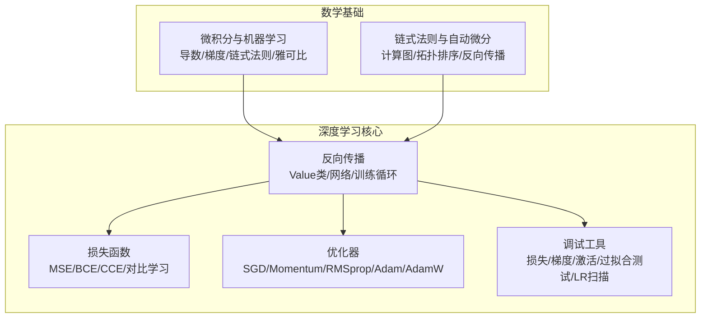
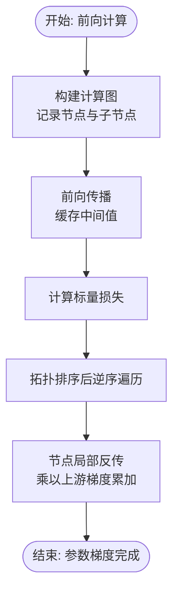
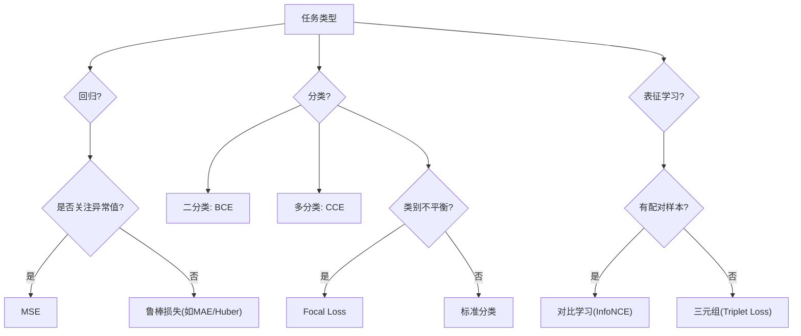
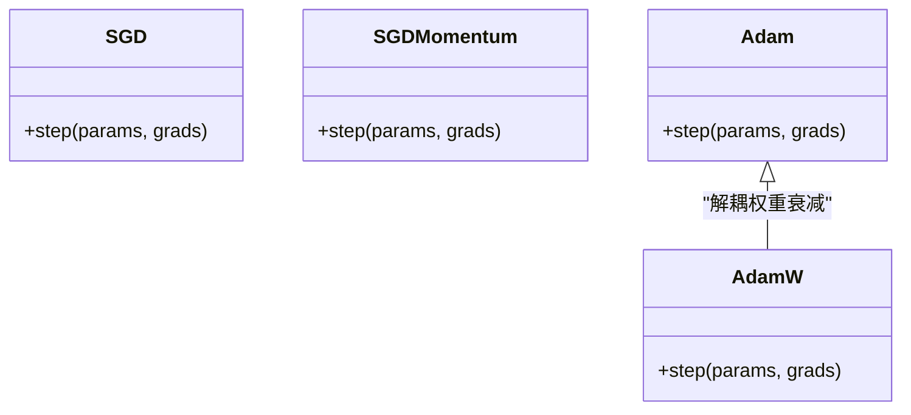
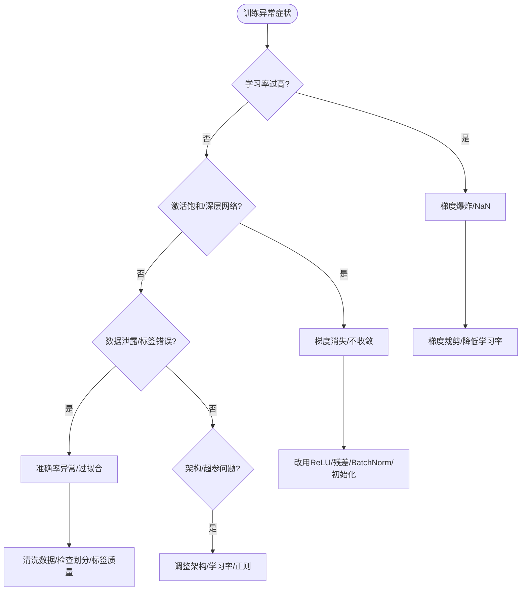
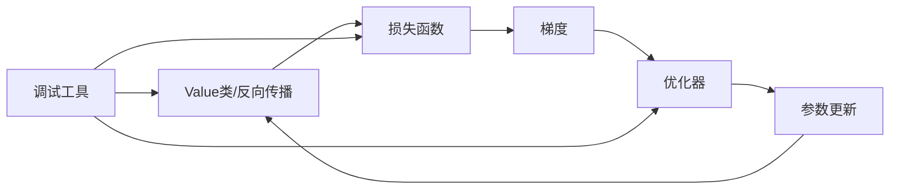

# 反向传播与梯度下降

<cite>
**本文引用的文件**
- [反向传播（Python）](file://phases/03-deep-learning-core/03-backpropagation/code/main.py)
- [反向传播（文档）](file://phases/03-deep-learning-core/03-backpropagation/docs/en.md)
- [损失函数（Python）](file://phases/03-deep-learning-core/05-loss-functions/code/main.py)
- [损失函数（文档）](file://phases/03-deep-learning-core/05-loss-functions/docs/en.md)
- [优化器（Python）](file://phases/03-deep-learning-core/06-optimizers/code/main.py)
- [优化器（文档）](file://phases/03-deep-learning-core/06-optimizers/docs/en.md)
- [神经网络调试（文档）](file://phases/03-deep-learning-core/13-debugging-neural-networks/docs/en.md)
- [微积分与机器学习（文档）](file://phases/01-math-foundations/04-calculus-for-ml/docs/en.md)
- [链式法则与自动微分（文档）](file://phases/01-math-foundations/05-chain-rule-and-autodiff/docs/en.md)
- [权重初始化可视化脚本](file://site/figures-dl.js)
</cite>

## 目录
1. [引言](#引言)
2. [项目结构](#项目结构)
3. [核心组件](#核心组件)
4. [架构总览](#架构总览)
5. [详细组件分析](#详细组件分析)
6. [依赖关系分析](#依赖关系分析)
7. [性能考量](#性能考量)
8. [故障排查指南](#故障排查指南)
9. [结论](#结论)
10. [附录](#附录)

## 引言
本文件系统性阐述反向传播与梯度下降两大核心机制：从数学原理到工程实现，从损失函数设计到优化器选择，并结合仓库中“从零构建”的教学代码与可视化资源，给出可操作的实践路径与调试方法。读者将理解链式法则如何在计算图上逐层回传梯度，掌握常见损失函数的构造与梯度推导，了解SGD、Adam、RMSprop等优化器的更新规则与适用场景，并学会诊断梯度消失/爆炸等典型问题。

## 项目结构
本主题涉及的代码与文档主要分布在“深度学习核心”与“数学基础”两个阶段：
- 深度学习核心
  - 反向传播：从零实现自动微分引擎、前向/反向传播、训练示例
  - 损失函数：MSE、二分类交叉熵、多分类交叉熵、标签平滑、对比学习损失
  - 优化器：SGD、动量、RMSprop、Adam、AdamW
  - 神经网络调试：损失曲线、梯度统计、激活分布、过拟合单批次测试、学习率扫描
- 数学基础
  - 微积分与机器学习：导数、偏导、梯度、链式法则、雅可比矩阵、泰勒展开
  - 链式法则与自动微分：构建计算图、拓扑排序、反向传播、梯度检查



**图表来源**
- [反向传播（Python）:5-136](file://phases/03-deep-learning-core/03-backpropagation/code/main.py#L5-L136)
- [损失函数（Python）:5-96](file://phases/03-deep-learning-core/05-loss-functions/code/main.py#L5-L96)
- [优化器（Python）:5-82](file://phases/03-deep-learning-core/06-optimizers/code/main.py#L5-L82)
- [神经网络调试（文档）:218-594](file://phases/03-deep-learning-core/13-debugging-neural-networks/docs/en.md#L218-L594)
- [微积分与机器学习（文档）:173-388](file://phases/01-math-foundations/04-calculus-for-ml/docs/en.md#L173-L388)
- [链式法则与自动微分（文档）:27-85](file://phases/01-math-foundations/05-chain-rule-and-autodiff/docs/en.md#L27-L85)

**章节来源**
- [反向传播（Python）:1-242](file://phases/03-deep-learning-core/03-backpropagation/code/main.py#L1-L242)
- [反向传播（文档）:1-471](file://phases/03-deep-learning-core/03-backpropagation/docs/en.md#L1-L471)
- [损失函数（Python）:1-269](file://phases/03-deep-learning-core/05-loss-functions/code/main.py#L1-L269)
- [损失函数（文档）:1-459](file://phases/03-deep-learning-core/05-loss-functions/docs/en.md#L1-L459)
- [优化器（Python）:1-294](file://phases/03-deep-learning-core/06-optimizers/code/main.py#L1-L294)
- [优化器（文档）:1-458](file://phases/03-deep-learning-core/06-optimizers/docs/en.md#L1-L458)
- [神经网络调试（文档）:1-712](file://phases/03-deep-learning-core/13-debugging-neural-networks/docs/en.md#L1-L712)
- [微积分与机器学习（文档）:1-628](file://phases/01-math-foundations/04-calculus-for-ml/docs/en.md#L1-L628)
- [链式法则与自动微分（文档）:1-99](file://phases/01-math-foundations/05-chain-rule-and-autodiff/docs/en.md#L1-L99)

## 核心组件
- 自动微分引擎（Value类）
  - 记录运算节点、子节点集合、局部反传函数；通过拓扑序在反向时累加梯度
  - 支持加法、乘法、sigmoid、MSE等基本运算的梯度回传
- 神经网络层与训练循环
  - Neuron/Layer/Network定义前向计算与参数收集；训练循环执行前向、累计损失、反向、参数更新
- 损失函数族
  - 均方误差（回归）、二分类交叉熵（概率校准）、多分类交叉熵（softmax组合简化）、对比学习损失（InfoNCE）
- 优化器族
  - SGD、SGD+动量、RMSprop、Adam（含偏差修正）、AdamW（解耦权重衰减）
- 调试工具
  - 损失健康度检测、激活统计、梯度统计、过拟合一小批测试、学习率扫描、梯度检查

**章节来源**
- [反向传播（Python）:5-136](file://phases/03-deep-learning-core/03-backpropagation/code/main.py#L5-L136)
- [损失函数（Python）:5-96](file://phases/03-deep-learning-core/05-loss-functions/code/main.py#L5-L96)
- [优化器（Python）:5-82](file://phases/03-deep-learning-core/06-optimizers/code/main.py#L5-L82)
- [神经网络调试（文档）:218-594](file://phases/03-deep-learning-core/13-debugging-neural-networks/docs/en.md#L218-L594)

## 架构总览
下图展示了从输入到损失再到梯度回传的整体流程，以及损失函数与优化器在训练循环中的位置。

```mermaid
sequenceDiagram
participant U as "用户代码"
participant NET as "网络模型"
participant LOSS as "损失函数"
participant BP as "反向传播(Value)"
participant OPT as "优化器"
U->>NET : 前向预测
NET-->>U : 预测值
U->>LOSS : 计算损失(预测, 标签)
LOSS-->>U : 标量损失
U->>BP : loss.backward()
BP-->>U : 每个参数的梯度
U->>OPT : step(参数, 梯度)
OPT-->>U : 更新后的参数
```

**图表来源**
- [反向传播（Python）:61-76](file://phases/03-deep-learning-core/03-backpropagation/code/main.py#L61-L76)
- [损失函数（Python）:7-11](file://phases/03-deep-learning-core/05-loss-functions/code/main.py#L7-L11)
- [优化器（Python）:9-11](file://phases/03-deep-learning-core/06-optimizers/code/main.py#L9-L11)

## 详细组件分析

### 反向传播：链式法则与自动微分
- 数学基础
  - 链式法则：复合函数的导数等于各段导数连乘；在神经网络中即为“从输出到输入”的梯度回传
  - 计算图：每个节点代表一次运算，边携带前向值与反向梯度
  - 雅可比矩阵：当映射是向量到向量时，导数为矩阵；反向传播按该矩阵的转置方向传递梯度
- 实现要点
  - Value类记录数据、梯度、子节点与局部反传函数
  - 反向时先拓扑排序，再逆序遍历，调用每个节点的局部反传函数累加梯度
  - 局部反传函数直接使用前向阶段已缓存的中间值，避免重复计算
- 典型梯度
  - 加法：对每个输入梯度均为输出梯度
  - 乘法：输入梯度为另一输入与输出梯度的乘积
  - Sigmoid：梯度为激活值×(1-激活值)×输出梯度
  - MSE：对预测的梯度为线性缩放



**图表来源**
- [反向传播（文档）:222-244](file://phases/03-deep-learning-core/03-backpropagation/docs/en.md#L222-L244)
- [反向传播（Python）:61-76](file://phases/03-deep-learning-core/03-backpropagation/code/main.py#L61-L76)

**章节来源**
- [反向传播（文档）:27-101](file://phases/03-deep-learning-core/03-backpropagation/docs/en.md#L27-L101)
- [微积分与机器学习（文档）:326-388](file://phases/01-math-foundations/04-calculus-for-ml/docs/en.md#L326-L388)
- [链式法则与自动微分（文档）:27-85](file://phases/01-math-foundations/05-chain-rule-and-autodiff/docs/en.md#L27-L85)
- [反向传播（Python）:5-76](file://phases/03-deep-learning-core/03-backpropagation/code/main.py#L5-L76)

### 损失函数：类型、梯度与选择策略
- 均方误差（MSE）
  - 形式：平均平方差；对大误差惩罚更强，易受异常值影响
  - 梯度：与误差线性相关，适于回归但不适合分类
- 二分类交叉熵（BCE）
  - 形式：-[y log p + (1-y) log (1-p)]；对错误且置信的预测施加强惩罚
  - 梯度：当p接近0或1时梯度趋于无穷，需数值稳定（log(0)裁剪）
- 多分类交叉熵（CCE）
  - 形式：-Σ y_i log p_i；与softmax组合时梯度简化为p - y
  - 标签平滑：将硬目标改为软目标，抑制过拟合与过自信
- 对比学习损失（InfoNCE）
  - 形式：负对数似然在相似对上的分布；温度参数控制分布尖锐程度
- 选择策略
  - 回归：MSE（对异常值敏感时可用Huber/MAE）
  - 二分类：BCE（注意数值稳定性）
  - 多分类：CCE（配合softmax）
  - 表征学习：InfoNCE/Triplet等



**图表来源**
- [损失函数（文档）:154-174](file://phases/03-deep-learning-core/05-loss-functions/docs/en.md#L154-L174)

**章节来源**
- [损失函数（文档）:29-174](file://phases/03-deep-learning-core/05-loss-functions/docs/en.md#L29-L174)
- [损失函数（Python）:5-96](file://phases/03-deep-learning-core/05-loss-functions/code/main.py#L5-L96)

### 优化器：SGD、动量、RMSprop、Adam与AdamW
- SGD
  - 规则：w = w - lr × ∇w；简单但易震荡、对全局学习率敏感
- SGD + 动量
  - 规则：累积历史梯度，抑制震荡，加速一致方向
- RMSprop
  - 规则：按参数维度自适应缩放学习率，缓解梯度尺度差异
- Adam
  - 规则：一阶矩估计（动量）+ 二阶矩估计（RMS）；首步偏差修正
- AdamW
  - 规则：在Adam更新后对权重施加解耦的权重衰减，提升泛化
- 学习率调度
  - 热身+余弦退火等策略常用于Transformer/扩散模型等



**图表来源**
- [优化器（Python）:5-82](file://phases/03-deep-learning-core/06-optimizers/code/main.py#L5-L82)

**章节来源**
- [优化器（文档）:33-165](file://phases/03-deep-learning-core/06-optimizers/docs/en.md#L33-L165)
- [优化器（Python）:5-82](file://phases/03-deep-learning-core/06-optimizers/code/main.py#L5-L82)

### 梯度消失与爆炸：成因与对策
- 成因
  - 深层网络中，梯度沿反向链路逐层相乘；某些激活（如sigmoid/tanh）导数最大值小于1，叠加导致早期梯度指数级衰减
  - 反之，若梯度放大（如深层RNN/未归一化的权重），可能导致权重爆炸
- 对策
  - 使用ReLU/GELU等非饱和激活
  - 权重初始化（Xavier/He）保持信号方差稳定
  - 批归一化（BN）稳定每层输入分布
  - 梯度裁剪（按范数截断）防止爆炸
  - 学习率过大、log(0)、除零等也会引发NaN/Inf



**图表来源**
- [神经网络调试（文档）:53-212](file://phases/03-deep-learning-core/13-debugging-neural-networks/docs/en.md#L53-L212)
- [权重初始化可视化脚本:247-299](file://site/figures-dl.js#L247-L299)

**章节来源**
- [神经网络调试（文档）:53-212](file://phases/03-deep-learning-core/13-debugging-neural-networks/docs/en.md#L53-L212)
- [反向传播（文档）:87-101](file://phases/03-deep-learning-core/03-backpropagation/docs/en.md#L87-L101)
- [权重初始化可视化脚本:247-299](file://site/figures-dl.js#L247-L299)

## 依赖关系分析
- 反向传播依赖于计算图与拓扑排序，确保梯度按正确顺序回传
- 损失函数决定梯度的“目标方向”，不同任务应选合适损失
- 优化器决定参数更新策略，直接影响收敛速度与稳定性
- 调试工具贯穿训练全流程，帮助定位学习率、梯度、数据等问题



**图表来源**
- [反向传播（Python）:61-76](file://phases/03-deep-learning-core/03-backpropagation/code/main.py#L61-L76)
- [损失函数（Python）:5-96](file://phases/03-deep-learning-core/05-loss-functions/code/main.py#L5-L96)
- [优化器（Python）:5-82](file://phases/03-deep-learning-core/06-optimizers/code/main.py#L5-L82)
- [神经网络调试（文档）:218-594](file://phases/03-deep-learning-core/13-debugging-neural-networks/docs/en.md#L218-L594)

**章节来源**
- [反向传播（Python）:1-242](file://phases/03-deep-learning-core/03-backpropagation/code/main.py#L1-L242)
- [损失函数（Python）:1-269](file://phases/03-deep-learning-core/05-loss-functions/code/main.py#L1-L269)
- [优化器（Python）:1-294](file://phases/03-deep-learning-core/06-optimizers/code/main.py#L1-L294)
- [神经网络调试（文档）:1-712](file://phases/03-deep-learning-core/13-debugging-neural-networks/docs/en.md#L1-L712)

## 性能考量
- 计算复杂度
  - 反向传播通常与前向计算同阶；通过缓存中间值避免重复计算
  - 损失函数梯度的复杂度取决于具体形式（如softmax+CCE的梯度简化）
- 内存与通信
  - 深度网络需要存储中间激活；可通过梯度检查点等技术权衡内存与速度
- 优化器开销
  - Adam/AdamW引入每参数的一阶/二阶矩估计，内存与计算略增；对大规模训练收益显著
- 数值稳定性
  - 损失函数中log(0)需裁剪；softmax需log-sum-exp技巧；BN需加入epsilon

[本节为通用指导，无需特定文件引用]

## 故障排查指南
- 快速定位
  - 过拟合一小批测试：在极小批次上验证模型能否过拟合，否则训练循环或模型存在根本问题
  - 梯度检查：比较解析梯度与数值梯度（中心差分），相对误差<1e-5视为通过
  - 学习率扫描：指数增长学习率并绘制损失曲线，选取损失开始快速下降之前的约1/10作为合理起点
- 常见症状与对策
  - 损失不降：检查学习率、死ReLU、梯度消失、数据/标签问题
  - 损失NaN：学习率过高、log(0)、BN分母为0、数值溢出
  - 梯度爆炸：梯度裁剪、降低学习率、规范化、检查初始化
  - 梯度消失：换用ReLU/GELU、残差连接、BN、更合适的初始化

**章节来源**
- [神经网络调试（文档）:87-212](file://phases/03-deep-learning-core/13-debugging-neural-networks/docs/en.md#L87-L212)
- [反向传播（文档）:87-101](file://phases/03-deep-learning-core/03-backpropagation/docs/en.md#L87-L101)
- [损失函数（文档）:214-268](file://phases/03-deep-learning-core/05-loss-functions/docs/en.md#L214-L268)

## 结论
反向传播与梯度下降构成了现代深度学习的核心：前者通过链式法则在计算图上高效回传梯度，后者以梯度为向导迭代优化参数。选择合适的损失函数与优化器、配合稳健的初始化与调试手段，是取得高质量训练结果的关键。仓库中的“从零实现”代码与可视化资源，为理解与实践这些概念提供了清晰路径。

[本节为总结性内容，无需特定文件引用]

## 附录
- 实践建议
  - 先用小批量过拟合测试验证训练循环
  - 使用梯度检查确认反向实现正确
  - 采用学习率扫描确定初始学习率范围
  - 遇到异常优先检查学习率与数值稳定性
- 参考实现路径
  - 反向传播：Value类、Neuron/Layer/Network、训练循环
  - 损失函数：MSE、BCE、CCE、对比学习损失
  - 优化器：SGD、动量、RMSprop、Adam、AdamW
  - 调试：损失健康度、激活统计、梯度统计、过拟合一小批、学习率扫描、梯度检查

**章节来源**
- [反向传播（Python）:136-242](file://phases/03-deep-learning-core/03-backpropagation/code/main.py#L136-L242)
- [损失函数（Python）:186-269](file://phases/03-deep-learning-core/05-loss-functions/code/main.py#L186-L269)
- [优化器（Python）:218-294](file://phases/03-deep-learning-core/06-optimizers/code/main.py#L218-L294)
- [神经网络调试（文档）:218-594](file://phases/03-deep-learning-core/13-debugging-neural-networks/docs/en.md#L218-L594)