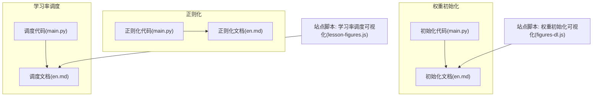
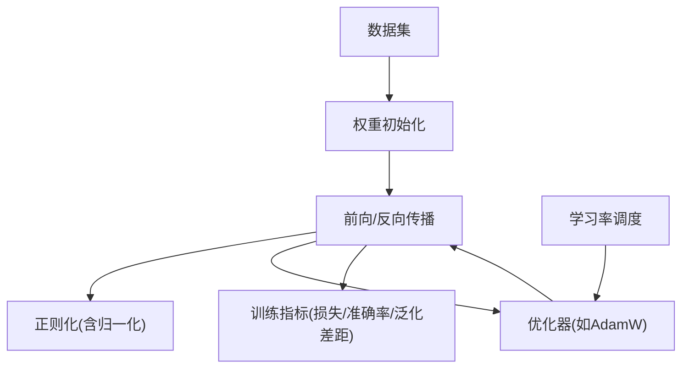
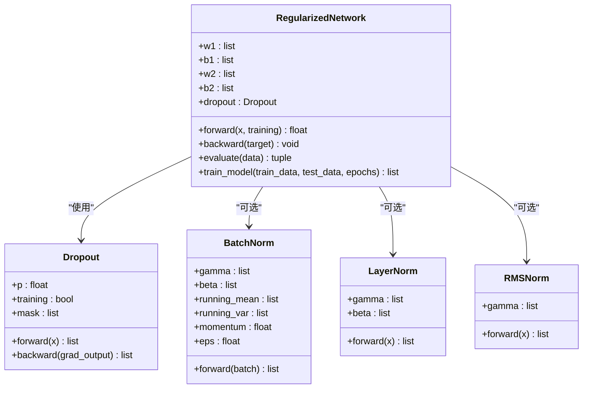
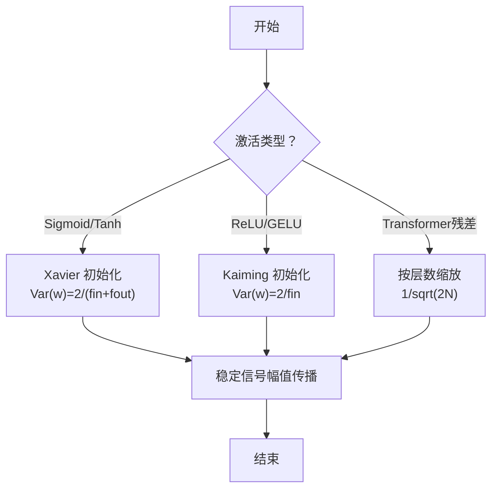
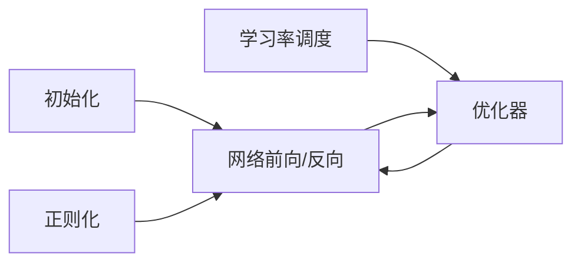

# 模型优化技术

<cite>
**本文引用的文件**
- [phases/03-deep-learning-core/07-regularization/code/main.py](file://phases/03-deep-learning-core/07-regularization/code/main.py)
- [phases/03-deep-learning-core/07-regularization/docs/en.md](file://phases/03-deep-learning-core/07-regularization/docs/en.md)
- [phases/03-deep-learning-core/08-weight-initialization/code/main.py](file://phases/03-deep-learning-core/08-weight-initialization/code/main.py)
- [phases/03-deep-learning-core/08-weight-initialization/docs/en.md](file://phases/03-deep-learning-core/08-weight-initialization/docs/en.md)
- [phases/03-deep-learning-core/09-learning-rate-schedules/code/main.py](file://phases/03-deep-learning-core/09-learning-rate-schedules/code/main.py)
- [phases/03-deep-learning-core/09-learning-rate-schedules/docs/en.md](file://phases/03-deep-learning-core/09-learning-rate-schedules/docs/en.md)
- [site/figures-dl.js](file://site/figures-dl.js)
- [site/lesson-figures.js](file://site/lesson-figures.js)
- [phases/01-math-foundations/08-optimization/docs/en.md](file://phases/01-math-foundations/08-optimization/docs/en.md)
</cite>

## 目录
1. [引言](#引言)
2. [项目结构](#项目结构)
3. [核心组件](#核心组件)
4. [架构总览](#架构总览)
5. [详细组件分析](#详细组件分析)
6. [依赖关系分析](#依赖关系分析)
7. [性能考量](#性能考量)
8. [故障排查指南](#故障排查指南)
9. [结论](#结论)
10. [附录](#附录)

## 引言
本文件系统性梳理与实操模型优化的关键技术：正则化（L1/L2、Dropout、Batch/Group/Layer/RMSNorm）、权重初始化（Xavier/Glorot、Kaiming/He 等）以及学习率调度（常数、阶梯衰减、指数衰减、余弦退火、预热+余弦、1cycle）。通过仓库中的教学代码与可视化脚本，给出可直接复用的实现路径、参数调优建议与最佳实践，并提供性能监控与超参搜索的落地方法。

## 项目结构
围绕“模型优化”主题，相关资料分布在三个模块：
- 正则化模块：提供从零实现的 Dropout、L2 权重衰减、BatchNorm、LayerNorm、RMSNorm，并通过二分类任务演示训练对比。
- 权重初始化模块：系统推导 Xavier/Kaiming 的方差公式，演示对深层网络激活幅值传播的影响，并给出针对不同激活函数的匹配策略。
- 学习率调度模块：实现多种调度器并进行收敛行为对比，强调预热对自适应优化器的重要性。

此外，站点脚本提供了权重初始化方差与学习率调度的可视化交互，便于直观理解。



图示来源
- [phases/03-deep-learning-core/07-regularization/code/main.py:1-348](file://phases/03-deep-learning-core/07-regularization/code/main.py#L1-L348)
- [phases/03-deep-learning-core/07-regularization/docs/en.md:1-533](file://phases/03-deep-learning-core/07-regularization/docs/en.md#L1-L533)
- [phases/03-deep-learning-core/08-weight-initialization/code/main.py:1-274](file://phases/03-deep-learning-core/08-weight-initialization/code/main.py#L1-L274)
- [phases/03-deep-learning-core/08-weight-initialization/docs/en.md:1-384](file://phases/03-deep-learning-core/08-weight-initialization/docs/en.md#L1-L384)
- [phases/03-deep-learning-core/09-learning-rate-schedules/code/main.py:1-241](file://phases/03-deep-learning-core/09-learning-rate-schedules/code/main.py#L1-L241)
- [phases/03-deep-learning-core/09-learning-rate-schedules/docs/en.md:1-432](file://phases/03-deep-learning-core/09-learning-rate-schedules/docs/en.md#L1-L432)
- [site/figures-dl.js:247-299](file://site/figures-dl.js#L247-L299)
- [site/lesson-figures.js:295-339](file://site/lesson-figures.js#L295-L339)

章节来源
- [phases/03-deep-learning-core/07-regularization/code/main.py:1-348](file://phases/03-deep-learning-core/07-regularization/code/main.py#L1-L348)
- [phases/03-deep-learning-core/08-weight-initialization/code/main.py:1-274](file://phases/03-deep-learning-core/08-weight-initialization/code/main.py#L1-L274)
- [phases/03-deep-learning-core/09-learning-rate-schedules/code/main.py:1-241](file://phases/03-deep-learning-core/09-learning-rate-schedules/code/main.py#L1-L241)

## 核心组件
- 正则化
  - Dropout：随机置零神经元并在训练时做反向缩放；推理时关闭或按比例缩放输出。
  - L2 权重衰减：在损失中加入权重平方项，训练时对权重施加收缩梯度。
  - 归一化：BatchNorm（批内归一化）、LayerNorm（特征维度归一化）、RMSNorm（仅按范数缩放）。
- 权重初始化
  - Xavier/Glorot：Var(w) = 2/(fan_in + fan_out)，适合 sigmoid/tanh。
  - Kaiming/He：Var(w) = 2/fan_in，适合 ReLU/GELU。
  - 对称破缺：零初始化导致所有神经元相同，需随机初始化。
- 学习率调度
  - 常数、阶梯衰减、指数衰减、余弦退火、预热+余弦、1cycle。
  - 预热用于稳定 Adam 等自适应优化器的初期统计量。

章节来源
- [phases/03-deep-learning-core/07-regularization/docs/en.md:42-188](file://phases/03-deep-learning-core/07-regularization/docs/en.md#L42-L188)
- [phases/03-deep-learning-core/08-weight-initialization/docs/en.md:57-162](file://phases/03-deep-learning-core/08-weight-initialization/docs/en.md#L57-L162)
- [phases/03-deep-learning-core/09-learning-rate-schedules/docs/en.md:29-141](file://phases/03-deep-learning-core/09-learning-rate-schedules/docs/en.md#L29-L141)

## 架构总览
下图展示了三类优化技术在训练流水线中的位置与交互：初始化决定信号稳定性，正则化缓解过拟合并改善泛化，学习率调度控制收敛速度与最终精度。



图示来源
- [phases/03-deep-learning-core/07-regularization/code/main.py:143-230](file://phases/03-deep-learning-core/07-regularization/code/main.py#L143-L230)
- [phases/03-deep-learning-core/08-weight-initialization/code/main.py:166-218](file://phases/03-deep-learning-core/08-weight-initialization/code/main.py#L166-L218)
- [phases/03-deep-learning-core/09-learning-rate-schedules/code/main.py:76-126](file://phases/03-deep-learning-core/09-learning-rate-schedules/code/main.py#L76-L126)

## 详细组件分析

### 正则化：Dropout、L2、BatchNorm/LayerNorm/RMSNorm
- Dropout 实现要点
  - 训练时以概率 p 将神经元输出置零，并在训练时做 1/(1-p) 缩放；推理时关闭或保持输出不变。
  - 反向传播时仅传递非零路径的梯度。
- L2 权重衰减
  - 在损失中添加权重平方项；训练时对权重施加 -λw 的梯度，抑制大权重。
- 归一化家族
  - BatchNorm：按批次统计均值/方差，训练使用批统计，推理使用运行时统计。
  - LayerNorm：按样本的特征维度归一化，适合变长序列与小批量。
  - RMSNorm：仅按范数缩放，跳过均值计算，速度略快且精度相当。
- 实践建议
  - 过拟合严重时优先组合：Dropout（0.2–0.5）、L2（AdamW 上 0.001–0.01）、LayerNorm（Transformer）或 RMSNorm（LLaMA/Mistral）。
  - 注意：训练/推理模式切换与 BatchNorm 的运行时统计更新。



图示来源
- [phases/03-deep-learning-core/07-regularization/code/main.py:5-33](file://phases/03-deep-learning-core/07-regularization/code/main.py#L5-L33)
- [phases/03-deep-learning-core/07-regularization/code/main.py:46-90](file://phases/03-deep-learning-core/07-regularization/code/main.py#L46-L90)
- [phases/03-deep-learning-core/07-regularization/code/main.py:93-110](file://phases/03-deep-learning-core/07-regularization/code/main.py#L93-L110)
- [phases/03-deep-learning-core/07-regularization/code/main.py:113-124](file://phases/03-deep-learning-core/07-regularization/code/main.py#L113-L124)
- [phases/03-deep-learning-core/07-regularization/code/main.py:143-230](file://phases/03-deep-learning-core/07-regularization/code/main.py#L143-L230)

章节来源
- [phases/03-deep-learning-core/07-regularization/code/main.py:5-33](file://phases/03-deep-learning-core/07-regularization/code/main.py#L5-L33)
- [phases/03-deep-learning-core/07-regularization/code/main.py:35-44](file://phases/03-deep-learning-core/07-regularization/code/main.py#L35-L44)
- [phases/03-deep-learning-core/07-regularization/code/main.py:46-90](file://phases/03-deep-learning-core/07-regularization/code/main.py#L46-L90)
- [phases/03-deep-learning-core/07-regularization/code/main.py:93-124](file://phases/03-deep-learning-core/07-regularization/code/main.py#L93-L124)
- [phases/03-deep-learning-core/07-regularization/docs/en.md:42-188](file://phases/03-deep-learning-core/07-regularization/docs/en.md#L42-L188)

### 权重初始化：Xavier/Kaiming 与对称破缺
- 数学原理
  - Xavier：Var(w) = 2/(fan_in + fan_out)，使前向与反向传播的方差稳定，适用于 sigmoid/tanh。
  - Kaiming：Var(w) = 2/fan_in，补偿 ReLU 导致的一半输入为零，适用于 ReLU/GELU。
- 对称破缺
  - 零初始化会使所有神经元输出相同，无法学习；必须使用随机初始化。
- 实践建议
  - 选择与激活匹配的初始化；深层网络建议配合合适的归一化与正则化。
  - 可借助可视化脚本观察不同策略下的激活幅值传播趋势。



图示来源
- [phases/03-deep-learning-core/08-weight-initialization/docs/en.md:57-107](file://phases/03-deep-learning-core/08-weight-initialization/docs/en.md#L57-L107)
- [site/figures-dl.js:247-299](file://site/figures-dl.js#L247-L299)

章节来源
- [phases/03-deep-learning-core/08-weight-initialization/code/main.py:13-21](file://phases/03-deep-learning-core/08-weight-initialization/code/main.py#L13-L21)
- [phases/03-deep-learning-core/08-weight-initialization/docs/en.md:57-107](file://phases/03-deep-learning-core/08-weight-initialization/docs/en.md#L57-L107)
- [site/figures-dl.js:247-299](file://site/figures-dl.js#L247-L299)

### 学习率调度：从常数到预热+余弦
- 调度器实现
  - 常数、阶梯衰减、指数衰减、余弦退火、预热+余弦、1cycle。
- 关键洞察
  - 预热：稳定 Adam 等自适应优化器的初期统计量，避免早期不稳定。
  - 余弦退火：平滑从峰值降到最小值，兼顾前期加速与后期收敛。
  - 1cycle：先升后降，作为快速收敛的替代方案。
- 参数建议
  - 预热占总步数的 1–5%；余弦退火的最小学习率通常设为峰值的 1/10 左右；1cycle 需提前确定总步数。

```mermaid
sequenceDiagram
participant Trainer as "训练循环"
participant Scheduler as "学习率调度器"
participant Model as "模型"
participant Opt as "优化器"
Trainer->>Scheduler : 请求当前学习率(step)
Scheduler-->>Trainer : 返回 lr
Trainer->>Model : 前向/反向
Model-->>Trainer : 损失与梯度
Trainer->>Opt : 应用梯度与 lr
Opt-->>Trainer : 更新参数
Trainer->>Scheduler : step()
```

图示来源
- [phases/03-deep-learning-core/09-learning-rate-schedules/code/main.py:76-126](file://phases/03-deep-learning-core/09-learning-rate-schedules/code/main.py#L76-L126)
- [phases/03-deep-learning-core/09-learning-rate-schedules/docs/en.md:65-90](file://phases/03-deep-learning-core/09-learning-rate-schedules/docs/en.md#L65-L90)

章节来源
- [phases/03-deep-learning-core/09-learning-rate-schedules/code/main.py:5-35](file://phases/03-deep-learning-core/09-learning-rate-schedules/code/main.py#L5-L35)
- [phases/03-deep-learning-core/09-learning-rate-schedules/docs/en.md:29-141](file://phases/03-deep-learning-core/09-learning-rate-schedules/docs/en.md#L29-L141)
- [site/lesson-figures.js:295-339](file://site/lesson-figures.js#L295-L339)

## 依赖关系分析
- 组件耦合
  - 正则化与初始化共同影响信号幅值传播与数值稳定性；调度器影响收敛速度与最终精度。
- 外部依赖
  - PyTorch 提供标准化模块（如 BatchNorm、LayerNorm、Dropout、AdamW、学习率调度器），可直接替换教学实现用于生产。
- 可能的环路
  - 代码层无循环导入；调度器与训练循环通过函数接口解耦。



图示来源
- [phases/03-deep-learning-core/07-regularization/code/main.py:143-230](file://phases/03-deep-learning-core/07-regularization/code/main.py#L143-L230)
- [phases/03-deep-learning-core/08-weight-initialization/code/main.py:166-218](file://phases/03-deep-learning-core/08-weight-initialization/code/main.py#L166-L218)
- [phases/03-deep-learning-core/09-learning-rate-schedules/code/main.py:76-126](file://phases/03-deep-learning-core/09-learning-rate-schedules/code/main.py#L76-L126)

章节来源
- [phases/03-deep-learning-core/07-regularization/code/main.py:143-230](file://phases/03-deep-learning-core/07-regularization/code/main.py#L143-L230)
- [phases/03-deep-learning-core/08-weight-initialization/code/main.py:166-218](file://phases/03-deep-learning-core/08-weight-initialization/code/main.py#L166-L218)
- [phases/03-deep-learning-core/09-learning-rate-schedules/code/main.py:76-126](file://phases/03-deep-learning-core/09-learning-rate-schedules/code/main.py#L76-L126)

## 性能考量
- 计算效率
  - RMSNorm 比 LayerNorm 稍快约 10%，在大规模模型中收益显著。
  - Dropout 推理时关闭或按比例缩放，避免额外分支判断。
- 收敛与稳定性
  - 合理的初始化与归一化可减少梯度爆炸/消失，提升收敛速度。
  - 预热+余弦退火在自适应优化器上更稳健；1cycle 在预算受限时更快。
- 内存占用
  - BatchNorm 需维护运行时均值/方差；LayerNorm/RMSNorm 不依赖批次大小，适合变长序列。

## 故障排查指南
- 训练不收敛或发散
  - 检查学习率是否过高（发散）或过低（停滞）；尝试常数学习率敏感性扫描定位区间。
  - 若使用自适应优化器，确认已启用预热。
- 过拟合严重
  - 增加 Dropout（0.2–0.5）、引入 L2（AdamW 上 0.001–0.01）；在 Transformer 中优先 LayerNorm/RMSNorm。
- 激活/梯度爆炸/消失
  - 使用 Kaiming（ReLU/GELU）或 Xavier（Sigmoid/Tanh）初始化；结合 LayerNorm/RMSNorm。
- 调度器问题
  - 确认总步数与 warmup 步数设置；若提前停止，检查是否正确保存/加载最佳模型。

章节来源
- [phases/03-deep-learning-core/09-learning-rate-schedules/code/main.py:148-170](file://phases/03-deep-learning-core/09-learning-rate-schedules/code/main.py#L148-L170)
- [phases/03-deep-learning-core/07-regularization/docs/en.md:165-168](file://phases/03-deep-learning-core/07-regularization/docs/en.md#L165-L168)
- [phases/03-deep-learning-core/08-weight-initialization/docs/en.md:17-26](file://phases/03-deep-learning-core/08-weight-initialization/docs/en.md#L17-L26)

## 结论
- 初始化决定训练能否起步，正则化决定泛化能力，调度器决定收敛速度与最终精度。
- 生产环境建议采用：Xavier/Kaiming 初始化 + LayerNorm/RMSNorm + AdamW + 预热+余弦退火。
- 通过可视化与实验对比，可快速定位问题并迭代优化。

## 附录
- 实践清单
  - 初始化：根据激活选择 Xavier/Kaiming；深层网络考虑残差缩放。
  - 正则化：先从 Dropout 与 L2 开始，再引入归一化；注意训练/推理模式切换。
  - 调度：默认预热+余弦；预算紧张可用 1cycle；严格控制 warmup 百分比。
- 参考实现路径
  - 正则化：[正则化代码:5-33](file://phases/03-deep-learning-core/07-regularization/code/main.py#L5-L33)、[正则化文档:42-188](file://phases/03-deep-learning-core/07-regularization/docs/en.md#L42-L188)
  - 初始化：[初始化代码:13-21](file://phases/03-deep-learning-core/08-weight-initialization/code/main.py#L13-L21)、[初始化文档:57-107](file://phases/03-deep-learning-core/08-weight-initialization/docs/en.md#L57-L107)
  - 调度：[调度代码:5-35](file://phases/03-deep-learning-core/09-learning-rate-schedules/code/main.py#L5-L35)、[调度文档:29-141](file://phases/03-deep-learning-core/09-learning-rate-schedules/docs/en.md#L29-L141)
  - 可视化：[权重初始化可视化:247-299](file://site/figures-dl.js#L247-L299)、[学习率调度可视化:295-339](file://site/lesson-figures.js#L295-L339)
  - 优化器与数学背景：[优化器与学习率调度数学:121-155](file://phases/01-math-foundations/08-optimization/docs/en.md#L121-L155)